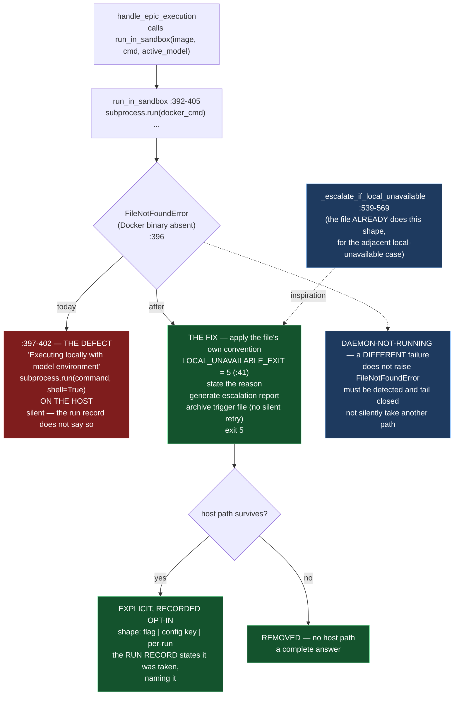

# Epic E42.1 — Sandbox Absence Fails Closed

## Context

M42 exists to close one disposition across four `bin/` paths: *when the evidence that should gate an
action is absent, the action proceeds.* E42.1 is the first of those four paths, and the one the
agentic lane physically runs through.

`bin/ai-project-orchestrator` runs a dispatched model's command inside a Docker sandbox. The sandbox
is the only thing standing between a dispatched model and the operator's machine — and its absence is
currently handled by **removing it**: a `FileNotFoundError` on the Docker invocation falls through to
`subprocess.run(command, shell=True, ...)` on the **host**. Statement `:398` prints
*"[!] Docker is not installed or available. Executing locally with model environment..."* and then
executes the model's command unsandboxed. That is isolation failing **open**.

This is not a louder-log fix. The milestone's Hard Constraint and Binding Constraint 6 together rule
that the only surviving host-execution path — if one survives at all — is an **explicitly declared,
recorded** opt-in, and that the **run record states the opt-in was taken**.

**Finding G1 is the reason this epic is low design-risk and high severity.** The file *already* defines
the convention this defect violates, and applies it three hundred lines below the place that ignores
it:

- `LOCAL_UNAVAILABLE_EXIT = 5` is defined at `:41`, documented at `:35-40` as *"5 means 'a local
  resource this run depends on is genuinely unavailable, refuse loudly rather than retry or silently
  fall back'"* — **a sentence that describes the defect**.
- `_escalate_if_local_unavailable` (`:539-569`) is the complete worked shape: state the reason, call
  `generate_escalation_report(..., status=...)`, **archive the trigger file so the run is not silently
  retried**, and `sys.exit(LOCAL_UNAVAILABLE_EXIT)`.

**So this epic applies the file's own convention. It does not invent one.**

E42.2 (epic-scoped staging) edits the same file and is sequenced **after** this epic. The two are
ordered, not parallel, because they edit overlapping regions of one script.

---

## Problem Statement

**When the sandbox is absent, the model runs on the host, and the run record does not say so.**

Three specific failings, each a part of the one defect:

1. **The fallback is silent about what it is.** The only trace that an unsandboxed run happened is a
   `print` to the local console. The discarded tool output, the archived trigger file, the escalation
   record — none of them distinguish *ran in Docker* from *ran on the host*. A reader of the run
   record cannot tell the two apart without access to the invocation.
2. **The fallback is the wrong branch for the wrong reason.** `FileNotFoundError` fires when the
   Docker **binary** is absent — but a daemon that is installed and **not running** raises a different
   failure and must not silently take a different path. The current code collapses "Docker is
   missing" and "Docker is broken" into one silent fallback, and does not even express the latter.
3. **The file already knows better, and the defect sits above that knowledge.** `LOCAL_UNAVAILABLE_EXIT`
   and its worked shape exist in the same file, are documented as *"refuse loudly rather than …
   silently fall back"*, and govern exactly this kind of local-resource failure. The `:396-401`
   fallback is the one place the file ignores its own convention.

**Why "log louder" is not the answer.** Agentic mode is *defined* by no human being present to notice
an absence. A warning printed to a console nobody is watching is the disposition this milestone
exists to end. Absence of isolation must **abort**.

---

## Goals

By the end of this Epic, the system must:

1. **Abort on Docker-absent**, applying `LOCAL_UNAVAILABLE_EXIT = 5` with the file's own worked shape
   (`:539-569`): state the reason, generate an escalation report, archive the trigger file, exit 5.
   The branch at `subprocess.run(command, shell=True, ...)` (`:401`) is **unreachable without an
   explicit opt-in**.
2. **Either remove the host-execution path or make it a declared, recorded opt-in** — and the **run
   record states the opt-in was taken**, naming it, so a reader can tell a sandboxed run from an
   unsandboxed one **without access to the invocation**.
3. **State what "Docker is available" means and how it is detected**, including the daemon-installed-
   but-not-running case, so no adjacent Docker failure silently takes a different path.
4. **Guard the abort with a test, and prove the guard by falsifying it** — the new test fails when the
   abort is removed.

---

## Non-Goals

This Epic explicitly does **not** aim to:

- **Fix `git add .` staged-tree laundering** — that is E42.2's, sequenced after this epic on the same
  file, and this epic must not reserve or coordinate that region beyond the ordering (the milestone
  spec: *the gate is the coordination*).
- **Invent a new exit-code or reporting convention.** `LOCAL_UNAVAILABLE_EXIT` and the escalation-
  plus-archive shape already exist; this epic applies them.
- **Procure, install, or uninstall Docker.** Docker is present on this host (`29.6.1`, verified
  2026-08-19); the absent-Docker path must be **simulated in test**, not exercised by uninstalling
  Docker on a host two other milestones are measuring against.
- **Change who runs the orchestrator, or route model selection.** The `epic_dev`/`epic_qa` lane
  resolution and `DEFAULT_MODELS` are M41's and are already landed.
- **Design the sandbox opt-in for any script other than `bin/ai-project-orchestrator`.**
- **Touch `bin/ai-project-git-merge`, `bin/ai-project-init`, or Drivr.**

---

## Scope of Work

### 1. The abort (D1)

Replace the `FileNotFoundError` fallback at `:396-401` with a fail-closed path that applies the file's
own convention. The worked shape is `_escalate_if_local_unavailable` (`:539-569`): state the reason,
generate an escalation report, archive the trigger file, exit `LOCAL_UNAVAILABLE_EXIT`.

**A known mechanical consideration, stated here so it is handled rather than discovered:** the
fallback lives inside `run_in_sandbox`, which returns a `(returncode, stdout, stderr)` tuple and does
not currently hold `epic_id` or `trigger_file_name`; the escalation shape and the trigger-file archive
live at the **caller** (`handle_epic_execution`). The epic decides the propagation: the clean options
are a distinguished return value (e.g. return `LOCAL_UNAVAILABLE_EXIT` as `returncode` and let the
caller's existing `_escalate_if_local_unavailable` fire) or a raised sentinel the caller catches.
Whichever is chosen, **the reason must reach the record** and **the trigger file must be archived so
the run is not silently retried** — a plain `sys.exit(5)` from inside `run_in_sandbox` would skip both.

### 2. The surviving host path — opt-in or absent (D2)

Decide, and record the reasoning, whether a host-execution path survives at all. **This is the epic's
design decision** (see below). If one survives, it must be an **explicit, declared opt-in** — not a
silent fallback — and:

- the **opt-in shape** (flag, config key, or per-run declaration) is chosen and recorded;
- **the run record states that the opt-in was taken, naming it**, so a reader can distinguish a
  sandboxed run from an unsandboxed one without the invocation;
- an opt-in nobody can observe afterwards is ruled out — *declared-but-unrecorded is a fallback with a
  flag on it* (Binding Constraint 6).

### 3. "Docker is available" — defined and detected (D3)

State what "Docker is available" is taken to mean, and how it is detected:

- `FileNotFoundError` on the binary is the **current, narrow** signal;
- a daemon that is **installed but not running** is a **different failure** (it does not raise
  `FileNotFoundError`) and must not silently take the host path or any other path — it must be
  detected and handled as its own case (failing closed, with a stated reason).

The epic states both, and the record makes the distinction visible.

### 4. The guard and its falsification (D4)

Tests asserting the guard. Minimally:

- Docker-absent (simulated — mock the `subprocess.run` invocation to raise `FileNotFoundError`) does
  **not** reach `subprocess.run(command, shell=True, ...)`.
- The abort produces the escalation-plus-archive record and exits `LOCAL_UNAVAILABLE_EXIT`.
- The opt-in path, if it survives, is only reachable through the declared opt-in **and is recorded as
  taken**.
- **A falsification demonstration**: with the abort removed (the guard deleted), the test **fails** —
  the method B2.1 used. A guard never observed to fail is a guard never observed.

---

## Deliverables

- [ ] **D1** — The `:396-401` fallback replaced by a fail-closed abort applying `LOCAL_UNAVAILABLE_EXIT`
      and the `:539-569` shape (reason, escalation report, trigger-file archive, exit 5)
- [ ] **D2** — The opt-in decision, recorded with its reasoning and its shape; if a host path survives,
      the run record states the opt-in was taken, naming it
- [ ] **D3** — The stated meaning of "Docker is available" and its detection, including the
      daemon-not-running case handled as its own fail-closed path
- [ ] **D4** — Tests guarding the abort and the opt-in, with the falsification demonstration
- [ ] Structural diagram (Mermaid, in-repo, no ComfyUI)
- [ ] **Epic Delivery Notice**

---

## Binding Constraints

Settled above this epic — **not re-decidable here**:

1. **E42.1 is first.** It edits `bin/ai-project-orchestrator` and is sequenced **before** E42.2, which
   edits the same file. The two are ordered, not parallel.
2. **M42 gates M47.** No M47 epic may be dispatched agentically until this milestone closes. A change
   to that order is an escalation, not a decision. *(Not this epic's to discharge; it inherits the
   gate and must not argue against it.)*
3. **No fix is a louder log.** Warning-and-continue does not appear as the disposition of any of the
   four defects, including this one.
4. **A surviving permissive path must be declared AND recorded** (Binding Constraint 6). Declared-but-
   unrecorded is a fallback with a flag on it.
5. **`bin/ai-project-orchestrator` is also edited by M41's terminal epic E41.5** (`DEFAULT_MODELS`,
   `:27-33`). M42's changes land first **by construction** — E41.5 is gated on this milestone's
   closure. Do not reserve or coordinate that region; the gate is the coordination.

## Hard Constraint (binding — carried to every Epic)

- **Execution posture: `manual` / paid frontier.** This epic modifies the sandbox path — the first
  thing the agentic lane runs through. **The machinery under repair must not supervise its own
  repair.**
- **Prove the guard by falsifying it.** The new test **fails** when the abort is removed.
- **Cite by anchor, not by bare line number.** `bin/ai-project-orchestrator` shifted +4 when #236
  edited `DEFAULT_MODELS`; the re-pinned numbers live in the milestone spec's drift note. Search for
  the code (`except FileNotFoundError:`, `subprocess.run(command, shell=True`,
  `LOCAL_UNAVAILABLE_EXIT = 5`, `sys.exit(LOCAL_UNAVAILABLE_EXIT)`); use the number only to say where
  it was, at a stated ref and date.
- **`--include='*.py'` skips every `bin/` entry point**, where this defect lives. Falsify any pattern
  before trusting a zero result.
- **An absence is only evidence when the thing that would have created it actually ran.**

---

## Design Decisions Delegated — decide, document, proceed

1. **The opt-in's shape** — flag, config key, or per-run declaration (milestone spec lists this as
   E42.1's decision). **Not open:** the run record must state the opt-in was taken, naming it.
2. **Whether a host path survives at all.** Removal is a permitted and complete answer; a surviving
   path must be a recorded opt-in, never a fallback.
3. **The abort's propagation mechanism** (distinguished return value vs. raised sentinel), within the
   constraint that the reason reaches the record and the trigger file is archived.

---

## Definition of Done

Epic E42.1 is complete when:

- [ ] Docker-absent **no longer reaches** `subprocess.run(command, shell=True, ...)` as a silent fallback
- [ ] The abort uses `LOCAL_UNAVAILABLE_EXIT` and produces the same escalation-plus-archive record the
      script already produces for its other local-unavailable case
- [ ] Any surviving host path is **declared**, and the **run record** states the opt-in was taken
- [ ] "Docker is available" is defined, and the daemon-not-running case is handled as its own
      fail-closed path rather than silently taking a different one
- [ ] The guard is shown to **fail when removed** (falsification)
- [ ] Suite green — no skip introduced to route around the change — with the invocation stated
- [ ] Delivery Notice committed; PR opened to `milestone/M42`

---

## Acceptance Criteria

- [ ] A reader can determine, from committed artifacts alone, what the Docker-absent path did before
      (`shell=True` on the host) and does now (aborts with `LOCAL_UNAVAILABLE_EXIT` and an escalation
      record), and **which test proves it**
- [ ] No `warning-and-continue` appears as the disposition; the abort is not a louder log
- [ ] The run record distinguishes a sandboxed run from an unsandboxed one **without the invocation**
- [ ] The distinction between "Docker missing" and "Docker broken (daemon not running)" is stated and
      each fails closed
- [ ] The opt-in's shape and reasoning are recorded in this epic's own committed artifact
- [ ] Every claim states the layer, time and scope at which it was verified (`P11-GH-2`)

---

## Technical Constraints

**In scope:** `bin/ai-project-orchestrator` (the `run_in_sandbox` sandbox-invocation path and its
caller's escalation shape); the tests guarding this change (under `tests/`, or the script's embedded
suite if that is where the guard belongs — decided at execution with the reason recorded).
**Do not touch:** `:476`'s `git add .` (E42.2's); `DEFAULT_MODELS` / the lane-resolution block
(M41's, landed); `bin/ai-project-git-merge`; `bin/ai-project-init`; anything under `~/soft-dev/drivr`.
**Invocation:** `PYTHONPATH=. pytest -q` — bare `pytest` fails collection.

---

## Dependencies

**Internal**
- **E42.2** is sequenced **after** this epic (both edit `bin/ai-project-orchestrator`).
- **M42 gates M47** and **E41.5** — this epic is part of the milestone whose closure releases both; it
  does not depend on either, it precedes them.

**External**
- **Docker** — present, `29.6.1` (verified 2026-08-19). The absent-Docker path is **simulated in
  test**, not exercised by removing Docker.

**Blockers**
- None at planning.

---

## Timeline

**Estimated Effort:** 1 session.
**Target Completion:** first of the milestone — E42.2 waits on it.
**Actual Completion:** In progress.

---

## Execution Notes

**Order:**
1. Re-read the milestone spec's drift note and confirm the current line numbers **by anchor**, not by
   trusting this spec.
2. Implement the abort applying the `:539-569` shape; decide and document the propagation mechanism.
3. Decide the opt-in (or removal), document it, and make the run record state it.
4. Define and handle the daemon-not-running case.
5. Write the tests, then **delete the guard and watch them fail** (falsification), then restore it.
6. Run the suite; state the invocation and the delta.

**Traps:**
- Framing this as "log louder" — the disposition must be an abort, not a warning.
- `sys.exit(5)` from inside `run_in_sandbox` bypassing the escalation report and the trigger-file
  archive — the reason must reach the record and the run must not be silently retried.
- Confusing "Docker binary absent" with "Docker daemon not running" — neither may take a silent path.
- **Citing a stale line number** — the file drifted +4; search by anchor.

---

## Related Documents

- [M42 Milestone Spec](P12-M42__milestone-spec.md) — Defect 1, Finding G1, E42.1 Epic Detail, Hard Constraint, Binding Constraints
- [P12 Phase Spec](P12__phase-spec.md) — §P12.2 Row 1, §Acceptance Criteria
- [E42.2](P12-M42-E42.2__spec__epic-scoped-staging.md) — sequenced after this epic
- [PROJECT-SYSTEM-GUIDELINES.md](../../../governance/PROJECT-SYSTEM-GUIDELINES.md)
- [AI-OPERATING-GUIDELINES.md](../../../governance/AI-OPERATING-GUIDELINES.md)

---

## Visual Bindings

**Visual binding**
- **Link:** (inline — Structural diagram; no hosted link needed per AOG §16.3/§16.5)
- **What:** diagram
- **Level:** Epic
- **State:** proposed

- **Description:** E42.1 applies the file's own already-present convention to its one
  `FileNotFoundError` path that ignores it. The defect is the silent `shell=True` host fallback at
  `:396-401`; the fix is `LOCAL_UNAVAILABLE_EXIT` plus the worked escalation-and-archive shape the
  same file already applies at `:539-569` for the adjacent local-unavailable case (G1). Two adjacent
  decisions are the epic's: the opt-in's shape (with the run record stating it was taken), and
  distinguishing "Docker binary absent" from "Docker daemon not running", which must each fail closed
  rather than silently take a different path. Proposed-track Structural diagram (AOG §16.3/§16.6),
  Mermaid, no ComfyUI.

---

## Notes

- **This epic applies, it does not invent.** Finding G1 is what lowers the design risk and raises the
  severity: the convention and its complete worked shape are three hundred lines below the place that
  ignores them. A fix that invents a new reporting path where one exists would be re-adding design
  risk the milestone already removed.

- **The opt-in is the sharpest constraint, and it cuts both ways.** An opt-in nobody can observe
  afterwards is a fallback with extra steps (Binding Constraint 6). The claim "the run record states
  it" is not decorative — it is the difference between fail-closed and fail-open wearing a flag.

- **On the +4 line drift, which this epic is the first to inherit.** `bin/ai-project-orchestrator`
  shifted +4 when #236 edited `DEFAULT_MODELS`. The milestone spec re-pinned the numbers on
  `phase/P12` at `3925aea` by **searching for the code, not trusting the number**, and rules that a
  line number is a moving target. This spec cites anchors alongside the re-pinned numbers and
  instructs the executor to re-verify by anchor at start.

---

## Changelog

| Version | Date | Change |
|---|---|---|
| 1.0.0 | 2026-09-01 | Initial E42.1 spec, from M42 spec v1.1.0 (re-pinned line numbers, cited by anchor). Applies Finding G1's already-present `LOCAL_UNAVAILABLE_EXIT` convention and the `:539-569` worked shape to the `:396-401` `shell=True` host fallback. Records the opt-in shape as the epic's decision with the run-record obligation non-negotiable, and the daemon-not-running case as a distinct fail-closed path. Notes the propagation-mechanism consideration (escalation shape and trigger-file archive live at the caller, not inside `run_in_sandbox`). No scope, ordering, gate or acceptance-criterion change from the milestone spec. |
