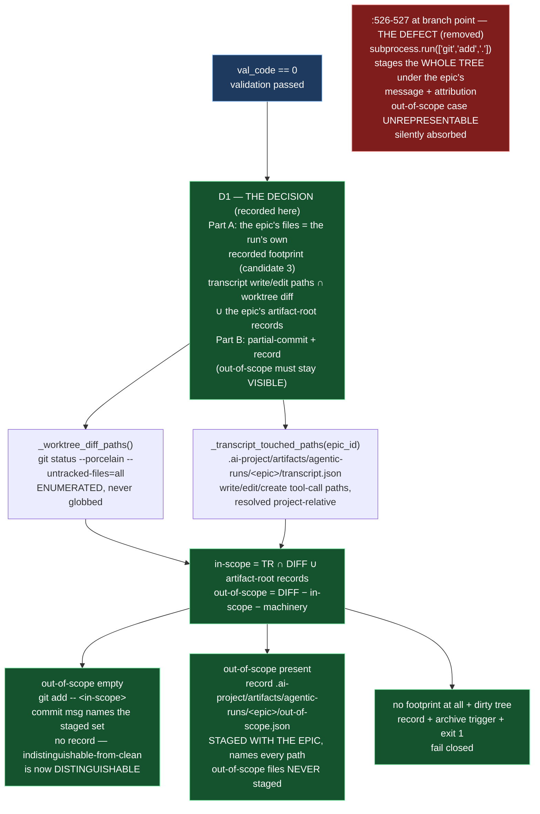

# E42.2 Execution Record — Epic-Scoped Staging

## Layer, time and scope (`P11-GH-2`)

This record is written on `epic/P12-M42-E42.2`, 2026-09-02, from the main worktree whose parent
is `milestone/M42` at `3583815` (the merge-base and this branch's tip are the same commit —
**0 commits drift**, verified by `git rev-list --count HEAD..milestone/M42`). Its code claims are
about `bin/ai-project-orchestrator` on this branch, read directly and **run directly** (both the
pytest suite and the script's embedded `--test` suite); its history claims are from `git log`. It
says nothing about Drivr, which this epic does not touch.

## Model verification (P9-M31-E31.3 — required, this instance is manual)

Harness-reported model identity: **`deepseek-v4-flash`**. `.ai-project.yml` `models.epic_manual`:
**`remote:deepseek-v4-flash`** (read, not trusted from the starter). Both present and agree — no
mismatch to state. Proceeding under `advisory` verification (SN-40).

## The defect, re-verified by anchor (G2 — the reviewer re-measures)

The milestone spec's drift note re-pins every `bin/ai-project-orchestrator` number and **this
branch drifted again**: E42.1 added ~130 lines to the same file. Re-derived by **searching for the
code, not trusting the number**:

| Anchor — searched for | Cited (stale) | **Actual on this branch** | Found |
|---|---|---|---|
| `["git", "add", "."]` | `:476` (spec's re-pin) | **`:526`** (at branch point `3583815`, pre-edit) | yes |
| `f"feat: programmatically implement Epic"` | `:477` (spec's re-pin) | **`:527`** (at branch point `3583815`, pre-edit) | yes |

Both anchors were present before editing, verbatim:

```
subprocess.run(["git", "add", "."], cwd=PROJECT_ROOT)
subprocess.run(["git", "commit", "-m", f"feat: programmatically implement Epic {epic_id} deliverables\n\nResolved via Developer: {dev_model} and QA: {qa_model}"], cwd=PROJECT_ROOT)
```

`git add .` stages the whole worktree from `PROJECT_ROOT`, then commits it under the epic's message
and attribution. **The failure is not sloppiness — it is that the case "the agent touched
something it should not have" has no representation.** Whatever the agent actually did, `git add .`
folds it into one commit that claims to be the epic's deliverables. The out-of-scope modification
is silently absorbed into a commit whose message says otherwise.

## D1 — THE DESIGN DECISION (this is the deliverable, not the edit)

The milestone spec names the option space and holds **one thing not open**: the out-of-scope case
must remain **represented in the record** — `git add .` is rejected not because it is broad but
because it makes that case *invisible*. The epic owns the two-part answer and records its
reasoning here.

### Part A — what "the epic's files" means

**Decision: candidate 3 — the paths the epic's own run recorded as touched — with the epic's own
run-record artifacts folded in as always-in-scope.** Formally:

> **The epic's files = (the write/edit/create tool-call paths recorded in the epic's run
> transcript at `.ai-project/artifacts/agentic-runs/<epic_id>/transcript.json`, resolved to
> project-relative) ∩ (the enumerated working-tree diff), ∪ (the epic's own run-record artifacts
> under that same artifact root).**

The five candidates, weighed explicitly:

1. **Paths declared in the epic spec's Deliverables — rejected.** The epic spec's `## Deliverables`
   are prose descriptions ("The design decision recorded"), not machine-readable path lists. There
   is no committed enumeration to read, and inventing a spec-format convention would be
   retrofitting the planning side from this epic's execution — out of the epic's authority and
   fragile (the milestone's Hard Constraint on naive pattern-matching applies). It also makes the
   definition *declarative-but-inert*: the spec would name what *should* be produced, not what the
   run *did* produce.
2. **Paths under a declared root — rejected.** The epic's work legitimately spans `bin/`, `tests/`,
   `docs/`, `.ai-project/` — no single root bounds an epic's files. "The whole worktree" is the
   only root that contains them, which is the defect.
3. **The diff the agent's own tool calls report as touched — ADOPTED.** `bin/run-dev-agent` writes
   a transcript of the runner's tool calls to a stable, git-visible path
   (`ARTIFACT_ROOT = .ai-project/artifacts/agentic-runs`, `transcript.json`), and the transcripts
   on this repo record **project-relative write/edit paths** (verified on this branch: E33.2-B
   records `write_file local_agent_runner/__init__.py`, `write_file tests/test_public_api.py`;
   E31.2-PROVE records `write_file docs/phases/P9_.../output.md`). This is the agent's own recorded
   footprint — the evidence the milestone says *should* gate the commit. It is not a self-report
   of *scope*; it is a mechanical log of what the run *actually did*. That is precisely the
   distinction the milestone wants: the case "the agent touched something it should not have" now
   has a representation (paths the run touched that are not the epic's), and the case "the tree
   holds something the run never touched" (another session's in-flight work, a stray editor file)
   has one too.
4. **A manifest the agent is required to emit — rejected for retrofit; its *effect* is already
   present.** The epic spec's Non-Goals exclude re-implementing the agent's inner loop, and a
   manifest is only useful if the agent is retrofitted to emit it — out of scope. But the
   transcript *is* a manifest the machinery already emits: it is the runner's own tool-call log,
   written by `run-dev-agent` as a pass-through. Adopting candidate 3 is adopting a manifest that
   already exists, with zero retrofit.
5. **The whole-worktree diff minus a deny-list — rejected.** The milestone spec names this as the
   shape that "reproduces the invisibility one directory narrower": a deny-list can only exclude
   what the planner already knew to exclude, and anything not on it (the file the agent should not
   have touched) is still silently absorbed.

**Why candidate 3 is defensible under agentic operation** (the milestone's question — no human
present to notice the scope was exceeded):

- **It is recorded evidence, not memory.** The transcript is written by the run itself, to a
  committed, stable path, before staging happens. A reader of the commit can re-derive the in-scope
  definition from committed artifacts alone — nothing depends on chat memory or a human noticing.
- **An absence is a finding, not a fallback.** If the transcript is absent, the epic's run left no
  attributable footprint; the definition yields the empty set, and the disposition (below) fails
  closed rather than staging the tree to make up for it. This mirrors the milestone's own
  disposition: *"the agent's file list unknown → stage everything"* was the defect; *unknown →
  stage nothing and record* is its opposite.
- **It makes the `:477` claim testable.** The commit message asserts the staged set *is* the
  epic's deliverables; under this definition the staged set is exactly what the run recorded as
  touching, so the claim is true by construction — and the message now names the actual staged set
  (see D2).

**Boundary of the definition, stated honestly:** the transcript records the paths the agent's
*file* tools wrote. A `run_command` that creates files without a file-tool call is not captured as
a named path — so a file created by a shell command is, by this definition, out-of-scope and gets
recorded rather than absorbed. That is the fail-safe direction: a file that cannot be attributed
to a recorded touch is never silently committed. Reads (`read_file`) are not touches. Absolute
paths that resolve outside `PROJECT_ROOT` (harness scratchpads) cannot map to a project path and
are excluded — they did not land in this tree.

### Part B — what happens when the agent touched something outside that set

**Decision: partial-commit-plus-record — commit the in-scope subset and record the remainder,
with a separate fail-closed branch for "no footprint at all".** The three dispositions, weighed:

- **Abort the commit (and escalate) — rejected.** An abort makes the *whole* epic hostage to the
  first out-of-scope file. Under agentic operation with no human present, an abort that refuses to
  commit anything because `docs/stray.md` exists would strand the epic's legitimate, validated work
  in the worktree with no commit and no route forward. It also collapses the two cases
  (out-of-scope-present vs. in-scope-only) into the same "no commit" outcome unless an escalation
  artifact distinguishes them — which is the partial-commit path with extra ceremony.
- **Commit the in-scope subset and record the remainder — ADOPTED.** The epic's validated work
  lands; every out-of-scope path is written to a record (`.ai-project/artifacts/agentic-runs/
  <epic_id>/out-of-scope.json`) that is *itself committed with the epic*, naming each path and its
  disposition, and the out-of-scope files are left unstaged in the worktree — never folded back
  in under a different `git add`. A reader afterwards can tell the two cases apart structurally:
  in-scope-only → no `out-of-scope.json`; out-of-scope-present → the record exists and names the
  paths.
- **Stage nothing and escalate — adopted as the degenerate branch, not the default.** When the
  transcript is absent *and* the tree is dirty, there is no attributable footprint and no way to
  commit a scoped claim; the epic records the remainder and escalates (trigger archived, exit 1)
  rather than fabricate a commit. This is the empty-set case of candidate 3, and it is what makes
  "an absence is only evidence when the thing that would have created it actually ran" actionable.

### The one thing NOT open — satisfied

The out-of-scope case is **represented in the record and distinguishable from a clean run**: the
record file exists iff out-of-scope was present, and it names the paths. It is never silently
absorbed, and it is never folded back into the epic commit. `git add .` is gone from the staging
site.

## D2 — The scoped staging

`:526`'s `git add .` is replaced by `_stage_and_commit_epic(epic_id, dev_model, qa_model)`:

- **`_worktree_diff_paths()`** enumerates the working-tree diff via
  `git status --porcelain --untracked-files=all` — the enumeration is git's, not a glob. (Robust
  to non-porcelain stdout: a harness that feeds unrelated text cannot fabricate dirty paths.)
- **`_transcript_touched_paths(epic_id)`** reads the run transcript and returns the project-
  relative write/edit/create paths (candidate 3).
- **in-scope** = transcript-touched ∩ diff, ∪ the epic's own artifact-root paths in the diff.
- **out-of-scope** = diff − in-scope (minus the orchestrator's own machinery — the trigger,
  feedback.json, locks, logs — which their own code paths handle and are never epic deliverables).
- The staged set is **enumerated, not globbed**: `git add -- <sorted staged paths>`.

**The `:477` claim is made true.** The commit message keeps
`feat: programmatically implement Epic <id> deliverables` and adds the actual staged set, and,
when out-of-scope is present, states that the remainder was recorded and NOT committed. The claim
now describes what the commit actually contains.

The happy path is not regressed: a clean in-scope-only run stages the epic's work, commits it, and
removes the trigger exactly as before (covered by `test_in_scope_only_stages_the_epics_files` and
by the embedded suite, which remains green).

## D3 — The out-of-scope case, made visible

The record is `.ai-project/artifacts/agentic-runs/<epic_id>/out-of-scope.json`:
`{epic_id, out_of_scope_paths, disposition: "recorded; NOT staged or committed with the epic"}`.
It is **written before staging and staged with the epic**, so the case travels with the commit a
reader can point at. The out-of-scope files themselves are never staged. The record file's
existence is the distinguisher: absent on a clean run, present and naming the paths on an
out-of-scope run.

## D4 — The guards, and the falsification demonstration

Guard tests live in `tests/test_epic_scoped_staging.py` — in `tests/`, **not** the script's
embedded suite, because the milestone's stated invocation is `PYTHONPATH=. pytest -q`, and a guard
pytest does not collect is a guard the reviewer cannot see fail. The file mirrors
`tests/test_sandbox_endpoint_forwarding.py`'s load-as-module + monkeypatch pattern and captures the
`git add` argv exactly as that file captures the `docker run` argv. Four tests:

| Test | Asserts |
|---|---|
| `test_in_scope_only_stages_the_epics_files` | **the in-scope-only branch**: git add argv == `["git","add","--","bin/foo.py","tests/test_foo.py"]`, not `["git","add","."]`; the message names the staged set; no record |
| `test_out_of_scope_is_recorded_not_staged` | **the out-of-scope-present branch**: `docs/stray.md` appears in no `git add` argv, the record exists, names it, and is staged; the message states the remainder was recorded, not absorbed |
| `test_no_footprint_and_dirty_tree_fails_closed` | the degenerate branch: no transcript + dirty tree → `"escalate"`, no add/commit, record written |
| `test_transcript_absolute_path_outside_project_is_ignored` | the definition's boundary: a scratchpad-absolute path cannot fabricate an in-scope file |

**Falsification (Hard Constraint — prove the guard by deleting it), both branches.** Temporarily
replaced the body of `_stage_and_commit_epic` with the removed `subprocess.run(["git","add","."], ...)`
+ `return "committed"` (backup at `/tmp/opencode/orchestrator-e422-guarded.py`, restored
afterwards). Result: **all 4 tests failed** — the in-scope-only test saw the argv collapse back to
`["git", "add", "."]`, and the out-of-scope-present test saw `docs/stray.md` absorbed with **no
record written** (the invisibility the milestone exists to close, reproduced). The guard was then
restored; all 4 green. **A guard observed to fail when removed, on both branches.**

## Suite

`PYTHONPATH=. pytest -q` (bare `pytest` fails collection), run on `epic/P12-M42-E42.2`:
**578 passed / 0 failed**, ~35s. The baseline at this branch's tip was re-measured at
**574 passed / 0 failed** (re-derived, not inherited from the starter's 549 — M41's epics and E42.1
had added tests). **Delta from this epic: +4** (the four new guard tests), zero regressions, **no
skips introduced to route around the change**. The script's embedded suite
(`python3 bin/ai-project-orchestrator --test`) remains **19 tests, OK** — the staging change only
alters the post-validation path, which the embedded suite exercises through mocked `git` commands
and still passes.

## What was verified, not inherited

| Claim | How verified | Result |
|---|---|---|
| The `git add .`/commit anchors existed at the staging site | Searched by anchor, not line number; re-derived on this branch | `:526`/`:527` at branch point `3583815` (drifted +50 from the spec's `:476`/`:477` re-pin — E42.1's changes shifted the region) |
| Candidate 3 is mechanically derivable — transcripts record project-relative write paths | Read E33.2-B and E31.2-PROVE transcripts on this branch | `write_file local_agent_runner/__init__.py`, `write_file tests/test_public_api.py`, `write_file docs/phases/.../output.md` — project-relative, confirmed |
| The transcript path convention is stable and git-visible | Read `bin/run-dev-agent` (`ARTIFACT_ROOT`, `transcript_path`) and `git ls-files` | `.ai-project/artifacts/agentic-runs/<id>/transcript.json`, git-tracked; 9 transcripts tracked |
| The four new tests fail with the guard removed | Replaced the guard body with `git add .`, ran the file | 4/4 failed; restored; 4/4 green |
| The embedded suite is unaffected | `python3 bin/ai-project-orchestrator --test` | 19 tests, OK |
| No amendment reached this branch since the branch point | `git log milestone/M42..HEAD` on the epic spec and milestone spec paths | Empty — no drift, no un-notified write |

## Scope boundaries honored

- E42.1's sandbox-invocation region (`run_in_sandbox`, `_escalate_if_sandbox_unavailable`) —
  **untouched**.
- `DEFAULT_MODELS` / lane-resolution block — **untouched** (M41's).
- The Dev-QA retry loop and trigger-queue removal logic — **untouched** (the removal block below
  the staging site still runs as before).
- `bin/ai-project-git-merge`, `bin/ai-project-init` — **untouched**.
- Drivr — **untouched**.
- Ordering: E42.1 was first; E42.2 edits the staging path below it in the same file. No reservation
  of E42.1's region beyond not touching it.

## Structural diagram (AOG §17.3/§17.6 — Mermaid, in-repo, no ComfyUI)



**Description:** E42.2 replaces `git add .` with staging scoped to the epic's own recorded
footprint: the write/edit/create tool-call paths in the run's transcript (candidate 3), intersected
with the enumerated working-tree diff, plus the epic's artifact-root records. The out-of-scope
remainder is recorded — a committed `out-of-scope.json` naming every path, staged with the epic,
never absorbed — so the two cases are distinguishable afterwards; a run with no footprint at all on
a dirty tree fails closed. The `:477` commit message names the actual staged set, making its
"deliverables" claim true. Proposed-track Structural diagram (AOG §17.3/§17.6), Mermaid, no
ComfyUI.

## Changelog

| Version | Date | Change |
|---|---|---|
| 1.0.0 | 2026-09-02 | Initial record. D1: definition = candidate 3 (the run's own recorded footprint, transcript write/edit paths ∩ worktree diff, ∪ artifact-root records), five candidates weighed; disposition = partial-commit-plus-record with a fail-closed degenerate branch, three dispositions weighed; the out-of-scope-visibility constraint held non-negotiable. D2: `_stage_and_commit_epic` replaces the `git add .` at `:697-698`; staged set enumerated, not globbed; `:477` message names the actual staged set. D3: committed `out-of-scope.json` record under the epic's artifact root. D4: four pytest-collected guards in `tests/`, falsification demonstrated (4/4 fail with the guard removed, on both branches), guard restored. Suite 578 passed / 0 failed (baseline re-measured 574, +4). |
