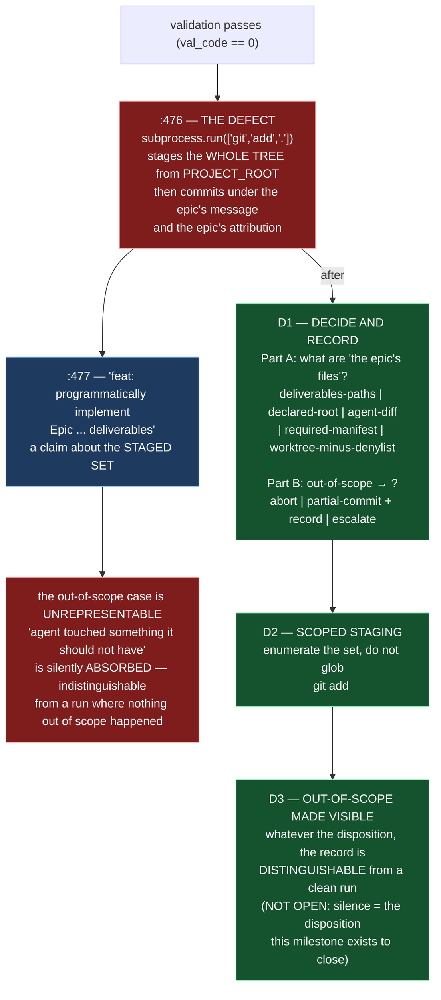

# Epic E42.2 — Epic-Scoped Staging

## Context

M42 exists to close one disposition across four `bin/` paths: *when the evidence that should gate an
action is absent, the action proceeds.* E42.2 is the second path, and shares its file with E42.1.

`bin/ai-project-orchestrator`'s `handle_epic_execution` stages and commits the epic's work after
validation passes. At `:476` it runs `subprocess.run(["git", "add", "."], cwd=PROJECT_ROOT)` and at
`:477` commits **the entire tree** under the epic's message and the epic's attribution:

```
subprocess.run(["git", "add", "."], cwd=PROJECT_ROOT)
subprocess.run(["git", "commit", "-m", f"feat: programmatically implement Epic {epic_id} deliverables\n\n..."], cwd=PROJECT_ROOT)
```

**The failure is not sloppiness — it is that the case "the agent touched something it should not have"
has no representation.** Whatever the agent actually did, `git add .` folds it into one commit that
claims to be the epic's deliverables. The out-of-scope modification is **silently absorbed** into a
commit whose message says otherwise.

This is the milestone's **design-decision** epic. The milestone spec bounds the option space with
finding and names the one non-negotiable; **this epic owns the decision** and records it in its own
artifact.

E42.2 is sequenced **after** E42.1 — both edit `bin/ai-project-orchestrator`, and the two are ordered,
not parallel. E42.1 modified the sandbox-invocation path (`run_in_sandbox`); E42.2 modifies the
staging path further down the same file. The regions are distinct, but the ordering is the
coordination (the milestone spec: *the gate is the coordination*).

---

## Problem Statement

**The commit claims to contain the epic's deliverables, and the claim is unexamined.**

Three specific failings:

1. **`git add .` has no notion of "the epic's files."** It stages the entire worktree under
   `PROJECT_ROOT` — including any unrelated dirty file (another session's in-flight work, a stray
   editor file, a file the agent should not have touched). The commit message then asserts those very
   contents *are* the epic's deliverables.
2. **The out-of-scope case is unrepresentable.** `git add .` makes a run where the agent touched
   something it should not have **indistinguishable from** a run where nothing out of scope happened.
   The case is not merely mishandled; it cannot be said at all.
3. **Silence about an out-of-scope modification is the same disposition this milestone exists to
   close.** The evidence that should gate the commit — *what did the epic actually change* — is
   absent, so the action proceeds on the whole tree.

**Why "stage only some directory" is not automatically the fix.** The design question is real and has
multiple defensible answers; the milestone spec names five candidate definitions of "the epic's
files" and three candidate dispositions for the out-of-scope case. The one thing that is **not open**
is that the out-of-scope case must be **represented in the record** — `git add .` is rejected not
because it is broad but because it makes that case invisible.

---

## Goals

By the end of this Epic, the system must:

1. **Decide and record what "the epic's files" means** — weighing the candidate definitions, stating
   the reasoning, committing the definition in this epic's artifact.
2. **Replace `:476`'s `git add .`** with staging scoped to that definition.
3. **Represent the out-of-scope case in the record** — whatever the disposition (abort, partial commit
   plus record, or escalate), it must be **distinguishable afterwards** from a run where nothing out
   of scope happened.
4. **Guard both branches with tests** — in-scope-only, and out-of-scope-present — and prove each by
   falsification.

---

## Non-Goals

This Epic explicitly does **not** aim to:

- **Change the sandbox-invocation path** — that is E42.1's, already landed and sequenced before this
  epic; this epic must not re-edit or reserve that region beyond the ordering.
- **Change who runs the orchestrator**, the trigger-queue machinery, or the Dev-QA retry loop.
- **Re-implement the agent so it emits a manifest** — a manifest is *one candidate* for "the epic's
  files"; if the decision is to rely on one, that is this epic's to adopt, but retrofitting the
  agent's inner loop is out of scope.
- **Fix the commit message's wording in isolation** without making its claim *true* — the claim must
  be made true of the actual staged set, not reworded around it.
- **Touch `bin/ai-project-git-merge`, `bin/ai-project-init`, or Drivr.**

---

## Scope of Work

### 1. The design decision, recorded (D1)

Decide and commit, in this epic's artifact, the two-part answer the milestone spec names:

**Part A — what "the epic's files" means.** The candidates to weigh explicitly:
- paths declared in the epic spec's **Deliverables**;
- paths under a **declared root**;
- the **diff the agent's own tool calls report as touched**;
- a **manifest the agent is required to emit**;
- the **whole-worktree diff minus a deny-list**.

**Part B — what happens when the agent touched something outside that set:**
- **abort the commit** (and escalate);
- **commit the in-scope subset and record the remainder**;
- **stage nothing and escalate**.

**One thing is not open**, and it is binding either way: **the out-of-scope case must be represented
in the record.** `git add .` is rejected because it produces a commit indistinguishable from a clean
run — **silence about an out-of-scope modification is the disposition this milestone exists to
close.**

The reasoning must state **why** the chosen definition is defensible under agentic operation — where
no human is present to notice the scope was exceeded — and must address the `:477` commit-message
claim: *"programmatically implement Epic … deliverables"* must be **true of what the commit actually
contains** after the change.

### 2. Scoped staging (D2)

Replace `:476`'s `git add .` with staging scoped to the D1 definition. The staged set is enumerated,
not globbed; the commit at `:477` then contains exactly the epic's files. The change must not regress
the happy path: a clean, in-scope-only run still stages and commits the epic's work and removes the
trigger file as it does today.

### 3. The out-of-scope case, made visible (D3)

Whatever D1's Part B answer, the record must let a reader afterwards distinguish:
- *in-scope only — nothing out of scope happened*, from
- *out-of-scope modification was present — here is what it was and what was done about it*.

A partial-commit-plus-record disposition must name the out-of-scope paths and leave them (or record
them) rather than silently folding them into the epic commit. An abort must say why, in the record.

### 4. Tests for both branches (D4)

- **In-scope-only branch:** staging produces the epic's files, not the whole tree — assert the `git
  add` argv is the scoped set, not `["git", "add", "."]` (the load-as-module + monkeypatch pattern in
  `tests/test_sandbox_endpoint_forwarding.py` is the in-repo precedent).
- **Out-of-scope-present branch:** an out-of-scope modification produces the distinguishable, recorded
  outcome — never a commit that looks clean.
- **Falsification demonstrations** for both — delete the guard, watch the test fail.

---

## Deliverables

- [ ] **D1** — The design decision recorded (what "the epic's files" means, and what happens to
      out-of-scope modifications), with the candidate options weighed and the reasoning stated
- [ ] **D2** — `:476`'s `git add .` replaced by staging scoped to that definition
- [ ] **D3** — The out-of-scope case represented in the record, distinguishable from a clean run
- [ ] **D4** — Tests covering both branches, with falsification demonstrations
- [ ] Structural diagram (Mermaid, in-repo, no ComfyUI)
- [ ] **Epic Delivery Notice**

---

## Binding Constraints

Settled above this epic — **not re-decidable here**:

1. **E42.2 is sequenced after E42.1** — both edit `bin/ai-project-orchestrator`; they are ordered, not
   parallel. Do not reserve or re-edit E42.1's region.
2. **M42 gates M47.** No M47 epic may be dispatched agentically until this milestone closes. A change
   to that order is an escalation, not a decision.
3. **The out-of-scope case is not open to being made invisible.** `git add .` is rejected because it
   makes that case indistinguishable from a clean run, not because it is broad (milestone spec: "The
   decision this milestone owes").
4. **The commit-message claim must be true** — `:477`'s *"programmatically implement Epic …
   deliverables"* must describe what the commit actually contains.
5. **`bin/ai-project-orchestrator` is also edited by M41's E41.5** (`DEFAULT_MODELS`, `:27-33`); that
   epic is gated on this milestone's closure. Do not coordinate that region differently; the gate is
   the coordination.

## Hard Constraint (binding — carried to every Epic)

- **Execution posture: `manual` / paid frontier.** This epic modifies the staging path — the second
  thing the agentic lane runs through. **The machinery under repair must not supervise its own
  repair.**
- **Prove the guard by falsifying it.** Both new tests **fail** when the scoped-staging guard is
  removed.
- **Cite by anchor, not by a bare line number.** `bin/ai-project-orchestrator` shifted +4 when #236
  edited `DEFAULT_MODELS`; search for `["git", "add", "."]` and
  `f"feat: programmatically implement Epic"` and use the number only to say where it was.
- **`--include='*.py'` skips every `bin/` entry point**, where this defect lives. Falsify any pattern
  before trusting a zero result.
- **An absence is only evidence when the thing that would have created it actually ran.**

---

## Design Decisions Delegated — decide, document, proceed

1. **The definition of "the epic's files"** — one of the five candidates, or a defensible combination,
   with the reasoning stated.
2. **The disposition of out-of-scope modifications** — abort / partial-commit-plus-record / stage-nothing-
   and-escalate, with the record made distinguishable.
3. **The mechanism of the record** — where and how the out-of-scope outcome is written, so a reader can
   tell the two cases apart afterwards.

The milestone spec assigns these to this level explicitly: *"Pick a direction, record the reasoning,
do not escalate."*

---

## Definition of Done

Epic E42.2 is complete when:

- [ ] The epic commit contains the epic's files, per a definition committed in this epic's artifact
- [ ] An out-of-scope modification produces a distinguishable, recorded outcome — never a commit that
      looks clean
- [ ] Both branches (in-scope-only, out-of-scope-present) are tested, and the guard is shown to fail
      when removed
- [ ] The commit message's claim is true of what the commit actually contains
- [ ] Suite green — no skip introduced to route around the change — with the invocation stated
- [ ] Delivery Notice committed; PR opened to `milestone/M42`

---

## Acceptance Criteria

- [ ] A reader can determine, from committed artifacts alone, what `:476` did before (`git add .`) and
      does now (scoped staging), **which definition governs**, and **which test proves it**
- [ ] The out-of-scope case is represented in the record and distinguishable from a clean run
- [ ] No fix substitutes "stage a smaller glob" for a real definition of the epic's files
- [ ] The design decision's reasoning is recorded in this epic's own artifact, with the options weighed
- [ ] Every claim states the layer, time and scope at which it was verified (`P11-GH-2`)

---

## Technical Constraints

**In scope:** `bin/ai-project-orchestrator` (the staging-and-commit region around `:476-477`); the
tests guarding the scoped staging and the out-of-scope branch; the design-decision record.
**Do not touch:** E42.1's sandbox-invocation region (`run_in_sandbox`); the Dev-QA retry loop; the
trigger-queue removal logic; `DEFAULT_MODELS` (M41's); `bin/ai-project-git-merge`;
`bin/ai-project-init`; anything under `~/soft-dev/drivr`.
**Invocation:** `PYTHONPATH=. pytest -q` — bare `pytest` fails collection.

---

## Dependencies

**Internal**
- **E42.1** is sequenced **before** this epic (both edit `bin/ai-project-orchestrator`).
- **M42 gates M47** and **E41.5** — this epic is part of the milestone whose closure releases both.

**External**
- None at planning. The staging path is simulated in test via `subprocess.run` monkeypatching; no live
  GitHub remote is needed for this epic.

**Blockers**
- None at planning.

---

## Timeline

**Estimated Effort:** 1 session.
**Target Completion:** after E42.1 — this epic waits on it.
**Actual Completion:** In progress.

---

## Execution Notes

**Order:**
1. Re-read the milestone spec's drift note and confirm the staging lines **by anchor**.
2. Record the design decision (D1) **first** — it decides the shape of D2/D3; the code does not decide
   it.
3. Implement scoped staging (D2) and the out-of-scope record (D3).
4. Write both tests, then **delete the guard and watch them fail** (falsification), then restore.
5. Run the suite; state the invocation and the delta.

**Traps:**
- Framing the fix as "stage a more specific path" without first committing a *definition* of the
  epic's files — that reproduces the invisibility one directory narrower.
- Leaving the `:477` commit message asserting "deliverables" while the staged set is now scoped — the
  claim must be made true, not merely narrower.
- Folding the out-of-scope remainder back into the epic commit under a different `git add` — the
  remainder must be recorded, not absorbed.
- **Citing a stale line number** — search by anchor.

---

## Related Documents

- [M42 Milestone Spec](P12-M42__milestone-spec.md) — Defect 2, "The decision this milestone owes", E42.2 Epic Detail, Hard Constraint, Binding Constraints
- [P12 Phase Spec](P12__phase-spec.md) — §P12.2 Row 2, §Acceptance Criteria
- [E42.1](P12-M42-E42.1__spec__sandbox-absence-fails-closed.md) — sequenced before this epic
- [PROJECT-SYSTEM-GUIDELINES.md](../../../governance/PROJECT-SYSTEM-GUIDELINES.md)
- [AI-OPERATING-GUIDELINES.md](../../../governance/AI-OPERATING-GUIDELINES.md)

---

## Visual Bindings

**Visual binding**
- **Link:** (inline — Structural diagram; no hosted link needed per AOG §17.3/§17.5)
- **What:** diagram
- **Level:** Epic
- **State:** proposed



- **Description:** E42.2 replaces `git add .` with epic-scoped staging, and the load-bearing half is
  the **design decision** it owns rather than the code edit. `git add .` is rejected not because it is
  broad but because it makes the out-of-scope case *invisible* — producing a commit indistinguishable
  from a clean run, under a message claiming the contents are the epic's deliverables. The epic must
  commit a definition of "the epic's files" (five candidates named) and a disposition for the
  out-of-scope case (abort / partial-commit-plus-record / escalate), with one thing not open: the case
  must remain represented in the record. Proposed-track Structural diagram (AOG §17.3/§17.6), Mermaid,
  no ComfyUI.

---

## Notes

- **The decision, not the edit, is the deliverable.** The milestone spec's own section on this defect
  is titled *"The decision this milestone owes."* A code change without a committed definition of "the
  epic's files" would reproduce the invisibility one directory narrower — the exact failure mode this
  epic exists to close.

- **The commit message is part of the defect.** `:477` asserts the staged set *is* the deliverables.
  A scoped-staging fix that leaves that assertion untouched is only half done; the claim must be made
  true of whatever is actually committed.

- **On why this is the design-decision epic and not a one-liner.** The milestone spec deliberately
  bounds the option space without answering it, because the answer is a genuine judgment about how the
  agentic lane reports its own footprint. A wrong-but-recorded decision is recoverable; the invisibility
  `git add .` produces is not.

---

## Changelog

| Version | Date | Change |
|---|---|---|
| 1.0.0 | 2026-09-01 | Initial E42.2 spec, from M42 spec v1.1.0. Owns the milestone's design decision (Defect 2): what "the epic's files" means and what happens to out-of-scope modifications, with the five candidate definitions and three candidate dispositions weighed, and the out-of-scope-visibility constraint held non-negotiable. Fix anchors cited (`["git", "add", "."]`, `feat: programmatically implement Epic`). Sequenced after E42.1 on the same file. No scope, ordering, gate or acceptance-criterion change from the milestone spec. |
