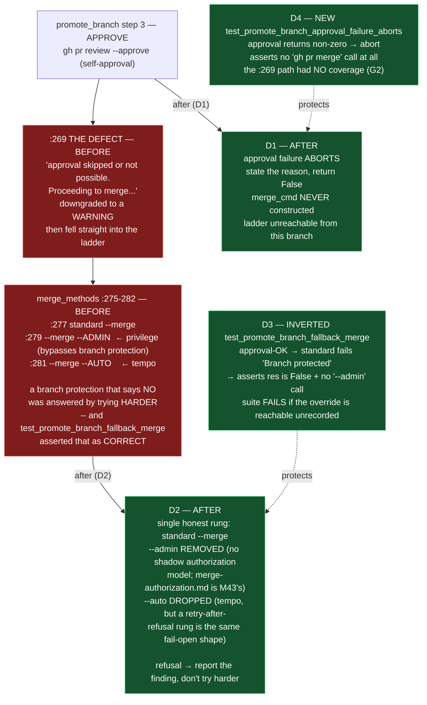

# E42.3 Execution Record — The Merge Ladder Aborts

## Layer, time and scope (`P11-GH-2`)

This record is written on `epic/P12-M42-E42.3`, 2026-09-02, from the repository whose parent is
`milestone/M42` at `cd27fe1` (this branch's tip and the merge-base are the same commit — **0 commits
drift**, verified by `git merge-base epic/P12-M42-E42.3 milestone/M42` returning `cd27fe1`). Its code
claims are about `bin/ai-project-git-merge` on this branch, **read directly and run directly** (both
the `PYTHONPATH=. pytest -q` suite and the script's embedded `--test` suite); its history claims are
from `git log`. It says nothing about Drivr, `bin/ai-project-orchestrator` (E42.1/E42.2),
`bin/ai-project-init` or `governance/templates/merge-authorization.md` (M43's), none of which this
epic touches.

## Model verification (P9-M31-E31.3 — required, this instance is manual)

Harness-reported model identity: **`opencode/deepseek-v4-flash`**. `.ai-project.yml`
`models.epic_manual`: **`remote:deepseek-v4-flash`** (read from the file at the branch point, not
trusted from the starter). Both present and agree — no mismatch to state. Proceeding under
`advisory` verification (SN-40).

## Backstop re-verification (`P11-GH-1`, widened form — this epic's starter makes it load-bearing)

Before relying on *"`merge-authorization.md` is M43's, do not touch"*, checked whether M43 has
already delivered and changed the rule, against this branch's point (`cd27fe1`):

| Artifact checked | `git log cd27fe1..HEAD` | Result |
|---|---|---|
| `governance/templates/merge-authorization.md` | empty | unchanged on this branch; **M43 tip `milestone/M43` also shows no diff vs `cd27fe1` for this file** — the template M43 owns has not moved |
| M43 milestone spec (`P12-M43__milestone-spec.md`) | empty | not delivered/changed |
| `bin/ai-project-git-merge` | empty | no prior drift; all line citations re-derived by anchor search |
| E42.3 spec / starter / M42 milestone spec | empty | no amendment reached this branch since the branch point |

**State of the restated rules, each re-checked against the branch point:** the rework-limit template
(`governance/systems/milestone-execution-chat-starter.md:334`) still says the 3-attempt limit
*"resets"*, while the SN-36/37 amendment (2026-08-19) makes the written extension **exactly one**
further attempt — both stand; this epic cites the amendment and applied `+1` (this delivery is the
first attempt, no rework needed). The widened backstop applies because in M41 a Delivery Notice
asserted a rule whose suspension was already an ancestor of its own branch point; no such condition
exists here — every artifact this starter restates a rule from is unchanged at the branch point.

## The defect, re-verified by anchor (G2 — the reviewer re-measures)

Re-derived by **searching for the code, not trusting the number** (`bin/ai-project-git-merge`,
branch point `cd27fe1`, read):

| Anchor — searched for | Cited (stale) | **Actual at branch point** | Found |
|---|---|---|---|
| `Proceeding to merge` | `:269` | `:269` | yes |
| `"--admin"` | `:279` | `:279` | yes |
| `"--auto"` | `:281` | `:281` | yes |
| `def test_promote_branch_fallback_merge` | `:447-460` | `:447` | yes |

The pre-edit ladder, verbatim at the branch point:

```
:269  print(f"[!] Warning: Pull Request approval skipped or not possible. Proceeding to merge...", file=sys.stderr)
:275  merge_methods = [
:277      ["gh", "pr", "merge", "--merge", "--delete-branch", pr_url],   # standard
:279      ["gh", "pr", "merge", "--merge", "--admin", pr_url],            # --admin override
:281      ["gh", "pr", "merge", "--auto", "--merge", pr_url]              # auto-merge
:282  ]
```

`promote_branch` approves its **own** PR (`gh pr review --approve` at `:265`); on approval failure
`:269` downgraded the refusal to a warning and fell into the ladder, which escalated privilege in
answer to refusal — standard → `--admin` (bypasses branch protection) → `--auto`. A branch
protection that said **no** was answered by trying **harder**, and
`test_promote_branch_fallback_merge` (`:447-460`) mocked approval-OK → standard-fails → `--admin`-
succeeds and asserted `True`: **the suite recorded the override succeeding against a branch that
said no.**

**Finding G2, re-derived not inherited:** the existing test's mock has `gh pr review --approve`
returning **0** (`:451` at branch point), so it exercises the *ladder*, not the *approval bypass*.
The `:269` warn-and-continue path had **no test at all** — hence this epic's new approval-abort
test, below.

## D1 — Approval failure aborts

`:263-272` now read (search anchor `Pull Request approval failed`):

```
    # 3. Approve PR. Approval failure ABORTS (E42.3): the merge ladder is
    # unreachable from a branch whose approval was refused.
    print(f"[*] Attempting to approve Pull Request...")
    approve_res = subprocess.run(["gh", "pr", "review", "--approve", pr_url], cwd=PROJECT_ROOT, capture_output=True, text=True)
    if approve_res.returncode == 0:
        print("[✓] Pull Request approved successfully.")
    else:
        print("[!] Pull Request approval failed. Aborting promotion; not proceeding to merge.", file=sys.stderr)
        print(f"[!] {approve_res.stderr.strip()}", file=sys.stderr)
        return False
```

**Before:** warned and proceeded. **After:** aborts — `promote_branch` returns failure and
`merge_cmd` is never constructed from that branch. There is **no** *"Proceeding to merge"* and no
warning-and-continue anywhere in the disposition.

## D2 — The `--admin` and `--auto` dispositions (the delegated design decisions)

### `--admin` — **removed**

`["gh", "pr", "merge", "--merge", "--admin", pr_url]` is gone from the script. Reasoning:

- It is the **one rung whose purpose is to override a "no"** — `--admin` re-*authorizes* a merge
  branch protection refused. That is the exact fail-open shape this milestone closes: evidence
  absent → action proceeds at higher privilege.
- **Gating is rejected because the record it would require is not ours to build.** The conforming
  recorded-authorization artifact, `governance/templates/merge-authorization.md`, is **M43's** (SN-31
  Decision 4) and off-limits (verified above that M43 has not already delivered). Gating `--admin`
  behind a *different* recorded mechanism would create a **shadow authorization model** — a parallel
  artifact that pre-empts M43's parent-performs-merge work under another name, which M43 would then
  have to reconcile. The milestone spec names this tension and identifies removal as the conforming
  answer; this epic agrees and does not build the stand-in.
- **Consequence, accepted:** a merge branch protection refuses cannot be completed by this script. Per
  the binding constraint, that is a **finding to report**, not a reason to defer the repair or route
  around it. The honest path — push, PR, self-approve, standard merge — stays.

### `--auto` — **dropped**

`["gh", "pr", "merge", "--auto", "--merge", pr_url]` is gone too, but on distinct grounds, and the
tempo-vs-privilege distinction is stated rather than the two rungs being lumped:

- **`--auto` is tempo, not privilege.** It does not override branch protection; it *re-times* the
  merge — arming auto-merge to complete when checks pass. That distinction is real and this record
  keeps it.
- **It is still dropped, deliberately.** As the **third rung of a refusal ladder**, `--auto` was not
  a stand-alone feature but a *retry in answer to refusal*: standard merge refused → try another
  rung. The milestone's disposition is **"stop, and say so"** — a refused merge is a finding to
  report to a human, not an event that re-arms the merge through another mechanism. A surviving
  `--auto` rung would also be a **permissive path** that Binding Constraint 6 requires to be
  declared **and** recorded, and its record would sit in the same shadow-authorization territory as
  a gated `--admin`.
- **What remains available:** auto-merge is still reachable to a human who wants it, directly via
  `gh pr merge --auto`, outside this script. This script's job after a refused merge is to stop and
  report — it no longer tries harder on anyone's behalf.

**The `:275` merge block now reads** (anchor `The standard merge is the single, honest attempt`):

```
    # 4. Merge PR
    # The standard merge is the single, honest attempt (E42.3). The --admin rung
    # (privilege escalation) and the --auto rung (tempo re-arm) are disposed of in
    # the E42.3 record: a branch protection that says no is answered by stopping and
    # reporting, not by trying harder.
    print(f"[*] Attempting to merge Pull Request: {pr_url}...")

    merge_cmd = ["gh", "pr", "merge", "--merge", "--delete-branch", pr_url]
    print("[*] Trying merge method: standard...")
    merge_res = subprocess.run(merge_cmd, cwd=PROJECT_ROOT, capture_output=True, text=True)
    if merge_res.returncode == 0:
        print("[✓] Pull Request merged successfully using standard merge!")
        merged = True
    else:
        print(f"[!] Method 'standard' failed: {merge_res.stderr.strip()}", file=sys.stderr)
        merged = False

    if not merged:
        print("[!] Merge failed. PR remains unmerged.", file=sys.stderr)
        return False
```

The single rung is the honest standard merge; failure is reported and `promote_branch` returns
`False`.

## D3 — Inverted test (post-fix assertion, the third delegated decision)

`test_promote_branch_fallback_merge` (anchor `def test_promote_branch_fallback_merge`) now asserts
the guard. **Post-fix expectation: `res is False` and no subprocess call carries `"--admin"`.**
The mock offers approval-OK → standard-fails (`"Branch protected"`) and **no** `--admin` rung; the
test asserts the sequence does **not** reach a successful merge:

```
            res = promote_branch("epic/E13.3", "milestone/M13", "E13.3", dry_run=False)
            self.assertFalse(res)
            # Guard: the --admin override is unreachable unrecorded — no subprocess
            # call may carry it.
            admin_attempts = [c for c in mock_run.call_args_list if "--admin" in c.args[0]]
            self.assertEqual(admin_attempts, [])
```

**The suite fails if the `--admin` override is reachable unrecorded** — restored, the rung makes
`res True` (or a call carry `"--admin"`), and this test goes red (demonstrated in D5). **Inversion,
not deletion.**

## D4 — New approval-abort test (G2)

`test_promote_branch_approval_failure_aborts` (anchor `def test_promote_branch_approval_failure_aborts`)
covers the path G2 showed had no test: the mock returns **non-zero** from `gh pr review --approve`
(`"Branch protection does not allow self-approval"`), and the test asserts the function **aborts** —
`res is False` and **no** `"gh", "pr", "merge"` call happens, i.e. `merge_cmd`/the ladder is never
reached:

```
            res = promote_branch("epic/E13.3", "milestone/M13", "E13.3", dry_run=False)
            self.assertFalse(res)
            # Guard: merge_methods is never reached — no "gh pr merge" call happens.
            merge_attempts = [c for c in mock_run.call_args_list if c.args[0][:3] == ["gh", "pr", "merge"]]
            self.assertEqual(merge_attempts, [])
```

## D5 — Falsification demonstrations (prove each guard by removing it)

Both falsifications were run against **temporary copies** in `/tmp/opencode/e42-3/` (the working
tree keeps the guards). The demo removes the guard, runs the embedded suite, and records the red.
An absence is only evidence when the thing that would have created it actually ran — each run below
did.

### Inverted test (`test_promote_branch_fallback_merge`)

**Guard under test:** the `--admin` rung's removal from the merge path.

**Variant A3** restored the `--admin` rung in the code **and** restored the original test's full mock
sequence (approval-OK → standard-fails → `--admin`-succeeds → cleanup). Run:
`python3 variantA3_admin_guard_removed_full_mock.py --test`.

Result (2026-09-02, this host):

```
FAIL: test_promote_branch_fallback_merge (...)
AssertionError: True is not false
Ran 12 tests ... FAILED (failures=1)
```

The inverted assertion fired: with the override reachable, the ladder merges and the guard goes red.
Guard restored.

### New approval-abort test (`test_promote_branch_approval_failure_aborts`)

**Guard under test:** the `return False` abort on approval failure (the `:269` disposition).

**Variant B3** restored the old warn-and-continue (`"Proceeding to merge"`), kept the mock's
approval-failure entry, and supplied merge+cleanup entries so the ladder is reached. Run:
`python3 variantB3_abort_guard_removed_full_mock.py --test`.

Result (2026-09-02, this host):

```
FAIL: test_promote_branch_approval_failure_aborts (...)
AssertionError: True is not false
Ran 12 tests ... FAILED (failures=1)
```

With the abort removed, approval failure proceeds to a successful merge and the guard goes red.
Guard restored.

Both guards were observed to fail when removed, and the working tree now passes with them in place.

## Suite

- **Invocation 1:** `PYTHONPATH=. pytest -q` → **578 passed / 0 failed** (baseline on this branch
  before the change: 578 passed / 0 failed; this epic adds tests only in the embedded suite, so the
  pytest count is unchanged). State: run on `epic/P12-M42-E42.3`, 2026-09-02, this host.
- **Invocation 2:** `python3 bin/ai-project-git-merge --test` → **12 tests, OK** (11 before this
  epic: `test_promote_branch_fallback_merge` inverted, `test_promote_branch_approval_failure_aborts`
  added). State: run on `epic/P12-M42-E42.3`, 2026-09-02, this host.
- **No skips introduced** to route around the change; no existing test deleted.

## Visual Bindings

**Visual binding**
- **Link:** (inline — Structural diagram; no hosted link needed per AOG §16.3/§16.5)
- **What:** diagram
- **Level:** Epic
- **State:** implemented



- **Description:** E42.3 makes approval failure abort and disposes of the privilege-escalating merge
  ladder in `bin/ai-project-git-merge`. The defect was that `:269` downgraded approval refusal to a
  warning and fell into a ladder whose `--admin` rung bypasses branch protection — a branch that
  says no answered by trying harder — and this was **protected by its own test**
  (`test_promote_branch_fallback_merge`). Finding G2 is why this is two tests: the old test's mock
  had approval returning 0, so it covered the ladder, not the `:269` approval bypass, which had no
  test at all. Now: approval failure **aborts** (D1); `--admin` is **removed** (gating would build a
  shadow authorization model M43 would have to reconcile — `merge-authorization.md` is M43's) and
  `--auto` is **dropped** deliberately (tempo ≠ privilege, but a retry-after-refusal rung is the
  same fail-open shape); the existing test is **inverted** (D3) and a **new** test guards the abort
  (D4); both guards were **falsified** (D5). Proposed-track Structural diagram (AOG §16.3/§16.6),
  Mermaid, in-repo, no ComfyUI.

## Out-of-scope interactions, noted and left alone

- `governance/templates/merge-authorization.md` — **not edited.** Verified unchanged in this branch's
  diff vs `milestone/M42` at `cd27fe1` (see Backstop table). It remains M43's.
- `bin/ai-project-orchestrator` — not edited (E42.1/E42.2's file); `bin/ai-project-init` — not
  edited (E42.4's file); Drivr — untouched.
- This script promotes branches by self-approving and standard-merging. With `--admin` gone, **any
  merge this milestone needs that a protected branch refuses cannot be completed by this script** —
  that is a finding to report to the M42 Milestone Chat if it arises, not a reason to restore the
  rung.

## Changelog

| Version | Date | Change |
|---|---|---|
| 1.0.0 | 2026-09-02 | Initial E42.3 execution record. Approval failure aborts (D1); `--admin` removed and `--auto` dropped with distinct reasoning (D2); `test_promote_branch_fallback_merge` inverted (D3); new `test_promote_branch_approval_failure_aborts` (D4); both guards falsified (D5). 578 passed / 0 failed on pytest; 12 tests OK on the embedded suite. |