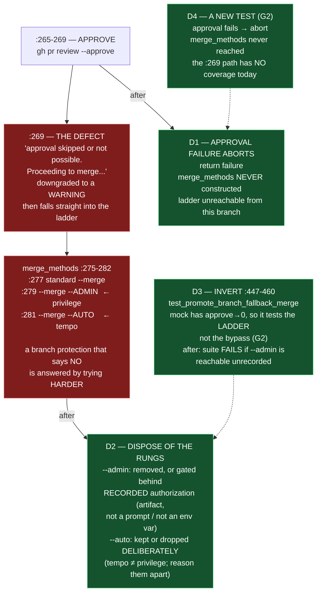

# Epic E42.3 — The Merge Ladder Aborts

## Context

M42 exists to close one disposition across four `bin/` paths: *when the evidence that should gate an
action is absent, the action proceeds.* E42.3 is the third path, and the only one of the four **not**
in `bin/ai-project-orchestrator` — it is independent and may be planned and delivered without waiting
on E42.1 or E42.2.

`bin/ai-project-git-merge`'s `promote_branch` pushes an epic branch, opens a PR, approves it, and
merges it. **Approval failure is downgraded to a warning.** At `:269` it prints
*"[!] Warning: Pull Request approval skipped or not possible. Proceeding to merge..."* and then falls
into the merge ladder — which then **escalates privilege in answer to refusal**:

```
:275  merge_methods = [
:277      ["gh", "pr", "merge", "--merge", "--delete-branch", pr_url],   # standard
:279      ["gh", "pr", "merge", "--merge", "--admin", pr_url],            # --admin override
:281      ["gh", "pr", "merge", "--auto", "--merge", pr_url]              # auto-merge
:282  ]
```

A branch protection that says **no** — to the self-approval, or to the standard merge — is answered by
trying **harder**: the `--admin` rung bypasses branch protection, and the `--auto` rung re-arms it as
an auto-merge. The evidence that should gate the merge is absent, so the action proceeds at
escalating privilege.

**Two of this phase's organizing instances are protected by their own tests, and this is one of
them.** The suite does not merely fail to catch the defect — it records it as correct.

**Finding G2 is what raises this epic's size above a one-line fix, and it is binding:** inverting the
existing test does **not** cover the approval-failure abort. The test's own mock has `gh pr review
--approve` returning **0** (`:451`) — it exercises the *ladder* (standard fails → `--admin` succeeds),
not the *approval bypass* (approval fails → `:269` warning → proceed). The `:269` warning-and-continue
path has **no test at all**. **This epic owes a NEW test as well as an inverted one.**

---

## Problem Statement

**A branch that says no is answered by escalating privilege, and a test records that as correct.**

Three specific failings:

1. **Approval failure is a warning, not an abort.** `:265-269` downgrades *"approval skipped or not
   possible"* to a `stderr` line and proceeds to the merge. There is no code path that, on approval
   refusal, stops.
2. **The ladder escalates privilege in answer to refusal.** `:277` standard merge → `:279`
   `--admin` (which bypasses branch protection) → `:281` `--auto`. A branch protection that says no is
   met by a rung that is defined by overruling the protection.
3. **The suite asserts the defect.** `test_promote_branch_fallback_merge` (`:447-460`) mocks approval
   succeeding, the standard merge returning `"Branch protected"`, and the `--admin` rung returning 0 —
   then asserts the whole function returns `True`. **It asserts that the admin override succeeds
   against a branch that said no.**

**Why the `--admin` rung is the sharpest cut.** It is the one rung whose *purpose* is to override a
"no". The standard merge is the honest attempt; `--auto` re-times it. `--admin` re-*authorizes* it,
and it is the exact fail-open shape this milestone closes: evidence absent → action proceeds at higher
privilege.

---

## Goals

By the end of this Epic, the system must:

1. **Abort on approval failure.** `:269` becomes an abort — no *"Proceeding to merge"* — and the merge
   ladder is **unreachable from that branch**.
2. **Dispose of the `--admin` rung** — removed, or gated behind a **recorded** human authorization
   (recorded means an artifact, not a console prompt and not an environment variable read at runtime
   with nothing written down). **Dispose of the `--auto` rung deliberately on the same terms** — kept
   or dropped, with a stated reason.
3. **Invert `test_promote_branch_fallback_merge`** (`:447-460`) so the suite **fails if the admin
   override is reachable unrecorded** — inversion, not deletion.
4. **Write a NEW test for the approval-failure abort** (G2): approval fails → the function aborts and
   `merge_methods` is never reached.
5. **Prove both guards by falsifying them.**

---

## Non-Goals

This Epic explicitly does **not** aim to:

- **Edit `governance/templates/merge-authorization.md`.** That template is **M43's** (SN-31 Decision 4
  — M43 moves the merge to the parent and turns that template into the parent's record). This epic
  touches the merge **script**, not the **authorization model**. **Do not pre-apply M43.** Any
  interaction with that template is noted and left alone.
- **Change who merges.** The parent-performs-merge change is M43's, not this milestone's.
- **Repair the sandbox or staging paths** — those are E42.1 and E42.2.
- **Remove the standard merge or the push/PR/create flow.** The honest path stays.
- **Touch `bin/ai-project-init`, `bin/ai-project-orchestrator`, or Drivr.**

---

## Scope of Work

### 1. The approval abort (D1)

Replace `:265-269` such that an approval failure **aborts** `promote_branch`. No warning-and-continue,
no fall into the ladder. A `gh pr review --approve` that returns non-zero → state the reason and
return failure; `merge_methods` is never constructed from that branch. The `:275` ladder is
unreachable unless approval succeeded.

### 2. The `--admin` and `--auto` rungs (D2)

Decide the disposition of each of `:279` and `:281`, and record the reasoning:

- **`--admin`** — removed, or gated behind a **recorded** human authorization. "Recorded" means an
  artifact, not a console prompt and not an env var read at runtime with nothing written down. **This
  is the epic's decision, with one binding tension named here:** because `merge-authorization.md` is
  M43's and off-limits, a *gated* `--admin` cannot reuse that template — gating it requires some other
  recorded mechanism, and the reasoning must say why that mechanism is not a shadow authorization
  model M43 will then have to reconcile. **The conforming, low-risk answer is removal**; gating is
  permitted only if the record it creates is real and not a stand-in for M43's work.
- **`--auto`** — kept or dropped, deliberately. `--auto` does not elevate privilege; it re-times the
  merge (enables auto-merge when checks pass). The decision must state that distinction rather than
  lump the two rungs together, and state which disposition applies to each.

### 3. The inversion (D3)

Invert `test_promote_branch_fallback_merge` (`:447-460`, anchor `def test_promote_branch_fallback_merge`)
so the suite **fails if the admin override is reachable unrecorded**. The test currently mocks
approval-OK → standard-fails → `--admin`-succeeds → asserts `True`; after inversion it asserts the
guard: with the rung removed (or un-recorded), that sequence **does not** reach a successful
`--admin` merge. The test's `self.assertTrue(res)` is replaced by the post-fix expectation stated in
this epic's own artifact.

### 4. The new approval-abort test (D4)

A **new** test covering the `:269` path that G2 showed has no coverage: mock the approval call to
return non-zero, and assert the function **aborts** — it returns failure and **never reaches**
`merge_methods`. This is a test that would pass against the current code **only accidentally** and
fails against the fix removed; it must fail against today's `promote_branch`.

### 5. Falsification (D5)

Demonstrate **for both** the inverted test and the new test: delete the guard, watch the test fail,
restore it.

---

## Deliverables

- [ ] **D1** — `:269` aborts on approval failure; the ladder is unreachable from that branch
- [ ] **D2** — The `--admin` rung removed or gated behind **recorded** authorization; the `--auto` rung
      kept or dropped **deliberately** — both dispositions recorded with reasoning
- [ ] **D3** — `test_promote_branch_fallback_merge` inverted so the suite fails if the override is
      reachable unrecorded
- [ ] **D4** — A new test for the approval-failure abort (G2)
- [ ] **D5** — Falsification demonstrations for both tests
- [ ] Structural diagram (Mermaid, in-repo, no ComfyUI)
- [ ] **Epic Delivery Notice**

---

## Binding Constraints

Settled above this epic — **not re-decidable here**:

1. **E42.3 is independent.** It may be planned and delivered without waiting on E42.1 or E42.2. It
   does not edit the file they share.
2. **M42 gates M47.** No M47 epic may be dispatched agentically until this milestone closes.
3. **The tests are inverted, not deleted.** A deleted test leaves no assertion; an inverted test makes
   the guard the thing the suite protects.
4. **`merge-authorization.md` is not edited here** — it is M43's (SN-31 Decision 4). Note any
   interaction and leave it.
5. **A surviving permissive path must be declared AND recorded** (Binding Constraint 6). If `--admin`
   survives gated, the record must be an artifact, not a prompt or an env var.

> **⚠ An irony this epic will meet, named once in the milestone starter:** E42.3 removes or gates the
> `--admin` override in the very script this project's tooling uses to promote branches. **Do not let
> the epic route around its own fix.** If a merge in this milestone cannot be completed without the
> rung being repaired, that is a finding to report, not a reason to defer the repair.

## Hard Constraint (binding — carried to every Epic)

- **Execution posture: `manual` / paid frontier.** This epic modifies the merge path. **The machinery
  under repair must not supervise its own repair.**
- **Prove the guard by falsifying it.** Both tests **fail** when the guard is removed — you owe it for
  the inverted test *and* the new approval-abort test.
- **Cite by anchor, not by a bare line number.** `bin/ai-project-git-merge` is unchanged by the +4
  drift (it is not the orchestrator), but the rule holds regardless: search for
  `Proceeding to merge`, `"--admin"`, `"--auto"`, `def test_promote_branch_fallback_merge`.
- **`--include='*.py'` skips every `bin/` entry point**, where this defect lives. Note
  `bin/ai-project-git-merge` is an **extensionless** script — a name-sweep for the defect that greps
  only `*.py` will not find it.
- **An absence is only evidence when the thing that would have created it actually ran.**

---

## Design Decisions Delegated — decide, document, proceed

1. **The `--admin` disposition** — removed vs. gated-behind-recorded-authorization, with the reasoning
   stated and the `merge-authorization.md`-is-M43's constraint addressed in that reasoning.
2. **The `--auto` disposition** — kept vs. dropped, deliberately, with the privilege-vs-tempo
   distinction stated.
3. **The inverted test's post-fix expectation** — what `test_promote_branch_fallback_merge` asserts
   after inversion (the exact assertion, not "something stricter").

The milestone spec assigns these to this level: the phase starter's *"how the `--auto` rung is disposed
of alongside `--admin` — kept or dropped, deliberately"* is explicitly this epic's.

---

## Definition of Done

Epic E42.3 is complete when:

- [ ] Approval failure aborts; the ladder is unreachable from that branch
- [ ] `--admin` is gone or gated behind a **recorded** authorization; `--auto` is disposed of
      deliberately and the reason is stated
- [ ] `test_promote_branch_fallback_merge` (`:447-460`) asserts the guard, and a separate test covers
      the approval abort
- [ ] Both guards shown to fail when removed
- [ ] `merge-authorization.md` is **not** edited; any interaction is noted and left
- [ ] Suite green — no skip introduced to route around the change — with the invocation stated
- [ ] Delivery Notice committed; PR opened to `milestone/M42`

---

## Acceptance Criteria

- [ ] A reader can determine, from committed artifacts alone, what `:269` did before (warned and
      proceeded) and does now (aborts), and **which test proves the approval abort**
- [ ] `--admin` is unreachable without a **recorded** authorization — or absent entirely — and the
      suite asserts it
- [ ] The `--auto` disposition is deliberate and recorded, distinguished from `--admin` (tempo vs.
      privilege)
- [ ] No fix substitutes a louder warning for the `:269` abort
- [ ] `merge-authorization.md` remains M43's — untouched here
- [ ] Every claim states the layer, time and scope at which it was verified (`P11-GH-2`)

---

## Technical Constraints

**In scope:** `bin/ai-project-git-merge` (the `promote_branch` approval-and-merge-ladder region, and
the embedded `run_tests()` suite); the new approval-abort test.
**Do not touch:** `governance/templates/merge-authorization.md` (M43's); the template's routing guard;
`bin/ai-project-orchestrator` (E42.1/E42.2); `bin/ai-project-init`; anything under `~/soft-dev/drivr`.
**Invocation:** `PYTHONPATH=. pytest -q` — **plus** `python3 bin/ai-project-git-merge --test` for the
embedded suite, which is where the inverted test lives.
**Note (external constraint):** a live `--admin` override against a real protected branch must be
provable **without** performing the override — the guard is demonstrated by the test, not by a real
protected-branch override.

---

## Dependencies

**Internal**
- **None.** E42.3 is independent of E42.1 and E42.2. It does not edit `bin/ai-project-orchestrator`.
- **M42 gates M47** and **E41.5** — this epic is part of the milestone whose closure releases both.

**External**
- **A GitHub remote** for any live exercise of `bin/ai-project-git-merge`. **The guards must be
  provable without performing a real protected-branch override** — the demonstration is the mock
  inversion, not a live `--admin`.

**Blockers**
- None at planning.

---

## Timeline

**Estimated Effort:** 1 session.
**Target Completion:** independent — may run at any point in the milestone.
**Actual Completion:** In progress.

---

## Execution Notes

**Order:**
1. Confirm the defect and test anchors **by search, not by number**.
2. Implement the approval abort (D1) — the `:269` path and the ladder unreachable from it.
3. Dispose of `--admin` and `--auto` (D2), recording the reasoning — address the `merge-authorization.md`
   tension explicitly in that reasoning.
4. Invert the test (D3) and write the new approval-abort test (D4).
5. Falsify both (D5): delete the guard, watch each fail, restore.
6. Run both invocations; state them and the delta.

**Traps:**
- **Inverting the test and stopping there** — G2: the existing mock has approval returning 0, so
  inversion covers the ladder but **not** the `:269` approval bypass. Owe the new test.
- **Inventing a shadow authorization artifact** to "gate" `--admin` in a way that pre-empts M43's
  parent-performs-merge work. Removal is the conforming answer; gating must name a real record, not a
  stand-in.
- **Lumping `--auto` with `--admin`.** `--auto` is tempo, `--admin` is privilege; the dispositions are
  separate and must be reasoned separately.
- **Routing around your own fix** to complete a live merge this milestone needs — report the finding,
  don't defer the repair.
- **Missing the embedded suite** — `pytest` does not run `bin/ai-project-git-merge`'s `run_tests()`;
  run `python3 bin/ai-project-git-merge --test` too.

---

## Related Documents

- [M42 Milestone Spec](P12-M42__milestone-spec.md) — Defect 3, Finding G2, Inversion 1, E42.3 Epic Detail, Hard Constraint, Binding Constraints
- [P12 Phase Spec](P12__phase-spec.md) — §P12.2 Row 3, §Acceptance Criteria
- [E42.3 interact with M43 note](P12-M43__milestone-spec.md) — `merge-authorization.md` is M43's; do not pre-apply
- [PROJECT-SYSTEM-GUIDELINES.md](../../../governance/PROJECT-SYSTEM-GUIDELINES.md)
- [AI-OPERATING-GUIDELINES.md](../../../governance/AI-OPERATING-GUIDELINES.md)

---

## Visual Bindings

**Visual binding**
- **Link:** (inline — Structural diagram; no hosted link needed per AOG §17.3/§17.5)
- **What:** diagram
- **Level:** Epic
- **State:** proposed



- **Description:** E42.3 makes approval failure abort and disposes of the privilege-escalating merge
  ladder in `bin/ai-project-git-merge`. The defect is that `:269` downgrades approval refusal to a
  warning and falls into a ladder whose `--admin` rung bypasses branch protection — a branch that
  says no answered by trying harder — and this is **protected by its own test**
  (`test_promote_branch_fallback_merge`, whose mock has approval returning 0 and asserts the admin
  override succeeds). Finding G2 makes the size of the work: inverting that test covers the ladder but
  **not** the `:269` approval bypass, which has no test at all — so the epic owes a **new** test
  alongside the inverted one. `merge-authorization.md` is M43's and out of scope. Proposed-track
  Structural diagram (AOG §17.3/§17.6), Mermaid, no ComfyUI.

---

## Notes

- **The two tests are not the same fix, and G2 is the reason this spec spends words on it.** Inverting
  `test_promote_branch_fallback_merge` protects the ladder; a **new** test protects the approval
  bypass. A delivery that inverts and stops leaves the phase spec's own defect 3 — *"approval failure
  prints 'Proceeding to merge'"* — unguarded, which is exactly the gap the milestone flagged.

- **On gating `--admin` without touching `merge-authorization.md`.** The temptation is to build a
  parallel authorization artifact because the real one is off-limits. That would be pre-applying
  M43's work with a different name, and M43 would then have to reconcile it. **Removal is the
  conforming answer.** If the epic gates, its reasoning must name a record that is not a stand-in.

- **The self-approval is its own observation, and it is upstream of the merge ladder.** `promote_branch`
  approves its **own** PR (`gh pr review --approve` at `:265`). A branch protection that blocks
  self-approval is not a defect to route around — it is the protection working. The abort makes that
  signal a stop instead of a speed-bump.

---

## Changelog

| Version | Date | Change |
|---|---|---|
| 1.0.0 | 2026-09-01 | Initial E42.3 spec, from M42 spec v1.1.0 (Defect 3, Finding G2, Inversion 1). Approval failure aborts; the `--admin` rung removed or gated behind recorded authorization with the `merge-authorization.md`-is-M43's tension named and removal identified as the conforming answer; `--auto` disposed deliberately (tempo ≠ privilege). One test inverted (`:447-460`) and one written (G2 — the `:269` path has no coverage). Independent epic, no file overlap with E42.1/E42.2. No scope, ordering, gate or acceptance-criterion change from the milestone spec. |
