# E42.4 Execution Record — `ai-project-init` Stops Manufacturing an Agent

## Layer, time and scope (`P11-GH-2`)

This record is written on `epic/P12-M42-E42.4`, 2026-09-02, from a worktree whose parent is
`milestone/M42` at `f215188` (this branch's tip and the merge-base are the same commit — **0 commits
drift**, verified by `git merge-base epic/P12-M42-E42.4 milestone/M42` returning `f215188`). Its code
claims are about `bin/ai-project-init` and `tests/test_init_agent_path.py` on this branch, **read
directly and run directly**; its history claims are from `git log`. It says nothing about
`bin/ai-project-orchestrator` (E42.1/E42.2), `bin/ai-project-git-merge` (E42.3),
`governance/agents/governance.agent.md` (the real agent, untouched), the fleet under `~/soft-dev/`
(E42.5's sweep), or Drivr. **The end-to-end runs (Obligation 1) are the load-bearing difference from
the `P12-GH-2` note, which stated its own boundary: paths read, victim taken from the record, no
end-to-end init run.** They ran here, into scratch directories only, and their results are stated in
full below.

## Model verification (P9-M31-E31.3 — required, this instance is manual)

Harness-reported model identity: **`opencode/deepseek-v4-flash`**. `.ai-project.yml`
`models.epic_manual`: **`remote:deepseek-v4-flash`** (read from the file at the branch point, not
trusted from the starter). Both present and agree — no mismatch to state. Proceeding under
`advisory` verification (SN-40). The route ambiguity (both `opencode/` and `opencode-go/` routes
resolve deepseek-v4-flash) is the dispatcher's, per the yml's own comment.

## Backstop re-verification (`P11-GH-1`, widened form — this starter makes it load-bearing)

Before relying on any rule this starter restates, ran the widened backstop against this branch's
point (`f215188`): `git log <artifact> f215188..HEAD` for every artifact this Starter restates a
rule from:

| Artifact checked | `git log f215188..HEAD` | Result |
|---|---|---|
| E42.4 epic spec | empty | no amendment reached this branch |
| E42.4 epic execution chat starter | empty | unchanged |
| `P12-GH-2` carry-forward note | empty | unchanged — the specification has not moved |
| M42 milestone spec | empty | no amendment reached this branch |
| `governance/templates/milestone-execution-chat-starter.md` | empty | unchanged |
| `governance/systems/milestone-execution-chat-starter.md` | empty | unchanged |
| `governance/templates/merge-authorization.md` | empty | unchanged — still M43's (SN-31 Decision 4); M43 has not delivered |
| `bin/ai-project-init` | empty | no prior drift; every citation below re-derived by anchor search |

**State of the restated rules:** the rework-limit template
(`governance/systems/milestone-execution-chat-starter.md:334`) still says the 3-attempt limit
*"resets"*, while the SN-36/37 amendment (2026-08-19) makes the written extension **exactly one**
further attempt — both stand; this epic cites the amendment and applies `+1` (this delivery is the
first attempt, no rework needed). **The merge-authorization rule in force is the current one**: this
Epic opens a PR to `milestone/M42` and stops; it does not merge; M43's parent-performs-merge change
is not pre-applied. No condition like M41's (a Delivery Notice asserting a rule whose suspension was
already an ancestor of its own branch point) exists here — every artifact checked is unchanged at
the branch point.

## The defect, re-verified by anchor (G2 — the reviewer re-measures)

Re-derived by **searching for the code, not trusting the number** (`bin/ai-project-init`, branch
point `f215188`, read). `bin/ai-project-init` was not affected by the orchestrator's +4 drift, but
the search was run anyway, per the rule:

| Anchor — searched for | Cited | **Actual at branch point** | Found |
|---|---|---|---|
| `local src_file=` | `:328` | `:328` | yes |
| `This agent is under development in Milestone M8` | `:340` (within `:336-346`) | `:340` | yes |
| `submodule_path:` | `:262` | `:262` | yes |
| `--skip-submodule` | `:376` | `:376` | yes |

The pre-edit mechanism, verbatim at the branch point:

```
:328  local src_file="$project_dir/governance/agents/governance.agent.md"
:333  if [[ -f "$src_file" ]]; then
:334    cp -f "$src_file" "$dest_file" || error "..."
:335  else
:336    # Create stub when governance agent is not yet available (e.g., during M8 work)
:337    cat > "$dest_file" << 'EOF'
:338  # HQ Chat Agent
:340    This agent is under development in Milestone M8.
:345  EOF
:346  fi
:348  # Basic validation: file exists, readable, non-empty, and starts with a Markdown header or frontmatter
:349  [[ -r "$dest_file" ]] || error "..."
:350  [[ -s "$dest_file" ]] || error "..."
:351  if ! head -n 1 "$dest_file" | grep -Eq '^(#|---)'; then
:352    error "..."
:353  fi
```

**Re-derived, not inherited: the off-by-one.** `add_governance_submodule` (`:274`) clones the
**whole** `ai-project-system` repository into `<project>/governance`. Inside that clone the agent
lives at `governance/agents/governance.agent.md` (verified by `git ls-tree` across refs: present
from `v4.0.0` onward; **absent at `v2.0.0`** — see the Obligation 1 findings below). So after a real
install the agent is at `<project>/governance/governance/agents/governance.agent.md` — the path
`:328` reads is one `governance/` level short. The source is never found; the stub is written; and
the validator checks readable/non-empty/starts-with-`#` — all trivially true of the stub. The
guarding test (`tests/test_init_agent_path.py:24`) invoked the script with `--skip-submodule` and
asserted the same three properties, so the failing branch was unreachable under its own invocation.
**P6-GH-11's canonical-path coverage (`.ai-project/agents/`, never `.github/agents/`) was correct
and had to survive the inversion.**

## D1 + D4 — the coupled path fix, one decision

The source path (`:328`) and the submodule path (`:262`, `:274`, and the `:279`/`:281`/`:283`/`:294`/
`:298`/`:303` literals) describe the same location twice. Fixing one while the other stays at
`governance` re-breaks the install. Both now derive from one named constant (`bin/ai-project-init:33`):

```
readonly GOVERNANCE_SUBMODULE_PATH=".governance"
```

- **D4 — the submodule path.** `create_ai_project_yml` (`:273`) now writes
  `submodule_path: $GOVERNANCE_SUBMODULE_PATH/` → **`.governance/`** in the generated
  `.ai-project.yml`, matching the M38 fleet convention (8 of 11 projects; the three exceptions are
  exactly init's own creations) and **PSG §14B** ("the submodule MUST be installed at `.governance/`").
  Every `governance` literal in `add_governance_submodule` — the `git submodule add`, the
  `git clone` fallbacks, the `git submodule add -f`, the `.gitmodules` branch hint
  (`submodule.$GOVERNANCE_SUBMODULE_PATH.branch`), and the empty-after-init check — now uses the
  constant.
- **D1 — the source path.** `install_hq_agent` (`:345`) now reads
  `src_file="$project_dir/$GOVERNANCE_SUBMODULE_PATH/governance/agents/governance.agent.md"` →
  `<project>/.governance/governance/agents/governance.agent.md`, one level deeper than the old read,
  exactly where a real submodule clone puts it.

**The M38 escalation's finding — "init hard-codes the path with no flag" — is disposed of
deliberately (delegated decision 2).** It remains a hard-coded default, but now it is **named and
documented**, not a silent bare literal. Reasoning: `.governance` is the normative path (PSG §14B),
and a flag that let init produce a different submodule path would manufacture **non-conforming
projects** — a permissive path of exactly the family this milestone closes. A named constant plus
this record is the "recorded hard-coded default with its reason" branch of the spec's two options.

**A third, necessary fix, exposed by Obligation 1:** a real default init also drifted the working
directory. `init_git_repo` called `add_governance_submodule "."`, whose `cd "."` clobbered `OLDPWD`
so the trailing `cd -` bookkeeping restored the *project directory* rather than the launch
directory; `install_hq_agent` then resolved the relative `$project_dir` against the wrong CWD and
wrote the stub into a **nested `<project>/<project>/` directory** (observed in run A1 below). The
fix makes the path bookkeeping robust: `main` resolves `target_dir` to an absolute path
(`bin/ai-project-init:398-403`), and `init_git_repo` / `add_governance_submodule` / the final
commit block each restore a captured `start_dir="$PWD"` instead of `cd -`. Without this, the fixed
agent copy would land in the same nested directory and the canonical path would stay empty. Run B1
verifies the canonical path is written.

## D2 — the stub branch removed

The `:336-346` `else` branch is gone. `install_hq_agent` (`:351`) now reads:

```
  if [[ ! -f "$src_file" ]]; then
    error "Governance agent not found at $src_file; refusing to manufacture a placeholder"
  fi
```

Absent source → **fail with a stated reason** via the script's own `error` helper. No placeholder,
no fallback, no "under development", no M8 comment. Manufacturing a substitute is the one answer
this milestone rules out, and it is gone.

## D3 — the validator strengthened (delegated decision 1)

The old checks validated the **dest** file's shape (readable, non-empty, starts with `#`). The new
checks run **on the source, before anything is written** (`bin/ai-project-init:354-361`):

```
  [[ -r "$src_file" ]] || error "Governance agent is not readable at $src_file"
  [[ -s "$src_file" ]] || error "Governance agent is empty at $src_file"
  if ! grep -Eq '^name:[[:space:]]+hq([[:space:]]|$)' "$src_file"; then
    error "Governance agent at $src_file does not carry the governance agent identity (front-matter 'name: hq')"
  fi
```

**Choice and reasoning:** the validator asserts the **agent's identity marker** — front-matter
`name: hq` — not a checksum. E36.3's `sha256` freeze was considered and rejected: a frozen hash of
the 14,711-byte agent would go stale on the next legitimate agent update and would require the
script to track agent content, which is exactly the "hard-coded, silent" shape this milestone
disposes of. `name: hq` is the agent's stable identity (the front-matter at
`governance/agents/governance.agent.md:2`); it survives content evolution and version bumps. **Why a
substitute cannot satisfy it:** the historical M8 placeholder has no front-matter at all and begins
`# HQ Chat Agent` — a `name:` line at the start of a line never occurs. The check runs **before**
the copy, so a placeholder never even lands on the canonical path (the stronger fail-closed shape).
Readable/non-empty are kept as cheap sanity; the identity assertion is the guard. Validating the
dest after copy is reduced to readable/non-empty (the copy is byte-identical to the validated
source).

## D5 — the test inverted, `P6-GH-11` preserved (delegated decision 3)

`tests/test_init_agent_path.py` is rewritten, not deleted. The old test's invocation
(`--skip-submodule`, assert exists/non-empty/starts-with-`#`) recorded the stub as correct; the
inversion asserts the opposite. Five tests:

1. **`test_init_aborts_when_governance_agent_absent`** — behavioral inversion, same subprocess
   invocation as the old test but asserting the **opposite outcome**: `returncode != 0`, stderr
   states the missing-agent reason, **no** placeholder exists at `.ai-project/agents/`, and no
   `.github/agents/` (P6-GH-11). This is the "placeholder not installable" guard.
2. **`test_install_hq_agent_located_real_agent`** — exercises the **real path**: seeds
   `.governance/governance/agents/governance.agent.md` with the real agent (read from the repo at
   test runtime), sources the script (via the new entry-point guard) and calls `install_hq_agent`
   directly; asserts the canonical `.ai-project/agents/governance.agent.md` is written with the real
   content and `.github/agents/` is not (D1 + P6-GH-11, behaviorally).
3. **`test_install_hq_agent_rejects_placeholder`** — seeds the historical M8 placeholder at the real
   source path; asserts `install_hq_agent` fails and **nothing** is written (D3, behaviorally).
4. **`test_no_placeholder_branch_in_script`** — source-level: the M8 marker the note cites as the
   anchor is absent (the stub branch is unreachable because it does not exist).
5. **`test_agent_source_path_matches_submodule_layout`** — source-level: the constant resolves to
   `.governance`, the source path couples to it, `submodule_path: .governance/` is written, and the
   old one-level-short path is gone (D1+D4).

**Shape decision (delegated 3):** the happy path (real agent located by a real init) is exercised
*behaviorally* through the sourced `install_hq_agent` call against a seeded submodule layout, and
*end-to-end* by Obligation 1 run B1. A full `--skip-submodule` subprocess run cannot reach the happy
path because `validate_target_directory` forbids pre-seeding the project (the submodule must be
created by the script, which requires the network). The two source-level tests backstop the coupling
that a behavioral happy-path test alone could not pin to both paths at once.

**The entry-point guard** (`bin/ai-project-init:472`): `if [[ "${BASH_SOURCE[0]}" == "${0}" ]]; then
main "$@"; fi` — the standard execute-vs-source idiom, added so the tests can exercise
`install_hq_agent` directly. Executed invocation (`bash bin/ai-project-init …`, `--help`,
`--version`) is unchanged; sourcing no longer runs `main`.

## D6 / Obligation 1 — the real end-to-end run, confirming half and fix half

Four real `ai-project-init` runs, **no `--skip-submodule`**, each into a scratch directory under
`/tmp/opencode/e42-4/scratch/` (never inside this repository). All four used the real GitHub remote
`https://github.com/panchew/ai-project-system` (network verified by `git ls-remote` before the
runs). Runs A1/A2 used the **unfixed** script (extracted at the branch point, `f215188:bin/ai-project-init`);
runs B1/B2 used the **fixed** script on this branch. Layer: executed on this host, 2026-09-02, from
the script on disk; scope: exactly what the four invocations did, in scratch.

### A1 — unfixed, default ref `v2.0.0` — **CONFIRMS the inference**

`bash orig/ai-project-init a1-proj` (defaults). rc=0, "Project created successfully!". The produced
agent file is the **230-byte M8 placeholder**, byte-for-byte:

```
# HQ Chat Agent

This agent is under development in Milestone M8.

For now, use this as a placeholder for the governance-aware HQ Chat agent.

When M8 is complete, this file will be replaced with the full HQ agent implementation.
```

**And an additional finding the note's read could not have predicted:** the placeholder was written
to a **nested** `<scratch>/a1-proj/a1-proj/.ai-project/agents/governance.agent.md`, not the
canonical `<project>/.ai-project/agents/` (which stayed empty). The CWD drift described under D1+D4.
The initial commit carried the nested path. **The mechanism is confirmed** — a real init today
produces the stub — with the landing path even more broken than the note assumed.

### A2 — unfixed, ref `master` — **isolates the off-by-one**

`bash orig/ai-project-init a2-proj --governance-version master`. rc=0. At `master`, the clone
`<project>/governance/governance/agents/governance.agent.md` **exists** (14,711 bytes, front-matter
`name: hq` / `version: 2.1.0`), but the script reads `<project>/governance/agents/governance.agent.md`
— one level short, "No such file or directory" — so the **230-byte stub is produced anyway**. This
is the off-by-one in isolation: the source is never found **because the path is wrong**, not because
the ref lacks the agent.

### B1 — fixed, ref `master` — **the fix produces the real agent**

`bash bin/ai-project-init b1-proj --governance-version master` (fixed script, this branch). rc=0.
Result:

- `.ai-project/agents/governance.agent.md` = **14,711 bytes**, front-matter `name: hq` /
  `version: 2.1.0` — **the real governance agent**, committed to the initial commit.
- **No nested directory** — the CWD fix works; the canonical path is the one written.
- Submodule installed at **`.governance/`**; `.gitmodules` carries `[submodule ".governance"]`;
  `.ai-project.yml` writes `submodule_path: .governance/`.
- The agent source resolved at `.governance/governance/agents/governance.agent.md` (14,711 bytes),
  i.e. one level deeper than the old path — the corrected path, against the real submodule layout.

### B2 — fixed, default ref `v2.0.0` — **fails closed, with a stated reason**

`bash bin/ai-project-init b2-proj` (defaults). rc=**1**, stderr:

```
✗ Error: Governance agent not found at /tmp/.../b2-proj/.governance/governance/agents/governance.agent.md; refusing to manufacture a placeholder
```

No placeholder anywhere; the canonical agents directory stays empty. **The fail-closed disposition
works live**: a default init no longer reports success on a manufactured substitute.

### Obligation 1 verdict — CONFIRMING

**The inferred mechanism is confirmed, not falsified.** A real end-to-end init (unfixed) produces
the 230-byte M8 stub on both the default and the `master` ref; A2 proves the off-by-one is the
mechanism even when the agent exists at the correct depth. The fix then installs the real agent (B1)
and fails closed with a stated reason when the agent is genuinely absent (B2). **Two findings beyond
the note, both recorded here rather than dropped:**

1. **The CWD-drift nesting** (A1): the stub does not even land at the canonical path in a default
   run — a third layer beneath the note's two. Fixed, proven by B1.
2. **The default ref is stale.** `DEFAULT_GOVERNANCE_VERSION="v2.0.0"` predates the canonical agent
   file: `git ls-tree v2.0.0 -- governance/agents/` shows only `hq.agent.md`, while every ref from
   `v4.0.0` onward carries `governance.agent.md`. So even with the corrected path, a **default** init
   fails closed (B2) — which is the milestone's correct disposition, but means init's default ref
   should be bumped so a default init installs the agent. That is **not** one of D1–D5 and is left to
   the milestone/E42.5's blast radius; this record states it rather than fixing it silently.

## Falsification demonstrations — both guards observed to fail when removed

Per the Hard Constraint, each new guard was demonstrated **red** when removed, against temporary
copies in `/tmp/opencode/e42-4/falsify/` (the working tree keeps the guards). An absence is only
evidence when the thing that would have created it actually ran — each run below did.

### Guard 1 — the strengthened validator (D3)

**Guard under test:** the identity assertion
`grep -Eq '^name:[[:space:]]+hq([[:space:]]|$)' "$src_file"` (with its error).

**Variant:** `v1-init` — a copy of the fixed script with those two lines deleted.

**Run:** `PYTHONPATH=. pytest -q /tmp/opencode/e42-4/falsify/test_falsify_v1_validator.py`
(`test_install_hq_agent_rejects_placeholder` against `v1-init`). Result (2026-09-02, this host):

```
FAILED ../e42-4/falsify/test_falsify_v1_validator.py::test_install_hq_agent_rejects_placeholder
AssertionError: assert 0 != 0
  where 0 = CompletedProcess(... returncode=0, stdout='', stderr='').returncode
```

With the identity check removed, the seeded M8 placeholder is accepted (rc=0, no stderr) and
installed. **The guard was observed to fail when removed.** Restored.

### Guard 2 — the no-stub abort (D2)

**Guard under test:** the `error "…refusing to manufacture a placeholder"` on absent source.

**Variant:** `v2-init` — a copy of the fixed script with the abort replaced by the historical
stub-writing `cat > "$dest_file"` block.

**Run:** `PYTHONPATH=. pytest -q /tmp/opencode/e42-4/falsify/test_falsify_v2_nostub.py`
(`test_init_aborts_when_governance_agent_absent` against `v2-init`). Result (2026-09-02, this host):

```
FAILED ../e42-4/falsify/test_falsify_v2_nostub.py::test_init_aborts_when_governance_agent_absent
AssertionError: assert not True
  where True = exists()  (the placeholder at .ai-project/agents/governance.agent.md)
```

With the stub fallback restored, the init succeeds and the placeholder lands on the canonical path.
**The guard was observed to fail when removed.** Restored.

## Suite

- **Invocation:** `PYTHONPATH=. pytest -q` — **582 passed / 0 failed**. Baseline on this branch at
  the branch point: **578 passed / 0 failed** (549 at the starter's `master`/`9ee810e` baseline; M41
  and E42.1–E42.3 added the rest). Delta: `test_init_agent_path.py`'s single test inverted into five
  (**+4 net**); no other test file changed; no skip introduced to route around the change; no
  existing test deleted. State: run on `epic/P12-M42-E42.4`, 2026-09-02, this host.
- `test_ai_project_validate.py`'s `REAL_SHAPE_INVALID` fixture (`submodule_path: governance/`) is
  **not** touched: it reproduces the live victim's config shape for the validator, which is E42.5's
  repair territory, not an assertion about init's output.

## Visual Bindings

**Visual binding**
- **Link:** (inline — Structural diagram; no hosted link needed per AOG §16.3/§16.5)
- **What:** diagram
- **Level:** Epic
- **State:** implemented

```mermaid
flowchart TB
  READ[":328 — read source<br/>src_file = $project_dir/governance/agents/governance.agent.md<br/>ONE level short of where the submodule puts it<br/>(the whole repo clones under governance/)"]

  FOUND{"source found?"}

  STUB[":336-346 — MANUFACTURE A SUBSTITUTE<br/>'This agent is under development in Milestone M8'<br/>M8 closed in P2 · nine phases stale<br/>VALIDATED by readable / non-empty / starts-with-#<br/>— all trivially true of the stub"]

  NEST["run A1 (2026-09-02) — a THIRD layer found<br/>CWD drift (cd '.' clobbers OLDPWD) writes the<br/>stub into a NESTED <project>/<project>/ dir<br/>— not even the canonical path"]

  CONFIRM["OBLIGATION 1 — CONFIRMED<br/>A1: default v2.0.0 -> 230-byte stub<br/>A2: ref master -> 230-byte stub, agent EXISTS<br/>at the correct depth -> off-by-one isolated"]

  FIXPATH["D1/D4 — COUPLED PATH FIX<br/>src path + submodule_path -> .governance/<br/>(M38 fleet convention · PSG §14B)<br/>single named constant GOVERNANCE_SUBMODULE_PATH<br/>M38 'hard-coded with no flag' finding DISPOSED OF<br/>deliberately: recorded default, not a permissive flag"]

  CWD["CWD bookkeeping fixed — absolute target_dir +<br/>start_dir restore (run A1 exposed the nesting)"]

  NOSTUB["D2 — REMOVE THE STUB BRANCH<br/>absent source -> FAIL with a stated reason<br/>'refusing to manufacture a placeholder'"]

  VALIDATE2["D3 — STRENGTHENED VALIDATOR<br/>identity marker: front-matter 'name: hq'<br/>checked on the SOURCE before the copy<br/>a placeholder has no front-matter -> fails"]

  INVERT["D5 — INVERT test_init_agent_path.py<br/>placeholder NOT installable (behavioral)<br/>real path + validator exercised via sourced<br/>install_hq_agent · P6-GH-11 PRESERVED"]

  FIXRUN["run B1 — real agent (14,711 B, name: hq)<br/>installed at .ai-project/agents/ · no nesting<br/>run B2 — default v2.0.0 FAILS CLOSED<br/>(v2.0.0 predates the canonical agent:<br/>only hq.agent.md in that tag)"]

  READ --> FOUND
  FOUND -->|"no (today)"| STUB --> NEST --> CONFIRM
  CONFIRM --> FIXPATH --> CWD --> NOSTUB
  NOSTUB --> VALIDATE2 --> INVERT --> FIXRUN

  classDef defect fill:#7f1d1d,stroke:#fca5a5,color:#fff
  classDef fix fill:#14532d,stroke:#86efac,color:#fff
  classDef hard fill:#1e3a5f,stroke:#93c5fd,color:#fff
  class READ,STUB,NEST defect
  class FIXPATH,CWD,NOSTUB,VALIDATE2,INVERT,FIXRUN fix
  class CONFIRM hard
```



- **Description:** E42.4 closes `P12-GH-2` (severity High) — `bin/ai-project-init` reads the agent
  source one `governance/` level short, manufactures a 230-byte "Milestone M8" placeholder, and
  validates the placeholder's shape. Obligation 1 ran four real end-to-end inits: the mechanism is
  **CONFIRMED** (runs A1/A2 produce the stub; A2 isolates the off-by-one), and the fix is
  demonstrated (B1 installs the real 14,711-byte agent at the canonical path; B2 fails closed with a
  stated reason). The run also exposed two layers the note did not predict — CWD-drift nesting of
  the stub (fixed) and the stale `v2.0.0` default ref (recorded; a default init now fails closed,
  which is the milestone's correct disposition). The fix couples the source path and the
  `.governance/` submodule path into one named constant, removes the stub branch outright,
  strengthens the validator to the agent's `name: hq` identity marker (checked before the copy), and
  inverts the test with `P6-GH-11` preserved. Both guards were falsified. Mermaid, in-repo, no
  ComfyUI.

## Out-of-scope interactions, noted and left alone

- `governance/agents/governance.agent.md` — the real agent. **Not edited** (14,711 bytes, unchanged).
- `bin/ai-project-orchestrator` — not edited (E42.1/E42.2's file); `bin/ai-project-git-merge` — not
  edited (E42.3's file); `governance/templates/merge-authorization.md` — not edited (M43's).
- `tests/test_ai_project_validate.py::REAL_SHAPE_INVALID` — the live-victim config fixture; not
  touched (E42.5 repairs the victim).
- `DEFAULT_GOVERNANCE_VERSION="v2.0.0"` — **not bumped.** The finding that it predates the canonical
  agent (only `hq.agent.md` in that tag) is recorded here for the milestone / E42.5's blast radius.
- Drivr and the fleet under `~/soft-dev/` — untouched. Repairing the live victim
  (`social-stories-creator`) is E42.5's enumeration, sequenced after this epic.

## Changelog

| Version | Date | Change |
|---|---|---|
| 1.0.0 | 2026-09-02 | Initial E42.4 execution record. Source path and submodule path coupled to one `.governance` constant (D1+D4, M38 finding disposed of deliberately); stub branch removed with a stated-reason abort (D2); validator strengthened to the `name: hq` identity marker, checked before the copy (D3); test inverted with `P6-GH-11` preserved (D5); both guards falsified; Obligation 1 ran four real end-to-end inits — CONFIRMING the mechanism and exposing CWD-drift nesting (fixed) and the stale v2.0.0 default ref (recorded). 582 passed / 0 failed. |

**Epic E42.4 execution complete. Epic Delivery Notice produced. Awaiting Milestone Chat review and
authorization.**