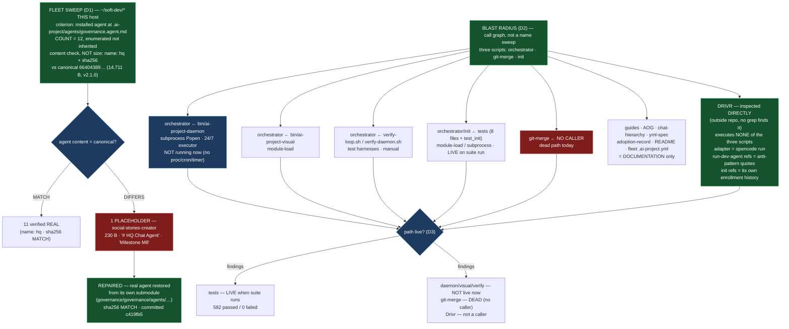

# E42.5 Execution Record — Fleet Sweep and Blast Radius

## Layer, time and scope (`P11-GH-2`)

This record is written on `epic/P12-M42-E42.5`, 2026-09-02, at the same commit as the branch point
(`origin/milestone/M42` at `16ed4ea` — E42.4's merge; **0 commits drift**, verified by `git rev-parse
HEAD` and `git rev-parse origin/milestone/M42` both returning `16ed4ea`). Its fleet claims are about
`~/soft-dev/*` **on this host**, enumerated directly (not inherited from G4's twelve or the milestone
spec's eleven), with the enrolment criterion stated so the count is derivable. Its Drivr claims are
about `~/soft-dev/drivr`, **opened and read directly** — no grep in this repository can find it. Its
call-graph claims distinguish *documentation reference* from *execution* (subprocess, wrapper, or
module-load) and were established by reading the caller's code. It says nothing about any host other
than this one.

## Model verification (P9-M31-E31.3 — required, this instance is manual)

Harness-reported model identity: **`opencode/deepseek-v4-flash`**. `.ai-project.yml`
`models.epic_manual`: **`remote:deepseek-v4-flash`** (read from the file at `.ai-project.yml:72`, not
trusted from the starter). Both present and agree — no mismatch to state. Proceeding under `advisory`
verification (SN-40).

## Backstop re-verification (`P11-GH-1`, widened form)

Before relying on any rule this starter restates, ran the widened backstop against this branch's point
(`16ed4ea`): `git log <path-to-the-artifact> 16ed4ea..HEAD` for every artifact this Starter restates a
rule from. **The range is empty by construction** — `HEAD` equals the branch point (`16ed4ea`), so no
amendment can have moved behind it. Verified explicitly, not assumed:

| Artifact checked | `git log 16ed4ea..HEAD` | Result |
|---|---|---|
| E42.5 epic spec | empty | no amendment reached this branch |
| E42.5 epic execution chat starter | empty | unchanged |
| M42 milestone spec | empty | no amendment reached this branch |
| P12 phase spec | empty | no amendment reached this branch |
| `governance/templates/milestone-execution-chat-starter.md` | empty | unchanged |
| `governance/systems/milestone-execution-chat-starter.md` | empty | unchanged |
| `governance/templates/merge-authorization.md` | empty | unchanged — still M43's (SN-31 Decision 4); M43 has not delivered |
| `P12-GH-2` carry-forward note | empty | unchanged |

**State of the restated rules:** the rework-limit template
(`governance/systems/milestone-execution-chat-starter.md:334`) still says the 3-attempt limit
*"resets"*, while the SN-36/37 amendment (2026-08-19) makes the written extension **exactly one**
further attempt — both stand; this epic cites the amendment and applies `+1` (this delivery is the
first attempt, no rework needed). **The merge-authorization rule in force is the current one**: this
Epic opens a PR to `milestone/M42` and stops; it does not merge; M43's parent-performs-merge change is
not pre-applied (the starter's note was re-verified — M43 has not delivered, and no merge machinery
is touched here).

---

## Design Decisions (delegated — decided, documented, proceeded)

### DD1 — The enrolment criterion

**A project is "enrolled" if it carries an installed governance agent at
`.ai-project/agents/governance.agent.md`** — the exact path `ai-project-init` installs to and the
exact path G4 measured. Applied to a direct listing of `~/soft-dev/*` on this host.

This criterion reproduces G4's *twelve* (the twelve with that file) and is reproducible: `ls
~/soft-dev/*/` → check for `.ai-project/agents/governance.agent.md`. It excludes the corpus repo
itself (`ai-project-system`, whose canonical agent lives at `governance/agents/governance.agent.md`
as the *source*, and whose `.ai-project/agents/` holds only `tools.json`/`qa-tools.json`), and it
excludes projects that never installed an agent at the canonical path (`fieldledger-assesment` — see
D1 boundary cases). Non-project entries (`ai-stack`, `character-factory`, `fleetio-application`,
`interview-practice-luflox`, `practice`, `tmp`, and the loose files at the `~/soft-dev/` root) carry
no `.ai-project.yml` and no agent and are out-of-population.

### DD2 — The content-check signal

**Front-matter `name: hq` presence, confirmed by a full sha256 comparison to the canonical agent**
(`~/soft-dev/ai-project-system/governance/agents/governance.agent.md`,
`66404389f29fa1ff8e829015b70ab8b33373dc3ac3eca3f2faea121d3da3441e`, 14,711 bytes). The real agent
opens `---` / `name: hq` / `version: 2.1.0`; the 230-byte placeholder opens `# HQ Chat Agent` and
carries the string *"This agent is under development in Milestone M8."* and has no front-matter at
all.

**Why this catches a *different* wrong agent that size cannot:** a hypothetical *other* wrong agent
of exactly 14,711 bytes would pass `wc -c` but fail `name: hq` presence and the sha256 comparison.
The check is keyed on content, per the G4 boundary. The sha256 comparison is the strongest form: it
distinguishes the canonical agent from **any** other file, including a copy that merely carries a
`name: hq` line. Both were run for every enrolled project.

### DD3 — The repair-vs-record threshold

- **REPAIR** when a placeholder is present **and** the real agent is recoverable without mutating the
  project's structure beyond the placeholder file — i.e. the canonical agent exists inside that
  project's own governance submodule, byte-identical to the corpus's. Restore it (copy from the
  submodule, verify by sha256, commit in that project).
- **RECORD** when no placeholder is present (verified real by content), or when the project should
  not be mutated, or when the agent's absence/age is a config fact rather than a placeholder —
  recorded with the reason, never left silent.

---

## D1 — The fleet enumeration (content, not size)

### Enrolment criterion applied

`ls ~/soft-dev/` on this host, 2026-09-02. Each entry checked for `.ai-project/agents/governance.agent.md`.
**Count of enrolled projects found: 12** — under DD1's criterion. Not inherited from G4's *twelve*,
the milestone spec's *eleven*, or any planning-time listing; enumerated here.

### Per-project agent state (size **and** content)

`name: hq` presence via grep; sha256 compared to the canonical agent (`66404389…`). Submodule column
records the project's governance submodule path (`.governance/` = M38 fleet convention; `governance/`
= the pre-fix init convention; `none` = no governance submodule).

| Project | Agent bytes | `name: hq` | sha256 = canonical | Submodule | Disposition |
|---|---|---|---|---|---|
| `ai-project-system-mcp` | 14,711 | yes | MATCH | `governance/` | verified real |
| `content-creation-pipeline` | 14,711 | yes | MATCH | `.governance/` | verified real |
| `courtis` | 14,711 | yes | MATCH | `.governance/` | verified real |
| `drivr` | 14,711 | yes | MATCH | `.governance/` | verified real |
| `footboard` | 14,711 | yes | MATCH | `.governance/` | verified real |
| `Getawayinsured2023` | 14,711 | yes | MATCH | `.governance/` | verified real |
| `home_finance` | 14,711 | yes | MATCH | `.governance/` | verified real |
| `local-agent-runner` | 14,711 | yes | MATCH | `.governance/` | verified real |
| `panchew-io` | 14,711 | yes | MATCH | `.governance/` | verified real |
| `personal-management-system` | 14,711 | yes | MATCH | `none` | verified real |
| `social-stories-creator` | **230 → 14,711** | no → **yes** | DIFFERS → **MATCH** | `governance/` | **REPAIRED** |
| `voicebox` | 14,711 | yes | MATCH | `.governance/` | verified real |

`social-stories-creator` was **re-inspected, not inherited**: the 230-byte placeholder was present at
the start of this session (re-read, `# HQ Chat Agent` / *"This agent is under development in Milestone
M8."*), matching the record. Every other project was verified by content (front-matter + sha256), not
by size.

### The repair (`social-stories-creator`)

The real agent was **already present inside the victim's own governance submodule** at
`~/soft-dev/social-stories-creator/governance/governance/agents/governance.agent.md` — 14,711 bytes,
`name: hq`, `version: 2.1.0`, sha256 **identical** to the canonical agent (`66404389…`). Per DD3
(REPAIR — the canonical agent recoverable from the project's own submodule, no structural mutation),
the placeholder was replaced with this real agent and verified: 14,711 bytes, `name: hq` present,
sha256 matches canonical. Committed in that project as `c419fb5` on `main`:

```
fix(governance): restore real HQ governance agent (14,711 bytes, name: hq) replacing 230-byte placeholder
```

The placeholder was tracked (the `Initial project scaffold by ai-project init` commit), so leaving it
untouched in the working tree would have been a silent disposition. It is repaired, not merely
recorded.

### D1 boundary cases — recorded, not silent

- **`ai-project-system` (the corpus repo itself):** not enrolled under DD1. Its canonical agent is
  the *source* at `governance/agents/governance.agent.md` (14,711 bytes, `name: hq`, sha256
  `66404389…`); its `.ai-project/agents/` holds only `tools.json` and `qa-tools.json`. No placeholder.
  Recorded, not repaired (there is nothing to repair; the corpus agent is untouched per the Technical
  Constraints).
- **`fieldledger-assesment`:** has `.ai-project.yml` and a `.governance` submodule (M38's `8 of 11`
  convention), but **no installed agent at `.ai-project/agents/governance.agent.md`** — its
  `.ai-project/` contains only `artifacts/`. Its agent exists only as the vendored submodule copy at
  `.governance/governance/agents/governance.agent.md`, which is a **real, older** agent (14,352 bytes,
  `name: hq`, `version: 2.0.0` — pre-2.1.0, not a placeholder). No installed placeholder to repair;
  installing/refreshing a copy is out of scope (a general fleet-health action, not a placeholder
  repair). Recorded with this reason.
- **Non-enrolled entries** (`ai-stack`, `character-factory`, `fleetio-application`,
  `interview-practice-luflox`, `practice`, `tmp`, and the `~/soft-dev/` root loose files): no
  `.ai-project.yml`, no governance agent. Out-of-population under DD1. Recorded for completeness.

### The G4 lead, checked (not dropped, not forced)

G4 offered the observation that the one victim sits in the non-`.governance` population — exactly the
projects M38 identified as init's own creations. Verified against the enumeration: `social-stories-creator`
uses the **pre-fix `governance/` submodule path** (its `.ai-project.yml` carries `submodule_path:
governance/` and `.gitmodules` points at `governance`), while **11 of the 12** enrolled projects use
`.governance/` or have no submodule; the only other pre-fix `governance/` submodule paths in the fleet
are `ai-project-system-mcp` and `social-stories-creator` itself, and `ai-project-system-mcp`'s agent
is real. **The correlation holds directionally** — the one victim is the one pre-fix-convention
project whose installed agent is a stub — but the sample is a single victim, so this is recorded as a
corroborated lead, not a finding.

---

## D2 — The blast radius as a call graph (not a name sweep)

G3's table is the starting inventory and is **naming-only**. This section classifies every reference
as **execution** (invokes the script as a subprocess, a wrapper, or a module-load) or **documentation**
(mentions it, does not execute it), and names every caller. Each classification below was established
by **reading the caller's code**, not by the grep that found it.

### `bin/ai-project-orchestrator`

| Caller | Class | Mechanism (read) | Liveness |
|---|---|---|---|
| `bin/ai-project-daemon` | **EXECUTION** | `subprocess.Popen([sys.executable, str(orchestrator), file_name])` at daemon:255, queue-poll loop | **not live now** — no daemon process, no cron, no systemd timer, no autostart; daemon log shows two historical starts, last exited on SIGTERM |
| `bin/ai-project-visual` | **EXECUTION** (module-load) | `SourceFileLoader` + `exec_module` at visual:66-78 (loads orchestrator as a module) | not live now (manual CLI) |
| `bin/verify-loop.sh` | **EXECUTION** (test harness) | `python3 "$ORCHESTRATOR"` directly in scenarios | not live now (manual verification harness) |
| `bin/verify-daemon.sh` | **EXECUTION** (test harness) | starts/stops the daemon, which invokes the orchestrator; Scenario 6 backs up the real orchestrator and installs a mock | not live now (manual verification harness) |
| `tests/test_model_config.py` | **EXECUTION** (module-load) | `SourceFileLoader` + `exec_module` | live when the suite runs |
| `tests/test_visual_artifacts_config.py` | **EXECUTION** (module-load) | `SourceFileLoader` + `exec_module` | live when the suite runs |
| `tests/test_sandbox_endpoint_forwarding.py` | **EXECUTION** (module-load) | `SourceFileLoader` + `exec_module` | live when the suite runs |
| `tests/test_sandbox_absent_fails_closed.py` | **EXECUTION** (module-load) | `SourceFileLoader` + `exec_module` | live when the suite runs |
| `tests/test_epic_scoped_staging.py` | **EXECUTION** (module-load) | `SourceFileLoader` + `exec_module` | live when the suite runs |
| `tests/test_daemon_path_resolution.py` | **EXECUTION** (module-load, of daemon) | `SourceFileLoader` + `exec_module` of the daemon, which resolves/invokes the orchestrator | live when the suite runs |
| `tests/integration/test_sandbox_ollama_reachability.py` | **EXECUTION** (module-load) | `SourceFileLoader` + `exec_module` | live when the suite runs |
| `tests/integration/test_visual_artifacts_helper.py` | **EXECUTION** (module-load) | `SourceFileLoader` + `exec_module` | live when the suite runs |
| `bin/run-dev-agent` | **DOCUMENTATION** | docstring only — it is the orchestrator's **child** (invoked *by* the orchestrator as `dev_command`), not a caller of it | n/a (callee, not caller) |
| `bin/run-qa-agent` | **DOCUMENTATION** | docstring only | n/a |
| `governance/guides/FAQ.md` | DOCUMENTATION | — | — |
| `governance/guides/gpu-coexistence.md` | DOCUMENTATION | — | — |
| `governance/guides/QUICK-START.md` | DOCUMENTATION | — | — |
| `governance/guides/visual-artifacts.md` | DOCUMENTATION | — | — |
| `governance/AI-OPERATING-GUIDELINES.md` | DOCUMENTATION | — | — |
| `governance/systems/chat-hierarchy.md` | DOCUMENTATION | — | — |
| `README.md` | DOCUMENTATION | — | — |
| **`Getawayinsured2023` (fleet)** | **EXECUTION — historical** | shakedown records (`docs/admin/governance-shakedown/`, 2026-07-23) record running `python3 .governance/bin/ai-project-orchestrator` one-shot; vendored copy in its submodule | **not live now** — no process; the recorded runs are dated 2026-07-23 |
| **Drivr (`~/soft-dev/drivr`)** | **DOCUMENTATION — no execution** | see "Drivr, inspected directly" below | Drivr not running; executes none of the three scripts |

### `bin/ai-project-git-merge`

| Caller | Class | Mechanism (read) | Liveness |
|---|---|---|---|
| `README.md` (243, 332, 424) | DOCUMENTATION | — | — |
| P3 phase docs (`E13.3` spec/completion/delivery-notice), `roadmap/overview.md`, carry-forward notes | DOCUMENTATION | — | — |
| **Any execution caller** | **NONE FOUND** | `grep -rn 'ai-project-git-merge' bin/ tests/` (excluding `__pycache__`) returns nothing; the orchestrator and daemon do not call it (verified by reading both) | **dead path — nothing executes it** |

`ai-project-git-merge`'s only self-execution is its embedded `--test` suite
(`python3 bin/ai-project-git-merge --test`, the E42.3 harness) run manually. There is **no live
caller** of this script in the repository, the fleet, or Drivr.

### `bin/ai-project-init`

| Caller | Class | Mechanism (read) | Liveness |
|---|---|---|---|
| `tests/test_init_agent_path.py` | **EXECUTION** (test harness) | `subprocess.run(["bash", str(INIT_SCRIPT), ...])` at :42 | live when the suite runs |
| `bin/ai-project-validate` | DOCUMENTATION | docstring only | — |
| `governance/guides/ADOPTION-FAQ.md`, `ADOPTION-GUIDE.md`, `QUICK-START.md` | DOCUMENTATION | — | — |
| `governance/ai-project-yml-spec.md`, `systems/chat-hierarchy.md`, `adoption-records/adoption-home-finance-2026-05-21.md` | DOCUMENTATION | — | — |
| `README.md` | DOCUMENTATION | — | — |
| Fleet projects' `.ai-project.yml` (e.g. `drivr`'s) | DOCUMENTATION | record init wrote the config | historical enrollment, not execution |
| `panchew-io` `docs/decisions/2026-08-05__manual-governance-bootstrap.md` | DOCUMENTATION | records the manual-bootstrap exception | historical decision, not execution |

No production caller executes `ai-project-init`; it is an enrollment tool run manually or at project
creation (historical fleet enrollment). Not currently live as a process.

### Drivr, inspected directly (`~/soft-dev/drivr`)

Opened and read (no grep in this repository finds it). **Drivr executes NONE of the three scripts.**

- **Its execution adapter invokes `opencode run` directly.** `drivr/execution/opencode.py` builds a
  one-shot `opencode run` invocation (`session.run(...)`); `drivr/execution/interface.py` defines the
  `ExecutionAdapter` contract. The scheduler (`drivr/scheduling/scheduler.py`) dispatches through that
  adapter ("The scheduler never learns which engine it is"), and `bin/drivr-serve` runs the scheduler.
- **References to `bin/run-dev-agent` are anti-pattern documentation**, not calls: `execution/__init__.py`,
  `execution/opencode.py`, `execution/interface.py` and `tests/test_extensibility.py` quote it as the
  *motivating anti-pattern* ("the property `bin/run-dev-agent` lacks"). `docs/execution-adapter-surface.md`
  states it was *"read and deliberately left unmodified."*
- **References to `bin/ai-project-orchestrator` are in the execution-environment decision
  (`docs/decisions/2026-08-11__execution-environment.md`)**, which explicitly decides Drivr does
  **not** route through the orchestrator's sandbox (Direction B — the engine runs in Drivr's own
  container). This is the opposite of a caller.
- **References to `bin/ai-project-init` are enrollment documentation**: `drivr/.ai-project.yml` and
  `README.md` record that Drivr was enrolled by `ai-project-init` on 2026-08-10 (with the four
  additions / one correction recorded). Historical, not execution.
- Its `.governance` submodule vendors the corpus (including `bin/` copies of the three scripts), but
  **nothing in Drivr's own code ever invokes them** — verified by reading `bin/`, `drivr/`, `docs/`
  and `tests/` (excluding the submodule).

**Blast-radius consequence for M42's framing:** the milestone spec's risk — *"a defect on a path
Drivr is about to call every night"* — is **not realized**. Drivr's nightly dispatch path is
`opencode run`, not any of the three repaired scripts. The orchestrator's **actual** live-capable
caller is `bin/ai-project-daemon` (the queue-polling subprocess), which is the automated executor of
the 24/7 cluster's design — and it is **not currently running** on this host.

---

## D3 — Liveness, stated as findings (not assumed)

| Path | Finding | Evidence (the check that would have found the opposite) |
|---|---|---|
| daemon → orchestrator | **NOT live now** | `pgrep -af 'ai-project-daemon'` finds nothing; `crontab -l` empty; no systemd user timer for ai-project; no autostart entry; daemon.log's last event is a SIGTERM cleanup. The path is the designed live path (queue README: "unattended 24/7 autonomous development cluster") but nothing is running it on this host at measurement time. |
| visual → orchestrator (module-load) | **NOT live now** | `pgrep` for `ai-project-visual` finds nothing; it is a manual CLI. |
| `verify-loop.sh` / `verify-daemon.sh` → orchestrator | **NOT live now** | verification harnesses, run manually; no process, no schedule. |
| tests → orchestrator / init | **LIVE when the suite runs** | the suite ran in this session: **582 passed / 0 failed** (`PYTHONPATH=. pytest -q`). These paths execute on every suite run. |
| `ai-project-git-merge` | **DEAD — no live caller exists** | full grep of `bin/` + `tests/` finds no invocation; the orchestrator and daemon do not call it (read). Its only self-execution is its manual `--test` harness. |
| `ai-project-init` | **NOT live as a process** | only caller is its own test; fleet use is historical enrollment. |
| `Getawayinsured2023` → vendored orchestrator | **NOT live now** | recorded runs are dated 2026-07-23; no orchestrator process on this host now. |
| **Drivr → any of the three** | **NOT a caller at all** | read `drivr/bin`, `drivr/drivr`, `drivr/docs`, `drivr/tests` (excluding the vendored `.governance`): the adapter invokes `opencode run`; references to `run-dev-agent`/`orchestrator`/`init` are documentation or anti-pattern quotes. |

---

## D4 — The recorded determination (HQ-/Phase-visible)

**Determination, naming every caller of the three repaired scripts:**

1. **`bin/ai-project-orchestrator`** — executed by `bin/ai-project-daemon` (subprocess, the 24/7
   cluster's executor; **not running on this host now**), `bin/ai-project-visual` (module-load), the
   verification harnesses `bin/verify-loop.sh` / `bin/verify-daemon.sh`, and eight test files
   (module-load). Documentation references: six guides, `AI-OPERATING-GUIDELINES.md`,
   `chat-hierarchy.md`, `README.md`. Historical fleet execution: `Getawayinsured2023` (2026-07-23,
   vendored copy). **Drivr does not execute it.**
2. **`bin/ai-project-git-merge`** — **no execution caller exists.** Only documentation (`README.md`,
   P3 phase docs, roadmap). It is a dead path today; its defects are a documentation-scale risk until
   something invokes it.
3. **`bin/ai-project-init`** — executed only by `tests/test_init_agent_path.py`. Documentation
   references in guides, `ai-project-yml-spec.md`, `chat-hierarchy.md`, the adoption record, `README.md`,
   fleet `.ai-project.yml` files, and `panchew-io`'s bootstrap decision. Not a running process.
4. **Drivr (`~/soft-dev/drivr`) executes none of the three scripts.** Its execution adapter invokes
   `opencode run` directly; its references are documentation, anti-pattern quotes, and its own
   enrollment history.

**Net finding for M42 closure:** the execution tier no longer fails open **and** who runs it is now
known. The only automated executor of the repaired scripts is the daemon, which is currently stopped;
the only paths that execute them today are the test suite (live) and manual/verification invocations.
The milestone's "Drivr invokes nightly" framing does not hold — Drivr's nightly dispatch is `opencode
run`.

---

## Structural diagram (Mermaid, in-repo, no ComfyUI)



- **Description:** E42.5 is the milestone's evidence-gathering tail, not a code fix. Obligation 2
  enumerates the fleet **by content** (DD2: `name: hq` + sha256 against the canonical agent), with the
  enrolment criterion (DD1) stated so the count — **12, not inherited** — is derivable; one placeholder
  was found and **repaired** (the real agent restored from the victim's own submodule and committed).
  Obligation 3 turns G3's name sweep into a **call graph**: every caller of the three scripts named,
  documentation-vs-execution distinguished by reading the caller, **Drivr inspected directly** (it
  executes none of the three — its adapter is `opencode run`), and each path's liveness stated as a
  finding (the suite is live; the daemon, visual and the harnesses are not running; git-merge has no
  caller; Drivr is not a caller). Proposed-track Structural diagram (AOG §16.3/§16.6), Mermaid, no
  ComfyUI.

---

## Suite baseline

Re-measured, not inherited: `PYTHONPATH=. pytest -q` → **582 passed / 0 failed** (this branch, 2026-09-02).
The E42.4 record already reported 582; this run re-confirms it. **No `bin/` or `tests/` file was
touched by this epic** — E42.5 introduces no code and changes no test. The count is re-confirmed, not
changed.

## Out-of-scope interactions, noted and left alone

- `bin/ai-project-orchestrator`, `bin/ai-project-git-merge`, `bin/ai-project-init` — **untouched**
  (E42.1–E42.4's files; this epic changes no `bin/` code).
- `governance/agents/governance.agent.md` — the canonical real agent. **Not edited** (14,711 bytes,
  unchanged).
- `governance/templates/merge-authorization.md` — **not edited** (M43's, SN-31 Decision 4).
- **Drivr (`~/soft-dev/drivr`)** — inspected, **not modified** (Binding Constraint 5).
- **`~/soft-dev/` fleet projects other than `social-stories-creator`'s placeholder** — read-only;
  no project was structurally mutated. The one write was the placeholder repair in
  `social-stories-creator`, committed there as `c419fb5`.
- Claims about hosts other than this one: recorded as out-of-scope, not assumed.

## Changelog

| Version | Date | Change |
|---|---|---|
| 1.0.0 | 2026-09-02 | Initial E42.5 execution record. Fleet enumerated by content (12 projects under DD1's criterion; DD2's signal = front-matter `name: hq` + sha256 vs the canonical agent), one placeholder (`social-stories-creator`) repaired by restoring the real agent from its own submodule and committing it (`c419fb5`); boundary cases recorded (corpus repo, fieldledger-assesment, non-enrolled entries). Blast radius built as a call graph: daemon (subprocess), visual (module-load), two verification harnesses, eight test files execute the orchestrator; git-merge has **no** caller; init's only caller is its test. **Drivr inspected directly — executes none of the three scripts; its adapter is `opencode run`.** Liveness stated per path (suite live at 582 passed; daemon/visual/harnesses not running; git-merge dead; Drivr not a caller). Suite re-confirmed green, no code or test touched. |

**Epic E42.5 execution complete. Epic Delivery Notice produced. Awaiting Milestone Chat review and
authorization.**