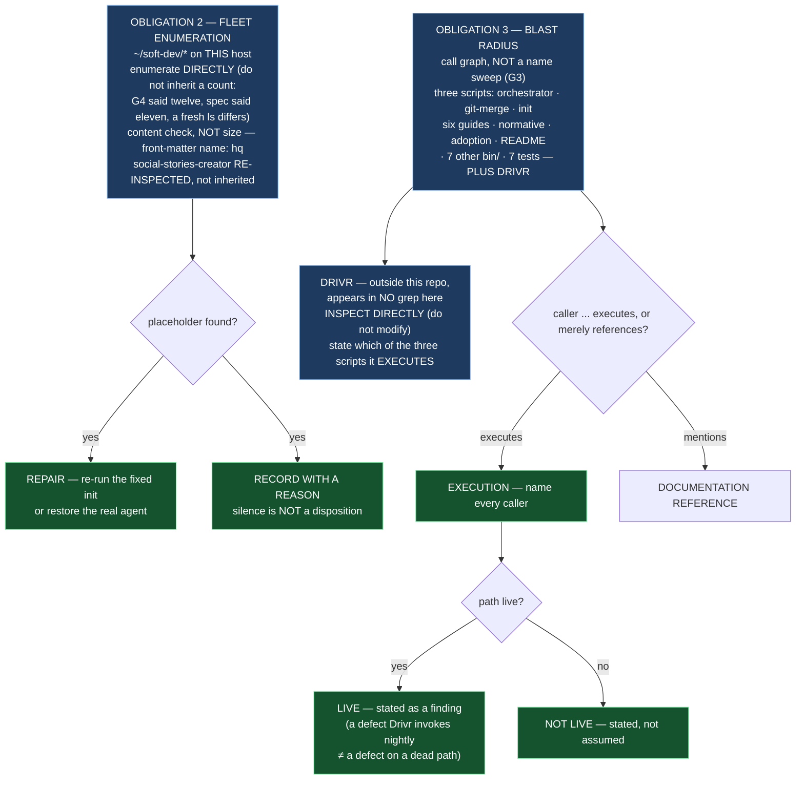

# Epic E42.5 — Fleet Sweep and Blast Radius

## Context

M42 closes one disposition across four `bin/` defects. E42.1–E42.4 repaired the four paths themselves.
E42.5 is deliberately **not** a fifth repair — it is the milestone's **evidence-gathering tail**: two
obligations that say *who is exposed*, over the fleet and over the three scripts the phase just
repaired.

**It is kept separate deliberately.** The milestone spec states why: a fleet-wide evidence sweep across
three scripts, folded into a code-fix epic, would make that epic *"the one things get put in"* — the
pattern HQ named and constrained itself against, one level down.

**Two findings from planning define the work, and both are about what is *not yet* measured:**

- **G3 — the blast radius is larger than scoped, and the measurement is a name sweep.** HQ named
  *"`AI-OPERATING-GUIDELINES.md`, `chat-hierarchy.md` and three guides."* Measured on 2026-08-19: **six
  guides**, three normative/spec documents, an adoption record, `README.md`, **seven other `bin/`
  scripts**, and **seven test files** — plus **Drivr, which is outside this repository and appears in
  no grep run here.** That is a **naming** sweep: *files that mention* the scripts. **E42.5 owes the
  call graph** — who actually **executes** them — and an answer to *are these paths live?*
- **G4 — the live victim is confirmed, and the first-pass sweep is size-only.** `social-stories-creator`'s
  agent is **230 bytes** (re-inspected 2026-08-19, not inherited from the record); every other fleet
  agent measured **14,711 bytes** — the real one. Boundary stated in G4: **size only, not content**, so
  a *different* wrong agent would not show; and `~/soft-dev/*` on this host only. **E42.5 owes the
  enumeration with content, not size.** G4 also offers a lead: the one victim sits in the
  **non-`.governance`** population — exactly the projects M38 identified as init's own creations.

E42.5 is sequenced **after E42.4** — a sweep cannot say what "repaired" means until the fix exists. It
is the milestone's final epic.

---

## Problem Statement

**Who is exposed, and which of them are live? Neither question is answered by what has been measured
so far.**

Two obligations, each a gap between *recorded* and *known*:

**Obligation 2 — the fleet is not enumerated.** The recorded victim is one repository, and the first-pass
sweep was **size-only** and **host-only**. A project carrying a *different* wrong agent (right size,
wrong content) is invisible to a size check; a project on another host is invisible entirely. The
obligation — *repair every placeholder or record it, silence is not a disposition* — cannot be met by
anyone who has not actually enumerated.

**Obligation 3 — the blast radius is a name sweep, not a call graph.** Knowing that a guide *mentions*
`bin/ai-project-orchestrator` says nothing about whether any project *runs* it. A defect on a path
nothing executes is a different priority from one on a path Drivr is about to invoke nightly. The
callers have not been named, Drivr has not been inspected (it is outside this repository), and
liveness has been assumed rather than determined.

**The shared trap: an absence reported where the check never ran.** In both obligations the failure
mode is the milestone's own Hard Constraint — *an absence is only evidence when the thing that would
have created it actually ran.* A size-only sweep that reports "no other placeholders" has not run the
check that would find a content-wrong agent.

---

## Goals

By the end of this Epic, the milestone will have:

1. **Enumerated every enrolled fleet project** with its governance agent's state — size **and**
   content — `social-stories-creator` included, re-inspected, not inherited.
2. **Repaired or recorded every placeholder found**, each with a reason; **silence is not a
   disposition.**
3. **Built the blast radius as a call graph**, not a name sweep — naming every caller of the three
   scripts (`bin/ai-project-orchestrator`, `bin/ai-project-git-merge`, `bin/ai-project-init`),
   **Drivr included**, and distinguishing *documentation reference* from *execution*.
4. **Stated whether each path is live** as a finding, not an assumption — in either direction.

---

## Non-Goals

This Epic explicitly does **not** aim to:

- **Change any `bin/` code.** The four paths were repaired by E42.1–E42.4. This epic produces no
  code fix and no test inversion — it is evidence-gathering and a recorded determination.
- **Repair a fleet project by hand-editing beyond the placeholder.** The disposition is *repair the
  placeholder (re-running the now-fixed init, or restoring the real agent) or record-with-reason* —
  not a general audit of each project's health.
- **Re-run or re-interpret the G3/G4 measurements.** E42.5 **re-measures** them (G2 — the reviewer
  re-measures) but does not re-argue their conclusions.
- **Touch Drivr's code.** Drivr (`~/soft-dev/drivr`) is **inspected** to determine which of the three
  scripts it executes; it is not modified.
- **Determine the fleet sweep's scope for any host other than `~/soft-dev`** — the stated boundary is
  this host, and any claim beyond it is recorded as out-of-scope rather than assumed.

---

## Scope of Work

### 1. Obligation 2 — the fleet enumeration (D1)

Enumerate the enrolled fleet under `~/soft-dev/`, and record, per project:

- its governance agent's **path** and **size**;
- a **content-level** check — not size — that distinguishes the real agent from a placeholder. The
  robust signal is the real agent's front-matter marker (**`name: hq`**, 14,711 bytes, `version: 2.1.0`),
  which the 230-byte stub (opening `# HQ Chat Agent`, body *"This agent is under development in
  Milestone M8"*) does not carry. A content check keyed on `name: hq` catches a *different* wrong
  agent that a size check would miss — the exact boundary G4 stated.
- `social-stories-creator` **re-inspected**, not inherited from the record.
- Each placeholder found **repaired or recorded with a reason**; the record states which and why.

**The count is not inherited, and that is part of the obligation.** G4 said *twelve* enrolled
directories; the milestone spec's own External section said *eleven*; a fresh `ls` of `~/soft-dev/`
shows a different set again (including `tmp/` and other non-`.git` entries). **The epic defines the
enrolment criterion explicitly** (see Design Decisions), enumerates against the filesystem directly,
and states the count it actually found — with the criterion named.

### 2. Obligation 3 — the call graph (D2)

Produce the blast radius as a **call graph**, not a name sweep. G3's table is the starting inventory
and is explicitly **naming-only**; this epic determines who actually **executes** the three scripts.

- For each entry in G3's inventory, classify as **documentation reference** (mentions the script, does
  not execute it) or **execution** (actually invokes it — as a subprocess, a wrapper, or a caller).
- **Inspect `~/soft-dev/drivr` directly.** It is outside this repository and its dependency will not
  appear in any grep run here. State, from its code, which of the three scripts it invokes — the
  milestone spec names the risk that Drivr is *about to call* one of them every night.
- Name **every caller**, Drivr included.

### 3. Liveness, stated (D3)

For each path in the call graph, state **whether it is live** — a finding, not an assumption. A defect
on a path nothing executes is a different priority from one on a path Drivr is about to invoke
nightly. The record says which this is, for each caller.

### 4. The recorded determination (D4)

Produce the **HQ- or Phase-visible determination** naming every caller — the artifact the phase
acceptance criteria require, and the deliverable a Phase Chat can point at during M42 closure to say
the execution tier no longer fails open **and** that who runs it is known.

---

## Deliverables

- [ ] **D1** — The fleet enumeration: every enrolled project, its agent's size and content state,
      with each placeholder repaired or recorded with a reason
- [ ] **D2** — The call graph: every caller of the three scripts, documentation-vs-execution
      distinguished, Drivr inspected directly and included
- [ ] **D3** — The liveness finding for each path, stated (not assumed)
- [ ] **D4** — The recorded HQ- or Phase-visible determination naming every caller
- [ ] Structural diagram (Mermaid, in-repo, no ComfyUI)
- [ ] **Epic Delivery Notice**

---

## Binding Constraints

Settled above this epic — **not re-decidable here**:

1. **E42.5 is sequenced after E42.4.** A sweep cannot say what "repaired" means until the fix exists.
   Do not attempt to repair a fleet project by reference to a fix that has not landed.
2. **The fleet sweep enumerates.** Fixing only the recorded victim (`social-stories-creator`) is **not**
   the obligation.
3. **M42 gates M47.** No M47 epic may be dispatched agentically until this milestone closes.
4. **Silence is not a disposition.** Every placeholder is repaired **or recorded with a reason** — an
   unrepaired, unrecorded placeholder is the milestone's own defect wearing a different name.
5. **Drivr is inspected, not modified.** Its dependency is outside this repository and appears in no
   grep run here; it is reached by direct inspection only.

## Hard Constraint (binding — carried to every Epic)

> **The machinery under repair must not supervise its own repair.**

- **Execution posture: `manual` / paid frontier.** This epic inspects the machinery just repaired and
  the fleet it will run on.
- **On "prove the guard by falsifying" — stated honestly, because it applies differently here.** E42.5
  changes no code and inverts no test; **there is no guard to falsify.** The equivalent discipline is
  **falsifying the sweep itself**: a content-only check that reports "no placeholder in *this* project"
  must be understood as bounded by that check — it has not disproved a *different* wrong agent unless
  it ran a check that would find one. **The burden E42.5 carries is the *absence* burden**: an absence
  is only evidence when the thing that would have created it actually ran.
- **Cite by anchor, not by a bare line number.** (The three scripts are unaffected by the orchestrator's
  +4 drift relevance here — but re-verify rather than trust.)
- **State the layer, time and scope of every claim** (`P11-GH-2`). A size check verified by `wc -c` is
  not a content check verified by reading the front-matter, and a `~/soft-dev/*` claim is not a claim
  about anywhere else.
- **Falsify a pattern before trusting a zero result.** `grep -rln 'governance.agent.md'` finds the
  file; it does not find whether the file is a stub.

---

## Design Decisions Delegated — decide, document, proceed

1. **The enrolment criterion** — what counts as "an enrolled fleet project" (e.g. presence of
   `.git`, of `.ai-project.yml`, of a governance directory), stated explicitly so the enumeration is
   reproducible and the count is derivable.
2. **The content-check signal** — `name: hq` front-matter presence, the *"under development in
   Milestone M8"* string's absence, or a checksum — chosen and recorded, with why it catches a
   *different* wrong agent.
3. **The repair-vs-record threshold** — under what conditions a placeholder is *repaired* (re-running
   the fixed init / restoring the real agent) versus *recorded with a reason* (e.g. a project the epic
   should not mutate), stated plainly.

---

## Definition of Done

Epic E42.5 is complete when:

- [ ] Every enrolled fleet project is enumerated with its agent's state (size **and** content); none is
      skipped; `social-stories-creator` is re-inspected, not inherited
- [ ] Every placeholder found is repaired or recorded with a reason
- [ ] Every caller is named, **Drivr included**, with documentation references distinguished from
      execution
- [ ] Whether each path is live is stated as a finding, not assumed
- [ ] The determination is recorded and HQ- or Phase-visible
- [ ] Every claim states layer, time and scope; no absence is reported where the check did not run
- [ ] Delivery Notice committed; PR opened to `milestone/M42`

---

## Acceptance Criteria

- [ ] A reader can determine, from committed artifacts alone, the fleet's agent state per project —
      size, content, and disposition (repaired or recorded, with reason)
- [ ] No placeholder is left silent — repaired or recorded, never merely present
- [ ] Every caller of the three scripts is named, Drivr included, with exec-vs-reference distinguished
- [ ] Whether each path is live is stated, not assumed
- [ ] The blast radius is a call graph, not a name sweep — and the difference is visible in the record
- [ ] Every claim states layer, time and scope (`P11-GH-2`), and the G4 boundary (content, not size) is
      honoured

---

## Technical Constraints

**In scope:** the fleet under `~/soft-dev/` (read, and repair-or-record of placeholders); `~/soft-dev/drivr`
(inspect only — do not modify); the recorded determination artifact under this repository.
**Do not touch:** any `bin/` script (repaired by E42.1–E42.4); `governance/agents/governance.agent.md`
(the real agent); Drivr's code itself (inspect, do not edit).
**Invocation:** `PYTHONPATH=. pytest -q` — bare `pytest` fails collection (**note:** E42.5 introduces
no code and may not change the suite count; the suite is re-confirmed green, not extended).
**Boundary:** the fleet sweep is `~/soft-dev/*` on **this host**. Any claim beyond that is recorded as
out-of-scope, not assumed.

---

## Dependencies

**Internal**
- **E42.4** is sequenced **before** this epic — "repaired" is defined by the fix E42.4 lands, and a
  repair performed against a pre-fix init would re-break the install E42.4 just fixed.
- **M42 gates M47** and **E41.5** — this epic's determination is part of the closure those two wait on.

**External**
- **The fleet at `~/soft-dev/`** — enumerated directly on this host.
- **Drivr at `~/soft-dev/drivr`** — inspected directly; outside this repository.
- **Network / GitHub remote** only if a *repair* disposition re-runs the (now-fixed) `ai-project-init`
  and needs the submodule clone.

**Blockers**
- None at planning.

---

## Timeline

**Estimated Effort:** 1 session (enumerate, inspect, record).
**Target Completion:** final epic of the milestone.
**Actual Completion:** In progress.

---

## Execution Notes

**Order:**
1. **Define the enrolment criterion and the content signal first** (Design Decisions), so the
   enumeration and the count are reproducible.
2. Enumerate `~/soft-dev/` directly — do not inherit G4's *twelve* or the spec's *eleven*; state the
   count you actually found and the criterion you applied.
3. Content-check each agent (front-matter `name: hq` vs the stub markers); repair or record each
   placeholder.
4. Build the call graph from G3's inventory, then **inspect Drivr directly** — it is not in the repo.
5. State liveness per path as a finding.
6. Record the determination; run the suite to confirm no regression (no code was touched — state that
   the count is re-confirmed, not extended).

**Traps:**
- **Inheriting a count.** G4 said twelve, the spec's External section said eleven, a fresh listing
  differs again. Enumerate; do not copy a number.
- **A size check standing in for a content check.** `wc -c` proves nothing about *which* agent is
  present; the G4 boundary is content, not size.
- **Reporting an absence a check wouldn't find.** "No other placeholders" from a size-only pass is the
  milestone's own defect.
- **Treating Drivr as answerable by grep.** It is outside this repository; it must be opened and read.
- **Assuming liveness in either direction** — *dead path* and *live path* are both findings to state,
  neither to assume.

---

## Related Documents

- [M42 Milestone Spec](P12-M42__milestone-spec.md) — Findings G3/G4, Obligations 2 and 3, E42.5 Epic Detail, Hard Constraint, Binding Constraints
- [P12 Phase Spec](P12__phase-spec.md) — §P12.2 blast radius, §Acceptance Criteria ("every caller … Drivr included")
- [E42.4](P12-M42-E42.4__spec__init-stops-manufacturing-an-agent.md) — sequenced before this epic
- [P12-GH-2 Carry-Forward Note](P12__carry-forward-note__P12-GH-2-init-validator-accepts-its-own-placeholder.md) — the live victim, the boundary
- [PROJECT-SYSTEM-GUIDELINES.md](../../../governance/PROJECT-SYSTEM-GUIDELINES.md)
- [AI-OPERATING-GUIDELINES.md](../../../governance/AI-OPERATING-GUIDELINES.md)

---

## Visual Bindings

**Visual binding**
- **Link:** (inline — Structural diagram; no hosted link needed per AOG §17.3/§17.5)
- **What:** diagram
- **Level:** Epic
- **State:** proposed

- **Description:** E42.5 is the milestone's evidence-gathering tail, not a code fix. Obligation 2
  enumerates the fleet by **content**, not size — the G4 boundary, and the difference between *no
  other placeholder* (a size-only result) and *no placeholder found* (a content check that ran).
  Obligation 3 turns G3's name sweep into a **call graph**: every caller of the three scripts named,
  documentation-vs-execution distinguished, **Drivr inspected directly** because it is outside the
  repository and appears in no grep run here. Each path's liveness is stated as a finding, never
  assumed. The count is enumerated, not inherited — G4's *twelve* and the spec's *eleven* disagree with
  a fresh listing, which is itself the lesson. Proposed-track Structural diagram (AOG §17.3/§17.6),
  Mermaid, no ComfyUI.

---

## Notes

- **This epic has no guard to falsify, and saying that plainly is part of doing it right.** The
  milestone's Hard Constraint phrase *"prove every guard by falsifying it"* assumes a code change.
  E42.5 changes no code — its equivalent is the **absence discipline**: a sweep that reports "no
  placeholder here" must have run a check that *would have found one*. A size check does not. Falsify
  the sweep, not a guard.

- **The count disagreement is the lesson, not a bug to resolve in planning.** G4 named twelve enrolled
  directories, the milestone spec's External section named eleven, and a planning-time listing of
  `~/soft-dev/` returned a different set still (including non-`.git` entries like `tmp/`). The spec
  therefore forbids inheriting a count and requires the criterion to be stated. **Enumerate; do not
  copy a number.**

- **The non-`.governance` correlation is a lead, not a finding.** G4 observes the one victim sits in
  the population M38 identified as init's own creations (projects without a `.governance` directory).
  If the content-level enumeration corroborates that — *victims cluster with init's creations* — that
  is worth capturing; if it does not, the observation is recorded as not-holding rather than quietly
  dropped.

---

## Changelog

| Version | Date | Change |
|---|---|---|
| 1.0.0 | 2026-09-01 | Initial E42.5 spec, from M42 spec v1.1.0 (Findings G3/G4, Obligations 2 and 3). Fleet enumeration by content not size, with the enrolment criterion and count stated by the epic (not inherited — G4's twelve, the spec's eleven, and a fresh listing disagree). Blast radius as a call graph, Drivr inspected directly, liveness stated per path. Notes the honest deviation from the Hard Constraint's falsification clause: E42.5 has no guard to falsify, its equivalent is the absence discipline. Sequenced after E42.4, final epic. No scope, ordering, gate or acceptance-criterion change from the milestone spec. |
