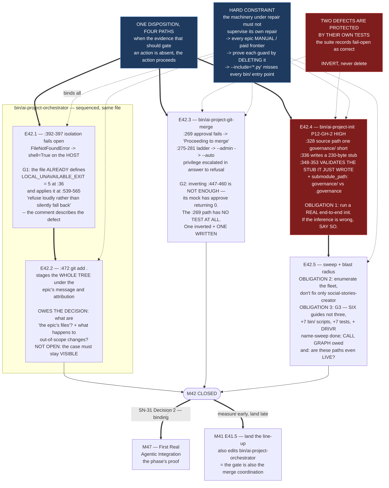

# Milestone M42 — Fail-Closed Execution Tier

## Purpose

**No path in `bin/` may proceed when the evidence that should gate it is absent.**

Four defects, verified on `master`. They are not four unrelated bugs — they are **one disposition**:
*when the evidence that should gate an action is absent, the action proceeds.* Isolation missing →
run on the host. Approval missing → merge anyway. The agent's file list unknown → stage everything.
The governance agent missing → write a placeholder and validate the placeholder.

This milestone ensures:

- Every one of those four paths **stops and says so**, and any surviving permissive path is an
  **explicitly declared, recorded** opt-in rather than a fallback.
- **The suite asserts the guard rather than the defect.** Two existing tests currently encode
  fail-open behaviour as expected; both are **inverted, not deleted**, and the approval-abort — which
  no test covers at all — gets one.
- **Who actually runs these scripts is determined and recorded**, not assumed.

**M42 gates M47** — the phase's proof — by CFO decision (SN-31 Decision 2), and **M41's terminal
epic** waits on its closure. It is the milestone with **zero dependency on anything else in the
phase**, and the one two other milestones wait for.

---

## Problem Statement

**Exposure today is genuinely low precisely because nothing runs agentically.** That is not
reassurance; it is the reason the constraint is a sequencing one. **All five instances of the
disposition go live simultaneously the moment one project runs agentically**, and there is no
partial-adoption path that reduces the risk incrementally.

Agentic mode is *defined* by no human being present to notice an absence. A system that proceeds on
missing evidence is therefore exactly as safe as its supervision, which under agentic operation is
zero.

**Two of these four defects are protected by their own tests.** That is the sharpest statement of the
problem available: the suite does not merely fail to catch them — it records them as correct.

---

## The four defects — verified file:line

> ## ⚠ LINE NUMBERS HAVE DRIFTED. RE-PINNED 2026-09-01, AND CITE BY ANCHOR FROM NOW ON.
>
> **`bin/ai-project-orchestrator` shifted +4 lines when #236 edited `DEFAULT_MODELS`.** Every number
> this spec cites for that file is **stale by four**. `bin/ai-project-git-merge` and
> `bin/ai-project-init` are **unchanged**.
>
> **Re-pinned on `phase/P12` at `3925aea`, by searching for the code rather than by trusting the
> number:**
>
> | Defect | Anchor — search for this | Cited | **Actual** |
> |---|---|---|---|
> | **D1** sandbox fail-open | `except FileNotFoundError:` | `:392` | **`:396`** |
> | **D1** host execution | `subprocess.run(command, shell=True` | `:397` | **`:401`** |
> | **D2** unscoped staging | `["git", "add", "."]` | `:472` | **`:476`** |
> | **G1** the convention it violates | `LOCAL_UNAVAILABLE_EXIT = 5` | `:36` | **`:41`** |
> | **G1** the worked shape | `sys.exit(LOCAL_UNAVAILABLE_EXIT)` | `:565` | **`:569`** |
> | **D3** approval warning | `Proceeding to merge` | `:269` | `:269` **unchanged** |
> | **D3** the `--admin` rung | `"--admin"` | `:275-281` | **`:279`** within that block |
> | **D3** the test to invert | `def test_promote_branch_fallback_merge` | `:447-460` | `:447` **unchanged** |
> | **D4** off-by-one source path | `local src_file=` | `:328` | `:328` **unchanged** |
> | **D4** the stub | `This agent is under development` | `:336-346` | **`:340`** within that block |
> | **D4** the validator | `HQ agent file is not readable` | `:348-353` | **`:349`** within that block |
>
> **THE RULE THIS ESTABLISHES, and it is the same lesson as the Starter version stamps:** **a line
> number is a moving target and citing one alone is stamping it.** **Search for the anchor; use the
> number only to say where it was, at a stated ref, on a stated date.** **An epic that opens `:392`
> today finds `try:` — which does not look wrong, and that is the danger.**
>
> **This is `P12-GH-3` with the most mechanical dependent yet:** the premise moved by four lines
> because an unrelated PR added four lines above it, and **nothing about the spec looked stale.**

**Re-verified by the Phase Chat by reading, on `master` at `9ee810e`, 2026-08-19** (G2 — *the
reviewer re-measures*). All four line references in the phase spec hold.

### Defect 1 — Isolation fails open

**`bin/ai-project-orchestrator:392-397`**

```
        except FileNotFoundError:
            # Fallback to local execution if Docker is not available in current environment
            print("[!] Docker is not installed or available. Executing locally with model environment...")
            env = os.environ.copy()
            env["AI_PROJECT_ACTIVE_MODEL"] = active_model
            result = subprocess.run(command, shell=True, env=env, capture_output=True, text=True)
```

A `FileNotFoundError` on the Docker invocation falls through to **`shell=True` execution on the
host**. The sandbox is the only thing standing between a dispatched model and the operator's machine,
and its absence is handled by removing it.

> **⚠ FINDING G1 — the file already defines the convention this defect violates, and uses it
> elsewhere.**
>
> `bin/ai-project-orchestrator:36` defines `LOCAL_UNAVAILABLE_EXIT = 5`, documented at `:31-35` as:
>
> > *"5 means 'a local resource this run depends on is genuinely unavailable, **refuse loudly rather
> > than retry or silently fall back**'."*
>
> **That sentence describes the defect.** The convention is shared with `bin/run-dev-agent`'s
> `EXIT_LOCAL_UNAVAILABLE` (`:78`) and `bin/ai-project-visual`'s `EXIT_LOCKED` (`:64`), and **this
> same script already applies it at `:539-565`** with a complete worked shape: print the reason,
> generate an escalation report, **archive the trigger file to prevent duplicate runs**, and exit 5.
>
> **So the fix is not inventing a policy. It is applying the file's own, three hundred lines below
> the place that ignores it.** That materially lowers E42.1's design risk and raises the severity of
> the omission.
>
> *Verified by reading `:31-36`, `:392-397`, `:539-565`; `bin/run-dev-agent:78,102`;
> `bin/ai-project-visual:64` — repo, 2026-08-19.*

**The fix is not a louder log.** Absence of isolation must **abort**. Any surviving host-execution
path must be an **explicitly declared, recorded opt-in**, and **the run record must state that it was
taken.**

### Defect 2 — Unscoped staging launders out-of-scope changes

**`bin/ai-project-orchestrator:472`**

```
            subprocess.run(["git", "add", "."], cwd=PROJECT_ROOT)
            subprocess.run(["git", "commit", "-m", f"feat: programmatically implement Epic {epic_id} deliverables\n\n..."])
```

`git add .` stages **the entire tree** from `PROJECT_ROOT`, then commits it under the epic's message
and the epic's attribution. **The failure is not sloppiness — it is that the case "the agent touched
something it should not have" has no representation.** That case is silently absorbed into a commit
that claims to be the epic's deliverables.

### Defect 3 — Approval failure prints a warning and merges anyway

**`bin/ai-project-git-merge:269` and `:275-281`**

```
269:  print(f"[!] Warning: Pull Request approval skipped or not possible. Proceeding to merge...", file=sys.stderr)
275:  merge_methods = [
277:      ["gh", "pr", "merge", "--merge", "--delete-branch", pr_url],
279:      ["gh", "pr", "merge", "--merge", "--admin", pr_url],
281:      ["gh", "pr", "merge", "--auto", "--merge", pr_url]
  ]
```

Approval failure is **downgraded to a warning**, and the ladder then escalates *privilege* in
response to *refusal*: standard merge → **`--admin` override** → auto-merge. **A branch protection
that says no is answered by trying harder.**

**Approval failure must abort.** The `--admin` rung **goes, or is gated behind a recorded human
authorization** — and "recorded" means an artifact, not a console prompt.

### Defect 4 — The initializer manufactures a governance agent and then validates the substitute

**`bin/ai-project-init:328, 336-353`** — `P12-GH-2`, severity **High**

1. **`:328`** reads `$project_dir/governance/agents/governance.agent.md`. `add_governance_submodule()`
   (`:274`, `:281`, `:294`) clones the **whole** `ai-project-system` repository into
   `<project>/governance`, and inside this repository the agent lives at
   `governance/agents/governance.agent.md` — **re-verified today as the only file of that name in the
   tree.** So after a real install the agent is at
   `<project>/governance/governance/agents/governance.agent.md`, **one level deeper than the path
   read.** The source is never found.
2. **`:336-346`** writes a 230-byte stub whose body says *"This agent is under development in
   Milestone M8."* **M8 closed in P2.** The temporary branch has been the only reachable branch for
   at least nine phases.
3. **`:348-353`** validates: readable, non-empty, first line matches `^(#|---)`. **The stub satisfies
   all three** — it begins `# HQ Chat Agent`. **The validator tests the properties a placeholder
   trivially has, never the property that matters: that the file is the governance agent.**

**Second defect, same script, travelling with it:** `write_project_config()` (`:262`) writes
`submodule_path: governance/` against the fleet's **`.governance`** convention (M38: 8 of 11
projects, and **the three exceptions are exactly the projects init created**). **A project that
follows the convention has its governance somewhere init never looks** — which is why the first
defect is universal rather than occasional.

**Repairing installs without repairing init re-breaks them on the next install.** That is the CFO's
own reasoning and the reason this lands here on its own merits, **not as a component of the
governance-auto-update reconciler**, which is split and out of P12 entirely.

---

## The decision this milestone owes — defect 2's design question

**Named here, decided in E42.2, recorded in the epic's own artifact.** It is a design decision at
this level (phase starter: *"pick a direction, document the reasoning, and proceed; do not
escalate"*), so the milestone spec bounds it rather than answering it.

**The question, in two parts:**

1. **What are "the epic's files"?** Candidates the epic must weigh explicitly: paths declared in the
   epic spec's Deliverables; paths under a declared root; the diff the agent's own tool calls
   report as touched; a manifest the agent is required to emit; or the whole worktree diff minus a
   deny-list.
2. **What happens when the agent touched something outside that set?** Abort the commit? Commit the
   in-scope subset and record the remainder? Stage nothing and escalate?

**One thing is not open.** Whatever the answer, **the out-of-scope case must be represented in the
record.** `git add .` is rejected not because it is broad but because it makes the case
**invisible** — it produces a commit indistinguishable from one where nothing out of scope happened.
**Silence about an out-of-scope modification is the same disposition this milestone exists to close.**

**The related, narrower decision — the sandbox opt-in's shape** (a flag, a config key, or a per-run
declaration) — is **E42.1's**, on the same terms. Whichever shape is chosen, **the run record states
that the opt-in was taken**; an opt-in nobody can see afterwards is a fallback with extra steps.

---

## The test inversions — two to invert, and one that must be written

**Inversion, not deletion.** A deleted test leaves no assertion; an inverted test makes the guard the
thing the suite protects.

### Inversion 1 — `bin/ai-project-git-merge:447-460`

`test_promote_branch_fallback_merge` mocks: push OK → PR created → **approve OK** → standard merge
returns `returncode=1, stderr="Branch protected"` → **`--admin` returns 0** → and asserts
`self.assertTrue(res)`. **The suite asserts that the admin override succeeds against a branch that
said no.**

**After inversion the suite must fail if the admin override is reachable unrecorded.**

> **⚠ FINDING G2 — inverting this test does NOT cover the approval-failure abort.**
>
> In this test's own mock sequence, **`gh pr review --approve` returns 0.** The test exercises the
> *ladder*, not the *approval bypass*. **The `:269` warning-and-continue path has no test at all** —
> re-verified by reading the full embedded suite in `bin/ai-project-git-merge`, 2026-08-19.
>
> **So E42.3 owes a NEW test, not only an inverted one:** approval fails → the function **aborts**
> and never reaches `merge_methods`. Inverting the existing test and stopping there would close the
> ladder and leave the phase spec's own defect 3 — *approval failure prints "Proceeding to merge"* —
> unguarded.

### Inversion 2 — `tests/test_init_agent_path.py`

The test invokes the script with **`--skip-submodule`**, then asserts the file exists, is non-empty,
and begins with `#` — **the same three properties the stub satisfies.** The branch that would fail is
**unreachable under its own invocation.**

**It correctly guards `P6-GH-11`** (the `.github/agents/` → `.ai-project/agents/` path fix) and that
coverage must survive. **After inversion the suite must fail if a placeholder agent is installable at
all.**

---

## The three obligations beyond the fixes

### Obligation 1 — Run a real, end-to-end `ai-project-init`

**Not `--skip-submodule`.** `P12-GH-2` states its own verification boundary: the paths were read, the
live victim was taken from the record, and **no end-to-end init was run.**

**M42 runs it. If the inference is wrong, say so** — the finding then shrinks to the validator and
the test, **which are defects on their own terms** and are fixed regardless.

### Obligation 2 — Sweep the fleet for existing placeholder agents

**Enumerate; do not fix only the one known case.** `social-stories-creator` is the recorded victim
(P11's closure declaration, ~230 bytes) and **was not re-inspected by HQ.** Each project found is
**repaired or recorded** — recorded, with a reason, is an acceptable disposition; **silence is not.**

> **⚠ FINDING G4 — the live victim is CONFIRMED by direct inspection, and a first-pass sweep of the
> fleet finds exactly one.**
>
> HQ's `P12-GH-2` note states the victim was *"verified by the record, not re-run here."* The Phase
> Chat re-inspected on 2026-08-19: **`~/soft-dev/social-stories-creator/.ai-project/agents/governance.agent.md`
> is 230 bytes.** **The inference is confirmed at the artifact level.** Across twelve enrolled fleet
> directories, **every other project's agent is 14,711 bytes** — the real one.
>
> **This narrows the sweep; it does not discharge it.** Two boundaries, stated per `P11-GH-2`:
> the check was **file size only**, not content, so a *different* wrong agent would not show; and it
> covered `~/soft-dev/*` on this host, which is not a claim about anywhere else. **E42.5 still owes
> the enumeration** — with content, not size — and still owes the repair-or-record disposition.
>
> **A second observation for E42.5, offered as a lead rather than a finding:** the one victim is one
> of the projects **without** a `.governance` directory, which is exactly the population M38
> identified as init's own creations. **The two defects in `bin/ai-project-init` may be visible as
> one correlation in the fleet**, which would be corroboration worth capturing.

### Obligation 3 — Determine and record the blast radius

These scripts live in `bin/` at this repo's root and are therefore **not** inside the `governance/`
submodule adopters consume — **but the corpus instructs adopters to use them.**

> **⚠ FINDING G3 — the radius is larger than the scoping states.** HQ named
> *"`AI-OPERATING-GUIDELINES.md`, `chat-hierarchy.md` and three guides."* Measured today across
> `governance/`, `bin/`, `tests/` and `README.md`:
>
> | Tier | Files referencing at least one of the three scripts |
> |---|---|
> | **Guides — six, not three** | `ADOPTION-FAQ.md`, `ADOPTION-GUIDE.md`, `FAQ.md`, `gpu-coexistence.md`, `QUICK-START.md`, `visual-artifacts.md` |
> | Normative / spec | `AI-OPERATING-GUIDELINES.md`, `systems/chat-hierarchy.md`, `ai-project-yml-spec.md` |
> | Other governance | `adoption-records/adoption-home-finance-2026-05-21.md` |
> | Root | `README.md` |
> | **`bin/` — seven other scripts** | `ai-project-daemon`, `ai-project-validate`, `ai-project-visual`, `run-dev-agent`, `run-qa-agent`, `verify-daemon.sh`, `verify-loop.sh` |
> | **`tests/` — seven files** | `test_init_agent_path.py`, `test_model_config.py`, `test_daemon_path_resolution.py`, `test_visual_artifacts_config.py`, `test_sandbox_endpoint_forwarding.py`, `integration/test_sandbox_ollama_reachability.py`, `integration/test_visual_artifacts_helper.py` |
>
> *Verified by `grep -rln` over `governance/ bin/ tests/ README.md`, repo, 2026-08-19. This is a
> **naming** sweep, not a **call-graph**; E42.5 owes the call graph.*

**Name every caller, Drivr included** — Drivr at `~/soft-dev/drivr` is outside this repository and
its dependency will not appear in any grep run here.

**And answer the question the enumeration raises rather than leaving it implied:** *are these paths
live?* A defect on a path nothing executes is a different priority from one on a path Drivr is about
to call every night. **Determine it; do not assume it in either direction.**

---

## Binding Constraints (settled — NOT for re-debate)

1. **M42 gates M47.** No epic in M47 may be dispatched agentically until M42 is closed (SN-31
   Decision 2, made operative by HQ Decision 2). **If M42 slips, M47 slips.** That is intended
   behaviour, not a scheduling failure.
2. **M41's terminal epic (E41.5) is gated on M42's closure.** A model change landing with a lane
   repair makes the next failure unattributable.
3. **The tests are inverted, not deleted.**
4. **`ai-project-init` is repaired on its own merits** as a fail-open defect. **It is not a
   governance-auto-update reconciler component** — that work is split and neither half is in P12.
5. **The fleet sweep enumerates.** Fixing only the known case is not the obligation.
6. **A surviving permissive path must be declared AND recorded.** Declared-but-unrecorded is a
   fallback with a flag on it.

---

## Hard Constraint (binding — carries to every Epic)

**The machinery under repair must not supervise its own repair.**

- **Execution posture for every epic in this milestone: `manual` / paid frontier.** These epics
  modify the sandbox path, the staging path, the merge path and the initializer — **and the agentic
  lane runs through the first two of them.** Every Epic Execution Chat Starter records
  `Execution Mode: manual` and `models.epic_manual`. **This is a scoping judgment about these epics,
  not a general ruling about local inference.**
- **Prove the guard by falsifying it.** For each fix, demonstrate the new test **fails** when the
  guard is removed — the method B2.1 used (delete the line, watch seven tests fail). A guard never
  observed to fail is a guard never observed.
- **`"is the baseline still N?" is an unreliable guard** (M38 carry-forward): `testpaths` can mask a
  stale `norecursedirs`, so a rotted check is invisible. Assert the behaviour, not the count.
- **State the layer, time and scope of every claim** (`P11-GH-2`). A path verified by reading is not
  verified by running; the end-to-end init is Obligation 1 for exactly that reason.
- **This corpus defeats naive pattern-matching.** **`--include='*.py'` skips every `bin/` entry
  point — and all four defects are in `bin/`.** Literal-string guards are reflow-fragile. **Falsify a
  pattern before trusting a zero result.**
- **An absence is only evidence when the thing that would have created it actually ran.**

---

## Planned Epics

Five epics. **E42.1 and E42.2 both edit `bin/ai-project-orchestrator` and are sequenced, not
parallel.** E42.3 is independent. **E42.4 precedes E42.5** — the sweep cannot say what "repaired"
means until the fix exists.

### Confirmed Epics

- **E42.1** — Sandbox absence fails closed *(orchestrator; first)*
- **E42.2** — Epic-scoped staging, and the out-of-scope case made visible *(orchestrator; after
  E42.1)*
- **E42.3** — The merge ladder aborts; one test inverted, one written *(independent)*
- **E42.4** — `ai-project-init` stops manufacturing an agent (`P12-GH-2`) *(before E42.5)*
- **E42.5** — Fleet sweep and blast radius *(after E42.4)*

---

## Epic Detail

### E42.1 — Sandbox absence fails closed *(first)*

**Deliverables**

1. **`bin/ai-project-orchestrator:392-397` aborts on `FileNotFoundError`**, applying **the file's own
   convention** (G1): `LOCAL_UNAVAILABLE_EXIT = 5`, with the worked shape already present at
   `:539-565` — state the reason, generate an escalation report, **archive the trigger file so the
   run is not silently retried**, exit 5.
2. **An explicitly declared host-execution opt-in**, if one is to survive at all. **The shape is this
   epic's decision** — flag, config key, or per-run declaration — recorded with its reasoning.
   Whichever is chosen: **the run record states that the opt-in was taken**, naming it, so a reader
   of the record can tell a sandboxed run from an unsandboxed one **without access to the invocation**.
3. **Tests asserting the guard**, including a **falsification demonstration**: the new test fails
   when the abort is removed.
4. **A statement of what "Docker is available" is taken to mean** and how it is detected —
   `FileNotFoundError` on the binary is the current, narrow signal, and a daemon that is installed
   but not running is a different failure that must not silently take a different path.

**Acceptance criteria**

- [ ] Docker-absent no longer reaches `subprocess.run(..., shell=True, ...)` as a silent fallback
- [ ] The abort uses `LOCAL_UNAVAILABLE_EXIT` and produces the same escalation-plus-archive record the
      script already produces for its other local-unavailable case
- [ ] Any surviving host path is declared, and the **run record** states it was taken
- [ ] The guard is shown to fail when removed
- [ ] Suite green; no skip introduced to route around the change

---

### E42.2 — Epic-scoped staging, and the out-of-scope case made visible *(after E42.1)*

**Deliverables**

1. **The design decision recorded** — *what "the epic's files" means*, and *what happens to
   out-of-scope modifications* — with the options weighed and the reasoning stated. **This epic owns
   the decision** (see "The decision this milestone owes").
2. **`:472`'s `git add .` replaced** by staging scoped to that definition.
3. **The out-of-scope case represented in the record.** Whatever the disposition — abort, partial
   commit plus a record, or escalate — **it must be distinguishable afterwards from a run in which
   nothing out of scope happened.** That is the non-negotiable half.
4. **Tests covering both branches** — in-scope-only, and out-of-scope-present — with a falsification
   demonstration.

**Acceptance criteria**

- [ ] The epic commit contains the epic's files, per a definition committed in this epic's artifact
- [ ] An out-of-scope modification produces a distinguishable, recorded outcome — never a commit that
      looks clean
- [ ] Both branches are tested and the guard is shown to fail when removed
- [ ] The commit message's claim (*"programmatically implement Epic … deliverables"*) is true of what
      the commit actually contains

---

### E42.3 — The merge ladder aborts; one test inverted, one written *(independent)*

**Deliverables**

1. **`:269` aborts on approval failure.** No *"Proceeding to merge"*.
2. **The `--admin` rung removed, or gated behind a recorded human authorization** — **recorded means
   an artifact**, not a console prompt and not an environment variable read at runtime with nothing
   written down. The `--auto` rung is evaluated on the same terms and kept or dropped deliberately.
3. **Inversion of `test_promote_branch_fallback_merge` (`:447-460`)** — the suite must fail if the
   admin override is reachable unrecorded.
4. **A NEW test for the approval-failure abort** (G2). The existing test's mock has **approval
   returning 0**; it exercises the ladder, not the bypass, and **the `:269` path has no coverage at
   all.** Approval fails → abort → `merge_methods` never reached.
5. **Falsification demonstrations for both.**

**Acceptance criteria**

- [ ] Approval failure aborts; the ladder is unreachable from that branch
- [ ] `--admin` is gone or gated behind a **recorded** authorization
- [ ] `:447-460` asserts the guard, and a separate test covers the approval abort
- [ ] Both guards shown to fail when removed
- [ ] `merge-authorization.md` is **not** edited here — that template is M43's (SN-31 Decision 4);
      note any interaction and leave it

---

### E42.4 — `ai-project-init` stops manufacturing an agent (`P12-GH-2`) *(before E42.5)*

**Deliverables**

1. **The source path corrected** at `:328` so it resolves after a **real** submodule install. The
   agent is at `<project>/<submodule>/governance/agents/governance.agent.md`; the current path is one
   `governance/` level short.
2. **The stub-writing branch removed.** Not improved, not made louder — **removed.** Absent source →
   the script fails with a stated reason. **Manufacturing a substitute is the one answer that must
   not survive this milestone.**
3. **The validator strengthened** to test the property that matters, not the properties a placeholder
   trivially satisfies. *(A content assertion — provenance, a known marker, a checksum — is this
   epic's choice; the E36.3 precedent of freezing a check by `sha256` is available and is not
   mandated.)*
4. **`submodule_path` written to match the fleet convention** — `.governance` (M38: 8 of 11; the
   three exceptions are exactly init's own creations). **Note whether the path is still hard-coded
   with no flag** (the M38 escalation's finding) and dispose of that deliberately.
5. **`tests/test_init_agent_path.py` inverted** so a placeholder is not installable at all, **with
   `P6-GH-11`'s canonical-path coverage preserved.**
6. **OBLIGATION 1 — a real end-to-end `ai-project-init` run**, no `--skip-submodule`, captured as
   evidence. **If it shows the stub is not in fact produced, say so plainly** and record the finding
   as shrinking to the validator and the test. **Do not quietly drop the correction** — a diagnosis
   that survives its own test is worth more than one that is never tested.

**Acceptance criteria**

- [ ] A real init locates the governance agent; no stub branch exists in the script
- [ ] The validator fails on a placeholder
- [ ] `submodule_path` matches the fleet convention, and the hard-coding is disposed of deliberately
- [ ] `tests/test_init_agent_path.py` fails if a placeholder is installable, and still guards
      `P6-GH-11`
- [ ] The end-to-end run is captured, and its result — **confirming or falsifying the inference** —
      is stated

---

### E42.5 — Fleet sweep and blast radius *(after E42.4)*

**Kept separate deliberately.** It is fleet-wide evidence-gathering across three scripts; folding it
into a code-fix epic would make that epic *"the one things get put in"* — the pattern HQ named and
constrained itself against, one level down.

**Deliverables**

1. **OBLIGATION 2 — an enumeration of every project in the fleet carrying a placeholder governance
   agent**, with size and path, `social-stories-creator` included and **re-inspected rather than
   inherited from the record.** Each is **repaired or recorded with a reason.**
2. **OBLIGATION 3 — the blast radius**, as a **call graph**, not a name sweep. G3's table is the
   starting inventory and is explicitly **naming-only**; this epic determines who actually
   **executes** these three scripts. **Drivr (`~/soft-dev/drivr`) is outside this repository and must
   be inspected directly** — no grep run here will find it.
3. **A determination of whether each path is live**, stated. A defect on a dead path and one Drivr is
   about to invoke nightly are different priorities, and the record should say which this is.
4. **A recorded HQ- or Phase-visible determination** naming every caller — the artifact the phase
   acceptance criteria require.

**Acceptance criteria**

- [ ] Every fleet project is enumerated with its agent's state; none is skipped
- [ ] Every placeholder found is repaired or recorded with a reason
- [ ] Every caller is named, **Drivr included**, distinguishing documentation references from
      execution
- [ ] Whether each path is live is stated as a finding, not assumed

---

## Prerequisites and Dependencies

**Internal**

- `phase/P12` branched from `master` at `9ee810e`; `milestone/M42` branched from it.
- **Suite baseline 549 passed / 0 failed**, measured 2026-08-19 with `PYTHONPATH=. pytest -q`.
  **Bare `pytest` fails collection.**
- **`bin/ai-project-orchestrator` is also edited by M41's terminal epic E41.5** (`DEFAULT_MODELS`,
  `:23-29`). **M42's changes to that file land first by construction** — E41.5 is gated on this
  milestone's closure. Epic Chats here should not reserve or coordinate that region; **the gate is
  the coordination.**

**Outward — what waits on M42**

- **M47, the phase's proof.** No M47 epic may be dispatched agentically until M42 is closed.
- **M41's terminal epic E41.5.** The model line-up cannot land first.

**External**

- **Docker** — present, `29.6.1`, verified 2026-08-19. E42.1 changes what happens in its **absence**,
  which is a path that must be **simulated in test**, not by uninstalling Docker on a host two other
  milestones are measuring against.
- **The fleet at `~/soft-dev/`** — 11 project directories present, for E42.5's sweep.
- **Drivr at `~/soft-dev/drivr`** — outside this repository; E42.5 inspects it directly.
- **A GitHub remote** for any live exercise of `bin/ai-project-git-merge`. E42.3's guards must be
  provable **without** performing a real protected-branch override.

---

## Definition of Done (Milestone)

- [ ] All five epics delivered, accepted, and merged to `milestone/M42`
- [ ] **No path in `bin/` proceeds on absent gating evidence** — sandbox absence aborts or is a
      recorded explicit opt-in; staging is epic-scoped; approval failure aborts; the `--admin` rung is
      gone or gated behind recorded human authorization; **`ai-project-init` never manufactures a
      governance agent**, and finds the real one
- [ ] **The suite asserts the guard rather than the defect** — `bin/ai-project-git-merge:447-460` and
      `tests/test_init_agent_path.py` inverted, **plus a new test for the approval abort**
- [ ] **Every new guard has been shown to fail when removed**
- [ ] The end-to-end `ai-project-init` was run, and its result stated — **including if it falsifies
      the diagnosis**
- [ ] The fleet is swept; every placeholder repaired or recorded
- [ ] The blast radius is recorded as a call graph naming every caller, **Drivr included**, with each
      path's liveness stated
- [ ] Defect 2's design decision is recorded with its reasoning; E42.1's opt-in shape likewise
- [ ] Suite green — **549 baseline** plus this milestone's additions, no regressions, **no skips
      introduced to route around a change**
- [ ] Milestone Closure Declaration committed, `is_final: false`

---

## Acceptance Criteria (Milestone)

- [ ] A reader can determine, for each of the four defects, **what it did, what it now does, and
      which test proves it** — from committed artifacts alone
- [ ] **No fix substitutes a louder log for an abort.** Warning-and-continue does not appear as the
      disposition of any of the four
- [ ] **No fix manufactures a substitute for missing evidence** — the disposition `P12-GH-2` files is
      absent from the repaired paths
- [ ] Every claim states the layer, time and scope at which it was verified (`P11-GH-2`), and the
      read-versus-run distinction is honoured
- [ ] M47's precondition is satisfiable: a Phase Chat can point at this milestone's closure and say
      the execution tier no longer fails open

---

## Timeline

**Target Start:** 2026-08-19
**Target Completion:** early in the phase — **two other milestones wait on it**
**Actual Start:** Not started
**Actual Completion:** In progress

**This is the milestone with zero dependency on anything else in the phase and the one that gates the
phase's proof.** Its schedule risk is other milestones' schedule risk.

---

## Visual Bindings

**Visual binding**
- **Link:** (inline — Structural diagram; no hosted link needed per AOG §17.3/§17.5)
- **What:** diagram
- **Level:** Milestone
- **State:** proposed



- **Description:** M42's five epics against the one disposition they share. E42.1 and E42.2 are
  sequenced because they edit the same file; E42.3 is independent; E42.5 follows E42.4 because a
  sweep cannot repair against a fix that does not exist. Three planning-time findings shape the work:
  the orchestrator **already defines and uses** the fail-closed convention its Docker path ignores
  (G1); inverting the merge test does **not** cover the approval bypass, which has **no test at all**
  (G2); and the blast radius is **six guides, seven other `bin/` scripts, seven test files and
  Drivr**, not three guides (G3). On closure M42 releases **both** M47 and M41's terminal epic.
  Proposed-track Structural diagram (AOG §17.3/§17.6), Mermaid, no ComfyUI.

---

## Notes

- **The four fixes share one answer, and stating it once is worth more than four times:
  *stop, and say so*.** Every variation that survives — a louder log, a substitute, a retry at higher
  privilege, a broader stage — is the same disposition wearing a different fix.

- **`P11-GH-1` — a second P12 instance is on record, and this branch is one of its two subjects.**
  **Recorded once, in `P12-M41__milestone-spec.md`'s Notes (v1.1.1), and cross-referenced here rather
  than duplicated** — two statements of one fact is the drift condition this framework exists to
  prevent. **Cite it by artifact and defect, never by ordinal.**

  In short: `milestone/M42` was cut from `phase/P12` at `9ee810e`; the F6 ruling landed on `master`
  afterwards (`ff24a48`, merged `f504be2`); **`phase/P12` is behind `master` by exactly that one
  file**, and both milestone branches inherit the gap. **M42's own artifacts do not cite that ruling,
  so this branch has no dangling reference** — M41's does, which is why the full record lives there.

  **The direction is what makes it worth recording:** the instance the phase spec carries is a parent
  amending a spec a child executes — **downward**. This one is a child branch drifting **behind** its
  parent. **The channel below covers the first and not the second.** Downward amendment: mechanised.
  **Upward staleness: unowned.**

- **On `P11-GH-1`.** Any amendment to this spec after an Epic Chat has started reaches that chat by:
  amending this file on `milestone/M42` with a changelog row; **notifying the running chat in-session,
  naming the section**; requiring it to re-read that section and to state in its next delivery that
  it did; and escalating to the Phase Chat if the amendment is blocking. **Before accepting any
  delivery, check `git log` on this spec against the epic's branch point.** The write is not the
  channel — the **notification** is the part that fires, and it is the part that failed four times in
  P11 and once already in P12.

- **Three findings in one planning session, and none of them contradicts the ruling.** HQ stated its
  verification boundary for `P12-GH-2` explicitly — *paths read, victim taken from the record, no
  end-to-end init run* — and Obligation 1 exists because HQ said so. G1, G2 and G3 are what reading
  the files produced. P11's record concludes the review chain *"caught every HQ error… one level
  down, by a chat applying HQ's output rather than reading it."*

- **`merge-authorization.md` is M43's, not this milestone's.** SN-31 Decision 4 moves the merge to the
  parent and turns that template into the parent's record. E42.3 touches the merge **script**, not
  the **authorization model**. **Do not pre-apply M43.**

## Changelog

| Version | Date | Change |
|---|---|---|
| 1.2.0 | 2026-09-02 | **CLOSURE ACCEPTED by the Phase Chat, and `status` flipped to `completed`** — recorded here because M42's spec still read `planned` after the closure was accepted and PR #248 merged to `phase/P12`, and **that stale field is load-bearing**: E41.5's Gate 1 was recorded *moot* on 2026-09-01 precisely because a `git show` of this frontmatter returned `status: planned`. A record that contradicts the merged reality is the phase's own finding pointed inward. **Closure verified by re-measurement, not report (G2)**: suite **582 passed** on `origin/milestone/M42` and again on the merged `phase/P12`; all four defects (D1 host `shell=True`, D2 unscoped `git add .`, D3 the `--admin` rung, D4 the placeholder stub) confirmed gone. **One correction to this spec's own reasoning:** its risk framing — D1/D2 as defects on a path *"Drivr is about to invoke nightly"* — **is not realized.** Drivr references none of the three scripts (0 references, 0 call sites); the live-capable executor is `bin/ai-project-daemon`, currently stopped, and `ai-project-git-merge` has no execution caller at all. The fixes stand and were worth making, but **M42 was prophylactic, not remedial**, and justifying them partly on an unverified reachability claim is exactly the derived-claim rot `P12-GH-3` names. Carry-forwards disposed: **A** (stale `DEFAULT_GOVERNANCE_VERSION="v2.0.0"` makes a *default* `ai-project-init` fail closed) accepted at phase level as fail-closed working correctly, not an M42 defect; **B** (CWD-drift nesting) closed; **C** carried up as the correction above. |
| 1.1.0 | 2026-09-01 | **Line numbers re-pinned before M42 execution starts, and the citation form changed.** `bin/ai-project-orchestrator` **shifted +4 lines** when #236 edited `DEFAULT_MODELS`, so every number this spec cited for that file was stale: **D1 `:392`→`:396` and `:397`→`:401`, D2 `:472`→`:476`, G1 `:36`→`:41` and `:565`→`:569`.** `bin/ai-project-git-merge` and `bin/ai-project-init` are **unchanged**. Re-pinned on `phase/P12` at `3925aea` **by searching for the code rather than trusting the number.** **Establishes the rule that a line number is a moving target and citing one alone is stamping it** — search for the anchor, and use the number only to say where it was, at a stated ref and date. **The same lesson as the Starter version stamps, in a more mechanical substrate:** the premise moved because an unrelated PR added four lines above it, and **nothing about the spec looked stale.** **An epic opening `:392` today finds `try:`, which does not look wrong.** **No scope, epic, ordering, gate or acceptance-criterion change.** |
| 1.0.2 | 2026-08-20 | **Cross-references the second `P11-GH-1` instance in P12**, recorded in full in `P12-M41__milestone-spec.md` v1.1.1 and **not duplicated here**. This branch is one of its two subjects — cut from `phase/P12` at `9ee810e`, with the F6 ruling landing on `master` afterwards — but **M42's artifacts cite no absent file**, so the dangling reference is M41's alone. Records the direction that makes it a distinct instance: **downward amendment is mechanised; upward branch staleness is unowned.** **No scope, epic, ordering, gate or acceptance-criterion change.** |
| 1.0.1 | 2026-08-19 | **Finding G4 added to Obligation 2, before any Epic Chat opened** — no `P11-GH-1` exposure. The Phase Chat re-inspected the `P12-GH-2` live victim directly rather than inheriting it from the record: `social-stories-creator`'s agent is **230 bytes, confirmed**, and a first-pass size sweep of twelve enrolled fleet directories finds **every other project at 14,711 bytes**. Verification boundary stated: **size only, not content**, and `~/soft-dev/*` on this host only — so E42.5's enumeration is narrowed, not discharged. Adds the observation that the one victim sits in the non-`.governance` population M38 identified as init's own creations, offered to E42.5 as a lead. **No scope, ordering, epic or acceptance criterion changes.** |
| 1.0.0 | 2026-08-19 | Initial M42 spec, from the P12 Phase Execution Chat Starter and the 2026-08-19 HQ Ruling. All four defects re-verified by reading on `master` at `9ee810e`; all stated line references hold. **Three planning-time findings recorded:** the orchestrator already defines `LOCAL_UNAVAILABLE_EXIT = 5` at `:36`, documents it as *"refuse loudly rather than retry or silently fall back"*, and applies it at `:539-565` — so E42.1 applies the file's own convention rather than inventing one (G1); `test_promote_branch_fallback_merge`'s mock has **approval returning 0**, so inverting it covers the ladder but **not** the `:269` approval bypass, which has no test at all — E42.3 owes a **new** test as well as an inverted one (G2); and the blast radius is **six** guides, three normative/spec documents, an adoption record, `README.md`, **seven other `bin/` scripts** and **seven test files**, plus Drivr outside the repo — against the scoping's *"three guides"*, and the measurement is a name sweep for which E42.5 owes the call graph (G3). Five epics; E42.1→E42.2 sequenced on one file; E42.4→E42.5. |
