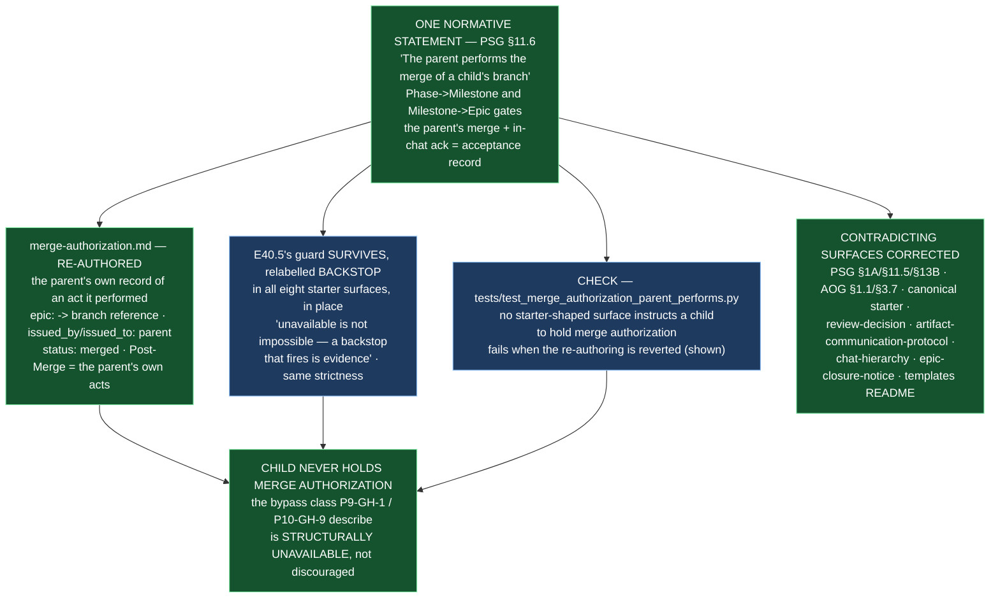

# E43.1 — Record: The Parent Performs the Merge (D3, decisions, falsification, diagram)

**Verification layer, time and scope, stated up front (`P11-GH-2`):**

| Axis | Value |
|---|---|
| **Layer** | **Literal file text** on disk in this repository's working tree — `rg` against the files, not a rendered or GitHub view. |
| **Time** | **2026-09-02** |
| **Scope** | The `ai-project-system` working copy at branch **`epic/P12-M43-E43.1`**, branched from **`origin/milestone/M43` @ `cf32fc6`**. **Drivr was not touched and is not reported here.** |
| **Environment** | Local worktree `/home/panchew/soft-dev/ai-project-system/.ai-project/scratchpad/wt-e43-1`. Suite run as `PYTHONPATH=. pytest -q` (bare `pytest` fails collection). |

Every number below is stated **with its ref** — a number without a ref is not a
measurement (milestone spec v1.1.3). Baseline: **582 passed / 0 failed** on
`epic/P12-M43-E43.1` @ `cf32fc6`; final: **618 passed / 0 failed** at HEAD of this branch.

---

## 1. Design decisions (delegated to this epic — decided, documented, proceeded)

### 1.1 The normative home — PSG **§11.6** (Default-Accept)

The one normative statement lives in `PROJECT-SYSTEM-GUIDELINES.md` §11.6 "The Model":

> **The parent performs the merge.** At the Phase→Milestone and Milestone→Epic gates,
> the merge of a child's branch is performed by the **parent** that accepted the
> delivery — a child never holds merge authorization. A Merge Authorization is the
> **parent's own record of an act it performed**, never an instruction issued to a
> child (E43.1, P12-M43). The bypass class `P9-GH-1` / `P10-GH-9` record is
> structurally unavailable, not merely discouraged.

**Why §11.6, not §8 (Branch Promotion).** §11.6 already makes "the merge plus the
in-chat acknowledgment" the acceptance record at exactly the parent→child gates the
epic concerns (W3: *"the merge proves something was accepted"*). The parent performing
the merge completes that record: the party that accepts is the party that merges. §8
(Branch Promotion) governs the hierarchy mechanics, and its opening line — *"Only
Coding Agents (and humans) are permitted to mutate the repository"* — already
contradicts the Milestone/Phase chats' own commit-and-PR role (§13A/§13B); placing the
statement there would have required unravelling that inconsistency. **One place:** §11.6.
The amended happy-path sentence reads *"the **parent's merge** plus the in-chat
acknowledgment is the acceptance record"*.

### 1.2 The re-authored field vocabulary of `merge-authorization.md`

- **`epic:` field** — kept as the identifier, but re-documented as a reference to the
  **branch being merged**, not the party addressed: new `branch: epic/<E#.#>` field
  names the merged branch, and the `epic` note reads *"The Epic whose branch was
  merged"*.
- **`issued_by` / `issued_to`** — both now name the **parent** that performed the
  merge: the parent is the actor recording its own act (`issued_to: <the parent chat>`).
- **`status: authorized` → `status: merged`** — the record documents a performed act,
  not a grant.
- **"Post-Merge Instruction" → "Post-Merge"** — names the parent's own follow-through
  (delete the merged branch, confirm the child produced its Delivery Notice, stop).
  The child's obligation that survives is its own **Delivery Notice** at execution
  completion (PSG §12); branch deletion is the parent's, as the party that merged.
- **Purpose** — reworded from *"the explicit 'you may now merge' signal"* to *"the
  parent's own record of an act it performed itself"*.

### 1.3 Backstop location — **per starter surface**

Each of the eight starter surfaces that carried E40.5's pushback is relabelled
**in place**: the guard already sits where a chat reads its operating contract, the
E40.5 regression test asserts presence **per surface**, and a backstop that lives
where the primary guard lived carries the same strictness (the Hard Constraint's *"do
not weaken a guard"*). A centralized statement would have broken the per-surface
presence the existing test binds. Every surviving string now says **it is a backstop,
and why** — the parent performs the merge, so a child never holds merge authorization;
*unavailable is not impossible, and a backstop that fires is evidence.*

---

## 2. The itemized surface list (D3) — surfaces carrying merge-authorization language, with post-change state

**Itemized, never counted (W2).** The set below was re-measured on this branch
(`P11-GH-2`) — the historical "seven / eight / nine" figures are not inherited as
settled. Measured: E40.5's pushback strings (`do not simply comply` +
`mode is what may run, not what may be authorized`) are present in **all eight**
governance starter surfaces and in **neither** seed. That measurement does **not**
reconcile with W2's "seven" or the record's "eight" — which is exactly W2's point: a
count carries no context, a list does. This list is the record.

### 2.1 The eight starter surfaces carrying E40.5's pushback — relabelled as backstops (D4)

| # | Surface | Carried E40.5 pushback (measured) | Post-change state |
|---|---------|----------------------------------|-------------------|
| 1 | `governance/templates/epic-execution-chat-starter.md` | yes | Guard intact, relabelled **backstop**; child-merge instruction line replaced ("await the parent's merge"); version bumped, changelog row added |
| 2 | `governance/systems/epic-execution-chat-starter.md` | yes | Guard intact, relabelled **backstop**; version 1.1.0 → 1.2.0, changelog row added |
| 3 | `governance/EPIC-EXECUTION-CHAT-STARTER.md` (canonical) | yes | Guard intact, relabelled **backstop**; step 3 corrected: **the parent Milestone Chat performs the merge** (child no longer "you merge the PR") |
| 4 | `governance/templates/milestone-execution-chat-starter.md` | yes | Guard intact, relabelled **backstop** |
| 5 | `governance/systems/milestone-execution-chat-starter.md` | yes | Guard intact, relabelled **backstop**; version 1.1.0 → 1.2.0, changelog row added |
| 6 | `governance/templates/phase-execution-chat-starter.md` | yes | Guard intact, relabelled **backstop** |
| 7 | `governance/systems/phase-execution-chat-starter.md` | yes | Guard intact, relabelled **backstop**; version 1.1.0 → 1.2.0, changelog row added |
| 8 | `governance/systems/hq-execution-chat-starter.md` | yes | Guard intact, relabelled **backstop**; artifact-list description of the Merge Authorization corrected to the parent's record; version 1.1.0 → 1.2.0, changelog row added |

### 2.2 The two seeds — recorded, unchanged (no pushback, not starter-shaped)

| # | Surface | Carried E40.5 pushback (measured) | Post-change state |
|---|---------|----------------------------------|-------------------|
| 9 | `governance/systems/system-hq-seed.md` | no | **Unchanged.** A seed, not a starter; its match is the System HQ authority boundary (merge authorizations never performed on speech alone), which is consistent with the new rule and out of the starter-shaped set |
| 10 | `governance/templates/seed.md` | no | **Unchanged.** A seed, not a starter; carries no merge-authorization language |

### 2.3 The merge-authorization artifact — re-authored (D2)

| # | Surface | Carried child-merge instruction (measured) | Post-change state |
|---|---------|--------------------------------------------|-------------------|
| 11 | `governance/templates/merge-authorization.md` | yes — *"the explicit 'you may now merge' signal"*; `epic:` documented as *"The Epic whose branch is authorized to merge"*; *"what the Coding Agent must do after merging"* section | **Re-authored** to the parent: subject, fields (`issued_by`/`issued_to` name the parent, `branch:` field added, `status: merged`), post-conditions (the parent's own acts), purpose reworded to the parent's record |

### 2.4 Surfaces carrying merge-as-child-instruction language — corrected to agree with the one statement (D1)

| # | Surface | Child-merge instruction (measured) | Post-change state |
|---|---------|-----------------------------------|-------------------|
| 12 | `governance/templates/review-decision.md` | *"You are authorized to merge this work. Follow these steps: … Merge PR #NNN … Delete the epic branch after merge"* | Corrected: the parent performs the merge; the steps are the parent's own |
| 13 | `governance/systems/artifact-communication-protocol.md` | *"You are authorized to merge this work"* (template + worked example) | Corrected: the parent performs the merge (both occurrences) |
| 14 | `governance/PROJECT-SYSTEM-GUIDELINES.md` | §1A step 7 (*"Coding Agent … merges only after HQ authorization"*); §11.5 rules 5/10; §13B (*"merges the milestone branch"*) | Corrected to the parent as actor; **the one normative statement added in §11.6**; version 2.4.0 → 2.4.1, changelog row added. §11.6.1 deliberately unchanged |
| 15 | `governance/AI-OPERATING-GUIDELINES.md` | §1.1 step 7 (same); §3.7 (*"delivers the Milestone by merging the milestone branch"*) | Corrected to the parent as actor, citing PSG §11.6; version 2.10.1 → 2.10.2, changelog row added |
| 16 | `governance/systems/chat-hierarchy.md` | Epic Delivery Authorization *"Merge Instruction: Merge epic/<E#.#> …"* (issued to the child); Hierarchy Decision Authority *"Code merge \| Epic mode"* row | Corrected: the parent Milestone mode performs the epic-branch merge; the Code merge row assigns the merge to the parent. The Milestone Delivery Authorization's merge instruction (recipient Milestone merges epic branches) is now **consistent** and unchanged. Version 1.2.0 → 1.3.0, changelog row added |
| 17 | `governance/templates/epic-closure-notice.md` | *"issued_by: The Coding Agent that merged the branch"* | Minimal correction (strictly required by the re-authoring): the Coding Agent confirms the completed merge performed by the parent; the Merge Authorization *records* rather than *permits* the merge |
| 18 | `governance/templates/README.md` | artifact table: *"Phase/HQ Chat authorizes a Coding Agent to merge"* | Corrected to the parent's record of the merge it performed |

### 2.5 Deliberately out of the itemized set — with the reason (a conscious exclusion is a recorded decision)

| Surface | Why excluded |
|---|---|
| Instantiated starters under `docs/phases/**` (P10/P11/P12) | **Historical records** of what a chat was actually told (E40.5's forward-only precedent, recorded in its surface sweep §5.1). Retro-editing them would falsify the record; retro-failing them would turn the suite red for closed epics. They carry the E40.5 pushback as of their instantiation; the check is forward-only and scans the live governance surfaces. |
| `governance/guides/QUICK-START.md` | Adoption guide for humans, not a session contract (E40.5 sweep §3.2). Its `Do NOT merge the PR (HQ authorizes merge)` line agrees with the new rule. |
| `governance/guides/visual-artifacts.md`, `governance/diagrams/authority-hierarchy.md`, `governance/systems/fleet-operator.md`, `governance/systems/fleet-operator-brief.md`, `governance/systems/system-hq.md`, `governance/systems/system-hq-seed.md` | Mentions of "merge authorization" are authority-boundary text (fleet operator / System HQ never perform merge authorizations) or descriptive material — none instructs a child to merge its own branch. |
| The `phase/* → master` consolidation merge (§5C, §13A, AOG §3.6) | **Out of this epic's two-gate scope.** The one normative statement covers the Phase→Milestone and Milestone→Epic gates; the phase→master merge remains governed by its own rules (PSG §5C, and §11.6.1's CFO diff review for `phase/* → master`). Recorded here so its exclusion is not a silent gap. |

---

## 3. The check and its falsification (D5)

**Check:** `tests/test_merge_authorization_parent_performs.py` — asserts (a) no
starter-shaped surface carries merge-as-child-instruction language; (b) every one of
the eight starter surfaces labels E40.5's guard as a backstop with the reason; (c)
`merge-authorization.md` is the parent's record (parent markers present, child
patterns absent); (d) the one normative statement exists in PSG §11.6. Scanning is
**live-body only** — the scan stops at the first history section, so a changelog row
quoting a marker cannot satisfy a guard the live body no longer does. Matching is
case-folded / whitespace-normalized (the E40.5 lesson: reflow must not false-fail;
deletion must still be caught — proven by the detector self-tests in the file).

**Invocation and ref:** `PYTHONPATH=. pytest -q tests/test_merge_authorization_parent_performs.py`
— green at HEAD of `epic/P12-M43-E43.1` (36 tests). Node ID for the primary guard:
`tests/test_merge_authorization_parent_performs.py::test_surface_carries_no_child_merge_instruction`
and `...::test_template_carries_no_child_merge_instruction`.

**Falsification — observed, not assumed** (Hard Constraint: *prove the guard by
falsifying it*):

1. **Re-authoring reverted.** `merge-authorization.md` restored to the child-addressed
   original (`git show milestone/M43:…`) → **2 failed**:
   `test_template_carries_no_child_merge_instruction` (detected `you may now merge`,
   `what the coding agent must do after merging`, `the coding agent receiving
   authorization`) and `test_template_names_the_parent_as_subject` (parent markers
   absent). Restored → green.
2. **Backstop relabelling undone.** The backstop marker was removed from the live body
   of `governance/systems/epic-execution-chat-starter.md` (changelog row left in place —
   the changelog-aware scan still failed) → **1 failed**:
   `test_surface_labels_the_guard_as_backstop[governance/systems/epic-execution-chat-starter.md]`
   (missing `never holds merge authorization`, `unavailable is not impossible`).
   Restored → green.

The check was confirmed **collected and running** by node ID in both falsifications —
a rotted guard is invisible behind a green total (M38's recorded trap).

---

## 4. Structural diagram (Mermaid, in-repo, no ComfyUI)

- **State:** implemented (this epic's output). The spec's proposed-track diagram (its
  Visual Bindings section) describes the intent; this diagram records what landed.
