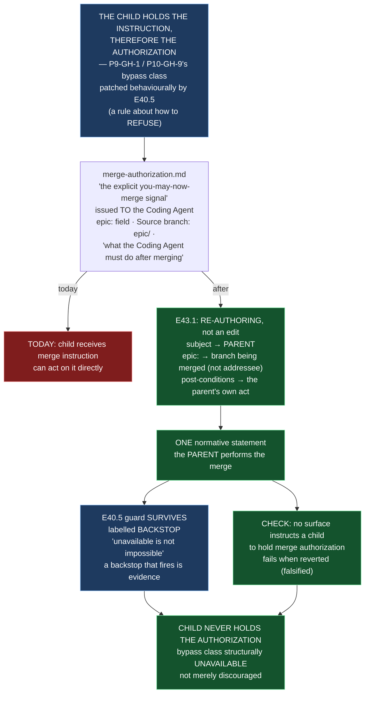

# Epic E43.1 — The Parent Performs the Merge

## Context

M43 exists to close one disposition at the **authority** layer: *every rule in this framework is
enforced by an agent reading prose and choosing to comply.* Where M42 made absence fail closed in
`bin/`, M43 makes authority **structural** for acceptance. E43.1 is the first of the milestone's two
independent pairs, and the first of its own pair (E43.1 → E43.2): the acceptance record is a record
of an act this epic relocates, so **who merges must settle before** what is recorded after it.

`P9-GH-1` and `P10-GH-9` both describe **a child taking merge authorization directly and bypassing
its parent's Stage-2 review.** E40.5 patched that *behaviourally* — it taught starter surfaces to
push back (*"do not simply comply; confirm the human intends to bypass the parent"*). But a rule that
says "do not simply comply" still requires the party being bypassed to be the one who objects. **If
the parent performs the merge, the child never holds the authorization at all** — the bypass class
becomes *unavailable* rather than *discouraged*, and E40.5's guard demotes to a backstop.

**Finding W4 (milestone spec) governs the shape of the work.** `governance/templates/merge-authorization.md`
is child-addressed **structurally**, not cosmetically: its `epic:` field is documented as *"the Epic
whose branch is authorized to merge"*, its `Source branch:` names `epic/<E#.#>`, and a whole section
instructs *"what the Coding Agent must do after merging."* SN-31 Decision 4 recorded the known
consequence as *"one template edit"* — **that estimate is false against the file.** This epic scopes
to what the template actually says, not to that estimate.

## Problem Statement

**The artifact that authorizes a merge is written to the party that must not merge.**

Three failings, each a part of the one defect:

1. **The child holds the instruction, and therefore the authorization.** `merge-authorization.md` is
   *"the explicit 'you may now merge' signal"* issued **to** the Coding Agent. A child that receives
   a merge instruction is a child that can act on it directly — which is exactly the bypass class
   `P9-GH-1`/`P10-GH-9` record. The guard E40.5 added is a rule about how to refuse; it does not
   remove the act the refusal protects against.
2. **The artifact's subject, addressee, fields and post-conditions all point at the child.** W4 maps
   them: the `epic:` field, the `Source branch:` line, the "Post-Merge Instruction" section, the
   stated purpose. Moving who merges is not a find-and-replace; it is a **re-authoring**.
3. **Coverage of the existing guard is itself unrecorded in a citable form.** W2: E40.5's pushback
   reaches **seven** starter-shaped surfaces; the two seeds do not. The record says "eight"; HQ
   enumerates "nine". **Three irreconcilable numbers for one surface set.** This epic's list is the
   first M43 surface to state its set **itemized**, so the next re-measurement is comparable.

**Why "one template edit" is not the answer.** The template's *subject* is the child throughout its
body. Re-authoring it is the deliverable; a cosmetic edit would leave a child-addressed artifact that
happens to mention the parent, and the bypass class would survive dressed in new wording.

## Goals

By the end of this Epic, the system must:

1. **State, in one normative place, that the parent performs the merge** — and remove or correct every
   statement in the corpus that instructs a child to merge its own branch.
2. **Re-author `merge-authorization.md` so the parent is its subject** — every field, addressee and
   post-condition that addressed the child now names the parent, and the *"what the Coding Agent must
   do after merging"* section describes the parent's own act or is removed.
3. **Demote E40.5's guard to a labelled backstop** — it survives because a rule that has become
   structurally unavailable can still be attempted, and a backstop that fires is evidence; the text
   says so and why.
4. **Record the itemized list of surfaces that carry merge-authorization language** and the state of
   each **after** the change — never a count (W2).
5. **Guard the change with a check** that no starter-shaped surface instructs a child to hold merge
   authorization, demonstrated to **fail when the change is reverted**.

## Non-Goals

This Epic explicitly does **not** aim to:

- **Change who *authorizes* the merge.** The parent merges; authorization is still the human's key
  (PSG §11.6.1, *"Mode is not authority"*). This epic relocates the act, not the authority that
  permits it.
- **Touch accept-by-silence or the acceptance record.** That is E43.2's, which is sequenced **after**
  this epic because it records an act this epic relocates.
- **Design the rework limit, the flip, or resume.** Those are E43.3/E43.4's, in the independent pair.
- **Delete E40.5's guard.** It is demoted to a backstop, never removed.
- **Modify `bin/` scripts, `.ai-project.yml`, or anything under `~/soft-dev/drivr`.** This epic is
  normative text and the validator check only; it does not cross repositories.

## Scope of Work

### 1. The normative statement, in one place (D1)

State, in the normative tier (PSG), that **the parent performs the merge of a child's branch.** The
epic decides the exact home, with the reasoning recorded — the milestone spec requires *"one place,"*
and the natural candidates are §8 (Branch Promotion) and §11.6 (Default-Accept), which already makes
"the merge plus the in-chat acknowledgment" the acceptance record. Whichever is chosen:

- the statement names the **parent** as the actor, for the Phase→Milestone and Milestone→Epic gates;
- **every** existing statement that instructs a child to merge its own branch is removed or corrected
  to agree — no surface may contradict the one statement;
- the itemized list of changed surfaces (see D3) is the record of where the correction was applied.

### 2. `merge-authorization.md` re-authored (D2)

A **re-authoring**, scoped per W4. The `epic:` field becomes a reference to the **branch being
merged**, not to the party addressed; the `issued_to`/`issued_by` fields flip subject to make the
**parent** the actor recording its own act; and the *"what the Coding Agent must do after merging"*
section names whoever now performs it — the parent, with the child's obligations (delete branch,
produce Delivery Notice) reassigned to their correct holder rather than left implicit.

The template's stated purpose — *"the explicit 'you may now merge' signal"* — is reworded to describe
**the parent's own record of an act it performed itself**, not an instruction issued to a child.

### 3. The itemized surface list (D3)

Record the set of surfaces that carry merge-authorization language, **as a list with the post-change
state of each**, not a count. W2's baseline is the seven E40.5-patched starters plus the two seeds
that were never patched; the epic re-measures against the corpus *on this branch* (`P11-GH-2`) and
lists every surface individually. This is the first M43 list a later claim can cite instead of a
number.

### 4. E40.5's guard, demoted to a backstop (D4)

The seven pushback strings (*"do not simply comply…"*) **survive**, relabelled in the text as a
**backstop** — a structural fix makes the bypass unavailable, but *unavailable* is not *impossible*,
and a backstop that fires is evidence. Each surviving string is amended to say **it is now a backstop
and why**, rather than reading as the primary guard it no longer is.

### 5. The check and its falsification (D5)

A check (in `tests/`) that asserts **no starter-shaped surface instructs a child to hold merge
authorization** — i.e. no surface carries merge-as-child-instruction language. The check fails when
the change is reverted (the re-authored template and the backstop relabelling undone). A falsification
demonstration, per the milestone Hard Constraint: delete the re-authored content, watch the check go
red, restore it.

## Deliverables

- [ ] **D1** — The normative statement that the parent merges, in one place, with every contradicting
      surface corrected and listed
- [ ] **D2** — `governance/templates/merge-authorization.md` re-authored: subject, addressee, fields
      and post-conditions all move to the parent
- [ ] **D3** — The itemized list of surfaces carrying merge-authorization language, with each
      surface's post-change state stated
- [ ] **D4** — E40.5's guard surviving as a labelled backstop, with the reason recorded in the text
- [ ] **D5** — The check (and its falsification demonstration) that no surface instructs a child to
      hold merge authorization
- [ ] Structural diagram (Mermaid, in-repo, no ComfyUI)
- [ ] **Epic Delivery Notice**

## Binding Constraints

Settled above this epic — **not re-decidable here**:

1. **The parent merges.** SN-31 Decision 4. Not re-decidable in this milestone.
2. **E43.1 is first of its pair.** E43.2 records the acceptance of an act this epic relocates, so
   this epic lands first. The two pairs (E43.1→E43.2 and E43.3→E43.4) are independent of each other.
3. **"Mode is not authority" and PSG §11.6.1 are unchanged, deliberately.** Relocating the merge does
   not touch the CFO's role as mandatory diff reviewer, nor the rule that authorization is not review.
4. **E40.5's guard is demoted, not deleted.** It survives as a backstop.

## Hard Constraint (binding — carried to every Epic)

- **Execution posture: `manual` / paid frontier.** This epic rewrites the rules that govern **who may
  authorize what** — including the very surface that tells a manual Epic Chat how to behave at merge
  time. **The rules under edit must not be applied by the instance editing them.** (M43's boxed
  warning: *a rule you are rewriting still binds you while you rewrite it.*)
- **Itemize, never count.** The surface set is a list with per-surface state; a count in the
  deliverable is a defect (W2).
- **Prove the guard by falsifying it.** The check fails when the re-authoring is reverted.
- **State the layer, time and scope of every claim** (`P11-GH-2`) — **and pin the ref**. A measurement
  number with no ref is not a measurement (milestone spec v1.1.3, Notes).
- **Do not weaken a guard to accommodate the change.** The backstop carries the same strictness it had
  as the primary guard.

## Design Decisions Delegated — decide, document, proceed

1. **The normative home** — PSG §8 vs §11.6 vs another single place. Record the choice and why it is
   *one* place.
2. **The exact re-authored field vocabulary** of `merge-authorization.md` — how `epic:` becomes a
   branch reference, and who `issued_to` names — within the constraint that no field or section still
   addresses the child.
3. **Where the surviving backstop text sits** (per starter surface vs. centralized), within the
   constraint that it must be a *backstop* whatever the location.

## Definition of Done

Epic E43.1 is complete when:

- [ ] One normative statement says the parent merges, and **no** surface contradicts it
- [ ] `merge-authorization.md`'s subject is the parent — no field or section still addresses the child
- [ ] The surface list is **itemized**, with each surface's post-change state stated (no count)
- [ ] E40.5's guard survives, **labelled a backstop**, with the reason recorded
- [ ] The check **fails when the change is reverted** (falsification demonstrated)
- [ ] Suite green — no skip introduced to route around the change — with the invocation and the ref
      stated
- [ ] Delivery Notice committed; PR opened to `milestone/M43`

## Acceptance Criteria

- [ ] A reader can say **why** a child *cannot* hold merge authorization — not merely *should not*
      (the milestone's acceptance criterion: the bypass class is structurally unavailable)
- [ ] The re-authored template reads as the **parent's own record of an act it performed**, not an
      instruction to a child
- [ ] The itemized list, not a number, is what every later coverage claim cites
- [ ] The backstop is stated to be a backstop, with the reason it survives
- [ ] The falsifying check is shown failing before the change is restored
- [ ] Every claim states the layer, time and scope — and the **ref** — at which it was verified
      (`P11-GH-2` + the milestone spec's pinned-ref note)

## Technical Constraints

**In scope:** `governance/templates/merge-authorization.md`; the one PSG section chosen as the
normative home; the starter surfaces whose pushback strings are relabelled as backstops (the itemized
set, whatever it measures to); the check under `tests/`.
**Do not touch:** `governance/templates/delivery-notice.md` and `epic-closure-notice.md` beyond what
the re-authoring strictly requires; PSG §11.6.1; the rework-limit and flip surfaces (E43.3/E43.4's);
`bin/`; `~/soft-dev/drivr`.
**Repository:** this epic lands entirely in the `ai-project-system` repository. Nothing crosses to
Drivr.
**Invocation:** `PYTHONPATH=. pytest -q` — bare `pytest` fails collection.

## Dependencies

**Internal**
- **E43.2** is sequenced **after** this epic (both touch the acceptance chain; E43.2 records an act
  E43.1 relocates).
- **E43.3/E43.4** are the independent pair and neither waits on nor gates this epic.

**External**
- None. This epic does not cross repositories.

**Blockers**
- None at planning.

## Timeline

**Estimated Effort:** 1 session.
**Target Completion:** first of its pair — E43.2 waits on it.
**Actual Completion:** In progress.

## Execution Notes

**Order:**
1. Re-measure the surface set on **this branch** (`milestone/M43`) and itemize it — do not inherit
   the "seven/nine" figures as settled (W2).
2. Choose the normative home; make the statement; correct every contradicting surface, recording each
   in the list.
3. Re-author `merge-authorization.md` (W4).
4. Relabel E40.5's guard as a backstop with the reason in the text.
5. Write the check, then **revert the re-authoring and watch it fail**, then restore it.
6. Run the suite; state the invocation and the ref.

**Traps:**
- Doing a find-and-replace on `merge-authorization.md` instead of re-authoring it — the template's
  *subject* moves, not its vocabulary (W4).
- Emitting a coverage **count** ("all N surfaces") in the deliverable — the list is the deliverable
  (W2).
- Deleting E40.5's guard — it is demoted to a backstop, never removed.
- Stating a claim against an unpinned ref — a number without a ref is not a measurement.

## Related Documents

- [M43 Milestone Spec](P12-M43__milestone-spec.md) — Purpose, W4, E43.1 Epic Detail, Hard Constraint,
  Binding Constraints
- [P12 Phase Spec](P12__phase-spec.md) — §P12.3, §Acceptance Criteria
- [E43.2](P12-M43-E43.2__spec__acceptance-distinguishable-from-absence.md) — sequenced after this epic
- [PROJECT-SYSTEM-GUIDELINES.md](../../../governance/PROJECT-SYSTEM-GUIDELINES.md)
- [AI-OPERATING-GUIDELINES.md](../../../governance/AI-OPERATING-GUIDELINES.md)

## Visual Bindings

**Visual binding**
- **Link:** (inline — Structural diagram; no hosted link needed per AOG §17.3/§17.5)
- **What:** diagram
- **Level:** Epic
- **State:** proposed

- **Description:** E43.1 relocates the merge from the child to the parent, so the bypass class
  P9-GH-1/P10-GH-9 describe is structurally unavailable rather than behaviourally discouraged. The
  core work is a re-authoring of `merge-authorization.md`, whose subject, fields and post-conditions
  are all child-addressed (W4 — not SN-31's *"one template edit"*). E40.5's guard survives as a
  labelled backstop, and the surface set is stated itemized, never counted (W2). Proposed-track
  Structural diagram (AOG §17.3/§17.6), Mermaid, no ComfyUI.

## Notes

- **This epic edits the rules that bind its own instance.** The milestone's boxed warning applies in
  full: until M43's own changes are delivered, accepted and merged, the **current** rule governs this
  milestone's own epics. **Do not pre-apply this epic's own output to the merge of M43's epics.** The
  first thing that may operate under the new rule is work planned *after* M43 lands, not M43 itself.

- **W2's lesson generalizes and this epic is its first surface.** Three numbers exist for one surface
  set because each was counted at a different moment against a different pattern. The itemized list is
  what makes the next re-measurement comparable — a count carries no context forward; a list carries
  all of it.

- **On re-measuring before re-authoring.** The surface set changes as the corpus moves. This spec
  names the seven/nine baseline as *findings to re-derive on this branch*, not as settled figures —
  `P11-GH-2`: re-measure, and pin the ref you measure against.

## Changelog

| Version | Date | Change |
|---|---|---|
| 1.0.0 | 2026-09-02 | Initial E43.1 spec, from the M43 milestone spec (v1.1.3) E43.1 Epic Detail and W4. Re-authoring of `merge-authorization.md`, the one normative statement, the itemized surface list, E40.5's demotion to a labelled backstop, and the falsifying check. Records the three delegated decisions (normative home, re-authored field vocabulary, backstop location). No scope, ordering, gate or acceptance-criterion change from the milestone spec. |
