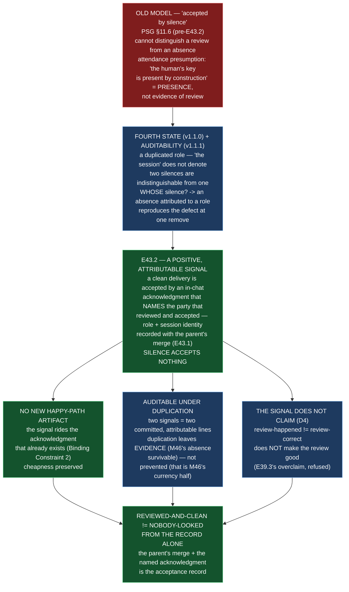

# E43.2 — Record: Acceptance Distinguishable from Absence (D1, decision, itemized surfaces, falsification, diagram)

**Verification layer, time and scope, stated up front (`P11-GH-2`):**

| Axis | Value |
|---|---|
| **Layer** | **Literal file text** on disk in this repository's working tree — `rg` against the files, not a rendered or GitHub view. |
| **Time** | **2026-09-02** |
| **Scope** | The `ai-project-system` working copy at branch **`epic/P12-M43-E43.2`**, branched from **`origin/milestone/M43` @ `9b00fd4`**. **Drivr was not touched and is not reported here.** |
| **Environment** | Local worktree `/home/panchew/soft-dev/ai-project-system/.ai-project/scratchpad/wt-e43-2`. Suite run as `PYTHONPATH=. pytest -q` (bare `pytest` fails collection). |

Every number below is stated **with its ref** — a number without a ref is not a
measurement (milestone spec v1.1.3). Baseline: **618 passed / 0 failed** on
`origin/milestone/M43` @ `9b00fd4`; final: **681 passed / 0 failed** at HEAD of this
branch.

**P11-GH-1 backstop, run before delivery:** `git log origin/milestone/M43..HEAD -- <milestone
spec; epic spec; PSG; AOG; chat-hierarchy>` returns only this epic's own commits — no amendment to
any artifact this Starter restates a rule from arrived during execution. The milestone spec's E43.2
Epic Detail (including the v1.1.0 fourth-state and v1.1.1 auditability blocks) was re-read **in
full** before deciding (G2).

---

## 1. Design decisions (delegated to this epic — decided, documented, proceeded)

### 1.1 The mechanism (Design Decision 1) — the signal rides the §11.6 acknowledgment

**A clean delivery is accepted by an in-chat acknowledgment that names the party that
reviewed and accepted — role + session identity — recorded with the parent's merge.
Silence accepts nothing.** The acknowledgment is a **positive signal an identified party
emitted**, never an absence attributed to a role.

The four properties the spec demands, and how the chosen mechanism satisfies each:

| Property | How the mechanism satisfies it |
|---|---|
| **Cheap** — a clean delivery costs no artifact (Binding Constraint 2 / Hard Constraint) | The signal is a **property of the acknowledgment**, which is already the second half of the §11.6 acceptance record ("the parent's merge plus the in-chat acknowledgment"). No new object; no Review Decision; no new log. |
| **Attributable** — a reader can tell who accepted, from the record alone | The acknowledgment **names role + session identity**. Absence of the acknowledgment is nobody's acceptance, never a role's — a reader cannot read an unnamed silence as acceptance. |
| **Positive, not an absence** — the fourth state (v1.1.0) | The signal is an **emission**: it exists only if a party emitted it. An absence (no acknowledgment) accepts nothing. Two silences are indistinguishable from one; two acknowledgments are two committed, attributable lines. |
| **Auditable under duplication** (v1.1.1) | A duplicated role emits **two acknowledgments**: visible, attributable, diffable. E43.2 cannot prevent duplication (M46's currency half) — it guarantees duplication **leaves evidence**, which is what makes M46's absence survivable. |

**The attendance presumption is replaced, not re-founded.** `chat-hierarchy.md:201-205`
rested default-accept on *"the human's key is present at the session by construction."*
That is presence, not evidence of review. The new model does **not** say presence accepts;
the **acknowledgment naming who reviewed** accepts. A manual instance satisfies it because
its session emits the acknowledgment; an agentic instance's silence emits nothing and
accepts nothing. The manual/agentic line survives (D3).

### 1.2 The committed surface (Design Decision 2) — recorded with the parent's merge

**The acknowledgment naming the reviewing party is recorded with the parent's merge of the
child's branch** — the parent records its own act (E43.1 landed the *"parent performs the
merge"* statement first, so there is now a committed parent-act the acknowledgment can ride).
The acceptance record — *the parent's merge plus the in-chat acknowledgment naming the
party that reviewed* — is then fully committed, and a reader distinguishes *reviewed and
clean* from *nobody looked* **from the record alone**.

**Options weighed:**

| Option | Outcome | Reason |
|---|---|---|
| **A. Explicit acceptance artifact per clean delivery** (a new Review-Decision-like object) | **REJECTED** | Adds a happy-path artifact — fails the Hard Constraint and Binding Constraint 2 outright. |
| **B. The signal rides the §11.6 acknowledgment — naming role + session identity, recorded with the parent's merge** | **CHOSEN** | Cheap (no new artifact), positive, attributable, auditable under duplication. HQ's 2026-08-21 M41-only stopgap is the worked evidence that cheapness and auditability are compatible; this generalizes it from a suspension log to the acknowledgment itself. |
| **C. An absence attributed to a role** ("if nobody objects in N hours, the role accepts") | **REJECTED** | Reproduces the defect at one remove — it is *whose* silence, the fourth state again. An absence is not an emission by an identified party. |
| **D. A separate acceptance-log artifact** (one line per delivery in a new committed log) | **REJECTED** | A new object on the happy path; the M41 stopgap's log was a suspension artifact, not the general happy-path shape. The acknowledgment already exists — the signal must ride it, not a new carrier. |
| **E. A runtime-only signal** (a chat reply or daemon state, uncommitted) | **REJECTED** | Violates the committed-starter invariant / Binding Constraint 3 — the committed record is the source of truth; a runtime-only surface cannot be read from the record alone. |

### 1.3 The boundary (D4) — what the signal does NOT claim

Stated normatively in PSG §11.6 ("What the Signal Does Not Claim"): the acknowledgment
distinguishes **review-happened** from **nobody-looked**; it does **not** make the review
**good**. *"A review happened"* is not *"the review was correct"* — the boundary is stated,
not implied, so the model cannot be read to install the confidence-without-grounding that
E39.3 recorded (`VERDICT: PASS` with zero tool rounds).

---

## 2. The itemized surface list (D2/D3) — surfaces stating default-accept, with post-change state

**Itemized, never counted (W2).** The set below was re-derived on this branch (`P11-GH-2`)
from `rg -l "accepted by silence|by silence|accept-by-silence|silence-accept" governance/`
plus the two normative documents that state the model. Every surface's **live body** (text
before its first history section) was reconciled to the attributable-acknowledgment model;
the check binds exactly this list.

### 2.1 The seventeen surfaces stating the default-accept model — amended

| # | Surface | Change (live body) | Version |
|---|---|---|---|
| 1 | `governance/PROJECT-SYSTEM-GUIDELINES.md` | **§11.6** (The Model happy path; What Default-Accept Governs Q1/Q2; gate (B); two new subsections — "What the Signal Does Not Claim" (D4) and "Where the Acknowledgment Is Recorded"); **§1A** gate-scoping note; **§5C** Step 6; **§11.5** flow last step + Key Rule 4; **§12**; **§13A**; **§13B**. §11.6.1 deliberately unchanged. | 2.4.1 → **2.5.0** |
| 2 | `governance/AI-OPERATING-GUIDELINES.md` | **§12** outcome-1 line + "Default-Accept (SN-13) — Normative" happy path; **§3.6**; **§3.7**; **§10** HQ review-behavior bullet. | 2.10.2 → **2.11.0** |
| 3 | `governance/systems/chat-hierarchy.md` | **D3** — the §Execution Mode corollary (`:201-206`): attendance presumption removed; the acknowledgment-names-the-party model stated; manual/agentic line kept ("an agentic instance's silence is not an acknowledgment, and does not by itself accept a delivery"). | 1.3.0 → **1.4.0** |
| 4 | `governance/systems/artifact-communication-protocol.md` | 12 live statements amended (Core Principles 4 & 6, Delivery Notice purpose, Completion Notice next-action, Review Decision trigger + examples, flow diagram, Creation/Workflow rules, Manual/Agentic Mode integration). | 1.4.1 → **1.5.0** |
| 5 | `governance/systems/roles-authorization-team-governance.md` | 5 statements amended (Phase Review Decision artifact line, Milestone Agent responsibility, Epic Agent authority boundary, merge-authority table epic row, async flow step). | 1.1.0 → **1.2.0** |
| 6 | `governance/systems/milestone-execution-chat-starter.md` | 12 statements amended (responsibilities, SN-19 acknowledgment, Decide step, workflow tree, clean-criteria heading, aggregation, parent-review line, Acceptance Outcomes, Issuing-a-Review-Decision, rework cycle, session sequence). | 1.2.0 → **1.3.0** |
| 7 | `governance/systems/phase-execution-chat-starter.md` | 2 statements amended (Acknowledge-Milestone-acceptance responsibility; Milestone Acceptance and Merge Instruction). | 1.2.0 → **1.3.0** |
| 8 | `governance/systems/hq-execution-chat-starter.md` | 5 statements amended (Review-and-accept responsibility, supporting-artifacts table, artifact-flow note, Review Decision example, Oversee step). | 1.2.0 → **1.3.0** |
| 9 | `governance/systems/start-a-project.md` | 1 statement amended (HQ accept-clean-deliveries line). | 1.0.0 → **1.1.0** |
| 10 | `governance/EPIC-EXECUTION-CHAT-STARTER.md` | 1 statement amended (Milestone Agent review step — "What Happens Next"). | no version field |
| 11 | `governance/templates/completion-notice-epic.md` | "Next Action" block amended. | template |
| 12 | `governance/templates/epic-review-seal.md` | Purpose line amended. | template |
| 13 | `governance/templates/merge-authorization.md` | 4 acceptance references amended; `last_updated` refreshed. (E43.1's re-authoring itself untouched.) | template |
| 14 | `governance/templates/README.md` | Review Decision table row amended. | template |
| 15 | `governance/templates/milestone-execution-chat-starter.md` | Critical-rules line + SN-19 Epic Acceptance section amended. | template |
| 16 | `governance/templates/phase-execution-chat-starter.md` | Critical-rules line + SN-19 Milestone Acceptance section amended. | template |
| 17 | `governance/diagrams/artifact-flow.md` | Acceptance-model statements amended (Stage-2 oversight, upward/downward flows). The child-merges lines in the same diagram were corrected to the parent-performs-merge (E43.1) — a residual inconsistency the diagram's own acceptance-model text would otherwise leave contradicting both §11.6 amendments; recorded here, not silently absorbed. | no version field |

### 2.2 Checked, consistent, not amended — with the reason

| Surface | Why unchanged |
|---|---|
| `governance/systems/bugfix-epic-workflow.md` | States the **opposite** of the old model — *"a bugfix delivery is never accepted by silence,"* a deliberate carve-out that always issues an explicit Review Decision. Under the new model it is a stricter special case of the general rule (silence accepts nothing); its statement agrees with the amendment. |

### 2.3 Deliberately unchanged / out of the itemized set — with the reason

| Surface | Why excluded |
|---|---|
| PSG §11.6.1 (HQ-authored deliveries) | E43.1's deliberate exclusion, restated: HQ has no parent, the CFO is the mandatory diff reviewer, silence is never acceptance there. Consistent with the amendment; not touched. |
| Instantiated starters and phase/milestone/epic docs under `docs/phases/**` (incl. this epic's own Starter, the M43 milestone spec, the phase spec) | **Historical records** of what a chat was actually told (E40.5's forward-only precedent). Retro-editing them would falsify the record; retro-failing them would turn the suite red for closed epics. The check is forward-only and scans the live governance surfaces. |
| `.ai-project.yml`, `bin/`, `~/soft-dev/drivr` | Out of scope per the epic spec — normative text only, one repository. |
| `merge-authorization.md`'s re-authoring (E43.1's, landed) | Not re-opened; only its "by silence" acceptance references were amended, which is this epic's scope. |

---

## 3. The check and its falsification (D5)

**Check:** `tests/test_acceptance_distinguishable_from_absence.py` — 63 tests. Asserts, for
the **itemized** seventeen-surface set above: (a) no surface's live body carries the old
model's phrasing ("by silence" / "silence-accept" / "accept-by-silence") — otherwise a
delivery could again be accepted with no emitted signal; (b) every surface carries the
attributable-signal markers ("party that reviewed" + "silence accepts nothing"); (c) the
normative tier (PSG / AOG / chat-hierarchy) carries the full attribution form (role +
session identity / an identified party); (d) PSG §11.6 states the D4 boundary and the
record-alone + no-new-artifact properties; (e) `chat-hierarchy.md`'s corollary is
reconciled — the attendance presumption is gone, the manual/agentic line survives.
Scanning is **live-body only** (stops at the first history section), matching is
case-folded / whitespace-normalized / emphasis-stripped (reflow and `**emphasis**` must
not false-fail; deletion must still be caught — proven by the detector self-tests).

**Invocation and ref:** `PYTHONPATH=. pytest -q tests/test_acceptance_distinguishable_from_absence.py`
— green at HEAD of `epic/P12-M43-E43.2` (63 tests). Node ID for the primary guard:
`tests/test_acceptance_distinguishable_from_absence.py::test_no_surface_states_silence_accepts`.

**Falsification — observed, not assumed** (Hard Constraint: *prove the guard by
falsifying it*):

| # | State | Result |
|---|---|---|
| 0 | Baseline, `origin/milestone/M43` @ `9b00fd4` | **618 passed** |
| 1 | Delivered state | **681 passed** (+63) |
| 2 | PSG §11.6 happy path reverted to *"accepted by silence"* | **2 failed**: `test_no_surface_states_silence_accepts[…PROJECT-SYSTEM-GUIDELINES.md]` (detected `by silence`) and `test_psg_distinguishes_from_the_record_alone` (attribution + record-alone markers absent from the amended bullet) |
| 3 | Restored | green |
| 4 | Attendance presumption restored in the `chat-hierarchy.md` corollary | **1 failed**: `test_chat_hierarchy_corollary_reconciled` (detected `present at the session by construction`) |
| 5 | Restored | green |
| 6 | Attribution + "silence accepts nothing" removed from `templates/README.md`'s Review Decision row | **1 failed**: `test_surface_carries_the_attributable_signal[…templates/README.md]` |
| 7 | Restored | green |

The check was confirmed **collected and running** by node ID in each falsification — a
rotted guard is invisible behind a green total (M38's recorded trap).

---

## 4. Structural diagram (Mermaid, in-repo, no ComfyUI)

- **State:** implemented (this epic's output). The spec's proposed-track diagram (its
  Visual Bindings section) describes the intent; this diagram records what landed.