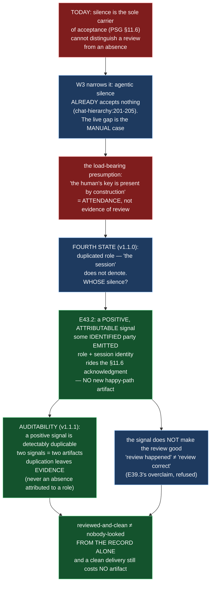

# Epic E43.2 — Acceptance Distinguishable from Absence

## Context

M43 changes who does what so a bypass class becomes unavailable. E43.1 relocates the merge to the
parent; **E43.2 makes the acceptance that follows distinguishable from an absence.** It is the second
of its pair and lands **after** E43.1, because the acceptance record is a record of an act E43.1
relocates — who merges settles before what is recorded after it.

**The design decision this milestone owes is this epic's to make** (phase starter: *pick a direction,
document the reasoning, proceed; do not escalate*). The decision space has been sharpened three times
since the phase spec wrote it, and this spec records the sharpened form rather than the original.

The property being preserved is **cheapness**. Default-accept (PSG §11.6) exists so a clean delivery
costs no artifact, and every artifact in the corpus is a real decision. **Retiring accept-by-silence
is not available to this milestone** — Binding Constraint 2, deliberately. What is available is to
change **what carries acceptance**, so *reviewed and clean* stops reading as *nobody looked*.

## Problem Statement

**Silence is the sole carrier of acceptance, and silence cannot distinguish a review from an absence.**

Three states the phase spec named — *reviewed and clean*, *never looked*, *the session died* — are
not equally live. **Finding W3 narrows the problem first:** `chat-hierarchy.md:201-205` **already**
rules that *"an agentic instance's silence is not the silence §11.6 speaks of, and does not by itself
accept a delivery."* For an **agentic** parent, silence already accepts nothing. The live gap is the
**manual** case.

The manual case rests on a presumption the corpus states itself: *"the human's key is present at the
session by construction."* **That is a presumption about attendance, not evidence of review** — and
*never looked* and *the session died* are precisely the two ways it fails while the words stay
literally true.

**The milestone spec's own amendments add a fourth state, and it breaks the presumption rather than
failing it (spec v1.1.0):** W3's states assume **one addressee**. M41 ran with **two authentic
Milestone Chat sessions** — a duplication checkable in the commit graph, where two of twenty-two
commits sit inside a five-hour gap in the incumbent's activity and one calls another session's
sentence *"my own rotted claim."* With two sessions holding one role, **"the session" does not
denote.** A delivery can be accepted by one instance while another never hears of it — and a
non-participating instance's silence is indistinguishable from its deliberate acceptance. E43.2 cannot
answer *what replaces silence* without saying **whose** silence.

**The design property is stated in the spec as one degree stronger than "well-formedness" —
AUDITABILITY (spec v1.1.1):** whatever replaces silence must be **a signal some identified party
emitted**, never an absence attributed to a role. **A positive signal is *detectably* duplicable; an
absence is not even that** — two silences are indistinguishable from one, leaving no trace, while two
positive signals are two artifacts: visible, attributable, diffable. **Design so the mechanism still
misbehaves under a duplicated role, but misbehaves LEGIBLY.** Preventing duplication is **not** this
epic (it is M46's currency half, via `P12-GH-4`); what this epic can guarantee is that **duplication
leaves evidence** — which is what makes M46's absence survivable.

## Goals

By the end of this Epic, the system must:

1. **Replace silence as the sole carrier of acceptance with a cheap positive signal**, keeping the
   property that a clean delivery still costs **no new artifact**.
2. **Make the acceptance record carry the identity of the party that reviewed and accepted** — so
   *reviewed and clean* is distinguishable from *nobody looked* **from the record alone**, and a
   duplicated role leaves evidence rather than vanishing into two indistinguishable silences.
3. **Amend PSG §11.6** (and wherever else default-accept's "silence accepts" is stated) to the new
   model, without retiring default-accept.
4. **Reconcile `chat-hierarchy.md:201-205`** with the amended §11.6 — the passage that already draws
   the manual/agentic distinction, yet rests default-accept on the attendance presumption.
5. **State what the signal does NOT claim** — it distinguishes *review happened* from *nobody looked*;
   it does **not** make the review good (overclaiming would install E39.3's confidence-without-grounding).

## Non-Goals

This Epic explicitly does **not** aim to:

- **Retire accept-by-silence.** Its cheapness is the property being preserved (Binding Constraint 2).
  Any proposal that adds a happy-path artifact fails acceptance.
- **Make the review *good*.** The signal testifies that a named party reviewed; it is not a verdict on
  the quality of that review. The quality of review is the human's / higher level's, not an artifact's.
- **Prevent or detect duplicated roles.** The *currency* half (exclusivity, one holder per role) is
  M46's, via `P12-GH-4`. E43.2 guarantees duplication leaves **evidence**, not that it cannot occur.
- **Change who merges** (E43.1's, already landed before this epic) or **the rework limit / flip**
  (E43.3/E43.4's, independent pair).
- **Touch `.ai-project.yml`, `bin/`, or Drivr.** This epic is normative text only; it does not cross
  repositories.

## Scope of Work

### 1. The decision, weighed and recorded (D1)

Pick the mechanism, weigh the options, record the reasoning **including the rejected options** (an
acceptance criterion). The spec's worked example is the starting point, not a blank page: **HQ's
2026-08-21 M41-only stopgap** — *silence accepts nothing; acceptance is explicit, committed, and
carries the accepting session's UUID; one line per delivery; auto-lapsing when the CFO records the
holder* — is recorded evidence that **the cheapness constraint and the auditability property are
compatible.** That was E43.2's open question, and it has a worked answer.

**The signal may be a property of the acknowledgment, not a new object.** §11.6 already makes *the
merge plus the in-chat acknowledgment* the acceptance record. The merge proves something was accepted;
the acknowledgment is where a positive, attributable signal can live **without** a new artifact type —
in the same place the acceptance record already is, made to carry the party that reviewed.

### 2. The normative change (D2)

Amend PSG §11.6 so the acceptance record carries a **positive, attributable** signal: an identified
party (role + session identity) emitted an acceptance. Whatever surface it lands in, the property is
that **a reader can tell, from the record, that a review happened** — not merely that a merge did. The
amendment preserves default-accept's cheapness: **a clean delivery still produces no new artifact**;
the signal rides the acknowledgment that already exists.

### 3. `chat-hierarchy.md:201-205` reconciled (D3)

That passage already rules that *agentic silence accepts nothing*, but its manual-case feet rest on
*"the human's key is present at the session by construction"* — attendance, not review. Reconcile it
with the amended §11.6 so the two do not disagree: the manual/agentic line stays, and the manual case
no longer rests on an attendance presumption.

### 4. What the signal does NOT claim (D4)

State explicitly that the signal distinguishes *review-happened* from *nobody-looked*, and **does not
make the review good.** Overclaiming here would install the same confidence-without-grounding E39.3
recorded (`VERDICT: PASS` with zero tool rounds). The boundary between "a named party reviewed" and
"the review was correct" is stated, not implied.

### 5. The falsifiable check (D5)

A check that fails if the amended record cannot be attributed to an identified party — i.e. if a
delivery could be accepted by silence with no emitted signal. Falsification per the Hard Constraint:
remove the attribution, watch the check fail, restore it. *(The check exercises the property from the
record's side; it is not a test of Drivr or any runtime — this epic does not cross repositories.)*

## Deliverables

- [ ] **D1** — The decision, with options weighed (including rejected options) and the reasoning
      recorded
- [ ] **D2** — The normative change in PSG §11.6 and wherever default-accept is stated
- [ ] **D3** — `chat-hierarchy.md:201-205` reconciled with the amended §11.6
- [ ] **D4** — The statement of what the signal does NOT claim
- [ ] **D5** — The falsifiable check, with its falsification demonstration
- [ ] Structural diagram (Mermaid, in-repo, no ComfyUI)
- [ ] **Epic Delivery Notice**

## Binding Constraints

Settled above this epic — **not re-decidable here**:

1. **Accept-by-silence is tweaked, not retired.** Its cheapness is the property being preserved. Any
   proposal adding a happy-path artifact fails acceptance.
2. **E43.1 → E43.2.** This epic lands after E43.1; the acceptance record records an act E43.1
   relocates.
3. **The committed-starter invariant is not this epic's, but it constrains it.** A positive signal
   that lived in a runtime-only surface would break the same "committed record is the source of
   truth" discipline E43.4 preserves. The signal must be something a committed artifact carries.
4. **Preventing duplication is out of scope.** E43.2 guarantees duplication leaves evidence; it does
   not prevent or detect it (M46's currency half).

## Hard Constraint (binding — carried to every Epic)

- **Execution posture: `manual` / paid frontier.** This epic decides the shape of acceptance — the
  act that lets a merge happen. **The deciding instance must not be the one whose acceptance it is
  then legalising to run unattended.**
- **A clean delivery still costs no artifact.** The signal rides the acknowledgment, not a new object.
- **Itemize, never count.** If the epic enumerates the surfaces that state default-accept, it lists
  them, not a count of them.
- **Prove the guard by falsifying it.** The check fails when attribution is removed.
- **State the layer, time and scope of every claim** (`P11-GH-2`) — **and pin the ref**.
- **State the repository.** This epic lands entirely in `ai-project-system`; nothing crosses to Drivr.

## Design Decisions Delegated — decide, document, proceed

The milestone and phase starters assign **this** decision to this epic by name. Pick a direction,
record the reasoning, do not escalate:

1. **What replaces silence as the sole carrier** — the mechanism, given that a clean delivery must
   still cost no artifact. The spec's constraints, not a shortlist: it must be a **positive** signal;
   it must be **attributable to an identified party** (role + session identity), so duplication leaves
   evidence; it must ride an **existing** artifact (the §11.6 acknowledgment), not introduce a new
   happy-path object. HQ's M41 stopgap (explicit committed acceptance, session UUID, one line per
   delivery, auto-lapsing) is the worked starting point.
2. **Which committed surface carries the signal** — the in-chat acknowledgment as a line in a
   record, a field appended to the merge body, or another existing surface — within the constraint
   that it is committed and attributable.

**Escalate instead of deciding:** anything that retires accept-by-silence, adds a happy-path artifact,
or re-decides who merges.

## Definition of Done

Epic E43.2 is complete when:

- [ ] A clean delivery still produces **no new artifact** — verified against the changed text, not
      asserted
- [ ] *Reviewed and clean* is distinguishable from *nobody looked* **from the record alone**
- [ ] The signal is **attributable to an identified party**, so a duplicated role leaves evidence
- [ ] `chat-hierarchy.md:201-205` agrees with the amended §11.6 — the manual/agentic line holds, and
      the manual case no longer rests on the attendance presumption
- [ ] The reasoning, **including rejected options**, is committed (D1)
- [ ] What the signal does **not** claim is stated (D4)
- [ ] The check fails when attribution is removed (falsification)
- [ ] Suite green — no skip introduced — with the invocation and the ref stated
- [ ] Delivery Notice committed; PR opened to `milestone/M43`

## Acceptance Criteria

- [ ] A clean delivery still costs **no artifact** — verified against the changed text, not asserted
- [ ] *Reviewed and clean* is distinguishable from *nobody looked* from the record alone
- [ ] The manual/agentic distinction at `chat-hierarchy.md:201-205` agrees with the amended §11.6
- [ ] The reasoning, including rejected options, is committed
- [ ] What the signal does not claim is stated
- [ ] The signal is attributable to an identified party — duplication is *legible*, not prevented
      (M46's currency half is not claimed)
- [ ] Every claim states the layer, time and scope — and the **ref** — at which it was verified

## Technical Constraints

**In scope:** PSG §11.6 and the other sections that state default-accept's "silence accepts";
`governance/systems/chat-hierarchy.md:201-205`; the check under `tests/`.
**Do not touch:** `merge-authorization.md`'s re-authoring (E43.1's, landed); the rework-limit surface
(E43.3's); the flip and resume (E43.4's); `.ai-project.yml`; `bin/`; `~/soft-dev/drivr`.
**Repository:** `ai-project-system` only. Nothing crosses to Drivr.
**Invocation:** `PYTHONPATH=. pytest -q` — bare `pytest` fails collection.

## Dependencies

**Internal**
- **E43.1** lands **first** (this epic records an act E43.1 relocates).
- **E43.3/E43.4** are the independent pair; neither waits on nor gates this epic.

**External**
- None. This epic does not cross repositories.

**Blockers**
- None at planning.

## Timeline

**Estimated Effort:** 1 session.
**Target Completion:** second of its pair.
**Actual Completion:** In progress.

## Execution Notes

**Order:**
1. Re-read the milestone spec's E43.2 Epic Detail **in full** — including the fourth-state and
   auditability blocks (v1.1.0/v1.1.1) — before deciding; they are this epic's specification.
2. Weigh the options, record rejected options, decide the mechanism and its surface (D1).
3. Amend §11.6; reconcile `chat-hierarchy.md:201-205`; state what the signal does not claim.
4. Write the check; **remove the attribution and watch it fail**; restore it.
5. Run the suite; state the invocation and the ref.

**Traps:**
- Adding a **new happy-path artifact** — the signal must ride the acknowledgment that already exists.
- Designing a signal that is an **absence attributed to a role** rather than an emission by an
  identified party — that reproduces the defect at one remove (the fourth state).
- Overclaiming — *"review happened"* is not *"the review was good."*
- Leaving `chat-hierarchy.md:201-205` disagreeing with the amended §11.6.

## Related Documents

- [M43 Milestone Spec](P12-M43__milestone-spec.md) — W3, E43.2 Epic Detail (incl. v1.1.0/v1.1.1
  fourth-state and auditability blocks), Hard Constraint, Binding Constraints
- [P12 Phase Spec](P12__phase-spec.md) — §P12.3, §Acceptance Criteria
- [E43.1](P12-M43-E43.1__spec__parent-performs-the-merge.md) — lands before this epic
- [PROJECT-SYSTEM-GUIDELINES.md](../../../governance/PROJECT-SYSTEM-GUIDELINES.md)
- [AI-OPERATING-GUIDELINES.md](../../../governance/AI-OPERATING-GUIDELINES.md)

## Visual Bindings

**Visual binding**
- **Link:** (inline — Structural diagram; no hosted link needed per AOG §16.3/§16.5)
- **What:** diagram
- **Level:** Epic
- **State:** proposed

- **Description:** E43.2 replaces silence as the sole carrier of acceptance with a positive,
  attributable signal, without retiring default-accept's cheapness. W3 narrows the live gap to the
  manual case and its attendance presumption; the milestone spec's fourth state (duplicated role) and
  auditability property require that whatever replaces silence be an emission by an identified party,
  not an absence attributed to a role. The signal rides the existing §11.6 acknowledgment, so a clean
  delivery still costs no artifact. Proposed-track Structural diagram (AOG §16.3/§16.6), Mermaid, no
  ComfyUI.

## Notes

- **This epic's open question already has a worked answer.** HQ's 2026-08-21 M41-only stopgap
  demonstrated that an explicit, committed, per-delivery acceptance signal does not violate the
  cheapness constraint — it is *one line*, not a new artifact type. The ordering of work is decide →
  amend → reconcile → falsify; the stopgap is evidence to start from, not a template to copy verbatim.

- **The scope boundary is an upgrade, not a restatement.** E43.2 cannot prevent duplicated roles
  (M46's). It *can* guarantee duplication leaves evidence. That is what makes M46's absence survivable
  — a fault recoverable at the next read rather than unrecoverable by design.

- **On "from the record alone."** The acceptance criterion is not "a human could verify with a
  transcript." It is that the committed record, by itself, distinguishes reviewed-and-clean from
  nobody-looked. M41's duplication was nearly unrecoverable because its only evidence was a
  first-person commit message and one participant's retained transcript.

## Changelog

| Version | Date | Change |
|---|---|---|
| 1.0.0 | 2026-09-02 | Initial E43.2 spec, from the M43 milestone spec (v1.1.3) E43.2 Epic Detail, W3, and the v1.1.0/v1.1.1 fourth-state and auditability amendments. Records the design decision as this epic's (positive attributable signal riding the §11.6 acknowledgment; no new happy-path object), the requirement to weigh and record rejected options, the reconciliation of `chat-hierarchy.md:201-205`, and the "what the signal does not claim" boundary. Currency half explicitly out of scope (M46). No scope, ordering, gate or acceptance-criterion change from the milestone spec. |
