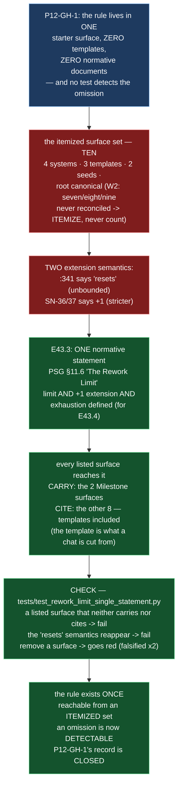

# E43.3 — Record: The Rework Limit, One Statement, an Itemized Set (D1–D6, decisions, falsification, diagram)

**Verification layer, time and scope, stated up front (`P11-GH-2`):**

| Axis | Value |
|---|---|
| **Layer** | **Literal file text** on disk in this repository's working tree — `rg`/`grep` against the files, not a rendered or GitHub view. |
| **Time** | **2026-09-02** |
| **Scope** | The `ai-project-system` working copy at branch **`epic/P12-M43-E43.3`**, branched from **`origin/milestone/M43` @ `2679c15`**. **Drivr was not touched and is not reported here.** |
| **Environment** | Local worktree `/home/panchew/soft-dev/ai-project-system/.ai-project/scratchpad/wt-e43-3`. Suite run as `PYTHONPATH=. pytest -q` (bare `pytest` fails collection). |

Every number below is stated **with its ref** — a number without a ref is not a
measurement (milestone spec v1.1.3). Baseline: **681 passed / 0 failed** on
`origin/milestone/M43` @ `2679c15`; final: **731 passed / 0 failed** at HEAD of this
branch (+50 — this epic's check).

**P11-GH-1 backstop, run before delivery:** `git log origin/milestone/M43..HEAD -- <milestone
spec; epic spec; P12-GH-1 note; PSG; AOG; chat-hierarchy>` returns only this epic's own commits —
no amendment to any artifact this Starter restates a rule from arrived during execution. The
`P12-GH-1` note and the E43.3 spec were re-read **in full** on this branch before deciding (G2).

---

## 1. Design decisions (delegated to this epic — decided, documented, proceeded)

### 1.1 The normative home (Design Decision 1) — PSG §11.6 "The Rework Limit"

**The one normative statement lives in `PROJECT-SYSTEM-GUIDELINES.md` §11.6**, as a new
subsection "The Rework Limit", between "Where the Acknowledgment Is Recorded" and
§11.6.1.

> **Maximum 3 attempts.** At every parent-chat → child gate, a parent chat may reject a
> child's delivery a **maximum of 3 attempts**. If a third Completion Notice is still
> not acceptable, the parent does **not** issue a fourth rejection-and-retry; the child
> produces an **Escalation Notice** and the parent escalates. **Silent fourth attempts
> are a governance violation.** **A written extension grants exactly ONE further
> attempt — not a reset to three.** **Rework is exhausted** when the 3-attempt maximum
> plus any written `+1` has been spent without an acceptable delivery — the state
> E43.4's flip triggers on.

**Why §11.6, and why it is ONE place.** The rework limit is the exception-path
mechanism of the acceptance model §11.6 already governs: a Review Decision rejects
(§11.6 "Exception path"), and the rework limit bounds how many times that rejection may
repeat. It sits with the acceptance chain's other two structural facts — the parent
performs the merge (E43.1) and the attributable acknowledgment (E43.2) — in the one
section that says what a parent→child gate does. The rule was in **no** normative
document (W2), which argued *for* the normative tier, not for leaving it in a starter
(Binding Constraint 3). **One place:** PSG §11.6. AOG is not amended — the statement is
stated once, and AOG is not a surface that must reach it (its role in the check is
covered by the itemized set below; AOG is deliberately out of it, recorded in §2.3).

### 1.2 Carry vs. cite (Design Decision 2) — per surface, with the mechanism stated

Every listed surface reaches the statement by **carry** (states both halves in its live
body) or **cite** (points at the one normative home). The split:

- **CARRY (2 surfaces):** `systems/milestone-execution-chat-starter.md` and
  `templates/milestone-execution-chat-starter.md`. These are the surfaces where the
  **Milestone Chat** — the chat that actually runs the rework loop on Epics, the
  surface `P12-GH-1` says must enforce it — reads its contract. The system reference
  already carried the operational rule (reconciled here, D2); the template — the file a
  Milestone Chat is instantiated from — now carries both halves too, because the
  template is exactly where `P12-GH-1` bites ("the template a Milestone Chat is
  actually instantiated from contains the word 'rework' zero times").
- **CITE (8 surfaces):** the other systems starters (`hq`, `epic`, `phase`), the other
  templates (`epic`, `phase`), the two seeds, and the root canonical
  `EPIC-EXECUTION-CHAT-STARTER.md`. These are parties to the loop (a parent one level
  up, the reworked child, or an instantiation surface with no rework role) but are not
  the surface that runs the Milestone→Epic loop; a citation reaches the one statement
  without restating it. The statement exists once; the set reaches it.

**Why the three templates are handled as they are** (the spec's explicit ask): the
**milestone** template **carries** — it is what a Milestone Chat is cut from, and the
rule must be *delivered to the chat that enforces it*, not pointed at from the
periphery. The **epic** and **phase** templates **cite** — their chats are the child in
the loop and a parent one level up respectively; both need to *reach* the statement,
neither *runs* the Milestone→Epic loop. Recording the mechanism is the deliverable;
carry and cite are both legitimate reaches.

---

## 2. The itemized surface set (D3) — a list, never a count (W2)

**Re-measured on this branch (`P11-GH-2`), 2026-09-02.** The set below is the list the
milestone's W2 required. It deliberately does **not** inherit the seven/eight/nine
figures: re-measurement finds **ten** starter-shaped surfaces — four `systems`, three
`templates`, two seeds, and the root canonical `EPIC-EXECUTION-CHAT-STARTER.md` (which
E43.1's record already enumerated as one of its eight). P12-GH-1's nine (4+3+2) and
E43.1's eight (4+3+canonical) each omitted one member of this list; that is W2's point
made literal — a count carries none of the context, a list carries all of it.

### 2.1 The ten starter-shaped surfaces — with the state of each (D3/D4)

| # | Surface | "rework" before (measured) | Mechanism | State after |
|---|---------|---------------------------|-----------|-------------|
| 1 | `systems/milestone-execution-chat-starter.md` | 8 (stated the rule at `:330`/`:334`, measured pre-E43.1/E43.2; now the Rework Cycle carries it) | **CARRY** | Rework Cycle's extension reconciled `"resets"` → `+1` (D2); cites PSG §11.6 "The Rework Limit" as the normative home; version 1.3.0 → 1.4.0, changelog row added |
| 2 | `systems/hq-execution-chat-starter.md` | 2 (neither stated the limit) | **CITE** | Review Decision row now names the rework limit and cites PSG §11.6; version 1.3.0 → 1.4.0, changelog row added |
| 3 | `systems/epic-execution-chat-starter.md` | 0 | **CITE** | New "Rework limit (P12-GH-1)" bullet cites PSG §11.6; version 1.2.0 → 1.3.0, changelog row added |
| 4 | `systems/phase-execution-chat-starter.md` | 0 | **CITE** | New "Rework Limit (P12-GH-1) — normative reference" section cites PSG §11.6; version 1.3.0 → 1.4.0, changelog row added |
| 5 | `systems/system-hq-seed.md` | 0 | **CITE** | Reference section cites the rework limit and PSG §11.6 |
| 6 | `templates/milestone-execution-chat-starter.md` | **0** (the P12-GH-1 bite) | **CARRY** | Critical-rules bullet carries both halves and cites PSG §11.6 — the template a Milestone Chat is instantiated from now contains the word "rework" |
| 7 | `templates/epic-execution-chat-starter.md` | **0** | **CITE** | Critical-rules bullet cites the rework limit and PSG §11.6 |
| 8 | `templates/phase-execution-chat-starter.md` | **0** | **CITE** | Critical-rules bullet cites the rework limit and PSG §11.6 |
| 9 | `templates/seed.md` | **0** | **CITE** | Body cites the rework limit and PSG §11.6 |
| 10 | `EPIC-EXECUTION-CHAT-STARTER.md` (root canonical) | **0** | **CITE** | "What Happens Next" step 4 cites the rework limit and PSG §11.6 |

### 2.2 The normative tier — the one statement

| Surface | State |
|---|---|
| `PROJECT-SYSTEM-GUIDELINES.md` | **Carries the one normative statement** in §11.6 "The Rework Limit" (D1) — version 2.5.0 → 2.6.0, changelog row added |

### 2.3 Deliberately out of the itemized set — with the reason (a conscious exclusion is a recorded decision)

| Surface | Why excluded |
|---|---|
| `AI-OPERATING-GUIDELINES.md` | Not a starter-shaped surface and not amended. The statement is stated **once**, in PSG §11.6. AOG's acceptance-text references to §11.6 already point at the section that now contains the rework limit; no AOG surface needs to restate or cite it (D1's "one place" is deliberate). |
| Instantiated starters and phase/milestone/epic docs under `docs/phases/**` (incl. this epic's own Starter, the M43 milestone spec, the phase spec) | **Historical records** of what a chat was actually told (E40.5's forward-only precedent). Retro-editing them would falsify the record; retro-failing them would turn the suite red for closed epics. The check is forward-only and scans the live governance surfaces. |
| `.ai-project.yml`, `bin/`, `~/soft-dev/drivr` | Out of scope per the epic spec — normative text plus a validator check, one repository. Drivr untouched. |

---

## 3. The check and its falsification (D5)

**Check:** `tests/test_rework_limit_single_statement.py` — 50 tests. Asserts, for the
**itemized** ten-surface set above: (a) PSG §11.6 carries the one normative statement —
both halves and the exhaustion definition; (b) no listed surface's live body states the
"resets" extension semantics (D2 — the drift is reconciled, not annotated); (c) every
listed surface reaches the statement — **carry** (both halves) or **cite** ("rework
limit" + a §11.6 pointer); (d) the two carry surfaces state both halves; (e) the eight
cite surfaces point at the normative home. Scanning is **live-body only** (stops at the
first history section — a changelog row quoting a marker cannot satisfy a guard the
live body no longer does); matching is case-folded / whitespace-normalized /
emphasis-stripped.

**Invocation and ref:** `PYTHONPATH=. pytest -q tests/test_rework_limit_single_statement.py`
— green at HEAD of `epic/P12-M43-E43.3` (50 tests). Node ID for the primary guard:
`tests/test_rework_limit_single_statement.py::test_surface_reaches_the_statement`.

**Falsification — observed, not assumed** (Hard Constraint: *prove the guard by
falsifying it*):

| # | State | Result |
|---|---|---|
| 0 | Baseline, `origin/milestone/M43` @ `2679c15` | **681 passed** |
| 1 | Delivered state | **731 passed** (+50) |
| 2 | `templates/epic-execution-chat-starter.md`'s cite removed (a listed surface falls out of coverage) | **2 failed**: `test_surface_reaches_the_statement[…templates/epic-execution-chat-starter.md]` (no carry, no cite) and `test_cite_surface_points_at_the_statement[…templates/epic…]` (missing `rework limit`) |
| 3 | Restored | green |
| 4 | `:341` reconciliation reverted to `"The 3-attempt limit resets only if …"` | **2 failed**: `test_no_surface_states_the_reset_semantics[…systems/milestone-execution-chat-starter.md]` (detected `resets only if`) and `test_carry_surface_states_both_halves[…systems/milestone…]` (missing `one further attempt`, `not a reset to three`) |
| 5 | Restored | green |

The check was confirmed **collected and running** by node ID in both falsifications — a
rotted guard is invisible behind a green total (M38's recorded trap).

---

## 4. Structural diagram (Mermaid, in-repo, no ComfyUI)

- **State:** implemented (this epic's output). The spec's proposed-track diagram (its
  Visual Bindings section) described the intent; this diagram records what landed.