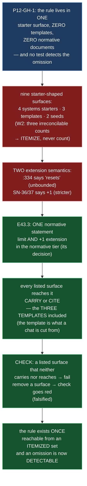

# Epic E43.3 — The Rework Limit: One Statement, an Itemized Set

## Context

M43 replaces behavioural rules an agent may choose to follow with structural facts that remove the
choice. E43.1/E43.2 did this for **authority** (who merges, what acceptance means). E43.3 does it for
the **rework limit** — the only mechanism bounding rework loops. It is the first of the second pair
(E43.3 → E43.4): **the flip fires on *exhausted rework*, and it needs one unambiguous definition of
"exhausted" before anything can trigger on it.** The two pairs are independent; this pair does not
wait on E43.1/E43.2.

The defect is `P12-GH-1`, and it is this epic's subject. The rule is **not in the normative tier at
all**: `governance/systems/milestone-execution-chat-starter.md` states it (at `:330` and `:334`), and
**nothing else does** — the nine starter-shaped surfaces reach it zero, one, or two times, and PSG/AOG
zero. Worst of all, `governance/templates/milestone-execution-chat-starter.md` — **the file a Milestone
Chat is actually instantiated from** — contains the word "rework" **zero** times. The rule is not
delivered to the chat that must enforce it.

**Finding W2 sharpens the delivery obligation.** Three counts exist for one surface set: E40.5's guard
reaches **seven**; the record says **eight**; HQ enumerates **nine**. No two reconcile. The reason is
that each was counted at a different moment against a different pattern — **a count carries none of
that context forward; a list carries all of it.** HQ required M43 to itemize precisely because counting
produced the discrepancy.

## Problem Statement

**The only mechanism bounding rework loops lives in exactly one starter surface, is absent from the
templates a chat is instantiated from, carries two contradictory extension semantics, and no test
detects any of it.**

Four failings, each a part of the one defect:

1. **Fragmentary reach.** The 3-attempt rule is stated in one of nine starter-shaped surfaces and in
   **zero** templates and **zero** normative documents. A rule that lives in one starter surface is
   one omission away from being unenforceable.
2. **The instantiation surface is the empty one.** The **template** — what a Milestone Chat is
   actually cut from — lacks the word "rework." That is where `P12-GH-1` bites hardest: the template
   is the thing that becomes authoritative at the moment a chat exists.
3. **Two contradictory extension semantics.** `systems/milestone-execution-chat-starter.md:334` says a
   written extension makes the limit *"reset"* — unbounded, repeatable. The SN-36/37 amendment grants
   **exactly one further attempt, not a reset to three.** Two statements about one mechanism is the
   drift condition this framework exists to prevent.
4. **No test detects the omission — `P12-GH-1`'s generalization.** As long as a behavioural rule can
   live in one surface and be authoritative there, every such rule is one omission away from being
   unenforceable, and no test detects it.

**"Which surface holds it" is this epic's decision** (phase starter assigns it here). The rule is
currently in **no** normative document — which is the strongest argument for the normative tier, and
*not* a reason to leave it in a starter.

## Goals

By the end of this Epic, the system must:

1. **Write ONE normative statement of the rework limit** — the 3-attempt maximum *and* what a written
   extension grants — in a surface that is authoritative rather than incidental.
2. **Reconcile the two extension statements into one.** The limit does **not** "reset"; a written
   extension grants **exactly one further attempt** (SN-36/37, CFO-decided, stricter). One statement
   survives; the other is removed, not left standing with a citation preferring the newer.
3. **State the surface set ITEMIZED** — a list, not a count — and make **every** listed surface reach
   the single statement, by carrying it or by citing it, **including all three templates.**
4. **Record which mechanism each surface uses** (carry vs. cite) and why.
5. **Add a check** that fails if any listed surface neither carries nor reaches the statement — and
   **update `P12-GH-1`'s carry-forward note** with the outcome.

## Non-Goals

This Epic explicitly does **not** aim to:

- **Design the flip or resume.** Those are E43.4's, sequenced after this epic — they fire on
  *exhausted rework*, which needs this epic's one definition first.
- **Change the 3-attempt number or the `+1` semantics.** Both are settled (Binding Constraint 5).
  This epic states and places them; it does not renegotiate them.
- **Fix `P12-GH-1`'s generalization at the mechanism level.** The itemized list is what makes a test
  *possible*; this epic generalizes the *lesson*, not the *sweep* of every behavioural rule in the
  corpus.
- **Touch `merge-authorization.md`, accept-by-silence, `.ai-project.yml`, `bin/`, or Drivr.**
  This epic is normative text plus a validator check; it does not cross repositories.

## Scope of Work

### 1. The one normative statement, placed (D1)

Write the single statement of the rework limit, in the surface this epic chooses as authoritative
(the phase starter delegates the choice here — the rule is in no normative document, which argues for
PSG). It states both halves: **the 3-attempt maximum**, and **what a written extension grants — one
further attempt, not a reset.** The reasoning for the chosen surface is recorded.

### 2. The two extension statements reconciled (D2)

`systems/milestone-execution-chat-starter.md:334`'s *"resets"* is removed or rewritten to say **one
further attempt.** The SN-36/37 amendment is the surviving semantics. **One statement** survives; the
drift is resolved, not annotated (Binding Constraint 5: *reconcile into one; do not leave both
standing with a citation preferring the newer*).

### 3. The itemized surface set (D3)

List every starter-shaped surface — the four `systems/*-execution-chat-starter.md`, the three
`templates/*-execution-chat-starter.md`, and the two seeds (`system-hq-seed.md`, `seed.md`) — **as a
list with the state of each**: whether it carries the statement or cites it, and the mechanism. W2's
seven/eight/nine discrepancy is discharged by listing rather than counting; the epic re-measures on
this branch and lists what it finds (`P11-GH-2`).

### 4. Every surface reaches the statement (D4)

For each listed surface: it either **carries** the rule or **cites** the single statement. The three
templates are in scope and are where `P12-GH-1` bites — the epic states which mechanism (carry vs.
cite) each template uses and why.

### 5. The check and its falsification (D5)

A check that fails if a listed surface neither carries nor reaches the statement. Falsification: remove
one surface from coverage and watch the check fail; restore it. **`P12-GH-1`'s generalization is the
target** — the itemized list is what makes *"no test detects the omission"* finally false.

### 6. The carry-forward note update (D6)

`docs/phases/P12__.../P12__carry-forward-note__P12-GH-1-rework-limit-reaches-one-surface.md` is
updated with the outcome: the one statement, the itemized set, the mechanism, and the check. The
defect's record is closed, not silently retired.

## Deliverables

- [ ] **D1** — The one normative statement of the rework limit, with the placement decision recorded
- [ ] **D2** — The two extension statements reconciled to one (`+1`, not "resets")
- [ ] **D3** — The itemized surface set, each surface's state stated
- [ ] **D4** — Every listed surface reaching the statement (carry vs. cite), the three templates
      included, with the mechanism stated
- [ ] **D5** — The check, with a falsification demonstration (a surface removed → check fails)
- [ ] **D6** — `P12-GH-1`'s carry-forward note updated with the outcome
- [ ] Structural diagram (Mermaid, in-repo, no ComfyUI)
- [ ] **Epic Delivery Notice**

## Binding Constraints

Settled above this epic — **not re-decidable here**:

1. **E43.3 → E43.4.** The flip fires on *exhausted rework*, and needs one unambiguous definition of
   "exhausted" first. This epic is first of its pair.
2. **The limit is 3 attempts; a written extension grants `+1`, not a reset.** SN-36/37, CFO-decided,
   **stricter** than the corpus. Reconcile into one; do not stack.
3. **The rule is in no normative document (W2).** That argues for the normative tier — it is not a
   reason to leave it in a starter.
4. **The set is itemized, never counted** (W2, and HQ's explicit requirement). Every coverage claim
   cites the list.

## Hard Constraint (binding — carried to every Epic)

- **Execution posture: `manual` / paid frontier.** This epic decides the binding reach of the rule
  that bounds rework — including the surface that tells a Milestone Chat how to behave in a rework
  loop. **The instance must be manual for the same reason the whole milestone is.**
- **Itemize, never count.** The surface set is a list; a count in the deliverable is a defect.
- **Prove the guard by falsifying it.** Remove a surface from coverage, watch the check fail.
- **Do not weaken a guard to accommodate a change.** The `+1` is strictly applied, not relaxed.
- **State the layer, time and scope of every claim** (`P11-GH-2`) — **and pin the ref.**
- **State the repository.** This epic lands entirely in `ai-project-system`; nothing crosses to Drivr.

## Design Decisions Delegated — decide, document, proceed

1. **Which surface holds the one normative statement** (phase starter assigns this here). The rule is
   in no normative document; the natural home is PSG. Record the choice and why it is *one* place.
2. **Carry vs. cite, per surface.** Which listed surfaces carry the full statement and which cite it —
   and how the three templates are handled, since the template is what a chat is instantiated from.

## Definition of Done

Epic E43.3 is complete when:

- [ ] Exactly one normative statement of the limit and of what an extension grants; **no** surface
      contradicts it
- [ ] The surface set is an **itemized list** in the deliverable, not a count
- [ ] Every listed surface reaches the statement (carry or cite), with the mechanism stated — the
      three templates included
- [ ] The check **fails when a surface is removed** from coverage (falsification)
- [ ] `P12-GH-1`'s carry-forward note is updated with the outcome
- [ ] Suite green — no skip introduced — with the invocation and the ref stated
- [ ] Delivery Notice committed; PR opened to `milestone/M43`

## Acceptance Criteria

- [ ] Exactly one normative statement of the limit and of what an extension grants; no surface
      contradicts it
- [ ] The surface set is an itemized list in the deliverable, not a count
- [ ] Every listed surface reaches the statement; the mechanism is stated
- [ ] The check fails when a surface is removed from coverage
- [ ] `P12-GH-1`'s carry-forward note is updated with the outcome
- [ ] Every claim states the layer, time and scope — and the **ref** — at which it was verified

## Technical Constraints

**In scope:** the one PSG section chosen as the normative home; `governance/systems/milestone-execution-chat-starter.md`
(the `:330`/`:334` statement and the `:334` "resets" reconciliation); the other starter-shaped
surfaces and templates in the itemized set; the check under `tests/`; the `P12-GH-1` carry-forward
note.
**Do not touch:** `merge-authorization.md` (E43.1); accept-by-silence (E43.2); the flip/resume surfaces
(E43.4); `.ai-project.yml`; `bin/`; `~/soft-dev/drivr`.
**Repository:** `ai-project-system` only. Nothing crosses to Drivr.
**Invocation:** `PYTHONPATH=. pytest -q` — bare `pytest` fails collection.

## Dependencies

**Internal**
- **E43.4** is sequenced **after** this epic (the flip fires on exhausted rework, which needs this
  epic's one definition of "exhausted" first).
- **E43.1/E43.2** are the independent pair and neither wait on nor gate this epic.

**External**
- None. This epic does not cross repositories.

**Blockers**
- None at planning.

## Timeline

**Estimated Effort:** 1 session.
**Target Completion:** first of its pair — E43.4 waits on it.
**Actual Completion:** In progress.

## Execution Notes

**Order:**
1. Re-measure the surface set on **this branch** and itemize it — do not inherit the seven/eight/nine
   figures (W2).
2. Choose the normative home; write the one statement (both halves).
3. Reconcile `:334` "resets" → `+1` (one statement survives).
4. Route every surface to the statement (carry vs. cite), templates included.
5. Write the check; **remove a surface and watch it fail**; restore it.
6. Update the `P12-GH-1` carry-forward note.
7. Run the suite; state the invocation and the ref.

**Traps:**
- Emitting a coverage **count** — the list is the deliverable (W2).
- Leaving both extension statements standing with a citation preferring the newer — that is the drift
  condition, not a resolution (Binding Constraint 5).
- Skipping the templates — the template is what a chat is instantiated from, and `P12-GH-1` bites
  exactly there.
- Stating a claim against an unpinned ref.

## Related Documents

- [M43 Milestone Spec](P12-M43__milestone-spec.md) — W2, E43.3 Epic Detail, Hard Constraint, Binding
  Constraints
- [P12 Phase Spec](P12__phase-spec.md) — §P12.3, §Acceptance Criteria
- [P12-GH-1 carry-forward note](P12__carry-forward-note__P12-GH-1-rework-limit-reaches-one-surface.md) —
  this epic's specification, and updated by it
- [E43.4](P12-M43-E43.4__spec__rework-exhaustion-flip-and-resume.md) — sequenced after this epic
- [PROJECT-SYSTEM-GUIDELINES.md](../../../governance/PROJECT-SYSTEM-GUIDELINES.md)
- [AI-OPERATING-GUIDELINES.md](../../../governance/AI-OPERATING-GUIDELINES.md)

## Visual Bindings

**Visual binding**
- **Link:** (inline — Structural diagram; no hosted link needed per AOG §16.3/§16.5)
- **What:** diagram
- **Level:** Epic
- **State:** proposed

- **Description:** E43.3 consolidates the rework limit into one normative statement and makes a test
  of its reach possible for the first time. The rule currently lives in one starter surface, is absent
  from every template and the normative tier, and carries two contradictory extension semantics
  ("resets" vs. "+1") that are reconciled into one. The surface set is itemized rather than counted
  (W2), every listed surface is routed to the single statement by carry or cite, and a check fails when
  a surface falls out of coverage — turning `P12-GH-1`'s *"no test detects the omission"* into a false
  statement. Proposed-track Structural diagram (AOG §16.3/§16.6), Mermaid, no ComfyUI.

## Notes

- **This epic is `P9-GH-1`'s shape three phases later, and the generalization is the point.** E40.5
  swept the merge-authorization pushback across its surfaces — but the sweep fixed **one** rule and
  *not the fragmentation that produced it*. `P12-GH-1` is the same structure applied to a different
  rule. The itemized list is what turns a per-rule sweep into a *checkable* surface — the epic generalizes
  the lesson in a note, and delivers the mechanism that would have caught the omission.

- **Reconcile, do not stack.** The milestone's Binding Constraint 5 is explicit: leaving `:334`'s
  "resets" standing beside the `+1` amendment with a citation preferring the newer *is* the drift
  condition — annotated drift is still drift. One statement survives.

- **Why "normative tier" is the answer, not a preference.** The rule is in **no** normative document
  (W2). A behavioural rule placed in the normative tier is not *automatically* reachable — but it is
  reachable **from a surface that is authoritative**, and the itemized list plus the check is what
  proves the reach. The phase starter assigns the choice here precisely because it is a decision, not a
  default.

## Changelog

| Version | Date | Change |
|---|---|---|
| 1.0.0 | 2026-09-02 | Initial E43.3 spec, from the M43 milestone spec (v1.1.3) E43.3 Epic Detail, W2 and `P12-GH-1`. One normative statement with reconciled `+1` extension semantics; the itemized nine-surface set (carry vs. cite, templates included); the falsifying check; and the carry-forward-note update. Records the two delegated decisions (normative home, carry-vs-cite routing). No scope, ordering, gate or acceptance-criterion change from the milestone spec. |
