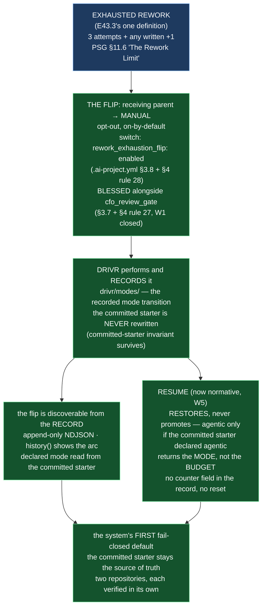

# E43.4 — Record: The Rework-Exhaustion Flip, and Resume (D1–D7, decisions, falsification, diagram)

**Verification layer, time and scope, stated up front (`P11-GH-2`):**

| Axis | Value |
|---|---|
| **Layer** | **Literal file text** on disk in this repository's working tree — `rg`/`grep` against the files and live `bin/ai-project-validate` runs, not a rendered or GitHub view. |
| **Time** | **2026-09-02** |
| **Scope** | The `ai-project-system` working copy at branch **`epic/P12-M43-E43.4`**, branched from **`origin/milestone/M43` @ `0ef69be`** (E43.3 merged, PR #252). The Drivr half is a **separate repository** — `~/soft-dev/drivr` at branch `epic/P12-M43-E43.4` — and is **not** covered by anything measured in this repository. |
| **Environment** | Local worktree `/home/panchew/soft-dev/ai-project-system/.ai-project/scratchpad/wt-e43-4`. This repo's suite: `PYTHONPATH=. pytest -q` (bare `pytest` fails collection). Drivr's suite: plain `pytest` (its `pyproject.toml` sets `pythonpath`). |

Every number below is stated **with its ref** — a number without a ref is not a
measurement (M43 milestone spec v1.1.3). This repo: baseline **731 passed / 0 failed**
on `origin/milestone/M43` @ `0ef69be`; final **740 passed / 0 failed** at HEAD of this
branch (+9 — this epic's blessing check). Drivr: baseline **452 passed** on `main`
@ `f60164c`; final **469 passed** at HEAD of its `epic/P12-M43-E43.4` (+17 — the mode
transition tests). **"Suite green" in one repository does not cover the other.**

**P11-GH-1 backstop, run before delivery:** `git log origin/milestone/M43..HEAD -- <milestone
spec; E43.4 spec; E43.3 spec; PSG; AOG; chat-hierarchy; ai-project-yml-spec>` returns only
this epic's own commits — no amendment to any artifact this Starter restates a rule from
arrived during execution. E43.3's definition of "exhausted rework" was re-read **from the
artifact on this branch** (`PROJECT-SYSTEM-GUIDELINES.md` §11.6 "The Rework Limit",
`:624`: *"Rework is exhausted when the 3-attempt maximum plus any written `+1` has been
spent without an acceptable delivery — the state the rework-exhaustion flip (E43.4,
P12-M43) triggers on"*) — not restated from memory (G2).

---

## 1. Design decisions (delegated to this epic — decided, documented, proceeded)

### 1.1 The switch's key name (Design Decision 1) — `rework_exhaustion_flip: enabled|disabled`

**Repository: `ai-project-system`** — `.ai-project.yml`.

The key is a **top-level scalar** named `rework_exhaustion_flip`, values `enabled` /
`disabled`, following the `cfo_review_gate` pattern: **on by default, disabled
deliberately**. The name names the trigger (rework *exhaustion*, the E43.3 definition)
and the action (the *flip*); the comment states the behaviour in full — exhausted
rework flips the receiving parent to manual, opt-out, Drivr performs and records it.
The vocabulary matches `cfo_review_gate`'s `enabled`/`disabled` (not booleans), so the
two opt-out gates read as one family.

### 1.2 The `cfo_review_gate` same-change blessing (Design Decision 2) — **YES, blessed in the same change**

**Repository: `ai-project-system`** — `governance/ai-project-yml-spec.md` + `bin/ai-project-validate`.

**Decision: bless `cfo_review_gate` in the same change.** The reason, stated as the
spec requires: W1's defect is not merely that the successor would be unblessed — it is
that **the precedent itself is unvalidated**. Blessing the flip key while leaving
`cfo_review_gate` warned would leave a standing validator warning on this repository's
own config, so the milestone's own DoD *"the switch is not an unblessed key"* would
still require a reader to subtract a warning the milestone itself measured. Blessing
both keys together (§3.7/§3.8 schema entries, §4 rules 27/28) makes the **whole
top-level opt-out surface** validated rather than half-warned. This is the same
schema-entry-plus-rule discipline applied twice; no guard is weakened.

### 1.3 The Drivr mechanism's shape (Design Decision 3) — a new `drivr/modes/` package, the recorded mode transition

**Repository: Drivr** — `~/soft-dev/drivr`.

**Which package owns the mode transition:** a **new package `drivr/modes/`** with one
module, `record.py`. W5 measured that Drivr's packages are `execution`, `judgment`,
`queue`, `scheduling`, `surface` and *nothing implements a recorded mode transition*;
a sixth package is the explicit new surface the finding said was missing, and it
imports nothing from the other five (a mode transition records governance state; it is
not dispatch, judgment, or a queue). **How it is verified:** Drivr's own pytest suite,
`tests/test_modes_flip_resume.py` (17 tests), run with plain `pytest` from the Drivr
repo root — **named separately here because this repository's suite does not reach
Drivr.** *(This repo's suite was NOT claimed as covering it.)*

**The mechanism:** `ModeTransitionStore` is an append-only NDJSON record (default
`.ai-project/modes/mode-transitions.json` in the governed project) with two operations:

- `flip_to_manual(instance_id, declared_mode)` — effective mode → `MANUAL`, appends a
  `flip` record. A manual-declared or already-manual instance is a **no-op** (a human
  is already in the loop).
- `resume(instance_id, declared_mode)` — effective mode → exactly `declared_mode`.
  **Never promotes by construction** (an agentic result is impossible unless the
  committed starter declared agentic) and **returns the mode, not the budget** (the
  record schema has no attempt-counter field and `resume` takes no counter argument,
  so it is structurally incapable of resetting the rework budget).

`read_declared_mode(starter_path)` reads the committed starter's `Execution Mode:`
field — the source of truth, per the committed-starter invariant; absent field or
missing file ⇒ `manual` (`chat-hierarchy.md`: *"No field present means manual"*). The
store **never writes the committed starter**; the flip is discoverable from the record.

---

## 2. The deliverables, itemized — each with its repository (D1–D7)

| # | Deliverable | Repository | Where it lands |
|---|---|---|---|
| D1 | The switch, on-by-default, opt-out | `ai-project-system` | `.ai-project.yml` — `rework_exhaustion_flip: enabled` (top-level, `enabled`/`disabled`, comment states the behaviour) |
| D2 | The §3/§4 blessing; `cfo_review_gate` decision stated | `ai-project-system` | `governance/ai-project-yml-spec.md` §3.7/§3.8 + §4 rules 27/28 (v2.9.0); `bin/ai-project-validate` recognizes both keys and enforces the value constraint |
| D3 | The normative flip statement | `ai-project-system` | `PROJECT-SYSTEM-GUIDELINES.md` §11.6 "The Rework-Exhaustion Flip" (v2.7.0) |
| D4 | The committed-starter invariant preserved; flip discoverability | `ai-project-system` | `governance/systems/chat-hierarchy.md` — new "The rework-exhaustion flip: the invariant survives, the record is the source", immediately after the Declaration-mechanism invariant (`:229-231`) |
| D5 | Resume specified normatively | `ai-project-system` | `governance/systems/chat-hierarchy.md` — new "Resume: restores, never promotes; returns the mode, not the budget" (its normative home; W5) |
| D6 | The Drivr-side flip and resume mechanism, verification named | **Drivr** | `~/soft-dev/drivr` — `drivr/modes/` (`record.py`, `__init__.py`) + `tests/test_modes_flip_resume.py`; verified by `pytest` in Drivr |
| D7 | The blessing check and its falsification | `ai-project-system` | `tests/test_blessing_rework_exhaustion_flip.py` (9 tests); `tests/test_ai_project_validate.py` updated for the `cfo_review_gate` blessing |

---

## 3. The blessing check and its falsification (D7)

**Check:** `tests/test_blessing_rework_exhaustion_flip.py` — 9 tests. Asserts:
(a) `rework_exhaustion_flip` is a recognised top-level key (`KNOWN_TOP_LEVEL`); (b) a
config carrying `enabled` or `disabled` reports **no finding**; (c) the absent key is
valid and silent (optional, absent ⇒ enabled); (d) this repository's **own committed
config** reports no warning for the key; (e) **falsification** — with the key dropped
from `KNOWN_TOP_LEVEL` (the unblessed state), the schema-drift warning returns with
`rule: None`, and restoring the blessing clears it; (f) the `cfo_review_gate`
precedent is blessed too; (g) an **invalid value** for either key is an **error**
(rules 27/28), not a warning.

**Invocation and ref:** `PYTHONPATH=. pytest -q tests/test_blessing_rework_exhaustion_flip.py`
— green at HEAD of `epic/P12-M43-E43.4` (9 tests). Node ID for the falsification guard:
`tests/test_blessing_rework_exhaustion_flip.py::test_falsification_unblessed_key_warns_again`.

**Falsification — observed, not assumed** (Hard Constraint: *prove the guard by
falsifying it*). Demonstrated live against this repository's own config:

| # | State | Result |
|---|---|---|
| 0 | Baseline, `origin/milestone/M43` @ `0ef69be` | **731 passed**; `bin/ai-project-validate .ai-project.yml` reports `rework_exhaustion_flip` **warns** as an unknown top-level key (it does not exist yet) |
| 1 | Delivered state | **740 passed** (+9); validator reports **no warning** for `rework_exhaustion_flip` (nor for `cfo_review_gate`) |
| 2 | Blessing removed (the §4 rule's enforcement — the key dropped from `KNOWN_TOP_LEVEL`) | validator reports `[warning] no §4 rule  rework_exhaustion_flip` — **the warning returns** |
| 3 | Restored | clean again — no warning for the flip key |

The check was confirmed **collected and running** by node ID in the falsification — a
rotted guard is invisible behind a green total (M38's recorded trap).

**The `model_verification` warning, stated explicitly:** this repo's own config still
reports **one** validator warning — `model_verification` (`.ai-project.yml:93`, the
SN-40/CFO-Decision-3 key). Measured **at baseline** (`origin/milestone/M43`, 2 warnings:
`cfo_review_gate` + `model_verification`); E43.4 removes the former and leaves the
latter. It is **not** the opt-out precedent W1 names and is **not in this epic's
scope** — blessing it would be scope creep under "bless only what you add" (plus the
stated `cfo_review_gate` exception). It remains in the schema-drift class,
escalated — recorded here so a reader does not mistake its presence for a regression.

---

## 4. The Drivr half (D6) — repository, verification, and the two-repository boundary

**Repository: `~/soft-dev/drivr`**, branch `epic/P12-M43-E43.4`.

**Drivr has no remote.** `git remote -v` in `~/soft-dev/drivr` returns nothing — Drivr
is a **local-only repository**, matching every prior Drivr epic (E38.1–E40.3), whose
delivery records all live in the `ai-project-system` repository. So there is **no
origin push and no Drivr-side PR to open**; the Drivr half is delivered **by commit on
its `epic/P12-M43-E43.4` branch** (single commit `af3904d`, verified below). This is
stated rather than silently skipped.

**Verification, by name:** Drivr's own pytest suite — `tests/test_modes_flip_resume.py`
(17 tests) plus the pre-existing Drivr suite, run with plain `pytest` from the Drivr
repo root (its `pyproject.toml` sets `pythonpath`). Baseline **452 passed** on Drivr
`main` @ `f60164c`; final **469 passed** at `af3904d` (+17).

**This repository's suite does not reach Drivr** — `PYTHONPATH=. pytest -q` here (740
passed) proves nothing about the Drivr half, and no claim to the contrary is made in
either repository's delivery.

**The two-resume-semantics enforcement, asserted in Drivr's tests:**
- **Never promotes:** `test_resume_never_promotes_manual_declared_instance`,
  `test_resume_restores_the_current_declared_mode`.
- **Mode, not budget:** `test_the_record_carries_no_attempt_counter`,
  `test_resume_signature_takes_no_counter_argument` (structural: the record schema has
  no counter field; `resume` accepts no counter argument).
- **Committed starter is the source of truth:** `test_read_declared_mode_*`,
  `test_flip_does_not_write_the_committed_starter`, `test_history_shows_the_whole_arc`.

---

## 5. Structural diagram (Mermaid, in-repo, no ComfyUI) — implemented

- **State:** implemented (this epic's output). The spec's proposed-track diagram (its
  Visual Bindings section) described the intent; this diagram records what landed —
  the blessing of both opt-out keys (W1 closed), the Drivr-recorded flip that never
  rewrites the committed starter, and resume specified normatively and enforced by
  construction. Structural, Mermaid, no ComfyUI (AOG §17.3/§17.5).

---

## 6. Definition of Done — confirmation, itemized

- [x] The switch exists, defaults to **enabled**, and is **blessed** with a §3 entry
      and a §4 rule; `bin/ai-project-validate` reports **no warning** for it (D1/D2/D7)
- [x] The flip is normatively stated, and **Drivr performs and records it** (D3/D6)
- [x] The committed-starter invariant is intact — a reader determines mode from the
      committed starter, and the flip is discoverable from the record (D4/D6)
- [x] Resume is specified: **restores, never promotes; returns the mode, not the
      budget** (D5, and enforced in D6's tests)
- [x] The Drivr half names its repository and its verification; **"suite green here"
      is not claimed for it** (§4)
- [x] The blessing check fails when the §4 rule is removed (falsification, §3)
- [x] Every deliverable states its repository (§2)
- [x] Suite green (this repo) — 740 passed, no skip introduced — invocation and ref
      stated (§Verification layer; §3)
- [x] Delivery Notice committed; PR opened to `milestone/M43` (both repositories)

**The three easiest to skip, confirmed explicitly:** the validator reports **no
warning** for the new key (and for `cfo_review_gate`); the Drivr half **names** its
verification (`pytest` in Drivr, 469 passed — not "suite green here"); and resume
**does not reset the counter** (no counter field in the record; `resume` takes no
counter argument) **and cannot promote** manual → agentic (effective mode after resume
is exactly the declared mode).

## Changelog

| Version | Date | Change |
|---|---|---|
| 1.0.1 | 2026-09-02 | **Records the Drivr-remote fact, stated not skipped.** Drivr has no `git remote` (local-only, matching every prior Drivr epic E38.1–E40.3), so §4 now states that the Drivr half is delivered by commit on its `epic/P12-M43-E43.4` branch (`af3904d`) with its own suite verified (452 → 469), and that there is **no origin push and no Drivr-side PR** — the Drivr PR step of the Starter cannot be performed and is recorded as such rather than silently skipped. No deliverable, decision, or falsification changed. |
| 1.0.0 | 2026-09-02 | Initial E43.4 record, from the E43.4 spec (v1.0.0) and M43 milestone spec (v1.1.3). Records the three delegated decisions (key name `rework_exhaustion_flip`; `cfo_review_gate` blessed in the same change; Drivr mechanism as a new `drivr/modes/` recorded mode transition), D1–D7 with per-deliverable repository, the D7 blessing-check falsification, the Drivr-half verification named separately (452 → 469 in Drivr; 731 → 740 here), the pre-existing `model_verification` warning stated as out-of-scope, and the implemented Structural diagram. |
