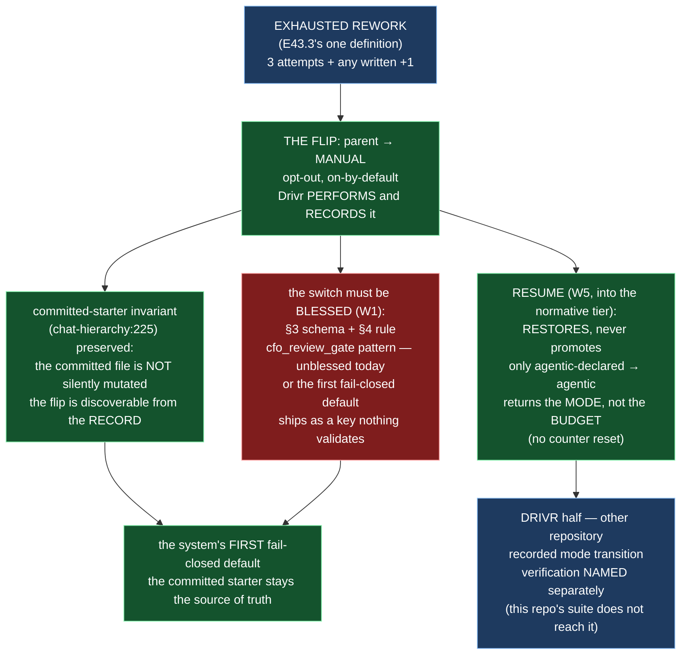

# Epic E43.4 — The Rework-Exhaustion Flip, and Resume

## Context

M43's four epics each replace a behavioural rule with a structural fact. **E43.4 installs the
system's first fail-closed default.** It is the second of its pair (E43.3 → E43.4) and lands **after**
E43.3, because the flip fires on *exhausted rework* and needs one unambiguous definition of
"exhausted" before anything may trigger on it.

The trigger is SN-31 Decision 5: **exhausted rework flips the receiving parent chat to manual — an
opt-out default.** When a parent's rework limit is exhausted (the 3 attempts plus any written `+1`),
the default is no longer "keep going however you like"; it is *go manual, and have a human in the
loop* — while remaining **opt-out** for a project that deliberately disables it. This is the direct
counterweight to the phase's organizing finding: agentic mode is *defined* by no human being present,
and a rework loop is exactly where a human needs to be. **SN-31 Decision 5 makes an unenforceable
rework limit disarm that counterweight** — which is why E43.3's reconciliation is this epic's
prerequisite.

**Finding W5 governs the shape of the work.** *Resume* — the recovery path back out of a manual flip —
appears in **no** normative document: the only match in `chat-hierarchy.md` is the word *"presumes."*
The SN-36/37 semantics (*restores, never promotes; returns the mode, not the budget*) exist in a
steering note and nowhere normative. **And Drivr has no surface for either half of the flip** — its
packages are `execution`, `judgment`, `queue`, `scheduling`, `surface`; nothing implements a recorded
mode transition. **E43.4 is greenfield across two repositories**, and "the suite is green" here does
not cover the Drivr half.

**Finding W1 is the constraint that shaped delivery 2.** The opt-out precedent this switch is told to
follow — `cfo_review_gate: enabled` — is itself an **unblessed key**: `bin/ai-project-validate` warns
on it today (*"no §4 rule … schema-drift class"*), and `ai-project-yml-spec.md` records the gap openly.
**Copying the pattern verbatim would ship the system's first fail-closed default as a key nothing
validates.** E43.4 must bless the key it adds: a §3 schema entry and a §4 rule.

## Problem Statement

**The system has no fail-closed default for exhausted rework, no way back out once it has one, and the
precedent it must copy is itself unvalidated.**

Four failings, each a part of the one defect:

1. **Exhausted rework has no system-level consequence today.** The 3-attempt limit (E43.3's subject)
   bounds a loop *only if an agent reads the prose and chooses to stop*. P12's entire premise is that
   the agentic case has no human present to notice when it does not. The flip is what makes the limit
   *structural* rather than *advisory*: exhaust the limit, and the parent goes manual.
2. **The recovery path is unwritten.** Once flipped manual, an instance needs a defined way back —
   and *resume* exists **nowhere normative** (W5). Its two semantics are load-bearing: it **restores,
   never promotes** (only an instance whose committed starter already declares `agentic` may be
   resumed to agentic — a promote path would be granting a mode the starter never declared), and it
   **returns the mode, not the budget** (it must not reset the attempt counter, or the flip's own
   trigger would make the limit unenforceable by the very control meant to recover from it).
3. **The committed-starter invariant is the sharpest constraint and must not be broken silently**
   (`chat-hierarchy.md:225`). A reader determines an instance's mode by reading its committed starter.
   A runtime flip that leaves the committed file saying `agentic` while the instance runs manual would
   break that invariant — **so Drivr records the flip**, keeping the committed record the source of
   truth rather than contradicted by it.
4. **The precedent is an unblessed key (W1).** `cfo_review_gate` warns on validation today. Copying it
   without blessing the copy ships the first fail-closed default as a key nothing validates.

## Goals

By the end of this Epic, the system must:

1. **Add the opt-out switch to `.ai-project.yml`** on the `cfo_review_gate` pattern — **on by default,
   disabled deliberately** — named and typed so its meaning is unambiguous.
2. **Bless the switch in `ai-project-yml-spec.md`** — a §3 schema entry and a §4 rule — so
   `bin/ai-project-validate` reports **no warning** for it. (W1)
3. **State the flip normatively:** exhausted rework flips the **receiving parent** to manual; opt-out;
   **Drivr performs the flip and records it.**
4. **Preserve the committed-starter invariant** (`chat-hierarchy.md:225`): a reader can still determine
   mode from the committed starter, and the flip is discoverable from the record.
5. **Specify resume normatively** (W5): restores, never promotes; returns the mode, not the budget.
6. **Build the Drivr-side mechanism — in Drivr** — with its own verification stated, since this
   repository's suite does not reach it.

## Non-Goals

This Epic explicitly does **not** aim to:

- **Define "exhausted rework."** That is E43.3's — this epic's prerequisite. The definition exists
  before this epic runs.
- **Change the rework limit or its `+1` semantics.** Those are E43.3's, and settled.
- **Make the flip mandatory (non-opt-out).** It is opt-out by design (Decision 5); a deliberate project
  can disable it. What is *not* allowed is an unblessed or undocumented switch.
- **Promote manual to agentic.** Resume *restores* a declared mode; nothing in this epic creates a path
  to agentic for an instance whose starter declares manual.
- **Touch `merge-authorization.md`, accept-by-silence, or the rework-limit consolidation.** Those are
  E43.1/E43.2/E43.3.

## Scope of Work

Per-deliverable repository is stated inline — this epic spans `ai-project-system` and **Drivr**
(`~/soft-dev/drivr`), and "the suite is green" in one does not cover the other.

### 1. The switch in `.ai-project.yml` (D1 — `ai-project-system`)

Add the switch on the `cfo_review_gate` pattern: **on by default (`enabled`), disabled deliberately.**
The exact key name is this epic's design decision; it must be a top-level key whose `enabled`/`disabled`
value and whose meaning (exhausted rework flips the receiving parent to manual) are self-evident from
the name and the comment.

### 2. The blessing in `ai-project-yml-spec.md` (D2 — `ai-project-system`)

A **§3 schema entry** and a **§4 validation rule** for the new key. **Whether `cfo_review_gate` is
blessed in the same change is this epic's decision** (W1): state it either way, and if not, say why. If
`cfo_review_gate` is blessed too, the same schema-entry-plus-rule discipline applies to it. After this
deliverable, `bin/ai-project-validate` reports **no warning** for the new key.

### 3. The normative statement of the flip (D3 — `ai-project-system`)

State, in one normative place, that **exhausted rework flips the receiving parent to manual** — opt-out,
with **Drivr performing the flip and recording it.** The statement names the trigger (E43.3's
definition), the actor (Drivr), and the record (so the committed starter stays the source of truth).

### 4. The committed-starter invariant preserved (D4 — `ai-project-system`)

Amend or add to `chat-hierarchy.md` (at/near `:225`) so the invariant is stated alongside the flip:
a reader determines mode from the committed starter, **and the flip is discoverable from the record**
— not from a mutated committed file that would make the source of truth contradict itself.

### 5. Resume, specified normatively (D5 — `ai-project-system`)

Write resume into the normative corpus (W5: it exists nowhere). Two properties, both ratifiable verbatim:

- **Restores, never promotes.** Only an instance whose committed starter declares `agentic` may be
  resumed to agentic. No control may move manual → agentic.
- **Returns the mode, not the budget.** Resume does not reset the attempt counter. If it did, the
  flip's trigger would make the limit unenforceable by the control meant to recover from it.

### 6. The Drivr-side mechanism (D6 — **Drivr**)

Implement the flip **and** the resume in Drivr, with a recorded mode transition. This repository's
suite does not reach it; **the epic states how the Drivr half is verified** (Drivr's own tests, or a
documented manual verification, with the invocation named) and does **not** claim "suite green here"
for it.

### 7. The check and falsification (D7 — `ai-project-system`)

A check in this repo falsifiable against the `ai-project-system` half: the switch's blessing produces
**no warning** from the validator. Falsification: remove the §4 rule and show the warning returns.
*(The Drivr half's verification is D6's, named and stated separately — this repo's suite does not
reach it.)*

## Deliverables

- [ ] **D1** — The switch in `.ai-project.yml` (on-by-default, opt-out) — `ai-project-system`
- [ ] **D2** — The §3/§4 blessing in `ai-project-yml-spec.md`; `cfo_review_gate`'s same-change blessing
      decided and stated — `ai-project-system`
- [ ] **D3** — The normative flip statement — `ai-project-system`
- [ ] **D4** — The committed-starter invariant preserved and the flip's discoverability stated —
      `ai-project-system`
- [ ] **D5** — Resume specified normatively (restores/never-promotes; mode/not-budget) —
      `ai-project-system`
- [ ] **D6** — The Drivr-side flip and resume mechanism, with its verification named — **Drivr**
- [ ] **D7** — The blessing check and its falsification — `ai-project-system`
- [ ] Structural diagram (Mermaid, in-repo, no ComfyUI) — `ai-project-system`
- [ ] **Epic Delivery Notice**

## Binding Constraints

Settled above this epic — **not re-decidable here**:

1. **E43.3 → E43.4.** The flip fires on *exhausted rework*; the one definition of "exhausted" exists
   before this epic runs.
2. **The flip is opt-out, on-by-default.** Decision 5. Not re-decidable.
3. **Resume restores, never promotes; returns the mode, not the budget.** SN-36/37. Not re-decidable.
4. **The committed-starter invariant survives** (`chat-hierarchy.md:225`). Drivr records the flip; the
   committed file is not silently mutated into contradiction with itself.
5. **The switch must be blessed** (W1). An unblessed key carrying the system's first fail-closed
   default is a defect, not a deployment detail.
6. **"Mode is not authority" and §11.6.1 are unchanged, deliberately.**

## Hard Constraint (binding — carried to every Epic)

- **Execution posture: `manual` / paid frontier.** This epic installs the **first fail-closed default
  in the system** — the counterweight the whole phase is balanced on. **The instance authoring it must
  not be the instance the flip would silently govern.**
- **Itemize, never count.** Any list (surfaces, deliverables, repositories) is a list.
- **Prove each guard by falsifying it.** The blessing check fails when the §4 rule is removed.
- **State the repository** on **every** deliverable. This epic spans two; "suite green" here does not
  cover Drivr.
- **State the layer, time and scope of every claim** (`P11-GH-2`) — **and pin the ref.**
- **Do not weaken a guard to accommodate a change.**

## Design Decisions Delegated — decide, document, proceed

1. **The switch's key name** and its exact `enabled`/`disabled` vocabulary, within the constraint that
   the name and value make the behaviour self-evident (on-by-default, opt-out).
2. **Whether `cfo_review_gate` is blessed in the same change** (W1). State it either way; if not, say
   why (a bless-only-what-you-add rule is a defensible answer; leaving the existing warning standing
   is a decision, not an omission).
3. **The Drivr mechanism's shape and its verification** — which Drivr package owns the mode transition,
   and how the Drivr half is verified, since this repo's suite does not reach it.

**Escalate instead of deciding:** anything that would retire the opt-out default, promote manual →
agentic, reset the attempt counter on resume, or break the committed-starter invariant.

## Definition of Done

Epic E43.4 is complete when:

- [ ] The switch exists, defaults to **enabled**, and is **blessed** with a §3 entry and a §4 rule;
      `bin/ai-project-validate` reports **no warning** for it
- [ ] The flip is normatively stated, and **Drivr performs and records it**
- [ ] The committed-starter invariant is intact — a reader determines mode from the committed starter,
      and the flip is discoverable from the record
- [ ] Resume is specified: **restores, never promotes; returns the mode, not the budget**
- [ ] The Drivr half names its repository and its verification; **"suite green here" is not claimed
      for it**
- [ ] The blessing check fails when the §4 rule is removed (falsification)
- [ ] Every deliverable states its repository
- [ ] Suite green (this repo) — no skip introduced — with the invocation and the ref stated
- [ ] Delivery Notice committed; PR opened to `milestone/M43`

## Acceptance Criteria

- [ ] The switch exists, defaults to enabled, and is **blessed** in the yml spec with a §3 entry and a
      §4 rule; `bin/ai-project-validate` reports **no warning** for it
- [ ] The flip is normatively stated, and Drivr performs and records it
- [ ] The committed-starter invariant is intact — a reader can still determine mode from the committed
      starter, and the flip is discoverable from the record
- [ ] Resume is specified: restores, never promotes, does not reset the counter
- [ ] The Drivr half names its repo and its verification; **"suite green here" is not claimed for it**
- [ ] The `cfo_review_gate` blessing decision is stated, either way, with the reason
- [ ] Every claim states the layer, time, scope — and the **ref** — and the two-repository boundary is
      explicit wherever it applies

## Technical Constraints

**In scope:** `ai-project-system` — `.ai-project.yml`, `governance/ai-project-yml-spec.md` (§3/§4),
`governance/systems/chat-hierarchy.md` (the flip + resume, at/near `:225`), one PSG section for the
flip statement, the validator check under `tests/`. **Drivr** — the flip/resume mechanism, in its own
repository.
**Do not touch:** `merge-authorization.md` (E43.1); accept-by-silence (E43.2); the rework-limit
consolidation (E43.3, landed); `bin/` other than the validator's *behaviour* (no `bin/` source edits
beyond what the blessing requires).
**Repository boundary:** the Drivr half is **not** reachable by this repo's suite. Every deliverable
names its repository.
**Invocation (this repo):** `PYTHONPATH=. pytest -q`; `bin/ai-project-validate .ai-project.yml`.

## Dependencies

**Internal**
- **E43.3** lands **first** (the one definition of "exhausted rework").
- **E43.1/E43.2** are the independent pair.

**External**
- **Drivr at `~/soft-dev/drivr`** — the mechanism half, outside this repository and outside its suite.

**Blockers**
- None at planning.

## Timeline

**Estimated Effort:** 1-2 sessions (two repositories).
**Target Completion:** second of its pair.
**Actual Completion:** In progress.

## Execution Notes

**Order:**
1. Re-read E43.3's definition of "exhausted rework" — you trigger on it.
2. Add the switch (D1); bless it (D2); state the flip (D3); preserve the invariant (D4); specify
   resume (D5).
3. Build the Drivr mechanism (D6) in its repo; name its verification.
4. Write the blessing check; **remove the §4 rule and watch the warning return**; restore it.
5. Run this repo's suite and the validator; state the invocation and the ref — and **say explicitly
   that the Drivr half is verified separately, by name**.

**Traps:**
- Shipping an **unblessed** key (W1) — the validator warning is the defect being prevented.
- Breaking the committed-starter invariant by silently mutating the committed file — **Drivr records
  the flip**; the committed record stays the source of truth.
- A resume path that **promotes** (manual → agentic) or **resets the counter** — both are against the
  settled semantics.
- Claiming "suite green" for the Drivr half — this repo's suite does not reach it.

## Related Documents

- [M43 Milestone Spec](P12-M43__milestone-spec.md) — W1, W5, E43.4 Epic Detail, Hard Constraint,
  Binding Constraints
- [P12 Phase Spec](P12__phase-spec.md) — §P12.3, §Acceptance Criteria
- [E43.3](P12-M43-E43.3__spec__rework-limit-one-statement-itemized-set.md) — lands before this epic
- [PROJECT-SYSTEM-GUIDELINES.md](../../../governance/PROJECT-SYSTEM-GUIDELINES.md)
- [AI-OPERATING-GUIDELINES.md](../../../governance/AI-OPERATING-GUIDELINES.md)

## Visual Bindings

**Visual binding**
- **Link:** (inline — Structural diagram; no hosted link needed per AOG §17.3/§17.5)
- **What:** diagram
- **Level:** Epic
- **State:** proposed

- **Description:** E43.4 installs the system's first fail-closed default: exhausted rework flips the
  receiving parent to manual, opt-out, performed and recorded by Drivr. W1 forces the switch to be
  blessed in the yml spec (a §3 entry and a §4 rule) rather than copied from the unblessed
  `cfo_review_gate` precedent; the committed-starter invariant is preserved by Drivr recording the
  flip rather than mutating the committed file; and resume (W5, currently in no normative document) is
  specified as restoring-not-promoting and mode-not-budget. The epic spans two repositories, and the
  Drivr half's verification is named separately. Proposed-track Structural diagram (AOG §17.3/§17.6),
  Mermaid, no ComfyUI.

## Notes

- **The two-repository boundary is not a logistical detail — it is a Hard Constraint.** "The suite is
  green" in `ai-project-system` proves nothing about the Drivr half. Every deliverable names its
  repository, and the Drivr half names its own verification. A deliverable that does not say where it
  lands cannot be verified.

- **The committed-starter invariant is what shapes the entire design (D4).** A runtime flip that left
  the committed file saying `agentic` while the instance ran manual would silently break the invariant
  that makes mode per-instance. Drivr *recording* the flip is what keeps the committed record the
  source of truth rather than contradicted by it — the difference between a fail-closed default and a
  race condition.

- **Resume's "returns the mode, not the budget" is the load-bearing half.** A resume that reset the
  attempt counter would make the limit unenforceable by the very control meant to recover from it —
  you could rework forever by flipping to manual and back. The `+1` semantics (E43.3) and the
  no-counter-reset (this epic) are two halves of the same limit.

- **On W1's `cfo_review_gate` decision.** Whether to bless `cfo_review_gate` in the same change is a
  real decision with a defensible "no": *bless only what you add* keeps the change minimal, but leaves
  a standing validator warning the milestone itself measured. Either answer is acceptable; an
  *unstated* answer is not.

## Changelog

| Version | Date | Change |
|---|---|---|
| 1.0.0 | 2026-09-02 | Initial E43.4 spec, from the M43 milestone spec (v1.1.3) E43.4 Epic Detail, W1 and W5. The opt-out flip switch on the `cfo_review_gate` pattern, blessed (§3/§4); the normative flip statement; the committed-starter invariant preserved via Drivr's recorded flip; resume specified normatively (restores-never-promotes; mode-not-budget); the Drivr mechanism in its own repository with separately-named verification. Records the three delegated decisions (key name, `cfo_review_gate` same-change blessing, Drivr mechanism shape). Two-repository boundary stated per deliverable. No scope, ordering, gate or acceptance-criterion change from the milestone spec. |
