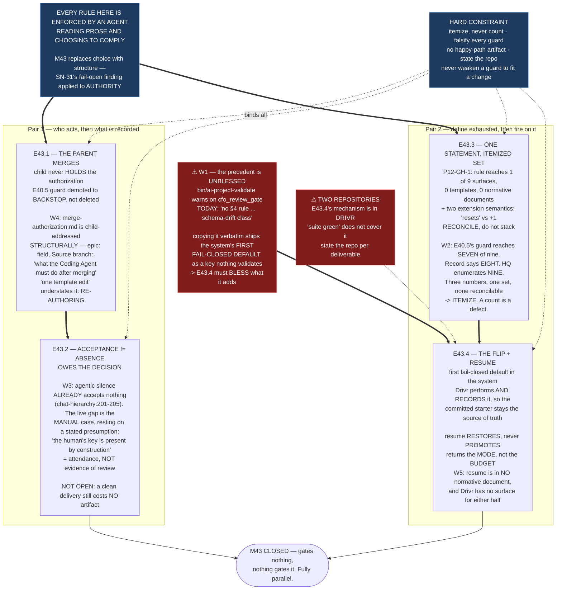

# Milestone M43 — The Acceptance Chain, Made Structural

## Purpose

**Changing who does what, so a bypass class becomes unavailable rather than discouraged.**

Four changes to how acceptance works, and they share one property: **each replaces a behavioural
rule an agent may choose to follow with a structural fact that removes the choice.** The parent
merges, so the child never holds the authorization. Acceptance carries a positive signal, so absence
stops reading as approval. The rework limit exists once, so it cannot be absent from the surface that
needs it. Exhausted rework flips to manual by default — **the first fail-closed default in the
system**, and the direct counterweight to the phase's organizing finding.

This milestone ensures:

- **A child never holds merge authorization**, so `P9-GH-1`/`P10-GH-9`'s bypass class is structurally
  unavailable and E40.5's guard demotes to a backstop.
- **A clean delivery still costs no artifact**, and *reviewed and clean* is nonetheless
  distinguishable from *nobody looked*.
- **One statement governs the rework limit**, reachable from an **itemized** surface set, with a
  single answer to what a written extension grants.
- **Exhausted rework flips the receiving parent to manual**, opt-out, performed and recorded by Drivr,
  with the committed starter still the source of truth.

---

## Problem Statement

Every rule in this framework is enforced by an agent reading prose and choosing to comply. That is
the same insight as SN-31's fail-open finding approached from the other side, and M43 is where it
applies to **authority** rather than to `bin/`.

The concrete failures are recorded. `P9-GH-1` and `P10-GH-9` both describe **a child taking merge
authorization directly and bypassing its parent's Stage-2 review.** E40.5 patched that
**behaviourally** — it taught starter surfaces to push back. **A rule that says "do not simply
comply" still requires the party being bypassed to be the one who objects.** If the parent performs
the merge, the child never holds the authorization at all.

And the rework limit — **the only mechanism bounding rework loops** — reaches **one** of nine
starter-shaped surfaces and **zero** templates, which means it is not delivered to the chat that must
enforce it. That has never failed in practice because every Milestone Chat to date has been manual
and a human noticed the loop. **That supervision is precisely what P12 removes.**

---

## ⚠ Findings measured at planning time — five

**Measured by the Phase Chat on `phase/P12` at `d98f95d`, 2026-08-20** (G2). Verification boundary
stated with each, per `P11-GH-2`.

### W1 — The opt-out precedent M43 is told to copy is an **unblessed key**, and the validator says so

SN-31 Decision 5 directs that the rework-flip switch *"follow `cfo_review_gate: enabled` in
`.ai-project.yml` — the existing precedent for a governance gate that is on by default and disabled
deliberately."* **The design pattern is real. The key is not blessed.**

Run against this repository's own config, 2026-08-20:

```
VALID    .ai-project.yml  —  0 error(s), 1 warning(s)
    [warning] no §4 rule   cfo_review_gate  (line 19)  Unknown top-level key 'cfo_review_gate';
    §4 defines no rule for unknown keys here (schema-drift class, P10-GH-1).
```

`ai-project-yml-spec.md` records the gap explicitly: three unblessed keys live in configs today —
`created_at`, `submodule_path`, `cfo_review_gate` — and *"none of the three is blessed here; the
reference implementation warns and reports them with no rule number, and the gap is escalated."*

**So copying the pattern verbatim adds a second unvalidated top-level key and a second warning**, and
**the switch carrying the system's first fail-closed default would itself be a key nothing
validates.** That is not a fatal objection to the pattern — it is a requirement that **M43 bless the
key it adds**: a §3 schema entry and a §4 rule. **Whether it also blesses `cfo_review_gate` in the
same change is E43.4's decision**, and either answer must be stated rather than left implicit.

*Verified by running `bin/ai-project-validate .ai-project.yml`, and by reading `ai-project-yml-spec.md:609`, repo, 2026-08-20.*

### W2 — `P12-GH-1` reproduces exactly; E40.5's guard reaches **seven** of the nine, and the counts do not reconcile

**`P12-GH-1`, re-measured, holds without correction:**

| | |
|---|---|
| Nine starter-shaped surfaces | `systems/milestone-execution-chat-starter.md` is the **only one** that states the 3-attempt rule (`:330`, `:334`) |
| `systems/hq-execution-chat-starter.md` | 2 occurrences of "rework", **neither states the limit** |
| The other seven surfaces | **zero** |
| `PROJECT-SYSTEM-GUIDELINES.md` / `AI-OPERATING-GUIDELINES.md` | **zero. The rule is not in the normative tier at all** |

**New, and it is why the set must be itemized rather than counted:** E40.5's merge-authorization
pushback — the guard M43 demotes to a backstop — reaches **seven** of the nine surfaces. The two that
do not carry it are `systems/system-hq-seed.md` and `templates/seed.md`, which are seeds rather than
starters. **The record says E40.5 swept "all eight surfaces."** Seven, eight and nine are three
different numbers for one set, and **no two of them can be reconciled from the artifacts.**

**This is exactly why HQ required M43 to itemize.** **E43.3 states its set as a list, and every later
claim cites the list rather than a count.** Counting is what produced the discrepancy.

*Verified by `grep -ci rework` across the nine surfaces plus PSG/AOG, and `grep -rlc` for the E40.5 pushback strings, repo, 2026-08-20. Pattern-based; a surface phrasing the guard differently would not match, which is itself an argument for a list.*

### W3 — The corpus has **already** ruled that agentic silence does not accept. The gap is narrower and sharper than "silence is the sole carrier"

`chat-hierarchy.md:201-205`, already normative:

> *"PSG §11.6's accept-by-silence turns a parent's silence into acceptance. **That model presumes a
> manual instance, where the human's key is present at the session by construction**; the matrix does
> not extend it to an unattended one. **An agentic instance's silence is not the silence §11.6 speaks
> of, and does not by itself accept a delivery.**"*

**So one half of Decision 3's problem is already closed.** The three states it names — *reviewed and
clean*, *never looked*, *the session died* — are not equally live. For an **agentic** parent, silence
already accepts nothing.

**What remains is the manual case, and the corpus names its own load-bearing assumption:** *"the
human's key is present at the session by construction."* **That is a presumption about attendance,
not evidence of review** — and *never looked* and *the session died* are precisely the two ways the
presumption fails while the words stay true.

**E43.2's problem is therefore sharper than the phase spec states it:** not *replace silence*, but
**replace an attendance presumption with a cheap positive signal**, while keeping the property that
makes accept-by-silence worth having — **a clean delivery costs no artifact.** §11.6 already supplies
part of the answer: the merge plus the in-chat acknowledgment is the acceptance record. **The merge
proves something was accepted. It does not prove a review happened.**

*Verified by reading `chat-hierarchy.md:195-232` and `PROJECT-SYSTEM-GUIDELINES.md:561-590`, repo, 2026-08-20.*

### W4 — `merge-authorization.md` is child-addressed **structurally**, not cosmetically. "One template edit" understates it

SN-31 Decision 4 records the known consequence as *"One template edit."* Measured, the template's
**subject** is the child throughout:

- Frontmatter field **`epic: <P#-M#-E#.#>`**, documented as *"The Epic whose branch is authorized to merge"*
- **`Source branch: epic/<E#.#>`**
- A whole section on **what the Coding Agent must do after merging** — delete the branch, produce a
  Delivery Notice
- Its stated purpose: *"the explicit 'you may now merge' signal"* issued **to** an agent

**If the parent performs the merge, this artifact stops being an instruction to a child and becomes
the parent's own record of an act it performed itself.** Its subject, its addressee, its fields and
its post-conditions all move. **That is a re-authoring, and E43.1 should be scoped for one rather
than for an edit.**

*Verified by reading `governance/templates/merge-authorization.md`, repo, 2026-08-20.*

### W5 — Resume is **entirely unwritten**, and Drivr has no surface for either half of Decision 5

**`resume` appears nowhere in `chat-hierarchy.md`** in the Execution Mode sense — the only match is
the word *"presumes"*. The semantics SN-36/37 ratified — **restores, never promotes; returns the mode,
not the budget** — exist in a steering note and in no normative document.

**And Drivr has no mode-flip and no resume surface.** Its packages are `execution`, `judgment`,
`queue`, `scheduling`, `surface`; nothing implements a recorded mode transition.

**So E43.4 is greenfield across two repositories** — normative text here, mechanism there — and its
Drivr half is **outside this repository's suite.** The epic states which repo each deliverable lands
in and how the Drivr side is verified, because "the suite is green" will not cover it.

*Verified by `grep -n resume governance/systems/chat-hierarchy.md` and `ls ~/soft-dev/drivr/drivr/`, repo + Drivr, 2026-08-20.*

---

## Binding Constraints (settled — NOT for re-debate)

1. **The parent performs the merge, not the child** (SN-31 Decision 4). Not re-decidable here.
2. **Accept-by-silence is tweaked, not retired** (Decision 3). **Its cheapness is the property being
   preserved** — a clean delivery must still cost no artifact. **Retiring it is not an option
   available to this milestone.**
3. **Exhausted rework flips the receiving parent to manual — opt-out default** (Decision 5). **Drivr
   performs the flip and records it**, so the committed starter stays the source of truth rather than
   being contradicted by it.
4. **Resume restores, never promotes; returns the mode, not the budget** (SN-36/37). Only an instance
   whose committed starter declares `agentic` may be resumed to agentic.
5. **A written extension grants exactly ONE further attempt** — not a reset. Stricter than
   `systems/milestone-execution-chat-starter.md:334`. **M43 reconciles the two into one statement; it
   does not leave both standing with a citation preferring the newer.**
6. **`chat-hierarchy.md`'s committed-starter invariant survives** (`:225`): *a reader determines any
   instance's Execution Mode by reading its committed starter file.*
7. **Unchanged and confirmed deliberately:** per-instance Execution Mode; **"Mode is not authority"**;
   **PSG §11.6.1** — the CFO is the mandatory diff reviewer and authorization is not review.
8. **M43 is independent of M42 and of the M45/M46 pair.** It gates nothing and nothing gates it.

---

## Hard Constraint (binding — carries to every Epic)

**This milestone changes who holds authority. Every change must be provable from the artifacts, not
from intent.**

- **Itemize, never count.** W2 shows three irreconcilable numbers for one surface set. **Every claim
  about coverage cites a list.** A count in a deliverable is a defect.
- **Prove each guard by falsifying it.** Where a change is machine-checkable, add the check and show
  it fails when the change is reverted.
- **A clean delivery must still cost no artifact.** Any proposal that adds a happy-path artifact has
  misunderstood Decision 3 and fails acceptance.
- **State the repository.** M43 spans this repo and Drivr. **"Suite green" does not cover the Drivr
  half**, and a deliverable that does not say where it lands cannot be verified.
- **State the layer, time and scope of every claim** (`P11-GH-2`) — **and the REF you measured against.**

  > **⚠ A check can be correct and still return different answers to different readers.** Measured
  > 2026-08-21: `git log -1 … -- '<path>' <ref>` places the ref *after* the `--`, so git treats it as a
  > pathspec and falls back to **implicit HEAD**. On a tree checked out at `milestone/M41` it returned
  > a commit; on one at `master` it returned **exit 0 and nothing.** Same command string, two readers,
  > **no error either way.**
  >
  > **And empty is the LUCKY outcome.** Re-run by a third party with a slightly different pathspec,
  > the same defect returned **two different valid-looking commits** — `9940820` from one tree,
  > `b27b4ed` from another. **Nothing was empty and nothing looked wrong.** So the failure has three
  > faces — a plausible wrong answer, an empty result, and a correct one — **and which one a reader
  > gets depends on where they stand, not on what they asked.** You cannot catch this by
  > sanity-checking the output; **only by pinning the ref.**
  >
  > **This is worse than a check that always fails**, because a check that always fails gets noticed.
  > **And this project's sessions share a working directory that moves under them** — which is how a
  > Milestone Chat once committed onto another session's branch.
  >
  > **So: pin the ref explicitly (`origin/<branch>`), put it BEFORE the `--`, never rely on implicit
  > HEAD, and record which ref a measurement was taken against.** A number without a ref is not a
  > measurement.
  >
  > **It was found by two chats each re-running the other's claim** — and each of us first
  > generalized from the single branch we happened to be standing on, in opposite directions.
- **Do not weaken a guard to accommodate a change.** Update it with the same strictness.

---

## Planned Epics

Four epics, in **two independent pairs**. **E43.1 → E43.2**: the acceptance record is a record of an
act E43.1 relocates, so who merges must settle first. **E43.3 → E43.4**: the flip fires on *exhausted
rework*, and it needs one unambiguous definition of "exhausted" before it can be triggered by it.

- **E43.1** — The parent performs the merge *(first of its pair)*
- **E43.2** — Acceptance distinguishable from absence *(after E43.1)*
- **E43.3** — The rework limit: one statement, an itemized set *(first of its pair)*
- **E43.4** — The rework-exhaustion flip, and resume *(after E43.3)*

**Execution posture: `manual` / paid frontier for every epic.** These epics change **who may
authorize what**. An agentic instance editing the rules that govern agentic instances' authority is
the same circularity M42 refuses one tier down. Record `Execution Mode: manual` and
`models.epic_manual` in every Epic Execution Chat Starter.

---

## Epic Detail

### E43.1 — The parent performs the merge *(first of its pair)*

**Deliverables**

1. **The normative statement**, in one place, that **the parent performs the merge of a child's
   branch** — and the corresponding removal of any statement that instructs a child to merge its own.
2. **`governance/templates/merge-authorization.md` re-authored** per W4: subject, addressee, fields
   and post-conditions all move from the child to the parent. **Scope it as a re-authoring, not an
   edit.** The `epic:` field becomes a reference to the branch being merged rather than the party
   being addressed, and the *"what the Coding Agent must do after merging"* section moves to whoever
   now does it.
3. **E40.5's guard explicitly demoted to a backstop, not deleted.** It stays because a rule that has
   become structurally unavailable can still be attempted, and a backstop that fires is evidence. Say
   in the text that it is now a backstop and why.
4. **The itemized list of surfaces that carry merge-authorization language**, and the state of each
   after the change (W2 — **seven** carry E40.5's pushback today; the two seeds do not).
5. **A check** asserting that no starter-shaped surface instructs a child to hold merge
   authorization, with a falsification demonstration.

**Acceptance criteria**

- [ ] One normative statement says the parent merges; no surface contradicts it
- [ ] `merge-authorization.md`'s subject is the parent; no field or section still addresses the child
- [ ] The surface list is itemized, with each surface's post-change state stated
- [ ] E40.5's guard survives, labelled a backstop, with the reason recorded
- [ ] The new check fails when the change is reverted

---

### E43.2 — Acceptance distinguishable from absence *(after E43.1)*

**The design decision this milestone owes, and it is this epic's to make** (phase starter: *pick a
direction, document the reasoning, proceed; do not escalate*).

**W3 narrows the problem and the epic should start from the narrowed form.** Agentic silence already
accepts nothing (`chat-hierarchy.md:201-205`). What remains is the **manual** case, resting on a
stated presumption — *"the human's key is present at the session by construction."* **That is an
assumption about attendance, not evidence of review**, and *never looked* / *the session died* are
exactly how it fails while remaining literally true.

**The question:** what cheap positive signal distinguishes *reviewed and clean* from *nobody looked*?

> **⚠ A FOURTH STATE, ADDED 2026-08-21 FROM A LIVE INSTANCE — AND IT BREAKS THE PRESUMPTION RATHER
> THAN FAILING IT.**
>
> W3's three states assume **one addressee**. **M41 had two authentic Milestone Chat sessions** — the
> boundary is checkable in the commit graph: of **22 commits** touching M41's epic artifacts, **two**
> (`b735182`, `def8ff1`, both 10:35) sit inside a **5h27m gap** in the incumbent's own activity, and
> `b735182`'s subject calls *"my own rotted claim"* a sentence **the other session wrote.**
>
> **Stage-1 duplication cost only duplicated authorship and merged cleanly. Stage 2 is where the
> Milestone Chat holds accept-by-silence.** So:
>
> **A delivery can be accepted by one instance of a role while another instance never hears of it —
> and a non-participating instance's silence is indistinguishable from its deliberate acceptance.**
>
> **That is not a fourth way the presumption fails. It is the presumption being ill-formed.**
> `chat-hierarchy.md:201-205` rests default-accept on *"the human's key is present at the session by
> construction."* **With two sessions holding one role, "the session" does not denote.** E43.2 cannot
> answer *what replaces silence* without saying **whose** silence.
>
> **Scope note, so this does not become a second milestone's problem solved twice:** the **currency**
> half — preventing or detecting two instances of one role — is **M46's**, via `P12-GH-4`'s wider half
> and the CFO's exclusivity framing. **E43.2's half is narrower and does not wait on it:** whatever
> replaces silence must be a signal **some identified party emitted**, not an absence attributed to a
> role. **A positive signal is well-formed under duplication; an absence is not.** Design to that and
> E43.2 is correct whether or not M46 ever lands.
>
> **How the instance was found, because it constrains what a remedy can rely on:** not by any check.
> **A commit message written in the first person about someone else's sentence, plus one participant
> retaining a transcript long enough to say "I did not write that."** A witness, not a mechanism —
> and had either roster turned over first, the record would read as one continuous author.
>
> *Verified by the Phase Chat against `origin/milestone/M41` at `0954707`, 2026-08-21.*

**The constraint that is not open:** **a clean delivery must still cost no artifact.** Decision 3
preserves the cheapness deliberately — it is what stops a parent producing an artifact on every happy
path and keeps every artifact in the corpus a real decision. **Any answer that adds a happy-path
artifact fails.**

**What the epic should weigh, without being limited to it:** §11.6 already makes *the merge plus the
in-chat acknowledgment* the acceptance record, so the gap is narrower than "no record" — **the merge
proves something was accepted, not that a review happened.** The signal may therefore be a property
of the **acknowledgment** rather than a new object.

**Deliverables**

1. **The decision, with the options weighed and the reasoning recorded.**
2. **The normative change** implementing it, in PSG §11.6 and wherever else default-accept is stated.
3. **`chat-hierarchy.md:201-205` reconciled** with the change — it is the passage that already draws
   the manual/agentic distinction, and it must not end up disagreeing with §11.6.
4. **A statement of what the signal does NOT claim.** It distinguishes review-happened from
   nobody-looked; **it does not make the review good.** Overclaiming here would install the same
   confidence-without-grounding that E39.3 recorded.

**Acceptance criteria**

- [ ] A clean delivery still produces **no artifact** — verified against the changed text, not asserted
- [ ] *Reviewed and clean* is distinguishable from *nobody looked* from the record alone
- [ ] The manual/agentic distinction at `chat-hierarchy.md:201-205` agrees with the amended §11.6
- [ ] The reasoning, including rejected options, is committed
- [ ] What the signal does not claim is stated

---

### E43.3 — The rework limit: one statement, an itemized set *(first of its pair)*

**Deliverables**

1. **ONE normative statement of the rework limit**, in a surface that is authoritative rather than
   incidental. **Which surface holds it is this epic's decision** — the phase starter assigns it
   here. **The rule is currently in no normative document at all** (W2), which is the strongest
   argument for the normative tier and not a reason to leave it in a starter.
2. **The two extension statements reconciled into one.**
   `systems/milestone-execution-chat-starter.md:334` says the limit **"resets"**; SN-36/37's
   amendment grants **exactly one further attempt.** **Binding Constraint 5: reconcile into one
   statement. Do not leave both standing with a citation preferring the newer** — that is the drift
   condition, not a resolution of it.
3. **The surface set, ITEMIZED** (W2, and HQ's explicit requirement). Nine surfaces under HQ's
   enumeration; the E40.5 guard reaches seven; the record says eight. **State the list. Every
   coverage claim cites the list.**
4. **Every surface in the list reaching the single statement** — by carrying it or by citing it, and
   the epic states which mechanism it chose and why. **Including all three templates**, which is
   where `P12-GH-1` bites: the template is what a chat is instantiated from.
5. **A check** that fails if a surface in the list neither carries nor reaches the statement, with a
   falsification demonstration. **`P12-GH-1`'s generalization is the real target:** *as long as a
   behavioural rule can live in one starter surface and be authoritative there, every such rule is
   one omission away from being unenforceable, and no test detects the omission.*

**Acceptance criteria**

- [ ] Exactly one normative statement of the limit and of what an extension grants; no surface
      contradicts it
- [ ] The surface set is an itemized list in the deliverable, not a count
- [ ] Every listed surface reaches the statement; the mechanism is stated
- [ ] The check fails when a surface is removed from coverage
- [ ] `P12-GH-1`'s carry-forward note is updated with the outcome

---

### E43.4 — The rework-exhaustion flip, and resume *(after E43.3)*

**Greenfield across two repositories** (W5). State per deliverable which repo it lands in.

**Deliverables**

1. **The opt-out switch in `.ai-project.yml`**, on the `cfo_review_gate` pattern — **on by default,
   disabled deliberately.**
2. **The switch BLESSED in `ai-project-yml-spec.md`** (W1) — a §3 schema entry and a §4 rule.
   **Copying an unblessed key's pattern without blessing the result would ship the system's first
   fail-closed default as a key nothing validates.** **Whether `cfo_review_gate` is blessed in the
   same change is this epic's decision** — state it either way, and if not, say why.
3. **The normative statement of the flip:** exhausted rework flips the **receiving parent** to manual;
   opt-out; **Drivr performs it and records it.**
4. **The committed-starter invariant preserved** (`chat-hierarchy.md:225`). **This is the constraint
   that shapes the whole design:** a runtime flip that left the committed file saying `agentic` while
   the instance ran manual would silently break the invariant that makes mode per-instance.
   **Drivr recording the flip is what keeps the committed record the source of truth rather than
   contradicted by it.**
5. **Resume, specified normatively** (W5 — it exists in no normative document): **restores, never
   promotes** — only an instance whose committed starter declares `agentic` may be resumed to
   agentic; **returns the mode, not the budget** — it does not reset the attempt counter, or the flip
   would make the limit unenforceable by the very control meant to recover from it.
6. **The Drivr-side mechanism**, in Drivr, with **its own verification stated** — this repo's suite
   does not reach it.

**Acceptance criteria**

- [ ] The switch exists, defaults to enabled, and is **blessed** in the yml spec with a §3 entry and a
      §4 rule; `bin/ai-project-validate` reports **no warning** for it
- [ ] The flip is normatively stated, and Drivr performs and records it
- [ ] The committed-starter invariant is intact — a reader can still determine mode from the committed
      starter, and the flip is discoverable from the record
- [ ] Resume is specified: restores, never promotes, does not reset the counter
- [ ] The Drivr half names its repo and its verification; **"suite green here" is not claimed for it**

---

## Prerequisites and Dependencies

**Internal**

- `milestone/M43` branched from `phase/P12` at `d98f95d`.
- Suite baseline **549 passed / 0 failed**, `PYTHONPATH=. pytest -q`. **Bare `pytest` fails collection.**
- **`P12-GH-1`'s carry-forward note** — E43.3's specification, and updated by it.
- **No dependency on M41, M42, M45 or M46**, and none of them depends on M43. It may run entirely in
  parallel.

**External**

- **Drivr at `~/soft-dev/drivr`** — E43.4's mechanism half. **Outside this repository and outside its
  suite.**
- **`bin/ai-project-validate`** — the check E43.4's blessing must satisfy.

---

## Definition of Done (Milestone)

- [ ] All four epics delivered, accepted, and merged to `milestone/M43`
- [ ] **A child never holds merge authorization**; `merge-authorization.md` is the parent's record;
      E40.5's guard survives as a labelled backstop
- [ ] **A clean delivery still costs no artifact**, and acceptance is distinguishable from absence
- [ ] **One statement governs the rework limit and its extension semantics**, reached by every surface
      in an **itemized** list, including all three templates
- [ ] **The flip exists, defaults on, is blessed in the yml spec, and produces no validator warning**
- [ ] **Resume is specified normatively:** restores, never promotes; returns the mode, not the budget
- [ ] The committed-starter invariant is intact
- [ ] Every new check has been shown to fail when its change is reverted
- [ ] **No deliverable states a coverage count in place of a list**
- [ ] Suite green at **549** plus this milestone's additions; the Drivr half's verification stated
      separately
- [ ] Milestone Closure Declaration committed, `is_final: false`

---

## Acceptance Criteria (Milestone)

- [ ] The bypass class `P9-GH-1` and `P10-GH-9` describe is **structurally unavailable**, not merely
      discouraged — a reader can say why a child *cannot* hold the authorization, not why it *should
      not*
- [ ] Every rule this milestone touches exists **once**, and a reader can find the one place
- [ ] **No number in a deliverable stands where a list belongs** (W2's lesson)
- [ ] The first fail-closed default in the system **is itself validated** — the switch is not an
      unblessed key
- [ ] Every claim states the layer, time and scope it was verified at, and the two-repository boundary
      is explicit wherever it applies

---

## Timeline

**Target Start:** 2026-08-20 · **Target Completion:** parallel with M41/M42; gates nothing
**Actual Start:** Not started · **Actual Completion:** In progress

---

## Visual Bindings

**Visual binding**
- **Link:** (inline — Structural diagram; no hosted link needed per AOG §16.3/§16.5)
- **What:** diagram
- **Level:** Milestone
- **State:** proposed



- **Description:** M43's four epics in two independent pairs, against the thesis that every rule here
  is currently enforced by an agent choosing to comply. Five planning-time findings shape the work:
  the opt-out precedent is an **unblessed key the validator warns on today** (W1); `P12-GH-1`
  reproduces exactly and **three irreconcilable counts exist for one surface set**, forcing
  itemization (W2); the corpus has **already** ruled that agentic silence accepts nothing, narrowing
  E43.2 to the manual case and its **attendance presumption** (W3); `merge-authorization.md` is
  child-addressed structurally, making E43.1 a re-authoring rather than an edit (W4); and resume is
  **unwritten normatively** while Drivr has **no surface for either half** of the flip, making E43.4
  greenfield across two repositories (W5). Proposed-track Structural diagram (AOG §16.3/§16.6),
  Mermaid, no ComfyUI.

---

## Notes

- **M43 is the milestone with no gates in either direction, and that is a hazard rather than a
  comfort.** Nothing waits on it, so nothing surfaces if it drifts. Its only forcing function is that
  **P12 cannot close without it.**

- **The one sentence to keep in view across all four epics:** *if the parent merges, the child never
  holds the authorization at all.* Every deliverable here should be testable against the same shape —
  **did this remove a choice, or did it add a rule about how to choose?** A deliverable that only adds
  a rule has done the weaker half.

- **On `P11-GH-1`.** Any amendment to this spec after an Epic Chat has started reaches that chat by:
  amending this file on `milestone/M43` with a changelog row; **notifying the running chat in-session,
  naming the section**; requiring it to re-read and to state in its next delivery that it did; and
  escalating to the Phase Chat if blocking. **Before accepting any delivery, `git log` this spec
  against the epic's branch point.** Two live tests in M41 showed the channel **carries** but has
  never **detected** — and M41's chat added the sharper point: **it has never been tested against an
  amendment that requires a child to stop.** Assume this milestone may supply that test.

- **Authoring order, from M41's experience:** **write the Starter after the spec is committed.**
  Stamping a spec's sha into a starter and then amending the spec produced a dangling citation in
  M41. The fix is ordering, not care.

- **W2's lesson generalizes past this milestone and E43.3 should say so.** Three numbers exist for one
  surface set because each was counted at a different moment against a different pattern, and **a
  count carries none of that context forward while a list carries all of it.** `P12-GH-1`'s
  generalization — *no test detects the omission* — is the target; the itemized list is what makes a
  test possible at all.

## Changelog

| Version | Date | Change |
|---|---|---|
| 1.1.0 | 2026-08-21 | **Adds a fourth state to E43.2 from a live instance, and it breaks W3's presumption rather than failing it.** M41 ran with **two authentic Milestone Chat sessions** — checkable in the graph: 2 of 22 commits on M41's epic artifacts sit in a 5h27m gap in the incumbent's activity, and one calls another session's sentence *"my own rotted claim."* Stage-1 duplication merged cleanly; **Stage 2 is where the role holds accept-by-silence**, so **a delivery can be accepted by one instance while another never hears of it, and a non-participating instance's silence is indistinguishable from deliberate acceptance.** `chat-hierarchy.md:201-205` rests default-accept on *"the human's key is present at the session"* — **with two sessions, "the session" does not denote.** **Scope kept out of M46:** the currency half is M46's; **E43.2's half is that whatever replaces silence must be a signal an identified party EMITTED, never an absence attributed to a role** — well-formed under duplication, which an absence is not. Records that the instance was found by **a witness, not a mechanism.** **No epic added or removed; no ordering, gate or acceptance-criterion change.** |
| 1.0.0 | 2026-08-20 | Initial M43 spec, from the P12 Phase Execution Chat Starter, SN-31 Decisions 3/4/5, SN-36/37's resume and extension semantics, and `P12-GH-1`. **Five planning-time findings**, all measured on `phase/P12` at `d98f95d`: the `cfo_review_gate` opt-out precedent is an **unblessed key** that `bin/ai-project-validate` warns on today, so E43.4 must bless the key it adds or ship the system's first fail-closed default unvalidated (W1); `P12-GH-1` reproduces without correction, and **E40.5's guard reaches seven of nine surfaces against a record saying eight and an enumeration saying nine** — three irreconcilable counts forcing itemization (W2); **`chat-hierarchy.md:201-205` already rules that agentic silence accepts nothing**, narrowing E43.2 to the manual case and its stated **attendance presumption** (W3); `merge-authorization.md` is child-addressed in its subject, fields and post-conditions, making E43.1 a **re-authoring** rather than SN-31's *"one template edit"* (W4); and **resume appears in no normative document** while **Drivr has no surface for either half of the flip**, making E43.4 greenfield across two repositories (W5). Four epics in two independent pairs: E43.1→E43.2, E43.3→E43.4. |
