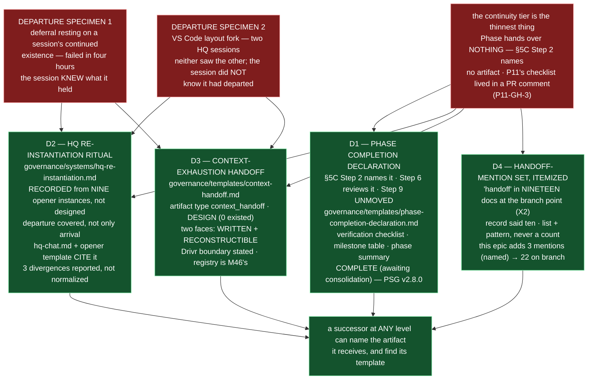

# E44.1 Execution Record — Continuity Artifacts: What Does a Successor Receive?

## Layer, time and scope (`P11-GH-2`)

This record is written on `epic/P12-M44-E44.1`, 2026-09-03, from a worktree whose parent is
`milestone/M44` at `0413caf` (the branch point; `git merge-base epic/P12-M44-E44.1
milestone/M44` returns `0413caf`). Its file claims are about `governance/` documents and the
`.ai-project/artifacts/hq-openers/` evidence, read and measured directly on this branch. It
says nothing about Drivr code, the role registry (M46's), the inter-chat channel
(`P12-GH-4`'s), or `P12-GH-3` (filed unowned, not absorbed).

**This epic adds no tests** — the suite must stay green with the stated invocation and ref.

## Model verification (P9-M31-E31.3 — required, this instance is manual)

Harness-reported model identity: **`opencode/deepseek-v4-flash`**. `.ai-project.yml`
`models.epic_manual`: **`remote:deepseek-v4-flash`** (read from the file at the branch
point, not trusted from the starter). Both present and agree — no mismatch to state.
Proceeding under `advisory` verification (SN-40). The route ambiguity (both `opencode/` and
`opencode-go/` routes resolve deepseek-v4-flash) is the dispatcher's, per the yml's own
comment.

## Backstop re-verification (`P11-GH-1`)

Before relying on any rule this starter restates, ran the backstop against this branch's
point: `git log 0413caf..HEAD -- <governing artifact>` for every artifact this Starter
restates a rule from. At record time **HEAD carries no commits yet** (this record is the
first); the governing artifacts are unchanged since the branch point:

| Artifact checked | `git log 0413caf..HEAD` | Result |
|---|---|---|
| E44.1 epic spec (`P12-M44-E44.1__spec__continuity-artifacts.md`) | empty | unchanged since branch point |
| E44.1 epic execution chat starter | empty | unchanged |
| M44 milestone spec (`P12-M44__milestone-spec.md`) | empty | v1.2.1 is the branch-point state; no further amendment |
| PSG `§5C` / `§11.6` | empty | read at the branch point; amended by this epic (see D1) |
| AOG (v2.11.0) | empty | read at the branch point |
| `creation-chat-guide.md` "Re-instantiation Ritual" (the model) | empty | read at the branch point |

**State of the restated rules:** the rework-limit semantics — 3 attempts plus a written
`+1` (SN-36/37 amendment, stricter than the corpus's "resets", both surfaces cited and the
conflict noted) — is applied here; this delivery is the **first** attempt, no rework is
needed. Merge authorization in force: this Epic opens a PR to `milestone/M44` and stops; it
does not merge; the parent performs the merge (§11.6 / E43.1).

## G2 — the nine and the nineteen re-measured on this branch, not inherited

Re-derived directly against this branch's files (not the milestone spec's figures):

| Fact | Measured value (this branch, `epic/P12-M44-E44.1` at `0413caf`) |
|---|---|
| Opener instances | **nine** in `.ai-project/artifacts/hq-openers/` (`ls` count = 9; verified 2026-09-03) |
| Opener front-matter | `artifact_type: hq_opener` in all nine; `instantiation:` in all nine; `issued_by:` in all nine; `supersedes:` in **seven** of nine; E31.3 Prerequisite Verification in **three** of nine |
| Handoff-mention set | **nineteen** by `git grep -ril 'handoff' 0413caf -- governance/` — the pre-edit corpus; **twenty-two** on this branch after this epic's additions (see D4) |
| Phase-closure template | `governance/templates/phase-closure-declaration.md` exists, untouched (Step 9's product) |
| No handoff template existed | confirmed at the branch point: `governance/templates/` had no handoff artifact type |

**G1 — §5C Step 2 and the openers' salient content, quoted verbatim:**

- PSG §5C Step 2 (branch point, verbatim): *"Phase completion criteria (from the phase
  spec) are evaluated and each verified satisfied"* and *"'Phase P<id> complete' declared
  with a verification checklist and phase summary"* — **no artifact, no path, no template
  named** (the gap `P11-GH-3` records).
- The nine openers' stable provenance line (verbatim from the 2026-08-19 instance): *"To be
  filed verbatim by the HQ Chat session it instantiates, for the artifact record."*
- The nine openers' stable filename and home: `<ISO-date>__hq-chat-opener.md` in
  `.ai-project/artifacts/hq-openers/`.

## D1 — The Phase Completion Declaration (template + §5C Step 2/Step 6 edits)

**Design decision (delegated): the declaration's fields and template.** `COMPLETE
(awaiting consolidation)` status; front-matter carries `phase`, `name`, `status`,
`declared_date`, `declared_by`, `acceptance_model`; the body carries the **verification
checklist**, the **milestone table** and the **phase summary** — the three things that in
P11 lived in a PR comment — plus an optional Visual Bindings section.

- **Template:** `governance/templates/phase-completion-declaration.md` (new) — Step 2's
  product, explicitly **additional, not a relocation**.
- **§5C Step 2** now names it: *"Phase P<id> complete" declared by committing a **Phase
  Completion Declaration** — `docs/phases/P<id>__<Phase_Name>/P<id>__phase-completion-declaration.md`,
  using `governance/templates/phase-completion-declaration.md`, marked `COMPLETE (awaiting
  consolidation)`, carrying the verification checklist, milestone table and phase summary*,
  with the explicit statement that Step 9's declaration and template are **unchanged**.
- **§5C Step 6** now names it as the artifact the delivery review verifies — its checklist
  and milestone table are checked against the phase spec and milestone records.
- **Step 9 is untouched.** `git diff` confirms no change to Step 9 or to
  `governance/templates/phase-closure-declaration.md`.
- **PSG version** bumped `2.7.0 → 2.8.0` with a changelog row.

## D2 — The HQ re-instantiation ritual, recorded

**Design decision (delegated): location and name.** The ritual lives in **one normative
place**: a new system reference, `governance/systems/hq-re-instantiation.md`, titled "HQ
Chat Re-instantiation Ritual". `hq-chat.md` and the opener template **cite** it rather than
restating it.

- **Recorded, not designed.** Five steps (departure close-out; what the close-out must
  include; how to re-open — the most recent opener + the Steering Notes it carries as
  agenda + the most recent Progress Digest; the E31.3 model check; what the new session
  receives), **derived from the nine instances**, plus **departure** (Steps 1–2): a
  departing HQ session leaves behind a committed Progress Digest, its decisions as committed
  artifacts, and its unresolved concerns — and because a session can depart **without
  knowing it** (the fork specimen), the ritual makes **reconstruction from committed state
  alone** the floor, never the hope.
- **Divergences reported, not normalized** (three): `supersedes:` in 7 of 9 (the first two
  instances predate the chain); the E31.3 Prerequisite Verification block in 3 of 9 (the
  first six predate the guardrail on this path); and the body-heading form — four instances
  open with "What You Are", five use the template's `## Project Context` form. Each is
  stated in the ritual's Notes with its instance table; none is edited.
- **Cites wired:** `governance/systems/hq-chat.md` "Standard HQ Chat Opener (Recommended)"
  now opens with a cite to the ritual; `governance/templates/hq-chat-opener.md` carries a
  cite block at the top. Neither restates the steps. `hq-chat.md` carries no version or
  changelog (10 of 15 system documents; P10-GH-8 — none is invented under this adjacent
  edit, the same call E35 made on `chat-hierarchy.md`).

## D3 — The context-exhaustion handoff artifact (type + template + Drivr boundary)

**Design decision (delegated): the handoff's shape, and where the Drivr boundary falls.**
`governance/templates/context-handoff.md` defines the artifact type `context_handoff` in
the template itself (the corpus has no artifact-type registry this belongs to; the protocol
document's `## Artifact Types` is scoped to the parent-child acceptance flow and the
handoff is not one of those).

- **Artifact type:** `context_handoff`, stored at `.ai-project/artifacts/handoffs/`, named
  `<ISO-date>__<chat-id>__context-handoff.md`. A **horizontal/self** artifact — a session's
  own successor — never a substitute for a Delivery Notice and never authorizing,
  accepting, or closing anything (PSG §11.6 stands).
- **Two faces.** The **written** face (a session that can feel the end coming commits the
  template) and the **reconstructible** face (the case that actually occurred: a session
  forked and wrote nothing). The reconstructible face is a procedure — `git log` of the
  branch, the committed execution artifacts, the artifact streams, the `supersedes:`/
  reference chains — so a successor continues from committed state alone.
- **Drivr boundary stated:** harness context tracking is Drivr's and the artifact does not
  assume it — no token counts, no context-usage reports, no live session registry are
  required to write or read it (Drivr's context signal is a trigger for the written face,
  never a requirement). The role registry — what makes a successor *findable* — is M46's;
  this artifact states what a departing session *leaves behind*, and the two do not
  collide.

## D4 — The handoff-mention set, itemized

**Pattern:** `grep -ril 'handoff' governance/` — case-insensitive, files-with-matches,
`governance/` only (the pattern the M44 spec's X2 finding used).

**Measured at the branch point (`0413caf`, the pre-edit corpus) — nineteen documents,
itemized:**

1. `governance/agents/governance.agent.md`
2. `governance/AI-OPERATING-GUIDELINES.md`
3. `governance/diagrams/artifact-flow.md`
4. `governance/diagrams/authority-hierarchy.md`
5. `governance/guides/FAQ.md`
6. `governance/guides/QUICK-START.md`
7. `governance/PROJECT-SYSTEM-GUIDELINES.md`
8. `governance/systems/artifact-communication-protocol.md`
9. `governance/systems/chat-hierarchy.md`
10. `governance/systems/creation-chat-guide.md`
11. `governance/systems/epic-execution-chat-starter.md`
12. `governance/systems/fleet-operator-brief.md`
13. `governance/systems/fleet-operator.md`
14. `governance/systems/start-a-project.md`
15. `governance/templates/epic-execution-chat-starter.md`
16. `governance/templates/genesis.md`
17. `governance/templates/milestone-execution-chat-starter.md`
18. `governance/templates/phase-execution-chat-starter.md`
19. `governance/templates/steering-note.md`

**The nineteen-vs-ten discrepancy (X2) is discharged by listing, never by counting:** the
record's *ten* and this epic's *nineteen* are two different measurements and cannot be
reconciled from the artifacts; every later claim cites this list.

**Fence-awareness and this epic's own delta, stated:** this epic **adds to the set** —
`governance/systems/hq-re-instantiation.md` (new) and `governance/templates/context-handoff.md`
(new) mention "handoff", and `governance/templates/hq-chat-opener.md` (edited to cite the
ritual) now does too. **Measured on this branch: twenty-two.** The nineteen is the pre-edit
corpus (the X2 measurement); the three additions are named, so the next re-measurement is
comparable.

## Suite

`PYTHONPATH=. pytest -q` (bare `pytest` fails collection), run on `epic/P12-M44-E44.1` at
the branch point and on this branch: **741 passed / 0 failed** at both, ~35s. **No delta** —
this epic adds no tests (its DoD has none) and introduces no skip. Re-measured on this
branch. Ref: `origin/milestone/M44` at `0413caf` (branch point).

## Structural diagram (AOG §17.3/§17.6 — Mermaid, in-repo, no ComfyUI)

**Description:** E44.1 answers its organizing question — *what does a successor receive?* —
with three artifacts of two different kinds plus the itemized handoff-mention set: the
Phase Completion Declaration at §5C Step 2 (designed, `P11-GH-3`, the backstop terminus
for deferred phase-spec corrections, Step 9 untouched); the HQ re-instantiation ritual
(**recorded** from nine existing instances, covering departure not only arrival, with its
three divergences reported); and the context-exhaustion handoff (designed, zero templates
existed, with the Drivr boundary stated and reconstruction from committed state alone as
the floor). The handoff-mention set is itemized at the branch point (nineteen) with its
pattern, and this epic's own three additions to the set are named. Proposed-track
Structural diagram (AOG §17.3/§17.6), Mermaid, no ComfyUI.

## Changelog

| Version | Date | Change |
|---|---|---|
| 1.0.0 | 2026-09-03 | Initial record. Executes spec v1.0.0: D1 — `governance/templates/phase-completion-declaration.md` + PSG §5C Step 2/Step 6 edits (Step 9 untouched, PSG 2.7.0→2.8.0); D2 — `governance/systems/hq-re-instantiation.md` recording the ritual from the nine openers, with `hq-chat.md` and the opener template citing it and three divergences reported; D3 — `governance/templates/context-handoff.md` (artifact type `context_handoff`, Drivr boundary stated, reconstructible face); D4 — the handoff-mention set itemized at the branch point (nineteen, pattern stated) with this epic's +3 branch delta named. Suite 741 / 0, no delta, no skip. |
