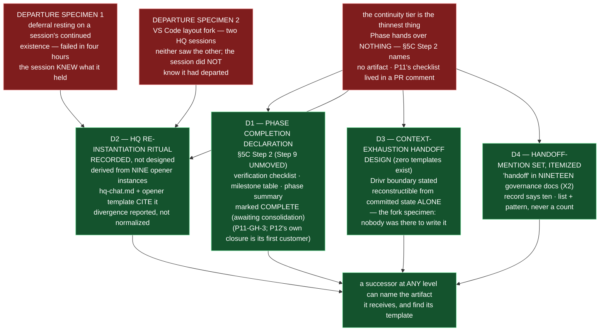

# Epic E44.1 — Continuity Artifacts: What Does a Successor Receive?

## Context

**The continuity tier is the thinnest thing this framework has, and P11 proved it by needing it.** Every
level below Phase hands its successor a closure artifact before its parent's gate. **Phase hands over
nothing** — §5C Step 2 names no artifact, no path and no template, so P11's verification checklist and
phase summary landed in a **PR comment**. HQ is re-opened routinely and the normative tier says nothing
about how; the practice exists (nine committed openers) and is undocumented. A chat that exhausts its
context has no handoff artifact to write. And *"handoff"* appears as prose in **nineteen** governance
documents (X2) and as a template in **none**.

**P12's own closure is `P11-GH-3`'s first customer.** M44 must complete before P12 closes, and closing
P12 without the artifact this epic builds would be a defect against the phase's own product.

**Two of the three artifacts are different kinds of task** (X3), and scoping them as though they were
the same would discard evidence:

- **The HQ ritual is *recording.*** Nine opener instances exist. E44.1 records the convention already
  followed — it does **not** design a new one, and a design that ignores the nine would discard the only
  evidence of what the practice actually is.
- **The handoff artifact is *design.*** There is no handoff template and no handoff artifact type. That
  half is new work, and it is where the Drivr boundary falls.

## Problem Statement

**Three successors — a phase's, an HQ session's, and a context-exhausted chat's — each need something
there is currently no artifact, template, or normative statement for.** Each is SN-33's shape: a thing
that should be recorded is not, and no mechanism notices — the detector was that a person looked.

- **§5C Step 2** says the Phase Chat *"declares `Phase P<id> complete"* with a verification checklist
  and phase summary* — but names no artifact, page, or template for any of it. The declaration is
  unmoved from Step 2 to Step 9; it is simply **absent at Step 2**, where the phase is still open and
  the checklist could act as the terminus for deferred corrections (see Notes).
- **HQ re-instantiation** is practised nine times and written zero. A re-opened HQ session receives
  whatever the departing session happened to have committed — and the two departure specimens below show
  that *"happened to"* is not a plan, and that a session that departs without knowing it cannot be
  relied on to write anything.
- **Context exhaustion** has no handoff. The harness tracks context (Drivr's), but the artifact a chat
  writes when it can feel the end coming — or the state a successor reconstructs — does not exist.

## Goals

By the end of this Epic, the system must:

1. **Land `P11-GH-3`** — a **Phase Completion Declaration at §5C Step 2**, with a template, carrying the
   verification checklist, milestone table and phase summary that in P11 lived in a PR comment.
2. **Record the HQ re-instantiation ritual** in one normative place, derived from the nine instances,
   naming what a re-opened HQ session receives and where openers live — and covering **departure**, not
   only arrival.
3. **Create a context-exhaustion handoff artifact type and template**, with the Drivr-side boundary
   stated.
4. **Itemize the handoff-mention set** (nineteen documents, pattern stated) so the next re-measurement
   is comparable.

## Non-Goals

This Epic explicitly does **not** aim to:

- **Move §5C Step 9.** The Phase-Closure Declaration (`phase-closure-declaration.md`, Step 9's product)
  is unmoved — the new artifact is **additional**, at Step 2, not a relocation (Binding Constraint 1).
- **Design the HQ ritual.** It is **recorded** from nine instances; a discrepancy between the nine and
  the written ritual is a finding, not a bug to fix silently.
- **Design the inter-chat channel.** That is `P12-GH-4`'s unfiled half. Nothing here creates or specifies
  a channel.
- **Design the role registry.** The routing gap (an address change being indistinguishable from a session
  ending) is HQ's placed **M46 input**, owned by Drivr. E44.1 defines what a departing session *leaves
  behind*; the registry is what makes a successor *findable* — those do not collide.
- **Write Drivr code.** The handoff's Drivr boundary is **stated** here, not implemented there.

## Scope of Work

### 1. The Phase Completion Declaration (D1)

Create `governance/templates/phase-completion-declaration.md` and wire §5C Step 2 to name it. The
artifact is marked **`COMPLETE (awaiting consolidation)`** and carries the verification checklist,
milestone table and phase summary. §5C Step 2 names it, Step 6 reviews it, **Step 9 is untouched.**
Its fields and template shape are E44.1's design decision.

**Must include:** the template; the §5C Step 2 edit naming it; the §5C Step 6 review reference; and an
explicit statement that Step 9 and `phase-closure-declaration.md` are unchanged.

### 2. The HQ re-instantiation ritual, recorded (D2)

Document the ritual in **one normative place**, derived from the nine opener instances
(`.ai-project/artifacts/hq-openers/`). It names the committed artifacts a re-opened HQ session receives
and where openers live. `hq-chat.md` and the opener template **cite it rather than restating it.** The
Creation Chat's ritual (`creation-chat-guide.md` "Re-instantiation Ritual", SN-26, E36.3) is the model.

**Must include:** the ritual's location and name (E44.1's decision); a statement of what a **departing**
HQ session leaves behind, not only what an arriving one picks up (the nine openers describe arrival;
the departure specimens below describe what can go wrong when nobody is there to write anything); and —
per the Hard Constraint — any discrepancy between the nine and the written ritual **reported**, not
silently normalized.

### 3. The handoff artifact (D3)

Create a context-exhaustion handoff artifact type and template, with the **Drivr-side boundary stated**
— harness context tracking is Drivr's, and the artifact must not assume it. Something must be
**reconstructible by the arriving session from committed state alone**, because the case that actually
occurred is the one where nobody was there to perform the act.

**Must include:** the artifact type definition; the template; and the explicit Drivr boundary.

### 4. The itemized handoff-mention set (D4)

Itemize the documents that mention *"handoff"* — the pattern is `grep -ril 'handoff' governance/`,
which returns **nineteen** (re-measure on this branch). State the list **and the pattern**, so the next
re-measurement is comparable and the nineteen-vs-ten discrepancy (X2) is discharged by listing rather
than counting.

## Deliverables

- [ ] **D1** — `governance/templates/phase-completion-declaration.md`; §5C Step 2 names it, Step 6
      reviews it, Step 9 untouched
- [ ] **D2** — The HQ re-instantiation ritual recorded in one normative place; `hq-chat.md` and the
      opener template cite it; it matches the nine instances and any divergence is reported
- [ ] **D3** — A handoff artifact type and template, with the Drivr boundary stated
- [ ] **D4** — The handoff-mention set as an itemized list with its pattern
- [ ] Structural diagram (Mermaid, in-repo, no ComfyUI)
- [ ] **Epic Delivery Notice**

## Binding Constraints

Settled above this epic — **not re-decidable here**:

1. **§5C Step 9's declaration is unmoved.** The Phase-Closure Declaration records merge commit, tag and
   head — none of which exist at Step 2. The new artifact is **additional, not a relocation.**
2. **The HQ ritual is recorded, not designed.** Nine instances are the evidence of what it is; a
   discrepancy is reported, not silently fixed.
3. **The handoff-mention set is itemized, never counted** (X2). Every coverage claim cites the list.
4. **`P12-GH-3` is not in this milestone** — the derived-claim convention is filed unowned; do not
   absorb it.
5. **The role registry is M46's, Drivr's.** E44.1 states what a departing session leaves behind; it does
   not build what makes a successor findable.

## Hard Constraint (binding — carried to every Epic)

- **Execution posture: `manual` / paid frontier.** This epic writes the records P12's own closure will
  depend on. **The instance must be manual for the same reason the whole milestone is.**
- **Itemize, never count.** The handoff-mention set is a list; a count in the deliverable is a defect.
- **Fence-awareness is not optional.** Any pass over a normative document (a `grep`, a renumber, a
  cross-reference) must distinguish real content from quoted examples, and state how.
- **Falsify before trusting — in both directions.** X1 was a false positive that survived a naive pattern.
- **Record the practice before improving it.** The HQ ritual is a description of nine existing instances,
  not a design that supersedes them.
- **State the layer, time and scope of every claim** (`P11-GH-2`) **and the REF.**

## Design Decisions Delegated — decide, document, proceed

1. **The Phase Completion Declaration's fields and template** — E44.1's.
2. **Where the HQ re-instantiation ritual lives, and what it names** — E44.1's.
3. **The handoff artifact's shape, and where the Drivr boundary falls** — E44.1's.

## Definition of Done

Epic E44.1 is complete when:

- [ ] `governance/templates/phase-completion-declaration.md` exists; §5C Step 2 names it, Step 6
      reviews it, **Step 9 is untouched**
- [ ] One normative document describes HQ re-instantiation; `hq-chat.md` and the opener template cite
      rather than restate it; **it matches the nine instances, and any divergence is reported**
- [ ] A handoff artifact type and template exist, with the Drivr boundary stated
- [ ] The handoff-mention set is an **itemized list with its pattern**, not a count
- [ ] Suite green — no skip introduced — with the invocation and the ref stated
- [ ] Delivery Notice committed; PR opened to `milestone/M44`

## Acceptance Criteria

- [ ] `governance/templates/phase-completion-declaration.md` exists; §5C Step 2 names it, Step 6
      reviews it, **Step 9 is untouched**
- [ ] One normative document describes HQ re-instantiation; `hq-chat.md` and the opener template cite
      rather than restate it; it matches the nine instances, and any divergence is reported
- [ ] A handoff artifact type and template exist, with the Drivr boundary stated
- [ ] The handoff-mention set is an itemized list with its pattern, not a count
- [ ] Every claim states the layer, time and scope — and the **ref** — at which it was verified

## Technical Constraints

**In scope:** `governance/templates/phase-completion-declaration.md` (new); PSG §5C Step 2 and Step 6
reference edits (Step 9 and `phase-closure-declaration.md` untouched); the HQ ritual's normative home
(E44.1's choice); `governance/systems/hq-chat.md` and `governance/templates/hq-chat-opener.md` (to cite,
not restate, the ritual); the handoff artifact type and template (new); the itemized handoff-mention
list.
**Do not touch:** §5C Step 9 and `phase-closure-declaration.md`; the nine opener instances themselves
(they are **evidence**, read not edited); any Drivr code; the role registry (M46).
**Repository:** `ai-project-system` only. The Drivr boundary is **stated**, not implemented.
**Invocation:** `PYTHONPATH=. pytest -q` — bare `pytest` fails collection. Baseline re-measured on
`milestone/M44`: **740 passed** (cited once here; the milestone spec's `549` is stale).

## Dependencies

**Internal**
- **`P11-GH-3`** (phase closure leaves no artifact) — this epic's resolution, and P12's own closure is
  its first customer.
- **X2 / X3** — measured at planning; E44.1 re-measures and itemizes on this branch.

**External**
- **Drivr** — the handoff artifact's boundary only. No Drivr code is written here.

**Blockers**
- None at planning. (M44 must complete before P12 closes — a hard constraint, not an estimate.)

## Timeline

**Estimated Effort:** 1–2 sessions (three artifacts of two different kinds, plus the itemized list).
**Target Completion:** before P12 closes — **P12's own closure is `P11-GH-3`'s first customer.**
**Actual Completion:** In progress.

## Execution Notes

**Order:**
1. Re-measure the nine opener instances and the nineteen handoff-mention documents on **this branch**
   (G2); do not inherit the spec's figures.
2. Build §5C Step 2's declaration (template + the Step 2/Step 6 reference edits; Step 9 untouched).
3. Record the HQ ritual from the nine instances; wire `hq-chat.md` and the opener template to cite it;
   report any divergence.
4. Design the handoff artifact; state the Drivr boundary.
5. Itemize the handoff-mention set with its pattern.
6. Run the suite; state the invocation and the ref.

**Traps:**
- **Moving Step 9** or folding the new declaration into `phase-closure-declaration.md` — it is
  additional, not a relocation (Binding Constraint 1).
- **Designing** the HQ ritual rather than **recording** it, or silently normalizing a divergence between
  the nine and the written ritual.
- Emitting a **count** instead of the itemized handoff-mention list (X2).
- Assuming the departing session writes the handover — the fork specimen (below) is the case where
  nobody was there to perform the act, so the artifact must be reconstructible from committed state alone.
- Stating a claim against an unpinned ref.

## Related Documents

- [M44 Milestone Spec](P12-M44__milestone-spec.md) — v1.2.1 E44.1 Epic Detail, X1/X2/X3, Hard Constraint,
  Binding Constraints, Notes (departure specimens; backstop terminus; M46 routing gap)
- [P12 Phase Spec](P12__phase-spec.md) — §P12.3, `P11-GH-3`, `P12-GH-4`
- [PSG §5C](governance/PROJECT-SYSTEM-GUIDELINES.md) — Phase Closure (Steps 2, 6, 9)
- [creation-chat-guide.md](governance/systems/creation-chat-guide.md) — the Re-instantiation Ritual
  model (SN-26, E36.3)
- [hq-chat.md](governance/systems/hq-chat.md) — the HQ Chat system reference that will cite the ritual
- [P12-GH-3 carry-forward note](P12__carry-forward-note__P12-GH-3-derived-claim-rot.md) — filed unowned,
  not absorbed
- [PROJECT-SYSTEM-GUIDELINES.md](../../../governance/PROJECT-SYSTEM-GUIDELINES.md)
- [AI-OPERATING-GUIDELINES.md](../../../governance/AI-OPERATING-GUIDELINES.md)

## Visual Bindings

**Visual binding**
- **Link:** (inline — Structural diagram; no hosted link needed per AOG §16.3/§16.5)
- **What:** diagram
- **Level:** Epic
- **State:** proposed

- **Description:** E44.1 answers its organizing question — *what does a successor receive?* — with three
  artifacts of two different kinds: the Phase Completion Declaration at §5C Step 2 (built by design, and
  the backstop terminus for deferred phase-spec corrections); the HQ re-instantiation ritual (recorded
  from nine existing instances, not designed, so the two departure specimens — including a session that
  forked without knowing it had — are accounts the ritual must cover, not dismiss); and the handoff
  artifact (design, zero templates exist, with the Drivr boundary stated). The handoff-mention set is
  itemized, never counted. Proposed-track Structural diagram (AOG §16.3/§16.6), Mermaid, no ComfyUI.

## Notes

- **The two departure specimens break the obvious design, and they are the reason this epic cannot be
  recorded as "the departing session writes a handover."** Specimen 1 is a deferral whose trigger was a
  session's continued existence — it failed in four hours; the session knew what it held and still lost
  it. Specimen 2 is a VS Code layout change that forked a session into two authentic concurrent HQ
  sessions; that session **did not know it had departed**, and its successor could not tell that it had.
  A ritual that assumes the departing session knows it is leaving covers the first and not the second.
  **So the ritual cannot be only an act the departing session performs** — something must be
  reconstructible by the arriving session from committed state alone. The root cause is environmental,
  not a governance failure, and it is recorded because no corpus discipline would have surfaced it.

- **P12's closure must not miss the declaration.** The Phase Completion Declaration is the one artifact
  guaranteed to be written while the phase is still open, which makes it the natural backstop terminus
  for any deferred phase-spec correction (ADOPTED by HQ into M44's scope, 2026-08-20).

- **The routing gap is M46's, not this epic's.** SN-36's *"a blocker makes it escalate and open a chat"*
  presupposes the system knows which chat is which; it does not. E44.1 defines what a departing session
  leaves behind; the role registry that makes a successor findable at all is a prerequisite for
  auto-open and go-to-blocker, and is Drivr's to own. Recorded so E44.1 and M46 do not each solve half.

## Changelog

| Version | Date | Change |
|---|---|---|
| 1.0.0 | 2026-09-03 | Initial E44.1 spec, from M44 milestone spec v1.2.1 E44.1 Epic Detail, X1/X2/X3 and the Notes (departure specimens; backstop terminus; M46 routing gap). Three artifacts of two kinds (recording vs design) plus the itemized handoff-mention list. §5C Step 9 unmoved; the Phase-Closure and Phase-Completion declarations are held distinct. No scope, ordering, gate or acceptance-criterion change from the milestone spec. |
