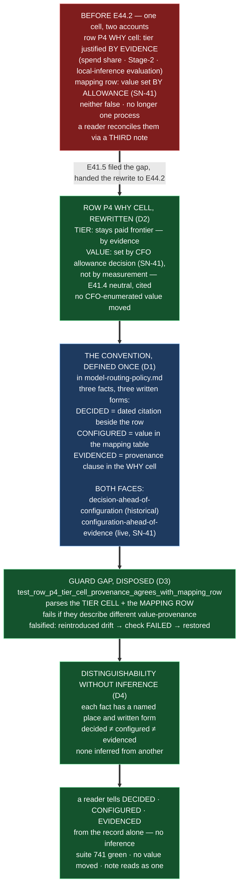

# E44.2 Execution Record — The Decided-vs-Evidenced Convention

## Layer, time and scope (`P11-GH-2`)

This record is written on `epic/P12-M44-E44.2`, 2026-09-03, from a worktree whose parent is
`milestone/M44` at `57b8293` (the branch tip; merge-base verified identical by `git merge-base
epic/P12-M44-E44.2 milestone/M44` returning `57b8293` — 0 commits drift at branch-open). Its file
claims are about `model-routing-policy.md`, `tests/test_model_config.py`, and the artifacts it
authors in this repo, read and run directly on this branch. It says nothing about Drivr, `bin/`,
`chat-hierarchy.md` (E44.3's), `.ai-project.yml` values, or the dispatch lanes — all out of this
epic's scope.

## Model verification (P9-M31-E31.3 — required, this instance is manual)

Harness-reported model identity: **`opencode/deepseek-v4-flash`**. `.ai-project.yml`
`models.epic_manual`: **`remote:deepseek-v4-flash`** (read from the file at the branch point, not
trusted from the starter). Both present and agree — no mismatch to state. Proceeding under
`advisory` verification (SN-40). The route ambiguity (both `opencode/` and `opencode-go/` routes
resolve deepseek-v4-flash) is the dispatcher's, per the yml's own comment.

## Backstop re-verification (`P11-GH-1`, widened form)

Before relying on any rule this starter restates, ran the widened backstop against this branch's
point (`57b8293`): `git log <ref> 57b8293..HEAD` for every artifact this Starter restates a rule
from:

| Artifact checked | `git log 57b8293..HEAD` | Result |
|---|---|---|
| E44.2 epic spec | empty | no amendment reached this branch |
| E44.2 epic execution chat starter | empty | unchanged |
| M44 milestone spec (`P12-M44__milestone-spec.md`) | empty | v1.2.1 is the branch-point state; no further amendment |
| `model-routing-policy.md` | empty | no amendment reached this branch |
| `P12-M41-E41.5__spec__terminal-landing.md` (v2.0.0) | empty | merged on `milestone/M41`; unchanged here |
| `P12-M41-E41.5__record__discharge-and-reconciliation.md` | empty | unchanged |
| PSG / AOG (the versions this record cites) | empty | read at the branch point |

**State of the restated rules:** the rework-limit semantics — 3 attempts plus a written `+1`
(SN-36/37 amendment, stricter than the corpus's "resets") — is applied here with the amendment
cited and the conflict noted; this delivery is the **first** attempt, no rework is needed. The
merge-authorization rule in force is the current one: this Epic opens a PR to `milestone/M44` and
stops; it does not merge; the parent performs the merge (§11.6 / E43.1).

## G2 — the row P4 facts re-measured on this branch, not inherited

Re-derived directly against this branch's files (not the milestone spec's figures):

| Fact | Measured value (this branch, `epic/P12-M44-E44.2` at `57b8293`) |
|---|---|
| Mapping table `milestone` cell | `remote:deepseek-v4-pro` (`model-routing-policy.md:169`) — unchanged from #236 |
| Mapping table `milestone` attribution | *"value set by CFO allowance decision (SN-41), not by measurement"* — present |
| Row P4 `default` cell | `**Paid frontier**` — unchanged (tier, not a value) |
| Row P4 `why` cell (pre-edit) | *"…**Evaluated against local inference 2026-07-31 and not moved** — see the P4 note below."* — an evidential derivation predating the second evaluation |
| The three carried rows | `phase: remote:gpt-5.6-sol`, `milestone: remote:deepseek-v4-pro`, `epic_manual: remote:deepseek-v4-flash` — **all configured** (`.ai-project.yml`, read at branch point) |
| E41.5's note | `### Note on row P4 — reconciled with the SN-41 baseline lineup and E41.4's back-test, 2026-09-01` — present, records the gap, hands the rewrite to E44.2 at `:116-117` |
| E41.4's neutral result | cited in that note (`:91-98`) with the escalation notice path — absolute bar PASS both, relative bar cleared by neither |
| `test_policy_mapping_agrees_with_yml_block` parse | mapping table only — the tier cells sit **outside** its parse (confirmed by reading `tests/test_model_config.py` `_policy_mapping_table`) |

**G1 — the attribution and the handoff, quoted verbatim:**

- The mapping row's attribution, verbatim: *"value set by CFO allowance decision (SN-41), not by
  measurement"* (`model-routing-policy.md:169`).
- E41.5's handoff, verbatim: *"Actually rewriting the row's language to describe an allowance-decided
  value is M44's E44.2 to execute"* (`model-routing-policy.md:116-117`, citing M41 spec v1.6.0).

## D1 — The convention, defined once

Lives in **`model-routing-policy.md`**, section **`## The decided-vs-evidenced convention
(P12-M44-E44.2)`** (after the two row-P4 notes, before the mapping table). The routing policy cites
it by being the file that owns the rows. **Both faces are covered** (itemized, not counted):

- **decision-ahead-of-configuration** — the R6 case, now historical. Written form: the decision
  named beside the row with the state *"value not configured"*, no value in the mapping table until
  it lands. The three carried rows — `phase`, `milestone`, `epic_manual` — are the historical
  instance: decided under R6, configured since SN-41, retained as the case that forced the
  convention, **not as a pending edit**.
- **configuration-ahead-of-evidence** — the SN-41 case, live. Written form: the mapping row carries
  the allowance attribution *"value set by CFO allowance decision (SN-41), not by measurement"*, and
  the tier row's `why` cell says the same — it must not describe an evidential derivation that never
  produced the value. **Row P4 is the worked case.**

The convention states the written form for each of the three facts — **decided** (a dated decision
citation beside the row), **configured** (the value's presence in the mapping table), **evidenced**
(a provenance clause in the `why` cell, or a plain statement that the value was not measured) — and
the reasoning for one place rather than several: a decision and its evidence attach to the **same
row**, and a reader who must read a second document to reconcile them has already lost.

## D2 — Row P4's `why` cell rewritten

The `why` cell now reads (verbatim from `model-routing-policy.md:41`):

> Largest spend share (37% — report §2.2) *and* the level where Stage-2 accept authority lives; same
> mixed-bucket shape as phase (report §3; G4/G7). **The tier stays paid frontier** — evaluated
> against local inference 2026-07-31 and not moved (see the P4 note below). **The value is set by
> CFO allowance decision (SN-41), not by measurement** (mapping row); the one measurement of the
> configured engine (E41.4, 2026-09-01) is neutral toward the decision (see the P4 note below).

**What changed and why:** the two halves are now told apart in the cell itself — the **tier** stays
paid frontier by the original evidential reasoning (spend share, Stage-2 authority, local-inference
evaluation), and the **value** is allowance-decided by CFO decision (SN-41), with E41.4's neutral
result **cited** (not restated) as the one measurement that neither supports nor contradicts it.
Before the rewrite the cell described only an evidential derivation that never produced the
configured value, forcing a reader to reconcile it against the mapping row through a third note.

**No CFO-enumerated value moved:** the `default` cell (`**Paid frontier**`), the mapping table's
`milestone` cell (`remote:deepseek-v4-pro`), and `.ai-project.yml` are untouched. Only row P4's
`why` cell language changed.

**E41.5's note reads as consistent, not competing:** the note is the record that the gap existed;
its handoff sentence — "Actually rewriting the row's language to describe an allowance-decided value
is M44's E44.2 to execute" — is now discharged by exactly that rewrite. The note is **not edited**
(not superseded), and a reader who starts at the note's "DECISION MADE / VALUE CONFIGURED /
MEASURED" trio and reads the rewritten `why` cell meets one account: the tier by evidence, the value
by allowance, the measurement neutral.

## D3 — The guard gap, disposed (guard chosen)

`test_policy_mapping_agrees_with_yml_block` parses the mapping table only; row P4's `why` cell sits
**outside** its parse. The choice was **guard**, not stated-absence, because this is the surviving
substance of the retired "does not perform M41's edit" criterion: the old rule protected the tier
cells by forbidding the edit; performing the edit means the protection must come from somewhere else.

**The guard:** `test_row_p4_tier_cell_provenance_agrees_with_mapping_row`
(`tests/test_model_config.py`), which parses both surfaces — the mapping table's `milestone` row and
the `## Policy rows` tier cell for row P4 — and fails if the tier cell and its mapping row describe
different value-provenance (both must carry the allowance attribution *"set by CFO allowance
decision (SN-41), not by measurement"*).

**Fence-awareness, stated:** the guard parses only table rows (narrow, documented regexes that read
the `## Policy rows` and `## Mapping to` sections and take the first-cell/row shape), never a
whole-file grep — so the same attribution phrase quoted inside the E41.5 note and inside this
record's own quoted cell cannot satisfy it. The parse is proven against the live file, not assumed.

**Falsification (required by the spec):** reintroduced the drift — replaced the rewritten `why`
cell's allowance attribution with the old evidential sentence *"**Evaluated against local inference
2026-07-31 and not moved** (the drift — no allowance attribution)"* — and the guard **failed**
(`AssertionError` on the allowance-attribution presence in the tier cell). Restored the rewrite; the
guard passes. Both states recorded against this branch before commit.

## D4 — Distinguishability without inference

Stated in the convention section (and repeated here): the three facts are distinguishable from the
record alone because each has a stated written form in a named place — a decision is a dated
citation, a configuration is a value present in the mapping table, an evidence claim is a provenance
clause in the `why` cell. **None is inferred from another:** a mapping value present is configured
even if its `why` cell is silent; a `why` cell that says "not by measurement" is an allowance-decided
value even if no ruling is quoted in the same cell.

## Suite

`PYTHONPATH=. pytest -q` (bare `pytest` fails collection), run on `epic/P12-M44-E44.2` at this
record's commit: **741 passed / 0 failed**, ~34s. **Delta from the milestone baseline: +1** — the
D3 guard. Re-measured on this branch: **740 passed / 0 failed** (matches the milestone spec's
re-measured baseline at `e9be27e`). No skips introduced; no test weakened; the one added test is
named, green, and falsified above. Ref: `origin/milestone/M44` at `57b8293` (branch point) → this
branch.

## Structural diagram (AOG §17.3/§17.6 — Mermaid, in-repo, no ComfyUI)

**Description:** E44.2 defines the decided-vs-evidenced convention once, in
`model-routing-policy.md`, covering both faces — decision-ahead-of-configuration (the R6 case, now
historical, the three carried rows retained as the case that forced it) and
configuration-ahead-of-evidence (the SN-41 case, live). It performs the row P4 rewrite E41.5 handed
over: the `why` cell now tells the tier (paid frontier, by evidence) apart from the value
(allowance-decided, E41.4 neutral and cited) — **no CFO-enumerated value moved**. The guard gap
(the tier cells sit outside `test_policy_mapping_agrees_with_yml_block`'s parse) is disposed by a
new guard, falsified by reintroducing the drift, restored to green. The distinguishability
statement is stated without inference. Proposed-track Structural diagram (AOG §17.3/§17.6), Mermaid,
no ComfyUI.

## Changelog

| Version | Date | Change |
|---|---|---|
| 1.0.0 | 2026-09-03 | Initial record. Executes spec v1.0.0: the convention defined once in `model-routing-policy.md` (both faces, D1); row P4's `why` cell rewritten to an allowance-decided account (D2); the guard gap disposed by `test_row_p4_tier_cell_provenance_agrees_with_mapping_row` and falsified (D3); the distinguishability statement stated (D4). Suite 741 / 0. No CFO-enumerated value moved; E41.5's note not superseded. |
