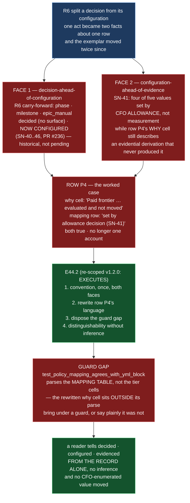

# Epic E44.2 — The Decided-vs-Evidenced Convention

## Context

Since R6, a decision and its configuration are no longer one act. Before R6 this corpus recorded a
decision **by making the edit**; R6 split them, and the split bit immediately — `phase`, `milestone`
and `epic_manual` became decided (carry-forward) and unconfigured (no surface) on a trigger with no
expiry.

**The premise has since inverted, and the epic is re-scoped accordingly** (M44 spec v1.2.0, Phase
Chat amendment 2026-09-03). M41's E41.5 was written assuming **it performs the row edit and M44 only
specifies the convention**. E41.5 landed first (2026-09-01) and **declined the rewrite**, filing a
bounded note beside row P4 and handing the work over in the file itself: *"Actually rewriting the
row's language to describe an allowance-decided value is M44's E44.2 to execute"*
(`model-routing-policy.md:116-117`, citing M41 spec v1.6.0). **M41 is closed and E41.5 is merged —
there is no epic left to reach into.**

The exemplar moved with the premise. The three "carried rows" are no longer unconfigured: `phase:
remote:gpt-5.6-sol`, `milestone: remote:deepseek-v4-pro`, `epic_manual: remote:deepseek-v4-flash`
(SN-40..46, PR #236, `master` `3222f50`). **The live state the convention must name is a different
one — *configured but not evidenced* —** because SN-41 set four of five mapped values by **CFO
allowance decision, not by measurement**, while row P4's `why` cell still describes an evidential
derivation that no longer applies.

## Problem Statement

**The record cannot tell a decision, a configuration, and an evidence claim apart — and no guard
reaches the place where the drift occurs.**

The failure mode is precise: a reader assumes the file matches the ruling. That is the divergence the
three guards in `tests/test_model_config.py` exist to catch, **arriving instead in the prose, where no
guard reaches** — `P12-GH-3`'s shape at the configuration layer.

Two faces of the one defect, and E44.2 must cover both:

1. **Decision-ahead-of-configuration** (the R6 case that forced the convention, now historical). A row
   is decided but its value has not landed. Nothing in the record says so; a reader infers it either
   way.
2. **Configuration-ahead-of-evidence** (the SN-41 case, live). A row's value is configured **and** its
   provenance is an allowance decision, not a measurement — while the row's `why` cell describes a
   measurement path that never produced the value. **Row P4 is the worked case**: its `why` cell still
   justifies *"Paid frontier"* by spend share and Stage-2 accept authority and *"evaluated against
   local inference 2026-07-31 and not moved"*, while its mapping row says the value is *"set by CFO
   allowance decision (SN-41), not by measurement."*

**Neither statement is false; together they no longer describe one thing.** The defect is a record
that forces a reader to reconcile two accounts by reading a third note (`model-routing-policy.md:72-118`)
instead of reading the row.

## Goals

By the end of this Epic, the system must:

1. **Define the convention once** — what is written, where, and how a reader distinguishes a decision
   from a configuration from an evidence claim — **covering both faces**, or naming which it covers and
   why.
2. **Perform the row P4 rewrite** — change row P4's language so it describes an **allowance-decided**
   value, discharging the handoff E41.5 filed at `model-routing-policy.md:116`. **No CFO-enumerated
   value moves**; the SN-41 lineup stands exactly as landed.
3. **Dispose the guard gap, not inherit it** — the rewritten tier cell sits outside
   `test_policy_mapping_agrees_with_yml_block`'s parse; the rewrite is either brought under a guard or
   the epic states plainly that it was not, and why.
4. **State what makes the two facts distinguishable without inference** — since inference is the
   failure mode, not an optional convenience.

## Non-Goals

This Epic explicitly does **not** aim to:

- **Move any CFO-enumerated value.** The SN-41 lineup (`phase`, `milestone`, `epic_dev`, `epic_qa`,
  `epic_manual`, `creation`, `hq`) stays exactly as landed. E44.2 rewrites **row P4's language**, not a
  value. Changing an enumerated value is an escalation, not this epic.
- **Re-open or re-close row P4.** The CFO's closure stands as HQ recorded it (2026-08-19, Decision 15);
  the mapping table's `milestone` cell stays at what #236 landed.
- **Supersede E41.5's note at `:72-118`.** That note is the record that the gap existed; the rewrite
  closes it, and the two must read as one account, not competing ones.
- **Absorb `P12-GH-3` (derived-claim rot).** It remains filed unowned. E44.2's convention is about
  *decided vs configured vs evidenced* on **rows whose values are named** — not about marking derived
  prose claims, which is the different, excluded defect.
- **Touch the dispatch lanes, `bin/`, `chat-hierarchy.md`'s mapping, or Drivr.** This epic lands in
  `ai-project-system` only.

## Scope of Work

### 1. The convention, defined once (D1)

Define how a row records its three facts — **decided**, **configured**, **evidenced** — such that a
reader can tell any state from the record alone. State where the convention lives (one place the
routing policy can cite) and what form each face takes:

- **decision-ahead-of-configuration** — a decision recorded while its value is still pending;
- **configuration-ahead-of-evidence** — a value recorded as landed by allowance, with its evidential
  claim (or its absence) stated rather than implied.

**Must include:** the exact written form for each state; the location; and the reasoning for one place
rather than several.

### 2. The row P4 rewrite, performed (D2)

Rewrite row P4's `why` cell so it describes an **allowance-decided** value, consistent with its mapping
row's existing *"set by CFO allowance decision (SN-41), not by measurement."* The rewrite must make
E41.5's note at `:72-118` read as **consistent with** the row, not as a competing account. The three
carried rows are retained in the record as the historical case that forced the convention, not as a
pending edit.

**Must include:** the edited `why` cell; a statement of what changed and why; and a citation of E41.4's
neutral result rather than a restatement of it (the one measurement of `deepseek-v4-pro` neither
supports nor contradicts the allowance decision).

### 3. The guard disposal (D3)

`test_policy_mapping_agrees_with_yml_block` parses the mapping table only; the tier cells (row P4's
`why`) sit outside its parse. E44.2 either **brings the rewritten language under a guard** (a check
that fails if the tier cell and its mapping row describe different value-provenance) **or states
plainly that it did not, and why.** This is the surviving substance of the retired *"does not perform
M41's edit"* criterion: the old rule protected the tier cells by forbidding the edit; performing the
edit means the protection must now come from somewhere else.

**Must include:** the decision (guard vs. stated-absence), with its reason; if a guard, its
falsification demonstration (reintroduce the drift → check fails).

### 4. The distinguishability statement (D4)

State what makes the two facts distinguishable **without inference** — since a reader who must infer a
row's state is the failure mode being eliminated.

## Deliverables

- [ ] **D1** — The convention, defined once, with the written forms and the location stated
- [ ] **D2** — Row P4's language rewritten to describe an allowance-decided value; E41.5's note reads
      as consistent with it
- [ ] **D3** — The guard gap disposed: rewritten language under a guard, or a plain statement that it
      was not and why
- [ ] **D4** — The distinguishability-without-inference statement
- [ ] Structural diagram (Mermaid, in-repo, no ComfyUI)
- [ ] **Epic Delivery Notice**

## Binding Constraints

Settled above this epic — **not re-decidable here** (M44 spec v1.2.0):

1. **E44.2 EXECUTES the row P4 rewrite.** E41.5 landed first and handed it over in the file. There is
   no epic left to reach into.
2. **No CFO-enumerated value moves.** The SN-41 lineup stands exactly as landed. E44.2 rewrites the
   **row's language**, which is record-shaping — M44's subject. Changing an enumerated value escalates.
3. **The three carried rows are historical, not pending.** They are configured; they exemplify the
   decision-ahead-of-configuration face retroactively, not as an open edit.
4. **E41.5's note at `:72-118` is not superseded.** It records that the gap existed; the rewrite closes
   it, and the two must read as one account.
5. **The guard gap is disposed, not inherited** — brought under a guard or a plain statement that it
   was not, and why.
6. **The convention covers both faces** — decision-ahead-of-configuration and
   configuration-ahead-of-evidence — or names which it covers and why.

## Hard Constraint (binding — carried to every Epic)

- **Execution posture: `manual` / paid frontier.** This epic writes a convention the routing policy
  will cite, and rewrites the record of a CFO decision. **The instance must be manual for the same
  reason the whole milestone is.**
- **Itemize, never count.** Where a set is named (e.g. the rows the convention covers), state the list
  and the pattern, not a count.
- **Fence-awareness is not optional.** Any pass over a normative document (a grep, a renumber, a
  cross-reference) must distinguish real content from quoted examples. State how the distinction was
  made.
- **Falsify before trusting — in both directions.** A naive pattern that returns a plausible answer is
  as dangerous as one that returns zero. Prove the guard by falsifying it.
- **Record the practice before improving it.** E41.5 already recorded *"beside the row, per the file's
  own convention"* and enumerated what it left alone. Where a convention already exists in the artifact
  record, the deliverable describes what exists before changing it.
- **State the layer, time and scope of every claim** (`P11-GH-2`) — **and the REF** it was measured
  against. A number without a ref is not a measurement.

## Design Decisions Delegated — decide, document, proceed

1. **The form of the convention** (what is written, where) — E44.2's, **provided a reader can
   distinguish the two facts without inferring either from the other.**
2. **Guard vs. stated-absence** for the rewritten tier cell (D3) — E44.2's, provided the choice is
   documented with its reason and, if a guard, falsified.

## Definition of Done

Epic E44.2 is complete when:

- [ ] The convention is stated **once**, in a place the routing policy can cite, covering **both faces**
      (or naming which it covers and why)
- [ ] Row P4's language describes an **allowance-decided** value; a reader can tell decided from
      configured from evidenced **from the record alone, without inference**
- [ ] E41.5's note at `:72-118` reads as **consistent with** the row, not as a competing account
- [ ] The guard gap is disposed — under a guard, or a plain statement that it was not and why — with a
      falsification if a guard was added
- [ ] No CFO-enumerated value moved
- [ ] Suite green — no skip introduced — with the invocation and the ref stated
- [ ] Delivery Notice committed; PR opened to `milestone/M44`

## Acceptance Criteria

- [ ] A reader can tell a decided-and-configured row from a decided-and-pending one, and a configured
      value from an evidenced one, **from the record alone, without inferring either from the other**
- [ ] The convention is stated once, in a place the routing policy can cite
- [ ] Row P4's language describes an allowance-decided value, and E41.5's note at `:72-118` reads as
      consistent with it rather than as a competing account
- [ ] The guard gap is disposed, not inherited — brought under a guard, or a plain statement that it
      was not and why
- [ ] The convention covers both faces — decision-ahead-of-configuration and
      configuration-ahead-of-evidence — or names which it covers and why
- [ ] Every claim states the layer, time and scope — and the **ref** — at which it was verified

## Technical Constraints

**In scope:** `model-routing-policy.md` (row P4's `why` cell and the convention's home); the convention's
normative location (its own choice, in a place the routing policy cites); the guard under `tests/` if
the D3 decision is "guard"; the Epic Delivery Notice.
**Do not touch:** the mapping table's value cells (they stay at what #236 landed); any
CFO-enumerated value in `.ai-project.yml`; `chat-hierarchy.md`'s mapping (E44.3's); the dispatch lanes;
`bin/`; `~/soft-dev/drivr`.
**Repository:** `ai-project-system` only. Nothing crosses to Drivr.
**Invocation:** `PYTHONPATH=. pytest -q` — bare `pytest` fails collection. **Baseline re-measured on
`milestone/M44` at `e9be27e`: `740 passed`** — the milestone spec's `549` was written before
M41/M42/M43 landed their test additions; cite the re-measured number.

## Dependencies

**Internal**
- **M41 is closed; E41.5 is merged.** The rewrite is handed over, not coordinated. Nothing waits.
- **E44.2 is FIRST** of M44's six (externally ordered); the other five are parallel-safe and do not
  gate it.

**External**
- None. This epic does not cross repositories.

**Blockers**
- None at planning. (The former external deadline — *deliver before E41.5 lands* — is **spent**; see
  Notes.)

## Timeline

**Estimated Effort:** 1 session.
**Target Completion:** first of M44's six; no external deadline remains.
**Actual Completion:** In progress.

## Execution Notes

**Order:**
1. Re-measure the row P4 facts on **this branch** and itemize them — do not inherit the milestone
   spec's figures (G2). Confirm the three carried rows are configured, and the mapping row's
   *"set by allowance decision"* attribution, against `model-routing-policy.md` and `.ai-project.yml`.
2. Define the convention (both faces), and its location.
3. Rewrite row P4's `why` cell; confirm E41.5's note at `:72-118` reads as consistent.
4. Dispose the guard gap: add a guard (and falsify it) or state the absence plainly.
5. Write the distinguishability statement.
6. Run the suite; state the invocation and the ref.

**Traps:**
- Emitting a coverage **count** — the set of rows/faces is a list, not a number.
- Moving a **CFO-enumerated value** while intending only to rewrite language — the two are easy to
  blur, and only the language is in scope.
- Making E41.5's note read as a **competing account** rather than the record the rewrite closes.
- Stating a claim against an unpinned ref — put the ref **before** the `--` and name `origin/<branch>`.
- Treating the guard gap as optional — it is a binding criterion (D3), disposed or stated, never left.

## Related Documents

- [M44 Milestone Spec](P12-M44__milestone-spec.md) — v1.2.0 E44.2 Epic Detail (the amendment), Binding
  Constraints, Hard Constraint
- [M41 Milestone Spec](P12-M41__milestone-spec.md) — v1.6.0 changelog 2.0.0 (E41.5 narrowed; the
  rewrite handed to E44.2)
- [E41.5 Spec](P12-M41-E41.5__spec__terminal-landing.md) — v2.0.0 D-A (row P4 reconciled "beside the
  row")
- [model-routing-policy.md](.ai-project/artifacts/reference/token-measurement/model-routing-policy.md) —
  row P4, its two notes, and the mapping table this epic edits
- [R6 ruling](.ai-project/artifacts/rulings/2026-08-20__ai-project-system-hq__ruling__r6-manual-verification-surface-rule.md) —
  the decision/configuration split that forced the convention
- [SN-40..46 ruling](.ai-project/artifacts/rulings/2026-08-27__ai-project-system-hq__ruling__sn40-46-baseline-lineup-and-the-switching-ratchet.md) —
  the allowance-decided lineup, #236
- [PROJECT-SYSTEM-GUIDELINES.md](../../../governance/PROJECT-SYSTEM-GUIDELINES.md)
- [AI-OPERATING-GUIDELINES.md](../../../governance/AI-OPERATING-GUIDELINES.md)

## Visual Bindings

**Visual binding**
- **Link:** (inline — Structural diagram; no hosted link needed per AOG §16.3/§16.5)
- **What:** diagram
- **Level:** Epic
- **State:** proposed

- **Description:** E44.2 defines the decided-vs-evidenced convention once and performs the row P4
  rewrite that M41's E41.5 handed over. The failure mode is a record that cannot tell a decision from a
  configuration from an evidence claim apart, arriving in the prose where the divergence guards do not
  reach. Two faces must both be covered: decision-ahead-of-configuration (the R6 carry-forward, now
  historical) and configuration-ahead-of-evidence (SN-41's allowance-decided lineup, live). The rewrite
  lands only on **row P4's language** — no CFO-enumerated value moves — and the guard gap (the tier
  cells sit outside `test_policy_mapping_agrees_with_yml_block`'s parse) is disposed, not inherited.
  Proposed-track Structural diagram (AOG §16.3/§16.6), Mermaid, no ComfyUI.

## Notes

- **This epic is the milestone's worked answer to "a decision and its configuration are two facts about
  one row."** The corpus had never had to hold them apart until R6 made it unavoidable; E41.5 then held
  them apart *informally* (decision made ≠ value configured ≠ measured, in a note) and handed the
  **notation** to E44.2. The deliverable is not the insight — the insight is already in `:72-118` — it
  is the **convention** that makes the insight readable from the row alone.

- **Why "read from the row alone" is the bar.** The defect is not that the corpus lacks the words
  *"allowance-decided"*; it is that a reader must read a third note to reconcile two cells the reader
  was already looking at. Inference is the failure mode, so the acceptance criterion is inference-free
  distinguishability, not the presence of the words.

## Changelog

| Version | Date | Change |
|---|---|---|
| 1.0.0 | 2026-09-03 | Initial E44.2 spec, from M44 milestone spec **v1.2.0** (the Phase Chat's E44.2 amendment — the premise inverted, E44.2 **executes** the row P4 rewrite). E41.5 landed first and handed the rewrite over in the file; the three carried rows are now configured and retain only the historical face; the live state is *configured but not evidenced* (SN-41). Deliverables: the convention (both faces), the row P4 rewrite, the guard-gap disposal, and the distinguishability statement. **No CFO-enumerated value moves.** |
