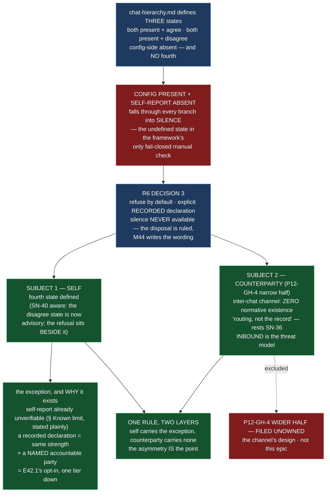

# Epic E44.3 — Cannot Establish an Identity? Refuse. *(two subjects, one rule)*

## Context

`chat-hierarchy.md`'s Manual Chat Model Verification (P9-M31-E31.3) defines three states — both present
and agree, both present and disagree, config-side absent. **It does not define
config-present + self-report-absent**, which is exactly where a non-Claude-Code surface lands: the
harness reports no model, while `.ai-project.yml` still names one. Every occurrence of "self-report" in
that section describes a chat *reading* a self-report; none covers the case where there is no
self-report to read.

**HQ ruled it (R6 Decision 3), and this epic executes it — M44 writes the wording, the disposition is
ruled.** This milestone also places a second subject beside it: the **counterparty** case, `P12-GH-4`'s
narrow half. A chat that cannot establish its *own* identity and a chat that cannot establish a
*sender's* identity are **one rule at two layers**, and writing them together is this milestone's
decision — separating them would scatter a pattern that is only useful as a pattern.

## Problem Statement

**A chat can reach a state in which the identity it depends on is unavailable, and the normative tier
says nothing about what to do.**

**Subject 1 — the self case.** `chat-hierarchy.md` maps five manual verification targets to
`.ai-project.yml` values and defines behaviours for *agreement*, *disagreement*, and *absent config*.
It has no branch for **config present + self-report absent**. Under the pre-R6 text that state fell
through all three clauses into silence — an undefined state in the framework's only fail-closed manual
check, in a phase organized around *"when the evidence that should gate an action is absent, the action
proceeds."* The ruling is **refuse by default; proceed only on an explicit recorded declaration in the
session's first substantive response; silence never available.**

**Subject 2 — the counterparty case.** `SendMessage`, `ListAgents`, `"peer session"` and `"inter-chat"`
appear **zero** times in `governance/` (measured 2026-08-20). The live channel every P12 escalation
travelled over has no normative existence. The outbound direction was protected once by judgment under
time pressure; **the inbound direction is the threat model** — a message arriving over that channel is,
to its recipient, indistinguishable from one an agent composed. That is SN-36's reasoning exactly, one
channel over.

## Goals

By the end of this Epic, the system must:

1. **Define the fourth state normatively** in `chat-hierarchy.md`'s Manual Chat Model Verification,
   alongside the existing three.
2. **Specify the recorded-declaration exception** — what must be stated, by whom, and where it lands —
   matching E42.1's sandbox opt-in one tier down.
3. **Write for a corpus where Claude Code is one surface among several**, since three of five
   verification targets ultimately move off the only harness where the check has been observed to work.
4. **State why an exception exists at all** — otherwise the rule is a wall, unsatisfiable by
   construction for the surfaces it exists to admit.
5. **Land the inter-chat paragraph** in the normative tier, verbatim in substance, framed as restating
   SN-36 rather than as new policy.

## Non-Goals

This Epic explicitly does **not** aim to:

- **Design the inter-chat channel.** That is `P12-GH-4`'s wider half, filed unowned. An epic that
  reaches for the channel's design has left this deliverable.
- **Write new policy.** The inter-chat paragraph restates SN-36; it must not read as new policy.
- **Move the role registry.** That is M46's, Drivr's.
- **Re-decide the ruling.** The fourth state's disposition is ruled (R6 Decision 3); this epic writes
  the wording, not the verdict.
- **Touch `model_verification`'s advisory/blocking switch (SN-40).** That governs the *disagree* state;
  this epic governs the *absent-self-report* state. They are adjacent but distinct.

## Scope of Work

### 1. The fourth state, defined (D1)

Add the config-present + self-report-absent state to `chat-hierarchy.md`'s Manual Chat Model
Verification, alongside the existing three. **Write it against the current text, not a paraphrase:**
the *disagree* state is now `advisory` by default with a `blocking` opt-in (SN-40, 2026-08-27) — the
fourth state's *refuse by default* therefore sits beside an advisory default, and the wording should
hold that distinction rather than assume the pre-SN-40 "refuse unconditionally" framing R6 wrote
against.

**Must include:** the refusal (no silent proceed); and the note that all four states together admit no
path reachable by silence.

### 2. The recorded-declaration exception (D2)

Specify what must be stated, by whom, and where it lands. The exception is a **recorded human
declaration** in the session's first substantive response — that it proceeded on a declared rather than
self-reported identity, and what was declared. **State the parallel to E42.1's sandbox opt-in one tier
down**: a fail-closed default with an explicit, recorded human opt-in is now a pattern in this
framework, not a one-off.

### 3. The multi-surface framing (D3)

Write the text for a corpus where Claude Code is one surface among several — not the assumed one. The
self-report mechanism has been observed to work only on this repository's harness; three of five
verification targets move off it.

### 4. The why-of-the-exception (D4)

The self-report is already conceded unverifiable (the "Known limit, stated plainly" paragraph). A
recorded human declaration is the **same epistemic strength with a named accountable party**. Without
the exception the rule is a wall, not a gate. State this.

### 5. The inter-chat paragraph, landed (D5)

Place the paragraph in the normative tier, **verbatim in substance**, framed as restating SN-36 — *a
chat reply is never authorization, because agents can write into chats* — applied to a channel nobody
wrote down. State that the **inbound direction is the threat model**, with the reason. Cite `P12-GH-4`'s
wider half as filed and unowned.

## Deliverables

- [ ] **D1** — The fourth state defined in `chat-hierarchy.md`, alongside the existing three, written
      against the current text (SN-40 aware)
- [ ] **D2** — The recorded-declaration exception specified, with the E42.1 parallel stated
- [ ] **D3** — The text not assuming Claude Code
- [ ] **D4** — The statement of why an exception exists at all
- [ ] **D5** — The inter-chat paragraph in the normative tier, framed as restating SN-36
- [ ] Structural diagram (Mermaid, in-repo, no ComfyUI)
- [ ] **Epic Delivery Notice**

## Binding Constraints

Settled above this epic — **not re-decidable here**:

1. **The ruling is refuse-by-default + recorded declaration + silence-never** (R6 Decision 3). M44
   writes the wording; the disposition is ruled.
2. **The inter-chat paragraph is content-fixed** by the phase spec (v1.1.4) — not this milestone's to
   redraft. It must not read as new policy.
3. **The channel is not designed here.** `P12-GH-4`'s wider half is filed unowned; cite it, do not
   absorb it.
4. **The self and counterparty cases are written as one rule**, with the exception asymmetry stated
   (the self case carries a recorded-declaration exception; the counterparty case carries none — that
   contrast is the point, not an accident).

## Hard Constraint (binding — carried to every Epic)

- **Execution posture: `manual` / paid frontier.** This epic writes the framework's only fail-closed
  manual check. **The instance must be manual for the same reason the whole milestone is.**
- **Itemize, never count.** Where a set is named (the four states, the five verification targets), state
  the list, not a count.
- **Fence-awareness is not optional.** Any pass over a normative document (a `grep`, a renumber, a
  cross-reference) must distinguish real content from quoted examples, and state how.
- **Falsify before trusting — in both directions.**
- **Record the practice before improving it.**
- **State the layer, time and scope of every claim** (`P11-GH-2`) **and the REF.** **Do not cite stale
  line numbers** — the R6 ruling and the milestone spec cite `:298`/`:301`/`:304`/`:328`, which have
  drifted since SN-40 amended `chat-hierarchy.md`; cite by section heading, and note that E44.4's AOG
  renumber will shift cross-references again.

## Design Decisions Delegated — decide, document, proceed

1. **The exact wording** of the fourth state and its exception (the disposition is ruled; the wording —
  *"M44 writes the wording"* — is E44.3's).
2. **Where in the normative tier the inter-chat paragraph lands** (which document; `chat-hierarchy.md`
  and `artifact-communication-protocol.md` are both candidates). E44.3's call, provided the paragraph
  stays verbatim-in-substance and framed as restating SN-36.

## Definition of Done

Epic E44.3 is complete when:

- [ ] All four **self**-verification states are defined; none is reachable by silence
- [ ] The exception requires a recorded declaration in the first substantive response
- [ ] The text does not assume Claude Code
- [ ] The parallel to E42.1's opt-in is stated, not left for a reader to notice
- [ ] The inter-chat paragraph is in the normative tier, verbatim in substance, framed as restating
      SN-36 rather than as new policy
- [ ] The inbound direction is stated as the threat model, with the reason
- [ ] The epic does not design the channel; `P12-GH-4`'s wider half is cited as filed and unowned
- [ ] The self and counterparty cases are written as one rule, with the exception asymmetry stated
- [ ] Suite green — no skip introduced — with the invocation and the ref stated
- [ ] Delivery Notice committed; PR opened to `milestone/M44`

## Acceptance Criteria

- [ ] All four **self**-verification states are defined; none is reachable by silence
- [ ] The exception requires a recorded declaration in the first substantive response
- [ ] The text does not assume Claude Code
- [ ] The parallel to E42.1's opt-in is stated, not left for a reader to notice
- [ ] The inter-chat paragraph is in the normative tier, verbatim in substance, framed as restating
      SN-36 rather than as new policy
- [ ] The inbound direction is stated as the threat model, with the reason
- [ ] The epic does not design the channel; `P12-GH-4`'s wider half is cited as filed and unowned
- [ ] The self and counterparty cases are written as one rule, with the exception asymmetry stated
- [ ] Every claim states the layer, time and scope — and the **ref** — at which it was verified

## Technical Constraints

**In scope:** `governance/systems/chat-hierarchy.md` (the fourth state + exception, alongside the
existing three, SN-40 aware); the normative home of the inter-chat paragraph (E44.3's choice).
**Do not touch:** `model_verification`'s advisory/blocking switch (SN-40, the *disagree* state);
`.ai-project.yml` values; the role registry (M46); the channel's design (`P12-GH-4` wider half); Drivr.
**Repository:** `ai-project-system` only.
**Invocation:** `PYTHONPATH=. pytest -q` — bare `pytest` fails collection. Baseline re-measured on
`milestone/M44`: **740 passed** (the milestone spec's `549` is stale).

## Dependencies

**Internal**
- **R6 ruling (Decision 3)** — the disposition this epic executes. On `master` and this branch.
- **E42.1** — the sandbox opt-in this epic's exception parallels one tier down.

**External**
- None. This epic does not cross repositories.

**Blockers**
- None at planning.

## Timeline

**Estimated Effort:** 1 session.
**Target Completion:** before P12 closes.
**Actual Completion:** In progress.

## Execution Notes

**Order:**
1. Re-read the current `chat-hierarchy.md` Manual Chat Model Verification **and** the SN-40 amendment
   (G2, and the tier's current text — do not work from the milestone spec's paraphrase).
2. Write the fourth state alongside the three, against the current text.
3. Specify the exception; state the E42.1 parallel.
4. Land the inter-chat paragraph (verbatim-in-substance, SN-36-framed, inbound-as-threat-model).
5. Run the suite; state the invocation and the ref.

**Traps:**
- Assuming the *disagree* state is still "refuse unconditionally" — SN-40 made it advisory-by-default;
  the fourth state's refusal sits beside that.
- Citing stale line numbers (`:298`/`:301`/`:304`/`:328`) — cite by heading.
- Reading the inter-chat paragraph as new policy — it restates SN-36.
- Reaching for the channel's design — that is `P12-GH-4`'s wider half, unowned.
- Writing the two subjects as two rules — the self case carries the exception, the counterparty case
  carries none, and the asymmetry is the point.

## Related Documents

- [M44 Milestone Spec](P12-M44__milestone-spec.md) — v1.2.1 E44.3 Epic Detail, Binding Constraints, Hard
  Constraint
- [R6 ruling](.ai-project/artifacts/rulings/2026-08-20__ai-project-system-hq__ruling__r6-manual-verification-surface-rule.md) —
  Decision 3 (the fourth state, ruled)
- [chat-hierarchy.md](governance/systems/chat-hierarchy.md) — Manual Chat Model Verification (the three
  states), SN-40 amendment
- [P12-GH-4 carry-forward note](P12__carry-forward-note__P12-GH-4-inter-chat-channel-ungoverned.md) —
  the inter-chat paragraph, wide-half filed unowned
- [E42.1 spec](P12-M42-E42.1__spec__sandbox-absence-fails-closed.md) — the sandbox opt-in, one tier down
- [P12 Phase Spec](P12__phase-spec.md) — v1.1.4 (the inter-chat paragraph, content-fixed)
- [PROJECT-SYSTEM-GUIDELINES.md](../../../governance/PROJECT-SYSTEM-GUIDELINES.md)
- [AI-OPERATING-GUIDELINES.md](../../../governance/AI-OPERATING-GUIDELINES.md)

## Visual Bindings

**Visual binding**
- **Link:** (inline — Structural diagram; no hosted link needed per AOG §17.3/§17.5)
- **What:** diagram
- **Level:** Epic
- **State:** proposed

- **Description:** E44.3 defines the fourth verification state — config present + self-report absent —
  which today falls through every branch of `chat-hierarchy.md` into silence. The disposition is ruled
  (R6 Decision 3: refuse by default, explicit recorded declaration, silence never available); the epic
  writes the wording against the current text, where SN-40 has already made the *disagree* state
  advisory-by-default. Beside it sits the counterparty case — `P12-GH-4`'s narrow half, one paragraph
  landing in the normative tier restating SN-36 with the inbound direction named as the threat model —
  while the channel's design stays filed unowned. Proposed-track Structural diagram (AOG §17.3/§17.6),
  Mermaid, no ComfyUI.

## Notes

- **The SN-40 interaction is a finding, not a scope change.** R6 Decision 3 was written 2026-08-20,
  when the *disagree* state still read *"refuse, unconditionally."* SN-40 (2026-08-27) made that state
  `advisory` by default with a `blocking` opt-in. The fourth state's *refuse by default* is therefore
  no longer the only refusal in the section — it sits beside an advisory default for a *different, milder*
  condition (identity reported but mismatched). The asymmetry is coherent and worth holding up, not
  flattening: **absent self-report** (no identity at all) is refused harder than **mismatched
  self-report** (identity known, just wrong), because the CFO's lineup ratchet argued *advisory* for the
  mismatch case and nothing argues the same for the no-identity case.

- **Line numbers have drifted, and E44.4 will drift them again.** R6 and the milestone spec cite
  `:298`/`:301`/`:304`/`:328` for the self-report mentions; SN-40 inserted ~60 lines above them. This
  epic cites by section heading, not line. (The drift is itself evidence for E44.4's premise — line
  numbers are load-bearing in this corpus precisely where the documents keep moving.)

## Changelog

| Version | Date | Change |
|---|---|---|
| 1.0.1 | 2026-09-03 | **Fixes a diagram that instantiated the defect this spec prohibits** (Phase Chat catch): the `(:304)` inside the Mermaid `EXC` node was a live line-number reference where the surrounding prose bans them — the three named stale numbers are correct elsewhere, but the diagram used one as a real anchor. Swapped to the heading `§ Known limit, stated plainly`. No scope or substance change. |
| 1.0.0 | 2026-09-03 | Initial E44.3 spec, from M44 milestone spec v1.2.1 E44.3 Epic Detail and the R6 ruling Decision 3. The fourth self-verification state (config present + self-report absent) defined beside the existing three, written against the current text where SN-40 made the disagree state advisory-by-default; the recorded-declaration exception with the E42.1 parallel; and the inter-chat paragraph (`P12-GH-4` narrow half) landed in the normative tier, framed as restating SN-36, inbound-as-threat-model, channel not designed. Records two fresh findings: the SN-40 interaction and the stale line-number citations. No scope, ordering, gate or acceptance-criterion change from the milestone spec. |
