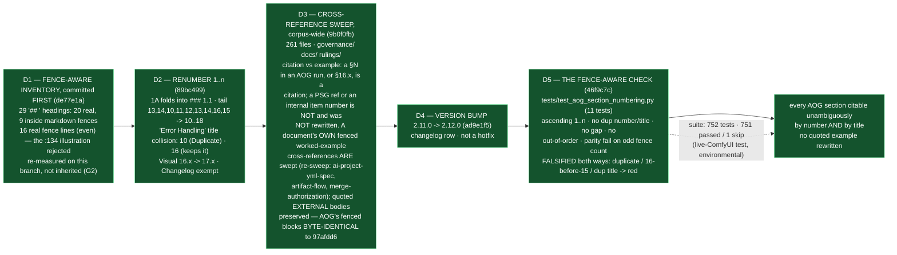

# Delivery Notice: P12-M44-E44.4 — The AOG Repair: Fence-Aware Renumber, Cross-Reference Sweep, Version Bump

> **`pr_number`/`pr_url` are recorded now that the PR exists (PR #259).** The remaining
> `merge_details` fields — `merge_commit` / `merge_timestamp` / `merge_strategy` —
> describe a merge that has not happened and are **unfillable at delivery time**
> (`P10-GH-4`, restated, not filled with invented values).

## Summary

**Every AOG section is now citable unambiguously — by number and by title — and the check
that keeps it so is proven red.** **D1** — a committed, fence-aware inventory preceded any
edit (29 `## ` headings: 20 real, 9 inside ```markdown fences; 16 real fence lines,
even). **D2** — the real sections are renumbered to `1..n` in place with no duplicate
number and no duplicate title: `1A` folds into section 1 as sub-part `1.1` (recorded
design decision), the tail `13, 14, 10, 11, 12, 13, 14, 16, 15` becomes
`10, 11, 12, 13, 14, 15, 16, 17, 18`, and the "Error Handling" title collision resolves
(the first becomes "Error Handling (Duplicate)"; the second keeps "Error Handling").
**D3** — cross-references to changed numbers are swept corpus-wide (261 files) with
citation-vs-example distinguished: PSG references and document-internal `§N` item
numbers are untouched, **a document's own fenced worked-example cross-references are
swept**, and quoted **external** artifact bodies are preserved — the AOG's fenced
example blocks are **byte-identical** to the branch point (shown, not asserted). **D4** — version
`2.11.0 → 2.12.0` with a changelog row; not a hotfix. **D5** — the fence-aware check
asserts ascending `1..n`, no duplicate number, no duplicate title, no gap, no
out-of-order section, and a loud parity failure on an odd fence-line count (the `:134`
detector-desync tell) — **falsified both ways** on the real corpus.

## Verification layer, time and scope (`P11-GH-2`) — and the REF

| Axis | Value |
|---|---|
| **Layer** | **Literal file text** on disk (`git diff`, `grep`, `git show`) plus executed `pytest`. Not a rendered view. |
| **Time** | **2026-09-03** |
| **Scope** | **`ai-project-system` only.** Branch **`epic/P12-M44-E44.4`**, branched from **`origin/milestone/M44` @ `97afdd6`**. **Drivr is not touched by this epic.** The sweep touches `governance/`, `docs/`, and `.ai-project/artifacts/rulings/` — references **to** the AOG; PSG's own numbering is untouched. |
| **Refs** | Branch point `97afdd6` (merge-base with `milestone/M44` verified identical). Suite at the branch point: **741 passed / 0 failed**; on this branch: **752 tests, 751 passed / 1 skipped / 0 failed** (`AI_PROJECT_SKIP_LIVE_ENDPOINT_TESTS=1 PYTHONPATH=. pytest -q`, bare `pytest` fails collection). The one skip is the pre-existing, documented live-ComfyUI endpoint integration test — environmental, unrelated to this epic, not introduced here (without the env var the same run reports 752 passed when the endpoint resolves). **+11 tests, no skip introduced.** The Starter's Suite Baseline (740) is stale — re-measured on `milestone/M44` at `97afdd6`: 741 (consistent with E44.3's notice). |
| **AOG version cited** | **v2.12.0** on this branch; **v2.11.0** was the branch-point version. |

**P11-GH-1 backstop, run before delivery:** `git log 97afdd6..HEAD -- <milestone spec;
E44.4 spec; E44.4 starter; AOG; PSG; 2026-08-19 opening ruling>` returns only this
epic's own commits — **no amendment** to any artifact this Starter restates a rule from
arrived during execution. The AOG was read **from the artifact on this branch** at each
step, not from memory (G2).

---

## Deliverables

### D1 — The committed fence-aware inventory, before any edit ✅

Committed as the first commit on this branch (`de77e1a`), **before the AOG was touched**:
`P12-M44-E44.4__record__aog-fence-aware-inventory.md` itemizes every `## ` heading of
the AOG at the branch point (verbatim, G1) with its fence state, the real-vs-fenced
distinction, the detector pattern, the parity check, and the totals derived from the
list (29 total / 20 real / 9 fenced; 16 real fence lines, even). G2: re-derived on this
branch, not inherited from X1 — the split matches X1 exactly.

### D2 — Sections renumbered `1..n`, no duplicate number, no duplicate title ✅

The real `## ` sections are `1..n` (order `1, 2, 3, 4, 5, 6, 7, 8, 9, 10, 11, 12, 13,
14, 15, 16, 17, 18`), with `Changelog` exempt. **`1A` decision (delegated):** folded
into section 1 as sub-part `### 1.1 Canonical Happy Path Enforcement (Mandatory)` —
the spec's sanctioned option 2; the fold keeps sections 2–9 and their heavily-cited
`3.x` sub-numbers stable and shrinks the sweep surface. **The "Error Handling" title
collision:** the first (now `## 10. Error Handling (Duplicate)`) and the second (now
`## 16. Error Handling`) — the corpus's established "Error Handling" citation (the one
after Exit Ritual) keeps the bare title. Visual sub-sections `16.1–16.8` → `17.1–17.8`.
Diff is exactly 18 heading lines; the nine fenced example headings are untouched.

### D3 — The corpus-wide cross-reference sweep, no quoted example rewritten ✅

261 files swept across `governance/`, `docs/`, and `.ai-project/artifacts/rulings/`.
**The rule deciding citation vs example (stated):** a `§N` token is an AOG citation when
it belongs to an `AOG` citation run (load lists `AOG preamble+…`, `AOG §N`), is an
AOG-only token (`§16.x`), or is a continuation of an `AOG preamble` list; a PSG
reference, or a bare `§N` used as a document-internal item number (e.g. a Delivery
Notice's own `✅ §N` table), is **not** a cross-reference and was not rewritten. **A
document's own cross-references are swept even when they sit inside its own fenced
worked examples** — three live-document cases (the `ai-project-yml-spec.md` config
worked example, the `artifact-flow.md` diagram, the `merge-authorization.md` template
example) were swept in the bounded re-sweep (`M44 Stage-2 finding`); **quoted *external*
artifact bodies are preserved** — the AOG's eight fenced example blocks are
**byte-identical** to the branch point (shown, not asserted), and closed-phase
(P6/P7/P8) records are left as dated history. The AOG's own internal cross-references
(e.g. `§12 "Acceptance Outcomes"` → `§14`) were updated in the same pass.

### D4 — AOG version bump + changelog row ✅

`2.11.0 → 2.12.0`, `Effective Date: 2026-09-03`, with a changelog row recording the
renumber (the `1A` fold, the tail renumber, the title-collision resolution, the `16.x →
17.x` sub-sections), the corpus-wide sweep with no quoted example rewritten, and the
`Changelog` exemption. Not a hotfix — renumber, sweep, and bump travel together.

### D5 — The fence-aware check, falsified ✅

`tests/test_aog_section_numbering.py` (11 tests). The check parses the AOG with the same
fence detector the inventory used (non-triple and indented markers handled; the `:134`
illustration is rejected), fails loudly on an odd real-fence-line count, asserts the real
`## ` sections are ascending `1..n` with no duplicate number, no duplicate title, no gap,
and no out-of-order section, and records the one exemption (`Changelog`; `1A`'s fold into
`### 1.1` keeps the `## ` sequence a clean integer run — the assertion is authored
against D2's recorded decision, not ahead of it). **Falsified both ways:** the committed
test reintroduces a duplicate number, a 16-before-15 swap, and a duplicate title into a
copy of the real corpus and observes each fail; restore is green.

### Structural diagram ✅

Mermaid, fenced, in-repo, **no ComfyUI** — implemented-track (AOG §17.3/§17.6), below.

### Re-sweep — M44 Stage-2 finding (bounded, one attempt consumed) ✅

The M44 Milestone Chat's Stage-2 review found one genuine miss: `ai-project-yml-spec.md`
carried a live `AOG §16.3` cross-reference inside its **own** ```yaml worked example
(`:495`), which the fence rule had over-protected. The corrected distinction, as ruled:
**sweep a document's own cross-references even when they sit inside its own fenced
worked examples; preserve only quoted *external* artifact bodies.** Three live-document
cases were fixed in the re-sweep (`ai-project-yml-spec.md:495` `§16.3 → §17.3`;
`artifact-flow.md:26` and `merge-authorization.md:63` `AOG §12 → §14`), the whole scope
was re-scanned for stale AOG `§N` inside fenced worked examples with no further
occurrence, and the AOG's own quoted template bodies remain byte-identical. The
closed-phase (P6/P7/P8) records' untouched `§16.x` references were confirmed as
intentional (dated history) and are flagged for the Phase Chat, not fixed here.

---

## Design decisions (delegated — decided, documented, proceeded)

| # | Decision | Outcome |
|---|---|---|
| 1 | **The treatment of `1A`** (spec option 2) | Folded into section 1 as sub-part `### 1.1` — keeps sections 2–9 (and the heavily-cited `3.x` sub-numbers) stable, shrinks the sweep surface, and keeps the `## ` level a clean integer `1..n` for D5. Recorded in the changelog row. |
| 2 | **The version-bump magnitude** | `2.11.0 → 2.12.0` — a real minor bump with a changelog row; a silent edit was the one thing ruled out. |
| 3 | **The check's implementation** | `tests/test_aog_section_numbering.py`: `FENCE_LINE_RE` (CommonMark-shaped, rejects the `:134` illustration), `fenced_line_set` (parity-raising), `real_headings`, `aog_section_errors` (itemized defect list, never a bare count). |

---

## Definition of Done — every item

- [x] The fence-aware inventory is committed **before** any renumbering (D1, first commit)
- [x] Sections are `1..n`, no duplicate number, no duplicate title (verified by D5's
      green real-corpus test)
- [x] Every cross-reference is updated; **no quoted example was rewritten — shown, not
      asserted** (fenced blocks byte-identical to the branch point)
- [x] AOG version bumped (`2.12.0`), changelog row added
- [x] The check fails when a duplicate is reintroduced, and when the sequence is made
      non-monotonic (falsified in both directions in `test_falsified_against_the_real_corpus`)
- [x] Suite green — **752 tests, 751 passed / 1 skipped / 0 failed** (+11 tests; the skip is the
      pre-existing live-ComfyUI endpoint integration test, environmental), invocation
      `AI_PROJECT_SKIP_LIVE_ENDPOINT_TESTS=1 PYTHONPATH=. pytest -q` and ref `97afdd6` stated
- [x] Delivery Notice committed; PR opened to `milestone/M44`

## Acceptance Criteria

- [x] The fence-aware inventory is committed before any renumbering
- [x] Sections are `1..n`, no duplicate number, no duplicate title
- [x] Every cross-reference is updated; no quoted example was rewritten — shown, not
      asserted
- [x] AOG version bumped, changelog row added
- [x] The check fails when a duplicate is reintroduced, and when the sequence is made
      non-monotonic
- [x] Every claim states the layer, time and scope — and the **ref** — at which it was
      verified (this notice's Verification section; the D1 record's Layer-time-scope)

---

## Visual Bindings

**Visual binding**
- **Link:** (inline — Structural diagram; no hosted link needed per AOG §17.3/§17.5)
- **What:** diagram
- **Level:** Epic
- **State:** implemented



- **Description (implemented):** E44.4 delivered in the ordered form its spec demanded —
  inventory first, then renumber, then the corpus-wide sweep, then the bump, then the
  check. The `1A` fold (recorded decision) keeps the `## ` level a clean `1..n`, and the
  check that guards it is proven red by reintroducing each defect class into a copy of
  the real corpus. Implemented-track Structural diagram (AOG §17.3/§17.6), Mermaid, no
  ComfyUI.

---

## Status

⏸️ **Stopped. Awaiting Milestone Chat review and authorization. Not merged.** Per this
epic's Starter: merge authorization for this PR normally follows the Milestone Chat's
Stage-2 review, and the parent (the M44 Milestone Chat) performs the merge. This delivery
is the **first attempt** — the rework limit (3 attempts plus any written `+1`, PSG §11.6)
has not been touched.

Epic E44.4 execution complete. Epic Delivery Notice produced. Awaiting Milestone Chat
review and authorization.