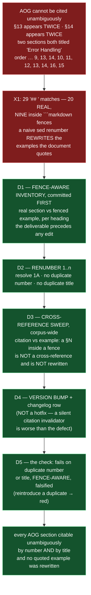

# Epic E44.4 — The AOG Repair: Fence-Aware Renumber, Cross-Reference Sweep, Version Bump

## Context

Every section of the AI-OPERATING-GUIDELINES.md must be citable unambiguously. Today it cannot be — **by
number** (`13` and `14` each appear twice) **or by title** (two sections are both "Error Handling", at
`## 13.` and `## 14.`).

X1 (the M44 planning finding) measured this on `phase/P12` at 2026-08-20. **Re-measured on this branch
2026-09-03 against the current AOG: the finding holds exactly.** A fence-aware count of `## ` headings
returns **29 matches — 20 real sections, 9 inside ```markdown example blocks.** The section order is
still `1, 1A, 2, 3, 4, 5, 6, 7, 8, 9, 13, 14, 10, 11, 12, 13, 14, 16, 15`, with **`13` and `14` each
appearing twice** and **`15` landing after `16`**. The nine fenced headings (`Integration Strategy`,
`Completion Verification`, `Milestone Summary`, `Required Action`, `Closure Confirmation`, `Next Steps`,
`Completion Criteria Evaluation` ×2, `Epic Review Seal`) are example artifact bodies quoted inside the
document — **a naive renumber, or a sweep rewriting section numbers wherever they appear, would corrupt
the templates the AOG quotes while appearing to succeed.**

**X1 exists because the Phase Chat produced a false one and caught it.** A naive heading scan reported a
second duplicate title (`Completion Criteria Evaluation` at two line numbers) — both inside fences. The
corpus's warning is *falsify a pattern before trusting a zero result*; this is the same defect with the
sign flipped, caught by reading context rather than by any check.

## Problem Statement

**The AOG's section numbers and titles are not a stable citation scheme, and every repair that ignores
the fence problem makes the defect worse.**

Two faces, one defect:

1. **Citations are load-bearing but ambiguous.** `§11.6`, `§11.6.1`, `§5C`, `§16.3` and the AOG's own
   internal `§13`/`§14` are cited across the corpus, the starters and multiple rulings. A reader
   following `§13` gets one of two different sections; following "Error Handling" gets one of two
   different titles. The document cannot be cited unambiguously.
2. **A repair that is not fence-aware corrupts example content.** Nine `## ` lines are inside
   ```markdown fences — example artifact bodies the AOG quotes. A `sed`-based renumber, or a
   cross-reference sweep that rewrites `§13` wherever it appears, rewrites those examples. Falsifying
   against the current text confirms the trap is live, not hypothetical.

**This is ruled not a hotfix** (Decision 6 of the 2026-08-19 opening ruling): a change that silently
invalidates citations is worse than the defect it fixes, so the renumber, the cross-reference sweep and
the version bump travel together in this one epic.

## Goals

By the end of this Epic, the system must:

1. **Commit a fence-aware inventory first** — the inventory is a deliverable in its own right and
   precedes any edit.
2. **Renumber sections `1..n`** — no duplicate number, no duplicate title.
3. **Sweep cross-references corpus-wide**, distinguishing a citation from an example; no quoted example
   is rewritten.
4. **Bump the AOG version** and add a changelog row — not a hotfix.
5. **Add a check** that fails on a duplicate section number or title, fence-aware, with a falsification
   demonstration.

## Non-Goals

This Epic explicitly does **not** aim to:

- **Change AOG content** beyond the renumber and cross-reference sweep. No normative text is rewritten,
  added, or struck; the repair is structural.
- **Reorder sections.** The physical order of `13`/`14` before `10` and `16` before `15` is renumbered in
  place, not re-laid-out (renumbering is not rewriting).
- **Renumber PSG or any other document.** Only the AOG is renumbered; other documents' references *to*
  the AOG are swept.
- **Touch the fenced example blocks' content.** They are quoted example artifacts; their section headings
  are read, not renumbered, and their bodies not rewritten.
- **Absorb `P12-GH-3` (derived-claim rot).** Filed unowned; not this epic.

## Scope of Work

### 1. The fence-aware inventory (D1)

Produce a committed inventory of the AOG's `## ` headings, marking each as **real section** or **inside
a ```markdown fence**, with the fence state stated. This is a deliverable in its own right and precedes
any edit. **Re-measure on this branch (G2)** — do not inherit X1's figures; the inventory is the
authoritative count.

**Must include:** the per-heading list; the fence-vs-real distinction for each; the total counts derived
from the list (itemized, never a bare count); and the pattern used to make the distinction.

### 2. The renumber (D2)

Renumber the real sections to `1..n`, no duplicate number, no duplicate title. Resolve `1A` (a lettered
section) into the `1..n` scheme unambiguously — its treatment is E44.4's decision, recorded. `Changelog`
is handled consistently with the scheme (numbered or explicitly exempted).

### 3. The cross-reference sweep (D3)

Sweep the corpus for references to AOG section numbers that changed, distinguishing a **citation** from
an **example** — a reference inside a quoted example is not a cross-reference and must not be rewritten.
`§11.6`, `§11.6.1`, `§5C`, `§16.3` and the AOG's own internal cross-references are the known surfaces;
the sweep finds the rest.

**Must include:** the list of references updated; the demonstration that no fenced example was rewritten
(shown, not asserted); and the rule for deciding a match is a citation vs. an example.

### 4. The version bump (D4)

Bump the AOG version and add a changelog row recording the renumber and the sweep. Not a hotfix.

### 5. The check (D5)

A check under `tests/` that fails on a duplicate section number or title, **fence-aware**, with a
falsification demonstration (reintroduce a duplicate → check fails → restore → green).

## Deliverables

- [ ] **D1** — The committed fence-aware inventory, preceding any edit
- [ ] **D2** — Sections renumbered `1..n`, no duplicate number, no duplicate title
- [ ] **D3** — The corpus-wide cross-reference sweep; no quoted example rewritten (shown, not asserted)
- [ ] **D4** — AOG version bumped, changelog row added
- [ ] **D5** — The fence-aware duplicate check, with a falsification demonstration
- [ ] Structural diagram (Mermaid, in-repo, no ComfyUI)
- [ ] **Epic Delivery Notice**

## Binding Constraints

Settled above this epic — **not re-decidable here**:

1. **The AOG renumber is NOT a hotfix** (ruling Decision 6). Cross-references are load-bearing normative
   text; the sweep travels with the renumber in the same epic, with a version bump.
2. **The inventory is committed before any renumbering.**
3. **Fence-awareness is not optional** (X1). A naive renumber corrupts the examples the document quotes.
4. **No quoted example is rewritten** — this is shown, not asserted.

## Hard Constraint (binding — carried to every Epic)

- **Execution posture: `manual` / paid frontier.** This epic rewrites the citation surface of a normative
  document. **The instance must be manual for the same reason the whole milestone is.**
- **Itemize, never count.** The inventory is a list; a count alone is a defect (X2's lesson).
- **Fence-awareness is not optional.** Every pass distinguishes real content from quoted examples, and
  states how.
- **Falsify before trusting — in both directions.** X1 was a false positive that survived a naive pattern;
  the check is proved by falsifying it.
- **State the layer, time and scope of every claim** (`P11-GH-2`) **and the REF.**
- **Cite by heading, not number, from the start.** This epic renumbers the AOG, so any citation this
  epic writes (and any in E44.5/E44.6) uses section headings, never `§N` numbers that will move under
  its own change.

## Design Decisions Delegated — decide, document, proceed

1. **The treatment of `1A`** — whether it becomes `2` (shifting the following numbers) or is folded into
   `1` as a sub-part; recorded either way.
2. **The version-bump magnitude** — e.g. `2.11.0` → `2.12.0` vs a major bump; the constraint is only that
   it is a real bump with a changelog row, not a silent edit.
3. **The check's implementation** (function name, fence-tracking approach for the parser).

## Definition of Done

Epic E44.4 is complete when:

- [ ] The fence-aware inventory is committed before any renumbering
- [ ] Sections are `1..n`, no duplicate number, no duplicate title
- [ ] Every cross-reference is updated; no quoted example was rewritten — shown, not asserted
- [ ] AOG version bumped, changelog row added
- [ ] The check fails when a duplicate is reintroduced (falsified)
- [ ] Suite green — no skip introduced — with the invocation and the ref stated
- [ ] Delivery Notice committed; PR opened to `milestone/M44`

## Acceptance Criteria

- [ ] The fence-aware inventory is committed before any renumbering
- [ ] Sections are `1..n`, no duplicate number, no duplicate title
- [ ] Every cross-reference is updated; no quoted example was rewritten — shown, not asserted
- [ ] AOG version bumped, changelog row added
- [ ] The check fails when a duplicate is reintroduced
- [ ] Every claim states the layer, time and scope — and the **ref** — at which it was verified

## Technical Constraints

**In scope:** `governance/AI-OPERATING-GUIDELINES.md` (the renumber, `1A` resolution, changelog); the
corpus-wide cross-reference sweep (governance docs, templates, systems, starters, rulings, phase specs);
the check under `tests/`.
**Do not touch:** AOG content beyond the renumber and cross-reference sweep (no normative text changed);
the fenced example blocks' bodies; PSG / other documents' own section numbering (only references *to*
the AOG are swept); Drivr.
**Repository:** `ai-project-system` only.
**Invocation:** `PYTHONPATH=. pytest -q` — bare `pytest` fails collection. Baseline re-measured on
`milestone/M44`: **740 passed** (the milestone spec's `549` is stale).

## Dependencies

**Internal**
- **X1** — the planning finding whose premise E44.4 repairs; re-measured exactly on this branch.

**External**
- None. This epic does not cross repositories.

**Blockers**
- None at planning.

## Timeline

**Estimated Effort:** 1–2 sessions (inventory → renumber → sweep → bump → check).
**Target Completion:** before P12 closes.
**Actual Completion:** In progress.

## Execution Notes

**Order:**
1. Produce the fence-aware inventory on **this branch** (G2); commit it **before** any edit.
2. Resolve `1A`; renumber `1..n` (no duplicate number, no duplicate title).
3. Sweep cross-references corpus-wide, distinguishing citation from example; **show** no fenced example
   was rewritten.
4. Bump the version; add the changelog row.
5. Write the check; **reintroduce a duplicate and watch it fail**; restore it.
6. Run the suite; state the invocation and the ref.

**Traps:**
- Renumbering before the inventory is committed (violates D1).
- Relying on a `sed`/naive `## ` scan — it will rewrite the nine fenced example headings.
- Rewriting a fenced example during the sweep because it contains `§13` — a quoted example is not a
  cross-reference.
- Leaving "Error Handling" duplicated by title even if the numbers are fixed (both criteria must hold).
- Citing a section by `§N` in the work itself — this epic's own citation moves the anchors.
- Stating a claim against an unpinned ref, or emitting a bare count instead of the itemized inventory.

## Related Documents

- [M44 Milestone Spec](P12-M44__milestone-spec.md) — v1.2.1 E44.4 Epic Detail, X1 finding, Hard
  Constraint, Binding Constraints
- [AI-OPERATING-GUIDELINES.md](../../../governance/AI-OPERATING-GUIDELINES.md) — the repair's subject
- [PROJECT-SYSTEM-GUIDELINES.md](../../../governance/PROJECT-SYSTEM-GUIDELINES.md) — cross-references
  from it to the AOG are swept
- [P12 Phase Spec](P12__phase-spec.md)

## Visual Bindings

**Visual binding**
- **Link:** (inline — Structural diagram; no hosted link needed per AOG §16.3/§16.5)
- **What:** diagram
- **Level:** Epic
- **State:** proposed



- **Description:** E44.4 makes every AOG section citable unambiguously. The defect is a numbering scheme
  with duplicate numbers (`13`, `14`) and duplicate titles ("Error Handling"), and the trap X1 named is
  that nine of the 29 `## ` headings are inside ```markdown fences — a naive renumber corrupts the
  example artifacts the AOG quotes. The repair is ordered: a committed fence-aware inventory first, then
  the renumber, then a corpus-wide cross-reference sweep that distinguishes a citation from a quoted
  example, then a version bump (not a hotfix), then a fence-aware check whose failure a reintroduced
  duplicate demonstrates. Proposed-track Structural diagram (AOG §16.3/§16.6), Mermaid, no ComfyUI.

## Notes

- **X1 is this milestone's flagship finding, and it re-measures exactly.** A fence-aware count on this
  branch (2026-09-03) against the current AOG returns the same 29/20/9 split and the same
  `… 9, 13, 14, 10 … 16, 15` order X1 recorded at planning — the intervening AOG version bumps were
  changelog/content, not section renumbering. The epic must still produce its own committed inventory
  (D1); the confirmation here is for the spec's accuracy, not a substitute for the deliverable.

- **The two "Error Handling" sections are the title-duplicate, not the number-duplicate.** `## 13.
  Error Handling` and `## 14. Error Handling` are distinct sections that share a title; fixing only the
  numbers (so `13`/`14` are unique) leaves the title collision. The renumber must resolve both, because
  the acceptance criterion says *no duplicate number **and** no duplicate title*.

## Changelog

| Version | Date | Change |
|---|---|---|
| 1.0.0 | 2026-09-03 | Initial E44.4 spec, from M44 milestone spec v1.2.1 E44.4 Epic Detail and the X1 finding. Fence-aware inventory first, renumber `1..n`, corpus-wide cross-reference sweep distinguishing citation from example, version bump (not a hotfix), and a fence-aware duplicate check with falsification. Records the re-measurement that X1 still holds exactly on the current AOG, and delegates the `1A` treatment, the bump magnitude, and the check implementation. No scope, ordering, gate or acceptance-criterion change from the milestone spec. |
