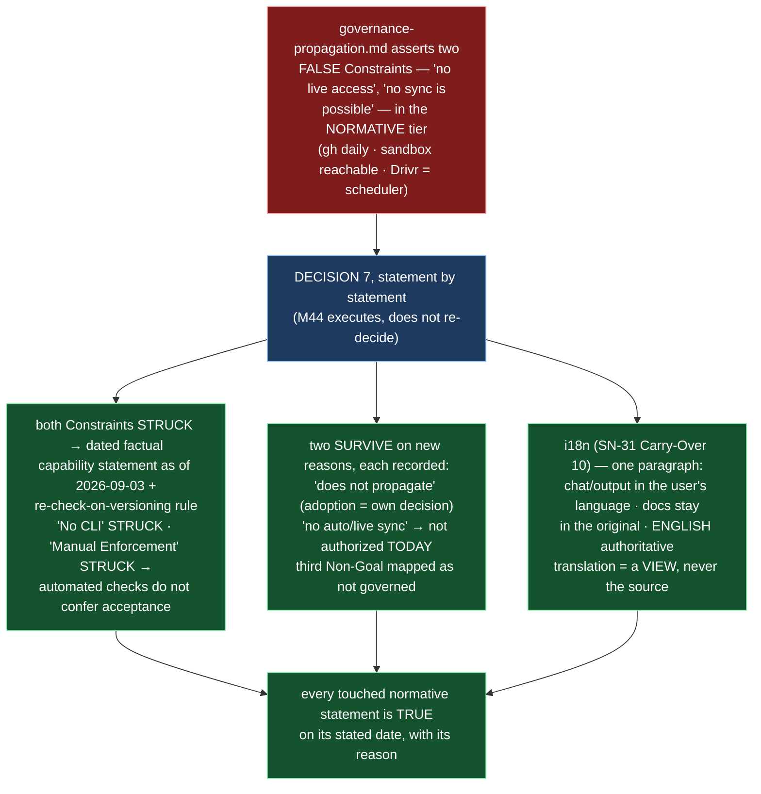

# Delivery Notice: P12-M44-E44.5 — Normative Text That Is False or Missing

> **`pr_number`/`pr_url` are recorded now that the PR exists (PR #260).** The remaining
> `merge_details` fields — `merge_commit` / `merge_timestamp` / `merge_strategy` —
> describe a merge that has not happened and are **unfillable at delivery time**
> (`P10-GH-4`, restated, not filled with invented values).

## Summary

**`governance-propagation.md` states only what is true as of its amendment date, each
surviving prohibition carries its own reason, and the corpus's first language policy is
one paragraph in the normative tier.** **D1** — Decision 7's table executed **statement
by statement**, not re-decided: both Constraints struck and replaced by a **dated**
factual capability statement (as of **2026-09-03**: `gh` daily, sandbox reachability via
B2.1, Drivr a scheduler) plus the rule that a Constraints section carrying a technical
claim is **re-checked whenever the document is versioned**; the third Constraint line
(*"All governance enforcement is by reference and manual review"*) struck under the
"Manual Enforcement… not automation" clause; *"Governance does not propagate
automatically or implicitly"* survives **on a new reason** (adoption must be a project's
own recorded decision); *"Manual Enforcement"* struck as stated and replaced by
**automated checks do not confer acceptance** (Propagation Model item 3); Non-Goal *"No
CLI or automation tooling"* struck; Non-Goal *"No automatic or live governance syncing"*
survives **re-scoped** to *no such mechanism is authorized today*. **D2** — each survivor
carries its own reason, in the document, not only in the changelog; each struck
statement is recorded as struck. **D3** — the i18n policy paragraph (SN-31 Carry-Over
10) added as §Language Policy, **one paragraph**, resolving the English-to-Spanish-
adopter tension explicitly. Version `1.0.0 → 1.1.0` with a changelog row.

---

## Verification layer, time and scope (`P11-GH-2`) — and the REF

| Axis | Value |
|---|---|
| **Layer** | **Literal file text** on disk (`git diff`, `git show`, `grep`) plus executed `pytest`. Not a rendered view. |
| **Time** | **2026-09-03** |
| **Scope** | **`ai-project-system` only.** Branch **`epic/P12-M44-E44.5`**, branched from **`origin/milestone/M44` @ `52380f4`**. **Drivr is not touched by this epic.** No document other than `governance-propagation.md` is edited (the i18n paragraph's home is `governance-propagation.md` itself — see the delegated decision). |
| **Refs** | Branch point `52380f4` (merge-base with `milestone/M44` verified identical). Suite re-measured on this branch: **752 tests collected; 751 passed / 1 skipped / 0 failed** (`AI_PROJECT_SKIP_LIVE_ENDPOINT_TESTS=1 PYTHONPATH=. pytest -q`; bare `pytest` fails collection). The one skip is the pre-existing live-ComfyUI endpoint integration test — environmental (endpoint not reachable from this host), unrelated to this epic, not introduced here (without the env var the same run reports the helper timing out). **No test added, none skipped by this epic.** The Starter's Suite Baseline (740) is stale — re-measured on `milestone/M44` at `52380f4`: 752 collected / 751 passed + 1 skip (consistent with E44.4's notice, which measured 752 after its +11). |
| **Document version cited** | `governance-propagation.md` **v1.0.0 at the branch point → v1.1.0 on this branch**. |

**P11-GH-1 backstop, run before delivery:** `git fetch origin` then
`git log 52380f4..origin/milestone/M44` returns **empty** — no amendment to the
milestone spec, this epic's spec, this starter, `governance-propagation.md`, the
2026-08-19 ruling, PSG, or AOG arrived during execution. The document was read **from
the artifact on this branch** at each step, not from memory (G2).

---

## Deliverables

### D1 — `governance-propagation.md` amended statement by statement per Decision 7 ✅

Every governed statement is mapped, itemized, not counted:

| Statement (current at branch point) | Ruling executed |
|---|---|
| Constraint *"HQ chats and related tools **do not** have live access to GitHub repositories"* | **Struck** — replaced by a **dated** factual capability statement (as of **2026-09-03**: `gh` daily, sandbox reachability via B2.1, Drivr a scheduler) + the re-check-on-versioning rule. |
| Constraint *"No automatic synchronization or polling is possible"* | **Struck** — same replacement. |
| Constraint *"All governance enforcement is by reference and manual review"* | **Struck** under Decision 7's *"Manual Enforcement… not automation"* clause (mapped, not re-decided — the spec's Phase-Chat ruling). |
| *"Governance does not propagate automatically or implicitly"* | **Survives, on a new reason** — not because impossible, but because **adoption must be a project's own recorded decision** (silent inheritance = fail-open applied to governance). |
| *"Manual Enforcement: Governance is enforced through manual review and reference, not automation"* | **Struck as stated; replaced** by **automated checks do not confer acceptance** — a passing check is evidence, a human or a governed parent still accepts. |
| Non-Goal *"No CLI or automation tooling"* | **Struck** — `bin/` exists, is documented in the AOG and three guides, and is instructed to adopters. |
| Non-Goal *"No automatic or live governance syncing"* | **Survives, re-scoped** — records that **no such mechanism is authorized today**; an authorization question, not a capability claim. |
| Non-Goal *"No changes to existing governance rules"* | **Unchanged — not governed by Decision 7's table** (mapped, not silently dropped): a scope Non-Goal inherited from the originating epic (E3.1); this epic does not re-decide what the ruling left unruled. |

Version `1.0.0 → 1.1.0`, changelog row added.

### D2 — The reason with each survivor; each struck statement recorded as struck ✅

- **"Does not propagate automatically or implicitly"** carries its own reason in §Reference-Based Adoption ("Why this survives").
- **"No automatic or live governance syncing"** carries its own reason in §Non-Goals (re-scoped to *not authorized today*, with the Decision 8 updater/reconciler deferral noted).
- **Struck statements** — both Constraints, the third Constraint line, "Manual Enforcement", and "No CLI" — are each shown struck in place with their ruling, not deleted silently.
- The third Non-Goal is **explicitly mapped** as outside Decision 7's table, not silently dropped or silently kept.

### D3 — The i18n paragraph, one paragraph, in the normative tier ✅

**Placement decision (delegated): `governance-propagation.md` §Language Policy (i18n)** —
the language-of-adoption question is a propagation question (the Spanish-speaking adopter
is an adopter), and placing it here keeps the touched set at exactly one document. One
paragraph, resolving the tension explicitly: chat and output in the user's language;
documentation remains in the original language; **English is authoritative**; translation
on demand is a **view, never the source** — a Spanish-speaking adopter interacts in
Spanish while the English documentation is propagated as-is, and any translation is
derived from it, never a competing source (SN-31 Carry-Over 10, decided).

---

## Design decisions (delegated — decided, documented, proceeded)

| # | Decision | Outcome |
|---|---|---|
| 1 | **The wording of the dated factual capability statement** | *"Current capability, as of 2026-09-03: this repository is operated through `gh` daily — its chats and tools **do** have live access to GitHub repositories; B2.1 (P11-M37) gave the sandbox reachability to the host; and **Drivr is a scheduler**. Automatic synchronization and polling are therefore possible and, where authorized, used."* — dated, factual, and leaves no surviving impossibility claim. |
| 2 | **Where the i18n paragraph lands** | `governance-propagation.md` §Language Policy (i18n) — the adopter-language tension is a propagation question; one document touched. |

---

## Definition of Done — every item

- [x] No Constraint in `governance-propagation.md` is false as measured on its amendment
      date (**2026-09-03**), and the date is stated (dated capability statement; re-check
      on versioning stated)
- [x] Each surviving prohibition carries **its own** reason; each struck one is recorded
      as struck (D2)
- [x] The re-check-on-versioning rule is stated in the document (§Constraints)
- [x] The i18n paragraph is in the normative tier, **one paragraph**, and resolves the
      English-to-Spanish-adopter tension explicitly (§Language Policy)
- [x] `governance-propagation.md` version bumped (`1.1.0`), changelog row added
- [x] Suite green — **752 collected; 751 passed / 1 skipped / 0 failed**, no skip
      introduced by this epic, invocation `AI_PROJECT_SKIP_LIVE_ENDPOINT_TESTS=1
      PYTHONPATH=. pytest -q` and ref `52380f4` stated
- [x] Delivery Notice committed; PR opened to `milestone/M44` (#260)

## Acceptance Criteria

- [x] No Constraint in `governance-propagation.md` is false as measured on its amendment
      date, and the date is stated
- [x] Each surviving prohibition carries its own reason; each struck one is recorded as
      struck
- [x] The re-check-on-versioning rule is stated in the document
- [x] The i18n paragraph is in the normative tier, one paragraph, and resolves the
      English-to-Spanish-adopter tension explicitly
- [x] Every claim states the layer, time and scope — and the **ref** — at which it was
      verified (this notice's Verification section)

---

## Visual Bindings

**Visual binding**
- **Link:** (inline — Structural diagram; no hosted link needed per AOG §17.3/§17.5)
- **What:** diagram
- **Level:** Epic
- **State:** proposed

- **Description (implemented):** E44.5 executed Decision 7's table verbatim against the
  document's governed statements — the two false Constraints and the third Constraint
  line struck, replaced by a dated capability statement (2026-09-03) plus a
  re-check-on-versioning rule; one prohibition surviving on the recorded-decision
  reason; one struck and replaced by *automated checks do not confer acceptance*; one
  Non-Goal struck; one re-scoped to *not authorized today*; each survivor with its own
  reason, each strike recorded. The i18n policy paragraph (SN-31 Carry-Over 10) landed
  as §Language Policy, one paragraph. Proposed-track Structural diagram (AOG
  §17.3/§17.6), Mermaid, no ComfyUI.

---

## Status

⏸️ **Stopped. Awaiting Milestone Chat review and authorization. Not merged.** Per this
epic's Starter: merge authorization for this PR normally follows the Milestone Chat's
Stage-2 review, and the parent (the M44 Milestone Chat) performs the merge. This delivery
is the **first attempt** — the rework limit (3 attempts plus any written `+1`, PSG §11.6)
has not been touched.

Epic E44.5 execution complete. Epic Delivery Notice produced. Awaiting Milestone Chat
review and authorization.