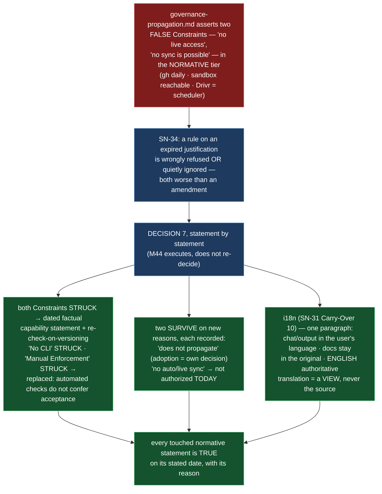

# Epic E44.5 — Normative Text That Is False or Missing

## Context

`governance/systems/governance-propagation.md` (v1.0.0, `active`) states two Constraints that are
**false**: *"HQ chats and related tools do not have live access to GitHub repositories"* and *"No
automatic synchronization or polling is possible."* Both were true once and have not been since — the
repository is operated through `gh` daily, B2.1 (P11-M37) gave the sandbox reachability to the host,
and Drivr is a scheduler. The document has stood, in the **normative** tier, asserting a capability it
lacks and forbidding one it has, across at least four phases.

SN-34 is the shape-detector: **a rule resting on an expired justification will be wrongly refused or
quietly ignored, and both are worse than an amendment.** The 2026-08-19 opening ruling measured and
upheld SN-34, and ruled the disposition **statement by statement** (Decision 7). This epic executes it:
it does not re-decide.

Alongside sits the **i18n policy** (SN-31 Carry-Over 10, decided): the corpus's first external adopter
works in Spanish, and the normative tier has never stated a language policy at all. The policy is one
paragraph, not a project.

## Problem Statement

**The normative tier contains statements that are false as measured today, and a policy that should
exist and does not.**

- `governance-propagation.md`'s Constraints assert a false *impossibility* ("no live access", "no
  synchronization is possible") at the moment the corpus routinely does both. The document contradicts
  the corpus it governs.
- Three prohibitions rest on the same expired premise — *automation is not how this works* — and two of
  the three were falsified by `bin/`, the test suite, and Drivr.
- Every surviving prohibition, and every struck one, must carry its **reason** — not only its verdict —
  because a rule whose justification is gone will be wrongly enforced or quietly dropped (SN-34).
- The corpus has an external adopter in a second language and **no stated language policy**; the
  English-to-Spanish-adopter tension is currently resolved by nothing.

## Goals

By the end of this Epic, the system must:

1. **Amend `governance-propagation.md` per Decision 7, statement by statement** — both Constraints
   struck; one prohibition survives on a new reason; one is struck and replaced; one Non-Goal struck;
   one Non-Goal survives re-scoped — with a version bump and a changelog row.
2. **Land the i18n policy paragraph** in the normative tier, one paragraph, resolving the
   English-to-Spanish-adopter tension explicitly.
3. **Record the reason with each surviving prohibition**, not only the verdict.

## Non-Goals

This Epic explicitly does **not** aim to:

- **Re-decide the disposition.** Decision 7 is ruled, statement by statement. This epic executes.
- **Build any i18n mechanism.** The policy is one paragraph; no translation tooling, no localization
  project, no process.
- **Build the governance updater or reconciler.** Decision 8 split and deferred both halves out of P12;
  "no automatic or live governance syncing" survives by re-scoping, which records that *no such
  mechanism is authorized today* — it does not authorize one.
- **Touch any document other than** `governance-propagation.md` and the i18n paragraph's chosen home.

## Scope of Work

### 1. `governance-propagation.md`, amended statement by statement (D1)

Execute Decision 7's table against the document's five governed statements, mapping each to its ruling:

| Statement (current) | Ruling |
|---|---|
| Constraints line `:29` (*"HQ chats and related tools **do not** have live access"*) and `:30` (*"No automatic synchronization or polling is **possible**"*) | **Struck** under Decision 7's *"both Constraints struck."* These are the **technical-capability** claims. Replaced by a **dated** factual statement of current capability, plus the rule that a Constraints section carrying a technical claim is **re-checked whenever the document is versioned**. |
| Constraints line `:31` (*"All governance enforcement is by reference and manual review"*) | **Struck** under Decision 7's separate *"Manual Enforcement… not automation"* clause — it is that theme in constraint form, and the ruling's *"both"* counts capability claims, not a license to leave a third false line standing. Ruled by the Phase Chat (2026-09-03) as mapping, not re-decision. Replaced by the narrower true statement: *automated checks do not confer acceptance* — a passing check is evidence; a governed parent or human still accepts. |
| *"Governance does not propagate automatically or implicitly"* | **Survives, on a new reason** — not because it is impossible, but because adoption must be a project's own recorded decision (silent inheritance is fail-open applied to governance itself). |
| Non-Goal *"No CLI or automation tooling"* | **Struck.** `bin/` exists, is documented, and is instructed to adopters. |
| Non-Goal *"No automatic or live governance syncing"* | **Survives, re-scoped**: records that **no such mechanism is authorized today** — an authorization question, not a capability claim. |

> **⚠ Corroborating evidence that `:31` is false — this is why it is struck, not a survivor.** Seven
> governance-enforcing test files live under `tests/`: `test_rework_limit_single_statement.py`,
> `test_merge_authorization_parent_performs.py`, `test_acceptance_distinguishable_from_absence.py`,
> `test_blessing_rework_exhaustion_flip.py`, `test_sandbox_absent_fails_closed.py`,
> `test_epic_scoped_staging.py`, `test_merge_authorization_routing_guard.py`. Governance enforcement is
> demonstrably **not** all by reference and manual review — and M42/M43 made `:31` *falser* than it was
> when the ruling was written. **A statement false at ruling time and falser now is not a survivor.**
>
> **⚠ The replacement must not read as "automated checks do not exist."** Those seven files are the
> reason `:31` is struck; the replacement *automated checks do not confer acceptance* must **leave room
> for them while denying them acceptance authority.** A passing check is evidence, and a human or a
> governed parent still accepts — the distinction between *checks exercise* and *checks accept* **is the
> entire content** of the clause, and wording that collapses it reinstates the falsity it replaces.

**Must include:** the version bump and a changelog row recording the amendment.

### 2. The reason, recorded with each surviving statement (D2)

For each statement that **survives**, record **why** — not only that it survives. The two survivors
("*does not propagate automatically*", "*no automatic or live governance syncing*") each carry their
own reason, in the document, not only in a changelog. Each struck statement is recorded as struck.

### 3. The i18n paragraph (D3)

Land one paragraph in the normative tier: **chat and output in the user's language; documentation
remains in the original language; English is authoritative; translation on demand is a view, never the
source.** It must resolve the English-to-Spanish-adopter tension explicitly — a Spanish-speaking adopter
interacts in Spanish while the documentation, whose authoritative text is English, is not silently
translated into a competing source.

**Must include:** the paragraph, in its chosen normative home, one paragraph.

## Deliverables

- [ ] **D1** — `governance-propagation.md` amended statement by statement per Decision 7, version bumped,
      changelog row added
- [ ] **D2** — Each surviving prohibition carries its own reason; each struck one recorded as struck
- [ ] **D3** — The i18n paragraph in the normative tier, one paragraph, resolving the tension explicitly
- [ ] **Epic Delivery Notice**

## Binding Constraints

Settled above this epic — **not re-decidable here**:

1. **`governance-propagation.md`'s disposition is ruled, per statement** (Decision 7). Execute; do not
   re-decide.
2. **The i18n policy is decided** (SN-31 Carry-Over 10) — one paragraph, not a project. Do not expand it
   into tooling or process.
3. **"No automatic or live governance syncing" survives by re-scoping, not by strengthening.** It
   records *not authorized today*; it does not forbid, and it does not authorize.

## Hard Constraint (binding — carried to every Epic)

- **Execution posture: `manual` / paid frontier.** This epic edits normative text in the tier whose false
  statements are the defect. **The instance must be manual for the same reason the whole milestone is.**
- **Itemize, never count.** The statements are listed, per statement, not counted.
- **Fence-awareness is not optional.** If any pass over a normative document is made, distinguish real
  content from quoted examples, and state how.
- **Falsify before trusting — in both directions.**
- **Record the practice before improving it.**
- **State the layer, time and scope of every claim** (`P11-GH-2`) **and the REF.**
- **Cite by heading, not number** (E44.4 renumbers the AOG; use headings).

## Design Decisions Delegated — decide, document, proceed

1. **The exact wording** of the dated factual statement of current capability that replaces the struck
   Constraints (the disposition is ruled; the wording is E44.5's, and must be dated).
2. **Where the i18n paragraph lands** (the normative document it joins). E44.5's call, provided it is
   the normative tier and remains one paragraph.

## Definition of Done

Epic E44.5 is complete when:

- [ ] No Constraint in `governance-propagation.md` is false as measured on its amendment date, and the
      date is stated
- [ ] Each surviving prohibition carries its own reason; each struck one is recorded as struck
- [ ] The re-check-on-versioning rule is stated in the document
- [ ] The i18n paragraph is in the normative tier, one paragraph, and resolves the
      English-to-Spanish-adopter tension explicitly
- [ ] `governance-propagation.md` version bumped, changelog row added
- [ ] Suite green — no skip introduced — with the invocation and the ref stated
- [ ] Delivery Notice committed; PR opened to `milestone/M44`

## Acceptance Criteria

- [ ] No Constraint in `governance-propagation.md` is false as measured on its amendment date, and the
      date is stated
- [ ] Each surviving prohibition carries its own reason; each struck one is recorded as struck
- [ ] The re-check-on-versioning rule is stated in the document
- [ ] The i18n paragraph is in the normative tier, one paragraph, and resolves the
      English-to-Spanish-adopter tension explicitly
- [ ] Every claim states the layer, time and scope — and the **ref** — at which it was verified

## Technical Constraints

**In scope:** `governance/systems/governance-propagation.md` (the amendment, version bump, changelog);
the i18n paragraph's chosen normative home.
**Do not touch:** any other document; `bin/` (its existence is *cited* as evidence, not edited); Drivr;
the governance updater/reconciler (Decision 8, deferred).
**Repository:** `ai-project-system` only.
**Invocation:** `PYTHONPATH=. pytest -q` — bare `pytest` fails collection. Baseline re-measured on
`milestone/M44`: **740 passed** (the milestone spec's `549` is stale).

## Dependencies

**Internal**
- **Decision 7** (2026-08-19 opening ruling) — the disposition this epic executes.
- **SN-34** — the shape-defect rationale the amendment realizes.

**External**
- None. This epic does not cross repositories.

**Blockers**
- None at planning.

## Timeline

**Estimated Effort:** 1 session.
**Target Completion:** before P12 closes.
**Actual Completion:** In progress.

## Execution Notes

**Order:**
1. Re-read `governance-propagation.md` on this branch and map its statements to Decision 7's table
   (G2; the document's five statements + the overlapping Constraints line).
2. Strike the two Constraints; write the dated capability statement and the re-check-on-versioning rule.
3. Strike/replace "Manual Enforcement… not automation" → *automated checks do not confer acceptance*;
   strike the "No CLI" Non-Goal; re-scope "No automatic or live syncing" → *not authorized today*.
4. Record the reason with each survivor (both of them), and each struck statement as struck.
5. Land the i18n paragraph.
6. Bump the version; add the changelog row.
7. Run the suite; state the invocation and the ref.

**Traps:**
- Re-deciding the disposition rather than executing it (Binding Constraint 1).
- Leaving a struck statement standing with a citation preferring the newer (the drift condition, not a
  resolution).
- Strengthening "no automatic or live syncing" into a fresh prohibition when the ruling re-scoped it.
- Expanding the i18n paragraph into tooling or process (it is one paragraph, not a project).
- Stating the capability statement without a date (the acceptance criterion requires the date).

## Related Documents

- [M44 Milestone Spec](P12-M44__milestone-spec.md) — v1.2.1 E44.5 Epic Detail, Binding Constraint 3, Hard
  Constraint
- [2026-08-19 opening ruling](.ai-project/artifacts/rulings/2026-08-19__ai-project-system-hq__ruling__p12-opening-and-sn-30-37-triage.md) —
  Decision 7 (the disposition), SN-34, SN-31 Carry-Over 10
- [governance-propagation.md](governance/systems/governance-propagation.md) — the amendment's subject
- [PROJECT-SYSTEM-GUIDELINES.md](../../../governance/PROJECT-SYSTEM-GUIDELINES.md)
- [AI-OPERATING-GUIDELINES.md](../../../governance/AI-OPERATING-GUIDELINES.md)

## Visual Bindings

**Visual binding**
- **Link:** (inline — Structural diagram; no hosted link needed per AOG §16.3/§16.5)
- **What:** diagram
- **Level:** Epic
- **State:** proposed

- **Description:** E44.5 makes the normative tier truthful. `governance-propagation.md` asserts two false
  Constraints, and three prohibitions rest on the expired premise that automation is not how this corpus
  works. Decision 7 rules each statement: both Constraints struck and replaced with a dated capability
  statement plus a re-check-on-versioning rule, one prohibition surviving on a new reason, one struck and
  replaced by *automated checks do not confer acceptance*, and one Non-Goal re-scoped to *not authorized
  today* — with a reason recorded beside each survivor. The i18n paragraph (SN-31 Carry-Over 10) resolves
  the first external adopter's language tension in one normative sentence. Proposed-track Structural
  diagram (AOG §16.3/§16.6), Mermaid, no ComfyUI.

## Notes

- **The three-Constraints-vs-two overlap is now ruled, not open.** Decision 7 quotes **two** false
  Constraints, but the Constraints section holds **three** lines. Ruled by the Phase Chat 2026-09-03:
  `:29` and `:30` are the technical-capability claims, struck under *"both Constraints struck"* and
  replaced by the dated capability statement; `:31` (*"All governance enforcement is by reference and
  manual review"*) is struck under the *"Manual Enforcement… not automation"* clause, replaced by
  *automated checks do not confer acceptance*. The ruling's *"both"* counts capability claims, not a
  license to leave a third false line standing. **Mapping the ruling to the actual lines is exercise,
  not re-decision** — and a mis-mapping that leaves `:31` standing restores the falsity the amendment
  removes.

- **This is `P11-GH-2`'s time axis, one tier up.** HQ recorded the error class against itself: a claim
  verified once and never re-checked, aging across four phases in the normative tier — the same shape as
  the technical note inherited from an opener and never checked against the running version. The
  re-check-on-versioning rule is the structural answer: a Constraints section carrying a technical claim
  is re-checked whenever the document is versioned.

## Changelog

| Version | Date | Change |
|---|---|---|
| 1.0.1 | 2026-09-03 | **Records the Phase Chat's ruling on the three-Constraints mapping** (set-5 review). The Constraints section's three lines are struck under two different Decision 7 clauses: `:29`/`:30` (technical-capability claims) under *"both Constraints struck"*, and `:31` (*"All governance enforcement is by reference and manual review"*) under *"Manual Enforcement… not automation."* Adds corroborating evidence — seven governance-enforcing test files under `tests/` make `:31` falser now than at ruling time, so it is not a survivor. **Adds the caution that the replacement *automated checks do not confer acceptance* must not read as *automated checks do not exist*** — the clause must leave room for those seven files while denying them acceptance authority. No scope, ordering, gate or acceptance-criterion change. |
| 1.0.0 | 2026-09-03 | Initial E44.5 spec, from M44 milestone spec v1.2.1 E44.5 Epic Detail, Binding Constraint 3, and Decision 7 of the 2026-08-19 opening ruling. Executes the statement-by-statement amendment of `governance-propagation.md` (Constraints struck, one prohibition survives on a new reason, one struck/replaced, one Non-Goal struck, one re-scoped), records a reason with each survivor, and lands the i18n paragraph. Delegates the capability-statement wording and the i18n paragraph's home. No scope, ordering, gate or acceptance-criterion change from the milestone spec. |
