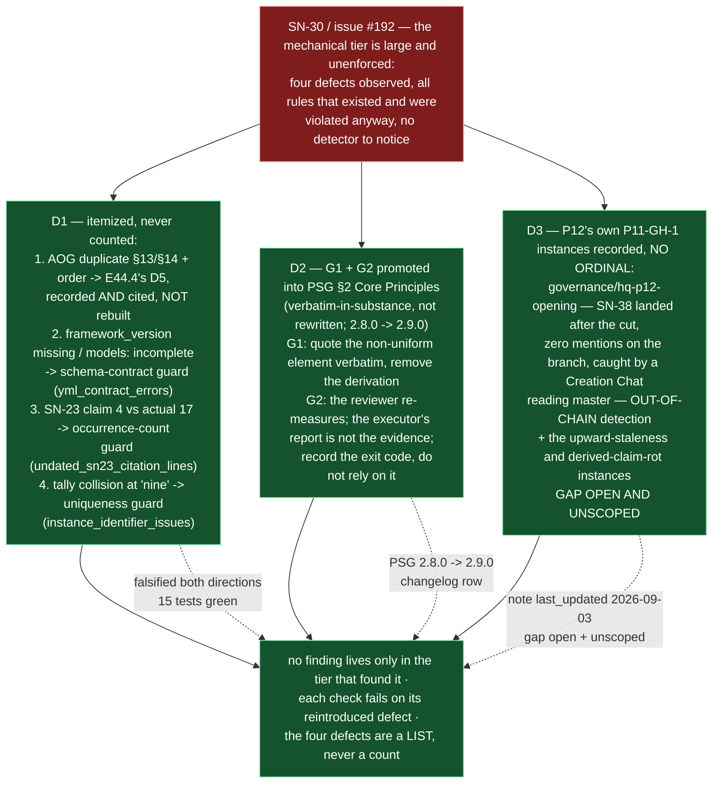

# Delivery Notice: P12-M44-E44.6 — Findings Made Durable in the Tier That Owns Them

> **`pr_number`/`pr_url` are recorded now that the PR exists (PR #261).** The remaining
> `merge_details` fields — `merge_commit` / `merge_timestamp` / `merge_strategy` —
> describe a merge that has not happened and are **unfillable at delivery time**
> (`P10-GH-4`, restated, not filled with invented values).

## Summary

**Three findings moved into the tier that owns them.** **D1** — the four observed defects
(issue #192 Finding 2) are itemized, never counted, in a committed record; defect #1 is
recorded-and-cited to **E44.4's D5** (built nothing — one detector, one check, one
falsification), and defects #2/#3/#4 each get a mechanical guard in
`tests/test_findings_durable_in_owning_tier.py` (15 tests) that **fails when its defect is
reintroduced** — proven, both directions, on the real corpus. **D2** — G1 and G2 promoted
into **PSG §2 Core Principles** (verbatim-in-substance, not rewritten), version `2.8.0 →
2.9.0`, so an Epic spec cites rather than restates. **D3** — P12's own `P11-GH-1` instances
recorded against the carry-forward note, **no ordinal**, gap still **open and unscoped**.

## Verification layer, time and scope (`P11-GH-2`) — and the REF

| Axis | Value |
|---|---|
| **Layer** | **Literal file text** on disk (`git diff`, `git show`, `grep`) plus executed `pytest`. Not a rendered view. |
| **Time** | **2026-09-03** |
| **Scope** | **`ai-project-system` only.** Branch **`epic/P12-M44-E44.6`**, branched from **`origin/milestone/M44` @ `9fff3da`** (merge-base verified identical). **Drivr is not touched by this epic.** Touched set: `tests/test_findings_durable_in_owning_tier.py` (new), the D1 record (new), `governance/PROJECT-SYSTEM-GUIDELINES.md` (G1/G2 promotion + version), `docs/phases/P11__Drivr_Coordination_Over_Rented_Execution/P11__carry-forward-note__P11-GH-1-mid-flight-amendments-do-not-reach-working-branches.md` (P12 instances). `bin/ai-project-init`, the AOG renumber (E44.4's), the `P11-GH-1` fix, SN-30 Recs 3–5, and Drivr are **untouched**. |
| **Refs** | Branch point `9fff3da`. Suite at the branch point: **752 tests (751 passed / 1 skipped)** — E44.4/E44.5 re-measured; on this branch: **767 tests, 766 passed / 1 skipped / 0 failed** (`AI_PROJECT_SKIP_LIVE_ENDPOINT_TESTS=1 PYTHONPATH=. pytest -q`; bare `pytest` fails collection). The 1 skip is the pre-existing live-ComfyUI endpoint integration test — environmental (endpoint not reachable from this host), unrelated, not introduced here. **+15 tests, no skip introduced.** The Starter's Suite Baseline (740) is stale — re-measured on `milestone/M44` at `9fff3da`: 752. |
| **Document versions cited** | PSG **v2.8.0 @ branch point → v2.9.0** on this branch. Carry-forward note `last_updated` `2026-08-04 → 2026-09-03`. |

**Model verification (P9-M31-E31.3 — required, this instance is manual):** harness-reported
identity **`opencode-go/deepseek-v4-flash-vision-exp`** vs `.ai-project.yml`
`models.epic_manual: remote:deepseek-v4-flash` (read, not trusted). Both present and
**DISAGREE** on route (`opencode-go` vs route-less `remote:`) and model suffix
(`vision-exp`); the route disagreement the config's own comment records as deliberate
("`remote:<name>` records WHICH MODEL, NOT WHICH ROUTE"). Per `model_verification:
advisory` (SN-40) the mismatch is stated plainly and this instance proceeded. Full text in
the D1 record.

**P11-GH-1 backstop, run before delivery:** `git log 9fff3da..HEAD -- <milestone spec;
E44.6 spec; E44.6 starter; PSG; AOG; opening ruling; carry-forward note>` returns only
this epic's own commits — **no amendment** to any artifact this Starter restates a rule
from arrived during execution. The PSG and the carry-forward note were read **from the
artifact on this branch** at each step, not from memory (G2).

---

## Deliverables

### D1 — Mechanical checks for defects #2/#3/#4; defect #1 recorded-and-cited ✅

**The four observed defects, itemized** (recorded in full, with live status re-measured —
G2, not inherited from the 2026-08-10 assessment — and the two-direction falsification, in
`P12-M44-E44.6__record__findings-durable-and-falsified.md`):

1. **AOG duplicate `§13`/`§14` + out-of-order sections** — **E44.4's D5** owns it
   (uniqueness **and** monotonicity). E44.6 records the finding and cites E44.4's check
   (`tests/test_aog_section_numbering.py`); **builds nothing** (one detector, one check,
   one falsification — a second would re-import the fragile fence detector). Live status:
   **fixed** by E44.4 (verified: D5's real-corpus test green on this branch).
2. **`.ai-project.yml` schema contract (framework_version / models:)** — guard
   `yml_contract_errors()`: asserts the five §4-required fields present, the `models:`
   block complete (all seven keys, each a well-formed `remote:|local:` route), and
   `framework_version`, when present, a pinned semver per rule 26 (absence valid —
   P10-GH-1). Live status: the schema-validation **mechanism** already exists (E38.3 /
   P10-GH-5); the repo's own `.ai-project.yml` is §4-valid (re-measured) and carries all
   seven `models:` keys. The **`bin/ai-project-init` producer side** is **recorded only,
   not fixed** (checks epic, not a producer fix). **Falsified**: dropping `epic_qa` → red;
   `framework_version: latest` → red; dropping `governance.ref` → red; restore → green.
3. **E36.1 claimed 4 bare `SN-23` refs; actual 17** — guard
   `undated_sn23_citation_lines()`: occurrence-oriented (a line with both a dated and a
   bare form still surfaces the bare form — E36.1's undercount class), exempting changelog
   rows and bare-identifier mentions (E36.1's recorded non-citation classes), over the two
   citation-bearing normative bodies (AOG, chat-hierarchy.md). Live status: the specific
   count error is **fixed** in E36.1 v1.1; the **class** is now guarded. **Falsified**:
   undoing E36.1's date-qualification on a real AOG citation line → red (`[124]`); restore
   → green.
4. **Count-error tally collision at "nine" (E38.3/E38.5, stale base of eight)** — guard
   `instance_identifier_issues()`: flags two records sharing a non-None ordinal (the stale-
   base shape) and duplicate ids; plus a corpus check the carry-forward note does not cite
   an instance by a bare ordinal. Live status: the specific collision is **reconciled**
   (M38 v1.1.4; tally is a floored record, never a running integer); the **class** is now
   guarded. **Falsified**: both at ordinal `9` → "duplicate ordinal 9" — red; distinct
   ordinals → green.

`tests/test_findings_durable_in_owning_tier.py` — **15 tests**, all green.

### D2 — G1 and G2 promoted into the core document ✅

**Placement decision (delegated): the PSG (`PROJECT-SYSTEM-GUIDELINES.md`), §2 Core
Principles.** Reason: both rules are about how executors and reviewers *write and verify* —
project-system principles governing the record and the verification of it — and the PSG is
the highest-authority core document. They are promoted **verbatim-in-substance, not
rewritten** (GBinding Constraint 3), in their generalized (E38.6) form, each with its
origin recorded (M37 original → E38.6 generalized). Version `2.8.0 → 2.9.0`, changelog row
added; the G2 tie to `governance-propagation.md`'s *automated checks do not confer
acceptance* is an explicit cross-reference, not a redefinition. **Epic specs may now cite
§2 rather than restate G1/G2.**

### D3 — P12's `P11-GH-1` instances recorded ✅

**Placement decision (delegated): all of P12's instances join the same carry-forward note.**
Recorded in `P11__carry-forward-note__P11-GH-1-mid-flight-amendments-do-not-reach-working-branches.md`,
under a new "Instances recorded in P12" section, **each cited by artifact and defect, never
by ordinal** (the tally is ruled unusable). Three instances:

- **P12 phase spec on `governance/hq-p12-opening`** — cut from `master` at `19c77ab`; SN-38
  landed at `3eda074`, amended at `afe5d79`, both after the cut; the branch carried zero
  occurrences of `SN-38`/`Deepseek`/`epic_qa`; caught by a **Creation Chat reading
  `master`** (out-of-chain, SN-39); resolved by merging `master` (`0a19563`) and
  reconciling before `#215` merged (`8f5fb7c`).
- **M41 milestone spec v1.1.0 citing the F6 ruling absent from `milestone/M41`** — the
  **upward** half (a child branch behind its parent citing content it does not have);
  recorded in `P12-M41__milestone-spec.md` v1.1.1 (2026-08-20).
- **E41.1 spec v1.0.2's "R6 citation does not yet resolve"** — a claim whose premise moved
  when `#221` merged; a resolving citation pointing at rotted content (`P12-GH-3` class);
  corrected at v1.0.3.

**Gap left open and unscoped.** The note still records the gap as open and unscoped; its
`last_updated` is `2026-09-03`; amending a prior phase's note from a later phase is
established practice (`P10-GH-2`, `P11-M36-E36.5`).

### Structural diagram ✅

Mermaid, fenced, in-repo, **no ComfyUI** — proposed-track (AOG §17.3/§17.6), below.

---

## Design decisions (delegated — decided, documented, proceeded)

| # | Decision | Outcome |
|---|---|---|
| 1 | **The shape of the D1 checks** | Guard + falsify by mutation (mirrors E44.4): a guard per defect that passes on the current corpus and is shown red by reintroducing the defect into a copy. `bin/ai-project-init`'s producer side of #2 recorded, not fixed (checks epic). |
| 2 | **Which core document receives G1/G2** | **The PSG** (§2 Core Principles) — the highest-authority core doc; both rules govern the record and its verification. Version `2.8.0 → 2.9.0`. |
| 3 | **Whether P12's further instances join the note** | **Yes, all of them** — the primary out-of-chain instance plus the upward-staleness and derived-claim-rot instances, each by artifact+defect, never by ordinal. |

---

## Definition of Done — every item

- [x] SN-30 Rec 1's checks exist under `tests/` and **fail when their defect is
      reintroduced** — demonstrated both directions per defect in the D1 record
- [x] The four defects are itemized, never a bare count (D1 record; the guard's own
      itemized output)
- [x] Defect #1 is **not duplicated** against E44.4's D5 — recorded and cited, nothing built
- [x] G1 and G2 live in a core document (PSG §2), promoted verbatim-in-substance; Epic specs
      may cite but need not restate
- [x] The carry-forward note carries P12's instances with dated commits and the out-of-chain
      detection path, **no ordinal**, and still records the gap as **open and unscoped**
- [x] Structural diagram (Mermaid, in-repo, no ComfyUI) present
- [x] Suite green — **767 tests, 766 passed / 1 skipped / 0 failed**, no skip introduced by
      this epic, invocation `AI_PROJECT_SKIP_LIVE_ENDPOINT_TESTS=1 PYTHONPATH=. pytest -q`
      and ref `9fff3da` stated (the 1 skip is the pre-existing live-ComfyUI integration
      test, environmental)
- [x] Delivery Notice committed; PR opened to `milestone/M44` (#261)

## Acceptance Criteria

- [x] SN-30 Rec 1's checks exist under `tests/` and fail when their defect is reintroduced
- [x] G1 and G2 live in a core document; Epic specs may cite but need not restate
- [x] The carry-forward note carries P12's instance with dated commits and its out-of-chain
      detection path, **no ordinal**, and still records the gap as **open and unscoped**
- [x] Every claim states the layer, time and scope — and the **ref** — at which it was
      verified (this notice's Verification section; the D1 record)

---

## Visual Bindings

**Visual binding**
- **Link:** (inline — Structural diagram; no hosted link needed per AOG §17.3/§17.5)
- **What:** diagram
- **Level:** Epic
- **State:** proposed

- **Description (implemented):** E44.6 promotes findings into the tier that owns them. SN-30
  Rec 1 built a mechanical guard for each observed defect — itemized, never counted — with
  defect #1 recorded-and-cited to E44.4's D5 (nothing rebuilt), and #2/#3/#4 guarded in
  `tests/test_findings_durable_in_owning_tier.py`, each proven red by reintroducing its
  defect into a copy of the real corpus. Rec 2 promoted G1 and G2 out of an epic spec into
  PSG §2 Core Principles (verbatim-in-substance, version 2.9.0). P12's own `P11-GH-1`
  instances — the out-of-chain `governance/hq-p12-opening` detection, plus the upward-
  staleness and derived-claim-rot instances — are recorded against the carry-forward note,
  cited by artifact and defect, no ordinal, the gap left open and unscoped. Proposed-track
  Structural diagram (AOG §17.3/§17.6), Mermaid, no ComfyUI.

---

## Status

⏸️ **Stopped. Awaiting Milestone Chat review and authorization. Not merged.** Per this
epic's Starter: merge authorization for this PR normally follows the Milestone Chat's
Stage-2 review, and the parent (the M44 Milestone Chat) performs the merge. This delivery
is the **first attempt** — the rework limit (3 attempts plus any written `+1`, PSG §11.6)
has not been touched.

Epic E44.6 execution complete. Epic Delivery Notice produced. Awaiting Milestone Chat
review and authorization.
