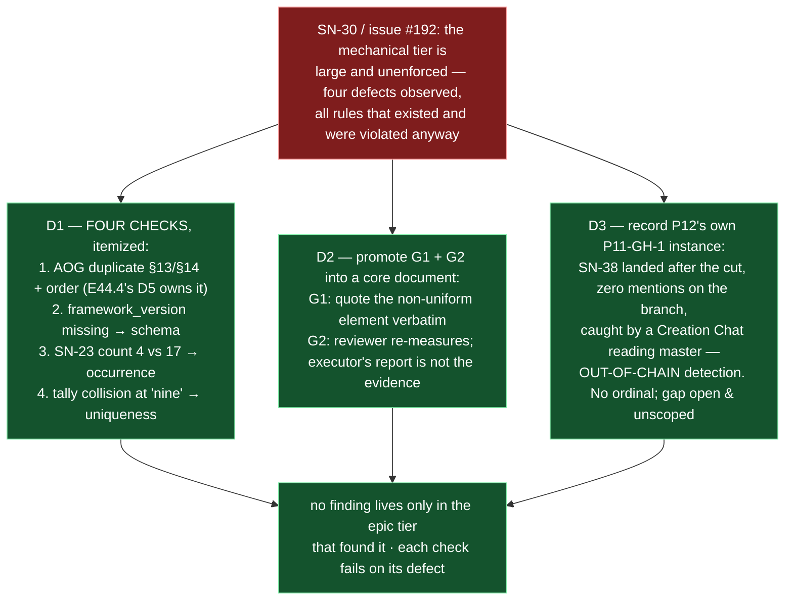

# Epic E44.6 — Findings Made Durable in the Tier That Owns Them

## Context

Three findings from the 2026-08-19 opening ruling (Decision 5, executing SN-30) and SN-39 land here,
each the same shape: **a thing that should be recorded mechanically is recorded nowhere, or recorded
in the wrong tier.**

- **SN-30 Rec 1** — the external assessment (issue #192) observed **four defects**, all in the
  mechanical tier: rules that existed, were correct, and were **violated anyway** — evidence about the
  enforcement mechanism, not about the rules. The pattern for checking them already exists here twice
  (`test_starter_lint.py`, `test_steering_note_id_uniqueness.py`).
- **SN-30 Rec 2** — **G1 and G2** are general rules living in an **epic spec**, restated with
  re-explained provenance per epic. Every new epic must rediscover or re-cite them. The Phase Chat has
  applied G2 at every review this phase, by memory of an epic spec each time.
- **P12's own `P11-GH-1` instance** — the mid-flight-amendment gap fired **inside the phase that owns
  the gap**, on HQ's own branch, and was caught by a chat **outside the parent chain**. It must be
  recorded against the carry-forward note, without restarting the tally.

## Problem Statement

**Findings are trapped in the wrong tier, or not written down at all.**

- Four observed defects have no mechanical checks, so they were *"unchecked; survived ten phases"* —
  each a rule that existed and was correct, violated anyway, with no detector to notice.
- G1 and G2 are the highest-value general rules in the corpus and the most fragile, carried by
  convention rather than the normative tier — cited from memory at every review.
- P12's own `P11-GH-1` instance has a detection path unlike every case on file (outside the parent
  chain), and it is unwritten; its absence from the note would let a future remedy be designed against
  the old, narrower threat model.

## Goals

By the end of this Epic, the system must:

1. **Build mechanical checks** for the four observed defects, so each fails when its defect is
   reintroduced.
2. **Promote G1 and G2 into a core document** — where epic specs cite rather than restate them.
3. **Record P12's `P11-GH-1` instance** against the gap record's carry-forward note, no ordinal, gap
   still open and unscoped.

## Non-Goals

This Epic explicitly does **not** aim to:

- **Scope `P11-GH-1` as work to fix.** Ruling Decision 12 stands: it is **not** P12 work — recording
  evidence only, never reopening the fix.
- **Build the observability tier** (SN-30 Rec 3, deferred with its trigger).
- **Reduce exposition linearly** (SN-30 Recs 4-5, deferred).
- **Change G1 or G2.** They are promoted verbatim-in-substance, not rewritten.
- **Fix the AOG numbering.** E44.4 owns the renumber; this epic's defect-#1 check coordinates with, not
  duplicates, E44.4's D5.

## Scope of Work

### 1. The four mechanical checks (D1)

Itemize the four observed defects (issue #192, Finding 2) and build one mechanical check for each, so
each **fails when its defect is reintroduced**:

| # | Defect | Checkable by | Status at assessment |
|---|---|---|---|
| 1 | `AI-OPERATING-GUIDELINES.md` has two `§13`s, two `§14`s, and out-of-order sections `…9, 13, 14, 10…16, 15`, with two "Error Handling" titles | heading uniqueness + monotonicity | unchecked, survived ten phases |
| 2 | `.ai-project.yml` missing `framework_version`; `bin/ai-project-init` writes neither `framework_version` nor `models:` | schema validation | unchecked (`P10-GH-5`, M38/E38.1 Finding 2) |
| 3 | E36.1 claimed **4** bare `SN-23` references; actual **17** | occurrence count | unchecked, caught at Stage-2 review |
| 4 | Count-error tally collision at "nine" — E38.3/E38.5 each incremented from a stale base of eight | identifier uniqueness | unchecked (E38.6 Finding 1) |

> **⚠ Defect #1 is E44.4's, in full — ruled at phase level (2026-09-03).** E44.4's D5 is now extended
> to assert **ascending `1..n` with no gaps** as well as uniqueness, so it is defect #1's complete
> heading-uniqueness-and-monotonicity check. **E44.6 builds nothing for defect #1**: it records heading-
> uniqueness-and-monotonicity as the finding, and **cites E44.4's check** as the coverage. One detector,
> one check, one falsification — a second E44.6 check would re-import the fragile fence detector and
> double the surface where a desync at `:134` can lie. The remaining checks are defects #2, #3 and #4.

**Must include:** each check, named, with a falsification demonstration (reintroduce the defect → check
fails → restore → green); and the itemized list, never a bare count.

### 2. G1 and G2, promoted (D2)

Promote G1 and G2 into a core document (E44.6's choice of which), verbatim-in-substance:

- **G1** — *quote the non-uniform element verbatim rather than describing it* (remove the derivation
  step).
- **G2** — *the reviewer re-measures; the executor's report is not the evidence; record the exit code,
  do not rely on it.*

Epic specs may cite them and need not restate them.

### 3. The `P11-GH-1` instance, recorded (D3)

Record P12's instance against
`docs/phases/P11__Drivr_Coordination_Over_Rented_Execution/P11__carry-forward-note__P11-GH-1-mid-flight-amendments-do-not-reach-working-branches.md`.
**The facts (phase spec):** `governance/hq-p12-opening` was cut from `master` at `19c77ab`; SN-38 landed
at `3eda074` and was amended at `afe5d79`, both **after** the cut; the phase spec on that branch carried
**zero** occurrences of `SN-38`, `Deepseek` or `epic_qa`; a Creation Chat reading `master` found it
(SN-39) — not the level below, not any mechanism; resolved by merging `master` (`0a19563`) and
reconciling before `#215` merged (`8f5fb7c`).

**Cite by artifact and defect, never by ordinal** — the note records *two* instances, P11's closure
counts *four*, and the tally is ruled unusable. **Records evidence; does not reopen the fix.** The gap
stays **open and unscoped**.

## Deliverables

- [ ] **D1** — One mechanical check per observed defect, each failing when its defect is reintroduced;
      the itemized list, never a count
- [ ] **D2** — G1 and G2 promoted into a core document, cited-not-restated by epic specs
- [ ] **D3** — P12's `P11-GH-1` instance recorded, no ordinal, gap open and unscoped
- [ ] Structural diagram (Mermaid, in-repo, no ComfyUI)
- [ ] **Epic Delivery Notice**

## Binding Constraints

Settled above this epic — **not re-decidable here**:

1. **`P11-GH-1`'s instance records evidence and does NOT reopen the fix** (Ruling Decision 12). Cite by
   artifact and defect, never by ordinal.
2. **SN-30 Recs 3, 4 and 5 remain deferred** with their triggers. Not reopened here.
3. **G1 and G2 are promoted, not rewritten.**

## Hard Constraint (binding — carried to every Epic)

- **Execution posture: `manual` / paid frontier.** This epic writes a gap record and promotes general
  rules into the constitution. **The instance must be manual for the same reason the whole milestone
  is.**
- **Itemize, never count.** The four defects are a list; a bare count of checks is a defect.
- **Fence-awareness is not optional.** Any pass over a normative document (the AOG, in defect #1)
  distinguishes real content from quoted examples, and states how — the E44.4 lesson (odd fence-line
  parity, `:134`'s indented four-backtick marker) applies to any fence-aware work here.
- **Falsify before trusting — in both directions.** Prove each check by reintroducing its defect.
- **Record the practice before improving it.**
- **State the layer, time and scope of every claim** (`P11-GH-2`) **and the REF.**
- **Cite by heading, not number** (E44.4 renumbers the AOG).

## Design Decisions Delegated — decide, document, proceed

1. **Which core document receives G1 and G2** — E44.6's. The two candidates are PSG and AOG; the choice
   is recorded with its reason.
2. **Whether P12's further `P11-GH-1` instances join the same note** — E44.6's, provided none is cited
   by ordinal. (The phase has produced further instances: branch staleness corrected 2026-08-20, and an
   artifact whose claim rotted when its premise merged.)

## Definition of Done

Epic E44.6 is complete when:

- [ ] SN-30 Rec 1's checks exist under `tests/` and fail when their defect is reintroduced
- [ ] G1 and G2 live in a core document; epic specs may cite but need not restate
- [ ] The carry-forward note carries P12's instance with dated commits and its out-of-chain detection
      path, **no ordinal**, and still records the gap as **open and unscoped**
- [ ] Suite green — no skip introduced — with the invocation and the ref stated
- [ ] Delivery Notice committed; PR opened to `milestone/M44`

## Acceptance Criteria

- [ ] SN-30 Rec 1's checks exist under `tests/` and fail when their defect is reintroduced
- [ ] G1 and G2 live in a core document; epic specs may cite but need not restate
- [ ] The carry-forward note carries P12's instance with dated commits and its out-of-chain detection
      path, **no ordinal**, and still records the gap as **open and unscoped**
- [ ] Every claim states the layer, time and scope — and the **ref** — at which it was verified

## Technical Constraints

**In scope:** new checks under `tests/`; the chosen core document for G1/G2 (PSG or AOG); the
`P11-GH-1` carry-forward note.
**Do not touch:** the AOG renumber itself (E44.4's); the `P11-GH-1` fix (unscoped); SN-30 Recs 3-5;
Drivr.
**Repository:** `ai-project-system` only.
**Invocation:** `PYTHONPATH=. pytest -q` — bare `pytest` fails collection. Baseline re-measured on
`milestone/M44`: **740 passed** (the milestone spec's `549` is stale).

## Dependencies

**Internal**
- **E44.4** — defect #1's heading-uniqueness check is E44.4's D5; coordinate, do not duplicate.
- **The external assessment (issue #192)** — defect #1-4 are itemized there, re-measured here.

**External**
- None. This epic does not cross repositories.

**Blockers**
- None at planning.

## Timeline

**Estimated Effort:** 1–2 sessions (four checks, G1/G2 promotion, one note).
**Target Completion:** before P12 closes.
**Actual Completion:** In progress.

## Execution Notes

**Order:**
1. Itemize the four defects; **re-verify each is still live on this branch** (G2) — some may have been
   fixed since the 2026-08-10 assessment (M38/M42/M43 landed between).
2. Coordinate defect #1 with E44.4's D5 (do not build it twice).
3. Build the checks; prove each by falsification.
4. Promote G1/G2 into the chosen core document.
5. Record the `P11-GH-1` instance (no ordinal; gap open/unscoped).
6. Run the suite; state the invocation and the ref.

**Traps:**
- Emitting a bare count ("four checks") instead of the itemized list.
- Duplicating E44.4's D5 for defect #1.
- Citing the `P11-GH-1` instance as "the Nth instance" — the ordinal reproduces the filed defect.
- Reopening the `P11-GH-1` fix (Ruling Decision 12 stands).
- Rewriting G1/G2 instead of promoting them verbatim-in-substance.

## Related Documents

- [M44 Milestone Spec](P12-M44__milestone-spec.md) — v1.2.1 E44.6 Epic Detail, X4 finding, Hard
  Constraint, Binding Constraints
- [2026-08-19 opening ruling](.ai-project/artifacts/rulings/2026-08-19__ai-project-system-hq__ruling__p12-opening-and-sn-30-37-triage.md) —
  Decision 5 (SN-30 Recs 1-2 placed here)
- [SN-30 steering note](.ai-project/artifacts/steering-notes/2026-08-11__creation-chat__steering-note__external-assessment-routing.md) —
  the four defects' verification
- [Issue #192](https://github.com/panchew/ai-project-system/issues/192) — the external assessment,
  Finding 2 (the four defects) and Finding 3 (G1/G2)
- [P11-GH-1 carry-forward note](../../P11__Drivr_Coordination_Over_Rented_Execution/P11__carry-forward-note__P11-GH-1-mid-flight-amendments-do-not-reach-working-branches.md)
- [P12 Phase Spec](P12__phase-spec.md) — the P11-GH-1 instance facts
- [PROJECT-SYSTEM-GUIDELINES.md](../../../governance/PROJECT-SYSTEM-GUIDELINES.md)
- [AI-OPERATING-GUIDELINES.md](../../../governance/AI-OPERATING-GUIDELINES.md)

## Visual Bindings

**Visual binding**
- **Link:** (inline — Structural diagram; no hosted link needed per AOG §17.3/§17.5)
- **What:** diagram
- **Level:** Epic
- **State:** proposed

- **Description:** E44.6 promotes findings into the tier that owns them. SN-30 Rec 1 builds a mechanical
  check for each of the four observed defects (itemized from issue #192, with defect #1 coordinated
  against E44.4's own D5 check), Rec 2 promotes G1 and G2 out of an epic spec into a core document, and
  P12's own P11-GH-1 instance is recorded against its carry-forward note with its out-of-chain detection
  path — no ordinal, the gap left open and unscoped. Proposed-track Structural diagram (AOG §17.3/§17.6),
  Mermaid, no ComfyUI.

## Notes

- **The input itself is a count, and this epic itemizes it.** The ruling, the phase spec and this
  milestone all say *"four observed defects"* as a count; the itemization lives in issue #192's Finding 2
  table. D1 records the four as a list, per the milestone's own Hard Constraint (*itemize, never count*) —
  which is the same lesson the assessment was teaching from the other side.

- **Defect #1 is E44.4's in full — ruled, not merely flagged.** The AOG duplicate-`§13`/`§14` heading
  defect is exactly what E44.4 repairs and guards with its D5, and the Phase Chat ruled (2026-09-03) that
  **monotonicity belongs in E44.4's D5, not E44.6**. The reasons, in order of weight: D2 already commits
  to `1..n`, so a uniqueness-only check would let D2's own output rot silently; the fence detector is the
  fragile part and E44.4 already owns it; and E44.6's subject is the finding *class*, not this specific
  numbering. So E44.6 records the finding and cites E44.4's check — it builds nothing for defect #1.

## Changelog

| Version | Date | Change |
|---|---|---|
| 1.0.1 | 2026-09-03 | **Records the Phase Chat's ruling that defect #1 belongs to E44.4 in full** (set-6 boundary). E44.4's D5 is extended to assert monotonicity (ascending `1..n`, no gaps) as well as uniqueness, so E44.6 builds **no** check for defect #1 — it records heading-uniqueness-and-monotonicity as the finding and cites E44.4's check. One detector, one check, one falsification; E44.6 builds only the #2/#3/#4 checks. No scope, ordering, gate or acceptance-criterion change. |
| 1.0.0 | 2026-09-03 | Initial E44.6 spec, from M44 milestone spec v1.2.1 E44.6 Epic Detail and Decision 5 of the 2026-08-19 opening ruling. Itemizes the four observed defects (issue #192), delegates the G1/G2 core-document choice and the further-instance question, and records P12's P11-GH-1 instance from the phase spec's facts — no ordinal, gap open/unscoped. Flags the defect-#1/E44.4-D5 overlap for coordination. No scope, ordering, gate or acceptance-criterion change from the milestone spec. |
