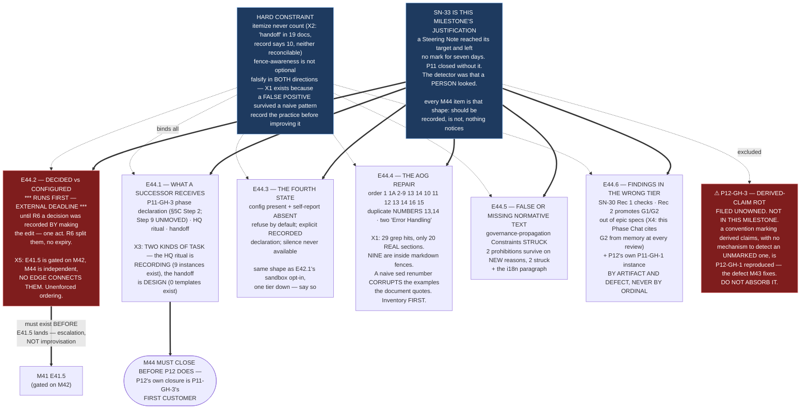

# Milestone M44 — Rituals, Records, and the Normative Repairs

## Purpose

**The continuity tier is the thinnest thing this framework has, and P11 proved it by needing it.**

Every level below Phase hands its successor a closure artifact before its parent's gate. **Phase hands
over nothing** — §5C Step 2 names no artifact, no path and no template, so P11's verification
checklist and phase summary landed in a **PR comment**. HQ is re-opened routinely and the normative
tier says nothing about how. A chat that exhausts its context has no handoff artifact to write. And
since the R6 ruling, **a decision and its configuration are two different facts about one row**, which
this corpus has never had to hold apart.

This milestone ensures:

- **A successor at any level receives a defined artifact** — phase closure, HQ re-instantiation,
  context exhaustion.
- **A reader can tell a decided-and-configured row from a decided-and-pending one** — before E41.5
  needs it.
- **Normative documents state only what is true**, and their sections can be cited unambiguously.
- **Findings live in the tier that owns them**, not in the epic spec that happened to discover them.

**P12's own closure is `P11-GH-3`'s first customer.** M44 must complete before P12 closes, and
closing P12 without the artifact M44 builds would be a defect against the phase's own product.

---

## Problem Statement

**SN-33 is this milestone's justification and its warning.** A Steering Note reached its target and
left no mark for seven days; P11 closed without it. **The mechanism that carries concerns upward
dropped one silently, and nothing detected the drop — the detector was that a person looked.**

M44's items are all the same shape: **a thing that should be recorded, is not, and no mechanism
notices.** The Phase Completion Declaration that does not exist. The HQ ritual practised nine times
and written zero. The handoff that appears as prose in nineteen documents and as a template in none.
The constraints in `governance-propagation.md` that are verifiably false. **Each is invisible until
someone needs it.**

**HQ has warned twice that M44 must not become "the milestone things get put in."** That warning is
taken here structurally: **six epics, each with a stated organizing question**, and one — `P12-GH-3`,
derived-claim rot — **deliberately excluded and filed unowned** rather than absorbed, on the reasoning
that a convention with no mechanism to detect an unmarked claim is `P12-GH-1` reproduced.

---

## ⚠ Findings measured at planning time — five

**Measured by the Phase Chat on `phase/P12` at the R6 sync, 2026-08-20** (G2). Verification boundary
with each, per `P11-GH-2`.

### X1 — The AOG repair must be **fence-aware**, and a naive renumber would corrupt the document

**Every claim in the ruling verifies exactly.** Fence-aware inventory of `AI-OPERATING-GUIDELINES.md`:

- Section order: **`1, 1A, 2, 3, 4, 5, 6, 7, 8, 9, 13, 14, 10, 11, 12, 13, 14, 16, 15`** — as recorded.
- **Duplicate numbers: `13` and `14`**, each appearing twice.
- **Two sections share the title "Error Handling"** — `## 13.` at `:701`, `## 14.` at `:861`.

**What is not recorded, and changes how the repair must be built:** a naive `grep '^## '` finds
**29 matches. Only 20 are real sections. Nine are inside ```markdown fences** — example artifact
bodies quoted inside the normative document (`Milestone Summary`, `Closure Confirmation`,
`Completion Criteria Evaluation` ×2, `Epic Review Seal`, and others).

**So a `sed`-based renumber, or a cross-reference sweep that rewrites `§13` wherever it appears, would
rewrite the examples the document quotes** — corrupting template bodies inside the guidelines while
appearing to succeed. **E44.4 must build a fence-aware inventory before it changes anything**, and its
cross-reference sweep must distinguish a citation from an example.

> **This finding exists because the Phase Chat generated a false one and caught it.** A naive
> heading scan reported **a second duplicate title** — `## Completion Criteria Evaluation` at `:398`
> and `:413`. **Both are inside ```markdown example blocks.** The corpus's own warning is *falsify a
> pattern before trusting a zero result*; **this is the same defect with the sign flipped — a false
> positive from the identical cause**, and it was caught by reading context rather than by any check.
> **The near-miss is the argument for the fence-aware inventory**, so it is recorded rather than
> quietly dropped.

*Verified by a fence-tracking parse of the file, repo, 2026-08-20.*

### X2 — "Handoff" appears in **nineteen** governance documents, not ten

SN-31 Carry-Over 2 and the phase spec both say *"'Handoff' appears as prose in ten documents."*
Measured with `grep -ril 'handoff' governance/`: **nineteen.**

**The pattern is stated because that is the whole lesson.** Ten and nineteen may both have been right
against different patterns at different dates — and **neither can be reconciled from the artifacts**,
which is precisely M43's W2 finding arriving in a second milestone. **E44.1 states its set as an
itemized list**, not a count, and every later claim cites the list.

*Verified by `grep -ril 'handoff' governance/`, repo, 2026-08-20. Case-insensitive, files-with-matches, `governance/` only.*

### X3 — The HQ ritual is **recording, not designing**, and the handoff genuinely does not exist

Two premises checked because they point opposite ways:

- **`.ai-project/artifacts/hq-openers/` holds exactly nine instances.** SN-35's correction is right:
  **the practice exists and is undocumented.** E44.1 records the convention already followed — it does
  not invent one, and inventing one would discard nine instances of evidence about what the practice
  actually is.
- **There is no handoff template and no handoff artifact type.** Confirmed by listing
  `governance/templates/`. That half **is** design work, and the two halves of E44.1 should not be
  scoped as though they were the same kind of task.

*Verified by `ls .ai-project/artifacts/hq-openers/` (9) and `ls governance/templates/` (no handoff), repo, 2026-08-20.*

### X4 — G1 and G2 are in epic-tier artifacts, and Rec 2's premise holds

`G1`/`G2` appear together in `P11-M37-E37.1`'s spec and delivery notice, `P11-M38-E38.6`'s delivery
notice, and `P11-M39-E39.3`'s spec — **all epic-tier**. **They are general rules living in artifacts
scoped to one epic**, which is SN-30 Rec 2's claim and it survives measurement.

**The cost is concrete rather than theoretical:** this Phase Chat has applied **G2** — *the reviewer
re-measures* — at every review in this phase, and cited it from memory of an epic spec each time.
**Every new chat must rediscover or re-cite them.**

*Verified by `grep -rln` across `docs/phases/P11*/` and `governance/`, repo, 2026-08-20.*

### X5 — E44.2's deadline is real and **nothing in the graph enforces it**

HQ made the sequencing binding: **the decided-but-unconfigured convention must exist before E41.5
lands.** But **E41.5 is gated on M42's closure, M44 is independent of both, and no edge connects
them.** The ordering is achievable and **entirely unenforced** — it holds only if someone sequences it
deliberately.

**So E44.2 is this milestone's first epic**, for a reason external to M44's own logic. If E41.5
reaches the point of needing the convention and M44 has not delivered it, **that is an escalation, not
an improvisation** — M41 must not invent a convention M44 would then have to change.

*Verified against the phase spec's Milestones section and M41's spec v1.3.0, repo, 2026-08-20.*

---

## Binding Constraints (settled — NOT for re-debate)

1. **§5C Step 9's declaration is unmoved.** It records the merge commit, tag and head — none of which
   exist at Step 2. **The new artifact is additional, not a relocation.**
2. **The AOG renumber is NOT a hotfix** (ruling Decision 6). Cross-references by number are
   load-bearing normative text; the sweep travels with the renumber in the same epic, with a version
   bump.
3. **`governance-propagation.md`'s disposition is ruled, per statement** (ruling Decision 7): both
   Constraints struck; *"does not propagate automatically or implicitly"* **survives on a new reason**;
   *"Manual Enforcement… not automation"* **struck and replaced** by *automated checks do not confer
   acceptance*; *"No CLI or automation tooling"* **struck**; *"No automatic or live governance syncing"*
   **survives, re-scoped** as *not authorized today*. **M44 executes; it does not re-decide.**
4. **The HQ ritual is recorded, not designed.** Nine instances are the evidence of what it is.
5. **The i18n policy is decided** (SN-31 Carry-Over 10) — one paragraph, not a project.
6. **`P11-GH-1`'s instance records evidence and does NOT reopen the fix.** Ruling Decision 12 stands.
   **Cite by artifact and defect, never by ordinal** — the note records two instances, P11's closure
   counts four, the tally is ruled unusable, and *"the Nth instance"* reproduces the defect being filed.
7. **The decided-but-unconfigured convention must exist before E41.5 lands** (X5). Escalation, not
   improvisation.
8. **`P12-GH-3` (derived-claim rot) is NOT in this milestone.** Filed unowned with a trigger. **Do not
   absorb it.** A convention marking derived claims, with no mechanism to detect an unmarked one, is
   `P12-GH-1` reproduced — the defect M43 exists to fix.
9. **SN-30 Recs 3, 4 and 5 remain deferred** with their triggers. Not reopened here.

---

## Hard Constraint (binding — carries to every Epic)

**This milestone writes the records other work will depend on. A record that is wrong is worse than
one that is missing, because a missing record is visible.**

- **Itemize, never count.** X2 is the second milestone in a row where a recorded count did not
  survive re-measurement. **State the list and the pattern that produced it.**
- **Fence-awareness is not optional** (X1). Any pass over a normative document must distinguish real
  content from quoted examples. **State how the distinction was made.**
- **Falsify before trusting — in both directions.** X1 exists because a *false positive* survived a
  naive pattern until context was read.
- **Record the practice before improving it.** Where a convention already exists in the artifact record
  (the HQ ritual, nine instances), **the deliverable is a description that matches, not a design that
  supersedes.** A discrepancy between the nine and the written ritual is a finding, not a bug to fix
  silently.
- **State the layer, time and scope of every claim** (`P11-GH-2`).

---

## Planned Epics

Six epics, each with one organizing question. **E44.2 runs first for a reason external to this
milestone** (X5). The rest are parallel-safe.

- **E44.2** — The decided-but-unconfigured convention *(FIRST — external deadline)*
- **E44.1** — Continuity artifacts: what does a successor receive?
- **E44.3** — The fourth state: refuse by default, recorded declaration
- **E44.4** — The AOG repair: fence-aware renumber, cross-reference sweep, version bump
- **E44.5** — Normative text that is false or missing
- **E44.6** — Findings made durable in the tier that owns them

**Execution posture: `manual` / paid frontier for every epic.** These epics write the normative and
continuity tiers. Record `Execution Mode: manual` and `models.epic_manual` in every Epic Execution
Chat Starter.

---

## Epic Detail

### E44.2 — The decided-but-unconfigured convention *(FIRST — external deadline)*

**Organizing question: how does the record show that a decision is made and its configuration is
not?**

Until R6, this corpus recorded a decision **by making the edit** — one act. **R6 separated them**:
`phase`, `milestone` and `epic_manual` are decided and unconfigured on a trigger with **no expiry**.

**The failure mode is precise:** a reader assumes the file matches the ruling. **That is the divergence
the guards exist to catch, arriving in the prose, where no guard reaches** — and it is `P12-GH-3`'s
shape at the configuration layer.

**Deliverables**

1. **The convention**, defined once, for recording a decided-but-unconfigured state — what is written,
   where, and how a reader distinguishes it from a configured one.
2. **Its application to the case that forced it** — row P4 and the three carried rows — **specified,
   not performed.** E41.5 performs; **M44 must not reach into M41's epic.**
3. **A statement of what makes the two facts distinguishable without inference**, since inference is
   the failure mode.

**Acceptance criteria**

- [ ] A reader can tell a decided-and-configured row from a decided-and-pending one **from the record
      alone, without inferring either from the other**
- [ ] The convention is stated once, in a place E41.5 can cite
- [ ] Delivered **before E41.5 lands**; if E41.5 approaches that point first, **escalate**
- [ ] It does not perform M41's edit

---

### E44.1 — Continuity artifacts: what does a successor receive?

**Organizing question: at each level, what does the next session or reader actually get?** Three
artifacts, one question, **and two different kinds of task** (X3).

**Deliverables**

1. **`P11-GH-3` — a Phase Completion Declaration at §5C Step 2**, with a template at
   `governance/templates/phase-completion-declaration.md`. Marked `COMPLETE (awaiting consolidation)`;
   carries the verification checklist, milestone table and phase summary that in P11 lived in a PR
   comment. **§5C Step 2 names it; Step 6 reviews it; Step 9 is unchanged.**
2. **The HQ re-instantiation ritual, RECORDED** — in one normative place, naming the committed
   artifacts a re-opened HQ session receives and where openers live. **Derived from the nine existing
   instances** (X3); `hq-chat.md` and the opener template **cite it rather than restating it**. The
   Creation Chat's ritual (SN-26, P11-M36-E36.3) is the model. **Any discrepancy between the nine and
   the written ritual is reported, not silently normalized.**
3. **A context-exhaustion handoff artifact type and template**, with **the Drivr-side boundary
   stated** — harness context tracking is Drivr's, and the artifact must not assume it.
4. **The itemized list of the documents that mention handoff** (X2 — **nineteen** by this spec's
   pattern, ten by the record's), with the pattern stated, so the next re-measurement is comparable.

**Acceptance criteria**

- [ ] `governance/templates/phase-completion-declaration.md` exists; §5C Step 2 names it, Step 6
      reviews it, **Step 9 is untouched**
- [ ] One normative document describes HQ re-instantiation; `hq-chat.md` and the opener template cite
      rather than restate it; **it matches the nine instances, and any divergence is reported**
- [ ] A handoff artifact type and template exist, with the Drivr boundary stated
- [ ] The handoff-mention set is an **itemized list with its pattern**, not a count

---

### E44.3 — The fourth state: refuse by default, recorded declaration

**Organizing question: what does a manual chat do when its harness reports no model at all?**

**Ruled by HQ (R6 Decision 3), and this epic executes it.** `chat-hierarchy.md` defines three states —
both present and agree, both present and disagree, config-side absent. **It does not define
config-present + self-report-absent**, which is exactly where a non-Claude-Code surface lands.

**The ruling: refuse by default; proceed only on an explicit RECORDED declaration in the session's
first substantive response; silence never available.**

**Deliverables**

1. **The fourth state defined normatively** in `chat-hierarchy.md`'s Manual Chat Model Verification,
   alongside the existing three.
2. **The recorded-declaration exception specified** — what must be stated, by whom, and where it
   lands. **It matches E42.1's sandbox opt-in one tier down**, and the epic should say so: a
   fail-closed default with an explicit, recorded human opt-in is now a pattern in this framework, not
   a one-off.
3. **The framing HQ carried in:** write it for a corpus where **Claude Code is one surface among
   several.** Three of five verification targets ultimately move off the only harness where the check
   has ever been observed to work.
4. **A statement of why an exception exists at all** — `:304` already concedes the self-report is not
   independently verifiable, so **a recorded human declaration is the same epistemic strength with a
   named accountable party.** Without the exception the rule is a wall rather than a gate,
   unsatisfiable by construction for exactly the surfaces it exists to admit.

**Acceptance criteria**

- [ ] All four states are defined; none is reachable by silence
- [ ] The exception requires a recorded declaration in the first substantive response
- [ ] The text does not assume Claude Code
- [ ] The parallel to E42.1's opt-in is stated, not left for a reader to notice

---

### E44.4 — The AOG repair: fence-aware renumber, cross-reference sweep, version bump

**Organizing question: can every section of the AOG be cited unambiguously?** Today it cannot — **by
number** (`13` and `14` each appear twice) **or by title** (two sections are both "Error Handling").

**Deliverables**

1. **A fence-aware inventory FIRST** (X1). **20 real sections; 9 `##` lines inside ```markdown
   fences.** The inventory is a deliverable in its own right and precedes any edit.
2. **Sections renumbered `1..n`**, no duplicate number, no duplicate title.
3. **The cross-reference sweep**, corpus-wide, **distinguishing a citation from an example.** `§11.6`,
   `§11.6.1`, `§5C`, `§16.3` are cited across the corpus, the starters and multiple rulings. **A
   reference inside a quoted example is not a cross-reference.**
4. **An AOG version bump** and a changelog row. **Ruled explicitly not a hotfix** — a change that
   silently invalidates citations is worse than the defect.
5. **A check** that fails on a duplicate section number or title, **fence-aware**, with a falsification
   demonstration.

**Acceptance criteria**

- [ ] The fence-aware inventory is committed before any renumbering
- [ ] Sections are `1..n`, no duplicate number, no duplicate title
- [ ] Every cross-reference is updated; **no quoted example was rewritten** — shown, not asserted
- [ ] Version bumped, changelog row added
- [ ] The check fails when a duplicate is reintroduced

---

### E44.5 — Normative text that is false or missing

**Organizing question: does each normative statement say something true, for a stated reason?**

**Deliverables**

1. **`governance-propagation.md` amended per ruling Decision 7**, statement by statement. **Both
   Constraints struck** and replaced with a **dated** factual statement of current capability, plus the
   rule that a Constraints section carrying a technical claim is re-checked whenever the document is
   versioned. **Two prohibitions survive on new reasons; two are struck.** Version bump, changelog row.
2. **The i18n policy paragraph** — chat and output in the user's language; documentation remains in
   the original language; **English is authoritative**; translation on demand is a **view**, never the
   source.
3. **The reason recorded with each surviving prohibition**, not only the verdict — the point of SN-34
   is that a rule resting on an expired justification will be wrongly refused or quietly ignored, and
   both are worse than an amendment.

**Acceptance criteria**

- [ ] No Constraint in `governance-propagation.md` is false as measured on its amendment date, and the
      date is stated
- [ ] Each surviving prohibition carries **its own** reason; each struck one is recorded as struck
- [ ] The re-check-on-versioning rule is stated in the document
- [ ] The i18n paragraph is in the normative tier, one paragraph, and resolves the
      English-to-Spanish-adopter tension explicitly

---

### E44.6 — Findings made durable in the tier that owns them

**Organizing question: which findings are trapped in the wrong tier, or not written down at all?**

**Deliverables**

1. **SN-30 Rec 1** — mechanical checks under `tests/` for the four defects the external assessment
   observed. The pattern exists here twice (`test_starter_lint.py`,
   `test_steering_note_id_uniqueness.py`).
2. **SN-30 Rec 2** — **G1 and G2 promoted out of epic specs into a core document** (X4). They are
   general rules currently living in epic-tier artifacts, re-explained per epic. **G2 in particular is
   applied at every review in this phase and cited from memory each time.**
3. **P12's own `P11-GH-1` instance recorded** against that gap record's carry-forward note, with the
   facts the phase spec lists. **Cite by artifact and defect, never by ordinal.** **Records evidence;
   does not reopen the fix.**
   - **What makes it worth an entry:** it fired **inside the phase that owns the gap**, on **HQ's own
     branch**, and was caught by a chat **outside the parent chain** — a Creation Chat reading
     `master` — a detection path unlike every case on file.
   - **This phase has produced further instances**, including branch staleness corrected on 2026-08-20
     and at least one artifact whose claim rotted when its premise merged. **Whether they belong in
     the same note is this epic's call**, provided none is cited by ordinal.

**Acceptance criteria**

- [ ] SN-30 Rec 1's checks exist under `tests/` and fail when their defect is reintroduced
- [ ] G1 and G2 live in a core document; epic specs may cite but need not restate
- [ ] The carry-forward note carries P12's instance with dated commits and its out-of-chain detection
      path, **no ordinal**, and still records the gap as **open and unscoped**

---

## Prerequisites and Dependencies

**Internal**

- `milestone/M44` branched from `phase/P12` after the R6 sync. Suite **549 / 0**, `PYTHONPATH=. pytest -q`.
- **The R6 ruling** — E44.3's specification. On `master` and on this branch.
- **The 2026-08-19 opening ruling** — Decisions 5, 6, 7 specify E44.5 and E44.6.
- **M44 must complete before P12 closes** — `P11-GH-3` lands here and **P12's own closure is its first
  customer.**
- **E44.2 must deliver before E41.5 lands** (X5) — **an unenforced ordering across independent
  milestones.**

**External**

- **Drivr** — E44.1's handoff boundary only. No Drivr code is written here.

---

## Definition of Done (Milestone)

- [ ] All six epics delivered, accepted, and merged to `milestone/M44`
- [ ] A Phase Completion Declaration template exists and §5C Step 2 names it; **Step 9 unchanged**
- [ ] HQ re-instantiation is documented in one normative place and **matches the nine instances**
- [ ] A handoff artifact type and template exist
- [ ] **The decided-but-unconfigured convention exists, and E41.5 has not had to improvise**
- [ ] The fourth state is defined; silence is never a path through it
- [ ] AOG sections are `1..n`, unique by number and title; cross-references updated; **no quoted
      example rewritten**; version bumped
- [ ] `governance-propagation.md` states only true constraints, each surviving prohibition with its
      own reason; the i18n paragraph is in the normative tier
- [ ] SN-30 Rec 1's checks exist; G1 and G2 are in a core document
- [ ] `P11-GH-1`'s note carries P12's instance, **no ordinal**, gap still open and unscoped
- [ ] **No deliverable states a coverage count where a list belongs**
- [ ] **`P12-GH-3` was not absorbed** — it remains filed, unowned, with its trigger
- [ ] Suite green at **549** plus this milestone's additions
- [ ] Milestone Closure Declaration committed, `is_final: false`

---

## Acceptance Criteria (Milestone)

- [ ] **A successor at any level can name the artifact it receives**, and find its template
- [ ] **The record distinguishes "decided" from "configured"** wherever both apply
- [ ] **Every normative statement this milestone touches is true on its stated date**, with its reason
- [ ] **No finding this milestone touches still lives only in an epic-tier artifact**
- [ ] **No pass over a normative document rewrote a quoted example** — demonstrated
- [ ] Every claim states the layer, time and scope it was verified at

---

## Timeline

**Target Start:** 2026-08-20 · **Target Completion:** before P12 closes — **a hard constraint, not an
estimate**
**Actual Start:** Not started · **Actual Completion:** In progress

---

## Visual Bindings

**Visual binding**
- **Link:** (inline — Structural diagram; no hosted link needed per AOG §16.3/§16.5)
- **What:** diagram
- **Level:** Milestone
- **State:** proposed



- **Description:** M44's six epics against SN-33's shape — *something that should be recorded is not,
  and nothing notices*. **E44.2 runs first for a reason external to the milestone**: its deadline is
  E41.5's landing, and no edge in the phase graph enforces the ordering (X5). Five planning-time
  findings shape the work: the AOG repair must be **fence-aware**, since only 20 of 29 `##` matches are
  real sections and a naive renumber would corrupt quoted examples — a finding produced by the Phase
  Chat generating a **false positive** and catching it (X1); *"handoff"* appears in **nineteen**
  documents against a recorded ten (X2); the HQ ritual is **recording** while the handoff is **design**
  (X3); G1/G2 are confirmed trapped in epic-tier artifacts (X4). **`P12-GH-3` is deliberately excluded
  and shown as such**, because absorbing it would ship `P12-GH-1`'s defect inside the phase that fixes
  it. Proposed-track Structural diagram (AOG §16.3/§16.6), Mermaid, no ComfyUI.

---

## Notes

- **The exclusion is a deliverable of this spec, not an omission from it.** HQ warned twice that M44
  must not become the place things get put, and the test of that warning is whether a well-argued,
  newly-scopeable item gets refused. **`P12-GH-3` is refused, with its reasoning, and the diagram shows
  it refused** so a later reader cannot mistake the absence for an oversight.

- **X1 is the finding this milestone should be judged on.** The Phase Chat ran a naive heading scan,
  got a plausible new defect, and **it was false** — fenced example content. The corpus's stated
  warning is about false *zeros*; **this is the same mechanism producing a false positive**, and
  nothing but reading the context caught it. **Every epic here passes over normative documents with
  patterns. Assume the patterns lie in both directions.**

- **⚠ CORRECTED 2026-08-20 — three phase-spec annotations were briefly unroutable, and the Phase
  Chat misdiagnosed why. Both the correction and the original claim are kept, because the error is
  the more useful half.**

  > **What this entry said at v1.0.1: *"the session holding them ended."* THAT IS FALSE.** HQ did not
  > end. It was live throughout, under a peer name the Phase Chat had no way to map to a governance
  > role. **The annotations are now discharged — phase spec v1.1.3, PR #225.**
  >
  > **The Phase Chat's error, stated as its own class:** what was *observed* was a `SendMessage`
  > failing with *"no agent named … is reachable"*, and the prior name absent from the roster while
  > two unfamiliar ones had appeared. **What was concluded was that the session had ended.** The
  > evidence supported *the address no longer resolves*; the claim asserted *the session no longer
  > exists*. **That is `P11-GH-2` — asserting about one layer (session lifecycle) from a measurement
  > taken in another (name resolution)** — committed by the chat that has cited that gap record at
  > every review this phase.
  >
  > **The finding survives the correction, and HQ confirms it stands.** The roster shows **addresses,
  > not roles**. **An address change is indistinguishable from a session ending**, from the outside,
  > with no way to tell which occurred. Governance content in flight had nowhere it could be safely
  > routed — which is true whether the session ended or was merely renamed, and is why the wrong
  > diagnosis produced the right action.

  On 2026-08-20 HQ accepted M43 and M44 planning and **adopted three corrections to the phase spec**,
  deferring the edit rather than spending a review cycle on annotations alone:

  | Correction | Source |
  |---|---|
  | **W3's sharpening** — `chat-hierarchy.md:201-205` already rules that agentic silence does not accept, so half of Decision 3's problem was closed before P12 opened and the phase spec does not say so | M43 spec, W3 |
  | **W4's understatement** — SN-31 Decision 4 records *"one template edit"*; `merge-authorization.md` is child-addressed in subject, fields and post-conditions | M43 spec, W4 |
  | **X2's count** — the phase spec says *"'Handoff' appears as prose in ten documents"*; measured, **nineteen** | M44 spec, X2 |

  **HQ's stated trigger was "the next HQ artifact that needs a PR anyway, or when M43 or M44
  delivers", explicitly flagged as needing a trigger because *"a deferred correction with no trigger
  is how SN-30 sat for six days."* The trigger did not fire, the Phase Chat's reply — which proposed
  a firmer terminus — could not be delivered, and the annotations sat unroutable.** HQ's own
  assessment of that trigger, recorded on discharging it: *"my trigger was, in effect, this session's
  continued existence — which is not a trigger, it is a hope"*, and it failed **within four hours** of
  writing that a correction without a trigger is how SN-30 was lost.

  **The corrections themselves were never at risk:** each is recorded in the milestone spec that
  found it, with its verification line. **What was at risk was the obligation to fold them into the
  phase spec** — and HQ's assessment on discharging it is that **this entry is the only reason they
  survived.**

  **Two consequences, both belonging to this milestone:**

  1. **E44.1 has a live, dated specimen.** The HQ re-instantiation ritual exists so a re-opened HQ
     session receives what the previous one held. **It just failed in real time, with content in
     flight, inside the phase that is building the remedy.** The ritual E44.1 records must name **what
     a departing HQ session leaves behind**, not only what an arriving one picks up — the nine
     existing openers describe arrival, and this instance is about departure.
  2. **P12's closure must not miss it.** The Phase Completion Declaration (E44.1, `P11-GH-3`) **is the
     one artifact guaranteed to be written while the phase is still open**, which makes it the natural
     backstop for any deferred phase-spec correction. **ADOPTED by HQ into M44's scope**, 2026-08-20.

  3. **The routing gap is an M46 input, and HQ has placed it there.** SN-36's *"a blocker makes it
     escalate and open a chat"* **presupposes the system knows which chat is which. It does not** —
     nothing maps a session to its governance role. **A role registry is a prerequisite for the
     auto-open and go-to-blocker behaviours, not a convenience**, and it is Drivr's to own because
     Drivr opens the chats. **Recorded here so M44's E44.1 and M46's surface work do not solve half of
     it each:** E44.1 defines what a departing session leaves behind; **the registry is what makes a
     successor findable at all.**

- **On `P11-GH-1`.** Amendments reach a running child by: amending this file on `milestone/M44` with a
  changelog row; **notifying the chat in-session, naming the section**; requiring it to re-read and to
  state that it did; escalating if blocking; and **`git log` on this spec against each epic's branch
  point before accepting.** Four live instances in this phase say the channel **carries** and has never
  **detected**, and has never been tested against an amendment that requires a child to **stop**.

- **Authoring order:** **write each Starter after its spec is committed.** Stamping a spec's sha into a
  starter and then amending the spec produced a dangling citation in M41.

## Changelog

| Version | Date | Change |
|---|---|---|
| 1.0.2 | 2026-08-20 | **Corrects a false claim this spec made at v1.0.1: *"the session holding them ended."* HQ did not end** — it was live under a peer name the Phase Chat could not map to a governance role. **The error is recorded as its own class rather than edited away:** what was observed was a name failing to resolve; what was asserted was a session ceasing to exist. **That is `P11-GH-2` — a claim about one layer from a measurement in another — committed by the chat citing that gap record at every review this phase.** **The finding survives and HQ confirms it stands:** the roster shows **addresses, not roles**, and **an address change is indistinguishable from a session ending**, which is why the wrong diagnosis still produced the right action — refusing to route governance content to an unidentified peer. **All three annotations are discharged** (phase spec v1.1.3, PR #225), and HQ records that this entry is the only reason they survived. **Both recommendations adopted into M44's scope:** the HQ ritual must cover **departure**, not only arrival — the nine committed openers all describe arrival — and the **Phase Completion Declaration is the backstop terminus** for deferred phase-spec corrections. **Adds a third consequence:** the routing gap is an M46 input HQ has now placed — a **role registry** is a prerequisite for auto-open and go-to-blocker, not a convenience, and is Drivr's. **No scope, epic, ordering or acceptance-criterion change.** |
| 1.0.1 | 2026-08-20 | **Records three outstanding phase-spec annotations that lost their owner mid-flight.** HQ adopted W3's sharpening, W4's understatement and X2's count on accepting M43/M44, deferred the edit with a stated trigger — flagging that *"a deferred correction with no trigger is how SN-30 sat for six days"* — and **that HQ session ended before the trigger fired**, with the Phase Chat's reply undeliverable. The corrections are safe in the milestone specs that found them; **the obligation to fold them into the phase spec is now unowned.** Recorded here because it belongs to this milestone twice: **E44.1 gains a live dated specimen** — the HQ re-instantiation ritual failed in real time, in the phase building it, and the failure was on **departure** while the nine existing openers describe **arrival** — and **P12's closure gains a recommended terminus**, the Phase Completion Declaration being the one artifact guaranteed to be written while the phase is still open. **No scope, epic, ordering or acceptance-criterion change; the phase spec is HQ's and the disposition remains HQ's.** |
| 1.0.0 | 2026-08-20 | Initial M44 spec, from the P12 phase spec v1.1.2, the 2026-08-19 opening ruling (Decisions 5, 6, 7, 9, 12), the 2026-08-20 R6 ruling (Decision 3), SN-30/33/34/35 and SN-31 Carry-Overs 2 and 10. **Six epics, each with a stated organizing question**, and **`P12-GH-3` deliberately excluded and shown as excluded.** **Five planning-time findings:** the AOG repair must be **fence-aware** — only **20 of 29** `##` matches are real sections, nine are inside ```markdown example blocks, and a naive renumber or cross-reference sweep would rewrite the templates the document quotes; **the finding exists because the Phase Chat produced a false positive** (a "second duplicate title" that was fenced example content) and caught it by reading context (X1). *"Handoff"* appears in **nineteen** governance documents against the record's **ten**, with the pattern stated (X2). The HQ ritual is **recording** — nine instances exist — while the handoff artifact is **design**, zero templates exist; the two halves of E44.1 are different kinds of task (X3). **G1/G2 are confirmed to live only in epic-tier artifacts** (X4). **E44.2's deadline is real and unenforced** — E41.5 is gated on M42, M44 is independent of both, and no edge connects them, so E44.2 runs first for a reason external to this milestone (X5). |
