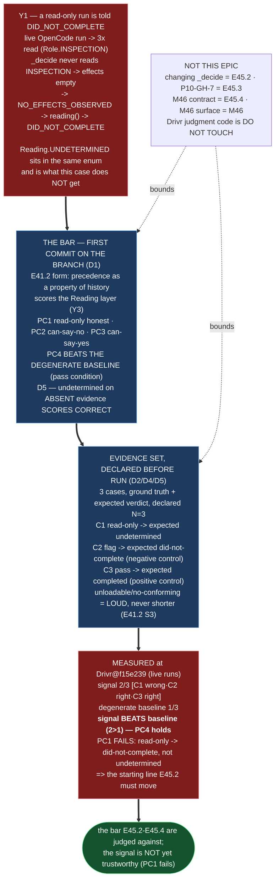

# Delivery Notice: P12-M45-E45.1 — The Bar, the Evidence Set, and the Degenerate Baseline

> **`pr_number`/`pr_url` are filled once the PR is created.** The remaining `merge_details`
> fields describe a merge that has not happened and are **unfillable at delivery time**
> (`P10-GH-4`, restated, not filled with invented values). Per this Epic's starter, merge
> authorization follows the M45 Milestone Chat's Stage-2 review, and the parent performs the
> merge.

## Summary

**The bar, the evidence set, and the degenerate baseline — committed before anyone changes the
signal, and measured against the current signal in Drivr.** E45.1 changes **nothing** in the
completion judgment. It commits (as the branch's **first commit**, shown by `git log`) the bar
the signal will be judged against; declares an evidence set **before** running it — a read-only
case (Y1's class), a flag/negative-control case, and a pass/positive-control case, each with its
ground truth and expected verdict; states the `undetermined`-on-absent-evidence-scores-correct
rule; and measures the current signal, finding it **2 / 3** against a degenerate baseline of
**1 / 3** (it beats the baseline) but **wrong about the read-only class — an honest read-only run
is reported `did-not-complete`, not `undetermined`** (PC1 fails). That is the measured starting
line E45.2 must move, evidenced by a live run, not by argument.

---

## Verification layer, time, scope and ref (`P11-GH-2`)

| Axis | Value |
|---|---|
| **Layer** | **`Reading`** verdict of Drivr's completion judgment (Y3), measured by executing Drivr's own `from_execution_result` + `judge_completion` against a live OpenCode run. The bar and evidence set are Markdown artifacts in this repository; the **measurement** is Drivr-side. |
| **Time** | **2026-09-03** |
| **Scope (governance repo)** | **`ai-project-system`**, branch **`epic/P12-M45-E45.1`**, branched from **`origin/milestone/M45` @ `201a4ea`**. Three artifacts added ± the delivery notice; no code, no test, no skip. |
| **Scope (measurement repo)** | **`~/soft-dev/drivr`** at ref **`f15e239858d36c2cae014104d907670e5b15ae02`**. **Nothing was changed there** — `git diff --stat f60164c HEAD -- drivr/judgment/` is empty, and the signal code is untouched. |
| **Refs** | Drivr branch point for the measurement: `f15e239858…` (live HEAD). Planning ref `f60164c`; judgment modules **unchanged** between the two (empty diff), so the planning-time findings hold at `f15e239`. **G2 re-measure performed**: Y1/Y2/Y3/Y5 confirmed by re-reading the Enum definitions and grepping at `f15e239` (see the record); Y4 carried from its source record (not live-runnable here). |
| **Engine** | OpenCode **1.18.10**, model **`ollama/qwen3-coder:30b`** (Ollama **0.32.14**, endpoint `http://localhost:11434`, reachable). Environment **host** (stated tradeoff against the container default — the container's loopback to the runtime was not reachable in this environment). |
| **Suite** | Not run as verification of this epic's content: this repository's suite does not cover Drivr, and this epic adds no code/tests in either repository. The Hard Constraint applies — the measured numbers are Drivr-side live-run results, not this suite's. |

**P11-GH-1 backstop, run before delivery:** `git fetch origin`, then
`git log 201a4ea..origin/milestone/M45` is **empty** — no amendment to the M45 milestone spec,
this epic's spec, the starter, PSG or AOG arrived during execution. The bar, evidence set and
record were written from their own committed content, not from memory (G2).

---

## Deliverables

### D1 — The bar, committed as the FIRST commit on the branch ✅

`docs/phases/.../P12-M45-E45.1__bar.md`. The scoring rubric: scores the **`Reading`** layer (Y3);
four pass conditions — **PC1** read-only answered honestly, **PC2** can-say-no (negative control),
**PC3** can-say-yes (positive control), **PC4** beats the degenerate baseline (recorded beside the
signal's count); the **`undetermined`-on-absent-evidence-scores-correct** rule stated as a term
(D5); beats-the-baseline stated as a **pass condition, not a footnote**; non-negotiable first
commit / declared-before-run / no post-hoc re-tuning.

**Shown by history, not asserted:**

```
$ git log --oneline epic/P12-M45-E45.1
1st  da0c66a  docs(P12-M45-E45.1): THE BAR — ... committed first
2nd  2b0bc8d  docs(P12-M45-E45.1): the evidence set, declared before it is run
```

### D2 — The evidence set, declared before it is run; declared N = reported N ✅

`docs/phases/.../P12-M45-E45.1__evidence-set.md`. Three cases, each with ground truth and expected
verdict, declared **before** the run (the bar and record are later on the branch):

| Case | Ground truth | Expected `Reading` | Measured `Reading` |
|---|---|---|---|
| C1 read-only (D4) | read-only; evidence of deliverable absent | `undetermined` | `did-not-complete` (**wrong**) |
| C2 flag (negative control) | work not performed | `did-not-complete` | `did-not-complete` |
| C3 pass (positive control) | performed and verified | `completed` | `completed` |

Declared **3**, reported **3** — an unloadable or non-conforming case is named loudly, never a
shorter list. (C2's first dispatch produced a completed run — disclosed in the record, dispatch
corrected to reproduce the no-effects class; ground truth and expected verdict unchanged.)

### D3 — Degenerate baseline measured; beating it a stated pass condition ✅

`docs/phases/.../P12-M45-E45.1__record__measurement.md`. The baseline (always `completed`) scores
**1 / 3** (only C3's expected verdict is `completed`); the signal scores **2 / 3**. **The signal
beats the baseline (2 > 1)** — PC4 holds. Recorded beside each other per the bar's PC4.

### D4 — A read-only case in the set, with ground truth and expected verdict ✅

C1: a live OpenCode run whose ledger is three `read` entries carrying `Role.INSPECTION`,
`files_changed=()`; ground truth *read-only; evidence of deliverable absent*; expected `undetermined`
(scored correct per D5). Its **current** verdict is `did-not-complete` — the distance E45.2 must
close, evidenced by a live run.

### D5 — `undetermined`-on-absent-evidence scores correct, written in the bar ✅

Written as a term of the bar (not a footnote): `undetermined` is a **correct** answer on a case whose
evidence is genuinely absent; penalising it trains the signal to guess. Bounded: `undetermined` is
**not** correct on C2 (work genuinely not performed) or C3 (evidence present and complete).

### Structural diagram (Mermaid, inline, no ComfyUI) ✅

See Visual Bindings below, inline in this notice.

---

## Design decisions (delegated — decided, documented, proceeded)

| # | Decision | Outcome |
|---|---|---|
| 1 | **Where the bar and evidence set live** | In the **governance repository** (`ai-project-system`) on `epic/P12-M45-E45.1`, so they travel the governed PR/merge path and are reviewable; **each measured claim states the measurement repository (Drivr) and ref** (`f15e239858…`). The delegated "Drivr-side measurement artifact" default is satisfied in substance — the artifacts **measure Drivr** and pin its ref — while the committed location follows the Starter's branch/worktree/PR instructions. |
| 2 | **The case list** | Three cases: read-only (Y1 class, expected `undetermined`), flag/negative control (expected `did-not-complete`), pass/positive control (expected `completed`). Both directions are present so the set is not satisfied by "always answers one thing." |
| 3 | **Scoring operationalization** | Per case, score 1 if the signal's `Reading` equals the expected verdict, else 0; no subjective quality score. "Beats the degenerate baseline" = signal correct-count strictly greater than the constant-`completed` baseline's. "`undetermined` scores correct" = bounded to genuinely-absent-evidence cases (D5). |
| 4 | **Dispatch path** | Engine OpenCode 1.18.10 via `OpenCodeAdapter`; entry `opencode run --format json --auto --dir <wd> <task>`; model `ollama/qwen3-coder:30b`; **host** environment (deliberate, stated tradeoff: the container default's loopback to the runtime was not reachable here; `environment` recorded on every result). |

---

## Definition of Done — every item

- [x] The bar is the **first commit on the branch** — shown by `git log` (D1, `da0c66a`), not
      asserted in the notice
- [x] The evidence set is declared **before** it is run; declared count (3) equals reported count (3)
- [x] The degenerate baseline is measured (**1/3**), and beating it is a **stated pass condition**
      (PC4; the signal's 2/3 recorded beside it)
- [x] A read-only case is in the set, with its ground truth and expected verdict (C1/D4)
- [x] The bar's rule that `undetermined` on absent evidence scores as correct is written down (D5)
- [x] Every claim states the layer (**`Reading`**), repository (Drivr), ref (`f15e239858…`) and date
      (`P11-GH-2` + the milestone Hard Constraint)
- [x] Delivery Notice committed; PR opened to `milestone/M45`

## Acceptance Criteria

- [x] The bar is the first commit on the branch — shown by `git log`, not asserted
- [x] The evidence set is declared before execution; declared count equals reported count
- [x] The degenerate baseline is measured, and beating it is a stated pass condition
- [x] A read-only case is in the set with ground truth
- [x] `undetermined` on absent evidence scores as correct, and the rule says so

---

## Visual Bindings

**Visual binding**
- **Link:** (inline — Structural diagram; no hosted link needed per AOG §17.3/§17.5)
- **What:** diagram
- **Level:** Epic
- **State:** proposed



- **Description (implemented):** E45.1 committed the bar as the branch's first commit and measured
  the current signal against a declared evidence set. Against Y1 (a read-only run reported
  `DID_NOT_COMPLETE`, not `undetermined`), the bar sets four pass conditions including **beating the
  degenerate baseline** (a signal that loses to a constant carries no information) and the
  **`undetermined`-on-absent-evidence-scores-correct** rule. Measured at Drivr@`f15e239` by live
  OpenCode runs: the signal scores **2/3** and **beats** the degenerate baseline's **1/3**, but
  fails **PC1** — the read-only run is still reported `did-not-complete`. That failing case is the
  measured starting line E45.2 must move. Proposed-track Structural diagram (AOG §17.3/§17.6),
  Mermaid, no ComfyUI.

---

## Status

⏸️ **Stopped. Awaiting Milestone Chat review and authorization. Not merged.** Per this epic's
Starter, merge authorization for this PR normally follows the Milestone Chat's Stage-2 review, and
the parent (the M45 Milestone Chat) performs the merge. This delivery is the **first attempt** — the
rework limit (3 attempts plus any written `+1`, PSG §11.6) has not been touched.

Epic E45.1 execution complete. Epic Delivery Notice produced. Awaiting Milestone Chat review and
authorization.
