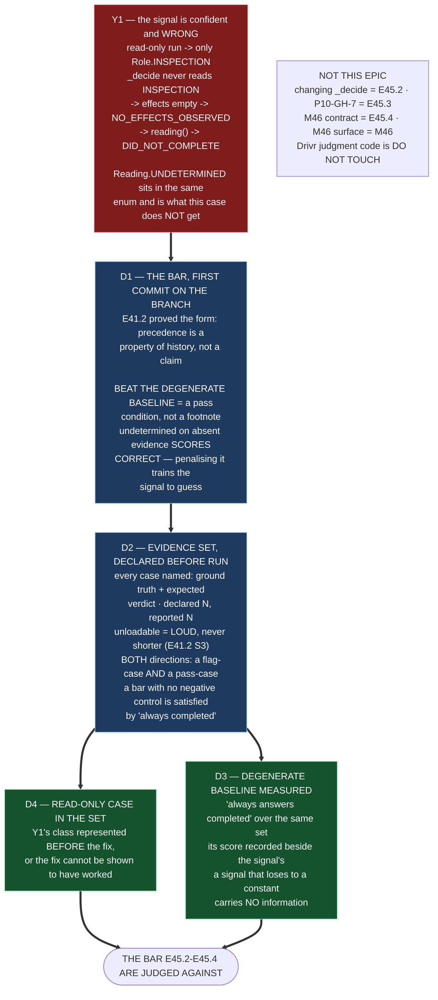

# Epic E45.1 — The Bar, the Evidence Set, and the Degenerate Baseline

## Context

**State what would make the completion signal trustworthy — before anyone changes it.**

M45's subject is the completion judgment in Drivr (`~/soft-dev/drivr`, `drivr/judgment/`): the
machinery that answers *"is this work finished, and is it stuck?"* Today it answers confidently and
wrongly on an entire class of honest work, and the failure is documented in the code against itself.
Five findings were measured at planning time (milestone spec v1.0.0, against Drivr `f60164c`):

- **Y1** — a read-only run is told `DID_NOT_COMPLETE`, not "unknown": `_decide` never reads
  `Role.INSPECTION`, so effects come back empty, and `reading()` maps `NO_EFFECTS_OBSERVED` explicitly
  onto a confident negative (`completion.py:176-181`).
- **Y2** — the gap is written in `projections.py:45`'s own docstring (*"never reads
  `Role.INSPECTION`"*). This is closing a recorded hole, not finding a bug.
- **Y3** — two enums, two layers: `Completion` (fine-grained) has no `UNDETERMINED` member; the CFO's
  first-class-`undetermined` ruling is about `Reading` (coarse verdict).
- **Y4** — a second, independently-built instrument (E41.2's) reproduced the same failure this week, in
  another repository. Two instruments, two authors, same direction — a **design attractor**, not a bug.
- **Y5** — a grep for a member that does not exist returns zero identically to one that exists and is
  unused. Read the enum before reasoning about any state name.

**Only E45.1 runs before anything changes the signal.** Its deliverable is the bar against which
E45.2–E45.4's changes are judged. The precedent is settled: **E35.5's result was usable because it
carried `PASS 4/5, 0 false alarms` in advance**, and **E41.2 proved the stronger form — its bar (D3)
landed as the first commit on its branch, making precedence a property of history rather than a claim.
M45 adopts that form.**

---

## Problem Statement

**A bar stated after the work lets the work define its own success.** The signal under repair is the
thing that will judge every other change in this milestone. If its acceptance criterion is written
after the fact, the work can be scored by a rule chosen to match what the work already did — the exact
failure the *bar-committed-first* rule exists to prevent (E41.2's own words).

Two failure modes are on record and must be structurally impossible here:

1. **A criterion that names only positives is satisfied by `return FAIL`** — E41.2's S1. M45's bar
   must be right in both directions before anything is judged, and the way to establish that is not
   argument but **a declared evidence set with ground truth**.
2. **A signal that loses to a constant carries no information.** M39 recorded that the judgment loses
   to a degenerate baseline that always answers "completed". **A signal that cannot beat "always yes"
   has no information in it**, and this must be a *pass condition*, not a footnote.

---

## Goals

By the end of this Epic, the system must:

1. **Commit the bar as the first commit on the branch** — placed in history, so its precedence is
   checkable rather than claimed.
2. **Declare the evidence set before it is run** — every case named, with its ground truth and its
   expected verdict. Declared N, reported N; an unloadable case fails loudly; a shorter list is a
   defect.
3. **Measure the degenerate baseline, and make beating it a stated pass condition.**
4. **Put a read-only case in the set, with its ground truth stated** — Y1's class must be represented
   before the fix, or the fix cannot be shown to have worked.
5. **State the bar's relation to `undetermined` explicitly** — `undetermined` on a case whose evidence
   is genuinely absent is a **pass**, not a miss.

---

## Non-Goals

This Epic explicitly does **not** aim to:

- **Change the signal.** `_decide`, `reading()`, `projections.py`, or any Drivr judgment code is
  E45.2–E45.4's work. A bar that changes the thing it measures is not a bar.
- **Decide the correct verdict for a read-only run.** That is E45.2's design question. E45.1 states the
  scoring rule (honest uncertainty scores correct); E45.2 states the mechanism and the decision.
- **Fix `P10-GH-7`** (E45.3's) or **write the M46 contract** (E45.4's).
- **Build M46's surface or its qualification gate.**
- **Re-open the binding constraints.** `undetermined` first-class, `_decide`'s independence, M45-gates-M46
  — all settled above this epic.
- **Re-tune the bar after seeing a result.** If the committed bar turns out wrong, that is an escalation
  and an amended commitment — never a quiet edit.

---

## Scope of Work

### 1. The bar, committed first (D1)

A scoring rubric: the set of pass conditions the signal must meet, measured against the evidence set.

**Must include:**

- Each pass condition, how it is assessed, and what value passes.
- **Beating the degenerate baseline as an explicit pass condition**, with the baseline's own score
  recorded next to the signal's.
- **The rule that `undetermined` on genuinely-absent evidence scores as correct** — a scoring rule that
  penalises honest uncertainty trains the signal to guess, which is the defect.
- The bar's **relation to the two layers** (Y3): it scores the `Reading` verdict (what a board
  consumes), and records which layer each of its terms acts on.
- **Its precedence checkable in history** — the bar is the branch's first commit, shown by `git log`,
  not asserted in a notice.

### 2. The evidence set, declared before it runs (D2)

**Declare the set first**, then run it. Every case is named, with its ground truth and its expected
verdict under the bar. **Declared N, reported N.**

**Must include:**

- A **read-only case** — an honest run that read files and wrote nothing, ledger entries carrying
  `Role.INSPECTION` — with its ground truth stated, and its expected verdict `undetermined` under the
  bar (scored correct).
- Cases that exercise **both directions**: a case the signal must flag, and a case it must pass. A bar
  with no negative control is satisfied by a signal that always says "completed".
- **A loud, named failure for any case that cannot be loaded.** A silently shorter list is the defect
  this phase exists to close (E41.2's S3; milestone spec D2).

### 3. The degenerate baseline, measured (D3)

**Run the degenerate baseline** — the strategy that always answers "completed" — over the evidence set,
record its score, and record that the signal must **beat** it. The baseline's answer is a constant, so
its score is a property of the evidence set and the scoring rule, not a model.

**Must include:** the baseline's score on the declared set, the signal's score on the same set, and the
statement of which one is the pass condition and why (a signal that loses to a constant carries no
information).

### 4. The read-only case's place in the bar (D4)

Y1's class is represented **before** the fix. State, in the bar, what the read-only case's expected
verdict is and how it is scored — so that when E45.2 changes `_decide`, the change is *shown* to have
worked by moving this case from its current wrong verdict to the expected one.

---

## Deliverables

- [ ] **D1** — The bar, committed as the **first commit on the branch**, shown by `git log`
- [ ] **D2** — The evidence set, declared before it is run; declared count equals reported count;
      unloadable cases named loudly
- [ ] **D3** — The degenerate baseline measured, and beating it stated as a pass condition
- [ ] **D4** — A read-only case in the set, with ground truth and its expected verdict
- [ ] **D5** — The bar's rule that `undetermined` on absent evidence scores as correct, written down
- [ ] Structural diagram (Mermaid, inline, no ComfyUI)
- [ ] **Epic Delivery Notice**

---

## Binding Constraints

Settled above this epic — **not re-decidable here** (milestone spec §Binding Constraints):

1. **M45 gates M46**, by construction. SN-36's two central behaviours *are* this signal.
2. **`undetermined` is first-class** — never folded into `in progress`, never into `blocked`.
3. **The bar is relative and stated BEFORE the work**, and lands as the first commit on its branch
   (the E41.2 form).
4. **No model-generated judgment may be load-bearing** (E39.1). The completion signal is machinery, not
   a model's opinion.
5. **`_decide`'s independence is not to be weakened.** It may read more of the ledger; it may not read
   beyond it; **any proposal to admit exit codes is refused in advance.**

## Hard Constraint (binding — carried to every Epic)

**This milestone builds the thing that decides whether other things worked. It must not be trusted on
its own report.**

- **State the layer.** `Completion` or `Reading` — every claim names which, per Y3.
- **State the repository.** M45 is Drivr-side; *"suite green here"* does not cover it, and a deliverable
  that does not say where it lands cannot be verified.
- **Only a live run counts as evidence of a live defect.** Y4's two instances were both found by live
  runs and neither by a replay. **A replay suite is a regression guard, not a discovery instrument**, and
  this epic must not report replay-only evidence as though it discovered anything.
- **Prove every guard by falsifying it** — remove the change, watch the check fail.
- **Pin the ref, and record it.** A number without a ref is not a measurement.
- **`undetermined` is the answer when the evidence is absent. It is never a synonym for "no".**

---

## Design Decisions Delegated — decide, document, proceed

1. **Where the bar and the evidence set live.** M45 is Drivr-side (Hard Constraint); the signal under
   measurement and the live-run engine both live in `~/soft-dev/drivr`. The epic states each deliverable's
   repository and ref, and the recommended default is that the bar and evidence set are committed as
   Drivr-side measurement artifacts at a pinned ref.
2. **The exact case list in the evidence set**, subject to Scope §2's constraints — a read-only case, and
   both a flag-case and a pass-case — with every case's ground truth and expected verdict stated.
3. **The scoring rule's operationalization** — how "beats the degenerate baseline" and "`undetermined`
   scores correct" are computed, subject to *no subjective quality score* (Binding Constraint 4's parent).
4. **How the live runs are dispatched** — which engine, which entry point, whether host or sandbox. The
   milestone spec's external prerequisite binds: **a reachable engine is required; an epic that cannot
   dispatch cannot discharge its discovery obligation and must escalate rather than substitute a replay.**

---

## Definition of Done

Epic E45.1 is complete when:

- [ ] The bar is the **first commit on the branch** — shown by `git log`, not asserted in a notice
- [ ] The evidence set is declared **before** it is run, and the declared count equals the reported count
- [ ] The degenerate baseline is measured, and beating it is a **stated pass condition**
- [ ] A read-only case is in the set, with its ground truth and its expected verdict stated
- [ ] The bar's rule that `undetermined` on absent evidence scores as correct is written down
- [ ] Every claim states the layer, repository, ref and date (`P11-GH-2` + the milestone Hard Constraint)
- [ ] Delivery Notice committed; PR opened to `milestone/M45`

## Acceptance Criteria

- [ ] The bar is the first commit on the branch — shown by `git log`, not asserted
- [ ] The evidence set is declared before execution; declared count equals reported count
- [ ] The degenerate baseline is measured and beating it is a stated pass condition
- [ ] A read-only case is in the set with ground truth
- [ ] `undetermined` on absent evidence scores as correct, and the rule says so

## Technical Constraints

**In scope:** the bar, the evidence set, and the degenerate-baseline measurement — M45 measurement
artifacts. The signal under measurement is Drivr-side (`~/soft-dev/drivr`); a live run against a
reachable engine is the only evidence of the signal's current behaviour (Hard Constraint).
**Do not touch:** `drivr/judgment/completion.py`, `drivr/judgment/projections.py`, or any Drivr judgment
code — changing the signal is E45.2–E45.4's work.
**Repository:** each deliverable states its repository and ref. This repository's suite is
`PYTHONPATH=. pytest -q` (bare `pytest` fails collection) — **it does not cover Drivr**, so
*"suite green here"* is not verification of anything this epic produces.
**Invocation:** stated per deliverable, at the layer and ref measured.

## Dependencies

**Internal**
- **The milestone spec's five findings (Y1–Y5)** — carried, not re-derived. Verified against Drivr
  `f60164c` at planning; **re-measure before relying on any line number** (G2).
- **E45.1 runs first** (binding). Its bar must be the first commit on its branch before E45.2–E45.4
  change the signal.

**External**
- **Drivr at `~/soft-dev/drivr`, `f60164c`** — the signal and the live-run engine. Outside this
  repository and outside its suite.
- **A reachable engine** for live runs. Y4's lesson is binding: an epic that cannot dispatch cannot
  discharge its discovery obligation and must escalate rather than substitute a replay.

**Blockers**
- None at planning. The engine-resolves question is confirmed or falsified at execution time and
  reported, not assumed.

## Timeline

**Estimated Effort:** 1–2 sessions — the bar and evidence set are bounded; the live-run measurements
are wall-clock bound by the engine.
**Target Completion:** before E45.2 (binding order: E45.1 first).
**Actual Completion:** In progress.

## Execution Notes

**Order, chosen so a wrong bar is caught before it judges anything:**

1. Commit the bar (D1). **First commit on the branch — before anything else.**
2. Declare the evidence set (D2), including the read-only case (D4) and the `undetermined`-scores-correct
   rule (D5). **Before any run.**
3. Run the evidence set against the current signal; record the scores.
4. Run and record the degenerate baseline; state that beating it is the pass condition (D3).
5. Write the Delivery Notice from what was observed, not from this spec.

**Traps this project has already paid for:**

- **Emitting a bar after seeing the data.** The first commit is the bar, or the epic has failed.
- **A shorter evidence set than declared.** An unloadable case is a loud, named failure — never a
  quietly shortened list (E41.2 S3).
- **Reasoning about a state name without reading the enum** (Y5). `Completion.UNDETERMINED` does not
  exist; `Reading.UNDETERMINED` does. Read the definitions.
- **Reporting replay-only evidence as discovery** (Y4). A live run is the only evidence of a live defect.
- **`git status` before every commit**; this is a shared worktree. **Verify pushes at `origin`.**

## Related Documents

- [M45 Milestone Spec](P12-M45__milestone-spec.md) — v1.0.0; the five findings (Y1–Y5), Binding
  Constraints, Hard Constraint
- [P12 Phase Spec](P12__phase-spec.md) — §P12.5 (M45), §P12.6 (M46, gated on M45)
- [E41.2 Spec](P12-M41-E41.2__spec__successful-nothing-instrument-and-incumbent-baseline.md) — the
  bar-first-commit precedent (D3), the "return FAIL" lesson (S1), the unloadable-case rule (S3)
- [M40 E40.1 completion-signal decision](../P11__Drivr_Coordination_Over_Rented_Execution/P11-M40-E40.1__completion-signal-decision.md) —
  F5, the read-only-run shape
- Drivr `drivr/judgment/completion.py` and `drivr/judgment/projections.py` at `f60164c`
- [PROJECT-SYSTEM-GUIDELINES.md](../../../governance/PROJECT-SYSTEM-GUIDELINES.md)
- [AI-OPERATING-GUIDELINES.md](../../../governance/AI-OPERATING-GUIDELINES.md)

## Visual Bindings

**Visual binding**
- **Link:** (inline — Structural diagram; no hosted link needed per AOG §17.3/§17.5)
- **What:** diagram
- **Level:** Epic
- **State:** proposed

- **Description:** E45.1 lands the bar before anyone changes the signal. Against the Y1 finding — a
  read-only run told `DID_NOT_COMPLETE`, not "unknown" — the bar commits three things as the first commit
  on its branch: beating the degenerate baseline as a pass condition (a signal that loses to "always
  answered completed" carries no information), `undetermined`-on-absent-evidence scores correct, and an
  evidence set declared before it runs, carrying a read-only case so Y1's class is represented before the
  fix. Proposed-track Structural diagram (AOG §17.3/§17.6), Mermaid, no ComfyUI.

## Notes

- **The bar and the signal are not the same thing, and this epic owns only the bar.** E45.1 states what
  "trustworthy" means and commits it first; E45.2–E45.4 change the signal to meet it. A bar that changes
  the thing it measures has already failed its only job.

- **The degenerate baseline is the criterion that cannot be finessed.** M39 recorded the loss; a signal
  that loses to a constant carries no information however well-reasoned its internals. This epic makes it
  a pass condition rather than a footnote for exactly that reason.

- **The evidence set captures the current behaviour, deliberately.** The read-only case's *current*
  verdict is `DID_NOT_COMPLETE` (Y1) and its *expected* verdict is `undetermined` (scored correct). The
  distance between those two is what E45.2 must close, and E45.1 records the starting line so the closing
  is *shown*, not claimed.

## Changelog

| Version | Date | Change |
|---|---|---|
| 1.0.0 | 2026-09-03 | Initial E45.1 spec, from the M45 milestone spec v1.0.0 (E45.1 Epic Detail, Binding Constraints, Hard Constraint) and the five planning-time findings (Y1–Y5). Commits the bar-first-commit form E41.2 proved (D3 as first commit), makes beating the degenerate baseline a pass condition, puts a read-only case in the evidence set, and states the `undetermined`-on-absent-evidence scoring rule. Delegates the artifact location (Drivr-side default), the case list, the scoring operationalization, and the dispatch path. No scope, ordering, gate or acceptance-criterion change from the milestone spec. |
