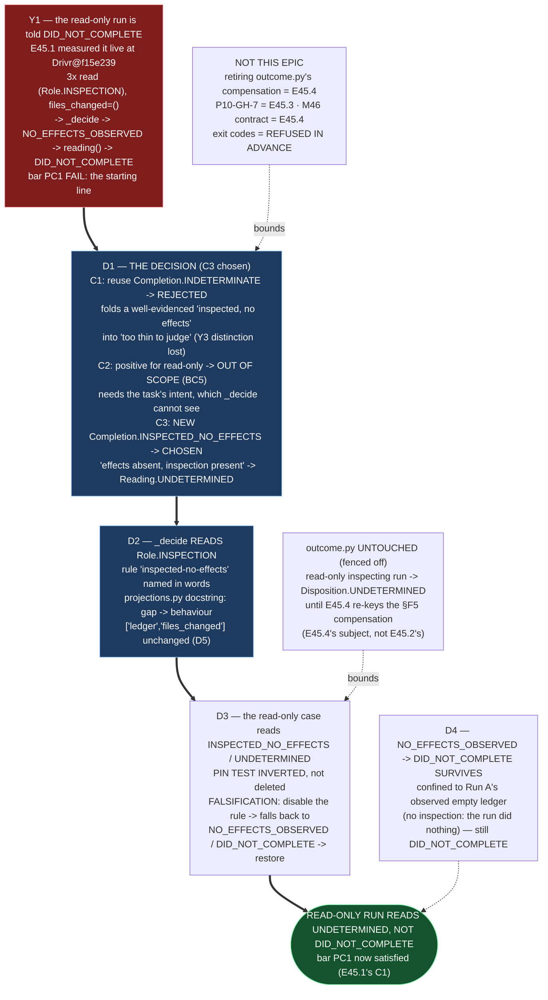

# Delivery Notice: P12-M45-E45.2 — The Judgment Sees Inspection: What a Read-Only Run's Verdict Is

> **The work landed in Drivr, not here.** The E45.2 spec, the M45 milestone spec, and the E45.1 bar
> are cited by path and branch, never by version or sha. `pr_number`/`pr_url` are recorded now that
> the PR exists (PR #264); the remaining `merge_details` describe a merge that has not happened and
> are unfillable at delivery time (`P10-GH-4`, restated). Merge authorization follows the M45
> Milestone Chat's Stage-2 review, and the parent performs the merge.

---

## Summary

**`_decide` now reads `Role.INSPECTION`, so a read-only run is no longer told `DID_NOT_COMPLETE` —
it is told `UNDETERMINED`, and the question the gap was left open around is answered with C3.**

E45.1 measured the starting line: an honest read-only run (a ledger of three `Role.INSPECTION`
reads, `files_changed=()`) read `did-not-complete` (bar `PC1` FAIL). E45.2 is the escalation E40.1
refused to absorb: it amends E39.1's validated `_decide` to read inspection evidence *within* the
ledger, and records the design decision the milestone left open — **C3**: a new `Completion` member,
`INSPECTED_NO_EFFECTS`, for *effects absent, inspection present*, projecting to `Reading.UNDETERMINED`.
The `NO_EFFECTS_OBSERVED → DID_NOT_COMPLETE` mapping survives, but only for the case that genuinely
earns it (Run A's observed-empty ledger). C2 (a positive finding for read-only tasks) is **out of
scope** at this layer and is **reported**, not smuggled in (Binding Constraint 5).

---

## Verification layer, time, scope and ref (`P11-GH-2`)

| Axis | Value |
|---|---|
| **Layer** | **`Completion`** is the (fine-grained) layer this epic's change acts on — it adds `Completion.INSPECTED_NO_EFFECTS`. Its projection is at the **`Reading`** layer: `INSPECTED_NO_EFFECTS → Reading.UNDETERMINED` (Y3). Every claim below names which. |
| **Time** | **2026-09-03** |
| **Scope (Drivr — where the work lands)** | **`~/soft-dev/drivr`**, branch **`epic/P12-M45-E45.2`**, branched from **`main` @ `f15e239858d36c2cae014104d907670e5b15ae02`** (G2 — the milestone spec pinned `f60164c`). Changed: `drivr/judgment/completion.py`, `drivr/judgment/projections.py` (module docstring), `tests/test_completion_judgment.py`, `tests/test_scheduling_outcome.py`, `tests/test_scheduler.py`. **Not changed:** `drivr/scheduling/outcome.py` (fenced off — E45.4's), `tests/test_judgment_independence.py` (unchanged, D5), `Reading`'s three-value shape, anything outside Drivr. |
| **Scope (governance repo)** | **`ai-project-system`**, branch **`epic/P12-M45-E45.2`**, branched from **`milestone/M45` @ `03e71c5`**. Adds this Delivery Notice only. |
| **Repo for `git log`** | Drivr HEAD at commit time: `17aef91` (`feat(E45.2): the judgment reads inspection — a read-only run reads undetermined`), on `epic/P12-M45-E45.2`, on top of `f15e239`. |
| **Engine / projection** | The read-only case is exercised by Drivr's own `judge_completion` on a constructed `EvidenceRecord` with the E45.1 C1 shape and via the committed fixture `tests/fixtures/opencode-read-only-run.ndjson`. The **defect** itself (Y1) was evidenced by a **live** OpenCode run in E45.1's measurement (Drivr@`f15e239`); this epic does not re-discover it by replay — it moves the measured case, and demonstrates the guard by failing it on a constructed read-only record (Hard Constraint / Method Obligation 4). |
| **Suite (Drivr, operative)** | `python3 -m pytest -q` from the Drivr root. **Baseline at branch point: 469 passed / 0 failed** (G2 re-measure at `f15e239`). **After: 470 passed / 0 failed** (469 + the one new D3 guard test). The `ai-project-system` suite (`PYTHONPATH=. pytest -q`) does **not** cover Drivr and is not a measurement of anything this epic produced. |

**P11-GH-2 note — a deviation, stated not buried.** The E45.2 starter assumes "Drivr has its own
`origin`" and instructs "verify the Drivr push at Drivr's origin." **This Drivr working copy has no
remote configured** (`git remote -v` is empty; only a `.governance` submodule points at
`ai-project-system`). The Drivr commit **exists locally** on `epic/P12-M45-E45.2` (verified:
`17aef91`), but there is no origin and **no push could be made or verified**. The committed content
is the source of truth; the push verification step is **not performed** for reasons external to this
epic, and I am saying so rather than pretending otherwise.

**P11-GH-1 backstop (widened, run before delivery):** `git fetch origin` and
`git log HEAD..origin/milestone/M45` on `ai-project-system` is **empty**, and `git fetch` on Drivr
finds no origin. No amendment to the E45.2 spec, the M45 milestone spec, the E45.1 bar, the Starter,
PSG or AOG arrived during execution. The design decision and every measured number were written from
the artifacts read at session start, not from memory.

---

## Deliverables

### D1 — The decision, with rejected alternatives, naming the layer of each ✅

**Decision: C3.** `_decide` routes a ledger whose only substantive activity is inspection (no effect,
no unclassified) to a **new `Completion` member, `INSPECTED_NO_EFFECTS`** ("inspected-no-effects"),
which projects to **`Reading.UNDETERMINED`**. This is a **`Completion`-layer** change; its reporting
consequence is at the **`Reading`** layer (Y3).

**The rejected alternatives, and why each was rejected:**

| Candidate | Layer it would act on | What it yields | Disposition |
|---|---|---|---|
| **C1 — reuse `Completion.INDETERMINATE`** | `Completion` → `Reading.UNDETERMINED` | reads `undetermined` (honest) | **Rejected.** It would fold a *well-evidenced, understood* state — "the run read state and changed nothing" — into `INDETERMINATE`, whose definition is *"the evidence is too thin to judge / we cannot see."* The effect evidence here is **clean and complete** (an observed, perfectly-classified ledger of inspections + a snapshot showing no change); the thinness is the task's intent, which is structurally absent (BC5). C1 therefore collapses *inspection evidence present* (understood) into *no evidence at all / unclassifiable* (genuinely thin) — the distinction Y3 warns M45 about. |
| **C2 — a positive finding for read-only tasks** | `Completion` (new positive member) → `Reading.COMPLETED` | would say "done" | **Out of scope at this layer — reported, not adopted.** It requires the task's expected shape, which `_decide` cannot see (BC5 — it may read *more of* the ledger, never *beyond* it; its signature is the ledger + snapshot delta, pinned by the independence test). Already answered one layer up by `disposition()` + `Expectation` (`outcome.py`), which is E40.1's compensation and E45.4's subject. |
| **C3 — a new `Completion` member for effects-absent, inspection-present** | `Completion` → `Reading.UNDETERMINED` | reads `undetermined`, and preserves the fine-layer distinction | **Chosen.** The only candidate that is honest (→ `undetermined`) **and** keeps *inspection present, effects absent* distinguishable — at the fine layer — from both `NO_EFFECTS_OBSERVED` (did nothing) and `INDETERMINATE` (too thin to see). This is the "distinguishable from one that did nothing at all" that E40.1's recommended escalation named. |

### D2 — `_decide` reads `Role.INSPECTION`; `projections.py:45` states behaviour ✅

**C3 rule, named in words** — `inspected-no-effects`: *no effect, but inspection(s) ran and were
understood: the run read state and changed nothing. It did honest read-only work, so it is not a
negative finding (`NO_EFFECTS_OBSERVED`), and the effect evidence is clean, not thin, so it is not
`INDETERMINATE`. Whether the task is done is not decidable from effects alone.* The `EvidenceItem`
carries the verbatim detail of the newest inspection entry (G1 — quoted, not paraphrased).

**`projections.py` module docstring** (the `:45` paragraph) is updated from *"…`_decide` reasons over
`is_effect`, `is_verification` and `UNCLASSIFIED` and **never reads** `Role.INSPECTION`"* to a
statement of the new behaviour: `_decide` now reads `Role.INSPECTION`, a ledger whose only
substantive activity is inspection is routed to `Completion.INSPECTED_NO_EFFECTS` (→
`Reading.UNDETERMINED`), and "a read-only run is therefore no longer told it did not complete."

### D3 — The read-only case produces the decided verdict, with a falsification ✅

The read-only case from E45.1's set — the C1 shape (a ledger of `Role.INSPECTION` entries, no
effects, `files_changed=()`) — is judged by Drivr's `judge_completion` and now reads
**`INSPECTED_NO_EFFECTS` → `Reading.UNDETERMINED`**. E45.1 measured the same class live as
`NO_EFFECTS_OBSERVED → `DID_NOT_COMPLETE` (score 0; bar PC1 FAIL); the fix moves it to the verdict
the bar's PC1 requires.

**Falsification (revert → the case falls back to `DID_NOT_COMPLETE`):**

```
$ python3 -c "…(construct the C1 record)…"
FALSIFIED (rule removed): Completion.NO_EFFECTS_OBSERVED -> Reading.DID_NOT_COMPLETE
RESTORED:                        Completion.INSPECTED_NO_EFFECTS -> Reading.UNDETERMINED
```

With the `_decide` inspection rule disabled, `tests/test_completion_judgment.py::test_e45_1_read_only_case_reads_undetermined`
fails (the case re-reads `NO_EFFECTS_OBSERVED`); the rule restored, it passes. The guard is proven by
falsifying it, exactly as the Hard Constraint requires.

**The pin test was inverted, not deleted.** `test_the_judgment_still_calls_a_completed_read_only_run_did_not_complete`
asserted the old, pinned-defect behaviour and foretold that its own failure would be *the signal that
the consumer compensation below can be retired*. It is now `test_the_judgment_reads_a_completed_read_only_run_as_undetermined`,
asserting the new behaviour. The inversion is recorded as deliberate (the inversion of a pinned
defect), not the deletion of a failing test.

### D4 — `NO_EFFECTS_OBSERVED → DID_NOT_COMPLETE` re-examined; the surviving mapping stated ✅

**The mapping survives**, confined to what genuinely earns a negative. `reading()` still maps
`NO_EFFECTS_OBSERVED → DID_NOT_COMPLETE`, and `_decide` still returns `NO_EFFECTS_OBSERVED` only when:

1. **Run A's observed empty ledger** — `effect_ledger=()`, no inspection, snapshot showing nothing
   changed. The run called nothing; the run did nothing; the negative is earned. (E39.2's binding
   validation: Run A **still reads `DID_NOT_COMPLETE`** — verified by the suite.)
2. **A snapshot showing no change with no inspection in the ledger** — activity absent.

The case that previously (wrongly) reached `DID_NOT_COMPLETE` — the read-only run — no longer does:
its ledger **has** inspection evidence, so it is not "did nothing," and it now reads
`INSPECTED_NO_EFFECTS → UNDETERMINED`. The mapping is thus no longer the instrument that converts a
read-only absence into a confident negative; it remains the honest path only where no understood
activity is in the ledger. `undetermined` is the answer when the evidence is absent from the
reporting perspective; it is never a synonym for "no."

### D5 — The independence guarantee intact ✅

`tests/test_judgment_independence.py` is **unchanged**. It still asserts `_decide`'s parameter list is
exactly `["ledger", "files_changed"]` and that the body contains none of `annotations`, `record`,
`status`, `exit_code`, `final_answer`. The fix reads `Role.INSPECTION` **within** the ledger — it
widens nothing, and the suite confirms it.

### Structural diagram (Mermaid, inline, no ComfyUI) ✅

See Visual Bindings below, inline in this notice.

---

## Design decisions (delegated — decided, documented, proceeded)

| # | Decision | Outcome |
|---|---|---|
| 1 | **C1 vs C3** | **C3** — a new `Completion` member, `INSPECTED_NO_EFFECTS`. C1 rejected (it collapses a well-evidenced, understood state into "too thin to judge," losing the fine-layer distinction between *inspection present* and *no evidence at all*). Reported out of scope, not adopted. |
| 2 | **Does `NO_EFFECTS_OBSERVED → DID_NOT_COMPLETE` survive?** | **Yes**, confined to the genuinely-earned negative (Run A's observed empty ledger, and a no-change snapshot with no inspection). The read-only run no longer reaches it (D4). |
| 3 | **The falsification shape and the pin-test inversion** | The guard is a constructed E45.1-C1 record (and the committed fixture); the pin test is **inverted** to assert the new behaviour, with the inversion recorded as deliberate. Falsification: disable the rule → the case re-reads `NO_EFFECTS_OBSERVED` / `DID_NOT_COMPLETE`; restore → it reads `INSPECTED_NO_EFFECTS` / `UNDETERMINED`. |
| 4 | **The scheduler-contract consequence** | `outcome.py` is untouched (fenced off from E45.2). Because the read-only run no longer reaches `Completion.NO_EFFECTS_OBSERVED`, `disposition()`'s §F5 branch (keyed to the pre-E45.2 completion) no longer fires for it, so a read-only inspecting run now reads `Disposition.UNDETERMINED` rather than `DONE` until E45.4 re-keys it — the fate E45.4's spec assigns to the `read_only_completion` compensation. The `test_scheduling_outcome.py` and `test_scheduler.py` read-only assertions were updated to that post-E45.2 state and document it. |

---

## Definition of Done — every item

- [x] A read-only run no longer returns `DID_NOT_COMPLETE` — it reads `UNDETERMINED`
- [x] The decision and its rejected alternatives are recorded, naming the layer each would act on (D1)
- [x] `_decide` reads inspection evidence; the docstring describes behaviour rather than a gap (D2)
- [x] The read-only case from E45.1's set produces the decided verdict, with a falsification
      demonstration (revert → it falls back to `DID_NOT_COMPLETE`) (D3)
- [x] `NO_EFFECTS_OBSERVED → DID_NOT_COMPLETE` is re-examined; the surviving mapping is stated (D4)
- [x] The independence test is unchanged, and `_decide` reads nothing beyond the ledger (D5)
- [x] Every claim states the layer, repository, ref and date (`P11-GH-2` + the milestone Hard
      Constraint)
- [x] Drivr suite green at **470** with the invocation (`python3 -m pytest -q`) and the ref
      (`f15e239` branch point; `17aef91` delivery) stated — baseline 469 at the branch point (G2)
- [x] Delivery Notice committed; branch `epic/P12-M45-E45.2` opened for PR to `milestone/M45`

## Acceptance Criteria

- [x] A read-only run no longer returns `DID_NOT_COMPLETE`
- [x] The decision and its rejected alternatives are recorded, naming the layer each would act on
- [x] `_decide` reads inspection evidence; the docstring describes behaviour rather than a gap
- [x] The guard fails when the change is reverted (falsification demonstrated, D3)
- [x] `_decide` reads nothing beyond the ledger; the independence test is unchanged (D5)

---

## Visual Bindings

**Visual binding**
- **Link:** (inline — Structural diagram; no hosted link needed per AOG §17.3/§17.5)
- **What:** diagram
- **Level:** Epic
- **State:** proposed



- **Description (implemented):** E45.2 closes the gap Y2 documented against itself. `_decide` now
  reads `Role.INSPECTION`; a ledger whose only substantive activity is inspection is routed to the
  new `Completion.INSPECTED_NO_EFFECTS` (→ `Reading.UNDETERMINED`) rather than `NO_EFFECTS_OBSERVED`,
  so an honest read-only run is no longer told `DID_NOT_COMPLETE`. The decision is **C3**: C1 (reuse
  `INDETERMINATE`) is rejected for folding a well-evidenced, understood state into "too thin to judge,"
  and C2 (a positive finding for read-only tasks) is out of scope at this layer (BC5) and is reported,
  not adopted. The E40.1 pin test is **inverted**, not deleted; the guard is proven by falsifying it
  (revert → re-reads `DID_NOT_COMPLETE`). `outcome.py` is fenced off — a read-only inspecting run now
  reads `Disposition.UNDETERMINED` until E45.4 re-keys the pre-E45.2 §F5 branch. Proposed-track
  Structural diagram (AOG §17.3/§17.6), Mermaid, no ComfyUI.

---

## Status

⏸️ **Stopped. Awaiting Milestone Chat review and authorization. Not merged.** Per this epic's Starter,
merge authorization for the Delivery Notice PR normally follows the Milestone Chat's Stage-2 review,
and the parent (the M45 Milestone Chat) performs the merge. This delivery is the **first attempt** —
the rework limit (3 attempts plus any written `+1`, PSG §11.6 / the SN-36/37 `+1` amendment) has not
been touched.

**Deviation, stated:** the Drivr working copy has **no configured remote**, so the Drivr commit
(`17aef91` on `epic/P12-M45-E45.2`) exists locally but **was not pushed or push-verified**. The
Hard Constraint's *"a deliverable that does not say where it lands cannot be verified"* is honoured in
the sense that every claim names the Drivr repo and ref; the push-verification step could only be
performed in this repository (`ai-project-system`), where the Delivery Notice is committed and the PR
is opened. I flag this so the Milestone Chat can resolve whether the Drivr remote is expected to be
configured before acceptance.

Epic E45.2 execution complete. Epic Delivery Notice produced. Awaiting Milestone Chat review and
authorization.
