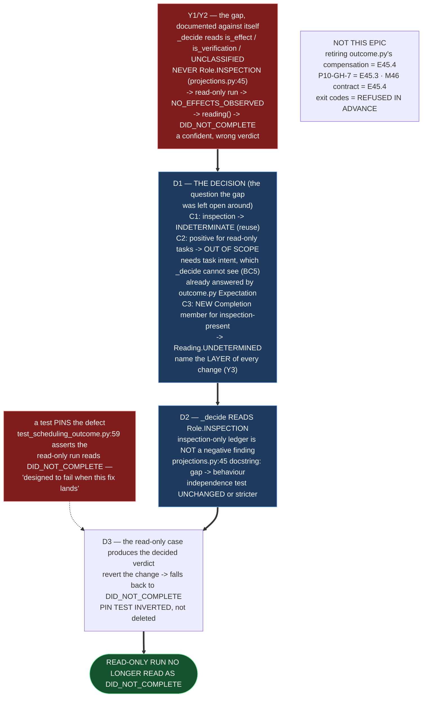

# Epic E45.2 — The Judgment Sees Inspection: What a Read-Only Run's Verdict Is

## Context

**Close the recorded gap: make `_decide` read `Role.INSPECTION`, and answer the question the gap
was left open around.**

Y2 states it plainly: the defect is **documented in the code against itself** — `projections.py:45`
says `_decide` *"never reads `Role.INSPECTION`"* — and the question it was left open around has
**never been answered**: *what is the correct verdict for a run that legitimately produced no
effects?* That question is this epic's substance.

The failure, measured at planning and re-measured for this spec (G2):

- **Y1** — a read-only run is told `DID_NOT_COMPLETE`, not "unknown". `completion.py:326-520`
  (`_decide`) reasons over `is_effect`, `is_verification` and `UNCLASSIFIED` — `Role.INSPECTION` is
  not among them — so a perfectly-projected, perfectly-classified ledger of inspections returns
  `NO_EFFECTS_OBSERVED`, and `reading()` (`:175-181`) maps that member explicitly onto
  `DID_NOT_COMPLETE`.
- **`Role.INSPECTION` is populated** — `projections.py:174-175, 192` for the native tool set
  (`read_file`, `list_dir`) and `:312` for OpenCode's (`read`, `glob`, `grep`). The evidence is
  produced, classified correctly, and then discarded by the decider.
- **Two enums, two layers (Y3):** `Completion` is the fine-grained finding (five members, of which
  `INDETERMINATE` is *"the evidence is too thin to judge"*); `Reading` is the coarse verdict
  (`COMPLETED` / `DID_NOT_COMPLETE` / `UNDETERMINED`). **There is no `Completion.UNDETERMINED`** —
  the "unknown" member at the fine layer is named `INDETERMINATE`. The CFO's first-class-`undetermined`
  ruling is about `Reading`, because that is what a board consumes.

**A consumer already compensates — and it is the reason this fix must land here, not there.**
`drivr/scheduling/outcome.py` (E40.1) supplies the job's `Expectation` (`MUTATING`/`INSPECTING`) and
dispositions a read-only run correctly at the *scheduler* layer, with a `read_only_completion` flag
so the divergence is visible. Its own docstring states the limit: *"Recording INSPECTION in the rule
set is the real fix, it is an escalation, and E40.1 escalates it rather than performing it."* **This
epic is that escalation.** `_decide` is E39.1's validated code, guarded by
`tests/test_judgment_independence.py`, so amending it is exactly the escalation E40.1 refused to
absorb.

---

## Problem Statement

**The judgment returns a confident wrong answer on an entire class of honest work, and a test pins
that wrong answer in place.**

Two facts make this worse than a missing branch:

1. **A read-only run is not told "unknown" — it is told "it did not complete"**, a positive, confident,
   wrong verdict, while `Reading.UNDETERMINED` sits reachable in the same enum.
2. **The current behaviour is protected by a test.** `tests/test_scheduling_outcome.py:59`
   (`test_the_judgment_still_calls_a_completed_read_only_run_did_not_complete`) **asserts** the
   read-only run reads `DID_NOT_COMPLETE`, with a docstring that says the assertion exists *so a
   silent future fix is visible as a failure here.* **That test is not an accident to route around —
   it is the designated signal that this epic has landed.** Its failure is expected, not a defect.

The constraint that decides the design (milestone Binding Constraint 5): **`_decide` may read more of
the ledger; it may not read beyond it.** It takes the ordered ledger and the snapshot delta and
nothing else — no exit code, no status, no prose, no task. So **a fix requiring the task's intent is
out of scope at this layer**, and must be reported rather than smuggled in. (The task's intent already
has a home one layer up, in `outcome.py`'s `Expectation`; it is deliberately **not** visible to
`_decide`.)

---

## Goals

By the end of this Epic, the system must:

1. **Make `_decide` read `Role.INSPECTION`**, and record — with reasoning — **what the correct
   verdict is** for a run that legitimately produced no effects.
2. **Update `projections.py:45`'s docstring** from stating the gap to stating the behaviour.
3. **Make the read-only case from E45.1's evidence set produce the decided verdict**, with a
   falsification demonstration.
4. **Re-examine `NO_EFFECTS_OBSERVED → DID_NOT_COMPLETE`** — if the fix leaves it intact, say why; if
   it changes, say what now reaches `DID_NOT_COMPLETE` and on what evidence.
5. **Keep the independence guarantee intact** — `tests/test_judgment_independence.py` still asserts
   `_decide`'s parameter list, unweakened.

---

## Non-Goals

This Epic explicitly does **not** aim to:

- **Supply the task's intent to `_decide`.** That is Binding Constraint 5, refused in advance. A
  solution that needs the task's expected shape is out of scope at this layer and is **reported**, not
  smuggled in.
- **Retire or rewrite the scheduler's `disposition()`/`Expectation` compensation** (E40.1's). Whether
  and how the consumer contract changes once the judgment is honest is **E45.4's** (the end-to-end
  epic), not this epic's.
- **Fix `P10-GH-7`** (E45.3's) or **write the M46 contract** (E45.4's).
- **Admit exit codes or any signal beyond the ledger** into the judgment (refused in advance; measured
  unreliable in both directions).
- **Change `Reading`'s three-valued shape.** It is three-valued by construction, and that stays.

---

## Scope of Work

### 1. The decision, with reasoning recorded (D1)

**Weigh the three candidates explicitly, and record the choice with its rejected alternatives.**
This is the milestone's own design question, and the gap was left open around it:

| Candidate | Acts on which layer (Y3) | What it yields |
|---|---|---|
| **C1 — inspection evidence makes the run `UNDETERMINED`** | `Completion` (reuse `INDETERMINATE`) → `Reading.UNDETERMINED` | honest: *we cannot tell from effects whether the task is done* |
| **C2 — inspection evidence supports a *positive* finding for read-only tasks** | `Completion` (new positive member) → `Reading.COMPLETED` | **out of scope at this layer** — requires the task's expected shape, which `_decide` cannot see (BC5); already answered one layer up by `disposition()` + `Expectation` |
| **C3 — a new `Completion` member** for *effects absent and inspection present* | `Completion` (new member) → `Reading.UNDETERMINED` | preserves the distinction between *no evidence at all* and *inspection evidence, no effects* |

**The constraint that decides it is Binding Constraint 5.** C2 is out of scope at this layer and is
**reported**, not smuggled. The real decision is **C1 vs C3** — whether the fine layer reuses the
existing `INDETERMINATE` member (C1) or gains a new member so that *inspection-present, effects-absent*
is distinguishable from *no evidence at all* (C3). **Name the layer of the chosen change, per Y3.**

**Must include:** the decision; the rejected candidates and *why* each was rejected; and the layer
(`Completion` or `Reading`) each candidate would act on.

### 2. `_decide` reads `Role.INSPECTION`, and the docstring states behaviour (D2)

**Change `_decide`** (`completion.py`) so a ledger whose only substantive activity is inspection is
not routed to `NO_EFFECTS_OBSERVED`.

**Must include:**
- The rule, named in words (like the existing `no-effects`, `effects-unrecognised`, … rules).
- The `EvidenceItem` detail that carries *why* this is not a negative finding (verbatim, G1).
- **`projections.py:45`'s docstring updated** from *"never reads `Role.INSPECTION`"* to a statement of
  the new behaviour. The module docstring currently describes the gap as a property of the system; it
  now describes the behaviour.

### 3. The read-only case produces the decided verdict (D3)

**The read-only case declared in E45.1's evidence set must produce the decided verdict** — no longer
`DID_NOT_COMPLETE`.

**Must include:** the case, its expected verdict per E45.1's bar, the actual verdict after the change,
and **a falsification demonstration** — remove the change, watch the case fall back to
`DID_NOT_COMPLETE`, restore it.

**The pin test is the falsification signal.** `test_the_judgment_still_calls_a_completed_read_only_run_did_not_complete`
asserts the old behaviour and is **designed to fail when this fix lands**. Update it so the suite
asserts the *new* behaviour — and record that the update was a *deliberate inversion of a pinned
defect*, not a deletion of a failing test.

### 4. `NO_EFFECTS_OBSERVED → DID_NOT_COMPLETE` re-examined (D4)

**That mapping is what converts an absence into a confident negative.** If the fix leaves it intact,
say why and on what evidence a run still reaches `DID_NOT_COMPLETE` (the observed-empty-ledger case,
`()` with no inspection, must stay a negative — that is E39.2's binding validation, Run A). If it
changes, say what now reaches `DID_NOT_COMPLETE` and on what evidence.

### 5. The independence guarantee intact (D5)

**`tests/test_judgment_independence.py:151` asserts `_decide`'s parameter list is exactly
`["ledger", "files_changed"]`.** The fix must not widen that. The test stays unchanged — or becomes
stricter — and the suite shows it.

---

## Deliverables

- [ ] **D1** — The decision, with the rejected alternatives and their reasons, naming the layer of each
- [ ] **D2** — `_decide` reads `Role.INSPECTION`; `projections.py:45`'s docstring states behaviour, not
      a gap
- [ ] **D3** — The read-only case from E45.1's set produces the decided verdict, with a falsification
      demonstration
- [ ] **D4** — `NO_EFFECTS_OBSERVED → DID_NOT_COMPLETE` re-examined, with the surviving mapping stated
- [ ] **D5** — The independence test is unchanged or stricter
- [ ] Structural diagram (Mermaid, inline, no ComfyUI)
- [ ] **Epic Delivery Notice**

---

## Binding Constraints

Settled above this epic — **not re-decidable here** (milestone spec §Binding Constraints):

1. **M45 gates M46**, by construction.
2. **`undetermined` is first-class** — never folded into `in progress`, never into `blocked`.
3. **The bar is stated before the work** — E45.1's bar is the first commit on its branch, and this
   epic's fix is *shown* to work against it.
4. **No model-generated judgment may be load-bearing** (E39.1).
5. **`_decide`'s independence is not to be weakened.** It may read **more of the ledger**; it may
   **not read beyond it**. **Any proposal to admit exit codes is refused in advance** — they are
   measured-unreliable in both directions on this stack.

## Hard Constraint (binding — carried to every Epic)

**This milestone builds the thing that decides whether other things worked. It must not be trusted on
its own report.**

- **State the layer.** `Completion` or `Reading` — every claim names which, per Y3.
- **State the repository.** M45 is Drivr-side; *"suite green here"* does not cover it, and a deliverable
  that does not say where it lands cannot be verified.
- **Only a live run counts as evidence of a live defect.** Y4's two instances were both found by live
  runs and neither by a replay. **A replay suite is a regression guard, not a discovery instrument.**
- **Prove every guard by falsifying it** — remove the change, watch the test fail.
- **Pin the ref, and record it.** A number without a ref is not a measurement.
- **`undetermined` is the answer when the evidence is absent. It is never a synonym for "no".**

---

## Design Decisions Delegated — decide, document, proceed

1. **C1 vs C3** — whether `_decide` reuses `Completion.INDETERMINATE` (C1) or gains a new `Completion`
   member for *effects-absent, inspection-present* (C3). Either projects to `Reading.UNDETERMINED`; the
   difference is whether the fine layer can distinguish *inspection present* from *no evidence at all*.
   **C2 is out of scope and is reported, not adopted** (BC5).
2. **Whether `NO_EFFECTS_OBSERVED → DID_NOT_COMPLETE` survives**, and on what evidence a run still
   reaches `DID_NOT_COMPLETE` (D4). E39.2's binding validation — Run A must read `DID_NOT_COMPLETE` —
   must stay satisfied.
3. **The exact shape of the falsification demonstration** for D3, and how the pin test is inverted
   (updated to assert the new behaviour, with the inversion recorded as deliberate).

---

## Definition of Done

Epic E45.2 is complete when:

- [ ] A read-only run no longer returns `DID_NOT_COMPLETE`
- [ ] The decision and its rejected alternatives are recorded, naming the layer each would act on
- [ ] `_decide` reads inspection evidence; the docstring describes behaviour rather than a gap
- [ ] The read-only case from E45.1's set produces the decided verdict, with a falsification
      demonstration (revert → the case falls back to `DID_NOT_COMPLETE`)
- [ ] `NO_EFFECTS_OBSERVED → DID_NOT_COMPLETE` is re-examined and the surviving mapping is stated
- [ ] The independence test is unchanged or stricter, and `_decide` reads nothing beyond the ledger
- [ ] Every claim states the layer, repository, ref and date (`P11-GH-2` + the milestone Hard Constraint)
- [ ] Drivr suite green at **469** plus this epic's changes, with the invocation and the ref stated
- [ ] Delivery Notice committed; PR opened to `milestone/M45`

## Acceptance Criteria

- [ ] A read-only run no longer returns `DID_NOT_COMPLETE`
- [ ] The decision and its rejected alternatives are recorded, naming the layer each would act on
- [ ] `_decide` reads inspection evidence; the docstring describes behaviour rather than a gap
- [ ] The guard fails when the change is reverted
- [ ] `_decide` reads nothing beyond the ledger; the independence test is unchanged or stricter

## Technical Constraints

**Repository:** the work lands in **Drivr** (`~/soft-dev/drivr`), not in `ai-project-system`. This
repository's suite (`PYTHONPATH=. pytest -q`) does **not** cover Drivr, and *"suite green here"* is
not verification of anything this epic produces.
**In scope:** `drivr/judgment/completion.py` (`_decide`, the `judge_completion` rule list);
`drivr/judgment/projections.py` (the `:45` docstring); `tests/test_completion_judgment.py` and
`tests/test_scheduling_outcome.py` (the pin test).
**Do not touch:** `drivr/scheduling/outcome.py` (E40.1's consumer contract — E45.4's subject);
`tests/test_judgment_independence.py` (may become stricter, may not be weakened); `Reading`'s
three-valued shape; `.ai-project.yml`; anything outside Drivr.
**Invocation:** `python3 -m pytest -q` from the Drivr root (the Drivr suite is `469` at `f15e239`).
**Baseline (Drivr):** `f15e239`, **469 passed**.

## Dependencies

**Internal**
- **E45.1 must be accepted** — this epic's read-only case (D3) comes from E45.1's evidence set, and
  the fix is *shown* against E45.1's bar.
- **E39.2's binding validation** — Run A must still read `DID_NOT_COMPLETE`; E33.4 must still read
  `COMPLETED`. Do not break either.

**External**
- **Drivr at `~/soft-dev/drivr`, `f15e239`** — re-measured for this spec (the milestone spec pinned
  `f60164c`; Drivr has moved). Re-measure again at the branch point (G2).

**Blockers**
- None at planning. The read-only case is constructible from committed fixtures
  (`tests/fixtures/opencode-read-only-run.ndjson`, `tests/test_opencode_ledger.py:87`).

## Timeline

**Estimated Effort:** 1 session — the decision is the substance; the code change is small and
well-bounded by the independence test and the fixtures.
**Target Completion:** after E45.1, before E45.4 (E45.2 and E45.3 are independent of each other).
**Actual Completion:** In progress.

## Execution Notes

**Order:**
1. Re-measure the findings at your branch point (G2) — `_decide`, the pin test, `outcome.py`.
2. Record the decision (D1): weigh C1 vs C3, report C2 out-of-scope, name the layer.
3. Change `_decide`; update `projections.py:45` (D2).
4. Run the read-only case; invert the pin test; falsify (D3).
5. Re-examine `NO_EFFECTS_OBSERVED → DID_NOT_COMPLETE` (D4).
6. Run the Drivr suite; confirm the independence test is unchanged or stricter (D5).

**Traps this project has already paid for:**

- **Deleting the pin test instead of inverting it.** Its docstring says it is *designed* to fail on
  this fix. Invert it to assert the new behaviour, and record the inversion as deliberate.
- **Reasoning about a state name without reading the enum (Y5).** `Completion.UNDETERMINED` does not
  exist; `Completion.INDETERMINATE` and `Reading.UNDETERMINED` do. Read the definitions.
- **Widening `_decide`'s parameters.** `test_judgment_independence.py:151` asserts exactly
  `["ledger", "files_changed"]`. Reading `Role.INSPECTION` is *within* the ledger (each `LedgerEntry`
  carries `roles`); reading the task's intent is *beyond* it.
- **Breaking Run A / E33.4** (E39.2's binding cases). The observed-empty-ledger negative must survive.
- **`git status` before every commit**; Drivr is its own repository — **verify the Drivr push at its
  `origin`**, separately from this repository.

## Related Documents

- [M45 Milestone Spec](P12-M45__milestone-spec.md) — v1.0.0; Y1/Y2/Y3 findings, Binding Constraints,
  Hard Constraint
- [E45.1 Spec](P12-M45-E45.1__spec__bar-evidence-set-degenerate-baseline.md) — the bar and the evidence
  set, including the read-only case
- [P12 Phase Spec](P12__phase-spec.md) — §P12.5 (M45)
- [E40.1 completion-signal decision](../P11__Drivr_Coordination_Over_Rented_Execution/P11-M40-E40.1__completion-signal-decision.md) —
  F5, and the consumer contract `outcome.py` that E40.1 built as compensation
- [E39.1 Spec](../P11__Drivr_Coordination_Over_Rented_Execution/P11-M39-E39.1__spec__completion-judgment.md) —
  the judgment, and the binding E39.2 validation cases
- Drivr `drivr/judgment/completion.py`, `drivr/judgment/projections.py`,
  `drivr/scheduling/outcome.py`, `tests/test_judgment_independence.py` at `f15e239`
- [PROJECT-SYSTEM-GUIDELINES.md](../../../governance/PROJECT-SYSTEM-GUIDELINES.md)
- [AI-OPERATING-GUIDELINES.md](../../../governance/AI-OPERATING-GUIDELINES.md)

## Visual Bindings

**Visual binding**
- **Link:** (inline — Structural diagram; no hosted link needed per AOG §17.3/§17.5)
- **What:** diagram
- **Level:** Epic
- **State:** proposed

- **Description:** E45.2 closes the gap Y2 documented against itself: `_decide` gains `Role.INSPECTION`
  as a signal it reads, so a read-only run is no longer told `DID_NOT_COMPLETE`. The decision it must
  record is the question the gap was left open around — C1 (reuse `INDETERMINATE`) vs C3 (a new
  `Completion` member), with C2 (a positive finding for read-only tasks) out of scope because it needs
  the task's intent, which Binding Constraint 5 refuses at this layer. A pin test that asserted the old
  behaviour is inverted, not deleted. Proposed-track Structural diagram (AOG §17.3/§17.6), Mermaid, no
  ComfyUI.

## Notes

- **The pin test is the reason this is an escalation, and the reason it is safe to perform.** E40.1
  deliberately pinned the defect (`test_the_judgment_still_calls_a_completed_read_only_run_did_not_complete`)
  and wrote, in that test's own docstring, that its failure is *"the signal that the consumer
  compensation below can be retired."* The inversion is therefore **expected, foreseen, and the point** —
  not a test that broke by surprise.

- **What E45.2 does and does not retire.** The scheduler's `disposition()`/`Expectation` compensation
  (E40.1) continues to answer the question `_decide` cannot — *was this run asked to change something or
  to inspect something?* This epic makes the *judgment* honest for every consumer of
  `drivr.judgment`, not just the scheduler. Whether the now-redundant `read_only_completion` flag and
  the compensation itself simplify is E45.4's, on the full end-to-end path.

- **The inversion the milestone records (Y4).** E41.2's instrument reproduced this failure in another
  repository by a different mechanism (a bare `/` read as a cited path). E45.2 fixes the *attractor* at
  its source — the judgment — but the lesson is general: only a live run found either instance. A
  replay suite guards against regression; it did not discover this.

## Changelog

| Version | Date | Change |
|---|---|---|
| 1.0.0 | 2026-09-03 | Initial E45.2 spec, from the M45 milestone spec v1.0.0 (E45.2 Epic Detail, Y1/Y2/Y3 findings, Binding Constraints, Hard Constraint) and Drivr source re-measured at `f15e239` (G2 — the milestone spec pinned `f60164c`). Weighs the three candidates (C1 reuse `INDETERMINATE`, C2 positive-for-read-only out of scope by BC5, C3 new `Completion` member), identifies the pin test at `test_scheduling_outcome.py:59` as the designated falsification signal, and names the E40.1 `outcome.py` consumer contract as the compensation whose retirement is E45.4's. No scope, ordering, gate or acceptance-criterion change from the milestone spec. |
