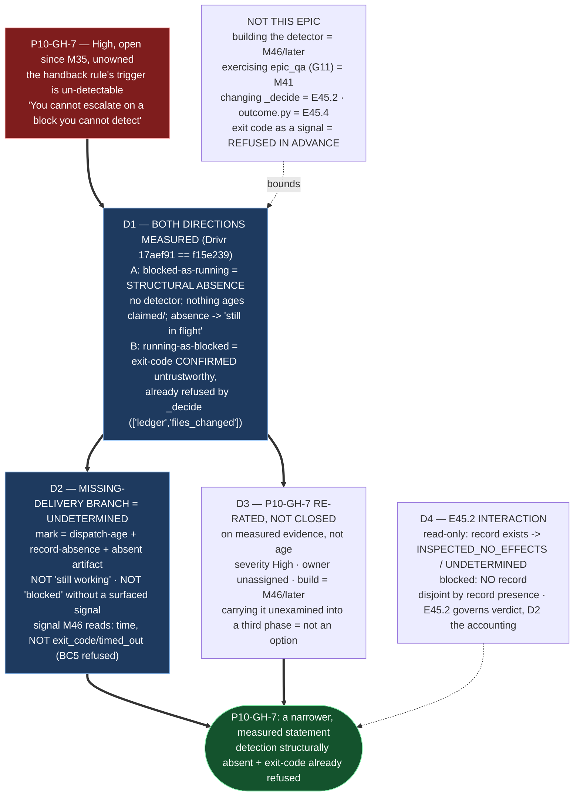

# Delivery Notice: P12-M45-E45.3 — P10-GH-7, Both Directions, Including the Missing Delivery Notice

> **The work landed in `ai-project-system`, not Drivr.** This epic is **measurement and
> adjudication, not a build** (its own Notes section), and the block detector is **not** built here
> (Non-Goal; M46/later). The measurement is a measurement **of** Drivr (`~/soft-dev/drivr`); every
> claim names its repository and ref. The `P10-GH-7` gap record, the record artifact, and this
> notice are committed in **this** repository, branched from **`milestone/M45`**.

**Model-verification note (advisory — `model_verification: advisory` in `.ai-project.yml`).**
The harness self-report names the running model as **`opencode-go/deepseek-v4-flash-vision-exp`**;
the configured expected value for this level (`models.epic_manual`) is **`remote:deepseek-v4-flash`**.
They are the same tier/model line (the `.ai-project.yml` provenance note records that the Deepseek
values resolve via both `opencode/` and `opencode-go/` routes), but the self-report carries a
`-vision-exp` suffix that the configured value does not. Per the **advisory** default I state this
mismatch plainly and proceed; this is not a refusal (advisory means *say it and continue*, never
*say nothing*), and no `blocking` override is configured.

---

## Summary

**Block detection is measured in both directions and the finding is the phase's thesis: a blocked
run is reported as running because there is no detector at all, and the one signal a naive detector
would reach for (the exit code) is confirmed-unreliable and already refused. `P10-GH-7` is therefore
**re-rated, not closed**, on measured evidence rather than on age — carrying it forward unexamined
is what the milestone refuses, and it has been open since M35 (P10).**

The two measurements (D1), the defined missing-Delivery-Notice branch (D2), the re-rating (D3), and
the E45.2 interaction (D4) are all recorded in the measurement-and-adjudication record and reflected
here. **No Drivr code change was made** — the default the spec delegated (design decision #3:
*measure and record, defer the build*) is what this epic adopted, and it is documented as a decision,
not left silent.

---

## Verification layer, time, scope and ref (`P11-GH-2`)

| Axis | Value |
|---|---|
| **Layer** | Block detection is a **scheduling** concern (the milestone Hard Constraint: *a third place: the scheduler/queue* — not a `Completion`/`Reading` change). The E45.2 interaction (D4) is stated against the **`Completion`/`Reading`** verdict produced by a read-only run and the scheduler's **`Disposition`**. Every claim names which. |
| **Time** | **2026-09-03** |
| **Scope (subject — Drivr)** | **`~/soft-dev/drivr`**, measured at **`17aef91`** (branch `epic/P12-M45-E45.2`), which is `f15e239` + E45.2. **G2 re-measure:** `git diff f15e239 17aef91 --` shows E45.2 changed only `drivr/judgment/completion.py`, `drivr/judgment/projections.py`, and three test files; the block-detection modules (`scheduler.py`, `interface.py`, `outcome.py`, `queue/`) are **unchanged**, so all measurements hold at the spec's `f15e239` too. **Nothing in Drivr was modified** — `git status` there is clean. |
| **Scope (governance repo — where the work lands)** | **`ai-project-system`**, branch **`epic/P12-M45-E45.3`**, branched from **`milestone/M45` @ `20122a2`**. Adds: the measurement-and-adjudication record, this Delivery Notice, and the `P10-GH-7` re-rating edit to `governance/systems/chat-hierarchy.md`. |
| **Method (Y4 / Hard Constraint)** | **Direction A (blocked-as-running):** **code-read + constructed-record** — a replay-level demonstration of the scheduler data model. You cannot live-run the *absence* of a detector; it is structural and readable from the code, and I say so rather than presenting it as live discovery. **Direction B (running-as-blocked):** **cited** (E33.2/E33.4 live runs recorded in the P10-GH-7 record) **+ constructed-record** (the `exit_code`/`timed_out` field shapes). I did not re-run E33.4 (non-deterministic) or dispatch a live ceiling-tripping run (wall-clock-expensive); both are named, not substituted. **No claim of a newly-discovered live defect is made.** |
| **Suite (ai-project-system, operative)** | `PYTHONPATH=. python3 -m pytest -q` from the repo root, in the worktree. **Baseline at branch point: 767 passed / 0 failed** (2026-09-03) — one of the three accepted environment-dependent states (the variance is the live-ComfyUI integration test). The governance edit is a document change; the suite confirms only that no code regression was introduced. The Drivr suite (`python3 -m pytest -q`) does **not** cover a document edit, and no Drivr code changed, so there is no Drivr-side regression to measure. |

**P11-GH-2 note — the significant deviation, stated not buried.** The Starter's Method Obligation 8
and Completion section anticipate Drivr-side commits and a verified Drivr push. **No Drivr commit
exists** (the epic makes no Drivr code change), so there is no Drivr branch, no Drivr push, and —
separately — **this Drivr working copy has no configured remote** (`git remote -v` is empty; verify
as E45.2's notice already flagged). The push-verification step therefore did not apply; the deliverable
artifacts and their verification live entirely in `ai-project-system`, where they are push-verifiable.

**P11-GH-1 backstop (widened, run before delivery):** `git fetch origin` and
`git log HEAD..origin/milestone/M45` on `ai-project-system` is **empty** — no amendment to the E45.3
spec, the M45 milestone spec, the E45.1 bar, the E45.2 notice, this Starter, PSG or AOG arrived during
execution. (Drivr has no origin to fetch.) The measurements and the re-rating were written from the
artifacts read at session start, not from memory.

---

## Deliverables

### D1 — Both directions measured ✅

See the record §1 for the full detail. Summary:

| Direction | Claim | Measurement | Method | Result |
|---|---|---|---|---|
| **A — blocked reported as running** (missing-delivery form) | a child that never delivers is indistinguishable from one still working | the scheduler writes a `DispatchRecord` only on a **finished** run; a claimed-but-never-finished run writes **no record** and sits in `claimed/` with **nothing** aging it; a finished-`UNDETERMINED` run is journalled and **the lane moves on** (*"No escalation, no retry, no blocking"*) | **code-read + constructed** (not live) | **CONFIRMED** — the gap, and the phase's predicted direction |
| **B — running reported as blocked** (exit-code form) | the exit code is unreliable, so a naive handback mechanism over-flagging it yields constant false escalations | `exit_code` is *"Known untrustworthy in both directions"*; E33.4 (exit 2, green work) and E33.2 (exit 0, zero work) stand as recorded live evidence; `_decide`'s parameter list is `["ledger", "files_changed"]` (it never reads the exit code) | **cited + constructed** | **CONFIRMED, re-scoped** — a constraint on the future detector, not an active false report today |

**Neither direction could be produced as a fresh live run, and the reason is named per direction**
(the E41.2-S3 discipline, not silently omitted): Direction A's defect is a structural **absence**
(no detector), which a live run cannot instantiate as a discovery; Direction B's cited live evidence
is non-deterministic to reproduce and the live ceiling-trip is wall-clock-expensive. Both are stated
honestly (Y4).

### D2 — The missing-Delivery-Notice branch defined, recorded, not "assume running" ✅

**Defined behaviour: absence is `undetermined`, never an assumed state.** The transition from
`pending` to `undetermined` is marked by **dispatch-age (elapsed wall-clock since `dispatched_at`
exceeding the job's `timeout_s`) + record-absence (no finished `DispatchRecord`) + an absent declared
artifact (a Delivery Notice that was declared but is not present).** The signal a detector must read
is stated for M46/later: **elapsed-time-since-dispatch, record presence/absence, absent-declared-
artifact** — **not** `exit_code`, **not** `timed_out` as a rule term (refused in advance, Binding
Constraint 5). It is **not** "still working" (the fail-open default) and **not** "blocked" without a
positive surfaced signal. **Recorded in:** the E45.3 record artifact and the re-rated `P10-GH-7`
statement in `chat-hierarchy.md` (both in `ai-project-system`). Not built here (Non-Goal and
delegated design decision #3/#4).

### D3 — `P10-GH-7` re-rated, on measured evidence ✅

**Decision: RE-RATED, NOT CLOSED.** The re-rating block and changelog row (`1.7.0`) are committed at
`governance/systems/chat-hierarchy.md`. The evidence does not support closing (detection is
**structurally absent**, not trustworthy), and re-rating on measurement is the legitimate outcome the
milestone spec names. **Amended gap statement:** *block detection is structurally absent — a claimed
but never-finished run, or a run that finishes `undetermined`, produces no signal that a
block/delivery-absence occurred, so absence defaults to "still working"; and the one signal a naive
detector would reach for (the exit code) is confirmed-unreliable and already refused.* **Severity:
High (unchanged). Owner: unassigned (unchanged)** — the build is M46/later, and this epic does not
assign staffing. **G11** is recorded as a remaining compounding gap, not exercised here (M41's lane
measurement is out of scope, per the Non-Goals). This is the first time since M35 the gap has been
measured and re-scoped rather than carried.

### D4 — The E45.2 interaction stated, the governing disposition named ✅

**Written against post-E45.2 behaviour** (a read-only run is no longer `DID_NOT_COMPLETE`). From
effects alone the completion signal **cannot** distinguish "blocked" from "read-only" — but it does
not need to, because they differ in a coarser, decisive way: a read-only run **produces a judged
record** (`Completion.INSPECTED_NO_EFFECTS` → `Reading.UNDETERMINED` → `Disposition.UNDETERMINED`),
while a blocked run (claimed, never finished) **produces no record**. **The distinguishing signal is
record presence + dispatch-age** (the D2 signal). For the narrow overlap (a run that is read-only AND
whose delivery is missing): E45.2 **governs the verdict** (`undetermined`, because a judged record
exists) and D2 **governs the accounting** (an undetermined judgment with no arriving notice is a
fragility flag for M46's detector, not an assumed success and not a block). They are disjoint by the
record's presence and neither folds `undetermined` into "working" or `blocked`. Per the Phase Chat's
Set-3 ruling, **E45.4 inherits this D4** and applies it in `outcome.py` (E45.3 is fenced off from it).

### Structural diagram (Mermaid, inline, no ComfyUI) ✅

- **Description (implemented):** E45.3 measures block detection in both directions against the Drivr
  scheduler and adjudicates `P10-GH-7`. Direction A (blocked-as-running / the missing-delivery form)
  is confirmed as a **structural absence** — there is no detector, a claimed-but-never-finished run
  writes no journal record, and absence of a finished record reads as "still in flight." Direction B
  (running-as-blocked / the exit-code form) is confirmed but re-scoped: the exit code is
  measured-unreliable and the judgment already refuses to read it. The missing-Delivery-Notice branch
  is defined as **`undetermined`**, never "still working" and never "blocked" without a surfaced
  signal, with the signal a detector must read (dispatch-age + record-absence, **not**
  `exit_code`/`timed_out`) stated for M46/later. `P10-GH-7` is **re-rated, not closed**, and the
  E45.2 interaction is stated against post-E45.2 behaviour. Proposed-track Structural diagram
  (AOG §17.3/§17.6), Mermaid, no ComfyUI.

---

## Design decisions (delegated — decided, documented, proceeded)

| # | Decision | Outcome |
|---|---|---|
| 1 | **Close vs re-rate `P10-GH-7`** | **Re-rate.** Closing would assert detection is trustworthy; the measurement shows detection is structurally absent. Re-rating on measurement is the legitimate, named outcome, and the narrower gap statement is committed. |
| 2 | **The exact missing-delivery behaviour** | Absence → `undetermined`, marked by dispatch-age + record-absence + absent-declared-artifact; recorded in the E45.3 record + the re-rated `chat-hierarchy.md` statement. Not a code change (defer the build). |
| 3 | **Is a minimal guard warranted?** | **Adopted the default — measure and record, defer the build.** The measurement shows **no mechanical check already exists** (that is the finding) and a detector is M46's territory (Non-Goal). No guard built → **no guard to falsify** (cf. E45.1's record). |
| 4 | **Which signal the block detector must read** | **Elapsed-time-since-dispatch + record presence/absence + absent-declared-artifact** — stated as a requirement for M46/later, **not built here**. `exit_code`/`timed_out` are explicitly refused as rule terms (BC5). |

## Definition of Done — every item

- [x] Both directions measured, or the unmeasurable direction named with its reason (D1 — both produced; method named per direction)
- [x] The missing-delivery case has a defined, recorded behaviour that is not "assume running" (D2 — `undetermined`)
- [x] `P10-GH-7` is closed or re-rated, with cited evidence (D3 — re-rated, with the amended statement and changelog row)
- [x] The E45.2 interaction is stated, and the governing disposition is named for the overlap case (D4)
- [x] Every claim states the layer, repository, ref and date (`P11-GH-2` + the milestone Hard Constraint)
- [x] Live runs, where a live defect is claimed, are distinguished from replays (Y4 — no live defect is claimed; both directions' methods stated)
- [x] Delivery Notice committed; branch `epic/P12-M45-E45.3` opened for PR to `milestone/M45`

## Acceptance Criteria

- [x] Both directions measured, or the unmeasurable one named with its reason (D1)
- [x] The missing-delivery case has a defined, recorded behaviour that is not "assume running" (D2)
- [x] `P10-GH-7` is closed or re-rated with cited evidence (D3 — re-rated)
- [x] Any overlap with E45.2's verdicts is identified and adjudicated (D4 — disjoint by record presence; E45.2 governs the verdict, D2 the accounting)

---

## Status

⏸️ **Stopped. Awaiting Milestone Chat review and authorization. Not merged.** Per this epic's Starter,
merge authorization for the Delivery Notice PR normally follows the Milestone Chat's Stage-2 review,
and the parent (the M45 Milestone Chat) performs the merge. This delivery is the **first attempt** —
the rework limit (3 attempts plus any written `+1`, PSG §11.6 / the SN-36/37 `+1` amendment) has not
been touched.

**Deviation, stated:** the epic makes **no Drivr code change** (measurement-and-adjudication; the
default to defer the build was adopted and recorded as a decision), so there is no Drivr branch and
no Drivr push to verify — and this Drivr working copy has no configured remote, so a push could not
be made or verified in any case. The push-verifiable artifacts live entirely in `ai-project-system`
(where the commit and PR are). The measurement is a measurement **of** Drivr at `17aef91`; the
Drivr-side application of D2/D4 is E45.4's and M46's (which inherit D4), not this epic's.

Epic E45.3 execution complete. Epic Delivery Notice produced. Awaiting Milestone Chat review and
authorization.
