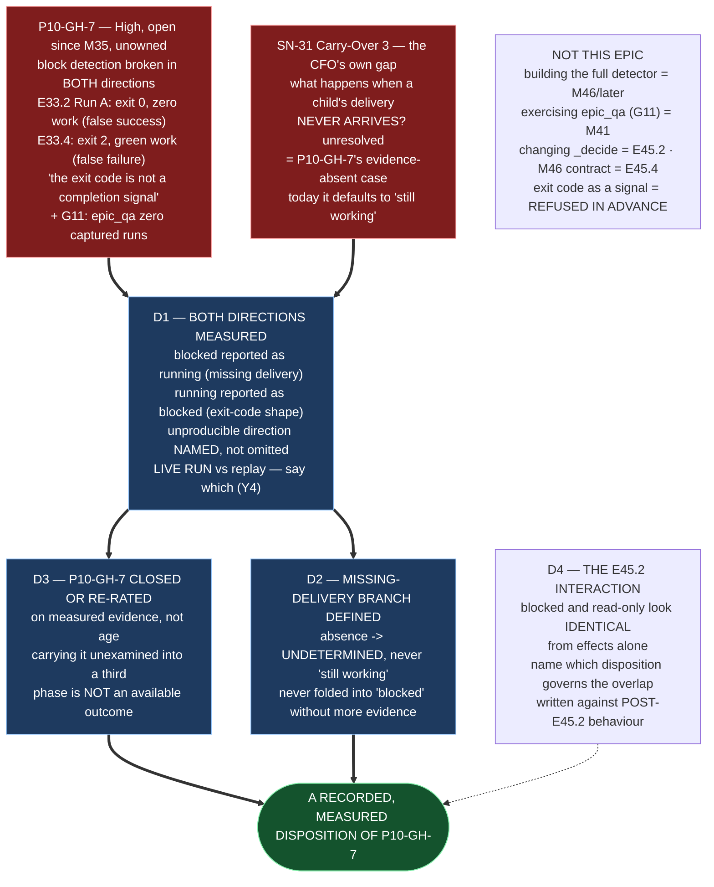

# Epic E45.3 — P10-GH-7, Both Directions, Including the Missing Delivery Notice

## Context

**Is block detection trustworthy? If not, is `P10-GH-7` re-rated on evidence rather than on age?**

`P10-GH-7` is the load-bearing risk under the handback rule: *"You cannot escalate on a block you
cannot detect."* Filed severity **High**, open since **M35**, owner **unassigned**. Its record lives in
`governance/systems/chat-hierarchy.md` under "The signal this rule depends on is measured broken
(P10-GH-7)", and its claim is that detection is broken **in both directions**:

- **False success** — E33.2 Run A returned **exit 0 having done zero work** (the validation would have
  passed on the unchanged repo).
- **False failure** — E33.4 returned **exit 2 having produced complete, green work**.

Corroborated across two projects: **the exit code is not a completion signal on this stack.** Compounded
by **G11** — `epic_qa` has zero captured runs, so the lane best placed to supply a trustworthy signal has
never been exercised.

**SN-31 Carry-Over 3 widens the gap and is the reason it cannot be carried unexamined again.** The CFO
independently arrived at it when asked *what happens if a child's delivery never arrives*, and left it
unresolved. The missing-Delivery-Notice branch is not a fresh defect — **it is `P10-GH-7`'s own
evidence-absent case**: absence of a delivery is exactly the shape this phase is about, and today it
defaults to "still working."

**The Drivr reality (re-measured for this spec, G2):** the scheduler (`drivr/scheduling/scheduler.py`)
journals a run at three timestamps — enqueued, dispatched, finished — and applies the *undetermined
policy*: **a job that ends `UNDETERMINED` is journalled and the lane moves on; no escalation, no retry,
no blocking.** `timed_out` is a field on `ExecutionResult`; `Termination.TIMED_OUT` is *advisory, never a
term in a rule*. `interface.py` records the exit code as *"known untrustworthy in both directions."*
**There is no block detector.** A run that is stuck, and a run that finished and reported nothing, leave
the same shape of record, and nothing in Drivr distinguishes them.

---

## Problem Statement

**A handback rule over an undetectable trigger is an obligation that can only be honoured by accident.**

Two concrete consequences, both live:

1. **A blocked run is reported as running** (the false-success direction, in the missing-delivery form):
   a child that never produces its Delivery Notice is indistinguishable from one still working, so the
   parent waits forever on a delivery that is not coming. **Absence of evidence is read as evidence of
   absence — the phase's organising failure, in the completion signal's sibling.**
2. **A running run is reported as blocked** (the false-failure direction): the exit code is
   measured-unreliable, so a run doing slow-but-real work that trips the wall-clock ceiling reads as
   failed. Built over this signal, a handback mechanism yields **constant false escalations** — the human
   becomes the bottleneck again, worse than before.

**Both directions must be measured now, and the gap must be closed or re-rated on that measurement.**
Carrying `P10-GH-7` unexamined into a third phase is **not an available outcome** (milestone spec).
E45.2 changes what a read-only run returns, which interacts directly with this epic's subject — see
§Scope of Work 4.

---

## Goals

By the end of this Epic, the system must:

1. **Measure block detection in both directions** — a blocked run reported as running, and a running run
   reported as blocked — and record both, or name which it could not produce and why.
2. **Define the missing-Delivery-Notice branch** — a recorded behaviour that is **not** "assume still
   working."
3. **Close or re-rate `P10-GH-7`** on the measured evidence, with cited refs.
4. **State the interaction with E45.2** — a blocked run and a read-only run can look identical from
   effects alone; if the two fixes could disagree about the same run, say so and say which governs.

---

## Non-Goals

This Epic explicitly does **not** aim to:

- **Build a full block detector.** M45 measures and adjudicates the gap; the detector that Drivr builds
  over the resulting signal is downstream (and is M46's territory — the surface — or later). If the
  measurement shows a detector is already buildable, say so; do not build it here unless the spec's
  delegated decision authorises a minimal guard.
- **Exercise the `epic_qa` lane.** G11's *zero captured runs* is a finding E45.3 records; filling it is
  a model-lineup question (M41's lane measurement), not this epic's.
- **Change `_decide` or the completion judgment** (E45.2's). The interaction is stated, not re-decided.
- **Write the M46 contract** (E45.4's).
- **Fold `undetermined` into `blocked` or `in progress`.** Refused (Binding Constraint 2). A missing
  delivery is *undetermined*, not a silently-assumed "still working" and not an over-claimed "blocked".

---

## Scope of Work

### 1. Both directions measured (D1)

**Produce the two measurements `P10-GH-7` claims, against the current Drivr (`f15e239`).**

- **A blocked run reported as running** — a run that stalls (or a child that never delivers), and what
  the current machinery reports for it. **This is the missing-delivery direction** and is the one the
  phase's thesis predicts.
- **A running run reported as blocked** — a run doing real work that the current signal reads as failed
  (the exit-code direction, E33.4's shape).

**Must include:** which direction could be produced, which could not, and **why** — with the exit code,
the ledger shape, and the termination reason for each. A direction that cannot be produced is **named
with its reason**, not silently omitted (the E41.2 S3 discipline). **Only a live run evidences a live
defect** (Y4): a measurement taken from committed transcripts is a replay, and a replay is a regression
guard, not a discovery instrument — say which you used and do not overclaim.

### 2. The missing-Delivery-Notice branch (D2)

**Define the recorded behaviour for *a child's delivery never arrives*.**

The current behaviour is the fail-open default: absence reads as "still working." The defined behaviour
must make absence **an `undetermined` state, not an assumed state** — the evidence-absent case, exactly
as `_decide` treats an absent ledger. It must say:

- **What marks the point** at which a delivery that has not arrived is *undetermined* rather than
  *pending* (a timeout, a missing dispatch record, an absent artifact where one was declared).
- **What it is not** — not "still working", and not (without more evidence) "blocked".
- **Where it is recorded** (the repository and the artifact), per the Hard Constraint.

### 3. Closed or re-rated, with evidence (D3)

**The disposition of `P10-GH-7`, on the measured evidence.**

**Re-rating on measurement is a legitimate outcome** (milestone spec). Close it only if the evidence
shows detection is now trustworthy; otherwise re-rate it — a narrower statement of what exactly is
untrustworthy, on which signal, measured when. **Carrying it forward unexamined is not an option.**

**Must include:** the decision; the evidence that supports it (D1's measurements); and — if re-rated —
the amended gap statement, ready to land in `governance/systems/chat-hierarchy.md`'s P10-GH-7 section
with a changelog row.

### 4. The interaction with E45.2 (D4)

**A blocked run and a read-only run can look identical from effects alone** — both produce no effects,
both now land somewhere in the `undetermined`/inspection region after E45.2. State:

- Whether the completion signal can **ever** distinguish "blocked" from "read-only" from effects alone —
  and if it cannot (which is expected), **what signal must** (time, absence of a delivery, a missing
  dispatch record).
- **If the two fixes could disagree about the same run, which governs.** E45.2 changes the verdict of a
  read-only run; this epic changes what *absence of a delivery* means. If a single run is both read-only
  and its delivery is missing, the record must say which disposition wins, and why.

---

## Deliverables

- [ ] **D1** — Both directions measured, or the unmeasurable direction named with its reason
- [ ] **D2** — The missing-Delivery-Notice branch defined, recorded, and not "assume running"
- [ ] **D3** — `P10-GH-7` closed or re-rated, with cited evidence
- [ ] **D4** — The E45.2 interaction stated, and the governing disposition named
- [ ] Structural diagram (Mermaid, inline, no ComfyUI)
- [ ] **Epic Delivery Notice**

---

## Binding Constraints

Settled above this epic — **not re-decidable here** (milestone spec §Binding Constraints):

1. **M45 gates M46**, by construction.
2. **`undetermined` is first-class** — never folded into `in progress`, never into `blocked`.
3. **The bar is stated before the work** — E45.1's bar is the first commit on its branch.
4. **No model-generated judgment may be load-bearing** (E39.1). Block detection, if it becomes a rule,
   is machinery, not a model's opinion.
5. **`_decide`'s independence is not to be weakened.** Exit codes are refused in advance as a signal —
   measured-unreliable in both directions on this stack. **A block detector may not reintroduce the exit
   code as a load-bearing signal.**

## Hard Constraint (binding — carried to every Epic)

**This milestone builds the thing that decides whether other things worked. It must not be trusted on
its own report.**

- **State the layer.** `Completion` or `Reading` — every claim names which, per Y3. **Block detection is
  a *scheduling* concern (a third place: the scheduler/queue), not a `Completion` or `Reading` change.**
- **State the repository.** This epic spans two: the measurement and the missing-delivery defined
  behaviour are **Drivr-side**; the `P10-GH-7` gap record is in **`governance/systems/chat-hierarchy.md`
  (this repository)**. Name which repository each deliverable lands in.
- **Only a live run counts as evidence of a live defect.** A replay suite is a regression guard, not a
  discovery instrument.
- **Prove every guard by falsifying it** — remove the change, watch the check fail.
- **Pin the ref, and record it.** A number without a ref is not a measurement.
- **`undetermined` is the answer when the evidence is absent. It is never a synonym for "no".**

---

## Design Decisions Delegated — decide, document, proceed

1. **Close vs re-rate** — `P10-GH-7`'s disposition, on D1's evidence. Re-rating is explicitly legitimate;
   carrying it unexamined is not.
2. **The exact missing-delivery behaviour** — what marks the transition from *pending* to *undetermined*
   (timeout, missing record, absent declared artifact), and where it is recorded.
3. **Whether a minimal guard is warranted** — if the measurement shows a mechanical check already exists
   or is trivially derivable, whether to land it now or defer to the detector's build. The default is
   **measure and record, defer the build**; adopting a guard is a decision to document.
4. **Which signal the block detector must ultimately read** (time, delivery-absence, dispatch-record) —
   stated as a requirement for M46/later, not built here.

---

## Definition of Done

Epic E45.3 is complete when:

- [ ] Both directions are measured, or the unmeasurable direction is named with its reason
- [ ] The missing-Delivery-Notice case has a defined, recorded behaviour that is not "assume running"
- [ ] `P10-GH-7` is closed or re-rated, with cited evidence (refs and dates)
- [ ] The E45.2 interaction is stated, and the governing disposition is named for the overlap case
- [ ] Every claim states the layer, repository, ref and date (`P11-GH-2` + the milestone Hard Constraint)
- [ ] Live runs, where a live defect is claimed, are distinguished from replays (Y4)
- [ ] Delivery Notice committed; PR opened to `milestone/M45`

## Acceptance Criteria

- [ ] Both directions measured, or the unmeasurable one named with its reason
- [ ] The missing-delivery case has a defined, recorded behaviour that is not "assume running"
- [ ] `P10-GH-7` is closed or re-rated with cited evidence
- [ ] Any overlap with E45.2's verdicts is identified and adjudicated

## Technical Constraints

**Repository (two):** the measurement and the missing-delivery defined behaviour are **Drivr-side**
(`~/soft-dev/drivr`, `f15e239`); the `P10-GH-7` gap record and its re-rating/closure land in
**`governance/systems/chat-hierarchy.md` (this repository)**. Name the repository of every deliverable.
**Do not touch:** `drivr/judgment/completion.py` and `drivr/scheduling/outcome.py` (E45.2/E45.4's
subjects); the `epic_qa` lane configuration (M41's); `.ai-project.yml`.
**Do not introduce the exit code as a load-bearing signal** (Binding Constraint 5; measured-unreliable in
both directions).
**Invocation:** `python3 -m pytest -q` from the Drivr root; `PYTHONPATH=. pytest -q` in this repository.
**Baselines:** Drivr **469** at `f15e239`; `ai-project-system` **767** on `milestone/M45`.

## Dependencies

**Internal**
- **E45.2 is in flight in parallel** — this epic's interaction statement (D4) is written against the
  **post-E45.2** behaviour of a read-only run (no longer `DID_NOT_COMPLETE`), and says so.
- **The `P10-GH-7` record** in `governance/systems/chat-hierarchy.md` — the re-rating/closure edits this
  file, with a changelog row.

**External**
- **Drivr at `~/soft-dev/drivr`, `f15e239`** — re-measured for this spec; the scheduler, `timed_out`,
  and `Termination.TIMED_OUT` live here.
- **A reachable engine** for the live-run measurement (D1). Y4's lesson binds: a direction that cannot
  be run live is named as unproduced, not substituted with a replay.

**Blockers**
- None at planning. The false-failure direction (E33.4's shape) is constructible; the false-success
  direction (stalled run / missing delivery) is constructible from the scheduler's own record shape.

## Timeline

**Estimated Effort:** 1 session — the measurements are bounded; the substance is the adjudication and the
missing-delivery definition.
**Target Completion:** after E45.1, before E45.4 (E45.2 and E45.3 are independent of each other).
**Actual Completion:** In progress.

## Execution Notes

**Order:**
1. Re-measure the scheduler and `P10-GH-7`'s record at your branch point (G2).
2. Produce the two measurements (D1), stating which were live runs and which replays.
3. Define the missing-delivery behaviour (D2).
4. Close or re-rate `P10-GH-7` (D3), with the amended gap statement ready for `chat-hierarchy.md`.
5. State the E45.2 interaction (D4) against post-E45.2 behaviour.
6. Run the Drivr suite (and this repo's if a governance edit lands); state the invocation and the ref.

**Traps this project has already paid for:**

- **A direction measured only by replay, reported as live evidence** (Y4). Name the method.
- **Folding `undetermined` into `blocked`** — over-claims; or into "still working" — the fail-open
  default. Absence of a delivery is *undetermined*.
- **Reintroducing the exit code** as a load-bearing signal (Binding Constraint 5, refused in advance).
- **Carrying `P10-GH-7` unexamined into a third phase** — not an available outcome.
- **Reading the E45.2 interaction against pre-E45.2 behaviour** — a read-only run is no longer
  `DID_NOT_COMPLETE` once E45.2 lands; write against that.
- **`git status` before every commit**; two repositories, **two pushes, two `origin`s**.

## Related Documents

- [M45 Milestone Spec](P12-M45__milestone-spec.md) — v1.0.0; E45.3 Epic Detail, Binding Constraints,
  Hard Constraint
- [E45.2 Spec](P12-M45-E45.2__spec__judgment-sees-inspection-read-only-verdict.md) — the interaction (D4)
- [P12 Phase Spec](P12__phase-spec.md) — §P12.5 (M45)
- `governance/systems/chat-hierarchy.md` — "Handback" and "The signal this rule depends on is measured
  broken (P10-GH-7)"
- [P10 Phase Spec](../../P10__Fleet_Adoption_and_Local_Inference_Proving/P10__phase-spec.md) — §P10.3,
  P10-GH-7 registration
- [P10 Phase Closure Declaration](../../P10__Fleet_Adoption_and_Local_Inference_Proving/P10__phase-closure-declaration.md) —
  the P10-GH-7 carry-forward entry
- [SN-31 steering note](../../../.ai-project/artifacts/steering-notes/2026-08-18__creation-chat__steering-note__P12-spine-fail-open.md) —
  Carry-Over 3
- Drivr `drivr/scheduling/scheduler.py`, `drivr/scheduling/outcome.py`, `drivr/execution/interface.py` at
  `f15e239`
- [PROJECT-SYSTEM-GUIDELINES.md](../../../governance/PROJECT-SYSTEM-GUIDELINES.md)
- [AI-OPERATING-GUIDELINES.md](../../../governance/AI-OPERATING-GUIDELINES.md)

## Visual Bindings

**Visual binding**
- **Link:** (inline — Structural diagram; no hosted link needed per AOG §17.3/§17.5)
- **What:** diagram
- **Level:** Epic
- **State:** proposed

- **Description:** E45.3 measures block detection in both directions and adjudicates `P10-GH-7`, which
  has been open since M35. The gap's two directions — false success (exit 0, zero work) and false failure
  (exit 2, green work) — are joined by the SN-31 Carry-Over 3 branch, the CFO's own unresolved question of
  what happens when a child's delivery never arrives, which is the gap's evidence-absent case and today
  defaults to "still working." The epic measures both directions, defines the missing-delivery behaviour
  as `undetermined` rather than assumed, closes or re-rates the gap on evidence, and states the E45.2
  interaction — blocked and read-only look identical from effects alone. Proposed-track Structural
  diagram (AOG §17.3/§17.6), Mermaid, no ComfyUI.

## Notes

- **Why this is a measurement-and-adjudication epic, not a build.** The milestone spec's own framing:
  *"Re-rating on measurement is a legitimate outcome; carrying it forward unexamined for a third phase is
  not."* The gap has lived unexamined since M35; E45.3's first obligation is to *know*, not to *build*.
  Building a detector over a signal this epic has not yet re-measured would be the exact
  bar-after-the-data error the milestone refuses.

- **The two-repository boundary is the hard part, and it is deliberate.** The measurement and the
  missing-delivery defined behaviour are Drivr-side; the `P10-GH-7` record is in
  `governance/systems/chat-hierarchy.md`. A delivery that does not name which repository each deliverable
  lands in cannot be verified — the milestone Hard Constraint, applied to a gap that spans the boundary.

- **The missing-delivery branch is `P10-GH-7`'s evidence-absent case, not a sibling defect.** A delivery
  that never arrives is *the same shape* as an absent ledger: the thing that would have produced the
  evidence never did. The repair is the same as `_decide`'s: *undetermined*, not an assumed state.

## Changelog

| Version | Date | Change |
|---|---|---|
| 1.0.0 | 2026-09-03 | Initial E45.3 spec, from the M45 milestone spec v1.0.0 (E45.3 Epic Detail, Binding Constraints, Hard Constraint), the `P10-GH-7` record in `chat-hierarchy.md`, SN-31 Carry-Over 3, and Drivr source re-measured at `f15e239` (G2). Measures both directions, defines the missing-delivery branch as `undetermined` not "still working", makes close-or-re-rate the outcome (re-rating legitimate, carrying unexamined not an option), and states the E45.2 interaction against post-E45.2 behaviour. Delegates close-vs-re-rate, the exact missing-delivery behaviour, and whether a minimal guard is warranted. No scope, ordering, gate or acceptance-criterion change from the milestone spec. |
