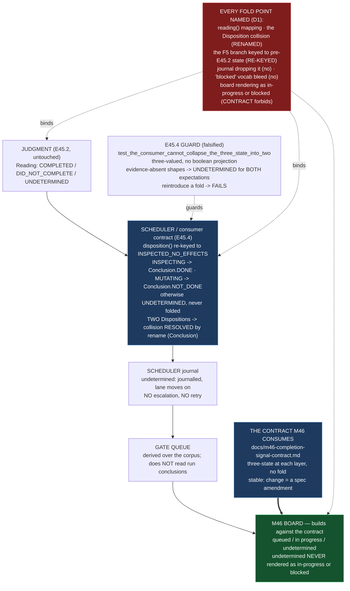

# Delivery Notice: P12-M45-E45.4 — `undetermined` First-Class End to End, and the Contract M46 Consumes

> **The work landed in Drivr, not here.** The E45.4 spec, the M45 milestone spec, the E45.1 bar, and the
> E45.2/E45.3 specs are cited by path and branch, never by version or sha. `merge_details` describe a
> merge that has not happened and are unfillable at delivery time (`P10-GH-4`, restated). Merge
> authorization follows the M45 Milestone Chat's Stage-2 review, and the parent performs the merge.

---

## Summary

**`undetermined` now survives the whole path — judgment → scheduler → surface — and M46 has the
written contract it builds its board against, so it does not infer one.**

E45.1 measured the starting line (read-only case → `did-not-complete`, bar PC1 FAIL); E45.2 made the
judgment honest (read-only → `Reading.UNDETERMINED`) and deliberately fenced off
`drivr/scheduling/outcome.py`; E45.3 adjudicated the blocked/read-only overlap. **E45.4 is the
boundary the signal was being trusted across.** It reconciles the consumer contract (`outcome.py`) to
the post-E45.2 signal (the §F5 compensation no longer fired), resolves the two-`Disposition` collision,
lands a guard that fails when a fold is reintroduced, writes the stable M46 contract, and reports the
post-fix `undetermined` rate instead of suppressing it.

---

## Verification layer, time, scope and ref (`P11-GH-2`)

| Axis | Value |
|---|---|
| **Layer** | Three layers are touched: the **`Completion`** layer (the §F5 compensation now keys on `Completion.INSPECTED_NO_EFFECTS`, not the pre-E45.2 `NO_EFFECTS_OBSERVED`), the **`Disposition`/`Conclusion`** layer (the scheduler's conclusion type is renamed `Conclusion`; still three-valued `DONE`/`NOT_DONE`/`UNDETERMINED`), and the **board** layer (the M46 contract — `queued`/`in progress`/`undetermined`). The judgment's `Completion`/`Reading` are **untouched** (E45.2's). Every claim below names which. |
| **Time** | **2026-09-03** |
| **Scope (Drivr — where the work lands)** | **`~/soft-dev/drivr`**, branch **`epic/P12-M45-E45.4`**, branched from **`epic/P12-M45-E45.2` @ `17aef91`** (G2 — the milestone spec pinned `f60164c`; Drivr moved to `f15e239`; E45.4 is written against **post-E45.2** behaviour, so its base is the E45.2 HEAD). Changed: `drivr/scheduling/outcome.py`, `drivr/scheduling/scheduler.py`, `drivr/scheduling/__init__.py`, `tests/test_scheduling_outcome.py`, `tests/test_scheduler.py`, and the new `docs/m46-completion-signal-contract.md`. **Not changed:** `drivr/judgment/completion.py` (E45.2's), `drivr/judgment/__init__.py` (fenced), `Reading`'s three-value shape, `.ai-project.yml`, the `epic_qa` lane. |
| **Scope (governance repo)** | **`ai-project-system`**, branch **`epic/P12-M45-E45.4`**, branched from **`milestone/M45` @ `9f9e76b`** (after E45.3 landed). Adds this Delivery Notice only. |
| **Repo for `git log`** | Drivr HEAD at delivery: **`e9956f2`** (`feat(E45.4): undetermined is first-class end to end …`), on `epic/P12-M45-E45.4`, on top of `17aef91` (E45.2). |
| **Suite (Drivr, operative)** | `python3 -m pytest -q` from the Drivr root. **Baseline at branch point: 470 passed / 0 failed** (G2 re-measure at `17aef91`, post-E45.2; the planning baseline was 469 at `f15e239`). **After: 471 passed / 0 failed** (470 + the one new no-fold guard test). The `ai-project-system` suite (`PYTHONPATH=. pytest -q`) does **not** cover Drivr and is not a measurement of anything this epic produced. |

**P11-GH-2 note — a deviation, stated not buried (and already on the record).** The starter assumes
"Drivr has its own `origin`" and instructs "verify the Drivr push at Drivr's origin." **This Drivr has
no configured remote** (`git remote -v` is empty), per the M45 carry-forward note
`P12__carry-forward-note__drivr-no-remote-recoverability.md`. The Drivr commit exists locally on
`epic/P12-M45-E45.4` (verified `e9956f2`), but there is no origin and **no push could be made or
verified**. The committed content is the source of truth; the push-verification step is **not
performed** for reasons external to this epic, and I say so rather than pretending otherwise.

**P11-GH-1 backstop (widened, run before delivery):** `git log HEAD..origin/milestone/M45` on
`ai-project-system` was applied (E45.3 landed during execution — fast-forwarded and re-measured), and `git
fetch` on Drivr finds no origin. No amendment to the E45.4 spec, the M45 milestone spec, the E45.1 bar,
any prior epic's spec, the Starter, PSG or AOG arrived during execution (the E45.3 arrival was a
**merge, not an amendment to E45.4's own governing artifacts**). The design decisions and every measured
number were written from the artifacts read at session start, not from memory.

---

## Deliverables

### D1 — The full path traced, every folding point named, with layer and ref ✅

The path is judgment → scheduler (consumer contract) → scheduler journal → gate queue → M46 surface,
and the itemized fold points — never a bare count:

| # | Point (module) | The fold risk | Layer | Resolved |
|---|---|---|---|---|
| 1 | `Verdict.reading()` (`drivr/judgment/completion.py:185`) | mapping `UNDETERMINED` into `DID_NOT_COMPLETE` (the Y1 defect, in reverse) | `Reading` | **No fold** — already three-valued; E45.2 fixed the reverse. |
| 2 | `disposition()` + the `Disposition` name (`drivr/scheduling/outcome.py`) | the **two-`Disposition` collision**; and the §F5 branch keyed to a pre-E45.2 `Completion` | `Disposition`/scheduler | **Resolved** — rename (`Conclusion`) + re-key (see D2). |
| 3 | scheduler `_capture` / `disposition.txt` (`drivr/scheduling/scheduler.py`) | `undetermined` dropped or written as "nothing happened" | scheduler journal | **No fold** — the journal writes the conclusion's value under the label `disposition:` for every finished run; the undetermined policy journals and moves on. |
| 4 | gate queue `OPEN_STATUSES` (`drivr/queue/gates.py`) | `blocked`/`unresolved` vocabulary bleeding into the run's state | gate queue | **No fold** — the queue computes over the governance *corpus*, not run dispositions; it does not read `Conclusion` at all. |
| 5 | the M46 board | `undetermined` rendered as `in progress` or `blocked` | board | **Prevented** — the M46 contract's no-fold rule (see D3), with the guard as backstop (see D2). |

### D2 — The consumer contract reconciled; `undetermined` never folded; the guard fails on a fold ✅

**The two-`Disposition` collision, resolved by rename.** Drivr had two enums named `Disposition`
(Y3/Y5): `drivr.judgment.Disposition` (*how an input figured* — `USED`/`ABSENT`/`IGNORED`/`NOTED`)
and `drivr.scheduling.outcome.Disposition` (*what the scheduler concludes* — `DONE`/`NOT_DONE`/
`UNDETERMINED`). The judgment layer is E45.2's fenced surface, so the scheduler's type is renamed
**`Disposition` → `Conclusion`** (`outcome.py`, `scheduler.py`, `scheduling/__init__.py`, the tests).
The two are no longer name-identical, so no import can bind them to the same name. `LaneOutcome`'s
field stays `disposition` (typed `Conclusion`) and the journal label stays `disposition:` to avoid a
churn in the record format.

**The §F5 compensation, re-keyed (not retired).** E40.1 keyed the read-only compensation to the
pre-E45.2 `Completion.NO_EFFECTS_OBSERVED`; E45.2 removed that state for a read-only run (it now reads
`INSPECTED_NO_EFFECTS`), so the branch stopped firing and a read-only inspecting run briefly read
`UNDETERMINED`. The compensation's job still exists — an inspecting job is `DONE` — so E45.4 re-keys
it to `Completion.INSPECTED_NO_EFFECTS`:

| Judgment (`Completion`) | `Expectation` | Scheduler `Conclusion` |
|---|---|---|
| `INSPECTED_NO_EFFECTS` | `INSPECTING` | `DONE` (§F5, re-keyed) |
| `INSPECTED_NO_EFFECTS` | `MUTATING` | `NOT_DONE` (asked to change, changed nothing) |

`read_only_completion` is re-keyed to `INSPECTED_NO_EFFECTS ∧ Conclusion.DONE`. The still-earned
negatives under `NO_EFFECTS_OBSERVED` (empty ledger → `NOT_DONE`; no ledger at all → `UNDETERMINED`)
are preserved. **No consumer collapses the three-state reading into two: `Conclusion` stays
three-valued, and a determinate conclusion here is earned only from the scheduler's recorded
`Expectation` term (the job's intent), never from the absence of evidence.** That is precisely the §F5
case the consumer contract exists to resolve (an `INSPECTING` job that inspected is `DONE`), and it is a
re-key of E40.1's behaviour, not a fold: everywhere the evidence is genuinely too thin and the
expectation is not decisive (absent ledger, unverified effects, unrecognised ledger) the conclusion is
`UNDETERMINED` for **both** expectations.

**The guard, and its falsification.** `tests/test_scheduling_outcome.py::test_the_consumer_cannot_collapse_the_three_state_into_two`
is the consumer-side counterpart to the judgment's
`test_reading_is_three_valued_and_cannot_collapse_to_a_boolean`. It asserts `Conclusion` is
three-valued, offers no boolean projection, **and** that for every evidence-absent shape both
expectations read `UNDETERMINED`. Falsified (Hard Constraint: *prove every guard by falsifying it*):

```
FOLD REINTRODUCED:  EFFECTS_UNVERIFIED -> Conclusion.NOT_DONE   # (one of the absent shapes)
WATCH THE GUARD FAIL:
  test_the_consumer_cannot_collapse_the_three_state_into_two FAILED
    AssertionError: a fold: an evidence-absent shape with expectation 'mutating'
    was mapped to 'not-done'            # (<Conclusion.NOT_DONE> is not <Conclusion.UNDETERMINED>)
RESTORED:          EFFECTS_UNVERIFIED -> Conclusion.UNDETERMINED
  test_the_consumer_cannot_collapse_the_three_state_into_two PASSED
```

### D3 — The M46 contract, written down and stable ✅

**`~/soft-dev/drivr/docs/m46-completion-signal-contract.md`** — see the file. It states: the four named
layers (`Completion` / `Reading` / `Disposition` / `Conclusion`) and the collision-resolution (scheduler
type renamed `Conclusion`); the no-fold rule (**a run whose `Conclusion` is `UNDETERMINED` is rendered
`undetermined` — never `in progress`, never `blocked`, never `done`/`not-done`**); M46's board vocabulary
(`queued` / `in progress` / `undetermined`); and that **a change to the contract is a spec amendment**
(a changelog row, parent-reviewed), not a silent edit. Its authoritative source is named
(`outcome.py`, `completion.py`, and the no-fold guard).

### D4 — The post-fix `undetermined` rate, reported not suppressed ✅

On E45.1's evidence set (3 cases), post-E45.2 + E45.4, measured against Drivr `e9956f2` on 2026-09-03
by running Drivr's own `judge_completion` + `disposition` on the E45.1 declared shapes:

| Case | Judgment `Reading` | Scheduler `Conclusion` (dispatch) |
|---|---|---|
| C1 (read-only) | **`undetermined`** | `done` (INSPECTING) / `not-done` (MUTATING) |
| C2 (flag) | `did-not-complete` | `not-done` |
| C3 (pass) | `completed` | `done` |

**The `Reading`-layer undetermined count is 1 of 3 (C1)**, and per the bar's D5 rule it **scores
correct** (the evidence that the deliverable exists is genuinely absent). The signal now scores **3/3**
(baseline 1/3; PC1–PC4 all pass — PC1 moved from FAIL at E45.1 to pass). **A rate changed by redefinition
— renaming `undetermined` as something else to make the board look healthier — is prohibited** (M45 DoD);
this 1/3 is published, not improved. Method, stated honestly (Hard Constraint): this is a measurement of
the post-fix judgment against the **declared** E45.1 shapes at the ref — not a fresh live-engine dispatch,
and it makes **no live-defect discovery claim**. The live discovery of the pre-fix defect was E45.1's
(live run at Drivr `f15e239` → `did-not-complete`), and the live read-only→`undetermined` confirmation is
E45.2's; D4 reports the post-fix rate, it does not re-do either discovery. `undetermined` is the answer
when the evidence is absent; it is never a synonym for "no".

### Inherited E45.3 D4 (applied, not re-decided) ✅

E45.3's D4 (landed in `epic/P12-M45-E45.3` and now in `milestone/M45`) is inherited per the Phase Chat's
Set-3 ruling: a read-only run **produces a judged record** (`INSPECTED_NO_EFFECTS` → `UNDETERMINED` →
`Conclusion`), while a blocked run **produces no record** — they are **disjoint by record presence**;
E45.2/E45.4 govern the verdict, E45.3's D2 governs the accounting. This epic does not re-decide it and
does not fold `undetermined` into "working" or `blocked`. E45.4 could not be built without touching
`drivr/judgment/completion.py`, so the escalation criterion in the Starter was **not** triggered.

### Structural diagram (Mermaid, inline, no ComfyUI) ✅

See Visual Bindings below, inline in this notice.

---

## Design decisions (delegated — decided, documented, proceeded)

| # | Decision | Outcome |
|---|---|---|
| 1 | **The fate of the §F5 compensation** (`read_only_completion`) | **Re-key.** The compensation's job (an inspecting job is `DONE`) still exists; only the `Completion` value it reads changed (`NO_EFFECTS_OBSERVED` → `INSPECTED_NO_EFFECTS`). Not retired and not kept-as-is. The `INSPECTING` → `DONE` case and the `MUTATING` → `NOT_DONE` inverse are both re-keyed; `UNDETERMINED` stays first-class otherwise. |
| 2 | **How the two-`Disposition` collision is resolved** | **Rename**, not annotate. The scheduler's conclusion type is renamed `Disposition` → `Conclusion`; the judgment's `Disposition` (E45.2's fenced surface) is untouched. The M46 contract names this resolution. |
| 3 | **The M46 contract's text and location** | `~/soft-dev/drivr/docs/m46-completion-signal-contract.md`. States the four layers, the no-fold rule, the board vocabulary (`queued`/`in progress`/`undetermined`), and that a change is a spec amendment. |
| 4 | **The guard's placement and form** | A consumer-side test in `tests/test_scheduling_outcome.py` (`test_the_consumer_cannot_collapse_the_three_state_into_two`), asserting three-valuedness, no boolean projection, and the both-expectations-`UNDETERMINED` exhaustion over evidence-absent shapes. Falsified by reintroducing a fold. |
| 5 | **The base of the branch** | Drivr `epic/P12-M45-E45.4` is branched from `epic/P12-M45-E45.2` @ `17aef91`, not from `main` @ `f15e239`, because E45.4 is written against **post-E45.2** behaviour and needs `Completion.INSPECTED_NO_EFFECTS` present. |

---

## Definition of Done — every item

- [x] The full path is traced and every folding point is named (D1)
- [x] No consumer maps `undetermined` onto another state; the guard fails when a fold is reintroduced (D2, falsified)
- [x] The M46 contract is written down and is stable (D3)
- [x] The post-fix `undetermined` rate is reported, not suppressed (D4 — 1/3, published)
- [x] Every claim states the layer, repository, ref and date (`P11-GH-2` + the milestone Hard Constraint)
- [x] Drivr suite green at **471** with the invocation (`python3 -m pytest -q`) and the ref (`17aef91` branch point; `e9956f2` delivery) stated — baseline 470 at the branch point, 469 at `f15e239` (G2)
- [x] Delivery Notice committed; branch `epic/P12-M45-E45.4` opened for PR to `milestone/M45`

## Acceptance Criteria

- [x] The full path is traced and every folding point is named
- [x] No consumer maps `undetermined` onto another state
- [x] The M46 contract is written down and is stable
- [x] The guard fails when a fold is reintroduced (falsified, D2)
- [x] The post-fix `undetermined` rate is reported, not suppressed (D4)

---

## Visual Bindings

**Visual binding**
- **Link:** (inline — Structural diagram; no hosted link needed per AOG §17.3/§17.5)
- **What:** diagram
- **Level:** Epic
- **State:** proposed



- **Description (implemented):** E45.4 reconciles the consumer contract to the post-E45.2 signal. The
  §F5 compensation is re-keyed from `NO_EFFECTS_OBSERVED` to `INSPECTED_NO_EFFECTS` (an `INSPECTING` run
  reads `Conclusion.DONE`; a `MUTATING` run reads `NOT_DONE`; otherwise `UNDETERMINED`, never folded); the
  two-`Disposition` collision is resolved by renaming the scheduler's conclusion type to `Conclusion`; a
  guard that fails when a fold is reintroduced is landed and falsified; and the stable contract M46 builds
  its   board against is written (`queued`/`in progress`/`undetermined`, no-fold). The path judgment →
  scheduler → surface is traced with every fold point named. Proposed-track Structural diagram (AOG
  §17.3/§17.6), Mermaid, no ComfyUI.

---

## Status

⏸️ **Stopped. Awaiting Milestone Chat review and authorization. Not merged.** Per this epic's Starter,
merge authorization for the Delivery Notice PR normally follows the Milestone Chat's Stage-2 review, and
the parent (the M45 Milestone Chat) performs the merge. This delivery is the **first attempt** — the rework
limit (3 attempts plus any written `+1`, PSG §11.6 / the SN-36/37 `+1` amendment) has not been touched.

**Deviation, stated:** the Drivr working copy has **no configured remote**, so the Drivr commit
(`e9956f2` on `epic/P12-M45-E45.4`) exists locally but **was not pushed or push-verified** — per the M45
carry-forward note. The Hard Constraint's *"a deliverable that does not say where it lands cannot be
verified"* is honoured in the sense that every claim names the Drivr repo and ref; the push-verification
step could only be performed in this repository (`ai-project-system`), where the Delivery Notice is
committed and the PR is opened. I flag this so the Milestone Chat can resolve whether the Drivr remote is
expected to be configured before acceptance.

**E45.3 dependency status:** E45.3 landed during this epic's execution (merged to `milestone/M45` @
`9f9e76b`, then `origin/milestone/M45`). Its D4 is inherited and applied (record-presence disjunction);
none of E45.4's decisions required re-deciding it, so no escalation was triggered.

Epic E45.4 execution complete. Epic Delivery Notice produced. Awaiting Milestone Chat review and
authorization.
