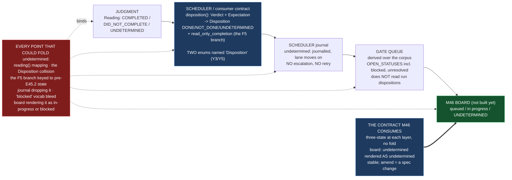

# Epic E45.4 — `undetermined` First-Class End to End, and the Contract M46 Consumes

## Context

**Does `undetermined` survive the whole path — from the judgment to the thing that renders it?**

E45.2 makes a read-only run *honest* (no longer `DID_NOT_COMPLETE`); E45.3 adjudicates whether a
blocked run is detectable at all. Neither owns the boundary where the signal leaves the judgment and
becomes something a consumer acts on. That boundary is this epic's, and it is where the CFO's ruling
lives or dies: **`undetermined` is a first-class state, never folded into a neighbour.**

The end-to-end path (traced and re-measured for this spec, G2, at Drivr `f15e239`):

1. **Judgment** — `judge_completion` returns a `Verdict`; `Verdict.reading()` projects to `Reading`
   (`COMPLETED` / `DID_NOT_COMPLETE` / `UNDETERMINED`). Three-valued by construction; the judgment
   layer.
2. **Scheduler / consumer contract** — `drivr/scheduling/outcome.py`'s `disposition()` maps a `Verdict`
   **plus the job's `Expectation`** onto `Disposition` (`DONE` / `NOT_DONE` / `UNDETERMINED`), carrying a
   `read_only_completion` flag for the §F5 case. A *different* coarse vocabulary, at a *different* layer.
3. **Scheduler journal** — `scheduler._capture` writes `disposition.txt` and `record.json`; the
   *undetermined policy* is "journalled, the lane moves on; no escalation, no retry."
4. **Gate queue** — `drivr/queue/` computes a derived queue over the *corpus* (`OPEN_STATUSES` includes
   `blocked`, `unresolved`); it does **not** read run dispositions.
5. **Surface** — M46's board, not yet built. The phase spec fixes its vocabulary: `queued` / `in
   progress` / **`undetermined`**.

**The one finding this epic must carry, measured while tracing (Y3/Y5 made concrete):** there are
**two enums named `Disposition`** in Drivr. `drivr.judgment.completion.Disposition` is *how an input
figured* (`USED` / `ABSENT` / `IGNORED` / `NOTED`); `drivr.scheduling.outcome.Disposition` is *what the
scheduler concludes* (`DONE` / `NOT_DONE` / `UNDETERMINED`). `drivr/judgment/__init__.py` exports the
first. Two same-named enums at two layers is exactly the fold the CFO's ruling forbids, and any consumer
reasoning by name rather than by definition will collapse one into the other.

**What this epic inherits.** The Phase Chat has ruled (Set-3 review): E45.4 owns
`drivr/scheduling/outcome.py` — the consumer contract E45.2 and E45.3 are both fenced off from — and is
the epic that inherits whatever E45.3's D4 adjudicates about the blocked-vs-read-only overlap, written
against post-E45.2 behaviour. **The `read_only_completion` compensation was built for the pre-E45.2
signal; its fate after E45.2 is this epic's to decide.**

---

## Problem Statement

**A first-class state is only first-class if every layer between the judgment and the board carries it
without renaming, folding, or redefining it.**

Three ways it gets lost, all present or adjacent today:

1. **The name collision.** `Disposition` means two different things at two layers. A consumer that
   imports or reasons about "the disposition" without naming the layer can fold the scheduler's
   `UNDETERMINED` into the evidence-level `NOTED`, or vice versa — silently, because both are called
   `Disposition`.
2. **The consumer contract predates E45.2.** `outcome.py`'s §F5 branch reads `Completion.NO_EFFECTS_OBSERVED`
   + `Role.INSPECTION` + `Expectation.INSPECTING` → `DONE`, and sets `read_only_completion`. After E45.2,
   a read-only run is no longer `NO_EFFECTS_OBSERVED` — it lands in the `undetermined` region. That branch
   is now keyed to a state E45.2 removed; leaving it is a consumer that folds `undetermined` into `DONE`
   or `NOT_DONE` on the now-wrong branch.
3. **The board does not exist yet, and its vocabulary is where the fold would surface.** M46 will render
   `queued` / `in progress` / `undetermined`. If it renders `undetermined` as *in progress* (still
   working) or *blocked* (needs a human), the signal has been folded at the last layer, where nobody
   reads code to catch it.

---

## Goals

By the end of this Epic, the system must:

1. **Trace the full path** — judgment → scheduler → gate queue → surface — and **name every point that
   could fold `undetermined` into a neighbour.**
2. **Ensure `undetermined` is never folded** — not into `in progress`, not into `blocked`, not silently
   into `DID_NOT_COMPLETE` by a mapping.
3. **Write the contract M46 consumes** — a stable surface M46 builds against, not infers.
4. **Land a guard that fails if any consumer collapses the three-state reading into two.**
5. **Report the honest count** — the post-fix `undetermined` rate, published rather than improved by
   redefinition.

---

## Non-Goals

This Epic explicitly does **not** aim to:

- **Build M46's surface or board.** The contract is written; the board is M46's.
- **Change `_decide` or the judgment** (E45.2's). The signal's shape is inherited; the consumer contract
  is reconciled to it, not re-derived.
- **Re-decide E45.3's D4** — the blocked-vs-read-only adjudication is E45.3's; this epic *inherits* and
  *applies* it in `outcome.py`, and escalates if it cannot.
- **Make `undetermined` trigger escalation.** The scheduler's *undetermined policy* (journalled, lane
  moves on) is E40.1's deliberate, measured answer; this epic does not turn `undetermined` into an alarm.
- **Exercise the `epic_qa` lane** (G11, M41's).

---

## Scope of Work

### 1. The end-to-end path traced, every folding point named (D1)

**Trace judgment → scheduler → gate queue → surface**, and itemize each point where `undetermined`
could be folded, renamed, or redefined:

| Point | The fold risk |
|---|---|
| `Verdict.reading()` | a mapping that collapses `UNDETERMINED` into `DID_NOT_COMPLETE` (the Y1 defect, in reverse) |
| `outcome.disposition()` | the `Disposition` name collision; and the §F5 branch keyed to a pre-E45.2 `Completion` |
| scheduler `_capture` / journal | `undetermined` written as "nothing happened" or dropped from `disposition.txt` |
| gate queue `OPEN_STATUSES` | `blocked`/`unresolved` vocabulary bleeding into the run's state |
| the M46 board | `undetermined` rendered as `in progress` or `blocked` |

**Must include:** the itemized list (never a bare count), each point named with its layer and the ref at
which it was traced.

### 2. `undetermined` never folded (D2)

**Reconcile the consumer contract to the post-E45.2 signal**, and remove or re-key the §F5 compensation
so `undetermined` survives.

**Must include:**
- The decision on `outcome.py`'s §F5 branch (`read_only_completion`) — whether it is **retired**,
  **re-keyed** to the post-E45.2 `Completion` value, or **kept with its reason stated** — and the layer
  the change acts on.
- The disposition of the **two-`Disposition` collision** — named, with the change that makes each
  unambiguous (rename, qualify, or documented-and-guarded).
- **A guard that fails if any consumer collapses the three-state `Reading` (or the scheduler's
  three-state `Disposition`) into two.** The judgment's `test_reading_is_three_valued_and_cannot_collapse_to_a_boolean`
  already asserts the judgment side; this guard covers the **consumer** side.

### 3. The contract M46 consumes (D3)

**A written, stable contract** stating the signal's shape M46 must render, so M46 builds against a fixed
surface rather than inferring one.

**Must include:**
- The three-state vocabulary at each layer M46 will touch (`Reading` at the judgment; `Disposition` at
  the scheduler) and how they relate — **without folding**.
- The board vocabulary M46 renders: `queued` / `in progress` / `undetermined` — and the explicit rule
  that `undetermined` is rendered as `undetermined`, never as either neighbour.
- Where it lives (repository and path), and that it is stable — a change to it is a spec amendment, not
  a silent edit.

### 4. The honest count (D4)

**M39 returned `undetermined` on four of six cases.** Report the post-fix rate — whatever it is —
**published, not improved by redefinition.** *"Rendered visibly, the board shows the size of the problem
every day, which is the pressure that keeps P12 honest."*

**Must include:** the count, on the evidence set from E45.1, after E45.2's and this epic's changes, with
the ref and date, and the statement that a rate changed by redefinition (not by fix) is prohibited.

---

## Deliverables

- [ ] **D1** — The full path traced, every folding point named, with layer and ref
- [ ] **D2** — The consumer contract reconciled; no consumer maps `undetermined` onto another state; the
      guard fails when a fold is reintroduced
- [ ] **D3** — The M46 contract, written down and stable
- [ ] **D4** — The post-fix `undetermined` rate reported, not suppressed
- [ ] Structural diagram (Mermaid, inline, no ComfyUI)
- [ ] **Epic Delivery Notice**

---

## Binding Constraints

Settled above this epic — **not re-decidable here** (milestone spec §Binding Constraints):

1. **M45 gates M46**, by construction. The contract this epic writes is *why*.
2. **`undetermined` is first-class** — never folded into `in progress`, never into `blocked`.
3. **The bar is stated before the work** — E45.1's bar is the first commit on its branch.
4. **No model-generated judgment may be load-bearing** (E39.1).
5. **`_decide`'s independence is not to be weakened.** Exit codes are refused in advance. **Reconciling
   the consumer contract does not widen `_decide`.**

## Hard Constraint (binding — carried to every Epic)

**This milestone builds the thing that decides whether other things worked. It must not be trusted on
its own report.**

- **State the layer.** `Completion` / `Reading` / `Disposition` — every claim names which. **The
  two-`Disposition` collision makes this non-negotiable here.**
- **State the repository.** M45 is Drivr-side; the consumer contract, the guard, and the M46 contract
  land in Drivr (`~/soft-dev/drivr`). *"Suite green here"* does not cover it.
- **Only a live run counts as evidence of a live defect.** A replay suite is a regression guard, not a
  discovery instrument.
- **Prove every guard by falsifying it** — remove the change, watch the check fail.
- **Pin the ref, and record it.** A number without a ref is not a measurement.
- **`undetermined` is the answer when the evidence is absent. It is never a synonym for "no".**

---

## Design Decisions Delegated — decide, document, proceed

1. **The fate of the §F5 compensation** (`read_only_completion`) — retire, re-key, or keep-with-reason.
   The default is **re-key to post-E45.2 behaviour**, because the compensation's job (an inspecting job
   is `DONE`) still exists; only the `Completion` value it reads is gone.
2. **How the two-`Disposition` collision is resolved** — rename, qualify, or document-and-guard. The
   contract (D3) must name one.
3. **The exact text and location of the M46 contract** — its shape is specified here; its prose and path
   are yours.
4. **The guard's placement and form** — a test over `disposition()` / the journal / the queue that fails
   on a fold, falsified in both directions.

---

## Definition of Done

Epic E45.4 is complete when:

- [ ] The full path is traced and every folding point is named
- [ ] No consumer maps `undetermined` onto another state
- [ ] The M46 contract is written down and is stable
- [ ] The guard fails when a fold is reintroduced
- [ ] The post-fix `undetermined` rate is reported, not suppressed
- [ ] Every claim states the layer, repository, ref and date (`P11-GH-2` + the milestone Hard Constraint)
- [ ] Drivr suite green at **469** plus this epic's changes, with the invocation and the ref stated
- [ ] Delivery Notice committed; PR opened to `milestone/M45`

## Acceptance Criteria

- [ ] The full path is traced and every folding point is named
- [ ] No consumer maps `undetermined` onto another state
- [ ] The M46 contract is written down and is stable
- [ ] The guard fails when a fold is reintroduced
- [ ] The post-fix `undetermined` rate is reported, not suppressed

## Technical Constraints

**Repository:** the work lands in **Drivr** (`~/soft-dev/drivr`, `f15e239`), not in `ai-project-system`.
This repository's suite does not cover Drivr, and *"suite green here"* is not verification.
**In scope:** `drivr/scheduling/outcome.py` (the consumer contract); `drivr/scheduling/scheduler.py`
(the journal) if the fold-risk requires it; a new guard under `tests/`; the M46 contract document.
**Do not touch:** `drivr/judgment/completion.py` (E45.2's); the `epic_qa` lane config; `.ai-project.yml`;
`Reading`'s three-valued shape.
**Invocation:** `python3 -m pytest -q` from the Drivr root; `PYTHONPATH=. pytest -q` in this repository
if any governance edit lands.
**Baselines:** Drivr **469** at `f15e239`; `ai-project-system` is **environment-dependent** (`766+1
skipped` / `767` / `766 passed + 1 failed` are the same suite — the live-ComfyUI integration test).

## Dependencies

**Internal**
- **E45.1 (the bar and evidence set), E45.2 (the honest read-only verdict), E45.3 (D4's
  blocked-vs-read-only adjudication)** — all three must be accepted. This epic inherits E45.3's D4 and
  is written against **post-E45.2** behaviour.
- **E40.1's `outcome.py`** — the consumer contract being reconciled.

**External**
- **Drivr at `~/soft-dev/drivr`, `f15e239`** — re-measured for this spec; re-measure again at the branch
  point (G2).

**Blockers**
- None at planning. The two-`Disposition` collision and the §F5 branch are confirmed live at `f15e239`.

## Timeline

**Estimated Effort:** 1 session — the trace and the guard are bounded; the contract's prose is the
substance.
**Target Completion:** last — E45.4 closes the milestone and depends on all three prior epics.
**Actual Completion:** In progress.

## Execution Notes

**Order:**
1. Re-measure `outcome.py`, the two `Disposition`s, and the §F5 branch at your branch point (G2).
2. Trace the path and name every folding point (D1).
3. Reconcile the consumer contract; resolve the collision; land the guard, falsified both ways (D2).
4. Write the M46 contract (D3).
5. Report the post-fix `undetermined` rate on E45.1's evidence set (D4).
6. Run the Drivr suite; state the invocation and the ref.

**Traps this project has already paid for:**

- **Reasoning about a name without reading the enum (Y5).** Two enums named `Disposition`. Read both
  definitions before writing a line that touches either.
- **Retiring the §F5 compensation without re-keying it** — an inspecting job must still read `DONE`; only
  the `Completion` value E45.2 removed is gone.
- **Turning `undetermined` into an alarm.** The scheduler's *journalled-and-move-on* policy is E40.1's
  measured answer; do not make `undetermined` escalate.
- **A fold reintroduced in the board** — the guard is the backstop, but the contract (D3) is the primary
  defence; the board is not built here, so the contract must say what M46 may not do.
- **Two repositories, two pushes, two `origin`s** — and `git status` before every commit.

## Related Documents

- [M45 Milestone Spec](P12-M45__milestone-spec.md) — v1.0.0; E45.4 Epic Detail, Binding Constraints,
  Hard Constraint
- [E45.1 Spec](P12-M45-E45.1__spec__bar-evidence-set-degenerate-baseline.md) — the bar and evidence set
- [E45.2 Spec](P12-M45-E45.2__spec__judgment-sees-inspection-read-only-verdict.md) — the honest read-only
  verdict (post- which this is written against)
- [E45.3 Spec](P12-M45-E45.3__spec__p10-gh-7-both-directions-missing-delivery.md) — D4, inherited here
- [P12 Phase Spec](P12__phase-spec.md) — §P12.5 (M45), §P12.6 (M46, gated on M45)
- [E40.1 completion-signal decision](../P11__Drivr_Coordination_Over_Rented_Execution/P11-M40-E40.1__completion-signal-decision.md) —
  the `outcome.py` consumer contract
- Drivr `drivr/judgment/completion.py`, `drivr/scheduling/outcome.py`, `drivr/scheduling/scheduler.py`,
  `drivr/queue/` at `f15e239`
- [PROJECT-SYSTEM-GUIDELINES.md](../../../governance/PROJECT-SYSTEM-GUIDELINES.md)
- [AI-OPERATING-GUIDELINES.md](../../../governance/AI-OPERATING-GUIDELINES.md)

## Visual Bindings

**Visual binding**
- **Link:** (inline — Structural diagram; no hosted link needed per AOG §17.3/§17.5)
- **What:** diagram
- **Level:** Epic
- **State:** proposed

- **Description:** E45.4 traces `undetermined` end to end — judgment → scheduler → gate queue → surface —
  and names every point that could fold it into a neighbour, of which the two-same-named-`Disposition`
  collision and the pre-E45.2 `read_only_completion` branch are the confirmed-live ones. It reconciles
  the consumer contract to the post-E45.2 signal, lands a guard that fails on a fold, and writes the
  stable contract M46 builds its board against. Proposed-track Structural diagram (AOG §17.3/§17.6),
  Mermaid, no ComfyUI.

## Notes

- **This epic closes the milestone, and it is the contract that makes it the gate.** M46 is gated on M45
  *because* building the board first produces a window confidently displaying a verdict the system cannot
  support. E45.4 writes the contract so M46 builds against a supported verdict — the honest three-state
  signal — rather than inferring one.

- **The two-`Disposition` collision is Y3's warning arriving as a concrete fact, not a hypothetical.**
  The milestone spec said *"say which layer every change acts on, or it will produce two notions of
  unknown."* Drivr already has two notions of `Disposition`. Naming the collision is not scope creep; it
  is the exact fold this epic exists to prevent.

- **What "the honest count" is not.** D4 is not a number to optimize. It is a measurement to publish. A
  rate that goes down by redefinition (renaming `undetermined` as something else) is the defect, not the
  result. The board shows the size of the problem every day; hiding it makes the dashboard look healthy
  while the signal beneath it is broken.

## Changelog

| Version | Date | Change |
|---|---|---|
| 1.0.0 | 2026-09-03 | Initial E45.4 spec, from the M45 milestone spec v1.0.0 (E45.4 Epic Detail, Binding Constraints, Hard Constraint) and Drivr source re-measured at `f15e239` (G2). Traces the end-to-end path (judgment → scheduler → gate queue → surface), names every folding point, records the confirmed-live two-`Disposition` collision and the pre-E45.2 §F5 branch, reconciles the consumer contract to post-E45.2 behaviour, lands a consumer-side guard, writes the M46 contract, and reports the honest `undetermined` rate. Inherits E45.3's D4 per the Phase Chat's Set-3 ruling. No scope, ordering, gate or acceptance-criterion change from the milestone spec. |
