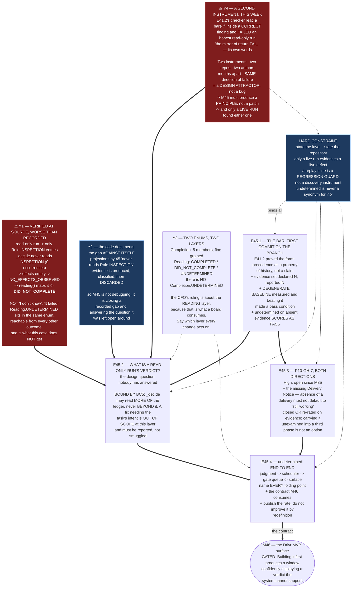

# Milestone M45 — Trustworthy Completion Signal

## Purpose

**The window must know, without a human, whether work is finished and whether it is stuck.** That is
SN-36's *"the chat must be where the attention should be"* and *"a blocker opens a chat by itself"* —
**one requirement stated twice** — and it is why **M45 gates M46 by construction rather than by
preference.** Building the surface first produces a window confidently displaying a verdict the
system cannot support.

Today it cannot support one. **The judgment returns a confident wrong answer on an entire class of
honest work**, and it does so through a path that is documented in the code against itself.

This milestone ensures:

- **A read-only run stops being reported as a failure.** It is the class the signal is worst at and
  the class `epic_qa` consists entirely of.
- **`P10-GH-7` is closed or re-rated on evidence**, including the missing-Delivery-Notice branch.
- **`undetermined` is first-class end to end** — produced by the judgment, carried by the contract,
  and never folded into a neighbouring state.
- **The bar is committed before the work**, in the history, not asserted afterwards.

---

## Problem Statement

**M39 built the judgment honestly and recorded that it could not reach a verdict.** On the sole
roster engine a live run projects `effect_ledger=None`; `EFFECTS_VERIFIED` is unreachable;
`undetermined` on four of six cases; **and on strict scoring it loses to a degenerate baseline that
always answers "completed."**

**M40's F5 sharpened it into the constraint that shapes this milestone:** the ordered-ledger
projection fixes only **half** the problem, because **better classification and more evidence each
yield a *worse* verdict.** A signal with that property cannot be improved by feeding it more.

---

## ⚠ Findings measured at planning time — five, all verified at source

**Measured by the Phase Chat against `~/soft-dev/drivr` at `f60164c` and `origin/milestone/M41`,
2026-08-22.** Verification boundary stated with each per `P11-GH-2`. **These are Drivr-side reads;
this repository's suite does not cover them.**

### Y1 — F5's consequence is WORSE than recorded: a read-only run is told it FAILED, not that the result is unknown

**The phase spec records that a read-only run returns `NO_EFFECTS_OBSERVED`. Traced one step further,
that is not what the caller sees.**

`drivr/judgment/completion.py:176-181`:

```python
def reading(self) -> Reading:
    if self.completion is Completion.EFFECTS_VERIFIED:
        return Reading.COMPLETED
    if self.completion is Completion.NO_EFFECTS_OBSERVED:
        return Reading.DID_NOT_COMPLETE
    return Reading.UNDETERMINED
```

**So the chain on an honest read-only run is:**

| Step | |
|---|---|
| The run reads files and writes nothing | ledger entries carry **`Role.INSPECTION`** |
| `_decide` filters for `is_effect`, `is_verification`, `UNCLASSIFIED` | **`Role.INSPECTION` is not among them** — `completion.py` contains **zero** occurrences of `INSPECTION` |
| `effects` is empty | → **`NO_EFFECTS_OBSERVED`** |
| `reading()` maps that one member explicitly | → **`DID_NOT_COMPLETE`** |

> **The read-only run does not get "I don't know." It gets "it did not complete" — a positive,
> confident, wrong verdict.** And **`Reading.UNDETERMINED` is sitting in the same enum, reachable
> from every other outcome, and is exactly what this case does not get.**

**This is the phase's organizing finding in the completion signal itself:** *when the evidence that
should gate an answer is absent, the system answers anyway.*

*Verified by reading `completion.py:176-181`, its `Completion`/`Reading` enums, and `_decide` at `:326-516`, Drivr `f60164c`, 2026-08-22.*

### Y2 — The gap is DOCUMENTED IN THE CODE AGAINST ITSELF, which changes what this milestone is

`drivr/judgment/projections.py:45`, in its own module docstring:

> *"…and `UNCLASSIFIED` and **never reads** `Role.INSPECTION`."*

**`Role.INSPECTION` is populated** — `projections.py:174-175, 192` for the native tool set and
`:312` for OpenCode's (`read`, `glob`, `grep`). **The evidence is produced, classified correctly, and
then discarded by the decider.**

**So M45 is not a debugging exercise.** The defect was known, written down, and left open. **The work
is to close a recorded gap and decide the question the gap was left open around** — *what is the
correct verdict for a run that legitimately produced no effects?* **That question has never been
answered, and answering it is this milestone's substance.**

### Y3 — Two enums, two layers, and `undetermined` exists at only one of them

| Enum | Members | Layer |
|---|---|---|
| **`Completion`** | `NO_EFFECTS_OBSERVED`, `EFFECTS_UNVERIFIED`, `EFFECTS_VERIFIED`, `EFFECTS_CONTRADICTED`, `INDETERMINATE` | fine-grained finding |
| **`Reading`** | `COMPLETED`, `DID_NOT_COMPLETE`, `UNDETERMINED` | coarse verdict, for reporting |

**There is no `Completion.UNDETERMINED`.** The CFO's ruling — *`undetermined` is a first-class board
state* — **is about the `Reading` layer, because that is what a board consumes.**

**This matters for where a fix may and may not go.** A change that makes the fine layer emit a new
"unknown" member is a different change from one that routes an existing case to
`Reading.UNDETERMINED`. **M45 must say which layer each of its changes acts on**, or it will produce
two notions of unknown and the ruling will be satisfied in the wrong place.

### Y4 — A SECOND, INDEPENDENTLY-BUILT INSTRUMENT REPRODUCED THE SAME FAILURE THIS WEEK

**E41.2's successful-nothing instrument failed an honest read-only run** — its own recorded second
self-correction: the checker read a bare `/` inside a run's *entirely correct* finding that
`healthcheck.path` does not start with a slash, treated it as a cited repository path, and **FAILED
the run.** The Epic Chat called it *"the mirror of `return FAIL`, and M40's F5 one level down."*

> **Two instruments, two repositories, two authors, built months apart for different purposes — and
> both mis-handle read-only work in the same direction.** Drivr's discards inspection evidence;
> E41.2's manufactured a false citation from punctuation. **Both convert "did honest work that
> produced no effects" into "failed."**

**That is a design attractor, not a coincidence, and it is the argument that M45 must produce a
stated principle rather than a patch.** A fix to `_decide` alone leaves the next instrument free to
rediscover it — as E41.2's did, inside this phase, while F5 was already on the record.

**And note which one found it: only a live run.** E41.2's five-case replay would never have.

### Y5 — A near-miss of the Phase Chat's own, recorded because it constrains how M45's epics must read

**I nearly filed "`Completion.UNDETERMINED` is declared but unreachable."** `grep 'Completion.UNDETERMINED'`
returns **zero** — **correctly, and meaninglessly, because that member does not exist.** The
`UNDETERMINED` I had seen belongs to `Reading`.

**A zero from a grep over a name that was never defined looks identical to a zero from a name that is
defined and unused.** **M45's epics reason about state names constantly. Read the enum definitions
before reasoning about any member**, and do not infer a member's existence from a nearby line number.

---

## Binding Constraints (settled — NOT for re-debate)

1. **M45 gates M46**, by construction. SN-36's two central behaviours *are* this signal.
2. **`undetermined` is first-class** (SN-36/37, CFO-decided) — **never folded into `in progress`**
   (the fail-open pattern drawn on a card) and **never into `blocked`** (which over-claims).
3. **The bar is relative and stated BEFORE the work.** E35.5's result was usable *because* it carried
   `PASS 4/5, 0 false alarms` in advance. **E41.2 proved the stronger form: D3 landed as the first
   commit on its branch, making the bar's precedence a property of the history rather than a claim.
   M45 adopts that form.**
4. **No model-generated judgment may be load-bearing** (E39.1). The completion signal is machinery,
   not a model's opinion, and nothing here may make a model's verdict authoritative.
5. **`_decide`'s independence guarantee is not to be weakened.** Its signature takes the ordered
   ledger and the snapshot delta **and nothing else** — no exit code, no status, no prose — and
   `tests/test_judgment_independence.py` asserts the parameter list. **Widening what it reads within
   the ledger is in scope; widening what it reads BEYOND the ledger is not**, and any proposal to
   admit exit codes is refused in advance. **Exit codes are measured-unreliable in both directions on
   this stack.**

---

## Hard Constraint (binding — carries to every Epic)

**This milestone builds the thing that decides whether other things worked. It must not be trusted on
its own report.**

- **State the layer.** `Completion` or `Reading` — every change names which, per Y3.
- **State the repository.** M45 is Drivr-side. **"Suite green here" does not cover it**, and a
  deliverable that does not say where it lands cannot be verified.
- **Only a live run counts as evidence of a live defect.** Y4's two instances were both found by live
  runs and neither by a replay. **A replay suite is a regression guard, not a discovery instrument**,
  and M45 must not report replay-only evidence as though it discovered anything.
- **Prove every guard by falsifying it** — remove the change, watch the test fail.
- **Pin the ref, and record it.** A number without a ref is not a measurement.
- **`undetermined` is the answer when the evidence is absent. It is never a synonym for "no".**

---

## Planned Epics

Four epics. **E45.1 runs first and its bar must land as its branch's first commit** — the form E41.2
proved. E45.2 and E45.3 are independent of each other; **E45.4 closes and depends on all three.**

- **E45.1** — The bar, the evidence set, and the degenerate baseline *(first; bar lands first commit)*
- **E45.2** — The judgment sees inspection: what a read-only run's verdict is *(F5)*
- **E45.3** — `P10-GH-7`, both directions, including the missing Delivery Notice
- **E45.4** — `undetermined` first-class end to end, and the contract M46 consumes *(last)*

**Execution posture: `manual` / paid frontier for every epic.** This milestone builds the instrument
that judges whether agentic work completed. **Dispatching it agentically would have the judgment
under repair reporting on its own repair** — the same circularity M42 refuses for the execution tier
and M41 for the model line-up. Record `Execution Mode: manual` and `models.epic_manual` in every Epic
Execution Chat Starter.

---

## Epic Detail

### E45.1 — The bar, the evidence set, and the degenerate baseline *(first)*

**Organizing question: what would make this signal trustworthy, stated before anyone changes it?**

**Deliverables**

1. **The bar, committed as the FIRST commit on the branch.** Not asserted in a delivery notice —
   **placed in the history**, so its precedence is checkable rather than claimed. E41.2's D3 is the
   worked precedent and it is the reason its result is citable.
2. **The evidence set, declared before it is run** — every case, named, with its ground truth and its
   expected verdict. **Declared N, reported N.** An unloadable case fails **loudly**; a shorter list
   is a defect, not a result (E41.2's S3).
3. **The degenerate baseline measured, and beating it made an explicit criterion.** M39 recorded that
   the judgment **loses to a baseline that always answers "completed."** **A signal that cannot beat
   "always yes" has no information in it**, and this must be a pass condition rather than a footnote.
4. **A read-only case in the set, with its ground truth stated.** Y1's class must be represented
   before the fix, or the fix cannot be shown to have worked.
5. **The bar's relation to `undetermined` stated explicitly:** `undetermined` on a case whose evidence
   is genuinely absent is a **pass**, not a miss. **A scoring rule that penalises honest uncertainty
   will train the signal to guess**, which is the defect.

**Acceptance criteria**

- [ ] The bar is the first commit on the branch — shown by `git log`, not asserted
- [ ] The evidence set is declared before execution; declared count equals reported count
- [ ] The degenerate baseline is measured and beating it is a stated pass condition
- [ ] A read-only case is in the set with ground truth
- [ ] `undetermined` on absent evidence scores as correct, and the rule says so

---

### E45.2 — The judgment sees inspection: what a read-only run's verdict is *(F5)*

**Organizing question: what is the correct verdict for a run that legitimately produced no effects?**
**Nobody has answered this, and the gap was left open around it** (Y2).

**Deliverables**

1. **The decision, with reasoning recorded.** Candidates the epic must weigh explicitly, and this is
   the milestone's own design question:
   - Inspection evidence makes the run **`UNDETERMINED`** — honest, and says *we cannot tell from
     effects whether the task is done*.
   - Inspection evidence supports a **positive** finding for tasks whose deliverable **is** a reading
     — which requires knowing the task's expected shape, and `_decide` deliberately cannot see the
     task.
   - **A new `Completion` member** for *effects absent and inspection present*, projected to
     `Reading.UNDETERMINED`.

   **The constraint that decides it is Binding Constraint 5:** `_decide` may read **more of the
   ledger**; it may not read **beyond** the ledger. **A solution requiring the task's intent is out of
   scope at this layer** and must be reported as such rather than smuggled in.
2. **`_decide` reads `Role.INSPECTION`**, and `projections.py:45`'s docstring — which currently states
   the gap as a property — is updated to state the behaviour.
3. **The read-only case from E45.1's set produces the decided verdict**, with a falsification
   demonstration.
4. **`NO_EFFECTS_OBSERVED → DID_NOT_COMPLETE` re-examined.** That mapping is what converts an absence
   into a confident negative. **If the fix leaves it intact, say why**; if it changes, say what now
   reaches `DID_NOT_COMPLETE` and on what evidence.
5. **The independence guarantee intact** — `tests/test_judgment_independence.py` still asserts
   `_decide`'s parameter list, unweakened.

**Acceptance criteria**

- [ ] A read-only run no longer returns `DID_NOT_COMPLETE`
- [ ] The decision and its rejected alternatives are recorded, naming the layer each would act on
- [ ] `_decide` reads inspection evidence; the docstring describes behaviour rather than a gap
- [ ] The guard fails when the change is reverted
- [ ] `_decide` reads nothing beyond the ledger; the independence test is unchanged or stricter

---

### E45.3 — `P10-GH-7`, both directions, including the missing Delivery Notice

**Organizing question: is block detection trustworthy, and if not, is it re-rated on evidence rather
than on age?** Open since M35, severity **High**.

**Deliverables**

1. **Both directions measured** — a blocked run reported as running, and a running run reported as
   blocked. **`P10-GH-7`'s claim is that it is untrustworthy in both**; the record must show both or
   say which it could not produce.
2. **The missing-Delivery-Notice branch** (SN-31 Carry-Over 3) — *what happens when a child's delivery
   never arrives.* The CFO arrived at this independently and left it unresolved. **Absence of a
   delivery is exactly the evidence-absent case this phase is about**, and it must not default to
   "still working."
3. **Closed or re-rated, with the evidence either way.** **Re-rating on measurement is a legitimate
   outcome; carrying it forward unexamined for a third phase is not.**
4. **The interaction with E45.2 stated.** A blocked run and a read-only run can look identical from
   effects alone. **If the two fixes could disagree about the same run, say so and say which governs.**

**Acceptance criteria**

- [ ] Both directions measured, or the unmeasurable one named with its reason
- [ ] The missing-delivery case has a defined, recorded behaviour that is not "assume running"
- [ ] `P10-GH-7` is closed or re-rated with cited evidence
- [ ] Any overlap with E45.2's verdicts is identified and adjudicated

---

### E45.4 — `undetermined` first-class end to end, and the contract M46 consumes *(last)*

**Organizing question: does `undetermined` survive the whole path, from the judgment to the thing
that renders it?**

**Deliverables**

1. **The end-to-end path traced and recorded** — judgment → scheduler → gate queue → surface — with
   **every point that could fold `undetermined` into a neighbour named.** Y3's two layers make this a
   real risk rather than a formality.
2. **`undetermined` never folded**, per the CFO's ruling — not into `in progress`, not into
   `blocked`, and not silently into `DID_NOT_COMPLETE` by a mapping.
3. **The contract M46 consumes**, stated so M46 builds against a fixed surface rather than inferring
   one. **This is what M45 hands over, and it is why M45 gates M46.**
4. **A test that fails if any consumer collapses the three-state reading into two.**
5. **The honest count reported.** M39 returned `undetermined` on four of six. **Whatever the number is
   after this milestone, it is published rather than improved by redefinition** — *rendered visibly,
   the board shows the size of the problem every day, which is the pressure that keeps P12 honest.*

**Acceptance criteria**

- [ ] The full path is traced and every folding point is named
- [ ] No consumer maps `undetermined` onto another state
- [ ] The M46 contract is written down and is stable
- [ ] The guard fails when a fold is reintroduced
- [ ] The post-fix `undetermined` rate is reported, not suppressed

---

## Prerequisites and Dependencies

**Internal**

- `milestone/M45` branched from `phase/P12`. Suite **549 baseline in this repository**; E41.2 added 21
  on `milestone/M41`, which is a different branch and **not** this milestone's baseline.
- **Nothing gates M45.** M43 and M44 are independent of it, and **M44 does not gate M45** — confirmed
  by HQ 2026-08-22 after a passing statement to the contrary.
- **M45 gates M46**, which is not planned and must not be planned ahead of this milestone's contract.

**External**

- **Drivr at `~/soft-dev/drivr`, `f60164c`** — where every change in E45.2, E45.3 and E45.4 lands.
  **Outside this repository and outside its suite.** Each epic states its own verification.
- **A reachable engine** for live runs. **Y4's lesson is binding: only a live run is evidence of a
  live defect**, so an epic that cannot dispatch cannot discharge its discovery obligation and must
  escalate rather than substitute a replay.

---

## Definition of Done (Milestone)

- [ ] All four epics delivered, accepted, and merged to `milestone/M45`
- [ ] **A read-only run is no longer reported as `DID_NOT_COMPLETE`**
- [ ] The correct verdict for an effects-absent run is **decided and recorded**, with the layer named
- [ ] `_decide` reads inspection evidence and **still reads nothing beyond the ledger**
- [ ] **`P10-GH-7` is closed or re-rated on measured evidence**, both directions addressed, the
      missing-delivery case defined
- [ ] **`undetermined` survives end to end** and no consumer folds it
- [ ] **The bar was the first commit on E45.1's branch**, and the judgment beats the degenerate baseline
- [ ] The `undetermined` rate after the work is **published**
- [ ] Every change names its layer and its repository; Drivr-side verification stated separately
- [ ] Milestone Closure Declaration committed, `is_final: false`

---

## Acceptance Criteria (Milestone)

- [ ] **The signal can say "I don't know" and does so when the evidence is absent** — and a reader can
      tell that from a run record, not from this spec
- [ ] **It beats "always answer completed."** A signal that does not carries no information
- [ ] **M46 has a written contract** and does not have to infer the signal's shape
- [ ] **No fix trusted a replay where a live run was required** (Y4)
- [ ] Every claim states layer, repository, ref and date

---

## Timeline

**Target Start:** 2026-08-22 · **Target Completion:** before M46 can begin — it is M46's gate
**Actual Start:** Not started · **Actual Completion:** In progress

---

## Visual Bindings

**Visual binding**
- **Link:** (inline — Structural diagram; no hosted link needed per AOG §16.3/§16.5)
- **What:** diagram
- **Level:** Milestone
- **State:** proposed



- **Description:** M45's four epics against a defect verified at source. **A read-only run is not told
  "unknown" — it is told it failed**, because `_decide` never reads `Role.INSPECTION` and
  `NO_EFFECTS_OBSERVED` maps explicitly to `DID_NOT_COMPLETE` (Y1). **The code documents that gap
  against itself** (Y2), so the work is closing a known hole and answering the question it was left
  open around. **A second instrument reproduced the same failure this week** in another repository
  (Y4), which makes it a design attractor and obliges a stated principle rather than a patch — and
  **only live runs found either instance.** E45.1 lands the bar as its first commit, the form E41.2
  proved; E45.4 hands M46 a written contract, which is why M45 gates it. Proposed-track Structural
  diagram (AOG §16.3/§16.6), Mermaid, no ComfyUI.

---

## Notes

- **The signal's failure and the phase's thesis are the same sentence.** *When the evidence that
  should gate an answer is absent, the system answers anyway.* **M45 is that finding applied to the
  one component whose entire job is to know whether it has enough evidence.**

- **Beating the degenerate baseline is the criterion that cannot be finessed.** M39 recorded that the
  judgment loses to *"always completed."* **A signal that loses to a constant carries no
  information**, however well-reasoned its internals. E45.1 makes it a pass condition for that reason.

- **On `P11-GH-1`.** Amendments reach a running child by amending this file on `milestone/M45` with a
  changelog row; **notifying the running chat in-session, naming the section**; requiring it to
  re-read and state that it did; escalating if blocking; and **before accepting any delivery, `git
  log` this spec against the epic's branch point AND every artifact its Starter restates a rule
  from** — the widened form, after the backstop was falsified in M41 by a ruling that had *arrived*
  and was not applied.

- **Authoring order:** write each Starter after its spec is committed, and **cite the spec by path and
  branch, never by version and sha** — a stamp goes stale the first time the spec is amended, which
  it will be.

## Changelog

| Version | Date | Change |
|---|---|---|
| 1.0.0 | 2026-08-22 | Initial M45 spec, from the P12 phase spec §P12.5, M39's judgment, M40's F5, `P10-GH-7`, and SN-36/37's first-class `undetermined`. **Five planning-time findings verified at source against Drivr `f60164c`.** **Y1: F5's consequence is worse than recorded** — a read-only run is not returned as unknown but as **`DID_NOT_COMPLETE`**, because `_decide` contains zero occurrences of `INSPECTION` and `reading()` maps `NO_EFFECTS_OBSERVED` explicitly onto a confident negative, while `Reading.UNDETERMINED` sits reachable in the same enum. **Y2: the gap is documented in the code against itself** (`projections.py:45`), making this the closing of a known hole rather than a debugging exercise. **Y3: two enums, two layers, and no `Completion.UNDETERMINED`** — the CFO's ruling is about the `Reading` layer, so every change must name its layer. **Y4: a second, independently-built instrument reproduced the same failure this week** — E41.2's checker failed an honest read-only run — making it a **design attractor** that obliges a principle rather than a patch, **and only live runs found either instance.** **Y5: a Phase Chat near-miss** — a grep for a member that does not exist returns zero identically to one that exists and is unused. Four epics; **E45.1's bar lands as its branch's first commit**, the form E41.2 proved. |
