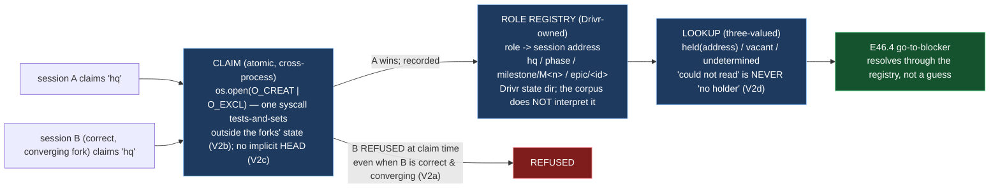

# Delivery Notice: P12-M46-E46.1 — The Role Registry and Exclusivity

> **The work landed in Drivr, not here.** The E46.1 spec, the M46 milestone spec, and the M46
> completion-signal contract are cited by path and branch, never by version or sha. `merge_details`
> describe a merge that has not happened and are unfillable at delivery time (`P10-GH-4`, restated).
> Merge authorization follows the M46 Milestone Chat's Stage-2 review, and the parent performs the
> merge (§11.6).

---

## Summary

**A governance role now maps to exactly one session address, and a second claimant is refused at
claim time — not at merge, and not by a reader — by a Drivr-owned registry whose exclusivity lives
outside the state the forks write.**

`drivr.registry.RoleRegistry` maps each role (`hq` / `phase` / `milestone/M<n>` / `epic/<id>`,
itemized) to the session address that holds it. A claim is `os.open(path, O_CREAT | O_EXCL |
O_WRONLY)` — one syscall that both tests and sets, so a second claimant (including an agreeing fork
that is correct and converging) is refused the moment it claims. The lookup is three-valued
(`held(address)` / `vacant` / `undetermined`), so "could not read the registry" can never be read as
"no holder". The guard is falsified in both directions, and the agreeing-fork case is demonstrated.

---

## Verification layer, time, scope and ref (`P11-GH-2`)

| Axis | Value |
|---|---|
| **Layer** | One layer is built: the **role registry** — a Drivr-owned mapping from governance role to session address, with a claim/release/lookup interface and a three-valued lookup. The **claim** layer is the atomic `O_EXCL` operation (the `SpendLog` precedent); the **lookup** layer is the three-valued read (the V2d pattern). No judgment, scheduler, queue, or surface layer is touched. Every claim below names which. |
| **Time** | **2026-09-04** |
| **Scope (Drivr — where the work lands)** | **`~/soft-dev/drivr`**, branch **`epic/P12-M46-E46.1`**, branched from **`main` @ `4872107`** (G2 — the spec pinned `4872107`; re-measured at the branch point and Drivr had **not** moved). Added: `drivr/registry/registry.py`, `drivr/registry/__init__.py`, `tests/test_role_registry.py`. **Not changed:** `drivr/judgment/`, `drivr/scheduling/outcome.py` (E45.4's), `docs/m46-completion-signal-contract.md`, the `epic_qa` lane, any existing module. |
| **Scope (governance repo)** | **`ai-project-system`**, branch **`epic/P12-M46-E46.1`**, branched from **`milestone/M46` @ `4da442c`**. Adds this Delivery Notice only. The E46.1 spec (`70461dc`) and the M46 milestone spec (v1.1.0, `e824a70`) already carry the epic; nothing in them needed amendment. |
| **Repo for `git log`** | Drivr HEAD at delivery: **`ccc38fc`** (`feat(E46.1): the role registry and exclusivity …`), on `epic/P12-M46-E46.1`, on top of `4872107` (`main`). |
| **Suite (Drivr, operative)** | `python3 -m pytest -q` from the Drivr root. **Baseline at branch point: 471 passed / 0 failed** (G2 re-measure at `4872107`). **After: 492 passed / 0 failed** (471 + 21 new). **No skips introduced.** The `ai-project-system` suite does not cover Drivr and is not a measurement of anything this epic produced. |

**P11-GH-2 note — a deviation, stated not buried (and already on the record).** The starter assumes
"Drivr has its own `origin`" and instructs "verify the Drivr push at Drivr's origin." **This Drivr has
no configured remote** (`git remote -v` is empty), per the carry-forward note
`P12__carry-forward-note__drivr-no-remote-recoverability.md`. The Drivr commit (`ccc38fc`) exists
locally on `epic/P12-M46-E46.1` (verified), but there is no origin and **no push could be made or
verified**, and **no GitHub PR for the Drivr change can be opened**. The committed content is the
source of truth; the parent's merge of `epic/P12-M46-E46.1` → `main` is what completes BC9, and I say
so rather than pretending a push happened.

---

## Model verification (`advisory` — stated plainly, per chat-hierarchy.md)

This instance is **manual**; `model_verification: advisory` (`.ai-project.yml`, ai-project-system).
The harness reports my model as **`deepseek-v4-pro`** (exact model ID `opencode-go/deepseek-v4-pro`;
re-measured via the running opencode server's `/api/session`, quoted verbatim: `"model":{"id":
"deepseek-v4-pro","providerID":"opencode-go","variant":"default"}`). The configured `epic_manual`
value is **`remote:deepseek-v4-flash`**. **Mismatch — `pro` vs `flash`.** Advisory, so I state the
mismatch plainly and proceed.

---

## Re-measured at build time, not trusted from the spec (Hard Constraint 4, G2)

**`ListAgents` self-address report — re-measured 2026-09-04, and the harness has moved again in form
but not in capability.** The V1 finding (2026-08-27) recorded `ListAgents` reporting *"This session is
`ai-project-system-<hex>` — the name other sessions use to message it."* Re-measured now against the
current harness (opencode 1.18.10, desktop client), that exact token form is **not** what the harness
reports; it reports the session id. `opencode session list` shows my session as
**`ses_f9282df58ffeUG6tMVFWL6mx47`** (title "Phase P12 Milestone M46 Epic E46.1"), and the running
server's `/api/session` confirms the same id with my model. **What survives and is the thing this epic
rests on: a session can state its own address.** What changed is only the token's *form*
(`ses_<id>` now, `ai-project-system-<hex>` then), not the capability. The registry is agnostic to the
form: it maps a role to whatever address string the claimant states, so the design does not depend on
the token's shape. The claim the epic rests on is *"names carry no role — a session states who it is,
nothing states its role"*, and that claim is re-measured **true**, not asserted from the spec.

**The two precedents, quoted verbatim (G1), re-measured at `4872107` (unchanged):**
- `drivr/surface/store.py:94` — `os.open(marker, os.O_CREAT | os.O_EXCL | os.O_WRONLY, 0o600)` (the `SpendLog` one-syscall test-and-set).
- `drivr/scheduling/lane.py:112` — `fcntl.flock(fd, fcntl.LOCK_EX | fcntl.LOCK_NB)` (the `SerializedLane` cross-process exclusion).

---

## Deliverables

### D1 — The role registry ✅

`drivr/registry/registry.py` (re-exported by `drivr/registry/__init__.py`). A Drivr-owned mapping from
role to session address, written as a directory of per-role claim files — the `SpendLog` argument
(atomicity is per-role; one shared JSON would reintroduce the read-modify-write race) with the
`fleet-registry` / `mode-transitions` argument (Drivr reads and writes its own state; the governance
repository does **not** interpret it). The role vocabulary is **itemized, not counted** (Hard
Constraint 1): `hq`; `phase`; `milestone/M<n>` (a `milestone/` prefix with a non-empty remainder);
`epic/<id>` (an `epic/` prefix with a non-empty remainder). Anything else is refused at the boundary
(`InvalidRole`).

- `claim(role, address)` → `Claim`, or raises `RoleHeld` at claim time.
- `release(role, address)` → `Release`; only the recorded holder may release.
- `lookup(role)` → three-valued `LookupResult`: `held(address)` / `vacant` / `undetermined`.
- `is_valid_role(role)` → the itemized vocabulary check.

### D2 — The exclusivity mechanism, falsified in both directions ✅

**Atomic and cross-process, outside the state the forks write.** The claim is
`os.open(path, O_CREAT | O_EXCL | O_WRONLY, 0o600)` — **one syscall that both tests and sets**, so
there is no check-then-act gap (a lost race here would be a second holder of a role, not a duplicated
link). It is inherently cross-process (the kernel's filesystem namespace is shared), demonstrated by a
`multiprocessing` test (`test_a_second_process_is_refused_at_claim_time`) — a child process holds
`hq`, the parent is refused. It lives in Drivr's own state directory, **not** in the corpus the
sessions commit, so no tie-break derived from shared state is needed or possible (BC4/V2b), and no
claim is resolved through any git ref (no implicit `HEAD`, V2c).

**Why `O_EXCL` over `flock`** (delegated decision 1, documented): a role claim is *durable* — a
session holds `hq` across many processes, so a `flock` held by a live descriptor would vacate the role
on every process exit, which is wrong. A file's existence is the durable primitive; the "wedge on
crash" concern `flock` solves for the lane is answered by explicit release plus the fail-closed stale
claim (below), not by a kernel-released lock.

**Falsified in both directions** (Hard Constraint 2 — recorded here because a guard that has never
failed has not been shown to work):

```
MECHANISM REMOVED: os.O_CREAT | os.O_EXCL | os.O_WRONLY  ->  os.O_CREAT | os.O_WRONLY
WATCH THE GUARD FAIL (3 failed):
  test_a_second_claimant_is_refused_at_claim_time              FAILED  DID NOT RAISE RoleHeld
  test_a_second_claimant_does_not_displace_the_holder          FAILED  DID NOT RAISE RoleHeld
  test_a_correct_converging_second_claimant_is_still_refused   FAILED  DID NOT RAISE RoleHeld
RESTORED: os.O_CREAT | os.O_EXCL | os.O_WRONLY
  tests/test_role_registry.py: 21 passed
```

### D3 — The agreeing-fork case demonstrated ✅

`test_a_correct_converging_second_claimant_is_still_refused` — the second claimant is **not wrong, not
sloppy, not divergent**: it states its own address correctly, claims the same role with the same
discipline, and would produce converging output. It is still refused at claim time, because the role is
held. **Correctness is not safety** (V2a): the mechanism refuses the second claimant without asking
whether it would have done good work. The distinction is stated in the record, not merely tested.

### The three-valued lookup never collapses (V2d) ✅

`test_a_corrupt_claim_file_reads_undetermined_not_vacant` and
`test_an_unreadable_registry_reads_undetermined_not_vacant` assert that a registry that cannot be read
returns `undetermined`, **distinct from `vacant`** — a consumer can never read "could not read the
registry" as "no holder". `LookupResult.__post_init__` enforces that a `held` result carries an
address and a `vacant`/`undetermined` result carries none, so the three states cannot be collapsed by
construction.

### Structural diagram (Mermaid, inline, no ComfyUI) ✅

See Visual Bindings below.

---

## Design decisions (delegated — decided, documented, proceeded)

| # | Decision | Outcome |
|---|---|---|
| 1 | **The claim mechanism's concrete form** | **`O_EXCL` per-role claim file** (the `SpendLog` precedent), not `flock` (the `SerializedLane` precedent). A role claim is durable — it must outlive the claiming process — so a file's *existence* is the primitive, not a live descriptor. Cross-processness is the kernel's filesystem namespace, demonstrated by a child process. |
| 2 | **The registry's location and schema** | A directory of per-role claim files, in the caller-supplied root (Drivr's own state directory, e.g. `~/.local/state/drivr/registry/roles/`), **not** under `ai-project-system`'s committed tree. Filename = SHA-256 of the role (a role contains `/` and must not become a path); the content records `{role, address, claimed_at}` and every read verifies the stored role matches the queried role. The governance repository does not interpret it. |
| 3 | **Release and stale-claim semantics** | **Release** is by the recorded holder only: read, verify `address` matches, then `unlink`. The verify is why read-verify-unlink is not a check-then-act gap — no other party can pass the verify. **Stale claim** reads as `held` until explicitly released: the registry is a record, not a liveness oracle, and the fail-closed default is to report what is recorded rather than guess a stale claim into `vacant` (which would let a second session walk in over a role whose holder might still exist). `claimed_at` is recorded so a human or E46.4 can judge staleness. |
| 4 | **Refused vs flagged** | **Refused** — `claim` raises `RoleHeld` rather than returning a flag a caller can ignore. No `(ok, reason)` tuple to drop, no `None` to fall through on (`Rejected`/`SpendLog`'s pattern). |

---

## Definition of Done — every item

- [x] A role maps to exactly one session address, and a second claimant is refused **at claim time** (D1/D2)
- [x] The mechanism does not rest on any artifact both forks can write, nor on implicit `HEAD` (BC4/V2b/V2c — lives in Drivr's state dir, resolved by no git ref)
- [x] The agreeing-fork case is demonstrated, not just the contradicting one (D3)
- [x] No claim rests on *"sessions cannot identify themselves"*; `ListAgents` re-measured at build time (Hard Constraint 4 — see above)
- [x] The exclusivity guard fails when the mechanism is removed (falsified in both directions, D2)
- [x] The three-valued lookup returns `held`/`vacant`/`undetermined` distinctly, with `undetermined` never reading as `vacant`
- [x] Every claim states the layer, repository, ref and date (`P11-GH-2` + the milestone Hard Constraint)
- [x] Drivr suite green at **492** with the invocation (`python3 -m pytest -q`) and the ref (`4872107` branch point; `ccc38fc` delivery) stated — baseline 471 at the branch point (G2)
- [x] Delivery Notice committed; branch `epic/P12-M46-E46.1` ready for the parent's merge to Drivr `main`
- [ ] **BC9 — on Drivr `main`** — **not yet met by me, and cannot be met by me**: §11.6 makes the parent (the M46 Milestone Chat) the party that merges `epic/P12-M46-E46.1` → `main`. The code is committed on the epic branch and is ready for that merge. I state this as an open item rather than mark it done on the branch, because the M43/M45 defect was exactly *finishing on the epic branch*.

## Acceptance Criteria

- [x] A role maps to exactly one session address, and a second claimant is refused **at claim time**
- [x] The mechanism does not rest on any artifact both forks can write, nor on implicit `HEAD`
- [x] The agreeing-fork case is demonstrated, not just the contradicting one
- [x] No claim rests on *"sessions cannot identify themselves"*

---

## Visual Bindings

**Visual binding**
- **Link:** (inline — Structural diagram; no hosted link needed per AOG §17.3/§17.5)
- **What:** diagram
- **Level:** Epic
- **State:** proposed



- **Description:** E46.1 builds the role registry — a Drivr-owned role → session-address mapping with
  an atomic, cross-process claim (`os.open(O_CREAT | O_EXCL)`, the `SpendLog` precedent, enforced
  outside the state the forks write per V2b) and a three-valued lookup (`held` / `vacant` /
  `undetermined`) that E46.4's go-to-blocker consumes without guessing. Exclusivity is enforced at
  claim time, so a second claimant — including an agreeing fork that is correct and converging — is
  refused the moment it claims, not at merge and not by a reader. Proposed-track Structural diagram
  (AOG §17.3/§17.6), Mermaid, no ComfyUI.

---

## Status

⏸️ **Stopped. Awaiting Milestone Chat review and authorization. Not merged.** Per this epic's Starter
and §11.6, merge authorization for the Delivery Notice PR normally follows the Milestone Chat's
Stage-2 review, and the parent (the M46 Milestone Chat) performs the merge. This delivery is the
**first attempt** — the rework limit (3 attempts plus any written `+1`, PSG §11.6 / the SN-36/37 `+1`
amendment) has not been touched.

**Deviation, stated:** the Drivr working copy has **no configured remote**, so the Drivr commit
(`ccc38fc` on `epic/P12-M46-E46.1`) exists locally but **was not pushed or push-verified**, and no
GitHub PR for the Drivr change exists. The parent's merge of `epic/P12-M46-E46.1` → `main` is a
**local** merge, and it is what completes BC9. This matches the M45 carry-forward note, and I flag it
so the Milestone Chat can resolve whether the Drivr remote is expected to be configured before
acceptance. On the `ai-project-system` side, the Delivery Notice is committed to
`epic/P12-M46-E46.1` (branched from `milestone/M46` @ `4da442c`) and a PR to `milestone/M46` is the
appropriate next step, which I will open.

Epic E46.1 execution complete. Epic Delivery Notice produced. Awaiting Milestone Chat review and
authorization.
