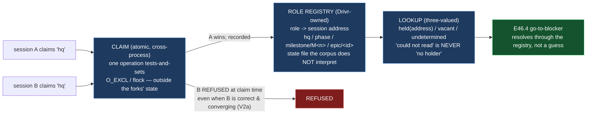

# Epic E46.1 — The Role Registry and Exclusivity

## Context

**How does Drivr know which session holds a role, and that exactly one does?**

E46.1 is the milestone's prerequisite epic. The M46 surface's two behaviours that *move a
human to where attention belongs* — the auto-open and the go-to-blocker affordance (both
E46.4's) — both resolve *"which session holds the blocker's parent role?"* against a registry
that does not exist yet. **Building the registry first is not a convenience; it is the
ordering E46.4's own acceptance criterion depends on.**

Two findings from the milestone spec, carried here as inputs rather than re-derived:

- **V1 — names carry no role, and the impossibility argument is dead.** On 2026-08-27 the
  harness moved: `ListAgents` now reports the calling session its own address (*"This session
  is `ai-project-system-<hex>` — the name other sessions use to message it"*). A session can
  state who it is. **What survives is the real requirement: a name carries no role.** A fleet
  cannot determine *who is HQ* or *who holds M41* from the roster alone. M46 builds against
  "names carry no role", **never** against "sessions cannot identify themselves" — the second
  is false, and a deliverable resting on it would be false with it.

- **V2 — a fork that agrees is invisible, and the record cannot settle it afterwards.** Three
  live forks are on record. The HQ fork contradicted and was caught by a reader. The M41 fork
  **agreed** — same voice, same discipline, correct amendments, and it caught a defect the
  incumbent missed — **there was no signal at all.** Two consequences narrow the remedy space:
  **(a) correctness is not safety** (a fork need not be wrong to be a problem); **(b) a
  tie-break computed from the shared state is self-legitimizing** (whoever writes last becomes
  the holder, so a mistaken write retroactively legitimizes itself). **Exclusivity must be
  enforced by something outside the state the forks write** — which is Drivr's side of the
  boundary, not the corpus's. And the corpus cannot settle it retrospectively:
  `git log --all --format='%an <%ae>' | sort -u` returns **exactly one author**, because the
  harness signs every commit as the human.

**Why Drivr owns it.** Drivr opens the chats (P12.6 input). The registry answers *which*
session holds a role — and, from the 2026-08-20 two-HQ-sessions fork, *how many do*. That
second half is the sharper one: two authentic HQ sessions ran concurrently, both able to
commit, and the outcome was contradictory normative artifacts caught only by a reader. The CFO's
own framing is the property to build: *"it will not allow concurrent chats touching the files
all over."* A scheduler that owns which session holds a role, and serializes writes, makes the
fork class unreachable rather than detectable.

**Existing Drivr precedents this epic builds beside, not against:**

- `drivr.scheduling.enrollment` reads `fleet-registry.yml` — the standing rule that **Drivr
  reads state and does not act on state**; a registry is a record, not a decision.
- `drivr.modes.record` writes an **append-only, fsynced, Drivr-written** state file
  (`.ai-project/modes/mode-transitions.json`) that the governance repository does **not**
  interpret — the shape of a Drivr-owned state file.
- `drivr.surface.store.SpendLog` uses `os.open(O_CREAT | O_EXCL)` — **one syscall that tests
  and sets**, so a claim cannot lose a race to a check-then-act gap.
- `drivr.scheduling.lane.SerializedLane` uses `fcntl.flock` held by file descriptor — a
  cross-process exclusion the kernel releases on process death, so a crashed holder cannot
  wedge it.

## Problem Statement

**A name carries no role, and nothing in the fleet maps a session to the role it holds — so
nothing can enforce that a role has exactly one holder, at the only moment it matters: when the
second holder appears.**

Three failure shapes, all live or adjacent today:

1. **A second claimant is not detected.** With no registry, a second HQ session (or a second
   M41 Milestone Chat) simply opens, writes, and is discovered — if at all — by a reader
   reading two artifacts that disagree, or by a habit of reading the log before editing.
   Detection by reader is not a mechanism.
2. **Detection at merge is too late.** A fork that contradicts is detectable at merge; a fork
   that **agrees** is invisible and silently doubles the write surface. By the time two
   agreeing forks have written different-but-both-plausible content into one artifact, there is
   no conflict, no signal, and nothing in the record saying which is authoritative.
3. **A tie-break computed from the shared state legitimizes the write it governs.** Any rule of
   the form *"the session whose commit most recently touched X holds the role"* makes the role
   acquirable by the act it governs. Exclusivity cannot be derived from artifacts both forks
   mutate — it must live outside them, at claim time.

## Goals

By the end of this Epic, the system must:

1. **Hold a registry** mapping a governance role (`hq`, `phase`, `milestone/M<n>`,
   `epic/<id>`) to the session address that holds it, owned by **Drivr**.
2. **Enforce exclusivity at claim time** — a second session claiming a held role is refused or
   flagged the moment it claims, not at merge, and not by a reader.
3. **Work against the agreeing fork** — the mechanism refuses the second claimant even when
   that claimant is correct, well-behaved, and would produce converging output.
4. **Expose a lookup** that E46.4's go-to-blocker can consume — *"which address holds role X?"*
   — with a three-valued answer that never lets "no holder" be mistaken for "the lookup
   failed."
5. **Rest on no claim about the environment that is not re-measured at build time** — V1 says
   sessions *can* now state their address; the epic re-measures `ListAgents` at the moment it
   builds against it (Hard Constraint 4).

## Non-Goals

This Epic explicitly does **not** aim to:

- **Build the board** (E46.2) or **render `undetermined`** (E46.2's contract is E45.4's, an
  input here).
- **Build the auto-open or go-to-blocker affordance.** Those are E46.4's; this epic delivers
  the registry and its lookup interface that E46.4 consumes, and nothing that *acts* on a
  blocker.
- **Make three governance rules unrepresentable** (E46.3). Exclusivity is a *different* class of
  guarantee from unrepresentability, and this epic does not blur them.
- **Change the completion-signal contract** (`docs/m46-completion-signal-contract.md`). It is an
  input, not a subject (V3/BC1); disagreement escalates.
- **Build dispatch controls, or any Phase/Milestone dispatch.** Out of scope by the phase's own
  binding (no Phase/Milestone dispatch exists).
- **Solve the inter-chat channel's wider design** (`P12-GH-4`, filed unowned). This epic's
  registry is a prerequisite the wider design would build on; it does not design the channel.

## Scope of Work

### 1. The role registry (D1)

**A Drivr-owned mapping from role to session address**, written as a Drivr state file the
governance repository does **not** interpret — following the `mode-transitions.json` precedent
(Drivr-written, append-only or otherwise immutably recorded, fsynced) and the `fleet-registry`
precedent (Drivr reads state, does not act on state).

**Must include:**
- The role vocabulary, exactly: `hq`, `phase`, `milestone/M<n>`, `epic/<id>` — **itemized, not
  described as "four roles"** (Hard Constraint 1).
- A claim/release/lookup interface with a stable shape E46.4 can build against, named and
  exported.
- A **three-valued lookup**: `held(address)` / `vacant` / `undetermined` — where `undetermined`
  is returned when the registry cannot be read, **distinct from `vacant`**, so a consumer can
  never read "could not read the registry" as "no holder" (the V2d pattern: *empty means
  UNDETERMINED and escalates*; the go-to-blocker must not guess).

### 2. The exclusivity mechanism (D2)

**A claim that a second session cannot win**, enforced at claim time and outside the state the
forks write.

**Must include:**
- **Atomicity** — one operation that both tests and sets, with no check-then-act gap (the
  `SpendLog` `O_EXCL` lesson; a lost race here is a second holder of a role, not a duplicated
  link).
- **Cross-process enforcement** — holds against a *second Drivr or session process*, not merely
  a second thread (the `SerializedLane` `flock` lesson).
- **Outside the fork-written state** — the registry is not a corpus artifact the sessions
  commit, so no tie-break derived from shared state is needed or possible (BC4/V2b). **No form
  resting on implicit `HEAD`** (V2c) — no claim resolved through git refs.
- **A guard falsified in both directions** — a test that fails when exclusivity is removed
  (the second claimant succeeds) and passes when it is present (the second claimant is refused)
  (Hard Constraint 2).

### 3. The agreeing-fork case demonstrated (D3)

**A demonstration that the mechanism refuses the *correct* second claimant**, not only the
contradicting one.

**Must include:**
- A test or recorded run where the second claimant is **well-behaved, correct, and produces
  converging output** — and is still refused at claim time because the role is held (V2a).
- The record states the distinction: **correctness is not safety** — being right is not
  evidence it was safe.

## Deliverables

- [ ] **D1** — The role registry: role → session address, Drivr-owned, with a claim/release/lookup
      interface and a three-valued lookup (`held` / `vacant` / `undetermined`)
- [ ] **D2** — The exclusivity mechanism: atomic, cross-process, outside the fork-written state,
      with a guard falsified in both directions
- [ ] **D3** — The agreeing-fork case demonstrated: a correct, converging second claimant is
      refused at claim time
- [ ] Structural diagram (Mermaid, inline, **no ComfyUI**)
- [ ] **Epic Delivery Notice**

## Binding Constraints

Settled above this epic — **not re-decidable here** (milestone spec §Binding Constraints, with
the finding they bind):

1. **BC4 / V2b — Exclusivity is enforced outside the state the forks write.** No tie-break
   derived from artifacts both forks mutate. No form resting on implicit `HEAD`.
2. **V1 — Build against "names carry no role", never against "sessions cannot identify
   themselves."** The second is false since 2026-08-27; a deliverable resting on it is false
   with it.
3. **V2a — Correctness is not safety.** A remedy evaluated against whether forks produced bad
   output will conclude there is no problem. The agreeing-fork case must be demonstrated.
4. **BC9 — A Drivr deliverable measured only on an epic branch is not done.** The registry and
   its guard must be on Drivr `main`.
5. **V3 / BC1 — The completion-signal contract is an input, not a subject.** No part of this
   epic touches `docs/m46-completion-signal-contract.md`.

## Hard Constraint (binding — carried to every Epic)

> **A surface that *validates* a governance rule can be argued with; a surface that cannot
> *represent* the rule's violation has nothing to argue about.**

1. **Itemize, never count.** A coverage number where a list belongs is not a claim.
2. **Falsify in both directions.** A guard that has never failed has not been shown to work.
3. **Record before improving.** A defect found is recorded before it is fixed.
4. **Re-measure the harness claim you rest on, at the moment you rest on it.** V1 is on record
   because a claim about the environment went stale inside that environment. `ListAgents`'s
   self-address report is re-measured at build time, not trusted from this spec.
5. **Finish on `main`.** A Drivr deliverable measured only on an epic branch is **not done**
   (BC9).

## Design Decisions Delegated — decide, document, proceed

1. **The claim mechanism's concrete form** — an `O_EXCL` claim file per role (the `SpendLog`
   precedent), `flock` on a per-role lock (the `SerializedLane` precedent), or another atomic
   cross-process construction. The binding properties (atomic, cross-process, outside the
   corpus, refused-at-claim-time) are fixed; the mechanism is yours.
2. **The registry's location and format** — the `mode-transitions.json` precedent suggests a
   Drivr-written state file under the governed project's `.ai-project/`; the exact path and
   schema are yours, with the constraint that the governance repository does **not** interpret
   it.
3. **Release and stale-claim semantics** — how a role is vacated (explicit release by the
   holder), and what a lookup returns when the holder's session can no longer be confirmed. The
   fail-closed default is stated and recorded; the release path must not itself introduce a
   race that two sessions can both win.
4. **Refused vs flagged** — the acceptance criteria admit either; state which the mechanism
   does, and why, in the record.

**Escalate instead of deciding:** anything that would place exclusivity back inside the state
the forks write (V2b); any form resting on implicit `HEAD` (V2c); any change to the
completion-signal contract (V3); any deliverable resting on "sessions cannot identify
themselves" (V1).

## Definition of Done

Epic E46.1 is complete when:

- [ ] A role maps to exactly one session address, and a second claimant is refused or flagged **at claim time**
- [ ] The mechanism does not rest on any artifact both forks can write, nor on implicit `HEAD`
- [ ] The agreeing-fork case is demonstrated, not just the contradicting one
- [ ] No claim rests on *"sessions cannot identify themselves"* (V1 — false since 2026-08-27); `ListAgents` re-measured at build time
- [ ] The exclusivity guard fails when the mechanism is removed (falsified in both directions)
- [ ] The three-valued lookup returns `held` / `vacant` / `undetermined` distinctly, with `undetermined` never reading as `vacant`
- [ ] Every claim states the layer, repository, ref and date (`P11-GH-2` + the milestone Hard Constraint)
- [ ] The registry and guard are on **Drivr `main`**, not only on an epic branch (BC9)
- [ ] Drivr suite green at **471** plus this epic's changes, with the invocation and the ref stated
- [ ] Delivery Notice committed; PR opened from the Drivr epic branch to Drivr `main`

## Acceptance Criteria

- [ ] A role maps to exactly one session address, and a second claimant is refused or flagged **at claim time**
- [ ] The mechanism does not rest on any artifact both forks can write, nor on implicit `HEAD`
- [ ] The agreeing-fork case is demonstrated, not just the contradicting one
- [ ] No claim rests on *"sessions cannot identify themselves"*

## Technical Constraints

**Repository:** the work lands in **Drivr** (`~/soft-dev/drivr`, `main` at `4872107`), not in
`ai-project-system`. This repository's suite does not cover Drivr, and *"suite green here"* is
not verification.
**In scope:** a new registry module under `drivr/` (a package beside `scheduling`, `surface`,
`modes`), its tests, and any minimal surface the claim/release/lookup interface needs. **Do not
touch:** `drivr/judgment/`, `drivr/scheduling/outcome.py` (E45.4's), `docs/m46-completion-signal-contract.md`,
or the `epic_qa` lane config.
**Invocation:** `python3 -m pytest -q` from the Drivr root; `PYTHONPATH=. pytest -q` in this
repository if any governance edit lands.
**Baselines:** Drivr **471** at `main` `4872107` (re-measured 2026-09-04, G2);
`ai-project-system` **767 passed** this run (the suite is **environment-dependent** — `766+1
skipped` / `767` / `766 passed + 1 failed` are the same suite; the variance is the live-ComfyUI
integration test).

## Dependencies

**Internal**
- **M45 (gate, satisfied)** — `docs/m46-completion-signal-contract.md`, Drivr `main` `4872107`.
- **E46.1 is the prerequisite for E46.4's go-to-blocker.** The registry's lookup interface must
  be stable by the time E46.4 builds against it.

**External**
- **Drivr at `~/soft-dev/drivr`, `main` `4872107`** — re-measured for this spec; re-measure
  again at the branch point (G2).
- **The harness's `ListAgents` self-address report** — the claim this epic re-measures at build
  time (Hard Constraint 4). It moved on 2026-08-27; it is not assumed static here.

**Blockers**
- None at planning. The registry is greenfield — no such mapping exists in Drivr today.

## Timeline

**Estimated Effort:** 1 session — the registry and its guard are bounded; the agreeing-fork
demonstration and the stale-claim semantics are the substance.
**Target Completion:** **first** — E46.1 runs before every other epic, by the milestone's own
binding sequencing.
**Actual Completion:** In progress.

## Execution Notes

**Order:**
1. Re-measure `ListAgents`'s self-address report against the current harness, and record the
   result (G2, Hard Constraint 4) — **before** designing the registry against it.
2. Re-measure the Drivr source and the two precedents (`SpendLog`'s `O_EXCL`, `SerializedLane`'s
   `flock`) at your branch point.
3. Build the registry and its claim/release/lookup interface (D1).
4. Build the exclusivity mechanism and its guard, falsified in both directions (D2).
5. Demonstrate the agreeing-fork case (D3).
6. Run the Drivr suite; state the invocation and the ref.

**Traps this project has already paid for:**

- **A claim about the environment, trusted from memory.** V1 is the canonical instance: the
  dead claim *"sessions cannot identify themselves"* circulated for a week and stopped only at
  the artifact boundary. Re-measure `ListAgents`; do not assert it.
- **Check-then-act.** `SpendLog` exists because the prior art's `is_processed()` /
  `mark_processed()` gap is a lost race. A claim built as check-then-act has exactly that gap.
- **A tie-break computed from shared state.** Any rule that designates the holder by *"most
  recently touched"* is self-legitimizing and is refused in advance (V2b).
- **A ref after `--`.** `git log <ref> -- <path>`; a ref after `--` is a pathspec and git falls
  back to implicit `HEAD`, returning a *different valid-looking answer per reader* (V2c).
- **Two repositories, two pushes, two `origin`s** — and `git status` before every commit.
- **Finishing on the epic branch only.** BC9: a Drivr deliverable measured only on an epic
  branch is not done. This occurred in M43 and M45; it does not occur here.

## Related Documents

- [M46 Milestone Spec](P12-M46__milestone-spec.md) — E46.1 Epic Detail, Binding Constraints, V1,
  V2, Hard Constraint
- [M46 Milestone Execution Chat Starter](P12-M46__milestone-execution-chat-starter.md)
- [P12 Phase Spec](P12__phase-spec.md) — §P12.6 (M46), success criteria 17/18
- [M46 completion-signal contract](~/soft-dev/drivr/docs/m46-completion-signal-contract.md) — Drivr
  `main` `4872107`; an input, not a subject
- Drivr `drivr/scheduling/enrollment.py`, `drivr/modes/record.py`,
  `drivr/surface/store.py`, `drivr/scheduling/lane.py` at `main` `4872107`
- [PROJECT-SYSTEM-GUIDELINES.md](../../../governance/PROJECT-SYSTEM-GUIDELINES.md)
- [AI-OPERATING-GUIDELINES.md](../../../governance/AI-OPERATING-GUIDELINES.md)

## Visual Bindings

**Visual binding**
- **Link:** (inline — Structural diagram; no hosted link needed per AOG §17.3/§17.5)
- **What:** diagram
- **Level:** Epic
- **State:** proposed

- **Description:** E46.1 builds the role registry — a Drivr-owned role → session-address mapping
  with an atomic, cross-process claim (enforced outside the state the forks write, per V2b) and
  a three-valued lookup (`held` / `vacant` / `undetermined`) that E46.4's go-to-blocker consumes
  without guessing. Exclusivity is enforced at claim time, so a second claimant — including an
  agreeing fork that is correct and converging — is refused the moment it claims, not at merge
  and not by a reader. Proposed-track Structural diagram (AOG §17.3/§17.6), Mermaid, no ComfyUI.

## Notes

- **The registry answers *which* and *how many*, not just *which*.** The 2026-08-20 fork was two
  authentic HQ sessions. A registry that maps a role to one address and refuses a second claimant
  closes *how many* by construction. That is the CFO's "will not allow concurrent chats touching
  the files all over", arrived at by mechanism rather than by review.

- **Exclusivity is a different guarantee from unrepresentability, and this epic must not blur
  them.** E46.3's rules are *unrepresentable* — the state cannot be constructed. E46.1's
  property is *exclusive* — the state can be constructed by one, and the mechanism refuses a
  second. Both are P12's fail-closed disposition; they are not the same mechanism.

- **The three-valued lookup is V2d, not decoration.** The tie-break incident's repair pattern —
  *empty means UNDETERMINED and escalates* — applies a fourth time here: a lookup that returns
  "no holder" for a registry it could not read is a silent failure reading as a meaningful value.
  `held` / `vacant` / `undetermined` keeps them distinct, so E46.4's go-to-blocker refuses to
  guess rather than routing to a wrong address.

## Changelog

| Version | Date | Change |
|---|---|---|
| 1.0.0 | 2026-09-04 | Initial E46.1 spec, from the M46 milestone spec v1.0.0 (E46.1 Epic Detail, Binding Constraints, V1, V2, Hard Constraint) and Drivr source re-measured at `main` `4872107` (G2; Drivr suite 471 passed, `ai-project-system` 767 passed, both 2026-09-04). Scopes a Drivr-owned role → session-address registry with an atomic, cross-process, claim-time exclusivity mechanism enforced outside the state the forks write (V2b), a three-valued lookup (`held` / `vacant` / `undetermined`, the V2d pattern), and an agreeing-fork demonstration (V2a). Names the `SpendLog` `O_EXCL` and `SerializedLane` `flock` precedents and delegates the mechanism's concrete form, registry location/schema, release/stale-claim semantics, and refused-vs-flagged. No scope, ordering, gate or acceptance-criterion change from the milestone spec. |
