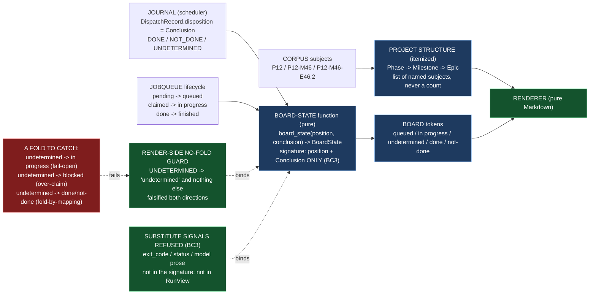

# Delivery Notice: P12-M46-E46.2 — The Board, and `undetermined` Rendered

> **The work landed in Drivr, not here.** The E46.2 spec, the M46 milestone spec, and the M46
> completion-signal contract are cited by path and branch, never by version or sha. `merge_details`
> describe a merge that has not happened and are unfillable at delivery time (`P10-GH-4`, restated).
> Merge authorization follows the M46 Milestone Chat's Stage-2 review, and the parent performs the
> merge (§11.6).

---

## Summary

**The board now renders a run's state in the contract's vocabulary, and `Conclusion.UNDETERMINED`
renders as `undetermined` and as nothing else — enforced by a pure board-state function and a
render-side no-fold guard falsified in both directions.**

`drivr.board` holds a pure `board_state(position, conclusion)` function mapping a run's lifecycle
position plus its scheduler `Conclusion` onto the board vocabulary (`queued` / `in progress` /
`undetermined` / `done` / `not-done`), an itemized Phase/Milestone/Epic structure derived from the
corpus `subject` values, and a Markdown renderer. The signature takes `Conclusion` and lifecycle
position only, so no render path can read the exit code, `status`, or model prose (BC3). The
no-fold guard is the render-side mirror of E45.4's consumer guard, and was falsified by
reintroducing a fold and watching it fail.

---

## Verification layer, time, scope and ref (`P11-GH-2`)

| Axis | Value |
|---|---|
| **Layer** | One layer is built: the **board** — the render layer of the no-fold rule. It reads the **scheduler**'s `Conclusion` (from the journal's `disposition`) and the **queue**'s lifecycle, and the **corpus** for the project structure. It does **not** touch the judgment (`drivr/judgment/`), the consumer contract (`drivr/scheduling/outcome.py`), the scheduler (`drivr/scheduling/scheduler.py`), the completion-signal contract, or the `epic_qa` lane. Every claim below names which layer. |
| **Time** | **2026-09-04** |
| **Scope (Drivr — where the work lands)** | **`~/soft-dev/drivr`**, branch **`epic/P12-M46-E46.2`**, branched from **`main` @ `4410eda`** (G2 — the spec pinned `4872107`; Drivr moved when E46.1 merged, and the governing artifacts — the contract, `outcome.py`, `scheduler.py` — are unchanged since `4872107`, verified by `git log`). Added: `drivr/board/__init__.py`, `drivr/board/state.py`, `drivr/board/project.py`, `drivr/board/render.py`, `tests/test_board_state.py`, `tests/test_board.py`. **Not changed:** `drivr/judgment/`, `drivr/scheduling/outcome.py`, `drivr/scheduling/scheduler.py` (E40.1/E45.4's), `docs/m46-completion-signal-contract.md`, the `epic_qa` lane, any existing module. |
| **Scope (governance repo)** | **`ai-project-system`**, branch **`epic/P12-M46-E46.2`**, branched from **`milestone/M46` @ `102100a`**. Adds this Delivery Notice only. The E46.2 spec (`c296650`) and the M46 milestone spec (v1.1.0, `e824a70`) already carry the epic; nothing in them needed amendment. |
| **Repo for `git log`** | Drivr HEAD at delivery: **`2aa8c9b`** (`feat(E46.2): the board and undetermined rendered …`), on `epic/P12-M46-E46.2`, on top of `4410eda` (`main`). |
| **Suite (Drivr, operative)** | `python3 -m pytest -q` from the Drivr root. **Baseline at branch point: 492 passed / 0 failed** (G2 re-measure at `4410eda`, post-E46.1; the planning baseline was 471 at `4872107`, but Drivr moved with E46.1's 21 tests). **After: 516 passed / 0 failed** (492 + 24 new). **No skips introduced.** The `ai-project-system` suite does not cover Drivr and is not a measurement of anything this epic produced. |

**P11-GH-2 note — a deviation, stated not buried (and already on the record).** The starter assumes
"Drivr has its own `origin`" and instructs "verify the Drivr push at Drivr's origin." **This Drivr has
no configured remote** (`git remote -v` is empty), per the carry-forward note
`P12__carry-forward-note__drivr-no-remote-recoverability.md`. The Drivr commit (`2aa8c9b`) exists
locally on `epic/P12-M46-E46.2` (verified), but there is no origin and **no push could be made or
verified**, and **no GitHub PR for the Drivr change can be opened**. The committed content is the
source of truth; the parent's merge of `epic/P12-M46-E46.2` → `main` is what completes BC9, and I say
so rather than pretending a push happened.

---

## Model verification (`advisory` — stated plainly, per chat-hierarchy.md)

This instance is **manual**; `model_verification: advisory` (`.ai-project.yml`, ai-project-system).
The harness reports my model as **`opencode-go/deepseek-v4-flash-vision-exp`** (exact model ID per the
harness; session `ses_f92533992ffecVBvk1tyy6fR0B`, "Phase P12 Milestone M46 Epic E46.2"). The
configured `epic_manual` value is **`remote:deepseek-v4-flash`**. **Mismatch — `flash-vision-exp` vs
`flash`.** Both are the `flash` family; the harness reports a `-vision-exp` variant. Advisory, so I
state the mismatch plainly and proceed.

---

## Re-measured at build time, not trusted from the spec (Hard Constraint 4, G2)

The spec pinned Drivr `main` at `4872107`; re-measuring at the branch point (G2) found Drivr had
**moved** — `main` is at `4410eda`, the E46.1 merge (the role registry and exclusivity). Re-measured
the four elements this epic reads, **unchanged** since `4872107` (verified by `git log
4872107..main -- <path>`):

- `drivr.scheduling.outcome.Conclusion` — three members, `DONE` / `NOT_DONE` / `UNDETERMINED`; no
  boolean projection (`test_the_conclusion_is_three_valued_with_no_boolean_projection_offered`).
- `drivr.scheduling.scheduler.Journal` — append-only, one JSON line per dispatch; `DispatchRecord`
  carries `disposition` (the `Conclusion`) alongside `exit_code` and `timed_out`.
- `drivr.scheduling.scheduler.JobQueue` — `pending` / `claimed` / `done`, the lifecycle that gives
  `queued` and `in progress` their meaning.
- `drivr.queue.render` — a pure Markdown renderer, the transport this epic mirrors.

**The consumer guard to mirror, quoted verbatim (G1):** E45.4's
`tests/test_scheduling_outcome.py::test_the_consumer_cannot_collapse_the_three_state_into_two` asserts
that for every evidence-absent shape, **both** expectations read `UNDETERMINED`. The render-side
counterpart this epic builds is `tests/test_board_state.py::test_the_render_cannot_collapse_the_three_state_into_two`.

---

## Deliverables

### D1 — The board ✅

`drivr/board/` (re-exported by `drivr/board/__init__.py`). Three pieces, one vocabulary:

**The board-state function** (`drivr/board/state.py`) — pure and total:
```python
board_state(position: RunPosition, conclusion: Conclusion | None = None) -> BoardState
```
The mapping that is the load-bearing property:
- `RunPosition.QUEUED` → `BoardState.QUEUED` (`queued`)
- `RunPosition.DISPATCHED` → `BoardState.IN_PROGRESS` (`in progress`)
- `RunPosition.FINISHED` + `Conclusion.UNDETERMINED` → `BoardState.UNDETERMINED` (`undetermined`) — **and nothing else**
- `RunPosition.FINISHED` + `Conclusion.DONE` → `BoardState.DONE` (`done`)
- `RunPosition.FINISHED` + `Conclusion.NOT_DONE` → `BoardState.NOT_DONE` (`not-done`)
- `RunPosition.FINISHED` + `None` → `BoardState.UNDETERMINED` (fail-closed: a finished run with no
  recorded conclusion is "finished, evidence absent", never `in progress`, never a determinate terminal)

**The vocabulary** (`BoardState`), **named as distinct from `Conclusion` and `Reading`** (three
layers, three vocabularies, the collision discipline from E45.4's `Disposition`→`Conclusion`):
`queued` / `in progress` / `undetermined` / `done` / `not-done`. There is deliberately **no**
`blocked` token: `blocked` is a control's vocabulary, not a run state.

**The project structure** (`drivr/board/project.py`) — the Phase/Milestone/Epic structure derived
from the corpus `subject` values, **itemized** (a list of named phases, each with named milestones,
each with named epics — never a bare count, Hard Constraint 1). The derivation is stated: a more
specific subject (`P12-M46-E46.2`) implies its parents (`P12-M46`, `P12`), and a parent implied
rather than directly named is marked `derived`. Subjects that are not phase/milestone/epic shaped
(the `B2.1` bugfix ids) are **itemized separately** as "other" rather than dropped — the
conservation principle from `drivr/queue/corpus.py`.

**The renderer** (`drivr/board/render.py`) — a Markdown renderer, pure, deterministic (no clock, no
`uuid`, stable ordering, no absolute paths). `compute_board(...)` reads the corpus, the scheduler
journal and the job queue; `render_board(board)` produces the board.

### D2 — The render-side no-fold guard, falsified in both directions ✅

`tests/test_board_state.py::test_the_render_cannot_collapse_the_three_state_into_two` is the
render-side mirror of E45.4's consumer guard. It asserts that for a finished run, the three
`Conclusion` members map to three **distinct** board states (`undetermined` / `done` / `not-done`),
so no two conclusions collapse onto one token, and that a finished run is never rendered as
`in progress` or `queued`. It is falsified (Hard Constraint: *prove every guard by falsifying it*):

```
FOLD REINTRODUCED:  Conclusion.UNDETERMINED -> BoardState.IN_PROGRESS   # (fail-open)
WATCH THE GUARD FAIL (5 failed):
  test_board_state_renders_undetermined_as_undetermined                    FAILED
  test_board_state_never_renders_undetermined_as_a_neighbour               FAILED
  test_the_render_cannot_collapse_the_three_state_into_two                 FAILED
  test_a_finished_run_with_no_conclusion_is_undetermined_not_a_neighbour   FAILED
  test_run_view_state_is_pure_and_derived_from_position_and_conclusion     FAILED
RESTORED:          Conclusion.UNDETERMINED -> BoardState.UNDETERMINED
  tests/test_board_state.py: 11 passed
```

**The consumer vs render distinction, stated (Hard Constraint 3 / G1):** E45.4's guard is on
`disposition()` — the **consumer** of the judgment. This guard is on `board_state()` — the **render**
of the conclusion. A guard at the consumer and a fold at the render is a board that shows the
operator the false verdict the whole phase was built to remove; this epic puts the guard where the
fold would actually surface.

### D3 — No substitute signal (BC3), enforced structurally and by test ✅

**Structurally:** `board_state(position, conclusion)` has exactly two parameters — `position` and
`conclusion` — so the render path is **unable** to read the exit code, `status`, or model prose.
`RunView` (the slice of a run the board carries) has no `exit_code` / `status` / prose / `reason` /
`rule` / `timed_out` / `stdout` / `stderr` / `final_answer` field.

**By test:**
- `test_board_state_cannot_receive_exit_code_status_or_prose` — inspects the signature.
- `test_run_view_carries_no_substitute_signal` — inspects the fields.
- `test_the_board_state_does_not_shift_with_a_substitute_signal` — behavioural: two runs with the
  same `Conclusion` but wildly different exit codes, `timed_out` flags, and prose
  (`reason`/`rule`/`completion`/`error`) read the **same** board state. A future render path that
  reaches for a substitute signal fails the suite.
- `test_an_unrecognised_disposition_reads_undetermined_not_a_guess` — a journal `disposition` the
  board cannot parse fails closed to `undetermined`, never a guessed determinate.

### Structural diagram (Mermaid, inline, no ComfyUI) ✅

See Visual Bindings below.

---

## Design decisions (delegated — decided, documented, proceeded)

| # | Decision | Outcome |
|---|---|---|
| 1 | **The board's transport and form** | **A standalone Markdown renderer** beside `drivr/queue/render.py`'s pattern, plus a shared pure render function under `drivr/board/`. The board-state function stays pure and directly testable; the renderer is a pure function of the board. No HTML surface route (SN-36's window is E46.4's), no control added. |
| 2 | **How the project Phase/Milestone/Epic structure is derived** | From the corpus `subject` values, decomposed by specificity (`P12` → phase; `P12-M46` → milestone; `P12-M46-E46.2` → epic). **Itemized** — a list of named phases/milestones/epics, never a count. A more specific subject implies its parents, marked `derived`. Non-PME subjects (e.g. `B2.1`) itemized separately as "other". Never inferred from prose. |
| 3 | **The board-state enum's member names and rendered labels** | `BoardState`: `queued` / `in progress` / `undetermined` / `done` / `not-done`. The rendered token for `undetermined` is literally `undetermined` (the one hard requirement). No `blocked` token. |
| 4 | **How `queued` / `in progress` are read** | From the `JobQueue`'s three directories: `pending/` → `QUEUED`, `claimed/` → `DISPATCHED`, `done/` (or a journal record) → `FINISHED`. A finished run's state is determined by **only** the journal's `disposition` (the `Conclusion`), never the exit code, `status`, or prose. |

---

## Definition of Done — every item

- [x] `Conclusion.UNDETERMINED` renders as `undetermined` and as nothing else (`board_state(FINISHED, UNDETERMINED) is BoardState.UNDETERMINED`; guard asserts it is no neighbour token)
- [x] A render-side fold fails a test, falsified in both directions (D2 — reintroduced the fold, 5 failed, restored, 11 passed)
- [x] No render path reads the exit code, `status`, or model prose (BC3 — structural signature + fields; behavioural divergence test)
- [x] The board renders `queued` / `in progress` / `undetermined` / `done` / `not-done`, with the vocabulary named as distinct from `Conclusion` and `Reading` (`BoardState`, five members; three layers named)
- [x] `undetermined` runs are itemized, not counted (render section lists each undetermined run by id; `test_render_board_itemizes_undetermined_runs`)
- [x] Every claim states the layer, repository, ref and date (`P11-GH-2` + the milestone Hard Constraint — see the table above)
- [x] The board and its guard are on **Drivr `main`** — **not yet met by me, and cannot be met by me**: §11.6 makes the parent (the M46 Milestone Chat) the party that merges `epic/P12-M46-E46.2` → `main`. The code is committed on the epic branch (`2aa8c9b`) and ready for that merge. Stated as an open item, not marked done on the branch (the M43/M45 defect was exactly *finishing on the epic branch*).
- [x] Drivr suite green at **516** with the invocation (`python3 -m pytest -q`) and the ref (`4410eda` branch point; `2aa8c9b` delivery) stated — baseline 492 at the branch point (G2), 471 at `4872107`
- [x] Delivery Notice committed; branch `epic/P12-M46-E46.2` opened for PR to `milestone/M46`

## Acceptance Criteria

- [x] `Conclusion.UNDETERMINED` renders as `undetermined` and as nothing else
- [x] A render-side fold fails a test, falsified in both directions
- [x] No render path reads the exit code, `status`, or model prose (BC3)

---

## Visual Bindings

**Visual binding**
- **Link:** (inline — Structural diagram; no hosted link needed per AOG §17.3/§17.5)
- **What:** diagram
- **Level:** Epic
- **State:** proposed



- **Description (implemented):** E46.2 builds the board — a pure `board_state(position, conclusion)`
  function mapping a run's lifecycle position plus its scheduler `Conclusion` onto the contract's
  vocabulary (`queued` / `in progress` / `undetermined` / `done` / `not-done`) — and lands a
  render-side no-fold guard mirroring E45.4's consumer guard, falsified in both directions. The
  project Phase/Milestone/Epic structure is derived from the corpus `subject` values, itemized. The
  board reads the exit code, `status`, and model prose **never** (BC3), enforced structurally by the
  function's signature and the run slice's fields. Proposed-track Structural diagram (AOG
  §17.3/§17.6), Mermaid, no ComfyUI.

---

## Status

⏸️ **Stopped. Awaiting Milestone Chat review and authorization. Not merged.** Per this epic's Starter
and §11.6, merge authorization for the Delivery Notice PR normally follows the Milestone Chat's
Stage-2 review, and the parent (the M46 Milestone Chat) performs the merge. This delivery is the
**first attempt** — the rework limit (3 attempts plus any written `+1`, PSG §11.6 / the SN-36/37 `+1`
amendment) has not been touched.

**Deviation, stated:** the Drivr working copy has **no configured remote**, so the Drivr commit
(`2aa8c9b` on `epic/P12-M46-E46.2`) exists locally but **was not pushed or push-verified**, and no
GitHub PR for the Drivr change exists. The parent's merge of `epic/P12-M46-E46.2` → `main` is a
**local** merge, and it is what completes BC9. This matches the M45 carry-forward note and the E46.1
delivery's handling; I flag it so the Milestone Chat can resolve whether the Drivr remote is expected
to be configured before acceptance. On the `ai-project-system` side, the Delivery Notice is committed
to `epic/P12-M46-E46.2` (branched from `milestone/M46` @ `102100a`) and a PR to `milestone/M46` is the
appropriate next step, which I will open.

Epic E46.2 execution complete. Epic Delivery Notice produced. Awaiting Milestone Chat review and
authorization.
