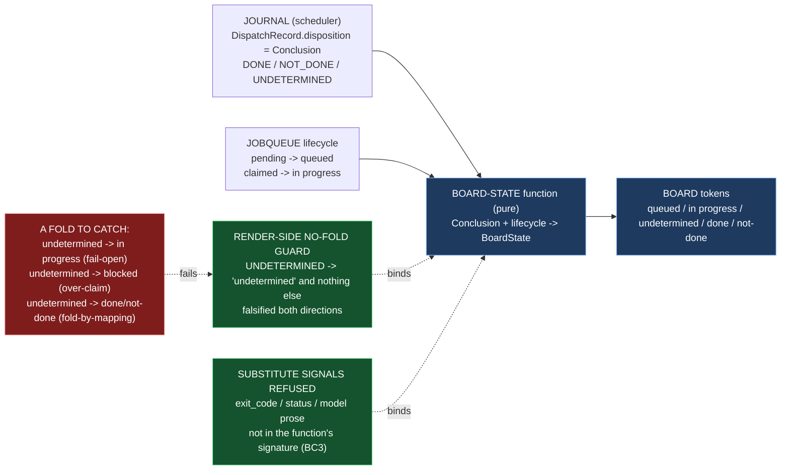

# Epic E46.2 — The Board, and `undetermined` Rendered

## Context

**What does the operator see, and can the interface show a verdict the signal cannot support?**

E46.2 builds the board — the surface that renders each project's Phase/Milestone/Epic and each
run's state — against a contract that already exists and is **not re-derived here**. The M45
handover (`docs/m46-completion-signal-contract.md`, Drivr `main` `4872107`) names the layers, the
three states, the board vocabulary, and — explicitly — what M46 may not do: render `undetermined`
as `in progress` (fail-open), render it as `blocked` (over-claim), fold it into `DONE`/`NOT_DONE`
at render time, or read the exit code, `status`, or the model's prose as a substitute signal.
**A change to that contract is a spec amendment with a changelog row, reviewed by the parent —
not a silent edit** (V3/BC1). If the contract looks wrong, that is an escalation, not a local fix.

**This is a deliberate departure from E40.3's "no dashboard", recorded rather than drifted.**
`drivr.surface` was built on SN-24's inversion — *a dashboard is a surface for watching; the more
agentic the machine, the less there is to watch* — and `drivr/surface/__init__.py` states "no
dashboard, no gate list and no index" as a charter, not a passing remark. M46 re-weights the
single window toward central (Binding Decision 15), **because the board's job is the one thing a
validating surface cannot do: tell the truth about not knowing.** M45 handed over a signal that
can say `undetermined`; a board that folds it into a neighbour shows the operator a confident
verdict the signal cannot support, which is exactly the false red (or false green) the operator
learns to ignore. The board is the render layer of the no-fold rule E45.4 guarded on the consumer
side.

**What this epic consumes, measured and re-measured at Drivr `main` `4872107` (G2, 2026-09-04):**

- `drivr.scheduling.outcome.Conclusion` — `DONE` / `NOT_DONE` / `UNDETERMINED`, three-valued, with
  **no boolean projection** (`test_the_conclusion_is_three_valued_with_no_boolean_projection_offered`).
- `drivr.scheduling.scheduler.Journal` — append-only, one JSON line per dispatch; the
  `DispatchRecord` carries `disposition` (the `Conclusion` value) alongside `exit_code` and
  `timed_out` — the latter two **recorded for audit, never load-bearing**.
- `drivr.scheduling.scheduler.JobQueue` — `pending` / `claimed` / `done`, the lifecycle that gives
  `queued` and `in progress` their meaning.
- `drivr.queue.corpus.Corpus` / `drivr.queue.render` — the corpus read (each artifact's `subject`
  naming `P<n>-M<n>-E<n>.<n>`) from which a project's Phase/Milestone/Epic structure is derived.
- **The consumer-side guard to mirror:** `tests/test_scheduling_outcome.py::test_the_consumer_cannot_collapse_the_three_state_into_two` —
  E45.4's behavioural no-fold guarantee at the consumer. E46.2 builds the render-side counterpart.

## Problem Statement

**A first-class state survives the judgment and the scheduler, and dies at the last layer — the
render — if the board maps `undetermined` onto a neighbour or reads a substitute signal.**

Three failure shapes, each a fold the contract forbids:

1. **Render-as-neighbour.** `Conclusion.UNDETERMINED` rendered as `in progress` reads absence as
   still-working (the fail-open pattern, drawn on a card); rendered as `blocked` over-claims a
   human is needed. Either way the operator sees "working" or "stuck" where the truth is "we do
   not know."
2. **Fold-by-mapping.** A render path that projects `undetermined` into `done`/`not-done` at
   render time — even "for display" — has folded the three-state into two. The contract names
   this prohibition explicitly because it is the fold most likely to be introduced by a
   well-meaning simplification of the board's markup.
3. **A substitute signal.** The `DispatchRecord` carries `exit_code` and `timed_out`. If any render
   path reads them (or `status`, or the model's prose) to decide a run's state, the board is
   rendering a signal that E39.1 and P10-GH-7 re-rated by E45.3 measured unreliable on this stack.

## Goals

By the end of this Epic, the system must:

1. **Render the board** — each project's Phase/Milestone/Epic, and each run's state in the
   contract's vocabulary: `queued` / `in progress` / `undetermined`, plus the determinate
   terminals `done` / `not-done`.
2. **Render `undetermined` as `undetermined`, and as nothing else** — `Conclusion.UNDETERMINED`
   maps to board state `undetermined` and to no other token.
3. **Land a render-side no-fold guard** — mirroring E45.4's consumer-side guard, and **falsified
   in both directions**: reintroducing a fold fails the test.
4. **Read no substitute signal** — no render path reads the exit code, `status`, or model prose
   (BC3).
5. **Make the size of the problem visible** — `undetermined` runs are **itemized** (never a bare
   count), so the pressure that keeps the phase honest is on the board, not summarized away.

## Non-Goals

This Epic explicitly does **not** aim to:

- **Add any control to the surface.** The board renders state; it adds no agentic toggle, no
  dispatch path, no mode control, no approval button. Those are E46.3's (absence of controls) and
  E46.4's (the controls that do exist).
- **Re-derive or amend the completion-signal contract** (V3/BC1). Build against it as it stands.
- **Change the judgment or the scheduler.** `Conclusion`, the journal, and `disposition()` are
  inherited; the board reads them and does not reshape them.
- **Make `undetermined` an alarm.** The scheduler's *journalled-and-move-on* policy (E40.1) is
  unchanged; the board shows `undetermined`, it does not escalate it.
- **Build the go-to-blocker affordance** (E46.4, which resolves through E46.1's registry).
- **Build the role registry** (E46.1) or the three unrepresentable rules (E46.3).

## Scope of Work

### 1. The board (D1)

**A render surface** showing, per project, its Phase/Milestone/Epic structure and each run's state
in the contract's vocabulary.

**Must include:**
- The five board tokens — `queued` / `in progress` / `undetermined` / `done` / `not-done` —
  itemized as a board-state vocabulary, **distinct from** `Conclusion` and `Reading` (three layers,
  three vocabularies, named; the collision discipline from E45.4's `Disposition`→`Conclusion`).
- A **pure, deterministic** board-state function: given a run's lifecycle position (queued /
  dispatched) and its finished `Conclusion`, return the board state. **Pure so the no-fold guard is
  a direct test, not a screenshot.**
- The mapping that is the load-bearing property: `Conclusion.UNDETERMINED` → board state
  `undetermined`, and **nothing else**; `DONE` → `done`; `NOT_DONE` → `not-done`; enqueued →
  `queued`; dispatched-not-finished → `in progress`.
- The project Phase/Milestone/Epic structure, derived from the corpus (`subject`), **itemized** —
  a list of named subjects, never a coverage count (Hard Constraint 1).

### 2. The render-side no-fold guard (D2)

**A test that fails if `undetermined` is rendered as anything else** — the mirror of E45.4's
`test_the_consumer_cannot_collapse_the_three_state_into_two`.

**Must include:**
- Every render path over a `Conclusion.UNDETERMINED` input asserted to yield board state
  `undetermined` — and only that.
- **Falsification in both directions**: reintroduce a fold (map `undetermined` → `in progress`,
  `blocked`, `done`, or `not-done`) and the guard fails; restore it and the guard passes (Hard
  Constraint 2).
- The distinction between the **consumer** guard (E45.4's, on `disposition()`) and the **render**
  guard (this one, on the board-state function) stated in the record.

### 3. No substitute signal (D3)

**No render path reads the exit code, `status`, or model prose (BC3).**

**Must include:**
- The board-state function's signature **cannot receive** `exit_code`, `status`, or prose — it
  takes `Conclusion` (and lifecycle position), so the render path is structurally unable to read
  them.
- A test asserting the board does not read `exit_code` / `status` / model prose from the journal
  or run records — so a future render path that reaches for a substitute signal fails the suite,
  not just the prose.

## Deliverables

- [ ] **D1** — The board: project Phase/Milestone/Epic + run states in the contract's vocabulary,
      via a pure board-state function
- [ ] **D2** — The render-side no-fold guard, falsified in both directions (mirrors E45.4's
      consumer guard)
- [ ] **D3** — No render path reads the exit code, `status`, or model prose (BC3), enforced
      structurally and by test
- [ ] Structural diagram (Mermaid, inline, **no ComfyUI**)
- [ ] **Epic Delivery Notice**

## Binding Constraints

Settled above this epic — **not re-decidable here** (milestone spec §Binding Constraints):

1. **BC1 / V3 — The completion-signal contract is an input, not a subject.** Build against it as
   it stands; disagreement escalates.
2. **BC2 — `undetermined` is rendered as `undetermined`.** Never as `in progress`, never as
   `blocked`, never folded into a terminal state at render time.
3. **BC3 — The exit code, `status`, and model prose are refused as load-bearing signals.**
4. **BC9 — A Drivr deliverable measured only on an epic branch is not done.** The board and its
   guard must be on Drivr `main`.

## Hard Constraint (binding — carried to every Epic)

> **A surface that *validates* a governance rule can be argued with; a surface that cannot
> *represent* the rule's violation has nothing to argue about.**

1. **Itemize, never count.** A coverage number where a list belongs is not a claim. The board
   itemizes `undetermined` runs; it does not print "3 undetermined" and stop.
2. **Falsify in both directions.** A guard that has never failed has not been shown to work.
3. **Record before improving.** A defect found is recorded before it is fixed.
4. **Re-measure the harness claim you rest on, at the moment you rest on it.**
5. **Finish on `main`.** A Drivr deliverable measured only on an epic branch is **not done**
   (BC9).

## Design Decisions Delegated — decide, document, proceed

1. **The board's transport and form** — a new surface route (HTML, per SN-36's window), a
   standalone renderer (like `queue/render.py`'s Markdown), or a shared pure render function under
   both. Whatever the transport, the board-state function stays pure and directly testable.
2. **How a project's current Phase/Milestone/Epic is derived** from the corpus — itemized, with
   the derivation stated; never a bare count, never inferred from prose.
3. **The board-state enum's exact member names and rendered labels** — with one hard requirement:
   the rendered token for `undetermined` is literally `undetermined`.
4. **How `queued` / `in progress` are read** from the `JobQueue` and combined with the journal's
   finished dispositions — with the rule that **only `Conclusion`** determines a finished run's
   state, never the exit code, `status`, or prose.

**Escalate instead of deciding:** any change to the contract (V3); any render path that reads the
exit code, `status`, or model prose (BC3); any weakening of the no-fold rule (BC2); any change to
`Conclusion`, `disposition()`, or the journal (E45.4's delivered surface).

## Definition of Done

Epic E46.2 is complete when:

- [ ] `Conclusion.UNDETERMINED` renders as `undetermined` and as nothing else
- [ ] A render-side fold fails a test, falsified in both directions
- [ ] No render path reads the exit code, `status`, or model prose (BC3)
- [ ] The board renders `queued` / `in progress` / `undetermined` / `done` / `not-done`, with the
      vocabulary named as distinct from `Conclusion` and `Reading`
- [ ] `undetermined` runs are itemized, not counted
- [ ] Every claim states the layer, repository, ref and date (`P11-GH-2` + the milestone Hard Constraint)
- [ ] The board and its guard are on **Drivr `main`**, not only on an epic branch (BC9)
- [ ] Drivr suite green at **471** plus this epic's changes, with the invocation and the ref stated
- [ ] Delivery Notice committed; PR opened from the Drivr epic branch to Drivr `main`

## Acceptance Criteria

- [ ] `Conclusion.UNDETERMINED` renders as `undetermined` and as nothing else
- [ ] A render-side fold fails a test, falsified in both directions
- [ ] No render path reads the exit code, `status`, or model prose (BC3)

## Technical Constraints

**Repository:** the work lands in **Drivr** (`~/soft-dev/drivr`, `main` at `4872107`), not in
`ai-project-system`. This repository's suite does not cover Drivr, and *"suite green here"* is
not verification.
**In scope:** a new board renderer (beside `drivr/queue/render.py`, or under `drivr/surface/`),
its board-state function and tests. **Do not touch:** `drivr/judgment/`,
`drivr/scheduling/outcome.py` and `drivr/scheduling/scheduler.py` (E40.1/E45.4's),
`docs/m46-completion-signal-contract.md`, or the `epic_qa` lane config.
**Invocation:** `python3 -m pytest -q` from the Drivr root; `PYTHONPATH=. pytest -q` in this
repository if any governance edit lands.
**Baselines:** Drivr **471** at `main` `4872107` (re-measured 2026-09-04, G2);
`ai-project-system` **767 passed** this run (environment-dependent — `766+1 skipped` / `767` /
`766 passed + 1 failed` are the same suite; the variance is the live-ComfyUI integration test).

## Dependencies

**Internal**
- **M45 (gate, satisfied)** — `docs/m46-completion-signal-contract.md`, Drivr `main` `4872107`.
- **E45.4's consumer contract and guard** — the surface this epic reads and mirrors.

**External**
- **Drivr at `~/soft-dev/drivr`, `main` `4872107`** — re-measured for this spec; re-measure again
  at the branch point (G2).

**Blockers**
- None at planning. `Conclusion`, the journal, and the corpus read are all confirmed live at
  `4872107`.

## Timeline

**Estimated Effort:** 1 session — the board-state function and its guard are bounded; the
project-structure derivation is the substance.
**Target Completion:** after E46.1 (parallel-safe with E46.3 and E46.4, which do not touch the
board's render path).
**Actual Completion:** In progress.

## Execution Notes

**Order:**
1. Re-measure `Conclusion`, the journal, the `JobQueue`, and `queue/render.py` at your branch
   point (G2).
2. Define the board-state vocabulary and its pure function from `Conclusion` + lifecycle (D1).
3. Land the render-side no-fold guard, falsified in both directions (D2).
4. Enforce and test "no substitute signal" — the board-state function cannot receive `exit_code`
   / `status` / prose (D3).
5. Render the project Phase/Milestone/Epic structure from the corpus, itemized.
6. Run the Drivr suite; state the invocation and the ref.

**Traps this project has already paid for:**

- **Reasoning about a state name without reading the enum (Y5).** `Conclusion` has three members;
  read `outcome.py` before reasoning about `undetermined`. There is no `Completion.UNDETERMINED`.
- **A fold introduced "for display".** The contract forbids folding `undetermined` into
  `done`/`not-done` *at render time* — a well-meaning markup simplification is the most likely
  fold, and the guard is what catches it.
- **A bare count where a list belongs.** "3 undetermined" is not the pressure the phase needs;
  the itemized list is (Hard Constraint 1).
- **Reading `exit_code` from the `DispatchRecord`.** It is there for the audit trail; the board
  must not make it load-bearing (BC3).
- **Two repositories, two pushes, two `origin`s** — and `git status` before every commit.
- **Finishing on the epic branch only** (BC9).

## Related Documents

- [M46 Milestone Spec](P12-M46__milestone-spec.md) — E46.2 Epic Detail, Binding Constraints, V3,
  Hard Constraint
- [M46 Milestone Execution Chat Starter](P12-M46__milestone-execution-chat-starter.md)
- [P12 Phase Spec](P12__phase-spec.md) — §P12.6 (M46), success criteria 17/18
- [M46 completion-signal contract](~/soft-dev/drivr/docs/m46-completion-signal-contract.md) — Drivr
  `main` `4872107`; an input, not a subject
- [E45.4 Spec](P12-M45-E45.4__spec__undetermined-end-to-end-and-m46-contract.md) — the consumer
  guard this epic mirrors
- Drivr `drivr/scheduling/outcome.py`, `drivr/scheduling/scheduler.py`, `drivr/queue/corpus.py`,
  `drivr/queue/render.py`, `drivr/surface/__init__.py` at `main` `4872107`
- [PROJECT-SYSTEM-GUIDELINES.md](../../../governance/PROJECT-SYSTEM-GUIDELINES.md)
- [AI-OPERATING-GUIDELINES.md](../../../governance/AI-OPERATING-GUIDELINES.md)

## Visual Bindings

**Visual binding**
- **Link:** (inline — Structural diagram; no hosted link needed per AOG §17.3/§17.5)
- **What:** diagram
- **Level:** Epic
- **State:** proposed

- **Description:** E46.2 builds the board — a pure board-state function mapping a run's lifecycle
  position plus its `Conclusion` onto the contract's vocabulary (`queued` / `in progress` /
  `undetermined` / `done` / `not-done`) — and lands a render-side no-fold guard mirroring E45.4's
  consumer guard, falsified in both directions. The board reads the exit code, `status`, and model
  prose **never** (BC3), enforced structurally by the function's signature. Proposed-track
  Structural diagram (AOG §17.3/§17.6), Mermaid, no ComfyUI.

## Notes

- **The board is the place the no-fold rule lives or dies.** E45.4 guarded the consumer;
  E45.2 made the judgment honest; this epic makes the *render* honest. A guard at the consumer
  and a fold at the render is a board that shows the operator the false verdict the whole phase
  was built to remove.

- **Why the board is a re-weighting, not drift.** E40.3's "no dashboard" was SN-24's inversion
  for a machine that had nothing to watch. M45 handed over a signal worth watching precisely
  because it can say `undetermined`. Binding Decision 15 re-weights the single window toward
  central; this spec records the departure rather than letting a reader discover it as a
  contradiction between `surface/__init__.py`'s charter and the board.

- **The board shows; it does not control.** E46.2 adds no control. That boundary is load-bearing:
  the absence of controls (E46.3) and the controls that do exist (E46.4) are separate epics, and
  the board's purity as a render is what makes its no-fold guarantee testable directly rather than
  through a UI.

## Changelog

| Version | Date | Change |
|---|---|---|
| 1.0.0 | 2026-09-04 | Initial E46.2 spec, from the M46 milestone spec v1.0.0 (E46.2 Epic Detail, Binding Constraints, V3, Hard Constraint), the M46 completion-signal contract (Drivr `main` `4872107`), and Drivr source re-measured at `main` `4872107` (G2; Drivr suite 471 passed, `ai-project-system` 767 passed, both 2026-09-04). Scopes a pure board-state function mapping `Conclusion` + lifecycle onto the contract's board vocabulary, a render-side no-fold guard mirroring E45.4's `test_the_consumer_cannot_collapse_the_three_state_into_two` and falsified in both directions, and structural refusal of the exit code / `status` / model prose (BC3). Names the board as a recorded re-weighting of E40.3's "no dashboard" (Binding Decision 15). No scope, ordering, gate or acceptance-criterion change from the milestone spec. |
