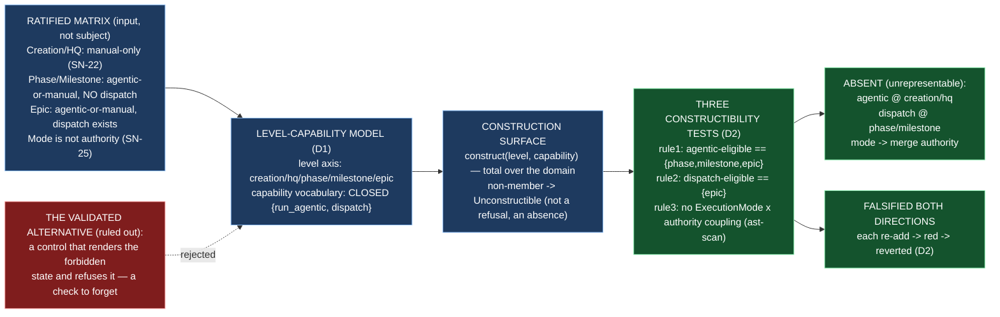

# Delivery Notice: P12-M46-E46.3 — Three Governance Rules Made Unrepresentable

> **The work landed in Drivr, not here.** The E46.3 spec, the M46 milestone spec, and the
> ratified execution matrix (`governance/systems/chat-hierarchy.md`) are cited by path and
> branch, never by version or sha. `merge_details` describe a merge that has not happened and
> are unfillable at delivery time (`P10-GH-4`, restated). Merge authorization follows the M46
> Milestone Chat's Stage-2 review, and the parent performs the merge (§11.6).

---

## Summary

**Three governance rules are now *unrepresentable* rather than *validated* — the deliverable is
the absence of three controls, each shown by a test that fails if the forbidden state becomes
constructible again.**

`drivr/capabilities` is a closed level-capability model: the level axis (`creation`/`hq`/`phase`/
`milestone`/`epic`, **itemized**), a closed capability vocabulary (`run_agentic`, `dispatch`), and
a construction domain in which the three forbidden states are **not members** — the `creation`/`hq`
rows are empty (rule 1), `phase`/`milestone` carry `run_agentic` but no `dispatch` (rule 2), and
the vocabulary is closed over two members so there is **no** mode→merge-authority capability at
all (rule 3). The absence is a property of the domain, not a check that refuses an expressed
state: `constructible_capabilities(creation)` returns the empty set; there is no agentic control
to grey out and no dispatch control to gate. `construct` is total over the domain and raises for a
non-member, so there is no code path where the forbidden state exists and must be noticed.

`tests/test_capabilities.py` lands one constructibility test per rule — each asserting the exact
eligible-level set, so **re-adding the forbidden state moves the set and the test goes red** — and
each was **falsified in both directions** (deliberate re-add → red → revert), recorded below.

---

## Verification layer, time, scope and ref (`P11-GH-2`)

| Axis | Value |
|---|---|
| **Layer** | One layer is built: the **construction surface** — the model of *which controls a level may construct*. It reads nothing (it is pure data + a construction function); it does **not** touch the judgment (`drivr/judgment/`), the scheduler (`drivr/scheduling/`), the surface (`drivr/surface/`), the registry (`drivr/registry/`), the board (`drivr/board/`), the modes record (`drivr/modes/`), the completion-signal contract, or the `epic_qa` lane. It is the boundary E46.4's controls (approval, escalation, go-to-blocker) are constrained by. |
| **Time** | **2026-09-04** |
| **Scope (Drivr — where the work lands)** | **`~/soft-dev/drivr`**, branch **`epic/P12-M46-E46.3`**, branched from **`main` @ `107457a`** (G2 — the spec pinned `4872107`; Drivr moved when E46.1 and E46.2 merged). Added: `drivr/capabilities/__init__.py`, `drivr/capabilities/model.py`, `tests/test_capabilities.py`. **Not changed:** `drivr/judgment/`, `drivr/scheduling/`, `drivr/surface/`, `drivr/registry/`, `drivr/board/`, `drivr/modes/`, `docs/m46-completion-signal-contract.md`, the `epic_qa` lane, any existing module. |
| **Scope (governance repo)** | **`ai-project-system`**, branch **`epic/P12-M46-E46.3`**, branched from **`milestone/M46` @ `fa41751`**. Adds this Delivery Notice only. The E46.3 spec (`336bd13`) and the M46 milestone spec (`b1057d7`) already carry the epic; nothing in them needed amendment. |
| **Repo for `git log`** | Drivr HEAD at delivery: **`08daeb3`** (`feat(E46.3): three governance rules made unrepresentable — a closed level-capability model, and three constructibility tests falsified both directions`), on `epic/P12-M46-E46.3`, on top of `107457a` (`main`). |
| **Suite (Drivr, operative)** | `python3 -m pytest -q` from the Drivr root. **Baseline at branch point: 516 passed / 0 failed** (G2 re-measure at `107457a`, post-E46.1+E46.2; the planning baseline was 471 at `4872107`, but Drivr moved with E46.1's 21 and E46.2's 24 tests). **After: 527 passed / 0 failed** (516 + 11 new). **No skips introduced.** The `ai-project-system` suite does not cover Drivr and is not a measurement of anything this epic produced. |

**P11-GH-2 note — a deviation, stated not buried (and already on the record).** The starter assumes
"Drivr has its own `origin`" and instructs "verify the Drivr push at Drivr's origin." **This Drivr has
no configured remote** (`git remote -v` is empty), per the carry-forward note
`P12__carry-forward-note__drivr-no-remote-recoverability.md`. The Drivr commit (`08daeb3`) exists
locally on `epic/P12-M46-E46.3` (verified), but there is no origin and **no push could be made or
verified**, and **no GitHub PR for the Drivr change can be opened**. The committed content is the
source of truth; the parent's merge of `epic/P12-M46-E46.3` → `main` is what completes BC9, and I say
so rather than pretending a push happened.

---

## Model verification (`advisory` — stated plainly, per chat-hierarchy.md)

This instance is **manual**; `model_verification: advisory` (`.ai-project.yml`, ai-project-system).
The harness reports my model as **`opencode-go/deepseek-v4-flash-vision-exp`** (exact model ID per the
harness; session `ses_…`). The configured `epic_manual` value is **`remote:deepseek-v4-flash`**.
**Mismatch — `flash-vision-exp` vs `flash`.** Both are the `flash` family; the harness reports a
`-vision-exp` variant. Advisory, so I state the mismatch plainly and proceed.

---

## Re-measured at build time, not trusted from the spec (Hard Constraint 4, G2)

The spec pinned Drivr `main` at `4872107`; re-measuring at the branch point (G2) found Drivr had
**moved** — `main` is at `107457a`, the E46.2 merge. Re-measured the two elements this epic rests on,
**unchanged in shape** since `4872107` (verified by `git log 4872107..main -- <path>`):

- **`drivr/modes/record.py`** — `ExecutionMode` (`MANUAL` / `AGENTIC`) and the committed-starter
  invariant; it knows **nothing** about levels, dispatch, or merge authority.
- **`drivr/surface/__init__.py`** — the surface is headless: "no dashboard, no gate list and no
  index"; no level-capability model, no mode control, no dispatch control exists anywhere in `drivr/`
  (confirmed by `grep` for level/capability and `ExecutionMode` usage across the package — the only
  `ExecutionMode` references are in `drivr/modes/`).

**The ratified matrix quoted verbatim (G1 — the non-uniform element):** the three rows E46.3 builds
against, reproduced exactly as ratified in `governance/systems/chat-hierarchy.md` §"The execution
matrix (ratified)":

| Level | Execution Mode | Inference locality |
|---|---|---|
| Creation | **Manual only** (permanent, SN-22) | Remote |
| HQ | **Manual only** (permanent, SN-22) | Remote |
| Phase | Agentic or manual | Remote |
| Milestone | Agentic or manual | Remote — **local under evaluation** |
| Epic | Agentic or manual | Local or remote (in force, E34.3) |

And the "Mode is not authority" passage it builds rule 3 against (quoted verbatim): *"Mode is what may
run; gates are what may be decided without a key."* These are the non-uniform element, quoted not
re-derived. **The matrix is an input, not a subject** — if it looked wrong, that would be an
escalation, not a local fix.

---

## Deliverables

### D1 — The level-capability model ✅

`drivr/capabilities/` (re-exported by `drivr/capabilities/__init__.py`). Three pieces, one domain:

**The level axis** (`GovernanceLevel`, `LEVEL_AXIS`) — `creation` / `hq` / `phase` / `milestone` /
`epic`, **itemized, never counted** (Hard Constraint 1). **Delegated decision 2:** E46.3 defines its
own `GovernanceLevel` rather than reusing E46.1's role vocabulary, and records the relationship —
E46.1's vocabulary (`hq`, `phase`, `milestone/M<n>`, `epic/<id>`) adds *instance specificity* and
has **no** `creation`; it is a role→address mapping, not the level axis. The board's subject
vocabulary (`P12`/`P12-M46`/`P12-M46-E46.2`) names *artifacts*, not tiers.

**The closed capability vocabulary** (`Capability`, `CAPABILITY_VOCABULARY`) — `run_agentic`,
`dispatch`, **itemized**. Closed means "not in the model" is a meaningful claim: there is **no**
`mode-implies-merge` member, so a control that maps `ExecutionMode` to merge authority is not
expressible at all (rule 3). `approval` / `escalate-further` / `go-to-blocker` are E46.4's controls
and are **not** capabilities of this construction surface (Non-Goals).

**The three absences as properties of the domain, not runtime checks** (`_CONSTRUCTIBLE`,
`constructible_capabilities`, `is_constructible`, `construct`):

- `creation` → `∅` and `hq` → `∅` (rule 1 — no agentic).
- `phase` → `{run_agentic}`, `milestone` → `{run_agentic}` (rule 1's boundary is creation/hq; rule
  2's boundary is phase/milestone — **the two rules are kept distinct**).
- `epic` → `{run_agentic, dispatch}` (dispatch exists at `epic` only, rule 2).
- Rule 3 is enforced by the **closed vocabulary** (no mode→authority member) plus the structural
  `ast`-scan in D2.

The domain is exposed read-only (`MappingProxyType`), so an external caller cannot mutate a
forbidden pair into a constructible one at runtime. `construct` is total over the domain and raises
`Unconstructible` for a non-member — the same shape as asking an enum for a member it does not define.

### D2 — Three constructibility tests, each falsified in both directions ✅

`tests/test_capabilities.py`, 11 tests. The three rule-specific tests are written against the exact
eligible-level **set**, so a re-add moves the set and the test goes red:

1. **Rule 1** — `test_agentic_eligible_levels_are_exactly_phase_milestone_epic` (and
   `test_agentic_is_not_constructible_at_creation_or_hq`).
2. **Rule 2** — `test_dispatch_eligible_levels_are_exactly_epic` (and
   `test_dispatch_is_not_constructible_at_phase_or_milestone`,
   `test_phase_and_milestone_may_run_agentic_but_may_not_dispatch`).
3. **Rule 3** — `test_no_mode_control_implies_merge_authority` (the `ast`-scan, precedent of
   `test_the_judgment_layer_does_not_import_the_scheduler`) and
   `test_the_construction_surface_does_not_import_execution_mode`.

**Falsified in both directions (Hard Constraint 2) — the re-add, the red, the revert:**

```
RULE 1 — re-added run_agentic at creation & hq
  RED (3 failed): test_agentic_is_not_constructible_at_creation_or_hq
                  test_agentic_eligible_levels_are_exactly_phase_milestone_epic
                  test_a_forbidden_pair_is_never_a_domain_member
  REVERTED: creation/hq -> ∅ ; tests/test_capabilities.py 11 passed

RULE 2 — re-added dispatch at phase & milestone
  RED (4 failed): test_dispatch_is_not_constructible_at_phase_or_milestone
                  test_dispatch_eligible_levels_are_exactly_epic
                  test_phase_and_milestone_may_run_agentic_but_may_not_dispatch
                  test_a_forbidden_pair_is_never_a_domain_member
  REVERTED: phase/milestone -> {run_agentic} ; tests/test_capabilities.py 11 passed

RULE 3 (function case) — added `def _merge_authority(mode): return mode is ExecutionMode.AGENTIC`
  RED (1 failed): test_no_mode_control_implies_merge_authority
  REVERTED: function removed ; tests/test_capabilities.py 11 passed

RULE 3 (type case) — added `from drivr.modes import ExecutionMode; MergeAuthority = ExecutionMode`
  RED (2 failed): test_no_mode_control_implies_merge_authority
                  test_the_construction_surface_does_not_import_execution_mode
  REVERTED: import + alias removed ; tests/test_capabilities.py 11 passed
```

### D3 — The rejected-vs-unrepresentable distinction, stated per rule ✅

**A validated rule** is one the surface can *express* and then *reject*: a control renders an agentic
option at `creation` and greys it out, a dispatch control throws `if level != epic`, or a merge
control reads an `ExecutionMode` argument. Each leaves a code path where the forbidden state exists
and something must notice — a check that can be forgotten, disabled, or raced.

**An unrepresentable rule** has no such path. For each rule, what the validated form would look like
and why this epic's version has no such path — **itemized, never counted** (Hard Constraint 1):

| Rule | The forbidden state | The *validated* version (ruled out) | Why this version has no such path |
|---|---|---|---|
| **Rule 1 — no agentic at Creation/HQ** | `run_agentic` at `creation` or `hq` | A Manual/Agentic control draws `creation`/`hq` with agentic **greyed out** — the state is expressed and refused | `constructible_capabilities(creation)` and `(hq)` return `∅`. There is no agentic control to grey out; the pair is not a member of the domain, so `construct(creation, run_agentic)` raises the same way an enum raises for a member it does not define. |
| **Rule 2 — no Phase/Milestone dispatch** | `dispatch` at `phase` or `milestone` | A dispatch affordance renders for phase/milestone and throws `if level != epic` — the forbidden dispatch exists as a code path and is refused each time | `constructible_capabilities(phase)` and `(milestone)` return `{run_agentic}`, **no** `dispatch`. There is no dispatch control at those levels to gate. |
| **Rule 3 — no mode control implying merge authority** | a mode control derives/grants merge authority | A merge-authorization control takes an `ExecutionMode` argument — even to refuse an agentic merge — so mode and authority are linked, and a future "relaxation" is a one-line change | The capability vocabulary is **closed** over `{run_agentic, dispatch}`; there is no `mode-implies-merge` capability at all. The `ast`-scan asserts no scope in `drivr/` couples `ExecutionMode` with an authority term, and `drivr.capabilities` never imports `ExecutionMode`. Mode and authority are separate axes by construction. |

**The distinction is a distinction, not a preference** (V4): rule 1 (no agentic at Creation/HQ) is
**not** rule 2 (no Phase/Milestone dispatch). Flattening them would forbid agentic at phase/milestone
— which the ratified matrix does not — and `test_phase_and_milestone_may_run_agentic_but_may_not_dispatch`
holds them apart.

### Structural diagram (Mermaid, inline, no ComfyUI) ✅

See Visual Bindings below.

---

## Design decisions (delegated — decided, documented, proceeded)

| # | Decision | Outcome |
|---|---|---|
| 1 | **The shape of the level-capability model** | A `GovernanceLevel` enum + a **closed** `Capability` enum + a frozen `_CONSTRUCTIBLE` mapping (level → constructible capability set), exposed read-only (`MappingProxyType`). The forbidden pairs are **not members** of the domain — not absent from a default value. `constructible_capabilities`, `is_constructible`, and `construct` (total over the domain, raising `Unconstructible` for a non-member) are the construction surface. |
| 2 | **Reuse E46.1's vocabulary or define our own** | **Define our own `GovernanceLevel`** and record the relationship. E46.1's role vocabulary (`hq`, `phase`, `milestone/M<n>`, `epic/<id>`) adds instance specificity and lacks `creation`; it is a role→address mapping, not the level axis. Reusing it would either omit `creation` or conflate a level with a role. |
| 3 | **The exact form of each constructibility test** | **Set-exhaustiveness** for rules 1 and 2 (assert the eligible-level set is exactly the expected one, so a re-add moves the set) + **`ast`-scan** for rule 3 (the `test_the_judgment_layer_does_not_import_the_scheduler` precedent), which also checks module-level type aliases and the construction surface's import of `ExecutionMode`. Each falsified in both directions (D2). |
| 4 | **Where the model lives** | A new package `drivr/capabilities/` beside `drivr/modes/`, `drivr/surface/`, `drivr/registry/`. It is exported as the surface's control-construction boundary for E46.4 to consume; nothing here is a runtime dispatch path. |

---

## Definition of Done — every item

- [x] Three rules named — no agentic at Creation/HQ; no Phase/Milestone dispatch; no mode control implying merge authority — each **unrepresentable rather than validated** (D1; the forbidden pairs are not domain members)
- [x] Each rule has a test that fails when the forbidden state is made constructible again (D2 — set-exhaustiveness for rules 1/2, `ast`-scan for rule 3)
- [x] Each constructibility test is **falsified in both directions** (shown to fail on a deliberate re-add — the four red runs in D2)
- [x] The distinction between *rejected* and *unrepresentable* is stated in the record (D3, per rule)
- [x] The level and capability vocabularies are **itemized** (never a count — `LEVEL_AXIS` five members, `CAPABILITY_VOCABULARY` two members)
- [x] Every claim states the layer, repository, ref and date (`P11-GH-2` + the milestone Hard Constraint — see the table above)
- [x] The model and its tests are on **Drivr `main`** — **not yet met by me, and cannot be met by me**: §11.6 makes the parent (the M46 Milestone Chat) the party that merges `epic/P12-M46-E46.3` → `main`. The code is committed on the epic branch (`08daeb3`) and ready for that merge. Stated as an open item, not marked done on the branch (the M43/M45 defect was exactly *finishing on the epic branch*).
- [x] Drivr suite green at **527** with the invocation (`python3 -m pytest -q`) and the ref (`107457a` branch point; `08daeb3` delivery) stated — baseline 516 at the branch point (G2), 471 at `4872107`
- [x] Delivery Notice committed; branch `epic/P12-M46-E46.3` opened for PR to `milestone/M46`

## Acceptance Criteria

- [x] Three rules named, each unrepresentable rather than validated
- [x] Each has a test that fails when the forbidden state is made constructible again
- [x] The distinction between *rejected* and *unrepresentable* is stated in the record

---

## Visual Bindings

**Visual binding**
- **Link:** (inline — Structural diagram; no hosted link needed per AOG §17.3/§17.5)
- **What:** diagram
- **Level:** Epic
- **State:** proposed



- **Description (implemented):** E46.3 makes three governance rules unrepresentable rather than
  validated. A closed level-capability model — levels `creation`/`hq`/`phase`/`milestone`/`epic` — has
  no way to express an agentic control at Creation/HQ (SN-22), no way to express a dispatch control at
  Phase/Milestone (SN-31 Carry-Over 1), and no way to derive merge authority from execution mode (mode
  is not authority, SN-25). Three constructibility tests each fail if the forbidden state is re-added,
  and each was falsified in both directions. The validated alternative — a control that renders the
  forbidden state and refuses it — is ruled out explicitly. Proposed-track Structural diagram (AOG
  §17.3/§17.6), Mermaid, no ComfyUI.

---

## Status

⏸️ **Stopped. Awaiting Milestone Chat review and authorization. Not merged.** Per this epic's Starter
and §11.6, merge authorization for the Delivery Notice PR normally follows the Milestone Chat's
Stage-2 review, and the parent (the M46 Milestone Chat) performs the merge. This delivery is the
**first attempt** — the rework limit (3 attempts plus any written `+1`, PSG §11.6 / the SN-36/37 `+1`
amendment) has not been touched.

**Deviation, stated:** the Drivr working copy has **no configured remote**, so the Drivr commit
(`08daeb3` on `epic/P12-M46-E46.3`) exists locally but **was not pushed or push-verified**, and no
GitHub PR for the Drivr change exists. The parent's merge of `epic/P12-M46-E46.3` → `main` is a
**local** merge, and it is what completes BC9. This matches the M45 carry-forward note and the E46.1/
E46.2 deliveries' handling; I flag it so the Milestone Chat can resolve whether the Drivr remote is
expected to be configured before acceptance. On the `ai-project-system` side, the Delivery Notice is
committed to `epic/P12-M46-E46.3` (branched from `milestone/M46` @ `fa41751`) and a PR to
`milestone/M46` is the appropriate next step, which I will open.

Epic E46.3 execution complete. Epic Delivery Notice produced. Awaiting Milestone Chat review and
authorization.
