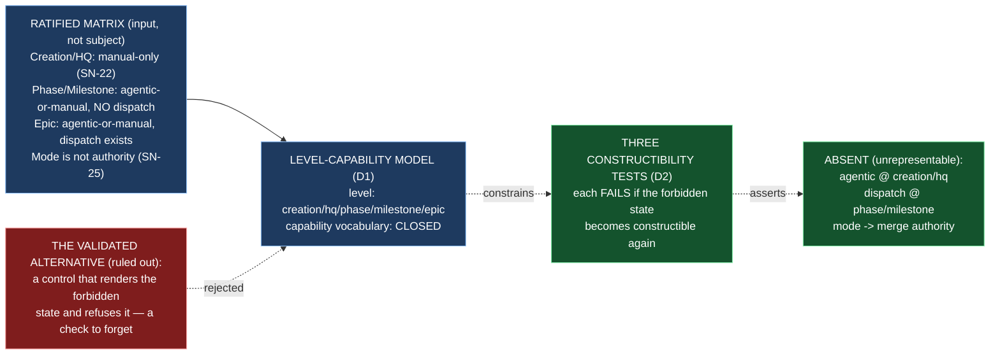

# Epic E46.3 — Three Governance Rules Made Unrepresentable

## Context

**Which states can the interface simply not construct?**

E46.3 is the milestone's inversion of its own organizing finding. Everywhere else in P12,
*absent evidence let an action proceed*; here, **absent capability is the safety property** —
and the risk is the mirror image (V4): an absence that is merely undocumented today is re-added
tomorrow by someone who did not know it was load-bearing. Success criterion 17 names the three
rules the surface must make unrepresentable:

1. **No agentic at Creation/HQ** — manual-only, permanently (SN-22).
2. **No Phase/Milestone dispatch** — the dispatch control exists at Epic only (SN-31 Carry-Over 1).
3. **No mode control implying merge authority** — *mode is not authority* (BC7, SN-25 ratified
   matrix).

**The distinction this epic exists to enforce, and it is a distinction, not a preference:**

> A **validated** rule is one the interface can express and then reject. It leaves a code path
> where the forbidden state exists and something must notice — a check that can be forgotten,
> disabled, or raced. An **unrepresentable** rule has no such path: the state cannot be
> constructed, so there is no check to forget. **This milestone's deliverable is the absence of a
> control, and absence is hard to demonstrate** — so each of the three must be shown by a test
> that **fails if the state becomes constructible again.**

**The ratified matrix this epic builds against** (`governance/systems/chat-hierarchy.md`, the
execution matrix ratified by the HQ Ruling on SN-25, Decision 4 — reproduced there exactly as
ratified):

| Level | Execution Mode | Locality |
|---|---|---|
| Creation | **Manual only** (permanent, SN-22) | Remote |
| HQ | **Manual only** (permanent, SN-22) | Remote |
| Phase | Agentic or manual | Remote |
| Milestone | Agentic or manual | Remote — local under evaluation |
| Epic | Agentic or manual | Local or remote (in force, E34.3) |

Two clarifications the matrix carries that this epic must not flatten:

- **Rule 1 and rule 2 are different rules about different things.** The matrix's Creation/HQ rows
  are *"manual only"* — that is rule 1 (no *agentic*, period). The Phase/Milestone rows are
  *"agentic or manual"* — but the dispatch path is implemented **for the Epic level only**, and
  *"no dispatch mechanism yet consumes a Phase/Milestone agentic declaration"*
  (`chat-hierarchy.md`, "What exists mechanically today"). That is rule 2: a Phase/Milestone
  instance *may* carry a mode declaration, but the surface offers **no dispatch control** at
  those levels. Conflating the two would produce a surface that forbids Phase/Milestone agentic
  declaration — which the matrix does *not* forbid.
- **Rule 3 is about the mode axis, not the level axis.** `chat-hierarchy.md` §"Mode is not
  authority" (and §"Creation Chat and HQ Chat: Manual-Only, Permanently"): an instance declared
  agentic may run unattended; it does not gain merge authority. A control that let switching
  mode *imply* merge authority would make mode the carrier of authority, which the ratified
  matrix refuses.

**Existing Drivr surface to build beside.** There is **no** level-capability model, no mode
control, and no dispatch control in Drivr today (`main` `4872107`, measured 2026-09-04): the
surface is headless — gates only (`drivr/surface/__init__.py`: "no dashboard, no gate list and
no index"). `drivr/modes/record.py` holds `ExecutionMode` (`MANUAL` / `AGENTIC`) and the
committed-starter invariant; it knows nothing about *levels* and nothing about *dispatch* or
*merge authority*. E46.3 is therefore greenfield, and what it delivers is the **construction
surface** — the model of *which controls a level may construct* — that E46.4's real controls
(approval, escalation, go-to-blocker) will be constrained by.

## Problem Statement

**A governance rule that lives as a runtime check lives at the mercy of the check being present,
correct, and unforgotten. An interface that can express the violation but rejects it still has a
code path where the forbidden state exists — and the phase's own finding is that the action
proceeds when the gate is absent.**

Three ways the three rules get reduced from *unrepresentable* to *merely validated*, all adjacent
today:

1. **A control that renders an agentic option and disables it.** A Manual/Agentic control that
   draws `Creation` and `HQ` with the agentic option greyed out has still *expressed* the
   forbidden state; the greying is a check, and a check can be forgotten or un-greyed.
2. **A dispatch control gated by a level check at runtime.** A dispatch affordance that renders
   for Phase/Milestone and throws `if level != epic` is validated, not unrepresentable: the
   forbidden dispatch exists as a code path and must be refused each time.
3. **A mode field that a merge control reads.** If a merge-authorization control takes an
   `ExecutionMode` argument — even to refuse a merge from an agentic instance — then mode and
   authority are linked in the interface, and a future "relaxation" of that refusal is a one-line
   change that grants authority by mode.

## Goals

By the end of this Epic, the system must:

1. **Name the three rules** and make each **unrepresentable rather than validated** — no
   constructible control for the forbidden state, not a control that refuses it.
2. **Land a constructibility test per rule** — each fails if the forbidden state becomes
   constructible again (V4).
3. **State the distinction** between *rejected* and *unrepresentable* in the record, so a future
   reader can tell a deliberate absence from an undocumented one.

## Non-Goals

This Epic explicitly does **not** aim to:

- **Build the controls that *do* exist.** Approval, escalate-further, and go-to-blocker are
  E46.4's. This epic constrains the construction surface they build on; it does not build them.
- **Build the board** (E46.2) or **the role registry** (E46.1).
- **Change the ratified execution matrix.** `chat-hierarchy.md` is an input; a change to it is a
  governance amendment, not a local fix.
- **Make the *mode* axis itself unrepresentable.** Phase/Milestone *may* be declared agentic; this
  epic does not forbid that. It makes the **dispatch control** unrepresentable at those levels —
  a different thing (see Context).
- **Implement a runtime dispatch path.** The scheduler already dispatches Epic jobs; this epic
  adds no new dispatch mechanism.

## Scope of Work

### 1. The level-capability model (D1)

**A construction surface** naming the governance levels, the controls the surface may construct,
and — by exclusion, enforced by test — which level/capability pairs are **not constructible**.

**Must include:**
- The level vocabulary — `creation`, `hq`, `phase`, `milestone`, `epic` — **itemized**, named as
  the level axis (distinct from E46.1's role vocabulary, which adds instance specificity
  `milestone/M<n>` / `epic/<id>` and maps to session addresses; this epic uses the level axis
  only).
- A capability vocabulary that is **closed** — a defined, exhaustive set of what a control may
  do — so that "not in the model" is a meaningful claim and not a gap in the enumeration.
- The three absences as properties of the model's **domain**, not as runtime checks: the model
  offers no way to express `agentic` at `creation`/`hq`, no way to express `dispatch` at
  `phase`/`milestone`, and no way to derive merge authority from `ExecutionMode`.

### 2. Three constructibility tests (D2)

**One test per rule, each failing if the forbidden state becomes constructible again.**

**Must include:**
- **Rule 1 (no agentic at Creation/HQ):** a test that fails if an agentic capability becomes
  constructible for `creation` or `hq` — e.g., asserting the agentic-eligible levels are exactly
  `{phase, milestone, epic}` and that no construction path yields an agentic control at
  `creation`/`hq`.
- **Rule 2 (no Phase/Milestone dispatch):** a test that fails if a dispatch capability becomes
  constructible for `phase` or `milestone` — asserting dispatch-eligible levels are exactly
  `{epic}`.
- **Rule 3 (no mode control implying merge authority):** a test that fails if any constructible
  control derives merge authority from `ExecutionMode` (or a mode transition) — asserting there
  is no field, function, or type that maps mode to merge authority, structurally (the `ast`-scan
  precedent of `test_the_judgment_layer_does_not_import_the_scheduler`).
- **Falsification in both directions:** each test is shown to fail when its forbidden state is
  re-introduced (a deliberate re-add, then the test red, then the re-add reverted) — not merely
  asserted to pass on the current code (Hard Constraint 2).

### 3. The distinction, stated (D3)

**A record that names *rejected* vs *unrepresentable*** for each rule, so the absence is
demonstrated, not asserted.

**Must include:**
- For each of the three rules: what the *validated* version would look like (a control that
  renders the forbidden state and refuses it) and why this epic's version has no such path.
- The itemized list of what was made unrepresentable (never a count — Hard Constraint 1).

## Deliverables

- [ ] **D1** — The level-capability model: levels, a closed capability vocabulary, and the three
      absences as properties of the domain
- [ ] **D2** — Three constructibility tests (one per rule), each falsified in both directions
- [ ] **D3** — The rejected-vs-unrepresentable distinction, stated per rule
- [ ] Structural diagram (Mermaid, inline, **no ComfyUI**)
- [ ] **Epic Delivery Notice**

## Binding Constraints

Settled above this epic — **not re-decidable here** (milestone spec §Binding Constraints):

1. **BC5 / V4 — Three rules unrepresentable, not merely validated**, each with a test that fails
   if the forbidden state becomes constructible.
2. **BC7 — Mode is not authority.** No control may imply that switching execution mode grants
   merge authority (SN-25, ratified matrix).
3. **BC9 — A Drivr deliverable measured only on an epic branch is not done.** The model and its
   tests must be on Drivr `main`.

## Hard Constraint (binding — carried to every Epic)

> **A surface that *validates* a governance rule can be argued with; a surface that cannot
> *represent* the rule's violation has nothing to argue about.**

1. **Itemize, never count.** The three rules are named and itemized; "three rules" alone is not
   a claim.
2. **Falsify in both directions.** A constructibility test that has never failed has not been
   shown to catch a re-added forbidden state.
3. **Record before improving.** A defect found is recorded before it is fixed.
4. **Re-measure the harness claim you rest on, at the moment you rest on it.**
5. **Finish on `main`.** A Drivr deliverable measured only on an epic branch is **not done**
   (BC9).

## Design Decisions Delegated — decide, document, proceed

1. **The shape of the level-capability model** — an enum-backed frozen mapping, a set of
   `GovernanceLevel`/`Capability` pairs, or a construction function — with one requirement: the
   forbidden pairs are **not expressible in the domain**, not merely absent from a default value.
2. **Whether E46.3 defines its own level enum or reuses E46.1's role vocabulary.** E46.1 runs
   first and is a prerequisite; if its role vocabulary is stable by your branch point, reuse the
   level axis from it rather than defining a second. If not, define your own and record the
   relationship.
3. **The exact form of each constructibility test** — enum-membership assertion, set-exhaustiveness
   assertion, or the `ast`-scan structural assertion for rule 3 — with each falsified both ways.
4. **Where the model lives** — a new module beside `drivr/modes/` or `drivr/surface/` — and
   whether it is exported as the surface's control-construction surface for E46.4 to consume.

**Escalate instead of deciding:** any weakening of the three rules (e.g., making rule 1 a
"disabled-by-default" agentic control rather than an absent one); any change to the ratified
execution matrix; any approach that validates at runtime instead of excluding from the domain.

## Definition of Done

Epic E46.3 is complete when:

- [ ] Three rules named — no agentic at Creation/HQ; no Phase/Milestone dispatch; no mode control
      implying merge authority — each unrepresentable rather than validated
- [ ] Each rule has a test that fails when the forbidden state is made constructible again
- [ ] Each constructibility test is falsified in both directions (shown to fail on a deliberate
      re-add)
- [ ] The distinction between *rejected* and *unrepresentable* is stated in the record
- [ ] The level and capability vocabularies are itemized (never a count)
- [ ] Every claim states the layer, repository, ref and date (`P11-GH-2` + the milestone Hard Constraint)
- [ ] The model and its tests are on **Drivr `main`**, not only on an epic branch (BC9)
- [ ] Drivr suite green at **471** plus this epic's changes, with the invocation and the ref stated
- [ ] Delivery Notice committed; PR opened from the Drivr epic branch to Drivr `main`

## Acceptance Criteria

- [ ] Three rules named, each unrepresentable rather than validated
- [ ] Each has a test that fails when the forbidden state is made constructible again
- [ ] The distinction between *rejected* and *unrepresentable* is stated in the record

## Technical Constraints

**Repository:** the work lands in **Drivr** (`~/soft-dev/drivr`, `main` at `4872107`), not in
`ai-project-system`. This repository's suite does not cover Drivr, and *"suite green here"* is
not verification.
**In scope:** a new capabilities/governance module under `drivr/` (beside `modes`, `surface`),
its tests. **Do not touch:** the ratified execution matrix (`governance/systems/chat-hierarchy.md`
in `ai-project-system`); `drivr/judgment/`; `drivr/scheduling/`; `docs/m46-completion-signal-contract.md`.
**Invocation:** `python3 -m pytest -q` from the Drivr root; `PYTHONPATH=. pytest -q` in this
repository if any governance edit lands.
**Baselines:** Drivr **471** at `main` `4872107` (re-measured 2026-09-04, G2);
`ai-project-system` **767 passed** this run (environment-dependent — `766+1 skipped` / `767` /
`766 passed + 1 failed` are the same suite; the variance is the live-ComfyUI integration test).

## Dependencies

**Internal**
- **E46.1 (prerequisite)** — its role vocabulary defines the level axis; if stable by your branch
  point, reuse it rather than defining a second level enum.
- **M45 (gate, satisfied)** — `docs/m46-completion-signal-contract.md`, Drivr `main` `4872107`.

**External**
- **Drivr at `~/soft-dev/drivr`, `main` `4872107`** — re-measured for this spec; re-measure again
  at the branch point (G2).
- **`governance/systems/chat-hierarchy.md`** (in `ai-project-system`) — the ratified execution
  matrix and the "Mode is not authority" section this epic builds against.

**Blockers**
- None at planning. The surface has no level-capability model today; E46.3 defines one.

## Timeline

**Estimated Effort:** 1 session — the model and three tests are bounded; the rejected-vs-unrepresentable
record is the substance.
**Target Completion:** after E46.1 (parallel-safe with E46.2 and E46.4).
**Actual Completion:** In progress.

## Execution Notes

**Order:**
1. Re-read the ratified matrix (`chat-hierarchy.md`) and re-measure Drivr's absence of any
   level-capability model at your branch point (G2).
2. Define the level and capability vocabularies (D1).
3. Land the three constructibility tests, each falsified in both directions (D2).
4. Write the rejected-vs-unrepresentable record (D3).
5. Run the Drivr suite; state the invocation and the ref.

**Traps this project has already paid for:**

- **Validating when the milestone asks for unrepresentable.** A control that renders the
  forbidden state and refuses it is the *validated* form V4 explicitly rules out. If the model
  can express `agentic` at `creation`, the rule is not unrepresentable, whatever the check says.
- **Flattening rule 1 into rule 2.** Creation/HQ are *manual-only* (no agentic, rule 1);
  Phase/Milestone are *agentic-or-manual* but *dispatch-less* (rule 2). Forbidding agentic at
  Phase/Milestone would contradict the ratified matrix.
- **A check "forgotten, disabled, or raced".** The reason absence beats rejection is that there
  is no check to forget. A test that passes because a check happens to reject today, but would
  still pass if the check were removed, is a validated rule wearing a test's hat.
- **A bare count.** "Three rules" is not the deliverable; the three rules are named and itemized.
- **Two repositories, two pushes, two `origin`s** — and `git status` before every commit.
- **Finishing on the epic branch only** (BC9).

## Related Documents

- [M46 Milestone Spec](P12-M46__milestone-spec.md) — E46.3 Epic Detail, V4, Binding Constraints,
  Hard Constraint
- [M46 Milestone Execution Chat Starter](P12-M46__milestone-execution-chat-starter.md)
- [P12 Phase Spec](P12__phase-spec.md) — §P12.6 (M46), success criterion 17, Out of Scope
- [chat-hierarchy.md](../../../governance/systems/chat-hierarchy.md) — the ratified execution
  matrix, "Mode is not authority", "Creation Chat and HQ Chat: Manual-Only, Permanently"
- [E46.1 Spec](P12-M46-E46.1__spec__role-registry-and-exclusivity.md) — the role vocabulary
  defining the level axis
- Drivr `drivr/modes/record.py`, `drivr/surface/__init__.py` at `main` `4872107`
- [PROJECT-SYSTEM-GUIDELINES.md](../../../governance/PROJECT-SYSTEM-GUIDELINES.md)
- [AI-OPERATING-GUIDELINES.md](../../../governance/AI-OPERATING-GUIDELINES.md)

## Visual Bindings

**Visual binding**
- **Link:** (inline — Structural diagram; no hosted link needed per AOG §17.3/§17.5)
- **What:** diagram
- **Level:** Epic
- **State:** proposed

- **Description:** E46.3 makes three governance rules unrepresentable rather than validated. A
  closed level-capability model — levels `creation`/`hq`/`phase`/`milestone`/`epic` — has no way
  to express an agentic control at Creation/HQ (SN-22), no way to express a dispatch control at
  Phase/Milestone (SN-31 Carry-Over 1), and no way to derive merge authority from execution mode
  (mode is not authority, SN-25). Three constructibility tests each fail if the forbidden state is
  re-added. The validated alternative — a control that renders the forbidden state and refuses it —
  is ruled out explicitly. Proposed-track Structural diagram (AOG §17.3/§17.6), Mermaid, no
  ComfyUI.

## Notes

- **Absence is the deliverable, and absence is a claim about the domain, not about today's code.**
  The constructibility test is what converts "there happens to be no such control" into "there
  cannot be one without the test failing." A test that asserts the current code lacks a forbidden
  path is unpersuasive unless it fails when that path is added — hence falsification in both
  directions is a DoD item, not a nicety.

- **This is the phase's organizing finding inverted, and the inversion is why it is hard.** P12's
  finding is *absent evidence → action proceeds*. E46.3's safety property is *absent capability*,
  and the failure mode is the mirror image: an absence that is merely undocumented today and
  re-added tomorrow by someone who did not know it was load-bearing. The record (D3) exists so the
  next reader is *deciding* about the absence, not *discovering* it.

- **The model is not the surface; it is the surface's construction boundary.** E46.4 will build
  real controls. What E46.3 guarantees is that, however those controls are constructed, the three
  forbidden states are not among the things they can express.

## Changelog

| Version | Date | Change |
|---|---|---|
| 1.0.0 | 2026-09-04 | Initial E46.3 spec, from the M46 milestone spec v1.0.0 (E46.3 Epic Detail, V4, Binding Constraints, Hard Constraint), the ratified execution matrix (`governance/systems/chat-hierarchy.md`), and Drivr source re-measured at `main` `4872107` (G2; Drivr suite 471 passed, `ai-project-system` 767 passed, both 2026-09-04; no level-capability model exists in Drivr today). Scopes a closed level-capability model that makes the three rules unrepresentable (no agentic at Creation/HQ; no Phase/Milestone dispatch; no mode→merge-authority), three constructibility tests each falsified in both directions, and a rejected-vs-unrepresentable record. Distinguishes rule 1 (no agentic at Creation/HQ) from rule 2 (no Phase/Milestone dispatch) explicitly, per the ratified matrix. No scope, ordering, gate or acceptance-criterion change from the milestone spec. |
