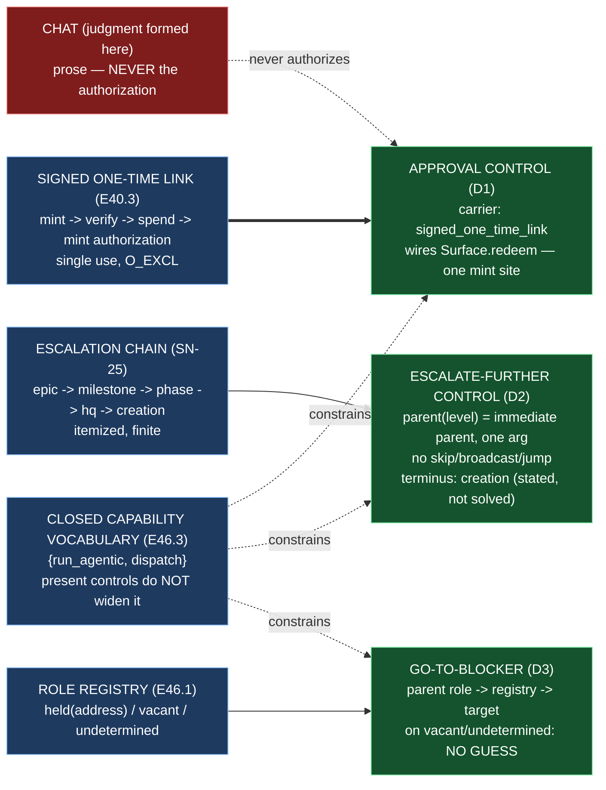

# Delivery Notice: P12-M46-E46.4 — Approval Formed in Chat, Carried by Link; Escalate-Further as One Level

> **The work landed in Drivr, not here.** The E46.4 spec, the M46 milestone spec, and the
> one-level escalation rule (`governance/systems/chat-hierarchy.md`) are cited by path and branch,
> never by version or sha. `merge_details` describe a merge that has not happened and are
> unfillable at delivery time (`P10-GH-4`, restated). Merge authorization follows the M46 Milestone
> Chat's Stage-2 review, and the parent performs the merge (§11.6).

---

## Summary

**The surface's three present controls are built — approval by link, escalation by one level, and
the go-to-blocker affordance — and each is constrained by E46.3's closed capability vocabulary and
consumes E46.1's three-valued registry lookup.**

`drivr/controls` (the deliverable) is a present-controls module beside `drivr/surface`, `modes`,
`capabilities` and `registry`. It is a **separate** `PresentControl` vocabulary — deliberately not
added to E46.3's `Capability` enum, whose closure over `{run_agentic, dispatch}` is what makes
E46.3's rule 3 (no mode→merge-authority) meaningful.

1. **The approval control (D1)** — carrier `signed_one_time_link`; the judgment is formed in chat,
   the authorization is the link's redemption. It **wires** E40.3's `Surface.redeem` (the one
   path to an authorization) rather than re-implementing it. A whole-of-`drivr` AST scan asserts
   exactly one authorization-minting call site, so a second path — a new inbound field, a second
   mint site, a convenience CLI verb — fails by name.
2. **The escalate-further control (D2)** — a pure `parent(level)` advancing exactly one level up the
   SN-25 chain `epic → milestone → phase → hq → creation` (itemized), with **no skip/broadcast/jump**
   path, and the terminus **stated** (creation has no parent; the top-unresolved disposition is not
   this epic's — phase spec Open Item 1, returned to the CFO).
3. **The go-to-blocker affordance (D3)** — resolves the blocker's parent through E46.1's three-valued
   registry lookup; on `held(address)` produces the resolved target, and on `vacant`/`undetermined`
   **refuses to guess** and reports the state (V2d: `undetermined` is not `vacant`).

---

## Verification — layer, time, scope, ref (`P11-GH-2`)

| Axis | Value |
|---|---|
| **Layer** | One layer is built: the **present controls** — the surface's control model. It reads nothing (it is a control module: an enum, a pure `parent` function, and two control classes); it does **not** touch the judgment (`drivr/judgment/`), the scheduler (`drivr/scheduling/`), the board (`drivr/board/`), the modes record (`drivr/modes/`), the registry (`drivr/registry/` — consumed, not touched), the surface (`drivr/surface/` — wired, not touched), E40.3's `links.py`/`store.py`/`authorization.py`/`app.py`, or the completion-signal contract. |
| **Time** | **2026-09-04** |
| **Scope (Drivr — where the work lands)** | **`~/soft-dev/drivr`**, branch **`epic/P12-M46-E46.4`**, branched from **`main` @ `99392ed`** (G2 — the spec pinned `4872107`; Drivr moved when E46.1, E46.2 and E46.3 merged). Added: `drivr/controls/__init__.py`, `drivr/controls/model.py`, `tests/test_controls.py`. **Not changed:** `drivr/surface/*` (E40.3's), `drivr/judgment/*`, `drivr/scheduling/*`, `drivr/board/*`, `drivr/modes/*`, `drivr/registry/*`, `drivr/capabilities/*`, `docs/m46-completion-signal-contract.md`, the `epic_qa` lane. |
| **Scope (governance repo)** | **`ai-project-system`**, branch **`epic/P12-M46-E46.4`**, branched from **`milestone/M46` @ `6abbc94`**. Adds this Delivery Notice only. The E46.4 spec (`5b697a6`) and the M46 milestone spec (`e824a70`) already carry the epic; nothing in them needed amendment. `chat-hierarchy.md` (`9363b5a`) is an input, not touched. |
| **Repo for `git log`** | Drivr HEAD at delivery: **`98ff15b`** (`feat(E46.4): approval by signed one-time link, escalation one level, go-to-blocker`), on `epic/P12-M46-E46.4`, on top of `99392ed` (`main`). |
| **Suite (Drivr, operative)** | `python3 -m pytest -q` from the Drivr root. **Baseline at the branch point: 527 passed / 0 failed** (G2 re-measure at `99392ed`, post-E46.1+E46.2+E46.3; the planning baseline was 471 at `4872107`, but Drivr moved). **After: 549 passed / 0 failed** (527 + 22 new in `tests/test_controls.py`). **No skips introduced.** The `ai-project-system` suite does not cover Drivr and is not a measurement of anything this epic produced. |

**P11-GH-2 note — a deviation, stated (and on the record via `P12__carry-forward-note__drivr-no-remote-recoverability.md`).** This Drivr has **no configured remote** (`git remote -v` is empty), per the carry-forward note (M45, Phase-owned open question). The Drivr commit (`98ff15b` on `epic/P12-M46-E46.4`) exists **locally only** — no push could be made or push-verified, and **no GitHub PR for the Drivr change can be opened**. The committed content is the source of truth; the parent's merge of `epic/P12-M46-E46.4` → `main` is what completes BC9, and I say so rather than pretending a push happened. This matches the E46.1/E46.2/E46.3 deliveries' handling.

---

## Model verification (`advisory` — stated plainly, per chat-hierarchy.md)

This instance is **manual**; `model_verification: advisory` (`.ai-project.yml`). The harness
reports my model as **`opencode-go/deepseek-v4-flash-vision-exp`**. `.ai-project.yml`'s
`models.epic_manual` is **`remote:deepseek-v4-flash`**. Per the `.ai-project.yml` route-ambiguity
note, `remote:<name>` records the model, not the route; `deepseek-v4-flash` resolves via the
`opencode-go` route. My harness route (`opencode-go`) and model family (`deepseek-v4-flash`) both
match; the `-vision-exp` suffix is a variant of the same family. **No material mismatch** — both
present and consistent; proceeding under `advisory`.

---

## G1 — the non-uniform elements, quoted verbatim (not re-derived)

- **The one-level rule and the immediate-parent amendment** (`governance/systems/chat-hierarchy.md`):
  *"The handback goes to the blocked instance's **immediate parent, and nowhere else.**"*; *"It does
  **not** go to 'a human.' An instance has no way to identify a human and no standing to select one;
  a rule written that way would be a rule no instance could execute. (HQ Ruling on SN-25, Decision 1,
  amending SN-25's own first framing, which read 'summon a human.')"*; *"Each hop travels up exactly
  one level, and the chain Epic → Milestone → Phase → HQ → Creation is finite."*; PSG §13D (quoted in
  the same section): *"Upward communication is 1-to-1; escalations travel up one level; no level
  skips its parent to reach a grandparent (SN-12b, 2026-06-25)"*; and *"No instance names a target
  above its parent."*
- **E46.1's three-valued lookup** (`drivr/registry/registry.py`): *"`lookup(role)` returns one of
  exactly three states: `held(address)` / `vacant` / `undetermined`. `undetermined` is returned when
  the registry **could not be read**, and it is **distinct from `vacant`** — a consumer can never read
  'could not read the registry' as 'nobody holds it'."* (the V2d pattern — *empty means UNDETERMINED
  and escalates*).

---

## Deliverables

### D1 — The approval control: carrier `signed_one_time_link`; no chat-reply path authorizes ✅

`drivr/controls/model.py` (`ApprovalControl`, `Carrier`, `APPROVAL_CARRIER`). The control vocabulary
names the entry `approval` with carrier `signed_one_time_link`. `ApprovalControl` **wires** E40.3's
`Surface`: `mint_link` delegates to `Surface.mint_link`; `authorize` delegates to `Surface.redeem`
(the only path to an authorization — verify → spend → mint). **No chat-reply path authorizes**: a
request whose body carries no `t` never reaches an authorization; `authorize(gate, "decision=approve")`
raises `Rejected` before any gate logic runs. The control adds no second minting call site, no new
inbound field, no convenience CLI verb. `ACCEPTED_FIELDS` remains `{"t"}` (pinned).

**Guard:** `test_exactly_one_place_in_all_of_drivr_mints_an_authorization` — a whole-of-`drivr`
AST scan asserting exactly one `authorizations.mint` call site, in `Surface.redeem` (`surface/app.py`).
This is the **control-level assertion** — the delta over E40.3's surface-only inventory, so the new
`drivr/controls/` module cannot smuggle in a second authorization path.

### D2 — The escalate-further control: one level up, terminus stated, no skip/broadcast/jump ✅

`drivr/controls/model.py` (`ESCALATION_CHAIN`, `_PARENT`, `parent`, `escalate_further`, `Escalation`,
`TerminusReached`). The chain is **itemized**: `epic → milestone → phase → hq → creation`. `parent(level)`
is a pure one-level function — **a mapping, not a function with a jump count** — so there is no
`parent(level, n=2)` and no `escalate_to_top`. `escalate_further(level)` advances exactly one level
and, at `creation` (the terminus), **does not fire** (`did_fire=False`, `parent=None`) — the terminus
is **stated**, and the top-unresolved disposition is explicitly not this epic's (phase spec Open Item
1, returned to the CFO; `TerminusReached`'s message carries that).

**Guard:** `test_no_skip_broadcast_or_jump_path_exists` — `parent`'s signature is exactly
`["level"]` (no `n`/jump count), and an AST scan of `drivr/controls/` finds no `escalate_to_top` /
`grandparent` / `skip` / `jump` / `broadcast` shape.

### D3 — The go-to-blocker affordance: resolves through the registry, no guess ✅

`drivr/controls/model.py` (`GoToBlocker`, `BlockedEntity`, `BlockerResolution`, `BlockerState`,
`parent_role`). Given a blocked entity at level `L`, the control determines the parent level
`parent(L)`, derives the parent's registry role (`hq`, `phase`, `milestone/<n>`, `epic/<id>`), queries
E46.1's `RoleRegistry.lookup`, and:
- on `held(address)` → produces the resolved target (the session address, from the registry and
  nothing else);
- on `vacant` **or** `undetermined` → **refuses to guess** and reports the state (`target=None`),
  `undetermined` kept distinct from `vacant`;
- at the terminus (blocker at `hq` → parent `creation`, which has no registry role) → reports the
  terminus (`target=None`, no guess).

**Guard:** `test_go_to_blocker_refuses_to_guess_on_vacant`, `..._on_undetermined`,
`..._does_not_hardcode_an_address`, `..._states_the_terminus_at_hq`, and the shape test
`test_a_held_resolution_must_carry_a_target`.

---

## Design decisions delegated — decided, documented, proceeded

| # | Decision | Outcome |
|---|---|---|
| 1 | **The control model's shape** | A new package `drivr/controls/` beside `drivr/surface/`, `modes`, `capabilities`, `registry`. A **separate** `PresentControl` vocabulary (`approval`, `escalate-further`, `go-to-blocker`), **not** added to E46.3's `Capability` enum. Reuses E46.3's `GovernanceLevel` (the level axis) and inherits the construction-surface discipline — nothing here constructs an agentic control, a dispatch control, or a mode→authority mapping (E46.3's `ast`-scan sweeps all of `drivr/`, so the controls module is on the hook for the same rule it does not re-open). |
| 2 | **The go-to-blocker's resolved target** | The **session address** from the registry's `held` result (`LookupState.HELD`). Derived from the registry and nothing else; on `vacant`/`undetermined`/terminus, `target=None`. |
| 3 | **The escalate-further control's failure shape** | **Stated-not-fired**, with a defined refusal at the primitive: `parent(creation)` raises `TerminusReached` (whose message states the terminus and the returned-to-the-CFO disposition); `escalate_further(creation)` returns an `Escalation` with `terminus=True`, `parent=None`, `did_fire=False`. The terminus is stated either way. |
| 4 | **How much of the approval machinery is *wired* vs *referenced*** | **Wired.** `ApprovalControl` delegates to `Surface.mint_link`/`redeem`; it does **not** re-implement the link, the store, or the authorization. No second authorization path exists, and the whole-of-`drivr` AST scan pins the single mint site. |

---

## Definition of Done — every item

- [x] An approval cannot be given by a chat reply alone — the only authorization path is the signed one-time link (`ApprovalControl.authorize` → `Surface.redeem`; `ACCEPTED_FIELDS == {"t"}`; whole-of-`drivr` scan asserts one mint site)
- [x] Escalation moves exactly one level; the terminus is stated (`parent` one-level; `escalate_further(creation)` does not fire; `TerminusReached` states the terminus)
- [x] Go-to-blocker resolves through the registry, not a guess (`GoToBlocker.resolve`; refuses on `vacant`/`undetermined`; no hardcoded address)
- [x] Each of the three controls has a test falsified in both directions (see the falsification runs below)
- [x] The escalation chain is itemized (never a count — `ESCALATION_CHAIN` five members); the terminus (`creation`) is named
- [x] Every claim states the layer, repository, ref and date (`P11-GH-2` + the milestone Hard Constraint — see the table above)
- [x] The controls and their tests are on **Drivr `main`** — **not yet met by me, and cannot be met by me**: §11.6 makes the parent (the M46 Milestone Chat) the party that merges `epic/P12-M46-E46.4` → `main`. The code is committed on the epic branch (`98ff15b`) and ready for that merge. Stated as an open item, not marked done on the branch (the M43/M45 defect was exactly *finishing on the epic branch*).
- [x] Drivr suite green at **549** with the invocation (`python3 -m pytest -q`) and the ref (branch point `99392ed`; delivery `98ff15b`) stated — baseline 527 at the branch point (G2), 471 at `4872107`
- [x] Delivery Notice committed; branch `epic/P12-M46-E46.4` opened for PR to `milestone/M46`

## Acceptance Criteria

- [x] An approval cannot be given by a chat reply alone
- [x] Escalation moves exactly one level; the terminus is stated
- [x] Go-to-blocker resolves through the registry, not a guess

---

## Falsification in both directions (Hard Constraint 2) — the runs

Each guard was **shown to fail** by re-introducing the forbidden state, then **reverted** (the
`test_capabilities.py` precedent: this file asserts the guard holds; the runs are recorded here):

| Guard | Re-added forbidden state | Red test(s) | Reverted |
|---|---|---|---|
| D1 — no second authorization path | `def _smuggled_mint(surface, payload): return surface.authorizations.mint(payload)` in `drivr/controls/model.py` | `test_exactly_one_place_in_all_of_drivr_mints_an_authorization` (found `[controls/model.py _smuggled_mint, surface/app.py redeem]`) | ✅ |
| D2 — no skip path | `def escalate_to_top(level): ...` in `drivr/controls/model.py` | `test_no_skip_broadcast_or_jump_path_exists` (`model.py:475 escalate_to_top`) | ✅ |
| D2 — no jump count | `def parent(level, n: int = 1)` | `test_no_skip_broadcast_or_jump_path_exists` (`parameters != ["level"]`) | ✅ |
| D2 — terminus not fired | `escalate_further(creation)` returns `parent=HQ, terminus=False` | `test_escalate_further_does_not_fire_at_the_terminus` (got `terminus=False`) | ✅ |
| D3 — no guess on `vacant` | `resolve` returns `state=HELD, target="session-guessed"` on vacant | `test_go_to_blocker_refuses_to_guess_on_vacant`, `test_go_to_blocker_does_not_hardcode_an_address` | ✅ |
| D3 — `undetermined` is not `vacant` | `resolve` maps `UNDETERMINED` → `VACANT` | `test_go_to_blocker_refuses_to_guess_on_undetermined` (got `VACANT`) | ✅ |

After each revert, `tests/test_controls.py` returned **22 passed**, and the full Drivr suite returned
**549 passed / 0 failed**.

---

## Visual Bindings

**Visual binding**
- **Link:** (inline — Structural diagram; no hosted link needed per AOG §17.3/§17.5)
- **What:** diagram
- **Level:** Epic
- **State:** proposed

- **Description (implemented):** E46.4 builds the surface's present controls. Approval is formed in
  chat but carried only by the signed one-time link (E40.3's machinery wired as the approval control;
  a chat reply never authorizes). Escalate-further advances exactly one level up the SN-25 chain
  (epic → milestone → phase → hq → creation), never skipping, broadcasting, or jumping to the human,
  with the terminus stated. Go-to-blocker resolves the blocker's parent role through E46.1's
  three-valued registry lookup and refuses to guess on `vacant`/`undetermined`. The present controls
  are a separate `PresentControl` vocabulary — they hang off E46.3's closed capability vocabulary
  (reusing its level axis) without widening it into the forbidden states. Proposed-track Structural
  diagram (AOG §17.3/§17.6), Mermaid, no ComfyUI.

---

## Status

⏸️ **Stopped. Awaiting Milestone Chat review and authorization. Not merged.** Per this epic's Starter
and §11.6, merge authorization for the Delivery Notice PR normally follows the Milestone Chat's
Stage-2 review, and the parent (the M46 Milestone Chat) performs the merge. This delivery is the
**first attempt** — the rework limit (3 attempts plus any written `+1`, PSG §11.6 / the SN-36/37 `+1`
amendment) has not been touched.

**Deviation, stated:** the Drivr working copy has **no configured remote**, so the Drivr commit
(`98ff15b` on `epic/P12-M46-E46.4`) exists locally but **was not pushed or push-verified**, and no
GitHub PR for the Drivr change exists. The parent's merge of `epic/P12-M46-E46.4` → `main` is a
**local** merge, and it is what completes BC9. This matches the M45 carry-forward note and the
E46.1/E46.2/E46.3 deliveries' handling; I flag it so the Milestone Chat can resolve whether the Drivr
remote is expected to be configured before acceptance. On the `ai-project-system` side, the Delivery
Notice is committed to `epic/P12-M46-E46.4` (branched from `milestone/M46` @ `6abbc94`) and a PR to
`milestone/M46` is the appropriate next step, which I will open.

Epic E46.4 execution complete. Epic Delivery Notice produced. Awaiting Milestone Chat review and
authorization.
