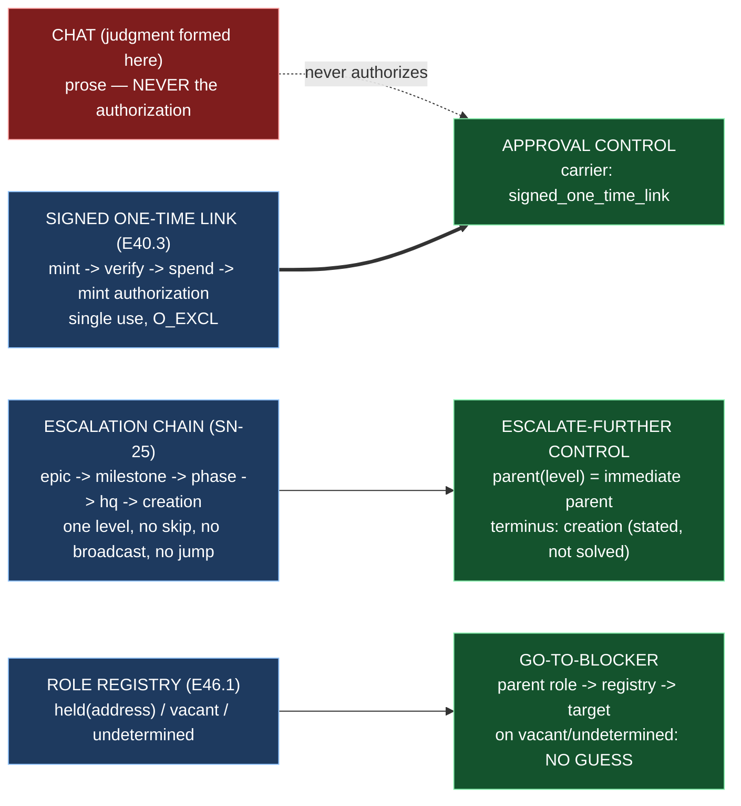

# Epic E46.4 — Approval Formed in Chat, Carried by Link; Escalate-Further as One Level

## Context

**How does a human authorize, and how far does an escalation travel?**

E46.4 builds the surface's *present* controls — the counterpart to E46.3's *absences*. E46.3
guaranteed what the surface cannot construct; E46.4 builds what it can: the approval control
(authorization), the escalate-further control (how far), and the go-to-blocker affordance (where
attention belongs). All three are constrained by E46.3's closed capability vocabulary, and the
third consumes E46.1's role registry — which is why E46.1 runs first and E46.4's go-to-blocker is
the milestone's only cross-epic dependency.

**The approval half rests on a working precedent, not a new design.** Drivr already holds the
signed one-time-link machinery (E40.3): `drivr/surface/links.py` (HMAC-SHA256, expiry, gate
binding), `drivr/surface/store.py` (`O_CREAT|O_EXCL` single use), `drivr/surface/authorization.py`
(the authorization minted in-app at redemption), and `drivr/surface/app.py` (loopback, two routes,
the single inbound field `t`). `tests/test_surface_no_chat_reply.py` already *demonstrates* that a
chat reply does not authorize — by inventory, not assurance: the inbound field is exactly `{t}`,
one minting call site (`Surface.redeem`), verify→spend→mint in that order, no chat-client import
anywhere. **E46.4's approval work is to make that machinery the approval *control* — a named,
constructible surface action whose only carrier is the link — not to re-derive it.**

**The escalation half has no such precedent in Drivr, and its shape is fixed by SN-25.** The
chain is finite and one-way: **Epic → Milestone → Phase → HQ → Creation** (`chat-hierarchy.md`,
"Routing: exactly one level"). The destination of an escalation is the **immediate parent, and
nowhere else** — SN-25's own first framing read *"summon a human"*; the HQ Ruling on SN-25 amended
it to the immediate parent. PSG §13D (Mandatory): *upward communication is 1-to-1; escalations
travel up one level; no level skips its parent to reach a grandparent.* Three consequences bind
the control: it advances **one** level; it never **skips**; it never **broadcasts**; and it never
**jumps to the human** — the destination is the parent, which is a node in the governance graph,
not a person.

**The terminus, stated not solved.** The top of the chain is Creation (Level 0). When a blocker
reaches the CFO and he cannot resolve it, nothing is above him — *"the corpus has no name for that
state"* (phase spec Open Item 1, **returned to the CFO**, not this epic's). E46.4's escalate-further
must **state** the terminus (Creation has no parent; the control does not fire there), and must not
pretend to solve the top-unresolved problem by inventing a disposition.

**The go-to-blocker consumes E46.1's three-valued lookup.** E46.1's registry answers *"which
address holds role X?"* with `held(address)` / `vacant` / `undetermined` — where `undetermined`
means *"could not read the registry"* and is **distinct from** `vacant` (*"no holder"*), the V2d
pattern (*empty means UNDETERMINED and escalates*). The go-to-blocker's acceptance criterion —
*"resolves through the registry, not a guess"* — means exactly: on `held`, produce the resolved
target; on `vacant` **or** `undetermined`, refuse to guess and report the state, rather than
routing to a wrong address.

**Scope boundary this epic must not cross.** "Escalation opens a chat by itself" (P12.6) presupposes
*which chat is which* — answered by E46.1 — but the *delivery* of a message to the resolved session
travels over the live inter-chat channel, whose wider design is **`P12-GH-4`, filed unowned**. E46.4
resolves and produces the affordance (the target); it does **not** build the inter-chat messaging
transport. Routing content to the resolved address is the channel's problem, not this epic's.

## Problem Statement

**Authorization and escalation are the two places a human's intent becomes a governed act — and
both have a failure mode where the wrong thing authorizes, or the wrong distance is travelled.**

1. **A chat reply as authorization.** Agents can write into chats, so a reply-authorizes design
   lets an agent author its own approval and close the loop on itself. The threat model is not
   ceremony; it is that the chat is writable by the very thing being governed. The link is the
   carrier precisely because it is minted in-app, signed, and single-use — none of which a chat
   reply can be.
2. **An escalation that travels too far.** A control that skips to the top (or to "the human")
   collapses the chain: the immediate parent — the level that holds Stage-2 authority over the
   blocker — is bypassed, and the block arrives at a level that has never seen the work. A
   broadcast is worse: it asks every level to act on one blocker, which is the concurrency the
   whole framework exists to serialize.
3. **A go-to-blocker that guesses.** If the affordance routes to a hardcoded name, a best-guess
   address, or reads "could not read the registry" as "no holder", it points the human at the
   wrong session — which is worse than pointing nowhere, because it *looks* resolved.

## Goals

By the end of this Epic, the system must:

1. **Make approval a control carried only by the signed one-time link** — the judgment is formed
   in chat; the authorization is the link's redemption; no chat reply authorizes.
2. **Make escalate-further a one-level control** — advancing exactly one level to the immediate
   parent, never skipping, never broadcasting, never jumping to the human, with the terminus
   stated.
3. **Make go-to-blocker resolve through the registry** — the parent's role → E46.1's three-valued
   lookup → a resolved target, never a guess.

## Non-Goals

This Epic explicitly does **not** aim to:

- **Build the inter-chat messaging transport.** The go-to-blocker and escalate-further *resolve*
  a target; delivering content to it is `P12-GH-4`'s channel design, filed unowned.
- **Solve the escalation-terminus problem.** What happens when a blocker reaches the CFO and he
  cannot resolve it is phase spec Open Item 1, returned to the CFO. This epic *states* the
  terminus; it does not invent the disposition.
- **Re-derive the signed one-time-link machinery.** `drivr/surface/` is E40.3's, inherited and
  wired as the approval control, not rebuilt.
- **Add controls E46.3 made unrepresentable.** Agentic at Creation/HQ, Phase/Milestone dispatch,
  and mode→merge-authority stay absent (E46.3's). E46.4 adds only the present controls.
- **Build the board** (E46.2) or the registry (E46.1).

## Scope of Work

### 1. The approval control (D1)

**An approval control whose carrier is exclusively the signed one-time link**, wiring E40.3's
machinery into the surface's control model as a named, constructible action.

**Must include:**
- The control vocabulary entry `approval`, with its carrier named `signed_one_time_link` — the
  chat is where the judgment is formed; the link is what carries the key.
- The demonstration that **no chat-reply path authorizes** — the control's only authorization path
  is link redemption, and there is no field, route, or call site through which a chat reply
  reaches an authorization. The existing `test_surface_no_chat_reply.py` inventory is the base;
  the control-level assertion is the delta.
- A test that **fails if a chat-reply path is added** (a second minting call site, a new inbound
  field, a convenience CLI verb) — falsified, not asserted.

### 2. The escalate-further control (D2)

**A one-level escalation control** advancing to the immediate parent.

**Must include:**
- The chain, itemized: `epic → milestone → phase → hq → creation` — a pure `parent(level)`
  function, one level up, with **no skip path** (no API that takes a jump count or a target above
  the parent).
- The terminus, stated: `creation` has no parent; the control does not fire there, and the
  top-unresolved disposition is explicitly **not** this epic's (phase spec Open Item 1).
- A test that fails if a skip/broadcast/jump path is added (e.g., `escalate_to_top`, or a
  `parent(level, n=2)`).

### 3. The go-to-blocker affordance (D3)

**An affordance that resolves the blocker's parent through the registry**, consuming E46.1's
three-valued lookup.

**Must include:**
- Given a blocked entity at level `L`, determine the parent level `parent(L)`, query the registry
  for that role, and: on `held(address)` produce the resolved target; on `vacant` or `undetermined`
  **refuse to guess** and report the state (the V2d pattern — `undetermined` is not `vacant`).
- A test that fails if the go-to-blocker guesses (routes on `vacant`/`undetermined`, reads
  `undetermined` as `vacant`, or hardcodes an address).

## Deliverables

- [ ] **D1** — The approval control: carrier `signed_one_time_link`; no chat-reply path authorizes
- [ ] **D2** — The escalate-further control: one level up, terminus stated, no skip/broadcast/jump
- [ ] **D3** — The go-to-blocker affordance: resolves through the registry, no guess
- [ ] Structural diagram (Mermaid, inline, **no ComfyUI**)
- [ ] **Epic Delivery Notice**

## Binding Constraints

Settled above this epic — **not re-decidable here** (milestone spec §Binding Constraints):

1. **BC8 — Escalation terminates one level up** (SN-25). The escalate-further control is
   one-level, not a broadcast.
2. **P11 spine — inbound approval is a signed one-time link, never a chat reply.** The threat
   model is agents writing into chats; the link is the carrier.
3. **BC7 — Mode is not authority** — carried into the approval/escalation controls: an escalation's
   resolution *carries authority* (chat-hierarchy.md), and it does not widen what the parent may
   authorize.
4. **BC9 — A Drivr deliverable measured only on an epic branch is not done.**

## Hard Constraint (binding — carried to every Epic)

> **A surface that *validates* a governance rule can be argued with; a surface that cannot
> *represent* the rule's violation has nothing to argue about.**

1. **Itemize, never count.** The three controls are named and itemized; the escalation chain is a
   list, not "five levels".
2. **Falsify in both directions.** A guard that has never failed has not been shown to work.
3. **Record before improving.** A defect found is recorded before it is fixed.
4. **Re-measure the harness claim you rest on, at the moment you rest on it.**
5. **Finish on `main`.** A Drivr deliverable measured only on an epic branch is **not done**
   (BC9).

## Design Decisions Delegated — decide, document, proceed

1. **The control model's shape** — where the present controls live (a new module beside
   `drivr/surface/`), and how they hang off E46.3's closed capability vocabulary without widening
   it into the forbidden states.
2. **The go-to-blocker's resolved target** — what the affordance *is* (a session address, a
   minted link, an identifier) — with the constraint that it is derived from the registry's
   `held` result and nothing else.
3. **The escalate-further control's failure shape** — what the control does when the terminus is
   reached (stated-not-fired vs. a defined refusal), with the terminus stated either way.
4. **How much of the approval machinery is *wired* vs *referenced*** — the control model names the
   link as its carrier; whether it wraps `Surface.mint_link`/`redeem` or cites them is yours, so
   long as no second authorization path exists.

**Escalate instead of deciding:** anything that would widen the escalation beyond one level; any
approval path other than the signed one-time link; any go-to-blocker that guesses on
`vacant`/`undetermined`; any attempt to solve the escalation-terminus problem (returned to the CFO).

## Definition of Done

Epic E46.4 is complete when:

- [ ] An approval cannot be given by a chat reply alone — the only authorization path is the
      signed one-time link
- [ ] Escalation moves exactly one level; the terminus is stated
- [ ] Go-to-blocker resolves through the registry, not a guess
- [ ] Each of the three controls has a test falsified in both directions
- [ ] The escalation chain is itemized (never a count); the terminus (Creation) is named
- [ ] Every claim states the layer, repository, ref and date (`P11-GH-2` + the milestone Hard Constraint)
- [ ] The controls and their tests are on **Drivr `main`**, not only on an epic branch (BC9)
- [ ] Drivr suite green at **471** plus this epic's changes, with the invocation and the ref stated
- [ ] Delivery Notice committed; PR opened from the Drivr epic branch to Drivr `main`

## Acceptance Criteria

- [ ] An approval cannot be given by a chat reply alone
- [ ] Escalation moves exactly one level; the terminus is stated
- [ ] Go-to-blocker resolves through the registry, not a guess

## Technical Constraints

**Repository:** the work lands in **Drivr** (`~/soft-dev/drivr`, `main` at `4872107`), not in
`ai-project-system`. This repository's suite does not cover Drivr, and *"suite green here"* is
not verification.
**In scope:** a new controls module under `drivr/` (beside `surface`, `modes`), its tests. The
approval control **references** `drivr/surface/`; it does not re-implement the link, the store, or
the authorization. **Do not touch:** `drivr/surface/links.py`, `store.py`, `authorization.py`,
`app.py` (E40.3's) unless a defect is found — and a found defect is **recorded before it is fixed**
(Hard Constraint 3), then escalated. `governance/systems/chat-hierarchy.md` is an input.
**Invocation:** `python3 -m pytest -q` from the Drivr root; `PYTHONPATH=. pytest -q` in this
repository if any governance edit lands.
**Baselines:** Drivr **471** at `main` `4872107` (re-measured 2026-09-04, G2);
`ai-project-system` **767 passed** this run (environment-dependent — `766+1 skipped` / `767` /
`766 passed + 1 failed` are the same suite; the variance is the live-ComfyUI integration test).

## Dependencies

**Internal**
- **E46.1 (prerequisite)** — the role registry and its three-valued lookup, consumed by the
  go-to-blocker. **Go-to-blocker depends on E46.1's registry**, per the milestone's binding
  sequencing.
- **E46.3** — the closed capability vocabulary the present controls hang off (parallel-safe; the
  controls must not re-open E46.3's absences).

**External**
- **Drivr at `~/soft-dev/drivr`, `main` `4872107`** — re-measured for this spec; re-measure again
  at the branch point (G2).
- **`governance/systems/chat-hierarchy.md`** (in `ai-project-system`) — SN-25's one-level rule and
  the immediate-parent amendment.

**Blockers**
- None at planning. The approval machinery exists; escalation and go-to-blocker are greenfield.

## Timeline

**Estimated Effort:** 1 session — the escalate-further and go-to-blocker controls are bounded; the
approval control is wiring, not construction.
**Target Completion:** after E46.1 (go-to-blocker depends on the registry).
**Actual Completion:** In progress.

## Execution Notes

**Order:**
1. Re-read `chat-hierarchy.md`'s one-level rule and re-measure `drivr/surface/` at your branch
   point (G2).
2. Define the control model, constrained by E46.3's vocabulary (D1's frame).
3. Wire the approval control — carrier `signed_one_time_link`, no chat-reply path (D1).
4. Build the escalate-further control — one level, terminus stated (D2).
5. Build the go-to-blocker affordance — registry resolution, no guess (D3).
6. Run the Drivr suite; state the invocation and the ref.

**Traps this project has already paid for:**

- **Re-deriving the link machinery.** E40.3 built it and proved "no chat reply authorizes". E46.4
  wires it as a control; re-implementing it would create a second source of truth about
  authorization.
- **Escalating to "the human".** SN-25's amendment replaced *"summon a human"* with *"the
  immediate parent"*. A control that jumps to the human is the pre-amendment framing, restored.
- **A go-to-blocker that reads `undetermined` as `vacant`.** E46.1's lookup is three-valued; a
  resolver that collapses it to two will route to a wrong address on `undetermined` — the exact
  guess the acceptance criterion forbids.
- **Building the messaging transport.** `P12-GH-4`'s channel is unowned; E46.4 resolves, it does
  not deliver.
- **Two repositories, two pushes, two `origin`s** — and `git status` before every commit.
- **Finishing on the epic branch only** (BC9).

## Related Documents

- [M46 Milestone Spec](P12-M46__milestone-spec.md) — E46.4 Epic Detail, Binding Constraints, Hard
  Constraint
- [M46 Milestone Execution Chat Starter](P12-M46__milestone-execution-chat-starter.md)
- [P12 Phase Spec](P12__phase-spec.md) — §P12.6 (M46), success criterion 17, Open Item 1
- [chat-hierarchy.md](../../../governance/systems/chat-hierarchy.md) — SN-25's one-level rule, the
  immediate-parent amendment, "Mode is not authority"
- [E46.1 Spec](P12-M46-E46.1__spec__role-registry-and-exclusivity.md) — the three-valued registry
  lookup the go-to-blocker consumes
- [E46.3 Spec](P12-M46-E46.3__spec__three-governance-rules-unrepresentable.md) — the closed
  capability vocabulary the present controls hang off
- Drivr `drivr/surface/links.py`, `store.py`, `authorization.py`, `app.py` and
  `tests/test_surface_no_chat_reply.py` at `main` `4872107`
- [PROJECT-SYSTEM-GUIDELINES.md](../../../governance/PROJECT-SYSTEM-GUIDELINES.md)
- [AI-OPERATING-GUIDELINES.md](../../../governance/AI-OPERATING-GUIDELINES.md)

## Visual Bindings

**Visual binding**
- **Link:** (inline — Structural diagram; no hosted link needed per AOG §17.3/§17.5)
- **What:** diagram
- **Level:** Epic
- **State:** proposed

- **Description:** E46.4 builds the surface's present controls. Approval is formed in chat but
  carried only by the signed one-time link (E40.3's machinery wired as the approval control; a
  chat reply never authorizes). Escalate-further advances exactly one level up the SN-25 chain
  (epic → milestone → phase → hq → creation), never skipping, broadcasting, or jumping to the
  human, with the terminus stated. Go-to-blocker resolves the blocker's parent role through
  E46.1's three-valued registry lookup and refuses to guess on `vacant`/`undetermined`. Proposed-track
  Structural diagram (AOG §17.3/§17.6), Mermaid, no ComfyUI.

## Notes

- **The approval half is the smallest and the most load-bearing.** E40.3 already proved no chat
  reply authorizes, by inventory rather than assertion. E46.4's risk is not under-building it but
  *re*-building it: a second authorization path — a second minting call site, a new inbound field,
  a convenience CLI verb — is exactly what `test_surface_no_chat_reply.py` is built to fail on. The
  approval control must wire, not re-implement.

- **Escalate-further and go-to-blocker are two controls, not one.** Escalate-further is the
  *human's* explicit act of advancing the chain one level; go-to-blocker is the *affordance* that
  resolves where the blocker's parent is. They share the parent-resolution, but they are different
  acts with different acceptance criteria, and the spec keeps them separate so a reader cannot
  collapse them.

- **"Not a guess" is the V2d pattern a third time.** E46.1's lookup is three-valued because
  "could not read the registry" must not read as "no holder". The go-to-blocker is the first
  consumer of that lookup, and it is the place the distinction matters: routing to a wrong
  address on `undetermined` is the failure the acceptance criterion exists to prevent.

## Changelog

| Version | Date | Change |
|---|---|---|
| 1.0.0 | 2026-09-04 | Initial E46.4 spec, from the M46 milestone spec v1.0.0 (E46.4 Epic Detail, Binding Constraints, Hard Constraint), SN-25's one-level rule (`chat-hierarchy.md`), and Drivr source re-measured at `main` `4872107` (G2; Drivr suite 471 passed, `ai-project-system` 767 passed, both 2026-09-04). Scopes the approval control (carrier `signed_one_time_link`, no chat-reply path, wiring E40.3's machinery rather than re-deriving it), the escalate-further control (one level, terminus stated, no skip/broadcast/jump), and the go-to-blocker affordance (resolves through E46.1's three-valued registry, no guess on `vacant`/`undetermined`). Excludes the inter-chat messaging transport (`P12-GH-4`) and the escalation-terminus problem (phase spec Open Item 1, returned to the CFO). No scope, ordering, gate or acceptance-criterion change from the milestone spec. |
