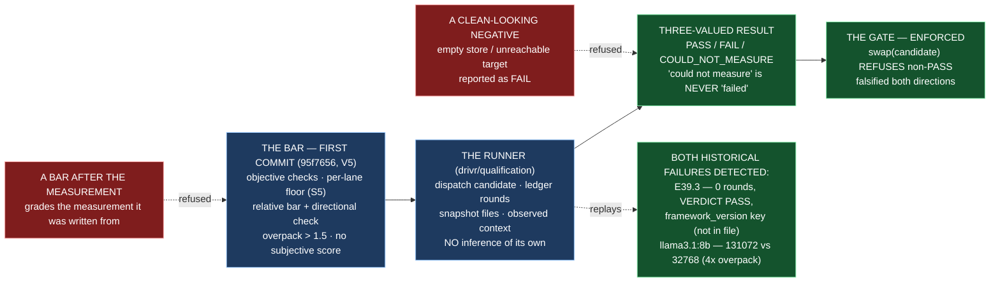

# Delivery Notice: P12-M46-E46.5 — SN-37's Qualification Gate, Bar Committed First

> **The work landed in Drivr, not here.** The E46.5 spec, the M46 milestone spec, the phase spec
> §P12.6 (SN-37) and its v1.2.0 criterion, E45.1's bar, E41.2's spec, and E41.1's record are cited
> by path and branch, never by version or sha. `merge_details` describe a merge that has not
> happened and are unfillable at delivery time (`P10-GH-4`, restated). Merge authorization follows
> the M46 Milestone Chat's Stage-2 review, and the parent performs the merge (§11.6).

---

## Summary

**E46.5 formalizes SN-37's qualification gate with the bar committed first.** The bar — objective
checks, the per-lane floor as ruled (S5), the relative bar with a directional check, no subjective
score — is the **first commit** on `epic/P12-M46-E46.5`. Drivr is the runner: run the suite, gate
the swap, record the result, no inference. The result is three-valued (`PASS` / `FAIL` /
`COULD_NOT_MEASURE`), and a non-passed model cannot be swapped in — enforced, not documented. Both
historical failures — E39.3's successful nothing and the `llama3.1:8b` overpack — are detected,
each named and cited.

The instrument (`bin/successful-nothing-instrument`) is E41.2's; the gate *uses* its checks, it
does not re-implement them silently.

1. **D1 — the bar, first commit.** `drivr/qualification/bar.md`, committed as `95f7656`, the first
   and only commit from the Drivr branch point `4767cf3` — checkable by `git log`.
2. **D2 — the qualification gate.** `drivr/qualification/` (a new package beside `execution`,
   `scheduling`, `surface`, `judgment`): the three-valued `QualificationResult` enum, the runner,
   the enforced no-swap refusal, the overpack check, the per-lane floor, and the relative bar.
3. **D3 — both historical failures detected.** E39.3 (zero tool rounds + `VERDICT: PASS` + the
   `framework_version` claim that does not resolve) and the `llama3.1:8b` 4× overpack (declared
   131,072 vs observed 32,768) — each named and cited, with the counts shown, and caught by
   **different mechanisms** (counts vs context; E41.2 S4).

---

## Verification — layer, time, scope, ref (`P11-GH-2`)

| Axis | Value |
|---|---|
| **Layer** | One layer is built: the **qualification gate** — the model-qualification surface. It reads run evidence (the ledger, the snapshot diff, the observed context) and the bar; it does **not** touch the judgment (`drivr/judgment/`), the scheduler (`drivr/scheduling/`), the board (`drivr/board/`), the modes record (`drivr/modes/`), the registry (`drivr/registry/`), the surface (`drivr/surface/`), the controls (`drivr/controls/`), or `docs/m46-completion-signal-contract.md`. |
| **Time** | **2026-09-04** |
| **Scope (Drivr — where the work lands)** | **`~/soft-dev/drivr`** (worktree `/tmp/opencode/drivr-e465`), branch **`epic/P12-M46-E46.5`**, branched from **`main` @ `4767cf3`** (G2 — the spec pinned `4872107`; Drivr moved through E46.1–E46.4). Added: `drivr/qualification/bar.md`, `drivr/qualification/__init__.py`, `drivr/qualification/model.py`, `tests/test_qualification.py`. **Not changed:** `drivr/judgment/*`, `drivr/scheduling/*`, `drivr/execution/*`, `drivr/board/*`, `drivr/modes/*`, `drivr/registry/*`, `drivr/capabilities/*`, `drivr/controls/*`, `drivr/surface/*`, `docs/m46-completion-signal-contract.md`, the `epic_qa` tool set, `bin/successful-nothing-instrument`. |
| **Scope (governance repo)** | **`ai-project-system`** (worktree `/tmp/opencode/aps-e465`), branch **`epic/P12-M46-E46.5`**, branched from **`milestone/M46` @ `9c0691f`**. Adds this Delivery Notice only. The E46.5 spec (`4da442c`) and the M46 milestone spec (`e824a70`) already carry the epic; nothing in them needed amendment. |
| **Repo for `git log`** | Drivr HEAD at delivery: **`f33af95`** (`feat(E46.5): the qualification gate…`), on `epic/P12-M46-E46.5`, on top of **`95f7656`** (`docs(E46.5): the qualification bar, committed first (D1)`), on top of **`4767cf3`** (`main`). **`git log 4767cf3..HEAD` is exactly these two commits, the bar first.** |
| **Suite (Drivr, operative)** | `python3 -m pytest -q` from the Drivr root. **Baseline at the branch point: 550 passed / 0 failed** (G2 re-measure at `4767cf3`, post-E46.1–E46.4; the planning baseline was 471 at `4872107`, but Drivr moved). **After: 581 passed / 0 failed / 0 skipped** (550 + 31 new in `tests/test_qualification.py`). **No skips introduced.** The `ai-project-system` suite does not cover Drivr and is not a measurement of anything this epic produced. |

**P11-GH-2 note — a deviation, stated (and on the record via `P12__carry-forward-note__drivr-no-remote-recoverability.md`).** This Drivr has **no configured remote** (`git remote -v` is empty), per the carry-forward note (M45, Phase-owned open question). The Drivr commit (`f33af95` on `epic/P12-M46-E46.5`) exists **locally only** — no push could be made or push-verified, and **no GitHub PR for the Drivr change can be opened**. The committed content is the source of truth; the parent's merge of `epic/P12-M46-E46.5` → `main` is what completes BC9, and I say so rather than pretending a push happened. This matches the E46.1–E46.4 deliveries' handling.

---

## Model verification (`advisory` — stated plainly, per chat-hierarchy.md)

This instance is **manual**; `model_verification: advisory` (`.ai-project.yml`). The harness
reports my model as **`opencode-go/deepseek-v4-flash-vision-exp`**. `.ai-project.yml`'s
`models.epic_manual` is **`remote:deepseek-v4-flash`**. Per the `.ai-project.yml` route-ambiguity
note, `remote:<name>` records the model, not the route; `deepseek-v4-flash` resolves via the
`opencode-go` route. My harness route (`opencode-go`) and model family (`deepseek-v4-flash`) both
match; the `-vision-exp` suffix is a variant of the same family. **No material mismatch** — both
present and consistent; proceeding under `advisory`.

---

## G1 — the non-uniform elements, quoted verbatim (not re-derived)

- **The per-lane floor, as ruled** (`P12-M41-E41.2__check-list-and-floor.md` §2, the S5 ruling):
  *"`epic_dev` — `tool rounds > 0` **AND** `files changed > 0` … `epic_qa` — `tool rounds > 0`
  **AND** `claims_unresolved == 0` … `files changed` **RECORDED, NOT SCORED**."* And the S5
  reasoning (E41.2 spec, the ruling): *"`files changed > 0` on `epic_qa` was **a constant false,
  not a strict bar** — a check with the same answer for every candidate has **zero discriminating
  power**."*
- **The two historical failures' counts**, quoted verbatim. **E39.3** (`qa-transcript.json`):
  `"transcript": []`, `"iterations": 0`, `"status": "completed"`, and the final answer line
  *`26. MET -- read_file('.ai-project.yml') shows framework_version, when present, is a non-empty
  string matching ^v?\d+\.\d+\.\d+$`*, with the metadata `tools_enabled: ["read_file", "list_dir"]`
  (the read-only tools genuinely advertised). **The `llama3.1:8b` overpack** (E41.1 §4.3):
  *"declared 131,072 vs true 32,768, a 4× overpack"* — and the record's own line: *"the overpack
  is not one entry. It is two."*
- **The bar-committed-first form** (E45.1's bar, `da0c66a`): *"It is the first commit on
  `epic/P12-M45-E45.1` so that its precedence over the work is a property of the history, not a
  claim."*

---

## Deliverables

### D1 — The bar, as the first commit on the branch ✅

`drivr/qualification/bar.md` (bar v1.0.0, floor `per-lane-ruled-2026-08-20`). It states the four
objective checks (C-A tool rounds, C-B files changed, C-C claims resolving, C-D context overpack),
the ruled per-lane floor, the overpack threshold (`declared/observed > 1.5` is a `FAIL`), the
relative bar with its per-lane directional check (a pre-written test for `epic_dev`; a
ground-truth defect set for `epic_qa`), the three-valued result with `COULD_NOT_MEASURE` distinct
from `FAIL`, and the no-subjective-score rule. It names and cites both historical failures and
states the relationship to the instrument (bar §8).

**First-commit proof:** `git log 4767cf3..HEAD` on `epic/P12-M46-E46.5` returns exactly
`95f7656` (the bar) and `f33af95` (the gate) — **the bar is the first commit**, a property of the
history, not a claim.

### D2 — The qualification gate ✅

`drivr/qualification/model.py` + `__init__.py`:
- **`QualificationResult` enum**, three-valued (`PASS` / `FAIL` / `COULD_NOT_MEASURE`), so the
  result cannot collapse to a boolean.
- **The runner** (`QualificationRunner`) — dispatches a candidate through the lane via the
  execution adapter, builds evidence from the ledger and snapshot diff, applies the bar, records
  the result. An unrun candidate (engine unreachable, empty store) is `COULD_NOT_MEASURE`, never
  `FAIL`.
- **The enforcement** (`swap`) — refuses a candidate whose result is not `PASS`; a `SwapRefused`
  exception, not a paragraph. Falsified in both directions.
- **The overpack check** — reuses the observed loaded limit (`observe_loaded_context`); a
  declared/observed ratio above `1.5` is a `FAIL`; an unobservable observed value is
  `COULD_NOT_MEASURE`.
- **The per-lane floor** (`apply_floor`) — `epic_dev` rounds>0 AND files>0; `epic_qa` rounds>0 AND
  claims resolve, files changed recorded but not scored.
- **The relative bar** (`relative_bar`, `qualify_for_swap`) — no worse on every objective check and
  strictly better on at least one, over the absolute floor; an unreachable incumbent yields
  `COULD_NOT_MEASURE`, never `FAIL`.

### D3 — Both historical failures detected ✅

`tests/test_qualification.py`:
- **E39.3** — replayed from the committed transcript; the gate returns `FAIL`, `tool_rounds: 0`,
  and the `framework_version` claim is among the unresolved claims (`.ai-project.yml` carries no
  such key). Caught by the **counts**.
- **The `llama3.1:8b` overpack** — `overpack_check(131_072, 32_768)` returns `FAIL`, ratio 4.0;
  the `qwen3-coder:30b` 8× case (262,144 vs 32,768) is also flagged. Caught by the **context**
  check. Different mechanisms, both named (E41.2 S4).

---

## Design decisions delegated — decided, documented, proceeded

| # | Decision | Outcome |
|---|---|---|
| 1 | **How the gate reuses the instrument's checks without re-implementing them** | The gate re-implements the **counters** in Drivr — C-A from the ledger (`from_execution_result` → `opencode_ledger`), C-B from `ExecutionResult.files_changed` (the authoritative `worktree` provenance), C-C from the three claim classes taken verbatim from the check list. The relationship is **stated** (bar §8 and the module docstring), not implied. The tool-name vocabulary is a stated extension (runner tool names for replayed transcripts; OpenCode tool names for live runs — the same claim classes). No silent divergence. |
| 2 | **The overpack threshold** | **`declared / observed > 1.5` is a `FAIL`.** The two recorded overpacks (4× `llama3.1:8b`, 8× `qwen3-coder:30b`) are far beyond it; the two good cases in the E41.1 inventory are exactly 1×. Committed in the bar before any candidate is graded (V5). |
| 3 | **Which incumbent the first candidate is measured against** | The lane's **current configured model** (SN-41 moved the lanes to `remote:deepseek-v4-flash`). `qualify_for_swap` measures the incumbent first; an unreachable incumbent yields `COULD_NOT_MEASURE`, never `FAIL`. |
| 4 | **The enforcement's shape** | A `swap` operation that **refuses** a non-`PASS` candidate (the gate the swap path must pass through), enforced by code with a test that a non-passed candidate cannot be swapped — falsified both directions. |

---

## Definition of Done — every item

- [x] The bar is the first commit on the branch, shown by `git log` from the branch point (`git log 4767cf3..HEAD` = `95f7656` then `f33af95`)
- [x] Both historical failures are detected by the suite, each named and cited (E39.3; the `llama3.1:8b` overpack)
- [x] A model that has not passed cannot be swapped in — enforced, not documented (a refusal path, falsified in both directions)
- [x] The result is three-valued — `PASS` / `FAIL` / `COULD_NOT_MEASURE` — with `COULD_NOT_MEASURE` never reading as `FAIL`
- [x] The per-lane floor is applied as ruled (S5), with the version stated (`per-lane-ruled-2026-08-20`); Criterion 2 is intact (no run reaches the floor via a mutating QA tool set; the `epic_qa` floor does not score `files changed`)
- [x] Every claim states the layer, repository, ref and date (`P11-GH-2` + the milestone Hard Constraint — see the table above)
- [x] The gate, the bar, and their tests are on **Drivr `main`** — **not yet met by me, and cannot be met by me**: §11.6 makes the parent (the M46 Milestone Chat) the party that merges `epic/P12-M46-E46.5` → `main`. The code is committed on the epic branch (`f33af95`) and ready for that merge. Stated as an open item, not marked done on the branch (the M43/M45 defect was exactly *finishing on the epic branch*).
- [x] Drivr suite green at **581** with the invocation (`python3 -m pytest -q`) and the ref (branch point `4767cf3`; delivery `f33af95`) stated — baseline 550 at the branch point (G2), 471 at `4872107`
- [x] Delivery Notice committed; branch `epic/P12-M46-E46.5` opened for PR to `milestone/M46`

## Acceptance Criteria

- [x] The bar is the first commit on the branch, shown by `git log` from the branch point
- [x] Both historical failures are detected by the suite, each named and cited
- [x] A model that has not passed cannot be swapped in — enforced, not documented

---

## Falsification in both directions (Hard Constraint 2) — the runs

Each guard was **shown to fail** by re-introducing the forbidden state, then **reverted**:

| Guard | Re-added forbidden state | Red test(s) | Reverted |
|---|---|---|---|
| D2 — no-swap refusal | `swap()` changed to not raise on non-`PASS` | `test_swap_refuses_fail`, `test_swap_refuses_could_not_measure`, `test_gate_refuses_non_pass` (all failed — the swap proceeded) | ✅ |
| D2 — overpack detection | `OVERPACK_THRESHOLD = 10.0` | `test_llama31_8b_overpack_is_detected`, `test_qwen3coder_30b_overpack_is_detected`, `test_overpack_threshold` (the 4× and 8× overpacks now PASS) | ✅ |
| D2 — three-valued distinction | unobservable observed context returned `FAIL` instead of `COULD_NOT_MEASURE` | `test_an_empty_store_is_could_not_measure_not_fail` (the empty store read as FAIL) | ✅ |

After each revert, `tests/test_qualification.py` returned **31 passed**, and the full Drivr suite
returned **581 passed / 0 failed / 0 skipped**.

---

## Visual Bindings

**Visual binding**
- **Link:** (inline — Structural diagram; no hosted link needed per AOG §17.3/§17.5)
- **What:** diagram
- **Level:** Epic
- **State:** implemented

- **Description (implemented):** E46.5 formalizes SN-37's qualification gate. The bar is committed
  as the first commit on the branch (`95f7656`, V5/E45.1's precedent) — objective checks, the
  per-lane floor as ruled (S5), the relative bar with a directional check, no subjective score.
  Drivr is the runner: dispatch, count, no inference. The result is three-valued (`PASS` / `FAIL` /
  `COULD_NOT_MEASURE`), so a clean-looking negative — an empty store or unreachable target read as
  `FAIL` — is refused, and the gate enforces (by code, not prose) that a non-passed model cannot be
  swapped in. Both historical failures — E39.3's successful nothing and the `llama3.1:8b` overpack
  — are detected, each named and cited. Implemented-track Structural diagram (AOG §17.3/§17.6),
  Mermaid, no ComfyUI.

---

## Status

⏸️ **Stopped. Awaiting Milestone Chat review and authorization. Not merged.** Per this epic's Starter
and §11.6, merge authorization for the Delivery Notice PR normally follows the Milestone Chat's
Stage-2 review, and the parent (the M46 Milestone Chat) performs the merge. This delivery is the
**first attempt** — the rework limit (3 attempts plus any written `+1`, PSG §11.6 / the SN-36/37 `+1`
amendment) has not been touched.

**Deviation, stated:** the Drivr working copy has **no configured remote**, so the Drivr commit
(`f33af95` on `epic/P12-M46-E46.5`) exists locally but **was not pushed or push-verified**, and no
GitHub PR for the Drivr change exists. The parent's merge of `epic/P12-M46-E46.5` → `main` is a
**local** merge, and it is what completes BC9. This matches the M45 carry-forward note and the
E46.1–E46.4 deliveries' handling; I flag it so the Milestone Chat can resolve whether the Drivr
remote is expected to be configured before acceptance. On the `ai-project-system` side, the
Delivery Notice is committed to `epic/P12-M46-E46.5` (branched from `milestone/M46` @ `9c0691f`)
and a PR to `milestone/M46` is the appropriate next step, which I will open.

Epic E46.5 execution complete. Epic Delivery Notice produced. Awaiting Milestone Chat review and
authorization.
