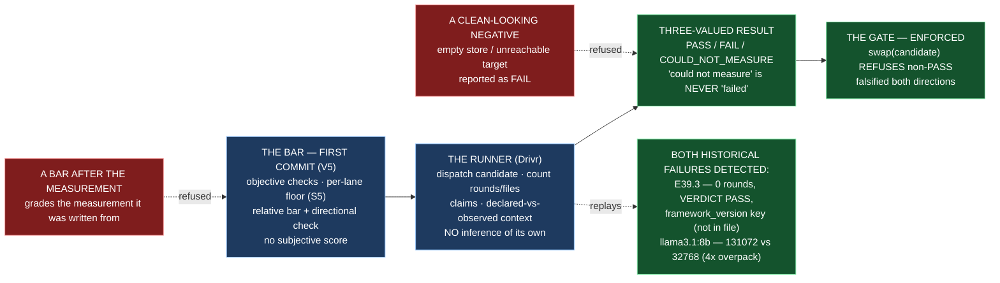

# Epic E46.5 — SN-37's Qualification Gate, Bar Committed First

## Context

**What would make a model swap safe, stated before any model is graded?**

E46.5 closes M46 by formalizing the gate that M41 explicitly declined to build. E41.2's spec is
blunt about the split: *"This epic builds the minimal instrument. M46 formalizes the gate.
Building the gate here would be taking M46's work."* The instrument — `bin/successful-nothing-instrument`
in `ai-project-system`, with `tests/test_successful_nothing_instrument.py` — is the **measuring
device**: it records tool rounds, files changed, and claims-resolution, and reaches a verdict
from those counts and nothing else. **E46.5 builds the gate** that stands between a model and a
swap: run the suite, gate the swap, record the result — **no inference of its own** (phase spec
§P12.6, SN-37).

**V5 is the binding shape, and it is about precedence, not content.** *"A bar written after the
measurement grades the measurement it was written from."* E45.1 proved the form works: it
committed the bar as the **first commit on its branch** (`da0c66a`, verified by the Phase Chat),
then measured against it. E41.2's D3-as-first-commit is the same form one milestone earlier. E46.5
carries it: **the bar is the first commit on the branch, checkable by `git log` from the branch
point** — a property of the history, not a claim.

**The two recorded historical failures the suite must detect (V5), each named and cited:**

1. **E39.3** (`P11-M39-E39.3`) — the `epic_qa` dispatch returned `VERDICT: PASS` on all 26 rules
   with **zero tool rounds**, citing a `framework_version` key `.ai-project.yml` does not contain,
   **with the read-only tools genuinely advertised** (the advertising is what makes the zero a
   finding, not a configuration error). Committed transcript at
   `.ai-project/artifacts/agentic-runs/P11-M39-E39.3/qa-transcript.json` + `qa-run-metadata.json`.
2. **The `llama3.1:8b` overpack** (`P12-M41-E41.1`) — declared context limit **131,072** against a
   true **32,768**, a **4× overpack**, previously unrecorded anywhere in the corpus (E41.1's
   §4.3 "the overpack is not one entry. It is two."). A model swapped in on its declared limit
   would silently truncate four times its actual capacity.

**The bar's content is settled above this chat and is not re-derived here** (phase spec §P12.6,
SN-37): **relative and objective** — run the suite against the incumbent first; the candidate
must be **no worse on every objective check and strictly better on at least one**, over an
**absolute floor** of `tool rounds > 0` and `files changed > 0` (**per-lane as ruled, S5**:
`epic_dev` keeps both; `epic_qa` takes `tool rounds > 0` AND `claims resolve`, with `files changed`
recorded but not scored). **No subjective quality score** — judgment is precisely what cannot be
trusted from the thing under test.

**Two further bindings this epic inherits, each a phase-scale finding:**

- **"Measured and failed" vs "could not measure" (phase spec v1.2.0).** A runner that cannot tell
  an empty credential store from an unreachable target reports a clean-looking negative and fails
  at the thing it was commissioned for. The `XDG_DATA_HOME` self-correction (E41.1 v1.2.0) is the
  worked instance: a snap-confined shell read a non-existent `auth.json` and reported zero
  credentials. **The qualification result is three-valued** — `PASS` / `FAIL` / `COULD_NOT_MEASURE`
  — and `COULD_NOT_MEASURE` is **not** `FAIL`. This is the V2d pattern (*empty means UNDETERMINED
  and escalates*) at the qualification layer, its fifth application.
- **The incumbent has moved (SN-41 baseline lineup, 2026-08-27).** The lane incumbent is now
  `remote:deepseek-v4-flash`, not the parked `qwen3-coder:30b` that E41.2 baselined. The bar
  states the *rule* (relative to incumbent); **which incumbent the first candidate is measured
  against is a design decision, not assumed here** — and a candidate run against an unreachable
  remote target is a `COULD_NOT_MEASURE`, never a `FAIL`.

## Problem Statement

**A bar written after the data grades the data it was written from; a gate that cannot tell a
failed model from an unreachable one reports a clean-looking negative; and an "enforced" gate that
is actually only documented leaves the swap open to the exact disposition this phase exists to
close.**

Three failure shapes, all the phase's own finding wearing a qualification hat:

1. **The bar grades the measurement it was written from.** A pass threshold chosen after seeing the
   incumbent and the candidate is not a gate; it is a rationalization. The bar must precede the
   suite, as its own commit, or the "gate" is a ceremony.
2. **A confident verdict with nothing behind it passes.** E39.3 passed any subjective read — the
   verdict prose was confident, the tools were advertised, the exit was clean. It failed only on
   counts. A gate without the *counts* (rounds, files, claims, context) is the gap E33.2 and E39.3
   both walked through.
3. **"Could not measure" reads as "failed" (or worse, as "passed").** A runner that reports `FAIL`
   when it could not run — no credentials, unreachable target, empty store — manufactures a false
   negative; a runner that reports `PASS` from a run that never happened manufactures the
   successful nothing the gate exists to detect. The distinction must be a first-class state.

## Goals

By the end of this Epic, the system must:

1. **Commit the bar first** — the pass conditions for a model swap, as the first commit on the
   branch, before any suite runs.
2. **Build the qualification suite** — the gate a model must pass before it may be swapped in,
   with **Drivr as the runner**: run the suite, gate the swap, record the result, no inference.
3. **Detect both historical failures** — E39.3 and the `llama3.1:8b` overpack, each named and cited.
4. **Enforce, not document** — a model that has not passed cannot be swapped in, by a code path
   that refuses, not a paragraph that requests.

## Non-Goals

This Epic explicitly does **not** aim to:

- **Re-derive the instrument.** `bin/successful-nothing-instrument` is E41.2's, measured and
  validated in both directions. The gate *uses* its checks; it does not re-implement them, and it
  does not become a second source of truth about what a tool round or a claim is.
- **Change any model value, policy row, or lineup entry.** The SN-41 baseline lineup is an input;
  no swap is performed here.
- **Flip `model_verification` to `blocking`.** That is HQ's last act of P12's closure, not this
  epic's.
- **Re-open S5.** The per-lane floor is **ruled** (CFO, 2026-08-20). Apply it; do not re-derive
  it; do not reach it by enabling a mutating QA tool set.
- **Measure candidates against the incumbent here** unless the incumbent is reachable; the bar
  states the rule, and an unreachable target is a `COULD_NOT_MEASURE`, never a `FAIL`.

## Scope of Work

### 1. The bar, as the first commit (D1)

**The pass conditions for a model swap, committed before the suite runs.**

**Must include:**
- The **objective checks**, itemized: tool rounds, files changed, claims resolving against files
  that exist, and context overpack (declared vs observed loaded limit).
- The **absolute floor, per lane as ruled**: `epic_dev` — `rounds > 0` AND `files changed > 0`;
  `epic_qa` — `rounds > 0` AND `claims resolve`, `files changed` **recorded but not scored**.
- The **relative bar**: no worse on every objective check, strictly better on at least one, over
  the absolute floor — **with the directional check named** (the pre-written test for `epic_dev`,
  the ground-truth defect set for `epic_qa`, per E41.2 v1.0.2), because "strictly better" has
  nothing else objective to attach to.
- The **three-valued result**: `PASS` / `FAIL` / `COULD_NOT_MEASURE`, with `COULD_NOT_MEASURE`
  named as distinct from `FAIL` (never a clean-looking negative).
- The **no-subjective-score** rule, stated.

### 2. The qualification gate (D2)

**The runner that gates the swap.** In Drivr, `drivr/qualification/` (beside `execution`,
`scheduling`, `surface`), the runner that: dispatches a candidate through the lane (reusing
Drivr's execution adapter and judgment evidence path, which already record tool rounds via the
ledger and files changed), applies the bar, and records the result.

**Must include:**
- A `QualificationResult` enum, three-valued (`PASS` / `FAIL` / `COULD_NOT_MEASURE`), so the
  result cannot collapse to a boolean.
- The **enforcement**: a `swap` path that **refuses** a candidate whose result is not `PASS` —
  enforced by code, with a test that a non-passed candidate cannot be swapped in (falsified:
  remove the refusal, the swap proceeds, the test fails).
- The **overpack check** — declared context limit vs observed loaded context, reusing
  `drivr/execution/context_limits.observe_loaded_context`; a declared/observed ratio above a
  stated threshold is a `FAIL`.

### 3. Both historical failures detected (D3)

**The suite detects E39.3 and the `llama3.1:8b` overpack, each named and cited.**

**Must include:**
- A replay/validation that flags **E39.3** (zero tool rounds + `VERDICT: PASS` + the
  `framework_version` claim that does not resolve) and the **`llama3.1:8b` overpack** (declared
  131,072 vs true 32,768) — each **named and cited** to its artifact, with the counts shown.
- The distinction preserved: E39.3 is caught by the *counts*; the overpack is caught by the
  *context* check — different mechanisms, both named (E41.2's S4 shape).

## Deliverables

- [ ] **D1** — The bar, as the first commit on the branch (checkable by `git log`)
- [ ] **D2** — The qualification gate: the three-valued result, the runner, the enforced no-swap
      refusal, the overpack check
- [ ] **D3** — Both historical failures detected, each named and cited (E39.3; the `llama3.1:8b`
      overpack)
- [ ] Structural diagram (Mermaid, inline, **no ComfyUI**)
- [ ] **Epic Delivery Notice**

## Binding Constraints

Settled above this epic — **not re-decidable here** (milestone spec §Binding Constraints):

1. **BC6 / V5 — The qualification bar is committed before the suite runs**, as its own commit,
   checkable by `git log` from the branch point.
2. **BC9 — A Drivr deliverable measured only on an epic branch is not done.** The gate, the bar,
   and their tests must be on Drivr `main`.

## Hard Constraint (binding — carried to every Epic)

> **A surface that *validates* a governance rule can be argued with; a surface that cannot
> *represent* the rule's violation has nothing to argue about.**

1. **Itemize, never count.** The objective checks and the two historical failures are itemized
   and cited, never "two failures" or "three checks".
2. **Falsify in both directions.** A gate that has never refused a swap has not been shown to
   enforce anything; a check that has never caught a re-introduced defect has not been shown to
   detect anything.
3. **Record before improving.** A defect found is recorded before it is fixed.
4. **Re-measure the harness claim you rest on, at the moment you rest on it.**
5. **Finish on `main`.** A Drivr deliverable measured only on an epic branch is **not done**
   (BC9).

## Design Decisions Delegated — decide, document, proceed

1. **How the gate reuses the instrument's checks without re-implementing them.** The instrument
   lives in `ai-project-system`; the runner lives in Drivr. State the relationship explicitly —
   the gate may re-implement the *counters* (Drivr's ledger already records tool rounds and files
   changed) but must not silently diverge from the instrument's definitions of a tool round or a
   claim.
2. **The overpack threshold** — what declared/observed ratio constitutes an overpack `FAIL`, with
   the 4× (llama3.1:8b) and 8× (qwen3-coder:30b) cases as the worked values.
3. **Which incumbent the first candidate is measured against**, given SN-41 moved the lanes to
   `remote:deepseek-v4-flash` — with the constraint that an unreachable incumbent yields
   `COULD_NOT_MEASURE`, never a `FAIL`.
4. **The enforcement's shape** — a `swap` operation that refuses non-`PASS`, or a gate the swap
   path must pass through — with the test that a non-passed candidate cannot be swapped.

**Escalate instead of deciding:** anything that would loosen the bar after seeing data; reaching
the floor by enabling a mutating QA tool set (Criterion 2, refused in advance); re-opening S5; any
runner that cannot distinguish `COULD_NOT_MEASURE` from `FAIL`.

## Definition of Done

Epic E46.5 is complete when:

- [ ] The bar is the first commit on the branch, shown by `git log` from the branch point
- [ ] Both historical failures are detected by the suite, each named and cited (E39.3; the
      `llama3.1:8b` overpack)
- [ ] A model that has not passed cannot be swapped in — enforced, not documented (a refusal path,
      falsified in both directions)
- [ ] The result is three-valued — `PASS` / `FAIL` / `COULD_NOT_MEASURE` — with `COULD_NOT_MEASURE`
      never reading as `FAIL`
- [ ] The per-lane floor is applied as ruled (S5), with the version stated; Criterion 2 is intact
- [ ] Every claim states the layer, repository, ref and date (`P11-GH-2` + the milestone Hard Constraint)
- [ ] The gate, the bar, and their tests are on **Drivr `main`**, not only on an epic branch (BC9)
- [ ] Drivr suite green at **471** plus this epic's changes, with the invocation and the ref stated
- [ ] Delivery Notice committed; PR opened from the Drivr epic branch to Drivr `main`

## Acceptance Criteria

- [ ] The bar is the first commit on the branch, shown by `git log` from the branch point
- [ ] Both historical failures are detected by the suite, each named and cited
- [ ] A model that has not passed cannot be swapped in — enforced, not documented

## Technical Constraints

**Repository:** the gate lands in **Drivr** (`~/soft-dev/drivr`, `main` at `4872107`), not in
`ai-project-system`. This repository's suite does not cover Drivr, and *"suite green here"* is not
verification.
**In scope:** a new `drivr/qualification/` package (the result enum, the runner, the overpack
check, the enforcement), its tests, and the bar (first commit on the Drivr epic branch). The
checks **reuse** Drivr's execution/ledger evidence (`drivr/judgment`, `drivr/execution/context_limits`).
**Do not touch:** `bin/successful-nothing-instrument` (E41.2's, in `ai-project-system`);
`.ai-project.yml`; `model-routing-policy.md`; `drivr/judgment/completion.py`; the `epic_qa` tool
set.
**Invocation:** `python3 -m pytest -q` from the Drivr root; `PYTHONPATH=. pytest -q` in this
repository if any governance edit lands.
**Baselines:** Drivr **471** at `main` `4872107` (re-measured 2026-09-04, G2);
`ai-project-system` **767 passed** this run (environment-dependent — `766+1 skipped` / `767` /
`766 passed + 1 failed` are the same suite; the variance is the live-ComfyUI integration test).

## Dependencies

**Internal**
- **M45 (gate, satisfied)** — `docs/m46-completion-signal-contract.md`, Drivr `main` `4872107`.
- **E41.2** — the instrument and the per-lane floor (S5, ruled), which the gate formalizes.
- **E41.1** — the overpack finding (the `llama3.1:8b` 4× case) the gate must detect.

**External**
- **Drivr at `~/soft-dev/drivr`, `main` `4872107`** — re-measured for this spec; re-measure again
  at the branch point (G2).
- **The incumbent's reachability** — a remote target that cannot be measured is a
  `COULD_NOT_MEASURE`, never a `FAIL`; availability is the CFO's (phase spec §Dependencies).

**Blockers**
- None at planning. The instrument exists; the gate is greenfield in Drivr.

## Timeline

**Estimated Effort:** 1 session — the bar and the gate are bounded; the two replay detections are
the substance.
**Target Completion:** **last** — E46.5 closes the milestone's five epics.
**Actual Completion:** In progress.

## Execution Notes

**Order, and it is chosen so a wrong gate is caught before it gates anything:**
1. **Commit the bar first** (D1) — before any suite code. `git log` must show it as the first
   commit on `epic/P12-M46-E46.5`.
2. Re-measure the instrument's checks, the ledger path, and `context_limits` at your branch point
   (G2).
3. Build the gate: the three-valued result, the runner, the overpack check (D2).
4. Replay the two historical failures (D3) — E39.3 and the overpack — each named and cited.
5. Land the enforcement and falsify it in both directions.
6. Run the Drivr suite; state the invocation and the ref.

**Traps this project has already paid for:**

- **A bar written after the measurement.** The bar is the *first commit* — a threshold committed
  after the candidate is seen grades the measurement it was written from (V5).
- **`COULD_NOT_MEASURE` reading as `FAIL`.** The `XDG_DATA_HOME` correction (E41.1 v1.2.0) is the
  worked instance: an empty credential store is not an unreachable target, and neither is a
  `FAIL`. The three-valued result is the V2d pattern, fifth application.
- **The exit code as a signal.** E33.2 Run A exited 0 having done nothing; Run B exited 2 having
  shipped mergeable work. Record it; never score it (E41.2's S2).
- **Re-implementing the instrument's checks silently.** If the gate's definition of a tool round
  diverges from the instrument's, two instruments disagree and the gate has become a second source
  of truth. State the relationship; do not diverge silently.
- **Two repositories, two pushes, two `origin`s** — and `git status` before every commit.
- **Finishing on the epic branch only** (BC9).

## Related Documents

- [M46 Milestone Spec](P12-M46__milestone-spec.md) — E46.5 Epic Detail, V5, Binding Constraints,
  Hard Constraint
- [M46 Milestone Execution Chat Starter](P12-M46__milestone-execution-chat-starter.md)
- [P12 Phase Spec](P12__phase-spec.md) — §P12.6 (M46, SN-37), success criterion 18
- [E45.1 Bar](P12-M45-E45.1__bar.md) — the worked precedent for the bar-committed-first form
- [E41.2 Spec](P12-M41-E41.2__spec__successful-nothing-instrument-and-incumbent-baseline.md) — the
  instrument and the per-lane floor (S5, ruled)
- [E41.1 Record](P12-M41-E41.1__record__target-resolution-reachability-and-routability.md) — the
  `llama3.1:8b` overpack finding and the `XDG_DATA_HOME` self-correction
- `.ai-project/artifacts/agentic-runs/P11-M39-E39.3/qa-transcript.json` — E39.3's fabrication
- Drivr `drivr/execution/context_limits.py`, `drivr/execution/opencode.py`,
  `drivr/scheduling/scheduler.py` at `main` `4872107`
- [PROJECT-SYSTEM-GUIDELINES.md](../../../governance/PROJECT-SYSTEM-GUIDELINES.md)
- [AI-OPERATING-GUIDELINES.md](../../../governance/AI-OPERATING-GUIDELINES.md)

## Visual Bindings

**Visual binding**
- **Link:** (inline — Structural diagram; no hosted link needed per AOG §17.3/§17.5)
- **What:** diagram
- **Level:** Epic
- **State:** proposed

- **Description:** E46.5 formalizes SN-37's qualification gate. The bar is committed as the first
  commit on the branch (V5/E45.1's precedent) — objective checks, the per-lane floor as ruled
  (S5), the relative bar with a directional check, no subjective score. Drivr is the runner:
  dispatch, count, no inference. The result is three-valued (`PASS` / `FAIL` /
  `COULD_NOT_MEASURE`), so a clean-looking negative — an empty store or unreachable target read as
  `FAIL` — is refused, and the gate enforces (by code, not prose) that a non-passed model cannot be
  swapped in. Both historical failures — E39.3's successful nothing and the `llama3.1:8b` overpack —
  are detected, each named and cited. Proposed-track Structural diagram (AOG §17.3/§17.6), Mermaid,
  no ComfyUI.

## Notes

- **This epic is the formalization M41 pointed at, and the split is why it lands here.** E41.2
  built a measuring device deliberately without the gate, because a gate built in M41 would have
  been *the milestone things get put in*. E46.5's gate is the gate, and the bar-committed-first
  form is the property that makes it a gate rather than a post-hoc rationalization.

- **`COULD_NOT_MEASURE` is the fifth V2d, and it is load-bearing.** The phase spec added it (v1.2.0)
  after E41.1's `XDG_DATA_HOME` self-correction showed a runner reading a non-existent credential
  store and reporting a clean-looking negative. A qualification gate that reports `FAIL` on an
  empty store manufactures a false negative; one that reports `PASS` on a run that never happened
  manufactures the successful nothing it was built to detect. Three-valued, or it is not a gate.

- **"Enforced, not documented" is the difference between a gate and a suggestion.** The acceptance
  criterion does not ask for prose stating that swaps should be gated; it asks for a code path that
  refuses a non-passed swap, falsified in both directions — remove the refusal, the swap proceeds,
  the test fails.

## Changelog

| Version | Date | Change |
|---|---|---|
| 1.0.0 | 2026-09-04 | Initial E46.5 spec, from the M46 milestone spec v1.0.0 (E46.5 Epic Detail, V5, Binding Constraints, Hard Constraint), the phase spec §P12.6 (SN-37) and its v1.2.0 "measured vs could-not-measure" criterion, E41.2's instrument and ruled per-lane floor (S5), E41.1's overpack finding, and Drivr source re-measured at `main` `4872107` (G2; Drivr suite 471 passed, `ai-project-system` 767 passed, both 2026-09-04). Scopes the bar as the first commit (E45.1's `da0c66a` precedent), a Drivr-side qualification gate with a three-valued result (`PASS` / `FAIL` / `COULD_NOT_MEASURE`, the V2d pattern's fifth application) and an enforced no-swap refusal falsified in both directions, and detection of both historical failures (E39.3's successful nothing; the `llama3.1:8b` 4× overpack), each named and cited. Records that the lane incumbent moved to `remote:deepseek-v4-flash` (SN-41) and that an unreachable target is `COULD_NOT_MEASURE`, never `FAIL`. No scope, ordering, gate or acceptance-criterion change from the milestone spec. |
