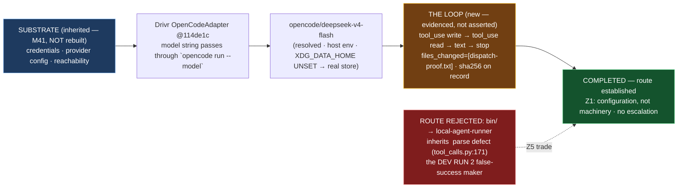

# Delivery Notice: P12-M47-E47.1 — Remote Agentic Dispatch: Establish It, or Escalate

> **The route is established: Drivr's OpenCode adapter dispatches a remote engine today, and the
> record states what that route carries.** The E47.1 spec and the M47 milestone spec are cited by
> path and branch, never by version or sha. `merge_details` describe a merge that has not happened
> and are unfillable at delivery time (`P10-GH-4`, restated). Merge authorization follows the M47
> Milestone Chat's Stage-2 review, and the parent performs the merge (§11.6).

---

## Summary

**One remote dispatch through Drivr's OpenCode adapter completed, and the loop claim is evidenced by
what the run did, not by its exit code.** Model `opencode/deepseek-v4-flash` (the `epic_manual`
value), host environment, a task requiring a file write: the engine made **two real tool calls**
(`write` then `read`), changed one file, answered, and stopped. The produced file exists on disk
with the exact requested contents (sha256
`ebcac74f7f8af95d8248ef0dfbbdf7dee4d041cb8c006ea85cbbb1eced8dd24c`).

**Z1's flip trigger did not fire — this was configuration, not machinery.** The provider-generic
adapter took the remote model as a model string with no code change; SN-42 is absorbed into M47. **No
escalation; this is a completed dispatch.**

## Verification layer, time, scope and ref (`P11-GH-2`)

| Axis | Value |
|---|---|
| **Layer** | One dispatch through `OpenCodeAdapter.execute` (Drivr). No Drivr module changed; no `ai-project-system` code changed. |
| **Time** | **2026-09-04** |
| **Scope (Drivr)** | `~/soft-dev/drivr`, `main` @ **`114de1c`** — used, not modified. `local-agent-runner` (`4ec1e8f`) — quoted as the rejected-route defect, not modified. |
| **Scope (governance repo)** | `ai-project-system`, branch **`epic/P12-M47-E47.1`**, branched from **`milestone/M47` @ `e8ef20d`**. Adds the record, raw dispatch artifacts, and this Delivery Notice. The E47.1 spec (`dcdff34`) and the M47 milestone spec (v1.1.0, `e8ef20d`) needed no amendment. |
| **Repo for `git log`** | Governed refs pinned and `git log`-ed at the branch point (`P11-GH-1` step 5): no post-branch amendments. Drivr at `114de1c`, the spec's pin, re-verified. |
| **Suite** | No code landed, so no suite gate applies; the relevant verification is the dispatch evidence (tool-call events + a changed file on disk), never an exit status. |

## Model verification (`advisory` — stated plainly, per chat-hierarchy.md)

Harness-reported model: **`opencode/deepseek-v4-flash`**. Configured `epic_manual`:
**`remote:deepseek-v4-flash`**. **No mismatch.**

## Re-measured at build time, not trusted from the spec (G2)

`opencode.py:164` — `        provider_name, _, bare_model = model.partition("/")`; `:192` —
`    def build_argv(`; `:196` — `        argv = [executable, "run", "--model", request.model, "--format", "json"]` —
all verified verbatim at Drivr `114de1c`. `local_agent_runner/tool_calls.py:171` —
`def parse_tool_call(` — verified verbatim at `4ec1e8f`. Both unchanged from the spec's planning
measure.

## Deliverables

- [x] **D1** — One completed remote dispatch, with the machinery-versus-configuration judgment stated (**configuration**; flip trigger did not fire)
- [x] **D2** — Z5's inheritance explicit: route = Drivr's adapter, carrying the located `XDG_DATA_HOME` credential defect (repair stated); the `local-agent-runner` parse-defect route rejected as the false-success maker
- [x] **D3** — The M41 substrate inherited, not rebuilt; inherited-versus-new boundary stated (new = the loop)
- [x] **D4** — Effective credential path recorded per dispatch: resolved to `~/.local/share/opencode/auth.json`; empty would have been `UNDETERMINED`
- [x] **D5** — Loop claim separated from transport claim; the loop is evidenced by `tool_use` events + a changed file
- [x] A recorded dispatch — **completed**, not "not yet"
- [x] **Epic Delivery Notice** — this artifact

## Definition of Done — see the record for the full itemization

Every item is checked in `P12-M47-E47.1__record__remote-agentic-dispatch.md` §Definition of Done.
The three easiest to skip are all present: the effective credential path is recorded (**resolved**,
not empty, so not `UNDETERMINED`); the loop claim is stated separately from the transport claim; and
Z5's inheritance is explicit (what the route carries, not merely which path works).

## Visual Bindings

**Visual binding**
- **Link:** (inline — Structural diagram; no hosted link needed per AOG §17.3/§17.5)
- **What:** diagram
- **Level:** Epic
- **State:** implemented

- **Description:** E47.1 established remote agentic dispatch. It inherited the M41 transport
  substrate (credentials, provider config, reachability) unmodified and ran one real dispatch
  through Drivr's OpenCode adapter on `opencode/deepseek-v4-flash`: two tool calls executed
  (`write`, `read`), one file changed, answer given, `reason: stop` — the loop evidenced by what the
  run did. The route carries the located `XDG_DATA_HOME` credential defect (repair stated; effective
  path recorded); the `local-agent-runner` route was rejected because it inherits the unowned
  `<function=…>` parse defect that produced DEV RUN 2. Z1's flip trigger did not fire — configuration,
  not machinery. Implemented-track Structural diagram (AOG §17.3/§17.6), Mermaid, no ComfyUI.

---

## Status

⏸️ **Stopped. Awaiting Milestone Chat review and authorization. Not merged.** Per this epic's
Starter and §11.6, merge authorization for the Delivery Notice PR normally follows the Milestone
Chat's Stage-2 review, and the parent (the M47 Milestone Chat) performs the merge. This delivery is
the **first attempt** — the rework limit (3 attempts plus any written `+1`, PSG §11.6 / the SN-36/37
`+1` amendment) has not been touched.

No Drivr change was required, so there is no Drivr branch, push, or PR to open; the delivery is
record-only on `ai-project-system` (`epic/P12-M47-E47.1` → PR to `milestone/M47`), which I will open.

Epic E47.1 execution complete. Epic Delivery Notice produced. Awaiting Milestone Chat review and
authorization.